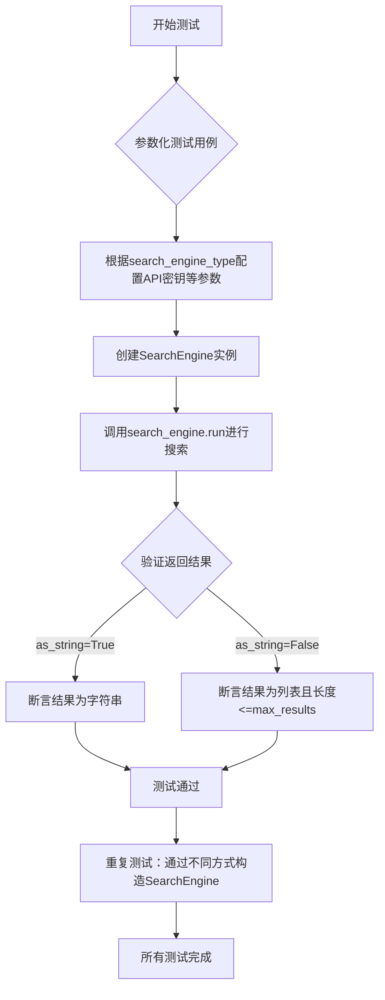
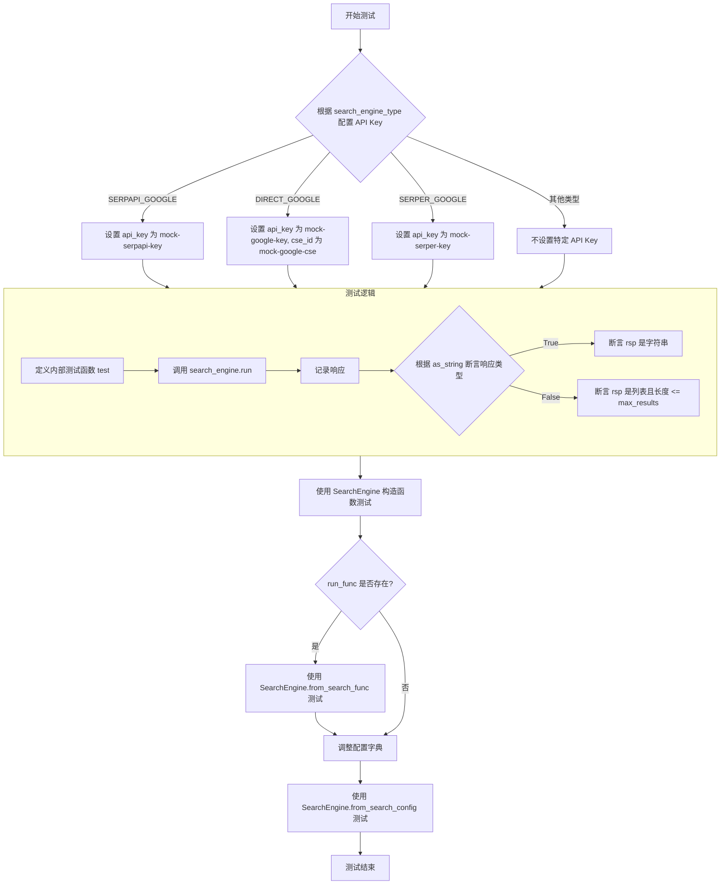
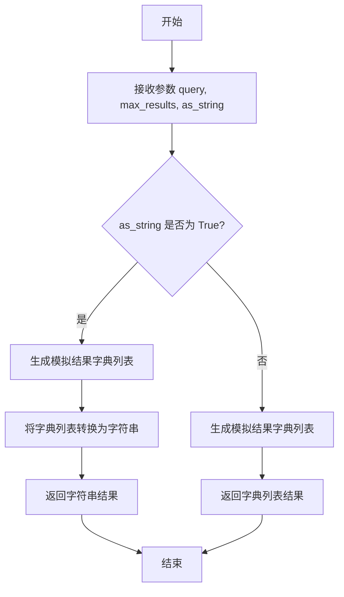

# `.\MetaGPT\tests\metagpt\tools\test_search_engine.py` 详细设计文档

该文件是一个针对元智能体框架中搜索引擎模块的单元测试文件，核心功能是使用pytest框架对SearchEngine类进行异步测试，验证其在不同搜索引擎类型（如SERPAPI_GOOGLE、DIRECT_GOOGLE、SERPER_GOOGLE、DUCK_DUCK_GO、BING、CUSTOM_ENGINE）和不同参数配置（如返回格式、结果数量）下的正确性、健壮性和一致性。测试通过参数化覆盖多种场景，并使用模拟对象（MockSearchEnine）来隔离外部依赖。

## 整体流程



## 类结构

```
test_search_engine.py
├── MockSearchEnine (模拟搜索引擎类)
│   └── run (异步运行方法)
└── test_search_engine (主测试函数)
```

## 全局变量及字段


### `logger`
    
用于记录日志的全局日志记录器实例。

类型：`Logger`
    


### `pytest`
    
用于编写和运行测试的测试框架模块。

类型：`Module`
    


### `SearchEngineType`
    
定义不同搜索引擎类型的枚举类。

类型：`Enum`
    


### `SearchConfig`
    
用于配置搜索引擎的配置类。

类型：`Class`
    


### `SearchEngine`
    
搜索引擎的核心类，提供搜索功能。

类型：`Class`
    


### `MockSearchEnine`
    
模拟搜索引擎的类，用于测试。

类型：`Class`
    


    

## 全局函数及方法

### `test_search_engine`

这是一个使用 `pytest` 编写的异步测试函数，用于测试 `SearchEngine` 类在不同配置下的功能。它通过参数化测试覆盖了多种搜索引擎类型和配置组合，验证 `SearchEngine.run` 方法在不同参数下的行为是否符合预期。

参数：

- `search_engine_type`：`SearchEngineType`，枚举类型，指定要测试的搜索引擎类型。
- `run_func`：`Callable`，可调用对象，当搜索引擎类型为 `CUSTOM_ENGINE` 时，提供自定义的搜索函数。
- `max_results`：`int`，整数，指定搜索返回的最大结果数量。
- `as_string`：`bool`，布尔值，指定返回结果的格式。为 `True` 时返回字符串，为 `False` 时返回字典列表。
- `search_engine_mocker`：`pytest fixture`，pytest 夹具，用于在测试中模拟或替换外部搜索引擎的调用。

返回值：`None`，此测试函数不返回任何值，其目的是通过断言验证功能正确性。

#### 流程图



#### 带注释源码

```python
@pytest.mark.asyncio  # 标记此测试函数为异步函数
@pytest.mark.parametrize(  # 参数化测试装饰器，定义多组测试参数
    ("search_engine_type", "run_func", "max_results", "as_string"),  # 参数名称
    [  # 参数组合列表，每组对应一次测试运行
        (SearchEngineType.SERPAPI_GOOGLE, None, 8, True),
        (SearchEngineType.SERPAPI_GOOGLE, None, 4, False),
        (SearchEngineType.DIRECT_GOOGLE, None, 8, True),
        (SearchEngineType.DIRECT_GOOGLE, None, 6, False),
        (SearchEngineType.SERPER_GOOGLE, None, 8, True),
        (SearchEngineType.SERPER_GOOGLE, None, 6, False),
        (SearchEngineType.DUCK_DUCK_GO, None, 8, True),
        (SearchEngineType.DUCK_DUCK_GO, None, 6, False),
        (SearchEngineType.BING, None, 6, False),
        (SearchEngineType.CUSTOM_ENGINE, MockSearchEnine().run, 8, False),
        (SearchEngineType.CUSTOM_ENGINE, MockSearchEnine().run, 6, False),
    ],
)
async def test_search_engine(  # 异步测试函数定义
    search_engine_type,  # 搜索引擎类型参数
    run_func: Callable,  # 自定义搜索函数参数
    max_results: int,  # 最大结果数参数
    as_string: bool,  # 返回格式标志参数
    search_engine_mocker,  # pytest fixture，用于模拟外部依赖
):
    # Prerequisites
    # 准备搜索引擎配置字典，基础键为 engine 和 run_func
    search_engine_config = {"engine": search_engine_type, "run_func": run_func}

    # 根据不同的搜索引擎类型，向配置字典中添加模拟的 API 密钥
    if search_engine_type is SearchEngineType.SERPAPI_GOOGLE:
        search_engine_config["api_key"] = "mock-serpapi-key"
    elif search_engine_type is SearchEngineType.DIRECT_GOOGLE:
        search_engine_config["api_key"] = "mock-google-key"
        search_engine_config["cse_id"] = "mock-google-cse"
    elif search_engine_type is SearchEngineType.SERPER_GOOGLE:
        search_engine_config["api_key"] = "mock-serper-key"

    # 定义内部异步测试函数，用于对给定的 search_engine 实例执行测试
    async def test(search_engine):
        # 使用固定的查询词“metagpt”执行搜索
        rsp = await search_engine.run("metagpt", max_results, as_string)
        # 记录响应，便于调试
        logger.info(rsp)
        # 根据 as_string 标志断言响应类型
        if as_string:
            assert isinstance(rsp, str)  # 应为字符串
        else:
            assert isinstance(rsp, list)  # 应为列表
            assert len(rsp) <= max_results  # 列表长度不应超过请求的最大结果数

    # 测试路径1：使用配置字典直接实例化 SearchEngine
    await test(SearchEngine(**search_engine_config))
    
    # 调整配置字典的键名，以适配 SearchConfig 和 from_search_func 的接口
    search_engine_config["api_type"] = search_engine_config.pop("engine")
    
    # 如果提供了自定义搜索函数 run_func
    if run_func:
        # 测试路径2：使用 SearchEngine 的类方法 from_search_func 创建实例
        await test(SearchEngine.from_search_func(run_func))
        # 继续调整配置字典的键名
        search_engine_config["search_func"] = search_engine_config.pop("run_func")
    
    # 测试路径3：使用 SearchConfig 对象和 from_search_config 方法创建 SearchEngine 实例
    await test(SearchEngine.from_search_config(SearchConfig(**search_engine_config)))
```

### `MockSearchEnine.run`

该方法是一个模拟搜索引擎的实现，用于在测试环境中生成模拟的搜索结果，避免调用真实的外部搜索引擎API。

参数：

- `query`：`str`，搜索查询的关键词
- `max_results`：`int`，可选参数，默认值为8，指定返回的最大结果数量
- `as_string`：`bool`，可选参数，默认值为True，控制返回结果的格式。为True时返回字符串格式，为False时返回字典列表格式

返回值：`str | list[dict[str, str]]`，根据`as_string`参数的值，返回格式化的搜索结果字符串或包含搜索结果的字典列表

#### 流程图



#### 带注释源码

```python
async def run(self, query: str, max_results: int = 8, as_string: bool = True) -> str | list[dict[str, str]]:
    # 生成模拟搜索结果列表，每个结果包含url、title和snippet字段
    rets = [
        {"url": "https://metagpt.com/mock/{i}", "title": query, "snippet": query * i} for i in range(max_results)
    ]
    # 根据as_string参数决定返回格式：字符串或字典列表
    return "\n".join(rets) if as_string else rets
```

## 关键组件


### 搜索引擎抽象与统一接口

定义了 `SearchEngine` 类，作为对不同后端搜索引擎（如 Google、Bing、DuckDuckGo）或自定义搜索函数的统一抽象和封装，提供一致的异步 `run` 方法进行查询。

### 搜索引擎类型枚举

定义了 `SearchEngineType` 枚举，用于明确标识和区分项目支持的各种搜索引擎后端（如 SERPAPI_GOOGLE, DIRECT_GOOGLE, SERPER_GOOGLE, DUCK_DUCK_GO, BING, CUSTOM_ENGINE），是配置驱动的关键。

### 搜索配置管理

定义了 `SearchConfig` 类，用于集中管理和传递搜索引擎的配置参数（如引擎类型、API密钥、自定义函数等），实现配置与代码逻辑的解耦。

### 自定义搜索引擎模拟

定义了 `MockSearchEnine` 类，作为一个模拟的搜索引擎实现，用于在测试中替代真实的外部搜索引擎 API 调用，确保测试的独立性和可重复性。

### 参数化测试框架

利用 `pytest.mark.parametrize` 装饰器，构建了一个参数化测试用例 `test_search_engine`，用于系统性地测试 `SearchEngine` 在不同配置（搜索引擎类型、结果数量、返回格式）下的行为。


## 问题及建议


### 已知问题

-   **测试类名拼写错误**：`MockSearchEnine` 类名拼写错误，应为 `MockSearchEngine`。这可能导致代码可读性降低，并在未来引用时造成混淆。
-   **测试数据缺乏多样性**：`MockSearchEnine.run` 方法返回的模拟数据过于简单和规律（`title` 和 `snippet` 仅为查询字符串的重复），无法有效测试搜索引擎对不同结构、不同内容真实数据的处理逻辑和格式化能力。
-   **配置构建逻辑重复**：测试函数 `test_search_engine` 中，针对不同 `SearchEngineType` 构建 `search_engine_config` 的逻辑是重复的 `if-elif` 链。当新增搜索引擎类型时，需要在此处添加新的分支，违反了 DRY（Don‘t Repeat Yourself）原则，增加了维护成本。
-   **测试断言不够充分**：测试仅验证了返回结果的类型（`str` 或 `list`）以及列表长度，缺乏对返回数据内容、格式（例如字典键是否存在）、以及在不同 `as_string` 参数下数据转换正确性的深入验证。
-   **潜在的网络依赖与测试隔离**：虽然测试中使用了模拟对象（`MockSearchEnine`）和模拟配置，但测试参数化列表包含了所有真实的搜索引擎类型（如 `SERPAPI_GOOGLE`）。如果测试环境没有正确配置这些外部API的密钥或网络不通，可能导致测试失败，使得测试的稳定性和可重复性依赖于外部服务。

### 优化建议

-   **修正拼写错误**：将 `MockSearchEnine` 重命名为 `MockSearchEngine`，以提高代码的准确性和专业性。
-   **增强模拟数据的真实性和复杂性**：改进 `MockSearchEngine.run` 方法，使其返回更接近真实搜索引擎结果的数据结构，包含多样化的标题、摘要片段和URL，并可以模拟分页、空结果等边界情况。
-   **重构配置构建逻辑**：将构建 `search_engine_config` 的 `if-elif` 逻辑抽取为一个独立的辅助函数（例如 `_build_config_for_type`），根据 `SearchEngineType` 返回对应的基础配置字典。这样可以使测试函数的主体逻辑更清晰，并便于集中管理配置映射。
-   **加强测试断言**：增加对返回结果内容的断言检查。例如，当 `as_string=False` 时，检查列表中的每个元素是否为字典，且包含预期的键（如 `'url'`, `'title'`, `'snippet'`）；当 `as_string=True` 时，检查字符串是否由这些字典信息正确拼接而成。也可以验证 `max_results` 参数是否被正确遵守。
-   **改进测试策略以提升稳定性**：
    -   **明确测试范围**：考虑将测试明确分为两类：1) 单元测试：仅测试 `SearchEngine` 与 `MockSearchEngine` 的集成，验证其接口调用和数据流逻辑。2) 集成测试：在拥有有效API密钥的特定环境中，单独测试与各个真实搜索引擎的连通性。
    -   **使用 pytest 标记**：为依赖外部网络的测试用例添加标记（如 `@pytest.mark.integration` 或 `@pytest.mark.external_api`），以便在常规的CI/CD流水线中跳过它们，仅在需要时手动或定期执行。
    -   **利用环境变量或配置文件**：将API密钥等敏感信息从测试代码中移除，通过环境变量或测试专用的配置文件来提供，并使用 `pytest` 的 fixture 或 `monkeypatch` 在测试运行时动态注入模拟值，确保测试的独立性和安全性。


## 其它


### 设计目标与约束

本测试代码的设计目标是验证 `SearchEngine` 类在不同配置和参数下的功能正确性，包括支持多种搜索引擎类型（如 SERPAPI_GOOGLE, DIRECT_GOOGLE 等）和自定义搜索函数。约束包括需要模拟外部 API 调用以避免实际网络请求和费用，以及确保测试覆盖所有支持的搜索引擎类型和关键参数组合（如 `max_results` 和 `as_string`）。

### 错误处理与异常设计

测试代码本身不包含复杂的错误处理逻辑，因为它主要验证 `SearchEngine` 的正常功能。然而，它通过 `search_engine_mocker` 夹具来模拟外部依赖，确保测试在隔离环境中运行。如果 `SearchEngine` 在测试中抛出异常，测试将失败，从而暴露潜在的错误。测试参数化覆盖了边界情况，如 `max_results` 的不同值和 `as_string` 的布尔切换，以验证 `SearchEngine` 的鲁棒性。

### 数据流与状态机

测试的数据流如下：
1. 输入：通过参数化测试提供 `search_engine_type`、`run_func`、`max_results` 和 `as_string`。
2. 处理：根据 `search_engine_type` 构建配置字典，包括必要的模拟 API 密钥。然后使用三种方式实例化 `SearchEngine`（直接构造、`from_search_func`、`from_search_config`）并调用其 `run` 方法。
3. 输出：验证 `run` 方法的返回类型（字符串或列表）和长度（不超过 `max_results`）。测试不关注具体返回内容，只关注格式和约束。

测试中没有复杂的状态机，因为每个测试用例是独立的，不依赖共享状态。

### 外部依赖与接口契约

测试代码的外部依赖包括：
- `pytest`：测试框架。
- `metagpt` 模块：包含 `SearchEngine`、`SearchConfig`、`SearchEngineType` 和 `logger`。
- 模拟对象：`MockSearchEnine` 类用于模拟自定义搜索引擎的行为。

接口契约：
- `SearchEngine.run` 方法：接受查询字符串、`max_results` 和 `as_string` 参数，返回字符串或字典列表。
- `SearchEngine.from_search_func` 和 `from_search_config` 方法：用于创建 `SearchEngine` 实例。
- `search_engine_mocker` 夹具：用于模拟外部搜索引擎的 API 调用，确保测试不依赖网络。

测试通过模拟这些依赖来验证 `SearchEngine` 是否符合其接口契约。

    