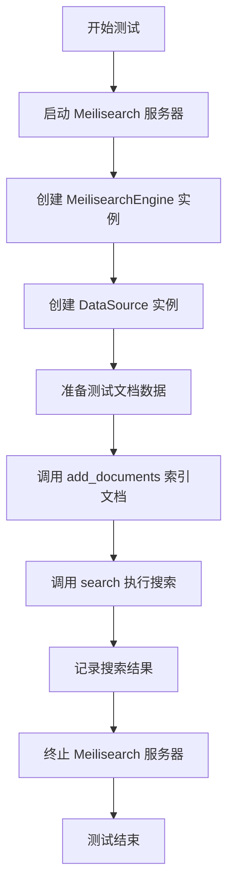
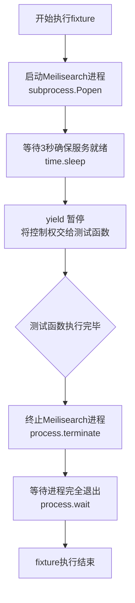
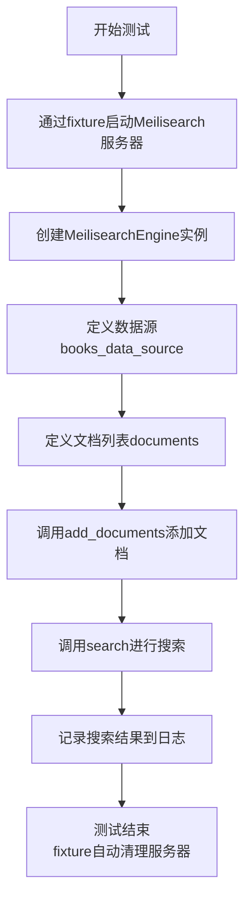
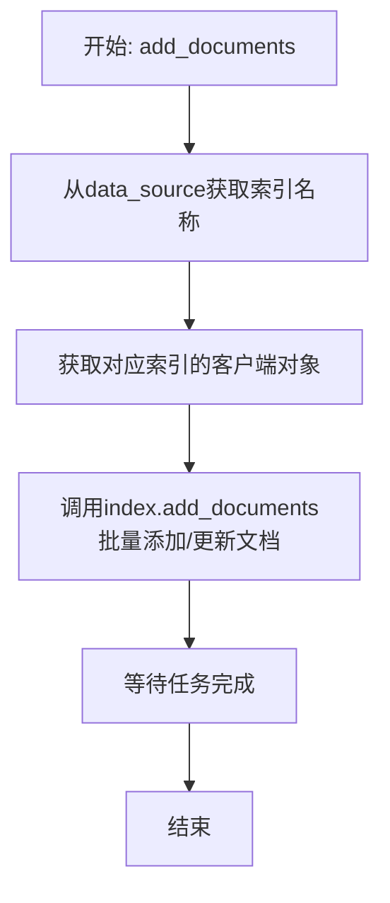
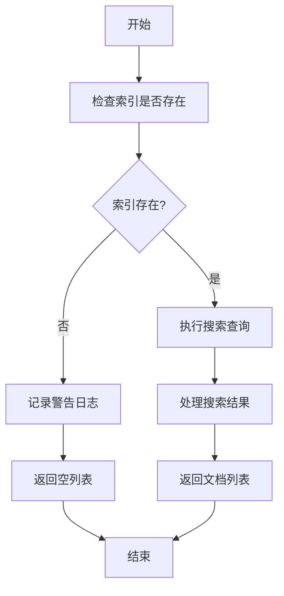

# `.\MetaGPT\tests\metagpt\tools\test_search_engine_meilisearch.py` 详细设计文档

该文件是一个针对 Meilisearch 搜索引擎的集成测试脚本，核心功能是测试 MeilisearchEngine 类与 DataSource 类的功能，包括启动本地 Meilisearch 服务器、添加文档数据源、批量索引文档以及执行搜索查询。

## 整体流程



## 类结构

```
测试文件结构
├── 全局配置 (MASTER_KEY)
├── 测试夹具 (search_engine_server)
└── 测试函数 (test_meilisearch)
```

## 全局变量及字段


### `MASTER_KEY`
    
Meilisearch服务器的认证主密钥，用于启动测试服务器和客户端连接。

类型：`str`
    


### `DataSource.name`
    
数据源的名称，用于标识不同的文档库，例如'books'。

类型：`str`
    


### `DataSource.url`
    
数据源的URL地址，指向文档库的来源位置。

类型：`str`
    


### `MeilisearchEngine.url`
    
Meilisearch搜索引擎服务器的连接地址，例如'http://localhost:7700'。

类型：`str`
    


### `MeilisearchEngine.token`
    
用于连接和操作Meilisearch服务器的认证令牌。

类型：`str`
    
    

## 全局函数及方法

### `search_engine_server`

这是一个用于测试的 Pytest 固定装置（fixture）。它的核心功能是在运行测试前启动一个 Meilisearch 服务进程，并在测试结束后安全地终止该进程，为测试函数 `test_meilisearch` 提供一个临时的、可用的搜索引擎服务环境。

参数：
- 无显式参数。这是一个 Pytest fixture，其生命周期由 Pytest 框架管理。

返回值：`None`，这是一个生成器（generator）风格的 fixture，使用 `yield` 将控制权交还给测试函数，不返回具体值。

#### 流程图



#### 带注释源码

```python
@pytest.fixture()
def search_engine_server():
    # Prerequisites
    # https://www.meilisearch.com/docs/learn/getting_started/installation
    # brew update && brew install meilisearch

    # 1. 使用 subprocess.Popen 启动 Meilisearch 服务进程。
    #    命令为 `meilisearch --master-key {MASTER_KEY}`，其中 MASTER_KEY 是预定义的主密钥。
    #    stdout=subprocess.PIPE 将进程输出重定向到管道，防止其打印到控制台干扰测试输出。
    meilisearch_process = subprocess.Popen(["meilisearch", "--master-key", f"{MASTER_KEY}"], stdout=subprocess.PIPE)
    
    # 2. 等待 3 秒，以确保 Meilisearch 服务有足够的时间完成启动并可以接受连接。
    time.sleep(3)
    
    # 3. 使用 yield 关键字。这是生成器fixture的核心。
    #    当测试函数开始执行时，Pytest会运行fixture至此并暂停，将控制权交给测试函数。
    #    此时，Meilisearch 服务已在后台运行，可供测试函数使用。
    yield
    
    # 4. 测试函数执行完毕后，Pytest 会回到fixture中yield之后的部分继续执行清理工作。
    #    向 Meilisearch 进程发送终止信号。
    meilisearch_process.terminate()
    
    # 5. 等待 Meilisearch 进程完全结束，确保资源被正确释放，避免僵尸进程。
    meilisearch_process.wait()
```

### `test_meilisearch`

该函数是一个使用 `pytest` 框架编写的集成测试函数，用于测试 `MeilisearchEngine` 类的功能。它首先启动一个本地的 Meilisearch 服务器，然后创建一个 `MeilisearchEngine` 实例，定义一个数据源和一组文档，接着将文档添加到搜索引擎中，最后执行一次搜索并记录结果。该测试旨在验证搜索引擎的基本操作（添加文档和搜索）是否正常工作。

参数：

- `search_engine_server`：`pytest.fixture`，一个 pytest 夹具，用于在测试前启动 Meilisearch 服务器，并在测试后终止它。它确保测试环境有一个可用的搜索引擎实例。

返回值：`None`，该测试函数不返回任何值，其主要目的是执行测试断言（尽管此示例中未显式包含断言）和记录日志。

#### 流程图



#### 带注释源码

```python
@pytest.mark.skip  # 标记此测试为跳过，可能因为需要外部依赖（如Meilisearch）或处于开发阶段
def test_meilisearch(search_engine_server):  # 接收fixture作为参数，以管理服务器生命周期
    # Prerequisites
    # https://www.meilisearch.com/docs/learn/getting_started/installation
    # brew update && brew install meilisearch

    # 实例化搜索引擎客户端，连接到本地启动的服务器
    search_engine = MeilisearchEngine(url="http://localhost:7700", token=MASTER_KEY)

    # 创建一个数据源对象，模拟一个名为“books”的数据源
    books_data_source = DataSource(name="books", url="https://example.com/books")

    # 定义一个文档列表，这些文档将被添加到搜索引擎中
    documents = [
        {"id": 1, "title": "Book 1", "content": "This is the content of Book 1."},
        {"id": 2, "title": "Book 2", "content": "This is the content of Book 2."},
        {"id": 3, "title": "Book 1", "content": "This is the content of Book 1."},
        {"id": 4, "title": "Book 2", "content": "This is the content of Book 2."},
        {"id": 5, "title": "Book 1", "content": "This is the content of Book 1."},
        {"id": 6, "title": "Book 2", "content": "This is the content of Book 2."},
    ]

    # 核心测试步骤1：将文档添加到指定的数据源中
    search_engine.add_documents(books_data_source, documents)
    # 核心测试步骤2：执行搜索查询，查找包含“Book 1”的文档
    logger.info(search_engine.search("Book 1"))  # 记录搜索结果，实际测试中应包含断言
```

### `MeilisearchEngine.add_documents`

该方法用于将一批文档添加或更新到 Meilisearch 搜索引擎的指定索引中。它接收一个数据源对象和一个文档列表，通过数据源名称确定目标索引，然后将文档批量推送到该索引。如果索引不存在，Meilisearch 会自动创建它。

参数：

- `data_source`：`DataSource`，数据源对象，其 `name` 属性将作为 Meilisearch 索引的名称。
- `documents`：`list[dict]`，一个字典列表，每个字典代表一个待添加或更新的文档。文档必须包含一个唯一的 `id` 字段。

返回值：`None`，该方法不返回任何值。

#### 流程图



#### 带注释源码

```python
def add_documents(self, data_source: DataSource, documents: list[dict]):
    """
    将文档列表添加到指定的数据源索引中。
    
    Args:
        data_source (DataSource): 数据源对象，包含索引名称等信息。
        documents (list[dict]): 待添加的文档列表，每个文档是一个字典。
    """
    # 从数据源对象中获取索引名称
    index_name = data_source.name
    # 通过索引名称获取或创建对应的 Meilisearch 索引客户端
    index = self.client.index(index_name)
    # 调用 Meilisearch SDK 的 add_documents 方法，将文档列表批量添加到索引中。
    # 如果文档已存在（根据id判断），则执行更新操作。
    task = index.add_documents(documents)
    # 等待 Meilisearch 服务器处理完添加文档的任务，确保操作完成。
    self.client.wait_for_task(task.task_uid)
```

### `MeilisearchEngine.search`

该方法用于在指定的Meilisearch索引中执行搜索查询，并返回匹配的文档结果。

参数：

- `query`：`str`，搜索查询字符串
- `index_name`：`str`，要搜索的索引名称
- `limit`：`int`，可选参数，限制返回结果的数量，默认为20
- `offset`：`int`，可选参数，指定结果偏移量，用于分页，默认为0

返回值：`list`，包含匹配查询的文档列表，每个文档是一个字典

#### 流程图



#### 带注释源码

```python
def search(self, query: str, index_name: str, limit: int = 20, offset: int = 0) -> list:
    """
    在指定的索引中搜索文档
    
    Args:
        query: 搜索查询字符串
        index_name: 要搜索的索引名称
        limit: 限制返回结果的数量，默认为20
        offset: 结果偏移量，用于分页，默认为0
    
    Returns:
        包含匹配文档的列表，每个文档是一个字典
    """
    # 检查索引是否存在
    if index_name not in self.client.get_indexes():
        logger.warning(f"Index {index_name} does not exist.")
        return []
    
    # 获取指定索引
    index = self.client.get_index(index_name)
    
    # 执行搜索查询
    search_results = index.search(query, {
        'limit': limit,
        'offset': offset
    })
    
    # 返回匹配的文档
    return search_results['hits']
```

## 关键组件


### MeilisearchEngine

一个封装了Meilisearch搜索引擎客户端操作的类，用于连接Meilisearch服务器、管理索引（数据源）以及执行文档的增删改查等搜索相关功能。

### DataSource

一个表示数据源的简单数据结构，用于封装搜索引擎索引的名称和可选的URL信息，作为`MeilisearchEngine`类中管理文档的标识单元。

### 测试夹具 (search_engine_server)

一个Pytest夹具，用于在测试执行前后自动启动和停止一个本地的Meilisearch服务器进程，为集成测试提供独立、临时的搜索服务环境。

### 测试函数 (test_meilisearch)

一个使用Pytest框架编写的集成测试函数，用于验证`MeilisearchEngine`和`DataSource`组件的核心功能，包括连接服务器、添加文档到指定索引以及执行搜索查询。


## 问题及建议


### 已知问题

-   **硬编码的敏感信息**：代码中直接硬编码了 Meilisearch 的 `MASTER_KEY`，这是一个严重的安全隐患。如果此代码被提交到版本控制系统，密钥将暴露。
-   **脆弱的测试环境启动**：`search_engine_server` fixture 使用 `subprocess.Popen` 启动 Meilisearch 服务，并依赖固定的 `sleep(3)` 等待服务就绪。这种方式不可靠，可能导致测试因服务未准备好而失败。
-   **测试被跳过**：测试函数 `test_meilisearch` 被 `@pytest.mark.skip` 装饰器标记，这意味着该测试在默认情况下不会执行，可能掩盖了代码的实际问题或环境依赖问题。
-   **缺乏资源清理**：虽然 fixture 在 `yield` 后尝试终止进程，但如果测试在 `yield` 之前异常退出（例如断言失败或异常），`meilisearch_process` 可能不会被正确终止，导致后台进程残留。
-   **测试数据重复且无意义**：测试中使用的 `documents` 数据高度重复（“Book 1”和“Book 2”交替出现），且内容简单，可能无法有效测试搜索引擎的分词、相关性排序等核心功能。
-   **缺少断言**：`test_meilisearch` 函数中调用了 `search_engine.search("Book 1")` 但结果仅被记录 (`logger.info`)，没有使用 `assert` 语句验证搜索结果是否符合预期，这不符合单元测试的最佳实践。
-   **环境依赖未在代码中明确声明**：测试依赖于外部命令 `meilisearch` 和特定的安装方式（通过 `brew`），但此依赖仅在注释中说明，未在测试代码或项目配置（如 `pytest` 的标记、`conftest.py` 的 skip 条件）中做结构化处理，导致测试可移植性差。

### 优化建议

-   **移除硬编码密钥**：将 `MASTER_KEY` 等敏感信息移至环境变量或安全的配置管理系统中。在测试中，可以使用 pytest 的 `monkeypatch` fixture 临时设置环境变量。
-   **改进服务启动等待逻辑**：将固定的 `sleep` 替换为轮询机制，例如尝试连接 Meilisearch 的健康检查端点 (`/health`)，直到服务响应成功或超时。这能提高测试的稳定性和启动速度。
-   **移除或条件化跳过标记**：评估 `@pytest.mark.skip` 的必要性。如果测试需要特定环境（如本地安装 Meilisearch），应使用 `@pytest.mark.skipif` 配合环境检查（如检查 `meilisearch` 命令是否存在），并为无法满足条件的场景提供清晰的跳过原因。
-   **确保资源清理**：使用 `try...finally` 块或 `pytest` 的上下文管理器来确保在任何情况下测试进程都能被终止。也可以考虑使用 `subprocess` 的上下文管理器（Python 3.7+）或第三方库来管理生命周期。
-   **设计更有意义的测试数据**：创建更具多样性、能覆盖边界情况和搜索特性的测试文档集。例如，包含不同长度、特殊字符、同义词、多语言内容的文档，以验证搜索引擎的健壮性。
-   **添加明确的断言**：在 `test_meilisearch` 中，对 `search_engine.search` 的返回结果进行断言，验证返回的文档数量、ID、排序等是否符合预期。这是测试的核心价值所在。
-   **明确化环境依赖**：在 `conftest.py` 或测试模块顶部，使用 `pytest` 的标记（如 `@pytest.mark.integration`）或 `skipif` 条件来声明对 Meilisearch 外部服务的依赖。这有助于其他开发者理解测试的运行前提。
-   **考虑使用测试专用实例或Docker**：对于集成测试，可以考虑使用 Docker 容器启动一个临时的 Meilisearch 实例，确保测试环境隔离且一致。这可以通过 `pytest-docker` 等插件或自定义 fixture 实现。
-   **分离测试逻辑**：将测试数据准备、服务启动/停止、搜索断言等逻辑进一步模块化，使测试函数更清晰，便于维护和扩展。


## 其它


### 设计目标与约束

本代码是一个针对 `MeilisearchEngine` 类的集成测试文件。其主要设计目标是验证 `MeilisearchEngine` 类与 Meilisearch 搜索引擎服务交互的核心功能（如添加文档、执行搜索）是否正常工作。代码遵循以下约束：
1.  **测试隔离性**：通过 `pytest.fixture` 管理测试依赖（Meilisearch 服务器进程），确保每个测试用例在独立、干净的环境中进行。
2.  **可重复性**：测试数据（`documents`）是硬编码的，确保每次测试的输入和预期行为一致。
3.  **外部依赖**：测试执行依赖于外部 Meilisearch 服务。代码通过 `subprocess` 在测试前启动本地服务，并在测试后清理，以模拟集成环境。
4.  **可跳过性**：由于测试需要外部服务，主测试函数 `test_meilisearch` 被标记为 `@pytest.mark.skip`，允许在未安装 Meilisearch 的环境中跳过执行，避免测试失败。

### 错误处理与异常设计

代码中的错误处理主要围绕外部进程和网络交互：
1.  **进程管理**：`search_engine_server` fixture 使用 `subprocess.Popen` 启动 Meilisearch 服务器。如果命令执行失败（如 `meilisearch` 未安装），`Popen` 会抛出异常（如 `FileNotFoundError`），导致 fixture 设置失败，进而使依赖它的测试用例失败。进程终止使用 `terminate()` 和 `wait()`，确保资源被清理。
2.  **网络连接与超时**：`test_meilisearch` 函数中实例化 `MeilisearchEngine` 时，如果提供的 URL (`http://localhost:7700`) 无法连接或认证失败（错误的 `token`），`MeilisearchEngine` 类内部应抛出相应的异常（如连接错误、认证错误）。测试中通过 `time.sleep(3)` 等待服务器启动，这是一种简单的超时/就绪检查，但不够健壮，可能因服务器启动慢而导致连接失败。
3.  **测试断言**：当前测试仅通过 `logger.info` 打印搜索结果，并未对结果进行断言验证。这是一个缺陷，测试应包含明确的断言（例如，检查返回的文档数量、内容匹配度）来验证功能正确性，否则测试价值有限。

### 数据流与状态机

本测试代码的数据流和状态变化相对线性：
1.  **初始状态**：无 Meilisearch 服务器运行，无索引数据。
2.  **Fixture 启动 (`search_engine_server`)**：启动 Meilisearch 服务器进程，系统进入“服务器就绪”状态。
3.  **测试执行 (`test_meilisearch`)**：
    *   **连接**：创建 `MeilisearchEngine` 实例，连接到本地服务器。
    *   **数据准备**：定义 `DataSource` 和 `documents` 列表。
    *   **数据注入**：调用 `search_engine.add_documents`，将 `documents` 数据添加（或更新）到名为 `"books"` 的索引中。系统状态变为“索引已填充”。
    *   **查询**：调用 `search_engine.search("Book 1")`，向索引发起搜索查询。
    *   **结果输出**：将搜索结果记录到日志。系统状态保持“索引已填充”。
4.  **Fixture 清理 (`search_engine_server`)**：终止 Meilisearch 服务器进程，清理所有临时数据和状态，系统回到初始状态。
整个流程构成一个简单的状态机：`初始 -> [服务器就绪 -> 索引已填充] -> 初始`，方括号内为测试执行期间的状态转移。

### 外部依赖与接口契约

代码明确依赖以下外部组件：
1.  **Meilisearch 搜索引擎**：作为被测试的核心服务。测试代码通过 `MeilisearchEngine` 类与之交互，该类应封装与 Meilisearch HTTP API 的通信细节。接口契约包括：
    *   **服务端点**：默认 `http://localhost:7700`。
    *   **认证**：需要有效的 `master-key`（此处为 `MASTER_KEY`）。
    *   **索引操作**：`add_documents` 方法应对应 Meilisearch 的添加/更新文档 API。
    *   **搜索操作**：`search` 方法应对应 Meilisearch 的搜索查询 API。
2.  **系统命令 `meilisearch`**：测试通过 `subprocess` 调用此命令来启动服务器。这要求测试执行环境已正确安装 Meilisearch（例如通过 `brew install meilisearch`）。这是一个强依赖，未安装会导致测试无法运行。
3.  **`pytest` 框架**：用于组织测试用例、管理 fixture 和提供测试运行环境。代码遵循 `pytest` 的 fixture 和测试函数定义约定。
4.  **`metagpt.tools.search_engine_meilisearch` 模块**：测试的目标模块，包含 `DataSource` 和 `MeilisearchEngine` 的定义。测试代码依赖于这些类公开的接口（构造函数、`add_documents`、`search` 方法）。

    