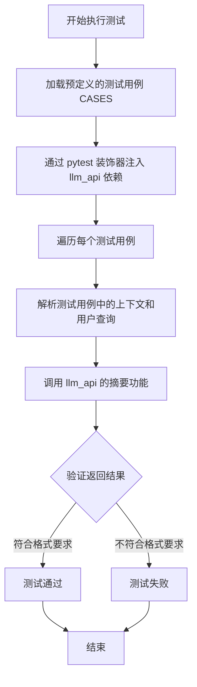
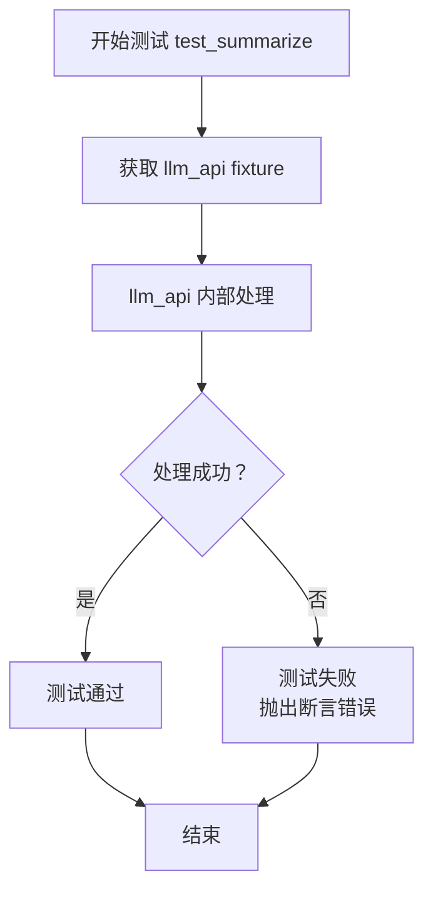

# `.\MetaGPT\tests\metagpt\tools\test_summarize.py` 详细设计文档

该文件是一个使用 pytest 框架编写的测试文件，用于测试一个基于大语言模型（LLM）的文本摘要功能。它通过提供包含上下文信息（如网页标题、链接和内容摘要）和用户查询的测试用例，来验证 LLM 能否根据上下文生成符合特定格式要求（如自然标注引用链接、避免文本重复、行文流畅）的总结性回答。

## 整体流程



## 类结构

```
test_summarize.py (测试模块)
├── 全局变量 CASES (测试数据)
└── 测试函数 test_summarize (测试逻辑)
```

## 全局变量及字段


### `CASES`
    
一个包含测试用例的列表，每个测试用例是一个字符串，其中包含了上下文数据、用户搜索请求和回答要求，用于驱动测试函数。

类型：`List[str]`
    


    

## 全局函数及方法

### `test_summarize`

这是一个使用 `pytest` 框架编写的测试函数，用于验证 `llm_api` 在给定上下文和用户请求时，能否生成符合特定格式要求的总结性回答。该测试函数本身不包含具体的测试逻辑，它依赖于 `llm_api` 这个 `pytest fixture` 来执行实际的测试。

参数：

- `llm_api`：`pytest fixture`，该 fixture 提供了与大型语言模型（LLM）交互的接口，用于执行生成总结性回答的核心测试逻辑。测试函数期望 `llm_api` 能够处理 `CASES` 中定义的测试用例。

返回值：`None`，该函数不返回任何值，其目的是通过 `pytest` 运行测试断言。

#### 流程图



#### 带注释源码

```python
# 使用 pytest 的 usefixtures 装饰器，确保在运行此测试函数前，先准备好名为 'llm_api' 的 fixture。
@pytest.mark.usefixtures("llm_api")
def test_summarize(llm_api):
    # 这是一个测试函数，其核心测试逻辑由传入的 `llm_api` fixture 实现。
    # 函数体为空（`pass`），意味着具体的测试步骤（如调用 API、断言结果）都封装在 `llm_api` 这个 fixture 的定义中。
    # 当 pytest 运行此测试时，它会执行 `llm_api` fixture，该 fixture 预计会：
    # 1. 遍历预定义的 `CASES` 列表（包含上下文、用户请求和格式要求）。
    # 2. 调用真正的 LLM 接口或模拟逻辑，生成总结性回答。
    # 3. 对生成的回答进行断言，检查其是否符合格式要求（如包含正确数量的 Markdown 链接、无重复文本等）。
    # 如果 `llm_api` fixture 中的任何断言失败，则此测试函数将标记为失败。
    pass
```

## 关键组件


### 测试用例定义

定义了用于测试的输入数据，包含上下文信息、用户搜索请求和具体要求，用于验证总结功能的正确性。

### 测试框架集成

集成了 `pytest` 测试框架，用于组织和执行自动化测试，确保代码的可靠性和功能正确性。

### 测试函数

包含一个使用 `pytest.mark.usefixtures` 装饰的测试函数，用于接收并调用外部依赖（如 `llm_api`）来执行核心的总结逻辑测试。


## 问题及建议


### 已知问题

-   **测试用例硬编码且庞大**：测试数据 `CASES` 直接以全局变量的形式硬编码在测试文件中，包含大量、复杂的上下文和请求字符串。这使得测试文件臃肿，难以阅读和维护，且无法灵活地复用或修改测试数据。
-   **测试函数为空，未实现任何逻辑**：`test_summarize` 函数体仅为 `pass`，没有调用任何待测功能或进行任何断言。这导致测试完全无效，无法验证代码的正确性。
-   **缺乏对 `llm_api` 夹具的依赖说明**：测试函数使用了 `@pytest.mark.usefixtures("llm_api")` 装饰器，但代码中未定义 `llm_api` 夹具。这会导致测试运行时因找不到夹具而失败，且其预期行为（如模拟LLM调用）不明确。
-   **代码结构不清晰**：测试逻辑（如果有的话）、测试数据和测试配置混杂在一个文件中，不符合“单一职责”原则，降低了代码的可读性和可维护性。

### 优化建议

-   **将测试数据外部化**：将 `CASES` 中的数据移至独立的配置文件（如 JSON、YAML）或测试数据模块中。这可以使测试文件更简洁，并方便数据的管理和共享。
-   **实现具体的测试逻辑**：在 `test_summarize` 函数中，应调用实际的总结函数（例如 `summarize(context, request)`），并对其输出进行断言，验证其格式、内容、链接标注等是否符合要求。
-   **明确并实现 `llm_api` 夹具**：定义 `llm_api` 夹具，用于模拟或提供真实的 LLM 服务接口。这有助于隔离外部依赖，使测试更可控、更快速。
-   **重构测试结构**：考虑使用 `pytest` 的参数化功能（`@pytest.mark.parametrize`）来优雅地遍历 `CASES` 中的多组测试数据。将测试数据、测试逻辑和测试辅助函数分离，提高模块化程度。
-   **补充必要的导入和依赖**：确保测试文件导入了所有必要的模块和待测试的函数/类。


## 其它


### 设计目标与约束

本代码是一个用于测试的单元测试文件，其核心设计目标是验证一个名为 `summarize` 的功能模块（或函数）能否根据给定的上下文和用户请求，生成符合特定格式要求的总结性回答。主要约束包括：1) 测试用例（`CASES`）以硬编码形式嵌入，缺乏灵活性；2) 测试逻辑依赖于一个名为 `llm_api` 的外部pytest fixture，该fixture的具体实现和功能未在本文件中定义；3) 测试函数 `test_summarize` 当前为空，仅作为测试框架的占位符，实际测试逻辑需要外部注入。

### 错误处理与异常设计

当前代码中未显式包含任何错误处理或异常捕获逻辑。测试函数 `test_summarize` 为空实现，因此不会主动抛出或处理任何异常。预期的错误处理机制应依赖于pytest框架本身（如断言失败时抛出 `AssertionError`）以及外部 `llm_api` fixture 的内部实现。如果 `llm_api` 在调用过程中发生异常（如网络错误、API调用失败、返回格式错误等），pytest将捕获这些异常并导致测试失败。代码本身缺乏对边界条件（如空上下文、无效请求格式）的测试用例和相应的容错设计。

### 数据流与状态机

本测试文件的数据流相对简单且静态：
1.  **数据输入**：测试数据以全局常量 `CASES` 的形式定义，它是一个包含两个测试用例的列表。每个用例是一个包含上下文（`context`）、用户搜索请求（`query`）和要求（`requirements`）三部分的多行字符串。
2.  **处理过程**：数据通过 `llm_api` 这个pytest fixture（其具体处理逻辑未知）进行传递和处理。理想情况下，`llm_api` 会接收 `CASES` 中的每个用例，调用被测试的 `summarize` 功能，并返回结果。
3.  **数据验证**：当前代码中验证步骤缺失。完整的测试应在 `test_summarize` 函数中，将 `llm_api` 处理每个用例后返回的结果与预期结果（如特定的文本内容、格式、链接数量等）进行断言比较。
4.  **状态**：无复杂的状态机。测试执行是线性的：加载fixture -> 遍历测试用例 -> 调用被测功能 -> 验证结果。

### 外部依赖与接口契约

1.  **pytest框架**：强依赖。用于组织测试用例（`@pytest.mark.usefixtures`）、管理测试夹具（`llm_api`）和执行测试。
2.  **`llm_api` pytest fixture**：核心外部依赖。其接口契约（即输入、输出和行为）未在本文件中明确定义。根据上下文推测，它应是一个可调用对象，接收测试数据（可能来自 `CASES`），执行被测试的总结功能，并返回结果供断言。其具体实现（如是否调用真实API、是否使用Mock对象）决定了测试的性质（单元测试、集成测试）。
3.  **被测试的 `summarize` 模块/函数**：虽然未直接导入，但它是测试的最终目标。其接口契约隐含在 `CASES` 的数据结构和 `llm_api` 的预期行为中：应能接收上下文和用户请求，生成符合特定格式要求的自然语言总结。

    