# `.\MetaGPT\tests\metagpt\tools\test_tool_convert.py` 详细设计文档

该文件是一个测试模块，用于验证 `metagpt.tools.tool_convert` 模块中 `convert_code_to_tool_schema` 和 `convert_code_to_tool_schema_ast` 两个函数的功能。这些函数旨在将 Python 代码（类和函数）解析并转换为结构化的工具模式（schema），以便于在元编程或自动化工具中使用。测试文件通过定义一系列虚拟的类、函数和测试用例，来验证转换函数是否能正确提取代码的元信息（如类型、描述、签名、参数等），并处理继承、异步函数、私有方法过滤等边界情况。

## 整体流程

```mermaid
graph TD
    A[开始执行测试] --> B{选择测试函数}
    B --> C[test_convert_code_to_tool_schema_class]
    B --> D[test_convert_code_to_tool_schema_subclass]
    B --> E[test_convert_code_to_tool_schema_include]
    B --> F[test_convert_code_to_tool_schema_function]
    B --> G[test_convert_code_to_tool_schema_async_function]
    B --> H[test_convert_code_to_tool_schema_ast]
    C --> I[调用 convert_code_to_tool_schema(DummyClass)]
    D --> J[调用 convert_code_to_tool_schema(DummySubClass)]
    E --> K[调用 convert_code_to_tool_schema(DummyClass, include=['fit'])]
    F --> L[调用 convert_code_to_tool_schema(dummy_fn)]
    G --> M[调用 convert_code_to_tool_schema(dummy_async_fn)]
    H --> N[调用 convert_code_to_tool_schema_ast(TEST_CODE_FILE_TEXT)]
    I --> O[断言生成的模式与预期一致]
    J --> P[断言子类方法被包含]
    K --> Q[断言仅包含指定方法]
    L --> R[断言函数模式与预期一致]
    M --> S[断言异步函数类型正确]
    N --> T[断言AST解析模式与预期一致]
    O --> U[所有测试通过]
    P --> U
    Q --> U
    R --> U
    S --> U
    T --> U
    U --> V[测试结束]
```

## 类结构

```
DummyClass (虚拟数据填充类)
└── DummySubClass (DummyClass的子类)
```

## 全局变量及字段


### `TEST_CODE_FILE_TEXT`
    
一个包含测试代码的多行字符串，用于测试 convert_code_to_tool_schema_ast 函数从源代码文本中解析类和函数信息的能力。

类型：`str`
    


    

## 全局函数及方法

### `dummy_fn`

Analyzes a DataFrame and categorizes its columns based on data types.

参数：

-  `df`：`pandas.core.frame.DataFrame`，The DataFrame to be analyzed. Another line for df.
-  `s`：`str`，Some test string param. Another line for s.
-  `k`：`int`，Some test integer param. Defaults to 5.
-  `type`：`Literal["a", "b", "c"]`，Some test type. Defaults to 'a'.
-  `test_dict`：`dict[str, int]`，Defaults to None.
-  `test_union`：`Union[str, list[str]]`，Defaults to ''.

返回值：`dict`，A dictionary with four keys ('Category', 'Numeric', 'Datetime', 'Others'). Each key corresponds to a list of column names belonging to that category.

#### 流程图

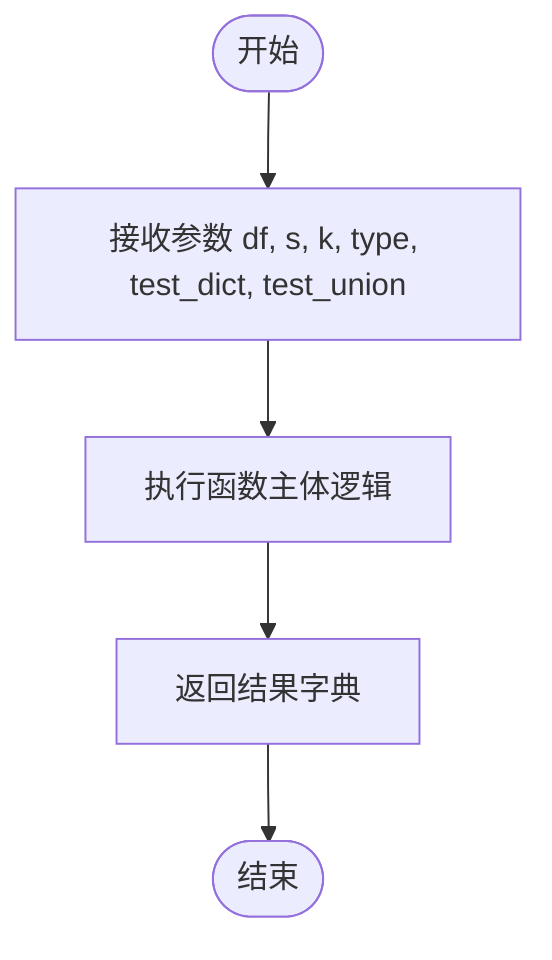

#### 带注释源码

```python
def dummy_fn(
    df: pd.DataFrame,
    s: str,
    k: int = 5,
    type: Literal["a", "b", "c"] = "a",
    test_dict: dict[str, int] = None,
    test_union: Union[str, list[str]] = "",
) -> dict:
    """
    Analyzes a DataFrame and categorizes its columns based on data types.

    Args:
        df: The DataFrame to be analyzed.
            Another line for df.
        s (str): Some test string param.
            Another line for s.
        k (int, optional): Some test integer param. Defaults to 5.
        type (Literal["a", "b", "c"], optional): Some test type. Defaults to 'a'.
        more_args: will be omitted here for testing

    Returns:
        dict: A dictionary with four keys ('Category', 'Numeric', 'Datetime', 'Others').
              Each key corresponds to a list of column names belonging to that category.
    """
    pass
```

### `dummy_async_fn`

一个用于测试的虚拟异步函数。

参数：

- `df`：`pandas.core.frame.DataFrame`，测试参数。

返回值：`dict`，测试返回值。

#### 流程图

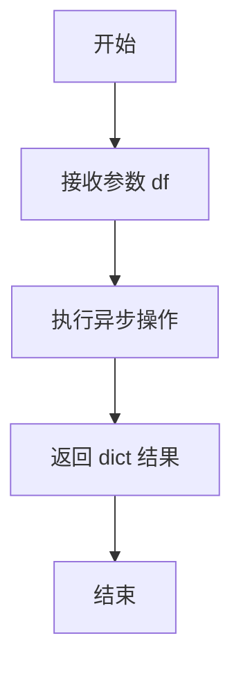

#### 带注释源码

```python
async def dummy_async_fn(df: pd.DataFrame) -> dict:
    """
    A dummy async function for test

    Args:
        df (pd.DataFrame): test args.

    Returns:
        dict: test returns.
    """
    pass
```

### `test_convert_code_to_tool_schema_class`

该函数是一个单元测试，用于验证 `convert_code_to_tool_schema` 函数在输入一个类（`DummyClass`）时，能否正确生成预期的工具模式（schema）字典。它通过比较实际生成的 `schema` 与预定义的 `expected` 字典来断言测试是否通过。

参数：
- 无显式参数。该函数是一个测试用例，不接收外部参数。

返回值：`None`，该函数不返回任何值，其主要功能是执行断言（`assert`）以验证代码逻辑。

#### 流程图

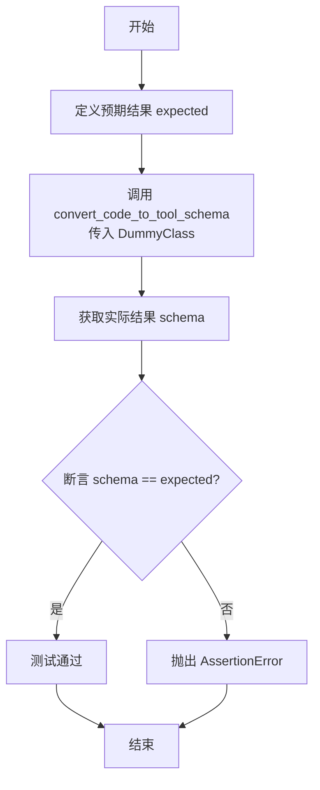

#### 带注释源码

```python
def test_convert_code_to_tool_schema_class():
    # 定义预期的工具模式字典，描述了 DummyClass 的结构
    expected = {
        "type": "class",
        "description": "Completing missing values with simple strategies.",
        "methods": {
            "__init__": {
                "type": "function",
                "description": "Initialize self. ",
                "signature": "(self, features: list, strategy: str = 'mean', fill_value=None)",
                "parameters": "Args: features (list): Columns to be processed. strategy (str, optional): The imputation strategy, notice 'mean' and 'median' can only be used for numeric features. Enum: ['mean', 'median', 'most_frequent', 'constant']. Defaults to 'mean'. fill_value (int, optional): Fill_value is used to replace all occurrences of missing_values. Defaults to None.",
            },
            "fit": {
                "type": "function",
                "description": "Fit the FillMissingValue model. ",
                "signature": "(self, df: pandas.core.frame.DataFrame)",
                "parameters": "Args: df (pd.DataFrame): The input DataFrame.",
            },
            "transform": {
                "type": "function",
                "description": "Transform the input DataFrame with the fitted model. ",
                "signature": "(self, df: pandas.core.frame.DataFrame) -> pandas.core.frame.DataFrame",
                "parameters": "Args: df (pd.DataFrame): The input DataFrame. Returns: pd.DataFrame: The transformed DataFrame.",
            },
        },
    }
    # 调用待测试的函数，传入 DummyClass 类对象
    schema = convert_code_to_tool_schema(DummyClass)
    # 断言实际生成的 schema 与预期结果完全一致
    assert schema == expected
```

### `test_convert_code_to_tool_schema_subclass`

该函数用于测试 `convert_code_to_tool_schema` 函数在处理子类时的行为。它验证了生成的模式（schema）是否包含了子类自身的方法以及从父类继承的方法。

参数：
- 无显式参数。该函数是一个单元测试，不接收外部参数。

返回值：`None`，该函数是一个单元测试，通常不返回有意义的值，其目的是通过断言（assert）来验证代码逻辑。

#### 流程图

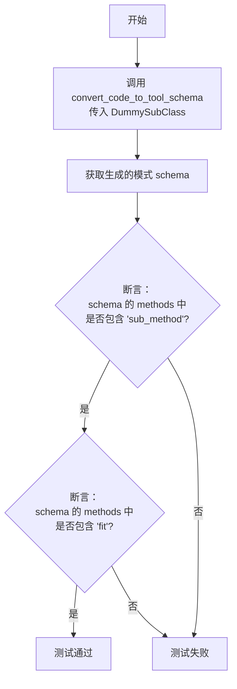

#### 带注释源码

```python
def test_convert_code_to_tool_schema_subclass():
    # 调用 convert_code_to_tool_schema 函数，传入子类 DummySubClass 作为参数
    schema = convert_code_to_tool_schema(DummySubClass)
    # 断言：生成的模式（schema）中的 methods 字典应包含子类自身的方法 'sub_method'
    assert "sub_method" in schema["methods"]  # sub class method should be included
    # 断言：生成的模式（schema）中的 methods 字典应包含从父类继承的方法 'fit'
    assert "fit" in schema["methods"]  # parent class method should be included
```

### `test_convert_code_to_tool_schema_include`

该函数用于测试 `convert_code_to_tool_schema` 函数在指定 `include` 参数时的行为，验证其是否能够正确筛选并仅包含指定的方法。

参数：

- `无显式参数`：该函数是一个单元测试函数，不接受外部参数。

返回值：`None`，该函数是一个单元测试，不返回任何值，通过断言（assert）来验证测试结果。

#### 流程图

```mermaid
flowchart TD
    A[开始] --> B[调用 convert_code_to_tool_schema<br>传入 DummyClass 和 include=['fit']]
    B --> C{检查返回的 schema 中<br>是否包含 'fit' 方法}
    C -->|是| D{检查返回的 schema 中<br>是否不包含 'transform' 方法}
    D -->|是| E[测试通过]
    D -->|否| F[断言失败，测试不通过]
    C -->|否| F
```

#### 带注释源码

```python
def test_convert_code_to_tool_schema_include():
    # 调用 convert_code_to_tool_schema 函数，传入 DummyClass 类对象和 include 参数列表（仅包含 'fit' 方法）
    schema = convert_code_to_tool_schema(DummyClass, include=["fit"])
    # 断言：验证返回的 schema 字典的 `methods` 键中是否包含 `fit` 方法
    assert "fit" in schema["methods"]
    # 断言：验证返回的 schema 字典的 `methods` 键中是否不包含 `transform` 方法
    assert "transform" not in schema["methods"]
```

### `test_convert_code_to_tool_schema_function`

该函数是一个单元测试，用于验证 `convert_code_to_tool_schema` 函数在处理普通函数（非类方法）时的正确性。它定义了一个预期的函数模式（schema），调用 `convert_code_to_tool_schema` 函数来生成实际模式，并使用断言（assert）来验证两者是否完全一致。

参数：

-  `无`：`无`，此函数不接受任何参数。

返回值：`None`，此函数不返回任何值，其主要功能是执行断言测试。

#### 流程图

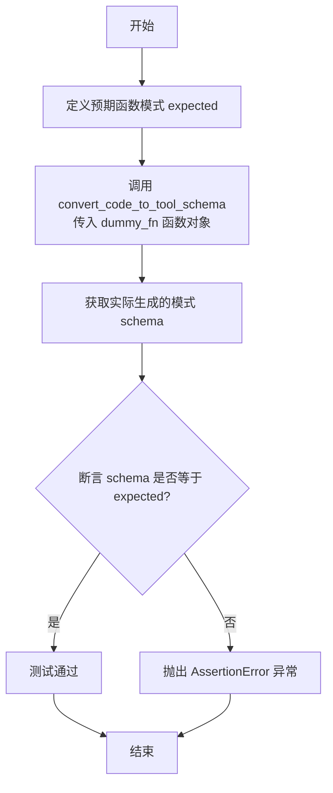

#### 带注释源码

```python
def test_convert_code_to_tool_schema_function():
    # 定义预期的函数模式字典，包含类型、描述、签名和参数文档
    expected = {
        "type": "function",
        "description": "Analyzes a DataFrame and categorizes its columns based on data types. ",
        "signature": "(df: pandas.core.frame.DataFrame, s: str, k: int = 5, type: Literal['a', 'b', 'c'] = 'a', test_dict: dict[str, int] = None, test_union: Union[str, list[str]] = '') -> dict",
        "parameters": "Args: df: The DataFrame to be analyzed. Another line for df. s (str): Some test string param. Another line for s. k (int, optional): Some test integer param. Defaults to 5. type (Literal[\"a\", \"b\", \"c\"], optional): Some test type. Defaults to 'a'. more_args: will be omitted here for testing Returns: dict: A dictionary with four keys ('Category', 'Numeric', 'Datetime', 'Others'). Each key corresponds to a list of column names belonging to that category.",
    }
    # 调用被测试函数 convert_code_to_tool_schema，传入 dummy_fn 函数对象
    schema = convert_code_to_tool_schema(dummy_fn)
    # 使用断言验证实际生成的模式是否与预期完全一致
    assert schema == expected
```

### `test_convert_code_to_tool_schema_async_function`

该函数用于测试 `convert_code_to_tool_schema` 函数对异步函数（`async def`）的处理能力。它调用 `convert_code_to_tool_schema` 函数解析一个预定义的异步函数 `dummy_async_fn`，并断言返回的 schema 字典中 `type` 字段的值为 `"async_function"`，以验证工具能够正确识别并标记异步函数。

参数：
-  `无显式参数`：`None`，该函数不接受任何参数。

返回值：`None`，该函数不返回任何值，仅执行断言测试。

#### 流程图

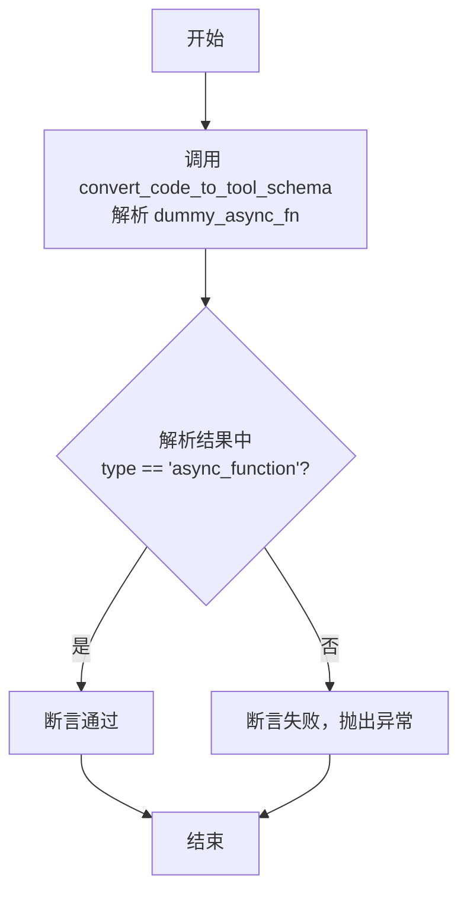

#### 带注释源码

```python
def test_convert_code_to_tool_schema_async_function():
    # 调用 convert_code_to_tool_schema 函数，传入异步函数 dummy_async_fn 作为参数
    schema = convert_code_to_tool_schema(dummy_async_fn)
    # 断言：验证返回的 schema 字典中，'type' 键对应的值为 'async_function'
    # 这用于测试工具是否能正确识别异步函数类型
    assert schema.get("type") == "async_function"
```

### `test_convert_code_to_tool_schema_ast`

该函数是一个单元测试，用于验证 `convert_code_to_tool_schema_ast` 函数的功能。它通过提供一个包含类、方法和函数的代码字符串，调用目标函数进行解析，并将返回的解析结果与一个预定义的期望字典进行比较，以断言两者是否完全一致，从而测试代码解析和模式转换的正确性。

参数：

-  `无显式参数`：该函数不接受任何参数，它是一个独立的单元测试函数。

返回值：`None`，该函数不返回任何值，其主要功能是执行断言测试。

#### 流程图

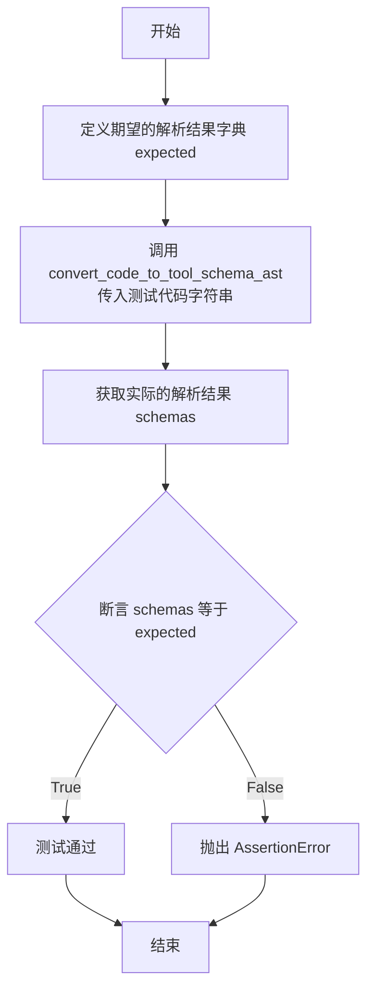

#### 带注释源码

```python
def test_convert_code_to_tool_schema_ast():
    # 定义期望的解析结果，这是一个字典，包含了从测试代码中应解析出的所有类、函数及其详细信息。
    expected = {
        "MyClass": {
            "type": "class",
            "description": "This is a MyClass docstring.",
            "methods": {
                "__init__": {
                    "type": "function",
                    "description": "This is the constructor docstring.",
                    "signature": "(self, arg1)",
                    "parameters": "",
                },
                "my_method": {
                    "type": "function",
                    "description": "This is a method docstring. ",
                    "signature": "(self, arg2: Union[list[str], str], arg3: pd.DataFrame, arg4: int = 1, arg5: Literal['a', 'b', 'c'] = 'a') -> Tuple[int, str]",
                    "parameters": "Args: arg2 (Union[list[str], str]): A union of a list of strings and a string. ... Returns: Tuple[int, str]: A tuple of an integer and a string.",
                },
                "my_async_method": {
                    "type": "async_function",
                    "description": "",
                    "signature": "(self, some_arg) -> str",
                    "parameters": "",
                },
            },
            # 包含类的原始代码字符串
            "code": 'class MyClass:\n    """This is a MyClass docstring."""\n    def __init__(self, arg1):\n        """This is the constructor docstring."""\n        self.arg1 = arg1\n\n    def my_method(self, arg2: Union[list[str], str], arg3: pd.DataFrame, arg4: int = 1, arg5: Literal["a","b","c"] = "a") -> Tuple[int, str]:\n        """\n        This is a method docstring.\n        \n        Args:\n            arg2 (Union[list[str], str]): A union of a list of strings and a string.\n            ...\n        \n        Returns:\n            Tuple[int, str]: A tuple of an integer and a string.\n        """\n        return self.arg4 + arg5\n    \n    async def my_async_method(self, some_arg) -> str:\n        return "hi"\n    \n    def _private_method(self):  # private should not be parsed\n        return "private"',
        },
        "my_function": {
            "type": "function",
            "description": "This is a function docstring.",
            "signature": "(arg1, arg2) -> dict",
            "parameters": "",
            "code": 'def my_function(arg1, arg2) -> dict:\n    """This is a function docstring."""\n    return arg1 + arg2',
        },
        "my_async_function": {
            "type": "function",
            "description": "",
            "signature": "(arg1, arg2) -> dict",
            "parameters": "",
            "code": "def my_async_function(arg1, arg2) -> dict:\n    return arg1 + arg2",
        },
    }
    # 调用被测试函数 `convert_code_to_tool_schema_ast`，传入预定义的测试代码字符串 `TEST_CODE_FILE_TEXT`。
    schemas = convert_code_to_tool_schema_ast(TEST_CODE_FILE_TEXT)
    # 使用断言验证函数返回的解析结果 `schemas` 是否与期望的 `expected` 字典完全一致。
    # 如果不一致，测试将失败并抛出 AssertionError。
    assert schemas == expected
```

### `DummyClass.__init__`

初始化 `DummyClass` 实例，设置用于处理缺失值的特征列、填充策略和填充值。

参数：
-  `self`：`DummyClass`，当前类的实例。
-  `features`：`list`，需要处理的列名列表。
-  `strategy`：`str`，填充策略，可选值为 `'mean'`、`'median'`、`'most_frequent'`、`'constant'`，默认为 `'mean'`。注意 `'mean'` 和 `'median'` 仅适用于数值型特征。
-  `fill_value`：`int`，当策略为 `'constant'` 时，用于替换所有缺失值的常量，默认为 `None`。

返回值：`None`，无返回值。

#### 流程图

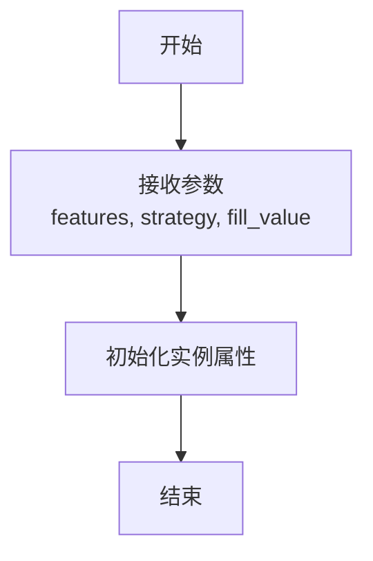

#### 带注释源码

```python
def __init__(self, features: list, strategy: str = "mean", fill_value=None):
    """
    Initialize self.

    Args:
        features (list): Columns to be processed.
        strategy (str, optional): The imputation strategy, notice 'mean' and 'median' can only
                                  be used for numeric features. Enum: ['mean', 'median', 'most_frequent', 'constant']. Defaults to 'mean'.
        fill_value (int, optional): Fill_value is used to replace all occurrences of missing_values.
                                    Defaults to None.
    """
    pass
```

### `DummyClass.fit`

该方法用于拟合 `DummyClass` 模型。根据代码注释，`DummyClass` 是一个用于使用简单策略（如均值、中位数、众数或常数）填充缺失值的类。`fit` 方法接收一个 DataFrame 作为输入，并基于此数据计算或确定后续 `transform` 方法所需的填充参数（例如，计算指定列的均值或中位数）。然而，在提供的代码中，`fit` 方法仅包含一个 `pass` 语句，是一个待实现的占位符。

参数：

- `self`：`DummyClass`，`DummyClass` 类的实例。
- `df`：`pandas.core.frame.DataFrame`，用于拟合模型的输入 DataFrame。

返回值：`None`，该方法不返回任何值。

#### 流程图

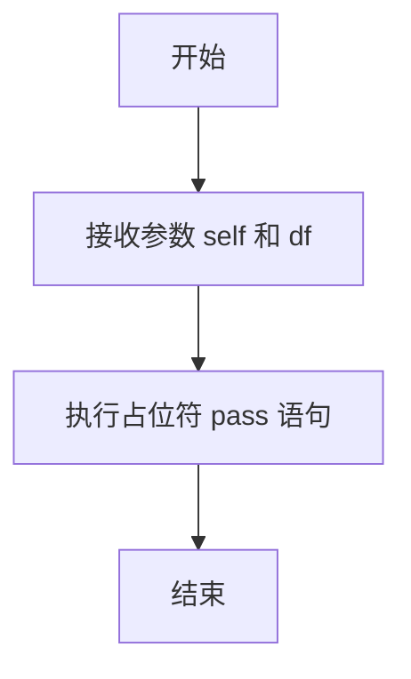

#### 带注释源码

```python
def fit(self, df: pd.DataFrame):
    """
    Fit the FillMissingValue model.

    Args:
        df (pd.DataFrame): The input DataFrame.
    """
    pass  # 这是一个待实现的方法占位符，实际应包含基于 df 计算填充逻辑的代码。
```

### `DummyClass.transform`

该方法属于`DummyClass`类，旨在使用已拟合的模型对输入的DataFrame进行转换，以处理缺失值。

参数：
- `df`：`pandas.core.frame.DataFrame`，需要被转换的输入DataFrame。

返回值：`pandas.core.frame.DataFrame`，经过转换处理后的DataFrame。

#### 流程图

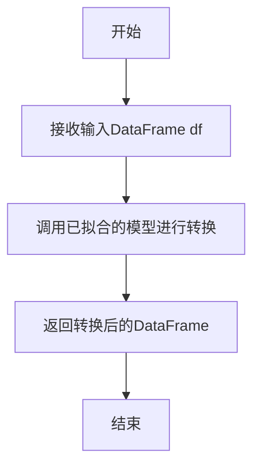

#### 带注释源码

```python
def transform(self, df: pd.DataFrame) -> pd.DataFrame:
    """
    Transform the input DataFrame with the fitted model.

    Args:
        df (pd.DataFrame): The input DataFrame.

    Returns:
        pd.DataFrame: The transformed DataFrame.
    """
    pass
```

### `DummySubClass.sub_method`

`DummySubClass` 类中定义的一个子方法，根据其文档字符串描述，这是一个“子方法”。从代码实现来看，该方法目前仅包含一个 `pass` 语句，是一个待实现的占位符方法。

参数：

-  `self`：`DummySubClass`，指向当前类实例的引用。
-  `df`：`pandas.core.frame.DataFrame`，输入的 DataFrame 数据。

返回值：`None`，该方法目前没有定义返回值。

#### 流程图

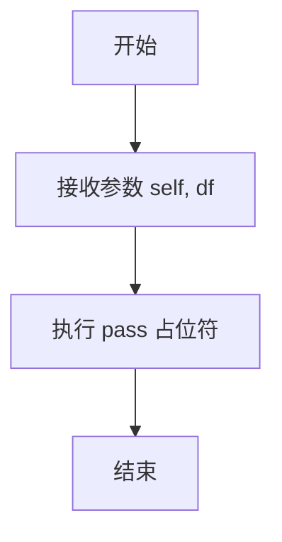

#### 带注释源码

```
def sub_method(self, df: pd.DataFrame):
    """sub method"""  # 方法描述：这是一个子方法
    pass  # 方法体：当前为空实现，仅作为占位符
```

## 关键组件

### 代码解析与工具模式转换器

该组件负责将Python源代码（类或函数）解析并转换为结构化的工具模式（Tool Schema）字典，用于描述其接口信息，支持从代码对象或源代码字符串进行解析。

### 类与函数模式提取

该组件能够识别并提取Python类及其公共方法、以及独立函数的元数据，包括类型（类/函数/异步函数）、描述、签名和参数文档，并支持通过`include`参数进行方法过滤。

### 抽象语法树解析器

该组件通过Python的`ast`模块直接解析源代码字符串，构建完整的抽象语法树，并从中提取类、函数定义及其文档字符串，生成与`convert_code_to_tool_schema`函数输出格式一致的模式字典。

### 模式字典结构

该组件定义了统一的输出数据结构，用于表示解析后的代码模式。对于类，包含类型、描述、方法字典及原始代码；对于函数，包含类型、描述、签名、参数文档及原始代码。该结构是组件间数据交换的契约。

## 问题及建议

### 已知问题

1.  **测试代码与生产代码耦合**：`test_convert_code_to_tool_schema_ast` 函数中，测试期望值 `expected` 字典包含了被测试函数 `convert_code_to_tool_schema_ast` 的输出结构。这种硬编码的期望值使得测试变得脆弱，一旦 `convert_code_to_tool_schema_ast` 的输出格式（如键名、结构）发生改变，所有相关测试都会失败，且难以维护。
2.  **测试数据冗余且易出错**：`TEST_CODE_FILE_TEXT` 字符串作为测试输入，其内容（特别是 `expected` 字典中的 `"code"` 字段）需要与输入字符串严格匹配，包括缩进、换行和空格。任何细微的格式差异都会导致测试失败，增加了维护成本和出错风险。
3.  **测试覆盖不完整**：测试用例主要验证了函数在“正常路径”下的行为，但缺乏对边界情况和异常路径的测试。例如，没有测试当输入无效的代码字符串、包含语法错误的代码、或处理更复杂的类型注解（如嵌套的 `Union`, `Optional`, 泛型）时，`convert_code_to_tool_schema` 和 `convert_code_to_tool_schema_ast` 的行为是否符合预期。
4.  **硬编码的测试断言**：在 `test_convert_code_to_tool_schema_class` 和 `test_convert_code_to_tool_schema_function` 等测试中，使用完整的 `expected` 字典进行 `assert schema == expected` 断言。这种方法在期望值复杂时，难以快速定位是哪个具体字段不匹配，调试效率低。
5.  **潜在的循环导入风险**：测试文件直接导入了 `metagpt.tools.tool_convert` 模块中的函数。如果该模块或其依赖在导入时执行了某些初始化操作或存在复杂的导入关系，可能会在运行测试时引发意外的副作用或导入错误。

### 优化建议

1.  **解耦测试数据与逻辑**：将 `test_convert_code_to_tool_schema_ast` 中的 `expected` 字典重构为更灵活的结构。例如，可以基于 `TEST_CODE_FILE_TEXT` 动态生成部分期望值，或者将期望值拆分为更小的、可独立验证的单元。考虑使用辅助函数来构建期望的 schema 片段，而不是硬编码整个字典。
2.  **使用更健壮的测试数据管理**：对于 `TEST_CODE_FILE_TEXT`，可以将其存储在独立的测试资源文件中（如 `.txt` 或 `.py` 文件），并在测试中读取。这样既能保持代码整洁，也便于单独维护测试数据。同时，在断言时，可以只比较关键的结构和内容，而不是逐字符匹配整个字符串，例如忽略代码字符串中无关紧要的空白字符差异。
3.  **补充边界和异常测试**：增加测试用例以覆盖以下场景：
    *   输入空字符串或 `None`。
    *   输入包含语法错误的 Python 代码。
    *   输入包含复杂类型注解（如 `Dict[str, List[Optional[int]]]`）的代码。
    *   测试 `include` 参数的各种边界情况（空列表、包含不存在的方法名等）。
    *   测试对继承链更深的子类的处理。
4.  **采用更精细的断言**：将大的 `assert schema == expected` 拆分为多个针对特定字段的小断言。例如，分别断言 `type`、`description` 和关键方法的存在性及签名。这能更清晰地指示测试失败的具体原因。可以使用 `unittest` 的 `assertDictEqual` 或 `pytest` 的匹配器来获得更好的错误信息。
5.  **隔离测试环境**：确保测试不会受到模块全局状态的影响。如果被测试模块有初始化逻辑，考虑在测试 setup/teardown 阶段进行必要的重置或模拟。使用 `importlib.reload` 或在单独的 subprocess 中运行测试，可以进一步隔离导入副作用。
6.  **考虑测试性能**：`convert_code_to_tool_schema_ast` 函数涉及 AST 解析，对于大型代码字符串可能会成为性能瓶颈。可以添加针对大输入的性能测试，确保函数执行时间在可接受范围内。
7.  **统一异步函数检测**：在 `test_convert_code_to_tool_schema_async_function` 中，测试断言 `schema.get("type") == "async_function"`。应确保 `convert_code_to_tool_schema` 函数对所有异步函数和方法的类型标识一致且明确，并在文档中说明。

## 其它


### 设计目标与约束

本模块的核心设计目标是提供一个通用的、可扩展的代码到工具模式（Tool Schema）的转换器。它旨在通过静态分析Python源代码（包括类和函数），自动提取其结构、签名和文档字符串，并生成标准化的模式描述字典。该模式可用于自动化文档生成、代码理解、AI智能体工具调用接口生成等场景。

主要设计约束包括：
1.  **输入源多样性**：必须同时支持从内存中的Python对象（如类、函数）和源代码字符串进行解析。
2.  **信息完整性**：生成的模式需包含类型、描述、签名、参数详情等关键信息，以充分描述接口契约。
3.  **健壮性**：需能处理复杂的类型注解（如`Union`, `Literal`, 泛型）、默认参数、异步函数，并优雅地忽略私有方法（以下划线开头）和导入语句。
4.  **向后兼容性**：接口设计需保持稳定，`convert_code_to_tool_schema`和`convert_code_to_tool_schema_ast`作为主要公共API，其返回值结构不应轻易变更。

### 错误处理与异常设计

模块的错误处理策略主要围绕输入验证和解析过程：
1.  **输入验证**：函数`convert_code_to_tool_schema`期望接收一个有效的Python对象（类或函数）。如果传入无法处理的对象类型（如模块、实例），预计会引发`TypeError`或内部定义的异常。`convert_code_to_tool_schema_ast`期望接收有效的Python源代码字符串，语法错误将导致AST解析失败，可能引发`SyntaxError`。
2.  **解析容错**：在解析文档字符串（docstring）和类型注解时，采用宽松策略。例如，当docstring格式不符合特定规范（如Google风格）时，应尽可能提取已有文本，而非抛出异常。对于无法解析的复杂类型表达式，可能回退到其字符串表示形式。
3.  **异常传播**：模块内部可能封装了`inspect`和`ast`标准库的调用，这些库的原生异常（如`AttributeError`, `ValueError`）可能会被直接传播给调用者。建议在更上层的应用中对这些潜在异常进行捕获和处理。
4.  **测试覆盖**：通过单元测试（如`test_convert_code_to_tool_schema_ast`）验证了对边缘情况（如相对导入、私有方法、异步函数）的处理，确保这些情况不会导致程序崩溃，而是被安全地过滤或忽略。

### 数据流与状态机

本模块是无状态的纯函数模块，其数据流清晰：
1.  **输入**：
    *   `convert_code_to_tool_schema`: 一个Python对象（`obj`）和一个可选的包含方法名列表的`include`参数。
    *   `convert_code_to_tool_schema_ast`: 一个包含Python源代码的字符串（`code_text`）。
2.  **处理**：
    *   对于对象输入，使用`inspect`模块获取其源码、签名和文档。
    *   对于源码字符串输入，使用`ast`模块进行语法树解析。
    *   解析过程遍历类定义和函数定义，提取名称、文档字符串、参数签名（含类型和默认值），并过滤掉私有成员。
    *   将提取的信息组装成预定义结构的字典。
3.  **输出**：一个标准化的字典（对于单个对象）或字典的字典（对于源码字符串，键为类/函数名）。输出结构包含`type`、`description`、`signature`、`parameters`等字段，对于类还包含`methods`子字典。
4.  **状态**：整个处理过程不依赖也不修改任何模块级状态，是幂等的。

### 外部依赖与接口契约

1.  **外部依赖**：
    *   **Python标准库**：核心依赖`inspect`（用于反射获取对象信息）、`ast`（用于解析源码字符串）、`typing`（用于类型提示，但模块本身也使用了`Union`, `Literal`）。
    *   **第三方库**：仅示例代码中导入了`pandas`的`DataFrame`类型用于类型注解，但工具转换函数本身并不依赖`pandas`。`metagpt.tools.tool_convert`是假设存在的内部模块依赖。
2.  **接口契约（Public API）**：
    *   `convert_code_to_tool_schema(obj, include=None) -> dict`: 主接口。契约规定返回一个描述该对象的模式字典。`include`参数允许选择性提取类中的方法。
    *   `convert_code_to_tool_schema_ast(code_text: str) -> dict[str, dict]`: 次级接口。契约规定返回一个字典，其中键为源码中定义的类名或函数名（非私有），值为该对象的模式字典。
3.  **输出模式契约**：返回的字典结构是隐式契约的核心。例如，类模式必须包含`"type": "class"`和`"methods"`键；函数模式包含`"type": "function"`或`"async_function"`；所有模式都应有`"description"`、`"signature"`、`"parameters"`。单元测试`test_convert_code_to_tool_schema_class`等明确定义了这些契约的具体形态，任何更改都需同步更新测试。

    