# `.\MetaGPT\tests\metagpt\tools\test_tool_recommend.py` 详细设计文档

该文件是一个使用 pytest 框架编写的单元测试文件，用于测试 MetaGPT 项目中工具推荐模块（ToolRecommender）的功能。它主要测试了三种工具推荐器（ToolRecommender, BM25ToolRecommender, TypeMatchToolRecommender）的初始化、工具召回（recall）和推荐（recommend）逻辑，验证它们能否根据给定的任务描述或计划（Plan）正确地从工具注册表中筛选和排序相关的工具。

## 整体流程

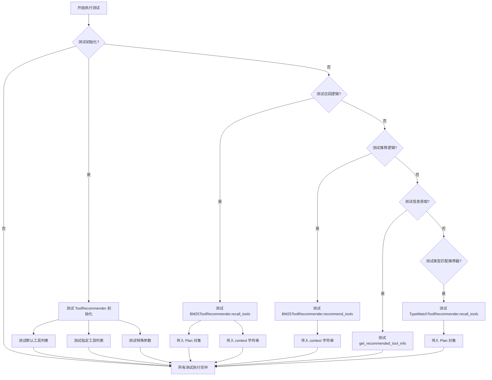

## 类结构

```
ToolRecommender (工具推荐器基类)
├── BM25ToolRecommender (基于 BM25 算法的推荐器)
└── TypeMatchToolRecommender (基于类型匹配的推荐器)
```

## 全局变量及字段


### `TOOL_REGISTRY`
    
全局工具注册表，用于管理和查询所有可用的工具。

类型：`ToolRegistry`
    


### `ToolRecommender.tools`
    
存储工具推荐器实例所管理的工具集合，键为工具名，值为工具对象。

类型：`Dict[str, Any]`
    


### `Plan.goal`
    
计划的目标或总体需求描述。

类型：`str`
    


### `Plan.tasks`
    
计划中包含的任务列表。

类型：`List[Task]`
    


### `Plan.task_map`
    
任务ID到任务对象的映射，便于快速查找任务。

类型：`Dict[str, Task]`
    


### `Plan.current_task_id`
    
当前正在执行或待处理的任务ID。

类型：`str`
    


### `Task.task_id`
    
任务的唯一标识符。

类型：`str`
    


### `Task.instruction`
    
任务的详细指令或描述。

类型：`str`
    


### `Task.task_type`
    
任务的类型分类，如'feature engineering'。

类型：`str`
    
    

## 全局函数及方法

### `mock_plan`

这是一个 Pytest 测试夹具（fixture），用于在单元测试中创建一个模拟的 `Plan` 对象。它使用 `mocker` 参数来支持潜在的模拟操作，并返回一个配置了特定任务和目标的 `Plan` 实例，以便于测试工具推荐器的功能。

参数：

- `mocker`：`pytest_mock.plugin.MockerFixture`，Pytest-mock 插件提供的模拟对象，用于在测试中模拟或打桩其他对象或函数。

返回值：`metagpt.schema.Plan`，一个包含预设任务和目标，用于测试的模拟计划对象。

#### 流程图

```mermaid
flowchart TD
    A[开始: mock_plan(mocker)] --> B[创建 task_map 字典<br>包含一个 Task 对象]
    B --> C[创建 Plan 对象<br>使用 task_map 和预设目标]
    C --> D[返回 Plan 对象]
    D --> E[结束]
```

#### 带注释源码

```python
@pytest.fixture
def mock_plan(mocker):
    # 创建一个任务字典，键为任务ID，值为Task对象。
    # 此Task模拟了一个“特征工程”任务。
    task_map = {
        "1": Task(
            task_id="1",
            instruction="conduct feature engineering, add new features on the dataset",
            task_type="feature engineering",
        )
    }
    # 使用上面创建的task_map来构建一个Plan对象。
    # 该Plan有一个测试目标，包含一个任务，并设置当前任务ID为"1"。
    plan = Plan(
        goal="test requirement",
        tasks=list(task_map.values()),
        task_map=task_map,
        current_task_id="1",
    )
    # 返回这个构建好的Plan对象，供测试函数使用。
    return plan
```

### `mock_bm25_tr`

这是一个 Pytest 测试固件（fixture），用于在单元测试中创建一个 `BM25ToolRecommender` 实例。它模拟了推荐器的初始化过程，并预置了特定的工具列表，以便在后续的测试用例中直接使用，确保测试环境的一致性和可重复性。

参数：

- `mocker`：`pytest-mock` 库提供的 `MockerFixture` 对象，用于在测试中进行模拟（mock）和打桩（stub）。在此固件中，该参数未被直接使用，但它是 Pytest 固件定义的标准参数。

返回值：`BM25ToolRecommender`，一个配置了特定工具列表（`["FillMissingValue", "PolynomialExpansion", "web scraping"]`）的 BM25 工具推荐器实例。

#### 流程图

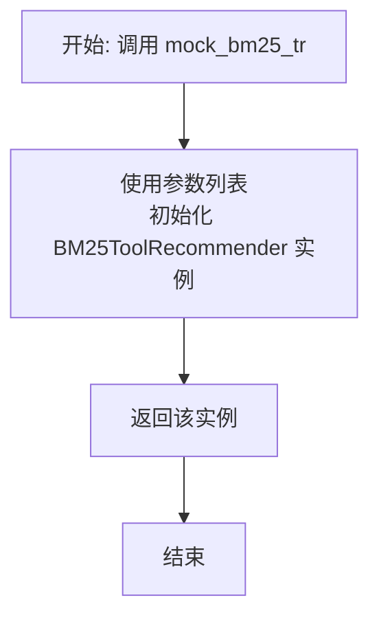

#### 带注释源码

```python
@pytest.fixture
def mock_bm25_tr(mocker):
    # 创建一个 BM25ToolRecommender 实例，并传入一个预定义的工具名称列表。
    # 这个列表包含 "FillMissingValue", "PolynomialExpansion", "web scraping"。
    # 其中 "web scraping" 是一个工具标签（tag），在初始化过程中会被解析为具体的工具（如 scrape_web_playwright）。
    tr = BM25ToolRecommender(tools=["FillMissingValue", "PolynomialExpansion", "web scraping"])
    # 将初始化好的推荐器实例返回，供测试函数使用。
    return tr
```

### `test_tr_init`

该函数是一个单元测试，用于验证 `ToolRecommender` 类在初始化时，其 `tools` 参数的处理逻辑。具体测试了当传入的工具列表中包含一个工具标签（如 "web scraping"）和一个不存在的工具名（如 "non-existing tool"）时，`ToolRecommender` 实例的 `tools` 属性是否正确映射和过滤。

参数：

- 无

返回值：`None`，该函数是一个测试函数，不返回任何值，仅通过断言（assert）来验证代码行为。

#### 流程图

```mermaid
flowchart TD
    A[开始] --> B[创建ToolRecommender实例<br>传入包含工具标签和不存在的工具名的列表]
    B --> C[检查实例的tools属性]
    C --> D{断言：<br>tools的键列表是否等于<br>['FillMissingValue', 'PolynomialExpansion', 'scrape_web_playwright']}
    D -->|是| E[测试通过]
    D -->|否| F[测试失败，抛出异常]
    E --> G[结束]
    F --> G
```

#### 带注释源码

```python
def test_tr_init():
    # 创建一个 ToolRecommender 实例，传入一个工具列表。
    # 列表中包含两个具体的工具名（"FillMissingValue", "PolynomialExpansion"）、
    # 一个工具标签（"web scraping"）和一个不存在的工具名（"non-existing tool"）。
    tr = ToolRecommender(tools=["FillMissingValue", "PolynomialExpansion", "web scraping", "non-existing tool"])
    
    # 断言：检查实例的 `tools` 字典的键列表。
    # 预期行为：
    # 1. "FillMissingValue" 和 "PolynomialExpansion" 作为具体工具名被保留。
    # 2. "web scraping" 是一个工具标签，它应该被映射到其对应的具体工具名 "scrape_web_playwright"。
    # 3. "non-existing tool" 在工具注册表中不存在，应该被过滤掉。
    # 因此，最终的键列表应为这三个有效工具的名称。
    assert list(tr.tools.keys()) == [
        "FillMissingValue",
        "PolynomialExpansion",
        "scrape_web_playwright",
    ]
```

### `test_tr_init_default_tools_value`

该函数是一个单元测试，用于验证当不向 `ToolRecommender` 类的构造函数传递任何参数时，其内部的 `tools` 属性会被正确地初始化为一个空字典。

参数：
- 无

返回值：`None`，该函数是一个测试函数，不返回任何值，仅通过 `assert` 语句进行断言。

#### 流程图

```mermaid
flowchart TD
    A[开始] --> B[创建ToolRecommender实例<br>tr = ToolRecommender()]
    B --> C[断言tr.tools == {}]
    C --> D{断言是否通过？}
    D -- 是 --> E[测试通过]
    D -- 否 --> F[测试失败]
    E --> G[结束]
    F --> G
```

#### 带注释源码

```python
def test_tr_init_default_tools_value():
    # 创建一个 ToolRecommender 类的实例，不传递任何参数。
    # 这应该触发其默认的初始化行为。
    tr = ToolRecommender()
    # 断言：新创建的实例的 `tools` 属性应该是一个空字典。
    # 这验证了当不提供 `tools` 参数时，`ToolRecommender` 的默认行为是初始化一个空的工具字典。
    assert tr.tools == {}
```

### `test_tr_init_tools_all`

这是一个单元测试函数，用于测试 `ToolRecommender` 类在初始化时传入特殊参数 `["<all>"]` 的行为。该测试验证了当传入此参数时，`ToolRecommender` 实例的 `tools` 属性是否会被初始化为包含 `TOOL_REGISTRY` 中注册的所有工具。

参数：
- 无显式参数。作为 `pytest` 测试函数，它不接受用户定义的参数。

返回值：`None`，测试函数通常不返回值，其成功与否由 `assert` 语句决定。

#### 流程图

```mermaid
flowchart TD
    A[开始测试] --> B[创建ToolRecommender实例<br>传入tools参数为列表`["<all>"]`]
    B --> C[获取实例的tools属性<br>（预期为所有注册工具的字典）]
    C --> D[获取TOOL_REGISTRY中所有工具的键列表]
    D --> E{两个列表是否相等？}
    E -- 是 --> F[测试通过]
    E -- 否 --> G[测试失败，抛出AssertionError]
    F --> H[结束]
    G --> H
```

#### 带注释源码

```python
def test_tr_init_tools_all():
    # 1. 实例化ToolRecommender，传入特殊参数["<all>"]。
    #    预期行为：实例应加载TOOL_REGISTRY中注册的所有工具。
    tr = ToolRecommender(tools=["<all>"])
    
    # 2. 断言：检查实例的tools字典的键列表是否与从TOOL_REGISTRY获取的所有工具的键列表完全一致。
    #    tr.tools.keys(): 获取实例当前加载的工具名称列表。
    #    TOOL_REGISTRY.get_all_tools().keys(): 从全局工具注册表获取所有已注册工具的名称列表。
    #    这个断言验证了“<all>”参数确实触发了加载所有工具的逻辑。
    assert list(tr.tools.keys()) == list(TOOL_REGISTRY.get_all_tools().keys())
```

### `test_bm25_tr_recall_with_plan`

这是一个使用 `pytest` 框架编写的异步单元测试函数，用于测试 `BM25ToolRecommender` 类的 `recall_tools` 方法在传入一个 `Plan` 对象时的行为。它验证了方法能正确召回工具，并检查返回的工具列表的长度和第一个工具的名称是否符合预期。

参数：
-  `mock_plan`：`Plan`，一个通过 `@pytest.fixture` 装饰器创建的模拟 `Plan` 对象，包含一个任务。
-  `mock_bm25_tr`：`BM25ToolRecommender`，一个通过 `@pytest.fixture` 装饰器创建的 `BM25ToolRecommender` 实例，预加载了特定的工具列表。

返回值：`None`，这是一个测试函数，不返回业务值，其目的是通过断言（`assert`）来验证代码行为。

#### 流程图

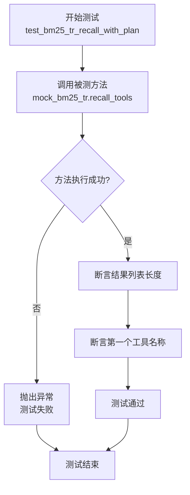

#### 带注释源码

```python
# 使用 pytest.mark.asyncio 装饰器标记此函数为异步测试函数
@pytest.mark.asyncio
# 定义测试函数，接收两个由pytest fixture提供的参数
async def test_bm25_tr_recall_with_plan(mock_plan, mock_bm25_tr):
    # 调用被测对象 mock_bm25_tr 的 recall_tools 方法，并传入模拟的 plan 对象
    # 使用 await 等待这个异步方法执行完成并获取结果
    result = await mock_bm25_tr.recall_tools(plan=mock_plan)
    
    # 断言1：验证返回的结果列表长度是否为3
    # 这检查了召回阶段是否返回了预期数量的工具候选
    assert len(result) == 3
    
    # 断言2：验证返回的结果列表中第一个工具的名称是否为 "PolynomialExpansion"
    # 这检查了基于BM25算法的工具推荐排序是否符合预期（PolynomialExpansion 应与“特征工程”最相关）
    assert result[0].name == "PolynomialExpansion"
```

### `test_bm25_tr_recall_no_plan`

这是一个使用 `pytest` 框架编写的异步单元测试函数，用于测试 `BM25ToolRecommender` 类的 `recall_tools` 方法在未提供 `plan` 参数（即 `plan=None`）时的行为。它验证了仅通过 `context` 文本描述也能正确召回并排序相关的工具。

参数：
- `mock_plan`：`pytest.fixture`，`Plan` 类型，一个用于测试的模拟计划对象。在本函数中未直接使用，但作为 fixture 被传入。
- `mock_bm25_tr`：`pytest.fixture`，`BM25ToolRecommender` 类型，一个预配置了工具列表的 `BM25ToolRecommender` 实例，作为被测对象。

返回值：`None`，这是一个测试函数，其主要目的是通过断言（`assert`）来验证代码行为，不返回业务值。

#### 流程图

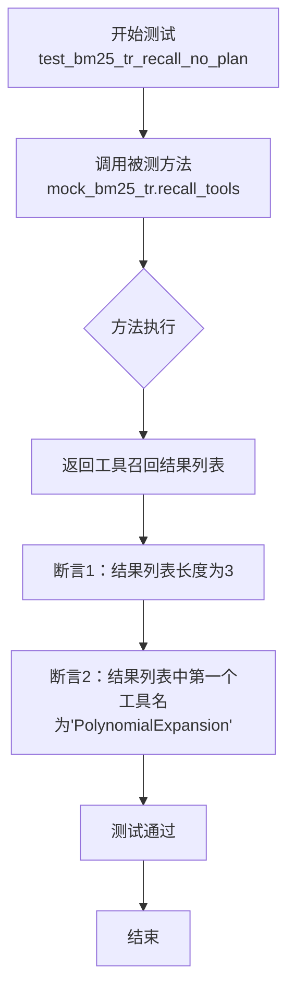

#### 带注释源码

```python
# 使用 pytest.mark.asyncio 装饰器标记此函数为异步测试函数
@pytest.mark.asyncio
# 定义测试函数，接收由 pytest fixtures 提供的 mock_plan 和 mock_bm25_tr 参数
async def test_bm25_tr_recall_no_plan(mock_plan, mock_bm25_tr):
    # 异步调用 mock_bm25_tr (BM25ToolRecommender 实例) 的 recall_tools 方法。
    # 传入 context 参数（任务描述文本），并显式设置 plan 参数为 None。
    # 此调用模拟了在没有完整计划对象，仅有任务描述时的工具召回场景。
    result = await mock_bm25_tr.recall_tools(
        context="conduct feature engineering, add new features on the dataset", plan=None
    )
    
    # 断言1：验证召回的工具列表 result 的长度为 3。
    # 这基于 mock_bm25_tr 初始化时传入了三个工具标识（"FillMissingValue", "PolynomialExpansion", "web scraping"），
    # 并且 recall_tools 方法预期会返回与 context 相关的所有工具。
    assert len(result) == 3
    
    # 断言2：验证结果列表中的第一个工具（相关性最高的工具）的名称是 "PolynomialExpansion"。
    # 这测试了 BM25 算法能根据 "conduct feature engineering..." 这个上下文，
    # 正确地将“多项式展开”这个特征工程工具识别为最相关的工具。
    assert result[0].name == "PolynomialExpansion"
```

### `test_bm25_recommend_tools`

这是一个使用 `pytest` 框架编写的异步单元测试函数，用于测试 `BM25ToolRecommender` 类的 `recommend_tools` 方法。该测试验证了在给定一个上下文描述（关于特征工程）时，推荐器能否正确地从预定义的工具列表中召回并排序相关工具，并过滤掉不相关的工具。

参数：

- `mock_bm25_tr`：`pytest.fixture`，一个预配置的 `BM25ToolRecommender` 实例，其工具列表包含 `["FillMissingValue", "PolynomialExpansion", "web scraping"]`。

返回值：`None`，这是一个测试函数，其主要目的是通过断言（`assert`）来验证代码行为，不返回业务值。

#### 流程图

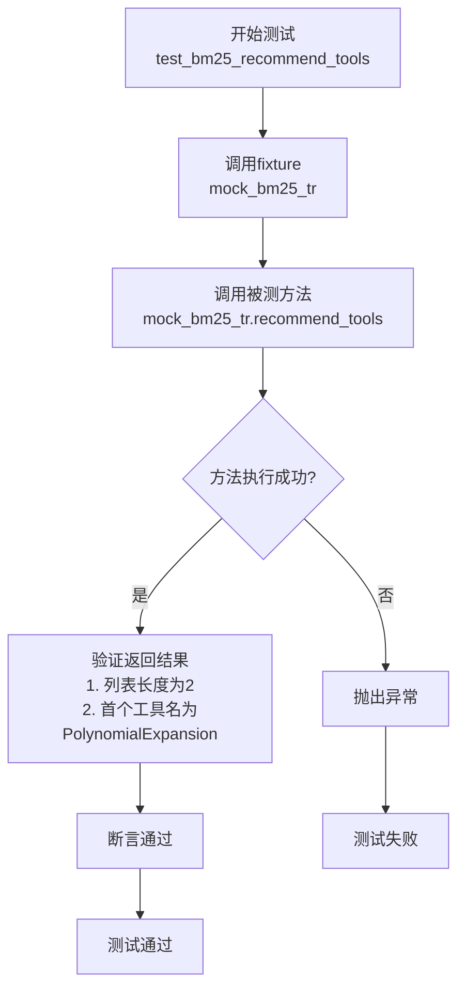

#### 带注释源码

```python
@pytest.mark.asyncio  # 装饰器，标记此函数为异步测试，以便pytest-asyncio插件能正确处理
async def test_bm25_recommend_tools(mock_bm25_tr):  # 函数定义，接收一个fixture作为参数
    # 调用 BM25ToolRecommender 实例的 recommend_tools 方法，传入一个关于“特征工程”的上下文描述
    result = await mock_bm25_tr.recommend_tools(context="conduct feature engineering, add new features on the dataset")
    
    # 断言1：验证返回的工具推荐列表长度为2。
    # 根据测试设定，初始有3个工具，但`web scraping`工具应在排序阶段被过滤掉。
    assert len(result) == 2  # web scraping tool should be filtered out at rank stage
    
    # 断言2：验证排序后位于第一位的推荐工具名称是“PolynomialExpansion”。
    # 这测试了BM25算法能否根据上下文语义正确地将“特征工程”相关的工具排在前面。
    assert result[0].name == "PolynomialExpansion"
```

### `test_get_recommended_tool_info`

这是一个使用 `pytest` 框架编写的异步单元测试函数，用于测试 `BM25ToolRecommender` 类的 `get_recommended_tool_info` 方法。该测试验证当传入一个模拟的 `Plan` 对象时，方法能够成功执行并返回一个字符串类型的结果。

参数：

- `mock_plan`：`Plan`，通过 `@pytest.fixture` 装饰器提供的模拟计划对象，包含任务信息。
- `mock_bm25_tr`：`BM25ToolRecommender`，通过 `@pytest.fixture` 装饰器提供的 `BM25ToolRecommender` 实例，用于执行推荐。

返回值：`None`，这是一个测试函数，不返回业务值，其目的是通过断言来验证代码行为。

#### 流程图

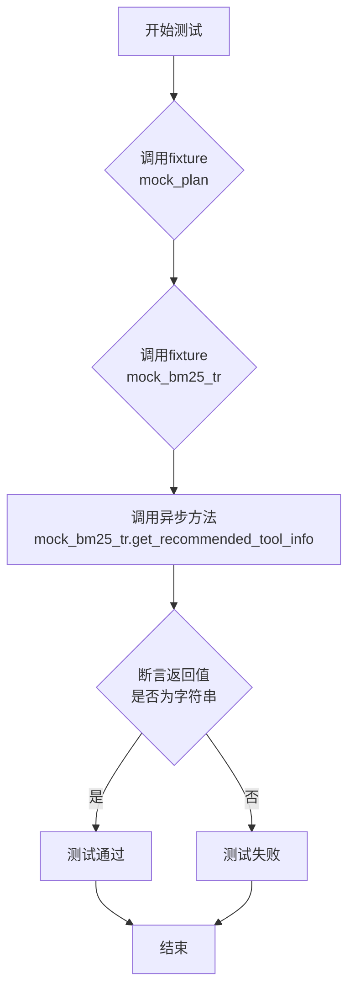

#### 带注释源码

```python
# 使用 pytest.mark.asyncio 装饰器标记此函数为异步测试
@pytest.mark.asyncio
# 定义测试函数，接收两个由pytest fixture提供的参数
async def test_get_recommended_tool_info(mock_plan, mock_bm25_tr):
    # 调用被测试的异步方法：BM25ToolRecommender实例的get_recommended_tool_info
    # 传入模拟的plan对象作为参数
    result = await mock_bm25_tr.get_recommended_tool_info(plan=mock_plan)
    # 使用assert语句验证结果：返回值必须是字符串类型
    # 这是测试的核心断言，确保方法按预期工作
    assert isinstance(result, str)
```

### `test_tm_tr_recall_with_plan`

这是一个使用 `pytest` 框架编写的异步单元测试函数，用于测试 `TypeMatchToolRecommender` 类的 `recall_tools` 方法。该测试验证了当传入一个包含特定任务的计划（`Plan`）时，类型匹配工具推荐器能否正确地根据任务类型召回并返回相关的工具列表。

参数：
-  `mock_plan`：`Plan`，一个由 `@pytest.fixture` 装饰器提供的测试夹具，模拟了一个包含“特征工程”任务的计划对象。
-  `mock_bm25_tr`：`BM25ToolRecommender`，一个由 `@pytest.fixture` 装饰器提供的测试夹具，模拟了一个BM25工具推荐器实例，在本测试中未直接使用，但作为夹具被传入。

返回值：`None`，测试函数通常不显式返回值，其成功与否由 `assert` 语句决定。

#### 流程图

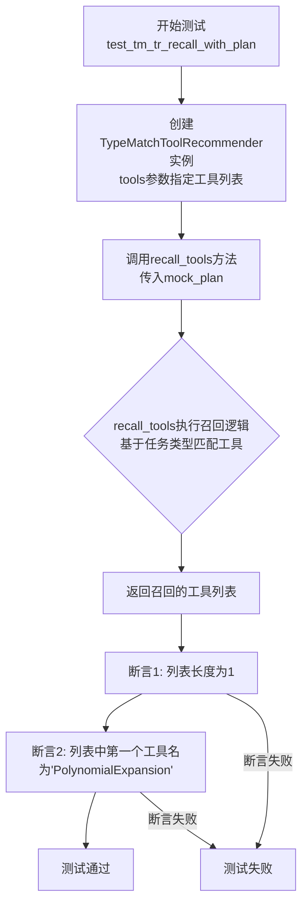

#### 带注释源码

```python
@pytest.mark.asyncio  # 标记此测试函数为异步函数，以便pytest-asyncio插件能正确处理
async def test_tm_tr_recall_with_plan(mock_plan, mock_bm25_tr):
    # 1. 创建待测试的TypeMatchToolRecommender实例，并传入一个预定义的工具名称列表。
    tr = TypeMatchToolRecommender(tools=["FillMissingValue", "PolynomialExpansion", "web scraping"])
    
    # 2. 异步调用推荐器的recall_tools方法，传入模拟的计划对象(mock_plan)。
    #    该方法预期根据计划中当前任务的类型（“feature engineering”）从工具列表中召回匹配的工具。
    result = await tr.recall_tools(plan=mock_plan)
    
    # 3. 断言1：验证召回的工具列表result的长度为1。
    #    这表明TypeMatchToolRecommender只从提供的三个工具中召回了一个与“特征工程”任务类型匹配的工具。
    assert len(result) == 1
    
    # 4. 断言2：验证召回的唯一工具的名称是'PolynomialExpansion'。
    #    这确认了类型匹配逻辑正确地识别出'PolynomialExpansion'是特征工程相关的工具。
    assert result[0].name == "PolynomialExpansion"
```

### `ToolRecommender.__init__`

初始化 `ToolRecommender` 实例，根据传入的工具名称列表或特殊标记（如 `<all>`）从全局工具注册表中加载对应的工具对象，并构建工具字典。如果未提供工具列表，则初始化为空字典。

参数：

- `tools`：`Optional[List[str]]`，可选参数，表示工具名称列表或特殊标记。如果为 `None`，则初始化为空字典；如果包含 `<all>`，则加载所有可用工具；否则，根据名称从注册表中查找并加载对应工具。

返回值：`None`，无返回值。

#### 流程图

```mermaid
flowchart TD
    A[开始] --> B{是否有tools参数?}
    B -->|是| C{tools是否为None?}
    B -->|否| D[初始化self.tools为{}]
    C -->|是| D
    C -->|否| E{tools是否为'<all>'?}
    E -->|是| F[从TOOL_REGISTRY获取所有工具]
    E -->|否| G[遍历tools列表<br>从TOOL_REGISTRY获取工具]
    F --> H[构建工具字典<br>key为工具名, value为工具对象]
    G --> H
    D --> I[结束]
    H --> I
```

#### 带注释源码

```python
def __init__(self, tools: Optional[List[str]] = None):
    """
    初始化ToolRecommender实例。
    
    根据传入的工具名称列表或特殊标记（如'<all>'）从全局工具注册表TOOL_REGISTRY中
    加载对应的工具对象，并构建工具字典。如果未提供工具列表，则初始化为空字典。
    
    Args:
        tools: 可选参数，工具名称列表或特殊标记。如果为None，则初始化为空字典；
               如果包含'<all>'，则加载所有可用工具；否则，根据名称从注册表中查找并加载对应工具。
    """
    if tools is None:
        # 如果tools为None，初始化空字典
        self.tools = {}
    elif "<all>" in tools:
        # 如果tools包含'<all>'，从TOOL_REGISTRY获取所有工具
        self.tools = TOOL_REGISTRY.get_all_tools()
    else:
        # 否则，遍历tools列表，从TOOL_REGISTRY获取对应工具
        self.tools = {}
        for tool_name in tools:
            # 根据工具名获取工具对象
            tool = TOOL_REGISTRY.get_tool(tool_name)
            if tool:
                # 如果工具存在，添加到字典中，key为工具名，value为工具对象
                self.tools[tool_name] = tool
            else:
                # 如果工具不存在，记录警告信息
                logger.warning(f"Tool {tool_name} not found in TOOL_REGISTRY")
```

### `ToolRecommender.recall_tools`

该方法是一个异步方法，用于根据给定的上下文（直接提供或从计划中提取）从预加载的工具集合中召回相关的工具。它首先确定要使用的查询文本，然后调用具体的召回算法（由子类实现）来获取候选工具列表。

参数：

- `context`：`Optional[str]`，可选的直接查询上下文字符串。如果提供，将优先使用此上下文进行工具召回。
- `plan`：`Optional[Plan]`，可选的计划对象。如果未提供`context`参数，则从该计划中当前任务的指令（`instruction`）提取查询上下文。

返回值：`List[Tool]`，返回一个`Tool`对象的列表，这些工具是根据查询上下文从`self.tools`中召回的相关工具。

#### 流程图

```mermaid
flowchart TD
    A[开始 recall_tools] --> B{是否提供了 context 参数?}
    B -- 是 --> C[使用 context 作为查询文本 query]
    B -- 否 --> D{是否提供了 plan 参数?}
    D -- 是 --> E[从 plan.current_task.instruction 提取查询文本 query]
    D -- 否 --> F[抛出 ValueError 异常]
    F --> G[结束]
    C --> H[调用 _recall 方法<br/>传入 query 进行召回]
    E --> H
    H --> I[返回召回的工具列表 List[Tool]]
    I --> J[结束]
```

#### 带注释源码

```python
    async def recall_tools(self, context: Optional[str] = None, plan: Optional[Plan] = None) -> List[Tool]:
        """
        Recall tools based on the given context or plan.

        Args:
            context: The context to use for recalling tools. If provided, it will be used directly.
            plan: The plan to use for recalling tools. If context is not provided, the instruction of the current task in the plan will be used.

        Returns:
            A list of recalled tools.

        Raises:
            ValueError: If neither context nor plan is provided.
        """
        # 确定查询文本的来源：优先使用显式提供的context，否则尝试从plan中获取。
        if context:
            query = context
        elif plan:
            # 从计划对象的当前任务中获取指令作为查询文本。
            query = plan.current_task.instruction
        else:
            # 如果两者都未提供，则抛出异常。
            raise ValueError("Either context or plan must be provided")
        # 调用内部方法 _recall 执行具体的召回逻辑，并返回结果。
        # 具体的召回算法（如BM25、类型匹配）在子类中实现的 _recall 方法里定义。
        return await self._recall(query)
```

### `ToolRecommender.recommend_tools`

该方法根据给定的上下文（任务描述）推荐最相关的工具。它首先通过召回阶段从工具库中筛选出与上下文语义相关的候选工具，然后通过排序阶段对这些候选工具进行评分和排序，最终返回一个按相关性排序的工具列表。

参数：
-  `context`：`str`，描述任务或需求的文本，用于匹配和推荐工具。

返回值：`List[Tool]`，一个按推荐分数降序排列的工具对象列表。

#### 流程图

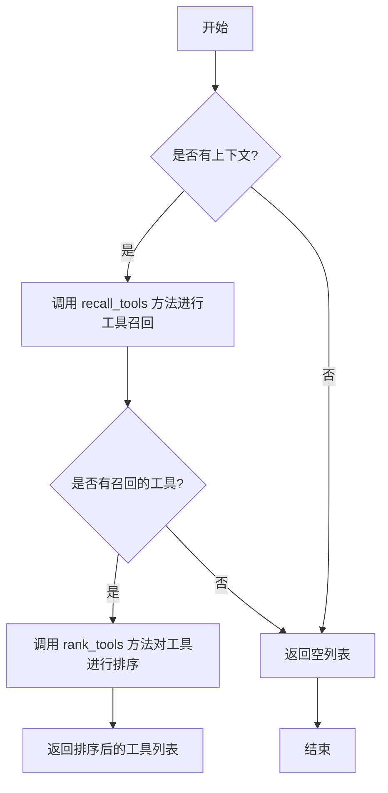

#### 带注释源码

```python
async def recommend_tools(self, context: str) -> List[Tool]:
    """
    根据给定的上下文推荐工具。
    该方法结合了召回和排序两个阶段来提供最相关的工具。

    Args:
        context (str): 描述任务或需求的文本。

    Returns:
        List[Tool]: 一个按推荐分数降序排列的工具对象列表。
    """
    # 1. 召回阶段：根据上下文从工具库中筛选出候选工具
    recalled_tools = await self.recall_tools(context=context)
    if not recalled_tools:
        # 如果没有召回任何工具，直接返回空列表
        return []

    # 2. 排序阶段：对召回的工具进行评分和排序
    ranked_tools = await self.rank_tools(recalled_tools, context)
    # 返回排序后的工具列表
    return ranked_tools
```

### `ToolRecommender.get_recommended_tool_info`

该方法根据给定的计划（Plan）或上下文（Context），通过召回（recall）和排序（rank）两个阶段，从预定义的工具集中推荐最相关的工具，并返回一个格式化的字符串，描述推荐的工具信息。

参数：

- `plan`：`Plan`，可选参数，包含任务目标和任务列表的计划对象。如果提供，将使用计划中的当前任务信息作为推荐上下文。
- `context`：`str`，可选参数，直接提供用于工具推荐的文本描述。如果未提供`plan`，则必须提供此参数。

返回值：`str`，一个格式化的字符串，描述了推荐的工具信息，包括工具名称和描述。

#### 流程图

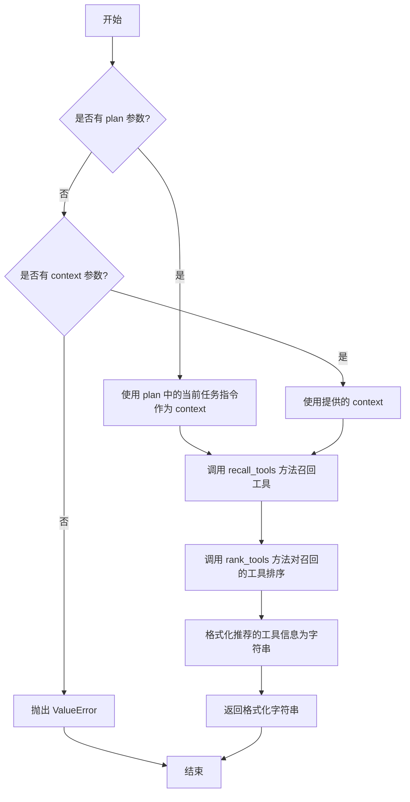

#### 带注释源码

```python
async def get_recommended_tool_info(self, plan: Plan = None, context: str = None) -> str:
    """
    获取推荐工具的格式化信息。

    该方法首先通过`recall_tools`方法基于`plan`或`context`召回潜在相关的工具，
    然后通过`rank_tools`方法对这些工具进行排序，最后将排序后的工具信息格式化为字符串返回。

    Args:
        plan (Plan, optional): 包含任务信息的计划对象。如果提供，将使用其当前任务的指令作为推荐上下文。
        context (str, optional): 用于工具推荐的文本描述。如果未提供`plan`，则此参数必须提供。

    Returns:
        str: 一个描述推荐工具信息的格式化字符串。

    Raises:
        ValueError: 当既未提供`plan`也未提供`context`时抛出。
    """
    # 确定用于工具推荐的上下文文本
    if plan:
        # 如果提供了plan，则使用当前任务的指令作为上下文
        context = plan.current_task.instruction
    elif not context:
        # 如果既没有plan也没有context，则抛出异常
        raise ValueError("Either plan or context must be provided")
    # 如果直接提供了context，则使用它

    # 第一阶段：召回。基于上下文从所有工具中筛选出潜在相关的工具列表。
    recalled_tools = await self.recall_tools(context=context, plan=plan)
    # 第二阶段：排序。对召回的工具根据与上下文的相关性进行排序。
    ranked_tools = await self.rank_tools(tools=recalled_tools, context=context, plan=plan)

    # 将排序后的工具列表格式化为易读的字符串。
    # 每个工具的信息包括其名称和描述。
    info = "\n".join([f"- {tool.name}: {tool.desc}" for tool in ranked_tools])
    return info
```

### `BM25ToolRecommender.__init__`

该方法用于初始化BM25ToolRecommender类的实例，主要功能是设置工具列表并构建BM25索引，以便后续基于文本相似度进行工具推荐。

参数：

- `tools`：`list[str] | None`，可选参数，指定要包含在推荐器中的工具名称列表。如果为None，则使用空列表；如果包含特殊标记"<all>"，则使用所有注册的工具。
- `k1`：`float`，可选参数，BM25算法中的k1参数，控制词频饱和度，默认值为1.5。
- `b`：`float`，可选参数，BM25算法中的b参数，控制文档长度归一化，默认值为0.75。

返回值：`None`，构造函数不返回任何值。

#### 流程图

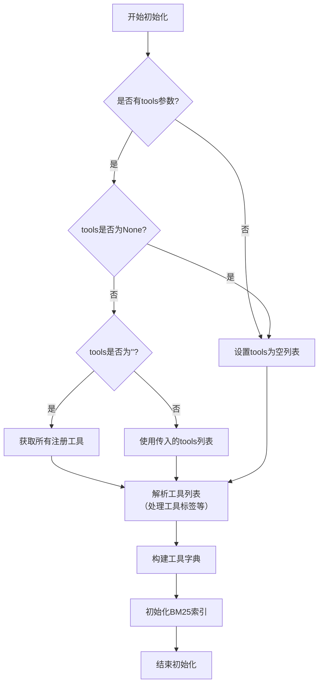

#### 带注释源码

```python
def __init__(self, tools: list[str] | None = None, k1: float = 1.5, b: float = 0.75):
    """
    初始化BM25ToolRecommender实例。

    参数:
        tools: 工具名称列表。如果为None，则使用空列表；如果包含"<all>"，则使用所有注册工具。
        k1: BM25算法的k1参数，默认1.5。
        b: BM25算法的b参数，默认0.75。
    """
    # 调用父类ToolRecommender的构造函数，传入工具列表
    super().__init__(tools=tools)
    # 设置BM25算法的参数
    self.k1 = k1
    self.b = b
    # 初始化BM25索引，用于后续的文本相似度计算
    self._init_bm25()
```

### `BM25ToolRecommender.recall_tools`

该方法基于BM25算法，根据给定的上下文（直接文本或从计划中提取的任务指令）从预加载的工具集中召回最相关的工具。它首先确定查询文本，然后使用BM25模型计算查询与每个工具描述之间的相关性分数，最后根据分数对工具进行排序并返回。

参数：
- `context`：`Optional[str]`，直接提供的查询上下文文本。如果未提供，将从`plan`参数中提取。
- `plan`：`Optional[Plan]`，包含任务信息的计划对象。如果提供了`plan`，将使用当前任务的指令作为查询上下文。

返回值：`List[Tool]`，按相关性分数降序排列的工具对象列表。

#### 流程图

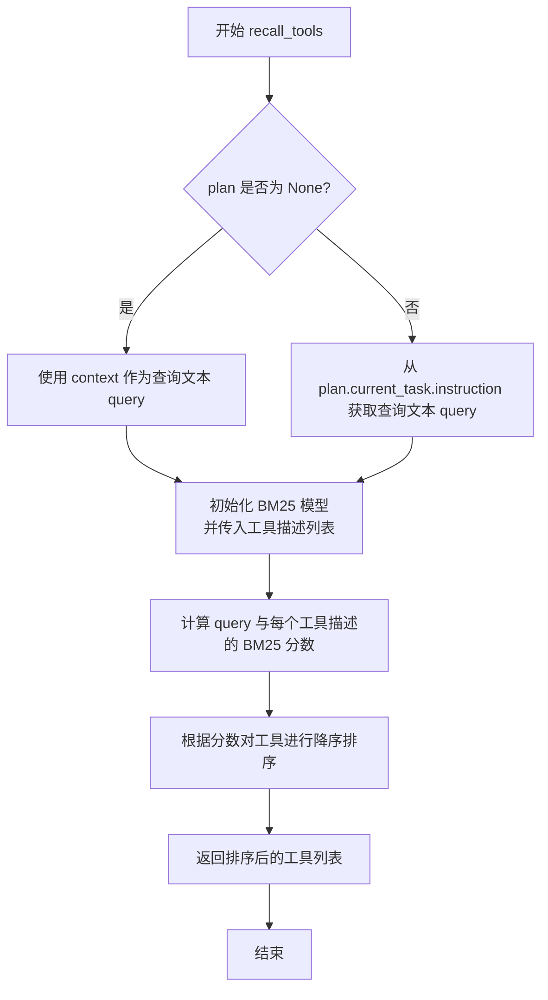

#### 带注释源码

```python
async def recall_tools(
    self,
    context: Optional[str] = None,
    plan: Optional[Plan] = None,
) -> List[Tool]:
    """
    Recall tools based on the given context or plan using BM25 algorithm.

    Args:
        context: The context to use for recalling tools. If not provided, the plan will be used.
        plan: The plan containing the task to use for recalling tools.

    Returns:
        A list of recalled tools.
    """
    # 确定查询文本：优先使用显式提供的context，否则从plan的当前任务指令中获取
    if context is None:
        if plan is None:
            return []
        query = plan.current_task.instruction
    else:
        query = context

    # 准备工具描述列表，用于BM25模型计算
    # self.tools 是一个字典，key为工具名，value为Tool对象
    # 提取每个Tool对象的描述（desc属性）作为文档
    docs = [tool.desc for tool in self.tools.values()]

    # 初始化BM25模型并传入文档集
    bm25 = BM25(docs)

    # 对查询文本进行分词（这里假设使用空格简单分割，实际可能使用更复杂的分词器）
    query_tokens = query.split()

    # 计算查询与每个工具描述文档的BM25分数
    scores = bm25.get_scores(query_tokens)

    # 将工具、其原始索引和分数组合在一起
    # enumerate(self.tools.values()) 遍历所有Tool对象及其索引
    tool_score_pairs = list(enumerate(self.tools.values()))
    for idx, (tool_idx, _) in enumerate(tool_score_pairs):
        # 将计算得到的分数赋值给对应的工具对
        tool_score_pairs[idx] = (tool_idx, scores[tool_idx])

    # 根据BM25分数对工具进行降序排序
    # key=lambda x: x[1] 表示按每个元组的第二个元素（即分数）排序
    # reverse=True 表示降序排列
    sorted_pairs = sorted(tool_score_pairs, key=lambda x: x[1], reverse=True)

    # 从排序后的对中提取Tool对象，形成最终的结果列表
    recalled_tools = [tool for _, tool in sorted_pairs]

    return recalled_tools
```

### `BM25ToolRecommender.recommend_tools`

该方法基于给定的上下文（context），使用BM25算法从预加载的工具集中召回相关工具，然后通过一个排名阶段（rank）对召回的工具进行过滤和排序，最终返回一个推荐的工具列表。其核心是一个两阶段的推荐流程：召回（recall）和排名（rank）。

参数：

- `context`：`str`，描述任务或需求的文本上下文，用于匹配和召回相关工具。
- `plan`：`Plan | None`，可选参数，包含任务和目标的计划对象。如果提供，将使用计划中的信息来辅助工具推荐。

返回值：`list[Tool]`，一个经过召回和排名后推荐的`Tool`对象列表。

#### 流程图

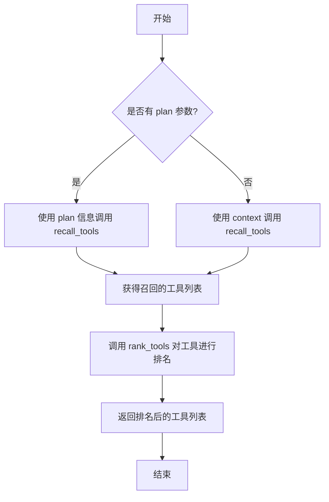

#### 带注释源码

```python
async def recommend_tools(
    self,
    context: str,
    plan: Plan | None = None,
) -> list[Tool]:
    """
    推荐与给定上下文或计划相关的工具。
    该方法首先通过`recall_tools`方法基于BM25算法召回相关工具，
    然后通过`rank_tools`方法对召回的工具进行过滤和排序。

    Args:
        context (str): 描述任务或需求的文本上下文。
        plan (Plan | None, optional): 可选的任务计划对象。默认为None。

    Returns:
        list[Tool]: 经过召回和排名后推荐的Tool对象列表。
    """
    # 步骤1: 召回阶段
    # 根据是否有plan参数，决定调用recall_tools的方式
    if plan:
        # 如果提供了plan，则使用plan中的信息进行工具召回
        recalled_tools = await self.recall_tools(plan=plan)
    else:
        # 如果未提供plan，则直接使用context进行工具召回
        recalled_tools = await self.recall_tools(context=context)

    # 步骤2: 排名阶段
    # 对召回的工具列表进行排名，可能涉及相关性评分、类型匹配度计算等
    ranked_tools = await self.rank_tools(recalled_tools)

    # 返回最终排名后的工具列表
    return ranked_tools
```

### `TypeMatchToolRecommender.__init__`

该方法用于初始化 `TypeMatchToolRecommender` 类的实例。它继承自 `ToolRecommender` 基类，并调用父类的 `__init__` 方法来设置工具列表。`TypeMatchToolRecommender` 是一个基于任务类型与工具类型匹配的推荐器，其初始化过程主要是配置可用的工具集。

参数：

- `tools`：`Optional[List[str]]`，可选参数，指定要初始化的工具名称列表。如果为 `None`，则使用空列表；如果包含特殊字符串 `"<all>"`，则会注册所有可用工具。

返回值：`None`，此方法不返回任何值，仅用于初始化对象状态。

#### 流程图

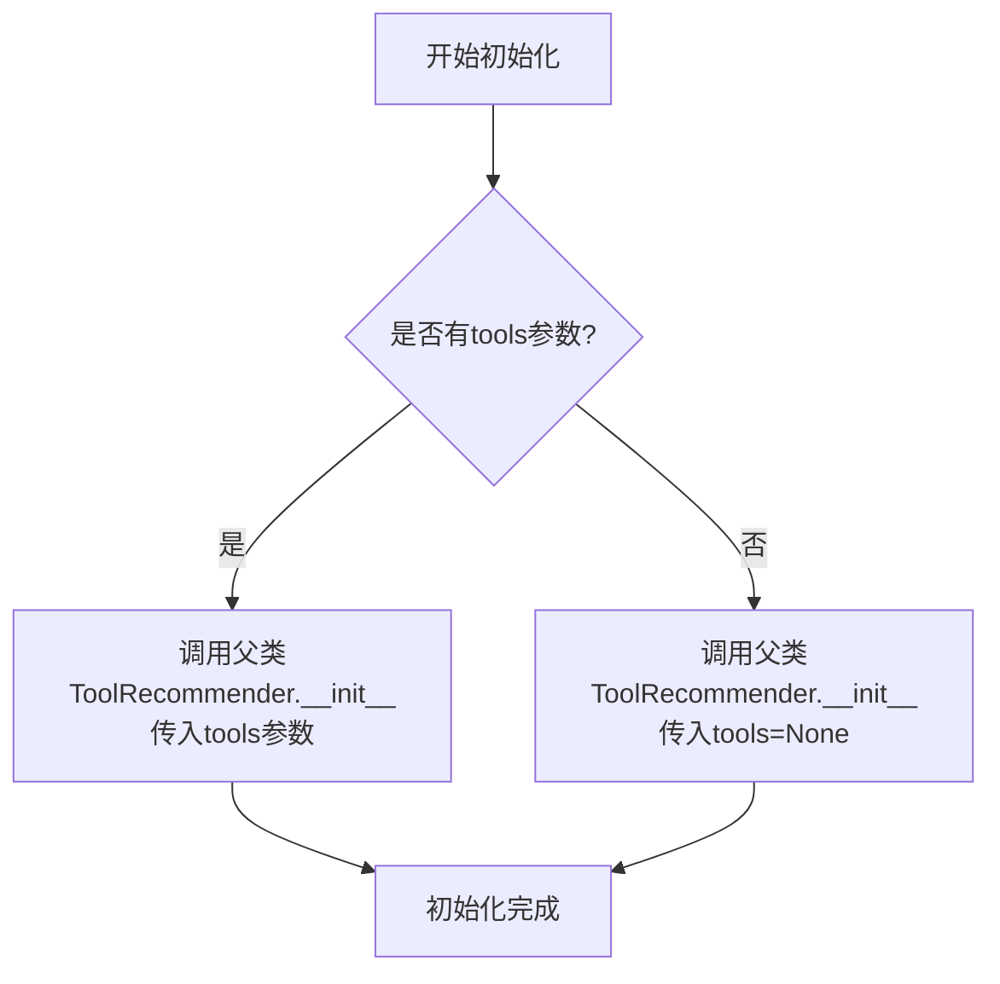

#### 带注释源码

```python
def __init__(self, tools: Optional[List[str]] = None):
    """
    初始化 TypeMatchToolRecommender 实例。

    该方法调用父类 ToolRecommender 的构造函数，传入工具列表。
    TypeMatchToolRecommender 根据任务类型与工具类型的匹配度来推荐工具。

    Args:
        tools (Optional[List[str]]): 工具名称列表。如果为 None，则初始化为空列表。
                                     如果包含 "<all>"，则会注册所有可用工具。
    """
    super().__init__(tools=tools)  # 调用父类构造函数完成基础工具配置
```

### `TypeMatchToolRecommender.recall_tools`

该方法根据给定的任务计划（`Plan`）或上下文描述，通过匹配任务类型与工具标签，从预加载的工具集中召回相关的工具。其核心逻辑是优先使用计划中当前任务的类型进行匹配，若无计划则使用提供的上下文字符串。匹配过程基于工具在注册时定义的标签（`tags`）是否包含任务类型关键词。

参数：

- `plan`：`Optional[Plan]`，可选的任务计划对象。如果提供，将使用计划中当前任务的`task_type`作为匹配依据。
- `context`：`Optional[str]`，可选的上下文描述字符串。当`plan`为`None`时，将使用此上下文进行类型匹配。

返回值：`List[Tool]`，返回一个`Tool`对象列表，这些工具的名称或标签与任务类型相匹配。

#### 流程图

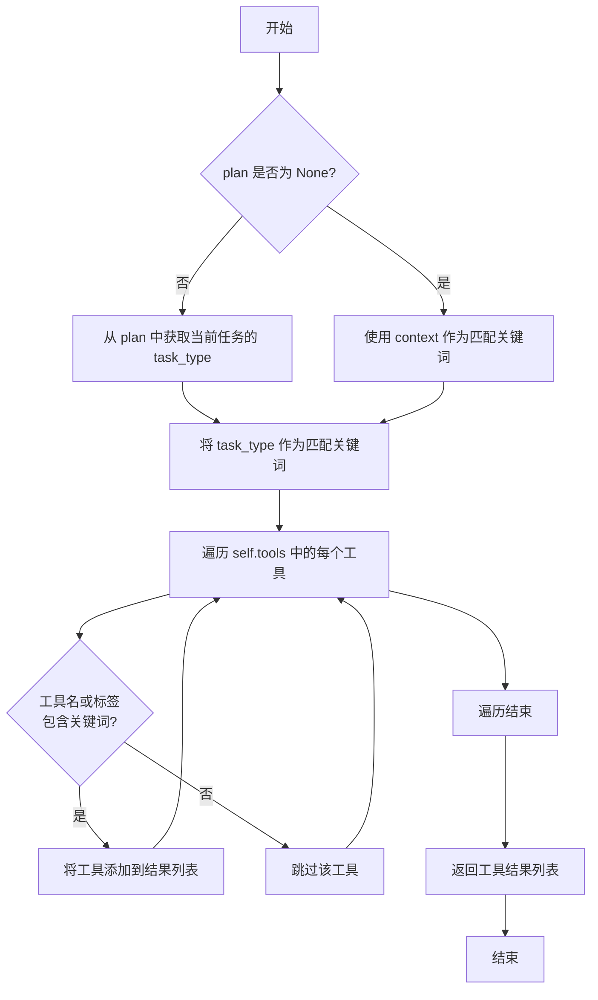

#### 带注释源码

```python
async def recall_tools(
    self,
    plan: Optional[Plan] = None,
    context: Optional[str] = None,
) -> List[Tool]:
    """
    根据任务类型召回工具。
    优先使用 plan 中当前任务的 task_type 进行匹配。
    如果没有 plan，则使用 context 进行匹配。
    匹配逻辑：检查工具名或工具的 tags 是否包含任务类型关键词。
    """
    # 确定用于匹配的关键词：优先从plan中获取任务类型，否则使用context
    if plan:
        key = plan.current_task.task_type
    else:
        key = context

    # 如果没有任何匹配关键词，则返回空列表
    if not key:
        return []

    result = []
    # 遍历所有预加载的工具
    for tool in self.tools.values():
        # 匹配条件1：工具的名称包含关键词
        # 匹配条件2：工具的标签（tags）列表包含关键词
        if key in tool.name or (tool.tags and key in tool.tags):
            result.append(tool)
    return result
```

## 关键组件


### ToolRecommender

工具推荐器的抽象基类，定义了工具推荐系统的基本接口和通用逻辑，包括工具集的初始化、过滤和召回机制。

### BM25ToolRecommender

基于BM25算法的工具推荐器实现，通过文本相似度计算从工具集中召回与任务描述最相关的工具。

### TypeMatchToolRecommender

基于类型匹配的工具推荐器实现，通过匹配任务类型与工具标签来召回相关工具。

### TOOL_REGISTRY

全局工具注册表，负责管理和提供系统中所有可用工具的信息。

### Plan

计划数据结构，包含目标、任务列表和当前任务信息，为工具推荐提供上下文。

### Task

任务数据结构，包含任务指令、类型等元数据，是工具推荐的主要输入依据。


## 问题及建议


### 已知问题

-   **测试代码中使用了不存在的工具名称**：在 `test_tr_init` 测试用例中，初始化 `ToolRecommender` 时传入了一个 `"non-existing tool"` 字符串。虽然测试的目的是验证工具过滤逻辑，但这暴露了代码对无效输入的处理方式可能不够明确，或者工具注册表的容错机制可能存在问题。如果生产代码中传入类似无效字符串，可能导致未定义行为或错误。
-   **测试用例 `test_bm25_recommend_tools` 的断言逻辑脆弱**：该测试断言结果长度为2，并断言 `"web scraping"` 工具在排序阶段被过滤。这个断言高度依赖于 `BM25ToolRecommender` 内部 `rank_tools` 方法的实现细节（即当前对 `"web scraping"` 这类工具标签的过滤逻辑）。如果未来排序或过滤策略发生变化（例如，开始支持工具标签或修改了过滤条件），此测试将失败，即使核心的推荐功能仍然正确。这属于与实现细节过度耦合的测试。
-   **测试数据构造存在硬编码和重复**：`mock_plan` 和 `mock_bm25_tr` 这两个 fixture 在多个测试中被使用，其中 `mock_bm25_tr` 固定了工具列表 `["FillMissingValue", "PolynomialExpansion", "web scraping"]`。当需要测试不同工具组合或边界情况时，需要创建新的 fixture 或重复代码，不利于测试的维护和扩展。
-   **异步测试标记可能多余**：所有测试方法都使用了 `@pytest.mark.asyncio` 装饰器。如果项目配置了 `pytest-asyncio` 为默认模式（例如通过 `pytest.ini`），这些装饰器可能是多余的，增加了代码冗余。

### 优化建议

-   **增强工具名称验证与错误处理**：建议在 `ToolRecommender` 的初始化方法中，对传入的 `tools` 参数进行更严格的验证。对于无法在 `TOOL_REGISTRY` 中查找到的工具名或标签，可以记录警告（logging.warning），明确忽略，或者抛出一个自定义的、信息更清晰的异常（如 `ToolNotFoundError`），使错误更早暴露且更易理解。
-   **重构脆弱的测试断言**：对于 `test_bm25_recommend_tools` 测试，应将其重构为更关注行为而非具体实现。例如，可以断言推荐结果中不包含 `"web scraping"` 这个*工具标签*（通过检查工具对象的某个属性，如 `is_tag`），或者断言结果中的工具都是有效的、可执行的工具实例，而不是断言一个固定的结果数量。这样测试会更加健壮。
-   **使用参数化测试提高覆盖率和可维护性**：利用 `@pytest.mark.parametrize` 对测试进行参数化。例如，可以将不同的工具列表、任务指令（context）和期望的推荐结果（或结果属性）作为参数，统一测试 `recall_tools` 和 `recommend_tools` 方法。这能减少重复代码，更清晰地表达测试意图，并轻松增加新的测试用例。
-   **清理不必要的异步装饰器**：检查项目的 pytest 配置。如果已全局启用异步支持，可以移除所有测试方法上的 `@pytest.mark.asyncio` 装饰器，使代码更简洁。如果某些测试需要特殊的异步事件循环策略，再单独标记。
-   **考虑添加集成测试或端到端测试**：当前测试集中于单个推荐器类的单元测试。建议补充一些集成测试，模拟更真实的用户场景，例如：给定一个完整的、多步骤的 `Plan`，验证 `ToolRecommender` 及其子类能否为每个任务推荐出合理的工具序列。这有助于发现单元测试难以覆盖的组件间交互问题。


## 其它


### 设计目标与约束

本模块的设计目标是提供一个灵活、可扩展的工具推荐系统，能够根据给定的任务描述（上下文）或计划（Plan）中的任务信息，从预定义的工具库中召回并推荐最相关的工具。核心约束包括：1) 支持多种推荐策略（如基于文本相似度的BM25和基于类型匹配的TypeMatch），并允许未来扩展新的推荐器；2) 能够处理工具别名或标签（如“web scraping”对应具体工具“scrape_web_playwright”）；3) 推荐流程需包含召回（recall）和排序/过滤（rank）两个阶段，以提高推荐精度；4) 接口设计需同时支持同步和异步调用，以适应不同的集成场景。

### 错误处理与异常设计

当前代码主要作为测试用例，未显式展示生产环境中的错误处理逻辑。基于其功能，预期的错误处理应包括：1) 初始化时，若传入的`tools`参数中包含不存在的工具名或标签，应记录警告并忽略该无效项，如`test_tr_init`测试所示。2) 在召回或推荐过程中，如果输入参数（如`context`或`plan`）为空或格式无效，应抛出明确的异常（如`ValueError`）或返回空结果集。3) 当底层工具注册表（`TOOL_REGISTRY`）访问失败时，应抛出运行时异常。4) 异步方法应妥善处理可能出现的`asyncio`相关异常。当前测试用例通过断言来验证正常行为，但未覆盖异常路径的测试。

### 数据流与状态机

模块的核心数据流始于用户输入（任务上下文或计划对象），结束于推荐的工具列表或工具信息字符串。具体流程：1) **输入**：`context`（字符串）或`plan`（包含`Task`对象的`Plan`实例）。2) **工具集初始化**：根据`ToolRecommender`初始化参数`tools`，从全局`TOOL_REGISTRY`解析并加载具体的工具对象到内部字典。3) **召回阶段**：由具体推荐器（如`BM25ToolRecommender.recall_tools`）执行，根据输入与工具描述计算相关性，返回初步工具列表。4) **排序/过滤阶段**：在`recommend_tools`方法中，对召回结果进行进一步处理（如过滤掉不匹配的工具），返回最终推荐列表。5) **输出**：工具对象列表或格式化的工具信息字符串。模块本身是无状态的，每次调用都是独立的。

### 外部依赖与接口契约

1.  **外部依赖**：
    *   `metagpt.schema.Plan` 和 `metagpt.schema.Task`：定义了任务计划的数据结构，是`recall_tools`方法的关键输入类型之一。
    *   `metagpt.tools.TOOL_REGISTRY`：全局工具注册表，用于根据工具名称或标签查找和获取具体的工具对象。这是工具列表初始化的基础。
    *   `pytest`：仅用于单元测试，不属于核心运行时依赖。
2.  **接口契约**：
    *   `ToolRecommender`及其子类定义了统一的接口：`recall_tools`、`recommend_tools`、`get_recommended_tool_info`。调用者需按照参数类型（`context: str` 或 `plan: Plan`）提供输入。
    *   子类（如`BM25ToolRecommender`、`TypeMatchToolRecommender`）必须实现`recall_tools`方法，并遵循其父类定义的签名和行为预期（返回`Tool`对象列表）。
    *   工具对象本身应具备`name`、`description`等属性，以供推荐算法使用。

### 测试策略与覆盖

当前代码文件本身是一个测试套件，展示了模块的测试策略：1) **单元测试**：针对`ToolRecommender`的初始化逻辑（`test_tr_init`, `test_tr_init_default_tools_value`, `test_tr_init_tools_all`）进行测试。2) **集成测试**：针对`BM25ToolRecommender`和`TypeMatchToolRecommender`的推荐功能进行测试，模拟了不同输入条件（有`plan`/无`plan`）并验证返回结果的数量和顺序。3) **异步支持测试**：所有测试推荐功能的方法均使用`@pytest.mark.asyncio`装饰器，确保异步方法正确工作。4) **夹具（Fixture）使用**：通过`@pytest.fixture`定义了`mock_plan`和`mock_bm25_tr`，实现了测试数据的复用和隔离。测试覆盖了核心的正常流程，但未包含异常和边界情况测试（如空输入、极端长度的上下文等）。

### 配置与扩展点

1.  **配置**：
    *   工具列表可通过`ToolRecommender`的`tools`参数配置，支持传入具体工具名列表、特殊标签`<all>`（获取所有工具）或留空。
    *   推荐算法的具体参数（如BM25的k1、b参数，类型匹配的规则）在当前代码中未暴露为配置项，硬编码在具体推荐器实现中。
2.  **扩展点**：
    *   **新增推荐算法**：可以通过继承`ToolRecommender`抽象基类并实现`recall_tools`方法来创建新的推荐器。
    *   **工具标签系统**：`TOOL_REGISTRY`支持工具标签（如“web scraping”），这是一个扩展点，允许将多个工具或功能聚合到一个标签下，供推荐系统使用。
    *   **排序/过滤策略**：`ToolRecommender.recommend_tools`方法中的排序和过滤逻辑是一个潜在的扩展点，可以被子类重写以实现更复杂的排名策略。

    