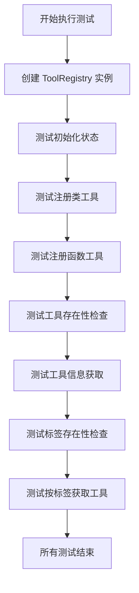
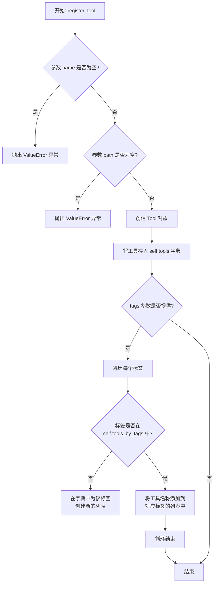
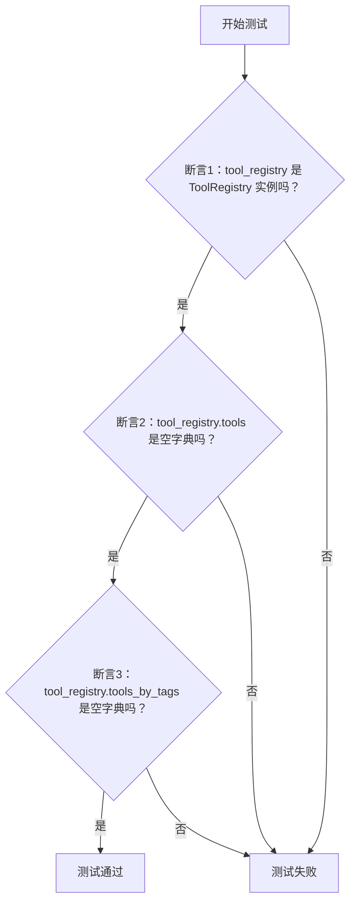
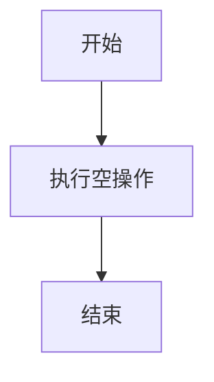
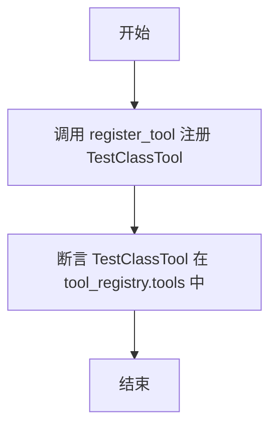
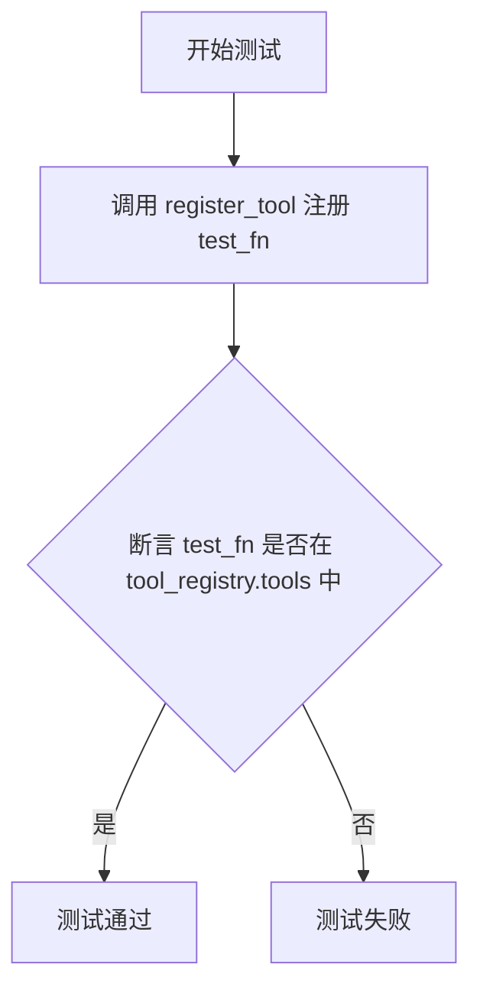
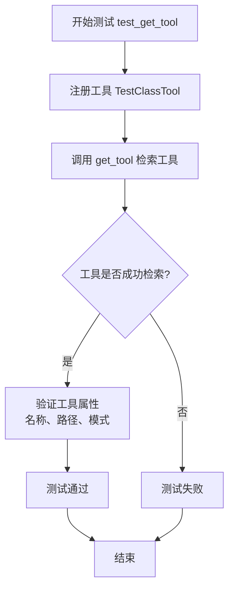
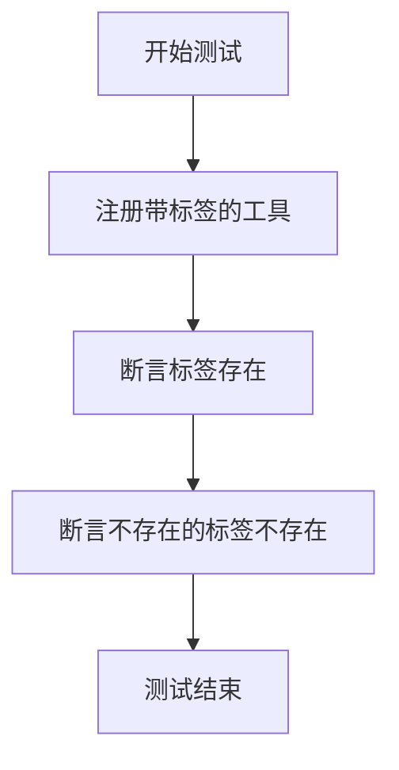
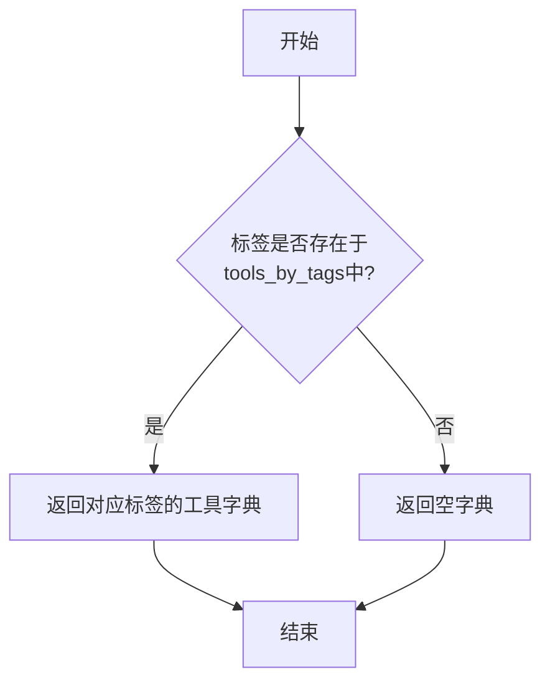
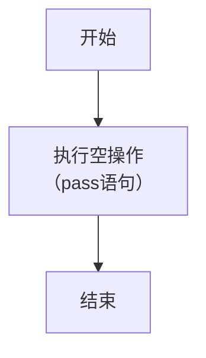

# `.\MetaGPT\tests\metagpt\tools\test_tool_registry.py` 详细设计文档

这是一个针对 ToolRegistry 类的单元测试文件，用于验证工具注册、查询、按标签分类等核心功能的正确性。

## 整体流程



## 类结构

```
TestClassTool (测试类)
├── test_class_fn (测试方法)
```

## 全局变量及字段


    

## 全局函数及方法

### `ToolRegistry.register_tool`

该方法用于向工具注册中心注册一个新的工具。它接收工具的名称、路径、可选的标签列表以及工具源对象（类或函数），并创建一个内部工具对象来存储这些信息。注册后，工具可以通过其名称或关联的标签进行检索。

参数：

-  `name`：`str`，要注册的工具的名称。
-  `path`：`str`，工具所在的文件路径。
-  `tags`：`list[str]`，可选参数，与工具关联的标签列表，用于分类和检索。
-  `tool_source_object`：`Any`，可选参数，工具的实际源对象（例如一个类或函数）。

返回值：`None`，该方法不返回任何值，其作用是将工具信息存储到注册中心的内部数据结构中。

#### 流程图



#### 带注释源码

```python
def register_tool(
    self,
    name: str,
    path: str,
    tags: list[str] = None,
    tool_source_object: Any = None,
):
    """
    注册一个工具到注册表。

    Args:
        name (str): 工具的名称。
        path (str): 工具所在的文件路径。
        tags (list[str], optional): 与工具关联的标签列表。默认为 None。
        tool_source_object (Any, optional): 工具的实际源对象（类或函数）。默认为 None。

    Raises:
        ValueError: 如果 `name` 或 `path` 为空。
    """
    # 参数校验：确保工具名称和路径不为空
    if not name:
        raise ValueError("Tool name cannot be empty")
    if not path:
        raise ValueError("Tool path cannot be empty")

    # 创建 Tool 对象，封装工具的所有元信息
    tool = Tool(
        name=name,
        path=path,
        tags=tags or [],  # 如果 tags 为 None，则使用空列表
        tool_source_object=tool_source_object,
    )

    # 将工具按名称存储到主字典中
    self.tools[name] = tool

    # 如果提供了标签，则按标签分类存储工具名称
    if tags:
        for tag in tags:
            # 如果该标签尚未在分类字典中，则为其创建一个新列表
            if tag not in self.tools_by_tags:
                self.tools_by_tags[tag] = []
            # 将当前工具的名称添加到对应标签的列表中
            self.tools_by_tags[tag].append(name)
```

### `test_initialization`

该函数是一个单元测试，用于验证 `ToolRegistry` 实例在初始化后的状态。它检查实例是否被正确创建，以及其内部的两个核心字典属性是否被初始化为空字典。

参数：

- `tool_registry`：`ToolRegistry`，通过 `pytest.fixture` 提供的 `ToolRegistry` 实例，作为被测对象。

返回值：`None`，该函数是测试函数，不返回任何值，仅通过断言进行验证。

#### 流程图



#### 带注释源码

```python
# Test Initialization
def test_initialization(tool_registry):
    # 断言1：验证传入的 tool_registry 参数确实是 ToolRegistry 类的实例
    assert isinstance(tool_registry, ToolRegistry)
    # 断言2：验证 ToolRegistry 实例的 tools 属性在初始化后是一个空字典
    assert tool_registry.tools == {}
    # 断言3：验证 ToolRegistry 实例的 tools_by_tags 属性在初始化后是一个空字典
    assert tool_registry.tools_by_tags == {}
```

### `test_fn`

这是一个简单的测试函数，主要用于演示或作为占位符，不执行任何实际逻辑。

参数：无

返回值：`None`，无返回值

#### 流程图



#### 带注释源码

```python
def test_fn():
    """test function"""
    pass
```

### `test_register_tool_class`

该函数是一个单元测试，用于验证 `ToolRegistry` 类的 `register_tool` 方法能够成功注册一个类工具。它通过向工具注册表注册一个名为 `TestClassTool` 的类，并断言该工具名称已存在于注册表的工具字典中，从而测试注册功能。

参数：

- `tool_registry`：`ToolRegistry`，通过 `pytest.fixture` 提供的 `ToolRegistry` 实例，用于执行注册和断言操作。

返回值：`None`，该函数不返回任何值，仅执行断言测试。

#### 流程图



#### 带注释源码

```python
# Test Tool Registration Class
def test_register_tool_class(tool_registry):
    # 调用 ToolRegistry 实例的 register_tool 方法，注册一个名为 "TestClassTool" 的类工具。
    # 参数说明：
    #   - "TestClassTool": 要注册的工具名称。
    #   - "/path/to/tool": 工具所在的路径（在此测试中为模拟路径）。
    #   - tool_source_object=TestClassTool: 工具源对象，即要注册的类本身。
    tool_registry.register_tool("TestClassTool", "/path/to/tool", tool_source_object=TestClassTool)
    
    # 断言：检查注册后，工具名称 "TestClassTool" 是否存在于 tool_registry.tools 字典中。
    # 这是验证 register_tool 方法功能是否正确的核心断言。
    assert "TestClassTool" in tool_registry.tools
```

### `test_register_tool_fn`

该函数是一个单元测试，用于验证 `ToolRegistry` 类的 `register_tool` 方法能够成功注册一个函数类型的工具。它通过向工具注册表注册一个名为 `test_fn` 的函数，并断言该工具名称已存在于注册表的工具字典中，从而测试注册功能。

参数：

- `tool_registry`：`ToolRegistry`，一个通过 `pytest.fixture` 提供的 `ToolRegistry` 实例，作为测试的上下文。

返回值：`None`，该函数不返回任何值，仅用于执行断言测试。

#### 流程图



#### 带注释源码

```python
# Test Tool Registration Function
def test_register_tool_fn(tool_registry):
    # 调用 ToolRegistry 实例的 register_tool 方法，注册一个名为 "test_fn" 的工具。
    # 参数说明：
    #   - "test_fn": 要注册的工具名称。
    #   - "/path/to/tool": 工具所在的路径（在此测试中为模拟路径）。
    #   - tool_source_object=test_fn: 工具源对象，即要注册的函数本身。
    tool_registry.register_tool("test_fn", "/path/to/tool", tool_source_object=test_fn)
    
    # 断言：检查注册后，工具名称 "test_fn" 是否存在于 tool_registry.tools 字典中。
    # 这是测试的核心，用于验证注册功能是否按预期工作。
    assert "test_fn" in tool_registry.tools
```

### `test_has_tool`

该函数是用于测试 `ToolRegistry` 类的 `has_tool` 方法。它首先向工具注册表中注册一个名为 `TestClassTool` 的工具，然后验证 `has_tool` 方法能正确识别已注册的工具，并确认对于不存在的工具返回 `False`。

参数：

- `tool_registry`：`ToolRegistry`，一个通过 `pytest.fixture` 提供的 `ToolRegistry` 实例，作为测试的上下文。

返回值：`None`，这是一个测试函数，不返回任何值，其断言结果由测试框架处理。

#### 流程图

```mermaid
flowchart TD
    A[开始测试] --> B[注册工具 TestClassTool]
    B --> C[断言: has_tool('TestClassTool') 为 True]
    C --> D[断言: has_tool('NonexistentTool') 为 False]
    D --> E[测试结束]
```

#### 带注释源码

```python
# Test Tool Existence Checks
def test_has_tool(tool_registry):
    # 1. 在提供的工具注册表实例中注册一个名为 "TestClassTool" 的工具。
    tool_registry.register_tool("TestClassTool", "/path/to/tool", tool_source_object=TestClassTool)
    
    # 2. 断言：调用 has_tool 方法检查已注册的工具名称应返回 True。
    assert tool_registry.has_tool("TestClassTool")
    
    # 3. 断言：调用 has_tool 方法检查一个不存在的工具名称应返回 False。
    assert not tool_registry.has_tool("NonexistentTool")
```

### `test_get_tool`

该函数是一个单元测试，用于验证 `ToolRegistry` 类的 `get_tool` 方法。它首先向工具注册表中注册一个名为“TestClassTool”的工具，然后尝试通过其名称检索该工具。测试断言检索到的工具不为空，并且其属性（如名称、路径和模式中包含“description”字段）符合预期。

参数：

- `tool_registry`：`ToolRegistry`，通过 `pytest.fixture` 提供的 `ToolRegistry` 实例，作为测试的上下文。

返回值：`None`，该函数是一个测试函数，不返回任何值，仅通过断言来验证功能。

#### 流程图



#### 带注释源码

```python
def test_get_tool(tool_registry):
    # 1. 准备阶段：向工具注册表注册一个名为“TestClassTool”的工具。
    #    该工具关联到类 `TestClassTool`，并指定其路径为 "/path/to/tool"。
    tool_registry.register_tool("TestClassTool", "/path/to/tool", tool_source_object=TestClassTool)
    
    # 2. 执行阶段：调用 `get_tool` 方法，尝试通过工具名称检索刚注册的工具。
    tool = tool_registry.get_tool("TestClassTool")
    
    # 3. 验证阶段：进行一系列断言以验证 `get_tool` 方法的行为。
    #    3.1 断言检索到的工具对象不为 None，确认工具存在。
    assert tool is not None
    #    3.2 断言工具的名称属性与注册时使用的名称一致。
    assert tool.name == "TestClassTool"
    #    3.3 断言工具的路径属性与注册时指定的路径一致。
    assert tool.path == "/path/to/tool"
    #    3.4 断言工具的 `schemas` 属性中包含 "description" 键。
    #        这通常用于验证工具的模式信息是否被正确构建和包含。
    assert "description" in tool.schemas
```

### `test_has_tool_tag`

该函数是一个单元测试，用于验证 `ToolRegistry` 类的 `has_tool_tag` 方法。它首先向工具注册表中注册一个带有特定标签的工具，然后断言该标签存在，并断言一个不存在的标签不存在。

参数：

- `tool_registry`：`ToolRegistry`，通过 `pytest.fixture` 提供的 `ToolRegistry` 实例，用于测试。

返回值：`None`，该函数是一个测试函数，不返回任何值，仅通过断言来验证功能。

#### 流程图



#### 带注释源码

```python
def test_has_tool_tag(tool_registry):
    # 向工具注册表注册一个名为 "TestClassTool" 的工具
    # 指定工具路径为 "/path/to/tool"
    # 提供工具源对象 TestClassTool
    # 为该工具添加两个标签: "machine learning" 和 "test"
    tool_registry.register_tool(
        "TestClassTool", "/path/to/tool", tool_source_object=TestClassTool, tags=["machine learning", "test"]
    )
    # 断言工具注册表的 has_tool_tag 方法在查询标签 "test" 时返回 True
    assert tool_registry.has_tool_tag("test")
    # 断言工具注册表的 has_tool_tag 方法在查询一个不存在的标签 "Non-existent tag" 时返回 False
    assert not tool_registry.has_tool_tag("Non-existent tag")
```

### `ToolRegistry.get_tools_by_tag`

该方法用于根据指定的标签（tag）从工具注册表中检索所有关联的工具。它接收一个标签字符串作为参数，返回一个字典，其中键为工具名称，值为对应的工具对象。如果指定的标签不存在，则返回一个空字典。

参数：

-  `tag`：`str`，用于筛选工具的标签名称。

返回值：`Dict[str, Tool]`，一个字典，包含所有标记有指定标签的工具。如果标签不存在，则返回空字典。

#### 流程图



#### 带注释源码

```python
def get_tools_by_tag(self, tag: str) -> Dict[str, Tool]:
    """
    根据标签获取工具。

    参数:
        tag (str): 用于筛选工具的标签。

    返回:
        Dict[str, Tool]: 一个字典，包含所有标记有指定标签的工具。
                         如果标签不存在，则返回空字典。
    """
    # 从内部字典 `tools_by_tags` 中获取指定标签对应的工具字典。
    # 如果标签不存在，则使用 `.get()` 方法返回一个空字典 `{}` 作为默认值。
    return self.tools_by_tags.get(tag, {})
```

### `TestClassTool.test_class_fn`

这是一个测试类中的测试方法，用于验证`TestClassTool`类中`test_class_fn`方法的基本结构。它本身不执行任何实际逻辑，仅作为测试框架（如pytest）中的一个占位符或示例测试用例。

参数：
-  `self`：`TestClassTool`，指向当前`TestClassTool`类实例的引用。

返回值：`None`，此方法不返回任何值。

#### 流程图



#### 带注释源码

```python
def test_class_fn(self):
    """test class fn"""  # 方法的文档字符串，说明这是一个测试类函数
    pass  # 空操作，表示方法体不执行任何代码
```

## 关键组件


### ToolRegistry

一个用于注册、管理和检索工具（函数或类）及其元数据的核心注册表组件。

### 工具注册

提供将工具（函数或类）及其元数据（如名称、路径、标签）注册到注册表中的功能。

### 工具查询

提供通过工具名称或标签来查询和检索已注册工具的功能。

### 工具存在性检查

提供检查指定名称的工具或指定标签是否存在于注册表中的功能。

### 标签管理

支持为工具添加标签，并允许通过标签对工具进行分组和筛选。


## 问题及建议

### 已知问题

-   **测试数据与逻辑耦合**：测试用例中硬编码了工具路径（如`"/path/to/tool"`）和标签（如`"test"`），这使得测试用例不够灵活，且当工具路径或标签逻辑变更时，需要修改多处测试代码。
-   **测试覆盖不完整**：测试用例主要验证了正常流程（Happy Path），但缺少对异常情况的测试，例如：注册同名工具、获取不存在的工具、传入无效参数（如空字符串、`None`）时系统的行为。
-   **测试用例存在重复代码**：多个测试函数（如`test_register_tool_class`、`test_has_tool`、`test_get_tool`）都重复了工具注册的步骤，这违反了DRY（Don‘t Repeat Yourself）原则，增加了维护成本。
-   **测试对象状态污染风险**：虽然使用了`pytest.fixture`，但所有测试共享同一个`tool_registry`实例。如果某个测试修改了注册表的状态（例如清空工具），可能会影响后续测试的执行结果，存在测试间耦合的风险。
-   **缺少对`tool_source_object`参数的验证测试**：测试中传入了类（`TestClassTool`）和函数（`test_fn`）作为`tool_source_object`，但未测试传入其他类型对象（如字符串、整数）或`None`时，`ToolRegistry.register_tool`方法的行为是否符合预期。

### 优化建议

-   **使用测试固件或工厂方法生成测试数据**：将工具名称、路径、标签等测试数据提取到固件（fixture）或工厂函数中。这样可以在一个地方统一管理测试数据，提高可维护性，并使测试用例更专注于测试逻辑本身。
-   **补充边界和异常测试用例**：增加测试用例以覆盖以下场景：
    -   尝试注册一个已存在名称的工具。
    -   尝试获取一个不存在的工具（`get_tool`应返回`None`还是抛出异常？需明确）。
    -   向`register_tool`传入空字符串、`None`等无效参数。
    -   测试`has_tool_tag`和`get_tools_by_tag`方法在传入空标签或`None`时的行为。
-   **重构测试代码以减少重复**：将公共的注册步骤提取到单独的固件或辅助函数中。例如，可以创建一个`registered_tool_registry`固件，它返回一个已预注册了特定工具的`ToolRegistry`实例，供多个测试用例使用。
-   **确保测试独立性**：检查`ToolRegistry`类是否在每次测试后需要重置。如果必要，可以调整`tool_registry`固件的范围（例如使用`scope="function"`，这是默认值），确保每个测试都获得一个全新的、状态隔离的实例。
-   **明确并测试`tool_source_object`的契约**：在测试中明确`ToolRegistry`对`tool_source_object`参数的类型要求（例如，必须是可调用对象或特定类型）。并添加相应的测试来验证当违反契约时，系统是优雅地处理（如记录日志并忽略）还是抛出明确的异常。这有助于定义清晰的接口。

## 其它


### 设计目标与约束

本测试套件的设计目标是验证 `ToolRegistry` 类的核心功能，包括工具的注册、查询、按标签分类和检索。约束在于测试应保持独立、可重复，并专注于 `ToolRegistry` 的公共接口，避免测试其内部实现细节或外部依赖。

### 错误处理与异常设计

测试用例主要验证正常流程下的功能正确性。对于错误场景（如查询不存在的工具或标签），测试通过断言 `has_tool` 和 `has_tool_tag` 返回 `False`，以及 `get_tool` 和 `get_tools_by_tag` 返回 `None` 或空字典来间接验证 `ToolRegistry` 的错误处理逻辑。测试本身不直接触发或断言特定的异常类型。

### 数据流与状态机

测试的数据流遵循 `Arrange-Act-Assert` 模式：
1.  **Arrange (准备)**：通过 `pytest.fixture` 初始化一个干净的 `ToolRegistry` 实例 (`tool_registry`)。
2.  **Act (执行)**：调用 `ToolRegistry` 的方法（如 `register_tool`, `has_tool`, `get_tool`）。
3.  **Assert (断言)**：验证执行结果是否符合预期（如字典中是否包含特定键、返回值是否非空、属性值是否正确）。

`ToolRegistry` 实例的状态在测试过程中发生变化（从空状态到注册了工具的状态），每个测试函数都从一个由 fixture 提供的初始状态开始，确保测试独立性。

### 外部依赖与接口契约

1.  **pytest框架**：测试套件依赖于 `pytest` 框架来提供测试发现、运行、夹具 (`fixture`) 管理和断言功能。
2.  **ToolRegistry 类**：这是被测试的主要对象，来自 `metagpt.tools.tool_registry` 模块。测试依赖于其 `register_tool`, `has_tool`, `get_tool`, `has_tool_tag`, `get_tools_by_tag` 等方法的公开接口契约。
3.  **测试工具对象**：测试中定义的 `TestClassTool` 类和 `test_fn` 函数作为模拟的“工具”被注册到 `ToolRegistry` 中，用于验证其处理不同来源工具对象的能力。

### 测试策略与覆盖范围

测试策略采用单元测试，针对 `ToolRegistry` 类的各个方法进行隔离测试。覆盖范围包括：
*   **初始化**：验证实例化后的初始状态。
*   **工具注册**：验证类工具和函数工具的注册功能。
*   **存在性检查**：验证对已注册和未注册工具的存在性判断。
*   **工具检索**：验证按名称检索工具并检查其属性。
*   **标签功能**：验证工具的标签注册、标签存在性检查以及按标签检索工具的功能。

    