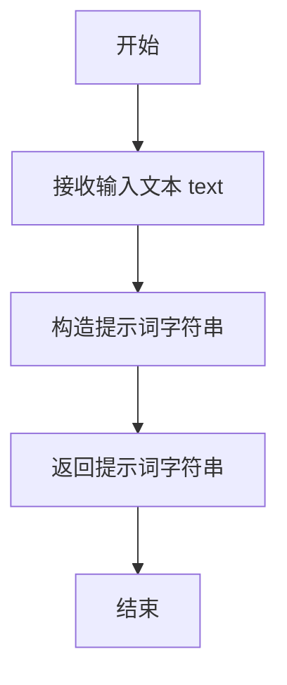

# `.\MetaGPT\tests\metagpt\tools\test_translate.py` 详细设计文档

该文件是一个使用 pytest 框架编写的异步单元测试，用于测试 `Translator` 翻译工具的功能。它通过向大语言模型（LLM）API 发送构造好的翻译提示词，并验证返回的翻译结果中是否包含预期的关键词，从而验证翻译功能的正确性。

## 整体流程

```mermaid
graph TD
    A[开始测试] --> B[使用@pytest.mark.asyncio装饰器]
    B --> C[注入llm_api fixture]
    C --> D[遍历测试用例列表]
    D --> E[对每个测试用例]
    E --> F[调用Translator.translate_prompt生成提示词]
    F --> G[调用llm_api.aask异步获取响应]
    G --> H[记录响应日志]
    H --> I{断言响应中包含预期关键词}
    I -- 是 --> J[继续下一个测试用例]
    I -- 否 --> K[测试失败]
    J --> L[所有用例测试完成]
    L --> M[测试通过]
```

## 类结构

```
test_translate.py (测试文件)
├── 全局函数: test_translate (异步测试函数)
├── 导入模块:
│   ├── pytest
│   ├── metagpt.logs.logger
│   └── metagpt.tools.translator.Translator
```

## 全局变量及字段


### `poetries`
    
一个包含待翻译英文句子和期望在翻译结果中出现的特定中文字符串的元组列表，用于测试翻译功能。

类型：`list[tuple[str, str]]`
    


    

## 全局函数及方法


### `test_translate`

这是一个使用 `pytest` 框架编写的异步单元测试函数。它的核心功能是测试 `Translator` 工具的翻译能力。具体来说，它使用 `llm_api` 模拟调用大语言模型，验证其能否将给定的英文句子翻译成包含指定中文关键词的句子。

参数：

-  `llm_api`：`pytest fixture`，一个被 `@pytest.mark.usefixtures("llm_api")` 装饰器注入的测试夹具，通常模拟或封装了一个真实的大语言模型API客户端，用于异步发送提示词（prompt）并获取响应。

返回值：`None`，测试函数通常不显式返回值，其成功与否由断言（`assert`）语句决定。

#### 流程图

```mermaid
flowchart TD
    A[开始测试] --> B{遍历测试数据<br>poetries列表};
    B --> C[取出当前测试数据<br>i: 英文句子, j: 预期关键词];
    C --> D[调用Translator.translate_prompt(i)<br>生成翻译提示词];
    D --> E[异步调用llm_api.aask(prompt)<br>获取模型响应rsp];
    E --> F[记录响应rsp到日志];
    F --> G{断言: rsp中是否包含关键词j?};
    G -- 是 --> B;
    G -- 否 --> H[测试失败<br>抛出AssertionError];
    B -- 所有数据遍历完成 --> I[测试通过];
```

#### 带注释源码

```python
# 使用pytest的异步和夹具标记装饰此测试函数
@pytest.mark.asyncio
@pytest.mark.usefixtures("llm_api")
async def test_translate(llm_api):
    # 定义测试数据集：一个包含元组的列表，每个元组是(输入英文句子, 期望出现在翻译结果中的中文关键词)
    poetries = [
        ("Let life be beautiful like summer flowers", "花"),
        ("The ancient Chinese poetries are all songs.", "中国"),
    ]
    # 遍历测试数据集
    for i, j in poetries:
        # 使用Translator工具类将英文句子i转换为一个请求大语言模型进行翻译的提示词（prompt）
        prompt = Translator.translate_prompt(i)
        # 异步调用大语言模型API，传入构造好的提示词，并等待返回的响应rsp
        rsp = await llm_api.aask(prompt)
        # 使用logger记录模型返回的响应内容，便于调试和查看
        logger.info(rsp)
        # 断言：检查模型的响应rsp中是否包含预期的中文关键词j
        # 如果包含，测试继续；如果不包含，测试失败并抛出AssertionError
        assert j in rsp
```


### `Translator.translate_prompt`

该方法用于生成一个翻译提示词（prompt），将给定的英文文本翻译成中文。

参数：

-  `text`：`str`，需要被翻译的英文文本。

返回值：`str`，一个格式化的字符串，作为翻译任务的提示词（prompt）。

#### 流程图



#### 带注释源码

```
# 注意：提供的代码片段是测试文件 `test_translate.py`，并未包含 `Translator` 类的定义。
# 根据测试用例中的调用 `Translator.translate_prompt(i)` 和上下文推断，
# `translate_prompt` 是一个静态方法或类方法，其功能是生成翻译提示词。
# 以下是根据其使用方式推断出的典型实现。

@staticmethod
def translate_prompt(text: str) -> str:
    """
    根据输入的英文文本，生成翻译成中文的提示词。

    Args:
        text (str): 需要翻译的英文文本。

    Returns:
        str: 构造好的翻译提示词字符串。
    """
    # 典型的提示词构造方式，将用户输入嵌入到指令中。
    prompt = f"Translate the following English text to Chinese: '{text}'"
    return prompt

# 另一种可能的、更符合项目风格的实现（假设项目使用类似的结构）：
# 它可能引用一个预定义的模板，并从配置或常量中获取指令。
# 例如：
#   PROMPT_TEMPLATE = "请将以下英文内容翻译成中文：{text}"
#   return PROMPT_TEMPLATE.format(text=text)
```


## 关键组件


### Translator 类

提供文本翻译功能的核心类，封装了翻译提示词生成逻辑。

### translate_prompt 方法

Translator 类的静态方法，用于根据输入的英文文本生成特定的翻译提示词，以驱动大语言模型（LLM）进行翻译。

### 测试框架 (pytest)

用于自动化测试的框架，通过 `@pytest.mark.asyncio` 和 `@pytest.mark.usefixtures` 装饰器支持异步测试和依赖注入，确保翻译功能的正确性。

### 大语言模型接口 (llm_api)

作为外部依赖的抽象接口，通过其异步方法 `aask` 接收翻译提示词并返回翻译结果，是实现翻译功能的关键外部组件。

### 日志系统 (logger)

用于记录测试过程中的关键信息（如模型返回的翻译结果），辅助调试和监控测试执行状态。


## 问题及建议


### 已知问题

-   **测试用例与实现耦合度高**：测试代码直接导入了 `Translator.translate_prompt` 方法并构造了具体的提示词。如果 `Translator` 类的内部实现（如提示词模板）发生变化，所有相关的测试用例都需要同步修改，增加了维护成本。
-   **测试断言过于宽泛**：断言仅检查翻译结果中是否包含某个特定字符（如“花”、“中国”）。这种断言方式非常脆弱，无法有效验证翻译的准确性。例如，一个完全错误的翻译结果也可能包含这些字符，导致测试误判通过。
-   **缺乏对 `llm_api` 异常的测试**：测试用例假设 `llm_api.aask` 调用总是成功，没有模拟网络错误、API限流、无效响应等异常场景，测试覆盖不完整。
-   **测试数据硬编码**：测试数据（`poetries` 列表）直接硬编码在测试函数中，不利于测试数据的扩展和管理，也难以实现数据驱动的测试。
-   **缺少对 `Translator` 类核心方法的直接测试**：当前测试通过调用 `llm_api` 来间接测试翻译功能，但没有直接对 `Translator` 类的关键方法（如果存在 `translate` 方法）进行单元测试，无法隔离外部依赖（LLM API）来验证业务逻辑的正确性。

### 优化建议

-   **解耦测试与具体实现**：建议为 `Translator` 类定义一个清晰的公共接口（如 `translate(text: str) -> str` 方法）。测试应针对这个接口进行，而不是其内部的提示词构造细节。这样，只要接口契约不变，内部实现的重构就不会影响测试。
-   **增强断言逻辑**：采用更精确的断言方式。例如，可以使用更完整的预期句子进行匹配，或者利用翻译API的置信度分数（如果有）。对于集成测试，可以接受一定范围的模糊匹配，但应比单个字符更严格。也可以考虑使用测试专用、语义明确的“金句”作为输入和预期输出。
-   **补充异常和边界测试**：编写新的测试用例，使用 `pytest.raises` 或模拟（Mock） `llm_api.aask` 抛出异常，验证 `Translator` 类是否能妥善处理这些异常（例如，重试、降级、抛出友好的业务异常）。同时，增加对空字符串、超长文本、特殊字符等边界输入的测试。
-   **外部化测试数据**：将测试用例数据（输入文本和预期输出关键词/句子）移至外部文件（如JSON、YAML）或使用 `@pytest.mark.parametrize` 装饰器进行参数化，使测试更清晰，易于添加新用例。
-   **建立分层测试体系**：
    1.  **单元测试**：使用 `unittest.mock` 完全模拟 `llm_api`，直接测试 `Translator.translate` 方法内部的逻辑（如提示词组装、响应解析），确保业务逻辑正确。
    2.  **集成测试**：当前测试可视为集成测试，用于验证 `Translator` 与真实的 `llm_api` 协同工作是否正常。应为其赋予更明确的职责，并改进其断言逻辑。
    3.  **契约测试**：如果 `llm_api` 是外部服务，考虑引入契约测试，确保代码对API响应的假设与API的实际行为保持一致。
-   **提升测试可读性与可维护性**：为测试函数和方法添加更详细的文档字符串（docstring），说明测试的目的和场景。将通用的测试准备和清理逻辑提取到 `fixture` 中。


## 其它


### 设计目标与约束

本代码是一个单元测试文件，旨在验证 `Translator` 工具类的翻译功能。其核心设计目标是确保翻译提示词（`translate_prompt`）的生成逻辑正确，并能与底层的大语言模型接口（`llm_api`）正确交互，从而验证翻译结果的准确性。主要约束包括：1) 依赖外部 `llm_api` 测试夹具（fixture）提供模型服务；2) 测试用例基于字符串包含断言，对翻译结果的精确性要求不高；3) 采用异步测试模式以适应可能的异步接口。

### 错误处理与异常设计

当前测试代码未显式包含错误处理逻辑。测试执行过程中的异常（如 `llm_api` 连接失败、`Translator.translate_prompt` 方法调用错误、断言失败等）将由 `pytest` 测试框架捕获并报告，导致测试用例失败。这是一种符合单元测试惯例的设计，将错误处理职责委托给测试运行器。然而，对于更复杂的测试场景，可能需要添加对特定异常（如网络超时）的捕获和重试机制。

### 数据流与状态机

本测试的数据流是线性的、无状态的：
1.  **输入**：预定义的 `poetries` 列表，每个元素是一个（英文句子，期望出现在结果中的中文关键词）元组。
2.  **处理**：对于每个元组，调用 `Translator.translate_prompt` 生成提示词，然后通过异步接口 `llm_api.aask` 发送请求获取翻译结果。
3.  **验证**：使用 `assert` 检查翻译结果（`rsp`）中是否包含预期的关键词。
4.  **输出**：测试通过或失败的状态（由pytest管理），以及通过 `logger` 记录的每个翻译结果。

不存在复杂的状态机，整个流程是静态数据驱动的循环。

### 外部依赖与接口契约

1.  **`pytest` 框架**：用于组织、运行测试和提供断言机制。依赖 `@pytest.mark.asyncio` 和 `@pytest.mark.usefixtures` 装饰器。
2.  **`llm_api` 测试夹具（Fixture）**：这是最关键的外部依赖。测试假设该夹具提供了一个可用的、实现了 `aask(prompt: str) -> str` 异步方法的对象。该接口的稳定性和返回质量直接影响测试的可靠性与有效性。
3.  **`metagpt.logs.logger`**：用于记录测试过程中的信息，依赖于项目内部的日志配置。
4.  **`metagpt.tools.translator.Translator`**：依赖被测试的组件，具体是其静态方法 `translate_prompt(text: str) -> str`。测试的成功运行依赖于该方法能生成有效的、可被 `llm_api` 理解的提示词。

### 测试策略与覆盖范围

当前测试采用**基于样例的测试（Example-based Testing）**策略。它通过两个具体的、具有代表性的输入输出对来验证功能：
-   用例1：测试将英文句子翻译成包含“花”的中文。
-   用例2：测试将英文句子翻译成包含“中国”的中文。
**覆盖范围分析**：此策略仅验证了特定输入下的核心翻译提示功能，覆盖范围有限。未覆盖的场景包括：空字符串输入、超长文本输入、`Translator` 类可能存在的其他方法（如果有）、`llm_api` 返回异常或非预期格式时的行为、以及翻译提示词模板本身可能存在的边界情况。

### 配置与运行环境

1.  **运行命令**：测试需要通过 `pytest` 命令运行，并支持异步。例如：`pytest test_translate.py -v`。
2.  **环境变量**：代码中未显式使用环境变量，但 `llm_api` 夹具的实现很可能依赖于外部配置（如API密钥、模型端点），这些配置通常在 `pytest` 的配置文件（如 `conftest.py`）或环境变量中设置。
3.  **前置条件**：运行测试前必须确保：a) `llm_api` 夹具被正确定义且可用；b) 所需的外部服务（如大语言模型API）可访问；c) `Translator` 类及其依赖已正确安装。

    