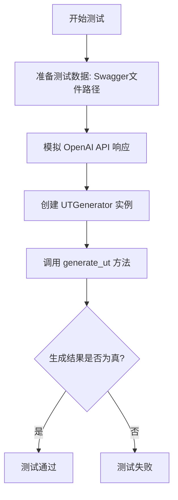
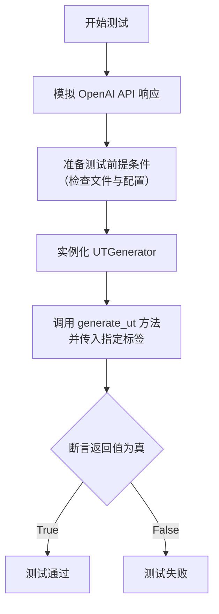

# `.\MetaGPT\tests\metagpt\tools\test_ut_writer.py` 详细设计文档

这是一个使用 pytest 框架编写的单元测试文件，用于测试 UTGenerator 类根据 Swagger API 文档生成单元测试代码的功能。测试通过模拟 OpenAI API 的响应来验证生成流程的正确性。

## 整体流程



## 类结构

```
TestUTWriter (测试类)
└── test_api_to_ut_sample (异步测试方法)
```

## 全局变量及字段


### `API_QUESTIONS_PATH`
    
存储API相关问题的文件路径常量

类型：`str`
    


### `UT_PY_PATH`
    
单元测试文件存储路径的常量

类型：`str`
    


### `YFT_PROMPT_PREFIX`
    
用于生成单元测试的提示词前缀模板

类型：`str`
    


    

## 全局函数及方法

### `TestUTWriter.test_api_to_ut_sample`

这是一个使用 `pytest` 和 `mocker` 编写的异步单元测试方法。它的核心功能是测试 `UTGenerator.generate_ut` 方法在模拟 OpenAI API 响应的情况下，能否根据指定的 Swagger API 文档和标签成功生成单元测试代码。

参数：

- `self`：`TestUTWriter`，测试类实例的引用
- `mocker`：`pytest-mock` 提供的 `MockerFixture` 对象，用于模拟（mock）外部依赖

返回值：`None`，测试方法通常不显式返回值，其成功与否由 `assert` 语句决定

#### 流程图



#### 带注释源码

```python
    @pytest.mark.asyncio  # 标记此测试方法为异步函数，以便 pytest-asyncio 插件处理
    async def test_api_to_ut_sample(self, mocker):  # 定义异步测试方法，接收 mocker 参数用于模拟
        async def mock_create(*args, **kwargs):  # 定义内部异步函数，用于模拟 OpenAI API 的 create 方法
            # 返回一个模拟的 ChatCompletion 对象，模拟 LLM 成功响应并返回了一段代码
            return ChatCompletion(
                id="chatcmpl-8n5fAd21w2J1IIFkI4qxWlNfM7QRC",
                choices=[
                    Choice(
                        finish_reason="stop",
                        index=0,
                        logprobs=None,
                        message=ChatCompletionMessage(
                            content=None,
                            role="assistant",
                            function_call=None,
                            tool_calls=[
                                ChatCompletionMessageToolCall(
                                    id="call_EjjmIY7GMspHu3r9mx8gPA2k",
                                    function=Function(
                                        arguments='{"code":"import string\\nimport random\\n\\ndef random_string'
                                        "(length=10):\\n    return ''.join(random.choice(string.ascii_"
                                        'lowercase) for i in range(length))"}',
                                        name="execute",
                                    ),
                                    type="function",
                                )
                            ],
                        ),
                    )
                ],
                created=1706710532,
                model="gpt-4-turbo",
                object="chat.completion",
                system_fingerprint="fp_04f9a1eebf",
                usage=CompletionUsage(completion_tokens=35, prompt_tokens=1982, total_tokens=2017),
            )

        # 使用 mocker 将 `AsyncCompletions.create` 方法替换为上面定义的 `mock_create` 函数
        mocker.patch.object(AsyncCompletions, "create", mock_create)

        # 准备测试的前提条件
        # 1. 确认 Swagger API 文件存在
        swagger_file = Path(__file__).parent / "../../data/ut_writer/yft_swaggerApi.json"
        assert swagger_file.exists()
        # 2. 确认配置中已设置 OpenAI LLM
        assert config.get_openai_llm()

        # 定义要包含的 API 标签
        tags = ["测试", "作业"]
        # 注释说明测试文件已手动添加了这两个标签的API

        # 实例化被测试的 UTGenerator 类
        utg = UTGenerator(
            swagger_file=str(swagger_file),  # Swagger API 文件路径
            ut_py_path=UT_PY_PATH,           # 单元测试文件输出路径（来自常量）
            questions_path=API_QUESTIONS_PATH, # 问题文件路径（来自常量）
            template_prefix=YFT_PROMPT_PREFIX, # 提示词模板前缀（来自常量）
        )
        # 调用核心方法，传入指定的标签，并等待异步结果
        ret = await utg.generate_ut(include_tags=tags)
        # 注释说明后续可以加入对生成文件内容和数量的检验
        # 当前断言：确保返回值 ret 为真（通常表示生成过程成功）
        assert ret
```

## 关键组件


### UTGenerator

UTGenerator 是单元测试生成器的核心类，负责根据给定的 API 规范（Swagger 文件）和指定的标签，生成对应的单元测试代码。

### YFT_PROMPT_PREFIX

YFT_PROMPT_PREFIX 是一个提示词模板前缀，用于引导大语言模型（如 GPT-4）生成特定格式和内容的单元测试代码。

### 异步 OpenAI API 调用

代码通过模拟 OpenAI 的异步 API 调用（`AsyncCompletions.create`）来获取大语言模型生成的单元测试代码，这是生成过程的关键外部依赖。

### 测试数据文件 (Swagger JSON)

`yft_swaggerApi.json` 文件作为输入数据源，包含了 API 的详细规范信息，UTGenerator 将解析此文件以获取需要生成单元测试的 API 列表。

### 路径配置常量 (UT_PY_PATH, API_QUESTIONS_PATH)

`UT_PY_PATH` 和 `API_QUESTIONS_PATH` 是路径配置常量，分别定义了生成的单元测试文件的输出目录和可能用到的提示问题文件路径。

### 模拟测试框架 (pytest & mocker)

使用 `pytest` 测试框架和 `mocker` 工具来模拟外部依赖（如 OpenAI API），确保单元测试的隔离性和可重复性，这是测试用例的关键组件。


## 问题及建议


### 已知问题

-   **测试用例不完整**：当前测试用例 `test_api_to_ut_sample` 仅验证了 `UTGenerator.generate_ut` 方法是否成功返回（`assert ret`），但未对方法的核心功能进行实质性验证。例如，没有检查生成的单元测试文件内容是否正确、文件数量是否符合预期、或生成的代码是否符合特定标签的筛选条件。这使得测试的有效性不足，无法保证 `UTGenerator` 功能的正确性。
-   **硬编码的 Mock 数据**：测试中用于模拟 OpenAI API 响应的 `mock_create` 函数返回了硬编码的 `ChatCompletion` 对象。这个响应内容（一段生成随机字符串的代码）与测试的上下文（从 Swagger 文件生成 API 单元测试）可能不匹配，降低了测试的真实性和可靠性。如果 `UTGenerator` 的逻辑发生变化，此 Mock 可能无法暴露潜在问题。
-   **依赖外部测试数据文件**：测试用例依赖于一个相对路径指定的外部 JSON 文件 (`../../data/ut_writer/yft_swaggerApi.json`)。这可能导致测试环境构建复杂，且如果该文件丢失或内容被意外修改，测试将失败，降低了测试的稳定性和可移植性。
-   **未测试错误和边界情况**：测试只覆盖了正常的成功路径。没有对 `UTGenerator` 在异常情况下的行为进行测试，例如：当 `swagger_file` 路径无效时、当 `include_tags` 在文件中找不到匹配项时、或当 OpenAI API 调用失败时，代码应如何响应（抛出异常、返回空结果等）。

### 优化建议

-   **增强测试断言**：在 `test_api_to_ut_sample` 中，应添加更具体的断言来验证 `UTGenerator.generate_ut` 的行为。例如：
    -   断言返回的 `ret` 是一个非空列表或字典（根据实际返回值类型）。
    -   检查在指定 `UT_PY_PATH` 下是否生成了预期数量和名称的单元测试文件。
    -   读取生成的单元测试文件，断言其内容包含预期的 API 端点名称或从 Swagger 文件解析出的特定操作。
    -   验证生成的代码确实只包含了 `include_tags` 参数指定的标签（如“测试”、“作业”）对应的 API。
-   **改进 Mock 策略**：重构 `mock_create` 函数，使其返回的模拟响应更贴合测试场景。可以考虑：
    -   根据测试输入（如 `tags` 参数）动态构造一个看起来合理的、包含单元测试代码的 API 响应。
    -   或者，将预期的、固定的单元测试代码片段作为 Mock 响应的 `content` 或 `function.arguments`，使测试专注于 `UTGenerator` 对响应的处理逻辑，而非 API 本身。
-   **隔离测试数据**：将测试数据文件 (`yft_swaggerApi.json`) 嵌入到测试模块内部或使用 pytest 的 `fixture` 机制来管理。例如，可以将一个最小化的、确定性的 Swagger JSON 片段直接定义在测试文件中或一个专用的测试数据模块中，避免依赖外部文件系统路径，提高测试的独立性和速度。
-   **补充负面测试用例**：为 `UTGenerator` 类编写额外的测试方法，覆盖各种错误和边界情况。例如：
    -   `test_generate_ut_with_invalid_swagger_file`：测试传入不存在的 Swagger 文件路径。
    -   `test_generate_ut_with_no_matching_tags`：测试传入的标签在 Swagger 文件中不存在。
    -   `test_generate_ut_api_call_failure`：模拟 OpenAI API 抛出异常，测试 `UTGenerator` 的异常处理逻辑（例如，是否抛出自定义异常或记录错误）。
-   **考虑测试结构**：当前测试类 `TestUTWriter` 只包含一个测试方法。建议将不同的测试场景（正常流、错误流）拆分成独立的测试方法，并使用描述性的名称（如 `test_generate_ut_success_with_tags`），以提高测试报告的可读性和维护性。


## 其它


### 设计目标与约束

本测试代码的设计目标是验证 `UTGenerator` 类中 `generate_ut` 方法的核心功能，即根据指定的 Swagger API 文档和标签，能够成功调用大语言模型（LLM）并生成单元测试代码。主要约束包括：1) 测试环境需要模拟 OpenAI API 的异步响应，以避免产生实际网络调用和费用；2) 测试依赖于外部数据文件（`yft_swaggerApi.json`）的存在和特定配置（`config.get_openai_llm()`）；3) 测试焦点是功能流程的通畅性，而非生成代码的具体内容，因此断言仅检查函数是否返回真值。

### 错误处理与异常设计

测试用例本身主要验证正常流程。其错误处理依赖于 `pytest` 框架和 `mocker` 工具。通过 `mocker.patch.object` 模拟了 `AsyncCompletions.create` 方法，确保测试不依赖外部服务且结果可控。测试前置条件使用 `assert` 语句验证了必要数据文件和配置的存在，若缺失则测试会提前失败。测试方法 `test_api_to_ut_sample` 被标记为 `@pytest.mark.asyncio`，以正确处理异步函数调用。测试用例未显式包含针对 `UTGenerator` 初始化或 `generate_ut` 方法可能抛出的异常（如文件未找到、API调用失败等）的捕获和断言，这部分异常处理的责任在于被测试的生产代码 `UTGenerator` 类。

### 数据流与状态机

1.  **数据输入**：测试用例的输入是固定的 Swagger JSON 文件路径（`swagger_file`）、标签列表（`["测试", "作业"]`）以及通过 `mocker` 预设的 LLM 模拟响应数据。
2.  **处理流程**：
    a. **准备阶段**：创建 `UTGenerator` 实例，注入文件路径和提示词前缀等配置。
    b. **模拟阶段**：使用 `mocker` 拦截对 `AsyncCompletions.create` 的调用，并返回一个预构造的 `ChatCompletion` 对象，其中包含模拟生成的代码片段。
    c. **执行阶段**：调用 `utg.generate_ut(include_tags=tags)`，触发内部逻辑。该逻辑应会读取 Swagger 文件，筛选出指定标签的 API，构造提示词，调用（已被模拟的）LLM，并处理返回结果。
    d. **验证阶段**：断言 `generate_ut` 方法的返回值 `ret` 为真（`assert ret`），以此验证主流程执行未遇到导致返回 `False` 或 `None` 的错误。
3.  **状态与输出**：测试不验证生成的具体单元测试文件内容，仅验证流程是否成功执行完毕并返回了指示成功的值。测试本身没有复杂的状态变迁。

### 外部依赖与接口契约

1.  **外部依赖**：
    *   **OpenAI API (`openai` 库)**：核心依赖，测试中通过 `mocker` 完全模拟其 `AsyncCompletions.create` 方法的行为和返回数据结构（`ChatCompletion`, `Choice`, `ChatCompletionMessageToolCall` 等）。
    *   **被测试模块 (`metagpt.tools.ut_writer`)**：依赖 `UTGenerator` 类和 `YFT_PROMPT_PREFIX`。
    *   **配置系统 (`metagpt.config2.config`)**：依赖 `config.get_openai_llm()` 提供有效的 LLM 配置，尽管在测试中该 LLM 不会被实际调用。
    *   **常量定义 (`metagpt.const`)**：依赖 `UT_PY_PATH` 和 `API_QUESTIONS_PATH` 作为默认路径参数。
    *   **文件系统**：依赖 `../../data/ut_writer/yft_swaggerApi.json` 数据文件的存在。
    *   **测试框架**：依赖 `pytest` 和 `pytest-mock` (通过 `mocker` fixture) 来组织测试和模拟。
2.  **接口契约**：
    *   **与模拟对象的契约**：`mock_create` 函数必须返回一个符合 `openai` 库 `ChatCompletion` 类型的对象，特别是 `message.tool_calls[0].function.arguments` 需要包含模拟的代码字符串，以模拟 `UTGenerator` 期望的 LLM 响应格式。
    *   **与 `UTGenerator.generate_ut` 的契约**：测试假设该方法接收 `include_tags` 参数，并返回一个布尔值或其他可在布尔上下文中评估为 `True` 的值以表示成功。
    *   **与路径的契约**：`UTGenerator` 的初始化参数 `swagger_file` 需要是有效的文件路径字符串。

### 测试策略与覆盖范围

1.  **测试类型**：这是一个单元测试（隔离测试），使用模拟（Mock）技术将 `UTGenerator` 与外部 OpenAI 服务、文件写入操作等隔离开，专注于验证其核心逻辑流程。
2.  **覆盖重点**：
    *   **流程集成**：测试 `UTGenerator` 从初始化、加载 Swagger 文件、筛选 API、构造提示词到调用 LLM 接口（模拟）的完整流程。
    *   **异步调用**：验证 `generate_ut` 异步方法能够被正确调用和等待。
    *   **配置与数据加载**：验证代码能够正确读取外部配置和测试数据文件。
3.  **覆盖缺口**：
    *   **LLM 响应解析**：未测试 `UTGenerator` 如何处理 LLM 返回的不同格式或错误内容。
    *   **文件生成**：未测试 `UTGenerator` 是否将 LLM 返回的代码正确写入到 `ut_py_path` 指定的位置，也未验证生成文件的内容、格式或数量。
    *   **错误路径**：未测试当 Swagger 文件无效、标签不匹配、LLM 调用失败、配置缺失等异常情况下的行为。
    *   **边界情况**：未测试空标签列表、超大 Swagger 文件等边界场景。
4.  **测试数据**：使用一个特定的、预先准备好的 Swagger JSON 文件（`yft_swaggerApi.json`）和两个硬编码的标签（`"测试"`, `"作业"`）作为输入。

    