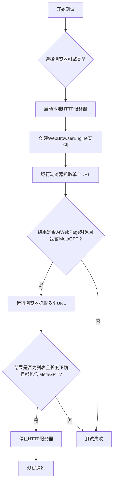
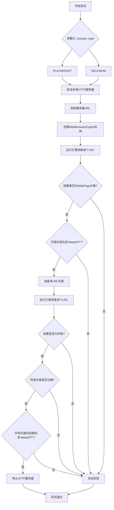
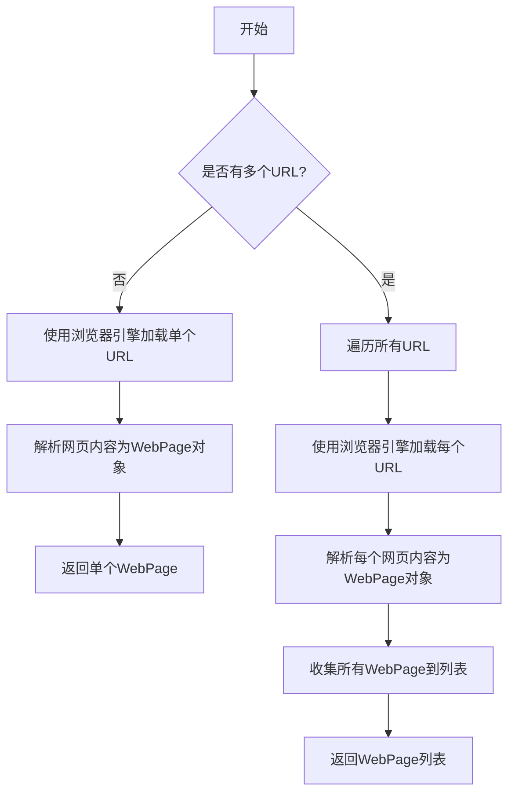

# `.\MetaGPT\tests\metagpt\tools\test_web_browser_engine.py` 详细设计文档

该代码是一个使用 pytest 框架编写的异步测试文件，用于测试 MetaGPT 项目中 WebBrowserEngine 类的网页抓取功能。它通过参数化测试验证了两种不同的浏览器引擎（Playwright 和 Selenium）能否正确地从本地 HTTP 服务器抓取网页内容，并解析为 WebPage 对象，同时检查返回结果中是否包含预期的文本内容。

## 整体流程



## 类结构

```
测试文件 (test_web_browser.py)
├── 导入模块 (pytest, metagpt.tools, metagpt.utils.parse_html)
├── 测试函数 (test_scrape_web_page)
└── 主程序入口 (__main__)
```

## 全局变量及字段


### `WebPage.inner_text`
    
网页的纯文本内容，通常包含从HTML中提取并清理后的文本信息。

类型：`str`
    
    

## 全局函数及方法


### `test_scrape_web_page`

这是一个使用 `pytest` 编写的异步测试函数，用于测试 `WebBrowserEngine` 类对不同网页抓取引擎（Playwright 和 Selenium）的支持。它通过一个本地 HTTP 服务器提供测试页面，验证引擎能否正确抓取网页内容并解析为 `WebPage` 对象，同时测试了单 URL 和多 URL 的抓取功能。

参数：

-  `browser_type`：`WebBrowserEngineType`，指定要测试的浏览器引擎类型（例如 PLAYWRIGHT 或 SELENIUM）。
-  `http_server`：`pytest fixture`，一个异步 fixture，用于启动一个临时的本地 HTTP 服务器，返回服务器实例和根 URL。

返回值：`None`，这是一个测试函数，不返回业务值，其成功与否由内部的 `assert` 语句决定。

#### 流程图



#### 带注释源码

```python
# 使用pytest的异步支持和参数化装饰器
@pytest.mark.asyncio
@pytest.mark.parametrize(
    "browser_type", # 参数化变量名
    [
        WebBrowserEngineType.PLAYWRIGHT, # 测试值1: Playwright引擎
        WebBrowserEngineType.SELENIUM,   # 测试值2: Selenium引擎
    ],
    ids=["playwright", "selenium"], # 在测试输出中标识不同参数集的名称
)
async def test_scrape_web_page(browser_type, http_server):
    """测试网页抓取功能的主函数"""
    # 1. 启动测试用的HTTP服务器并获取其URL
    server, url = await http_server()

    # 2. 准备一个包含多个相同URL的列表，用于测试多URL抓取
    urls = [url, url, url]

    # 3. 根据传入的引擎类型创建浏览器引擎实例
    browser = web_browser_engine.WebBrowserEngine(engine=browser_type)

    # 4. 测试单URL抓取
    #    运行引擎，抓取单个网页
    result = await browser.run(url)
    #    断言：返回结果应该是WebPage类的实例
    assert isinstance(result, WebPage)
    #    断言：网页的文本内容应包含测试字符串"MetaGPT"
    assert "MetaGPT" in result.inner_text

    # 5. 测试多URL抓取 (如果urls列表非空)
    if urls:
        #    运行引擎，抓取多个网页。第一个参数是url，后面用*urls解包列表
        results = await browser.run(url, *urls)
        #    断言：返回结果应该是一个列表
        assert isinstance(results, list)
        #    断言：列表长度应为 1 (第一个url) + len(urls) (解包后的urls)
        assert len(results) == len(urls) + 1
        #    断言：列表中的每一个WebPage对象的文本内容都应包含"MetaGPT"
        assert all(("MetaGPT" in i.inner_text) for i in results)

    # 6. 测试完毕，停止HTTP服务器
    await server.stop()
```


### `WebBrowserEngine.run`

该方法用于启动Web浏览器引擎，根据给定的URL或URL列表加载网页，并返回解析后的网页内容（`WebPage`对象或列表）。它支持异步操作，能够处理单个URL或多个URL的批量抓取。

参数：

- `url`：`str`，要抓取的目标网页URL（必需参数）。
- `*urls`：`可变参数（str）`，可选的其他URL列表，用于批量抓取多个网页。

返回值：`Union[WebPage, List[WebPage]]`，返回单个`WebPage`对象（当仅传入一个URL时）或`WebPage`对象列表（当传入多个URL时）。

#### 流程图



#### 带注释源码

```python
async def run(self, url: str, *urls: str) -> Union[WebPage, List[WebPage]]:
    """
    运行浏览器引擎以抓取网页。
    
    该方法根据传入的URL数量决定返回单个WebPage对象还是WebPage列表。
    如果仅传入一个URL（url参数），则返回对应的WebPage对象；
    如果传入多个URL（通过urls可变参数），则返回WebPage对象列表。
    
    Args:
        url (str): 必需的目标网页URL。
        *urls (str): 可选的其他URL列表，用于批量抓取。
    
    Returns:
        Union[WebPage, List[WebPage]]: 单个WebPage对象或WebPage对象列表。
    """
    # 检查是否传入了多个URL
    if urls:
        # 合并所有URL（包括第一个url参数和后续的urls）
        all_urls = [url] + list(urls)
        # 异步并发加载所有网页
        pages = await asyncio.gather(*[self._load_page(u) for u in all_urls])
        # 返回WebPage对象列表
        return pages
    else:
        # 仅加载单个网页
        page = await self._load_page(url)
        # 返回单个WebPage对象
        return page
```

## 关键组件


### WebBrowserEngine

一个封装了不同底层浏览器引擎（如Playwright和Selenium）的组件，用于执行网页抓取和自动化操作，提供统一的异步接口。

### WebPage

一个表示网页解析结果的数据结构，包含网页的原始内容、解析后的文本等信息，便于后续的信息提取和处理。

### WebBrowserEngineType

一个枚举类，定义了当前支持的浏览器引擎类型（如PLAYWRIGHT和SELENIUM），用于在创建WebBrowserEngine时指定底层实现。

### web_browser_engine

一个模块，提供了WebBrowserEngine类的工厂函数或直接导出，是创建浏览器引擎实例的主要入口点。

### parse_html

一个工具模块，包含WebPage等用于解析和表示HTML内容的类，负责将原始HTML转换为结构化的数据。


## 问题及建议


### 已知问题

-   **测试用例对特定内容存在硬编码依赖**：测试断言中硬编码了期望的网页内容包含“MetaGPT”。如果被测服务器提供的页面内容发生变化或不包含该字符串，测试将失败，降低了测试的健壮性和可移植性。这更像是一个内容断言测试，而非功能测试。
-   **测试数据构造逻辑不清晰**：测试中创建了一个包含三个相同URL的列表 `urls`，但在后续的 `browser.run` 调用中，其使用方式 (`await browser.run(url, *urls)`) 会导致传入总计4个相同的URL参数。这种写法意图模糊，容易让阅读者困惑，可能并非预期的测试场景（例如测试去重或并发）。
-   **潜在的资源管理风险**：测试中通过 `await http_server()` 获取了一个服务器实例，并在测试结束时显式停止 (`await server.stop()`)。虽然当前代码结构正确，但如果测试在断言阶段提前失败或异常，`server.stop()` 可能不会被调用，导致服务器进程未正确清理。建议使用 `async with` 上下文管理器（如果 `http_server` fixture 支持）或 `try...finally` 块来确保资源释放。
-   **测试覆盖不完整**：测试仅验证了 `PLAYWRIGHT` 和 `SELENIUM` 两种浏览器引擎。如果 `WebBrowserEngineType` 枚举包含其他引擎（如 `FIREFOX`, `CHROME` 的独立配置或无头模式等），则这些引擎未被测试，存在覆盖缺口。
-   **缺乏对异常和边缘情况的测试**：测试用例只测试了正常情况下的网页抓取。没有对异常情况进行测试，例如：传入空URL列表、传入无效的URL、网络请求超时、浏览器引擎初始化失败等场景。这降低了代码的鲁棒性验证。

### 优化建议

-   **改进测试断言，聚焦功能而非内容**：将内容断言改为更通用的功能断言。例如，可以检查返回的 `WebPage` 对象结构是否完整（如 `inner_text`、`html` 等属性非空），或者使用一个专门为测试设计的、内容固定的静态页面（其内容可预测，如包含特定测试标识符）来进行测试。这能提升测试的稳定性和可复用性。
-   **重构测试数据与逻辑，明确测试意图**：重新设计 `urls` 变量的使用。如果目的是测试单URL与多URL处理，应使用不同的URL或明确注释意图。考虑将测试拆分为两个独立的测试函数：`test_scrape_single_page` 和 `test_scrape_multiple_pages`，使每个测试的职责更单一、清晰。
-   **增强资源管理的安全性**：使用 `pytest` 的 fixture 机制来管理 `http_server` 的生命周期，确保测试结束后自动清理。如果 fixture 不支持异步清理，则在测试函数内部使用 `try...finally` 结构来保证 `await server.stop()` 始终被执行。
    ```python
    async def test_scrape_web_page(browser_type, http_server):
        server, url = await http_server()
        try:
            # ... 测试逻辑 ...
            pass
        finally:
            await server.stop()
    ```
-   **扩展测试覆盖范围**：修改 `@pytest.mark.parametrize` 装饰器，使其遍历 `WebBrowserEngineType` 枚举的所有可能值（例如 `list(WebBrowserEngineType)`），从而实现对所有支持的浏览器引擎的测试覆盖。
-   **补充异常和边界测试**：新增测试用例，专门测试 `WebBrowserEngine` 在异常输入或环境下的行为。例如：
    -   测试传入空字符串或 `None` 作为URL。
    -   测试传入格式错误的URL。
    -   使用 `pytest.raises` 或 `pytest.aiohttp.raises`（如适用）来验证是否会抛出预期的异常类型。
    -   模拟网络断开或服务不可用的情况（可能需要使用如 `pytest-mock` 等工具）。
-   **考虑添加并发与性能测试**：当前测试是顺序执行。可以添加测试用例来验证 `browser.run` 方法在处理多个URL时，内部是顺序执行还是利用了一定的并发机制，并评估其性能表现是否符合预期。


## 其它


### 设计目标与约束

本代码是一个针对`web_browser_engine`模块的异步单元测试。其设计目标是验证`WebBrowserEngine`类在不同浏览器引擎（Playwright和Selenium）下，其`run`方法能够正确地从HTTP服务器抓取网页内容，并返回结构化的`WebPage`对象。主要约束包括：1) 测试依赖于外部HTTP服务器（由`http_server` fixture提供）和浏览器引擎的可用性；2) 测试是异步的，需要异步测试框架支持；3) 测试覆盖了单URL和多URL两种调用模式。

### 错误处理与异常设计

测试代码本身不包含显式的错误处理逻辑，其正确性依赖于`pytest`框架的断言机制。如果`browser.run()`调用失败（例如，网络错误、浏览器启动失败、页面加载超时），将抛出异常并导致测试用例失败。测试通过`assert`语句验证返回结果的类型（`WebPage`或`list`）和内容（包含特定字符串“MetaGPT”），任何不满足这些条件的输出都将被标记为测试失败。`await server.stop()`确保了测试结束后HTTP服务器的资源被正确清理。

### 数据流与状态机

1.  **初始化阶段**：通过`@pytest.mark.parametrize`为`browser_type`参数提供两个枚举值（`PLAYWRIGHT`, `SELENIUM`），驱动测试运行两次。
2.  **服务器启动**：`http_server` fixture启动一个临时的HTTP服务器，返回服务器实例和根URL。
3.  **浏览器引擎实例化**：根据传入的`browser_type`创建对应的`WebBrowserEngine`实例。
4.  **单URL抓取测试**：调用`browser.run(url)`，预期返回一个`WebPage`对象，并验证其`inner_text`属性包含“MetaGPT”。
5.  **多URL抓取测试**：调用`browser.run(url, *urls)`，预期返回一个`WebPage`对象列表，验证列表长度及每个元素的`inner_text`属性。
6.  **资源清理**：测试结束后，停止HTTP服务器。

### 外部依赖与接口契约

1.  **`pytest` 及 `pytest-asyncio`**：测试框架和异步测试支持。
2.  **`metagpt.tools.web_browser_engine` 模块**：被测对象，需提供`WebBrowserEngine`类和`WebBrowserEngineType`枚举。
3.  **`metagpt.utils.parse_html.WebPage` 类**：用于验证`browser.run`方法的返回类型。
4.  **`http_server` Pytest Fixture**：外部提供的fixture，负责在测试前启动并返回一个HTTP服务器实例和其URL，测试后需调用`stop()`方法关闭。这是测试环境的关键依赖。
5.  **Playwright 或 Selenium 浏览器驱动**：根据测试参数，需要相应的浏览器引擎（Playwright或Selenium）及其驱动程序在测试环境中可用。

    