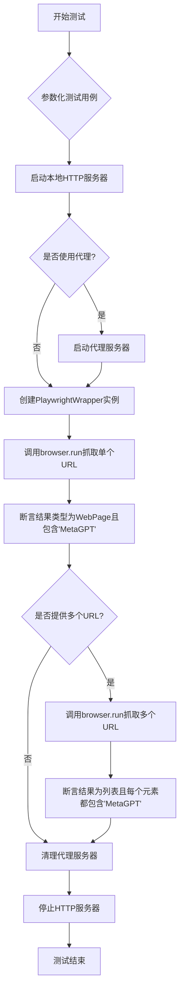
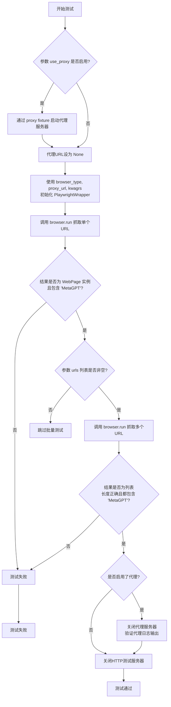
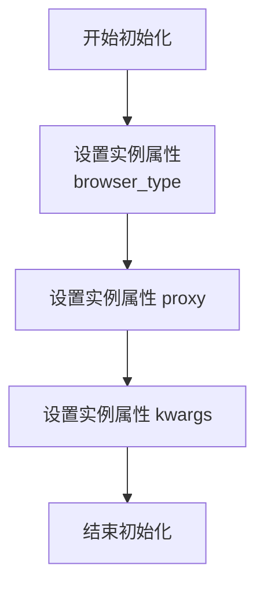
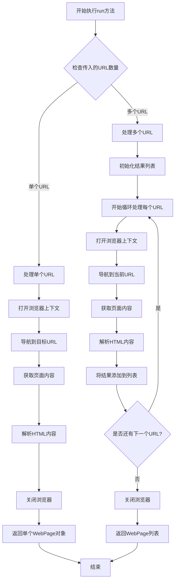

# `.\MetaGPT\tests\metagpt\tools\test_web_browser_engine_playwright.py` 详细设计文档

这是一个使用 pytest 框架编写的异步测试文件，用于测试 PlaywrightWrapper 类的网页抓取功能。它通过参数化测试，验证了在不同浏览器类型（chromium、firefox、webkit）、是否使用代理以及不同配置参数下，从本地 HTTP 服务器抓取网页并解析为 WebPage 对象的功能是否正常。

## 整体流程



## 类结构

```
测试文件 (test_web_browser_engine_playwright.py)
├── 测试函数 (test_scrape_web_page)
└── 外部依赖
    ├── web_browser_engine_playwright.PlaywrightWrapper (待测类)
    └── utils.parse_html.WebPage (结果类型)
```

## 全局变量及字段


### `browser_type`
    
指定要使用的浏览器类型，例如 'chromium'、'firefox' 或 'webkit'。

类型：`str`
    


### `use_proxy`
    
一个字典，指示是否使用代理，如果包含 'proxy': True 则表示使用代理。

类型：`dict`
    


### `kwagrs`
    
一个字典，包含传递给 PlaywrightWrapper 构造函数的额外关键字参数。

类型：`dict`
    


### `proxy`
    
一个代理服务器对象，用于在测试中提供代理功能。

类型：`object`
    


### `capfd`
    
pytest 的捕获输出对象，用于捕获和验证标准输出和标准错误。

类型：`object`
    


### `http_server`
    
一个 HTTP 服务器对象，用于在测试中提供本地 Web 服务器。

类型：`object`
    


### `server`
    
HTTP 服务器的实例，用于启动和停止测试服务器。

类型：`object`
    


### `url`
    
HTTP 服务器提供的 URL，用于测试网页抓取功能。

类型：`str`
    


### `urls`
    
一个 URL 列表，用于测试批量网页抓取功能。

类型：`list`
    


### `proxy_url`
    
代理服务器的 URL，如果使用代理则设置，否则为 None。

类型：`str`
    


### `browser`
    
PlaywrightWrapper 类的实例，用于执行网页抓取操作。

类型：`PlaywrightWrapper`
    


### `result`
    
单个网页抓取的结果，包含网页内容和元数据。

类型：`WebPage`
    


### `results`
    
批量网页抓取的结果列表，每个元素是一个 WebPage 对象。

类型：`list`
    


### `proxy_server`
    
代理服务器的实例，用于在测试中启动和关闭代理。

类型：`object`
    


    

## 全局函数及方法

### `test_scrape_web_page`

这是一个使用 `pytest` 编写的异步测试函数，用于测试 `PlaywrightWrapper` 类的 `run` 方法。它通过模拟不同的浏览器类型（Chromium、Firefox、WebKit）和代理设置，验证网页抓取功能是否能正确返回 `WebPage` 对象，并检查返回内容中是否包含预期的文本“MetaGPT”。

参数：

- `browser_type`：`str`，指定要测试的浏览器引擎类型，例如 `"chromium"`、`"firefox"` 或 `"webkit"`。
- `use_proxy`：`dict`，一个字典，用于指示是否使用代理服务器。如果字典非空（例如 `{"proxy": True}`），则测试将配置并使用代理。
- `kwagrs`：`dict`，一个包含额外关键字参数的字典，这些参数将传递给 `PlaywrightWrapper` 的构造函数，用于配置浏览器实例（例如 `{"ignore_https_errors": True}`）。
- `proxy`：`pytest fixture`，一个 `pytest` 夹具，用于在需要时启动一个代理服务器，并返回其服务器对象和URL。
- `capfd`：`pytest fixture`，一个 `pytest` 夹具，用于捕获测试过程中的标准输出和标准错误，以便进行断言。
- `http_server`：`pytest fixture`，一个 `pytest` 夹具，用于启动一个本地HTTP测试服务器，并返回其服务器对象和根URL。

返回值：`None`，这是一个测试函数，其主要目的是通过断言（`assert`）来验证功能，不返回业务值。测试框架（`pytest`）会根据断言结果判断测试是否通过。

#### 流程图



#### 带注释源码

```python
# 这是一个使用 pytest 框架的异步测试函数。
# @pytest.mark.asyncio 标记此函数为异步测试。
# @pytest.mark.parametrize 用于参数化测试，为 `browser_type`, `use_proxy`, `kwagrs` 提供多组测试数据。
@pytest.mark.asyncio
@pytest.mark.parametrize(
    "browser_type, use_proxy, kwagrs,",
    [
        # 第一组测试数据：Chromium浏览器，使用代理，无额外参数。
        ("chromium", {"proxy": True}, {}),
        # 第二组测试数据：Firefox浏览器，不使用代理，忽略HTTPS错误。
        (
            "firefox",
            {},
            {"ignore_https_errors": True},
        ),
        # 第三组测试数据：WebKit浏览器，不使用代理，忽略HTTPS错误。
        (
            "webkit",
            {},
            {"ignore_https_errors": True},
        ),
    ],
    # 为每组测试数据提供一个易读的ID。
    ids=["chromium-normal", "firefox-normal", "webkit-normal"],
)
async def test_scrape_web_page(browser_type, use_proxy, kwagrs, proxy, capfd, http_server):
    # 1. 启动测试用的HTTP服务器，获取服务器对象和根URL。
    server, url = await http_server()

    # 准备一个包含多个相同URL的列表，用于测试批量抓取。
    urls = [url, url, url]

    # 初始化代理URL为None。
    proxy_url = None
    # 2. 如果 use_proxy 参数指示需要代理，则通过 proxy fixture 启动代理服务器。
    if use_proxy:
        proxy_server, proxy_url = await proxy()

    # 3. 使用给定的浏览器类型、代理URL和其他参数初始化 PlaywrightWrapper。
    browser = web_browser_engine_playwright.PlaywrightWrapper(browser_type=browser_type, proxy=proxy_url, **kwagrs)

    # 4. 测试单个URL的抓取功能。
    result = await browser.run(url)
    # 断言：结果必须是 WebPage 类的实例。
    assert isinstance(result, WebPage)
    # 断言：结果的文本内容中必须包含字符串 "MetaGPT"。
    assert "MetaGPT" in result.inner_text

    # 5. 如果 urls 列表非空，则测试批量URL抓取功能。
    if urls:
        # 调用 run 方法，传入一个主URL和多个额外URL。
        results = await browser.run(url, *urls)
        # 断言：批量结果必须是一个列表。
        assert isinstance(results, list)
        # 断言：结果列表的长度应等于传入的URL数量（1个主URL + len(urls)个额外URL）。
        assert len(results) == len(urls) + 1
        # 断言：结果列表中的每一个 WebPage 对象的文本内容都必须包含 "MetaGPT"。
        assert all(("MetaGPT" in i.inner_text) for i in results)

    # 6. 如果测试中使用了代理，进行代理相关的清理和验证。
    if use_proxy:
        # 关闭代理服务器。
        proxy_server.close()
        await proxy_server.wait_closed()
        # 断言：捕获的标准输出中应包含代理相关的日志（例如"Proxy:"）。
        assert "Proxy:" in capfd.readouterr().out

    # 7. 无论是否使用代理，最后都要停止HTTP测试服务器。
    await server.stop()
```

### `PlaywrightWrapper.__init__`

初始化 PlaywrightWrapper 类的实例，设置浏览器类型、代理和其他 Playwright 启动选项。

参数：

- `browser_type`：`str`，指定要使用的浏览器类型，如 "chromium"、"firefox" 或 "webkit"。
- `proxy`：`str` 或 `None`，代理服务器地址，如果为 `None` 则不使用代理。
- `**kwargs`：`dict`，其他传递给 Playwright 浏览器启动选项的关键字参数。

返回值：`None`，此方法为构造函数，不返回任何值。

#### 流程图



#### 带注释源码

```python
def __init__(self, browser_type: str, proxy: str | None = None, **kwargs):
    """
    初始化 PlaywrightWrapper 实例。

    Args:
        browser_type (str): 浏览器类型，如 "chromium"、"firefox"、"webkit"。
        proxy (str | None): 代理服务器地址，可选。
        **kwargs: 其他 Playwright 启动选项。
    """
    self.browser_type = browser_type  # 存储浏览器类型
    self.proxy = proxy  # 存储代理设置
    self.kwargs = kwargs  # 存储其他启动选项
```

### `PlaywrightWrapper.run`

该方法用于使用Playwright浏览器引擎异步抓取一个或多个网页，并返回解析后的网页对象或对象列表。

参数：
- `self`：`PlaywrightWrapper`，PlaywrightWrapper类的实例
- `url`：`str`，要抓取的目标网页URL
- `*urls`：`str`，可变数量的额外网页URL（可选）

返回值：`Union[WebPage, List[WebPage]]`，当传入单个URL时返回WebPage对象，传入多个URL时返回WebPage对象列表

#### 流程图



#### 带注释源码

```python
async def run(self, url: str, *urls: str) -> Union[WebPage, List[WebPage]]:
    """
    异步运行浏览器并抓取网页内容
    
    Args:
        url: 要抓取的目标网页URL
        *urls: 可变数量的额外网页URL（可选）
    
    Returns:
        当传入单个URL时返回WebPage对象
        传入多个URL时返回WebPage对象列表
    """
    # 检查是否传入了多个URL
    if urls:
        # 处理多个URL的情况
        # 将所有URL合并到一个列表中（包括第一个参数url）
        all_urls = [url, *urls]
        # 初始化结果列表
        results = []
        
        # 遍历所有URL
        for url in all_urls:
            # 对每个URL执行抓取操作
            result = await self._scrape(url)
            # 将结果添加到列表中
            results.append(result)
        
        # 返回所有结果的列表
        return results
    else:
        # 处理单个URL的情况
        # 直接抓取单个URL并返回结果
        return await self._scrape(url)
```

## 关键组件


### PlaywrightWrapper

一个基于Playwright框架的Web浏览器引擎包装类，用于自动化网页抓取和交互，支持多种浏览器类型（Chromium、Firefox、WebKit）和代理配置。

### WebPage

一个表示网页解析结果的数据结构，用于封装从网页抓取的HTML内容、内部文本等信息，便于后续处理和分析。

### 测试框架与参数化

使用pytest框架及其异步支持和参数化功能，用于对Web浏览器引擎进行多场景（不同浏览器类型、代理设置、额外参数）的自动化测试。


## 问题及建议


### 已知问题

-   **测试数据耦合度高**：测试用例 `test_scrape_web_page` 同时测试了单个URL和多个URL的抓取功能，并且断言逻辑与特定的网页内容（`"MetaGPT"`）强绑定。这导致测试用例脆弱，一旦被测网页内容发生变化或测试服务器提供的页面不含该关键词，测试就会失败，降低了测试的健壮性和可维护性。
-   **资源清理逻辑存在潜在风险**：在 `use_proxy` 条件分支中，代码先关闭代理服务器 (`proxy_server.close()`)，然后等待其关闭完成 (`await proxy_server.wait_closed()`)。然而，如果 `proxy_server` 在 `close()` 后未能正常关闭或 `wait_closed()` 抛出异常，后续的断言 (`assert "Proxy:" in capfd.readouterr().out`) 可能仍然会执行，但此时代理服务器状态可能已不可预期。虽然在实际测试中可能问题不大，但从严谨性角度看，资源清理的异常处理可以更完善。
-   **参数命名存在拼写错误**：测试装饰器 `@pytest.mark.parametrize` 中有一个参数被命名为 `kwagrs`，这显然是 `kwargs` (关键字参数) 的拼写错误。虽然不影响功能，但会影响代码的可读性和专业性。
-   **测试逻辑对运行环境有隐式依赖**：测试依赖于 `http_server` fixture 提供的本地服务器，并期望其返回的页面包含 “MetaGPT” 文本。如果 `http_server` 的实现或提供的页面内容发生改变，此测试将直接失败，测试用例与 fixture 的实现细节耦合过紧。

### 优化建议

-   **拆分测试用例，降低耦合**：建议将单个URL抓取和多个URL列表抓取的测试拆分为两个独立的测试函数，例如 `test_scrape_single_web_page` 和 `test_scrape_multiple_web_pages`。这样可以使每个测试的意图更清晰，也便于单独调试和维护。
-   **使用更稳定的测试断言**：避免断言特定的动态文本内容（如“MetaGPT”）。可以考虑断言更稳定的页面属性，例如：`assert result.url == url`（检查返回的URL是否正确）、`assert len(result.inner_text) > 0`（检查是否获取到了文本内容）、或 `assert result.status_code == 200`（如果 `WebPage` 对象包含状态码）。如果必须测试内容，可以构建一个专用于测试的、内容固定的静态页面或使用 mock 对象。
-   **修正拼写错误并增强资源清理的健壮性**：
    1.  将 `kwagrs` 重命名为 `kwargs`。
    2.  在资源清理部分（关闭代理服务器和主服务器）考虑使用 `try...finally` 或 `async with` 上下文管理器（如果 fixture 支持）来确保清理操作总能执行，并妥善记录或处理可能发生的异常。
-   **明确测试依赖与契约**：在测试文件或模块的文档字符串中，明确说明测试所依赖的 fixture（如 `http_server`）应提供何种契约（例如，返回的页面应包含可预测的标题或某个特定的HTML元素ID）。更好的做法是，让 `http_server` fixture 返回一个完全可控的测试页面内容，使测试不依赖于外部或易变的实现。
-   **考虑增加错误场景测试**：当前测试主要覆盖了正常路径（Happy Path）。建议增加对异常场景的测试，例如：传入无效的URL、测试代理服务器不可用时的行为、测试浏览器启动失败时的错误处理等，以提高代码的鲁棒性。


## 其它


### 设计目标与约束

本测试代码的设计目标是验证 `web_browser_engine_playwright.PlaywrightWrapper` 类在不同浏览器类型（Chromium、Firefox、WebKit）和不同配置（如使用代理、忽略HTTPS错误）下的核心功能 `run` 的正确性。约束包括：1) 必须使用 `pytest` 框架进行异步测试；2) 测试需要模拟一个HTTP服务器作为目标网页；3) 当测试代理功能时，需要启动一个代理服务器；4) 测试应覆盖单URL和多URL两种调用方式；5) 测试断言需验证返回对象的类型和内容。

### 错误处理与异常设计

测试代码本身不包含业务逻辑的错误处理，其目的是验证被测试组件在预期场景下的行为。测试框架 `pytest` 会捕获测试执行过程中抛出的任何异常，并将其标记为测试失败。测试用例通过 `assert` 语句来验证预期结果，如果断言失败，`pytest` 会输出详细的错误信息。对于外部依赖（如HTTP服务器、代理服务器）的启动失败，`pytest` 插件（如 `pytest-asyncio`、`http_server` fixture）会负责处理并导致测试用例跳过或失败。

### 数据流与状态机

1.  **测试准备阶段**：通过 `@pytest.mark.parametrize` 注入参数，生成多个测试实例。每个实例对应一组 `(browser_type, use_proxy, kwagrs)`。
2.  **服务器启动**：`http_server` fixture 启动一个临时的HTTP服务器，返回服务器对象和URL。`proxy` fixture 在需要时启动一个代理服务器。
3.  **浏览器引擎初始化**：使用注入的参数实例化 `PlaywrightWrapper` 对象。
4.  **核心测试执行**：
    *   **单URL测试**：调用 `browser.run(url)`，验证返回的 `WebPage` 对象及其内容。
    *   **多URL测试**：调用 `browser.run(url, *urls)`，验证返回的 `WebPage` 对象列表及其内容。
5.  **代理验证**：如果使用了代理，检查标准输出中是否包含代理标识。
6.  **资源清理**：关闭代理服务器和HTTP服务器。

### 外部依赖与接口契约

1.  **pytest框架**：依赖 `pytest`、`pytest-asyncio`、`pytest-httpserver`（或类似提供 `http_server` fixture的插件）来提供测试运行环境、异步支持和HTTP服务器模拟。
2.  **被测试模块**：依赖 `metagpt.tools.web_browser_engine_playwright` 中的 `PlaywrightWrapper` 类。测试与其 `run` 方法存在隐式契约：该方法应接受一个或多个URL字符串参数，并返回 `WebPage` 对象或该对象的列表。
3.  **数据模型**：依赖 `metagpt.utils.parse_html.WebPage` 类，作为 `run` 方法的返回类型，并依赖其 `inner_text` 属性进行内容断言。
4.  **系统依赖**：`PlaywrightWrapper` 底层依赖 `playwright` 库及其对应的浏览器二进制文件（Chromium, Firefox, WebKit）。

    