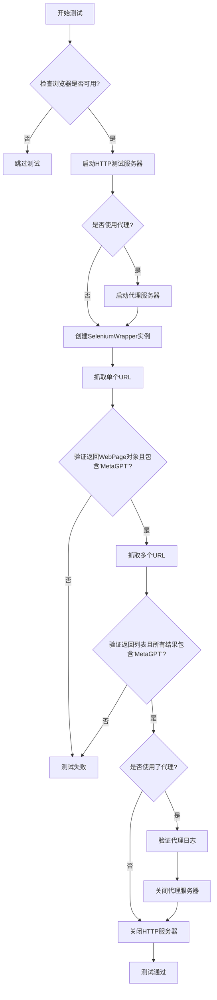
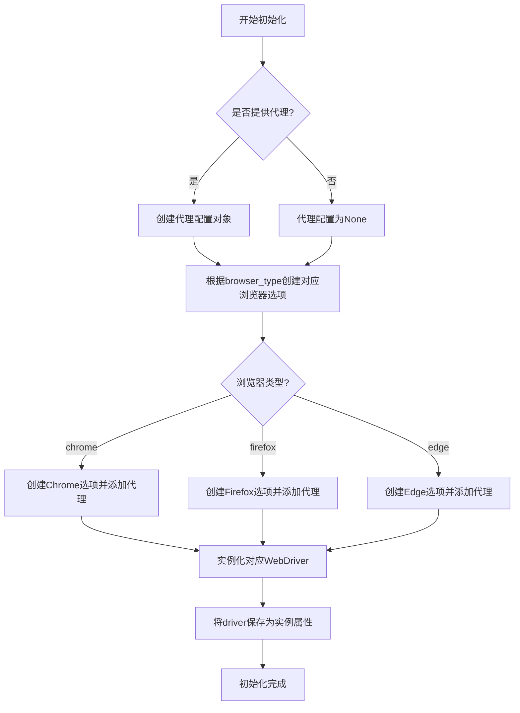
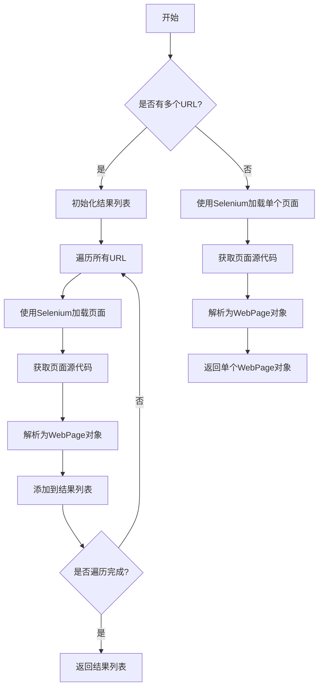

# `.\MetaGPT\tests\metagpt\tools\test_web_browser_engine_selenium.py` 详细设计文档

这是一个使用 pytest 框架编写的异步测试文件，用于测试 SeleniumWrapper 类的网页抓取功能。它通过参数化测试验证不同浏览器类型（Chrome、Firefox、Edge）在有无代理的情况下，能否正确抓取包含特定文本（'MetaGPT'）的网页，并验证返回的 WebPage 对象格式和内容。

## 整体流程



## 类结构

```
测试文件 (test_web_browser_engine_selenium.py)
├── 测试函数 (test_scrape_web_page)
├── 外部依赖类 (SeleniumWrapper)
└── 外部依赖类 (WebPage)
```

## 全局变量及字段


### `WebPage.inner_text`
    
网页的纯文本内容，包含从HTML中提取并清理后的文本信息

类型：`str`
    
    

## 全局函数及方法


### `test_scrape_web_page`

这是一个使用 `pytest` 框架编写的异步测试函数，用于测试 `SeleniumWrapper` 类（来自 `web_browser_engine_selenium` 模块）的网页抓取功能。它通过参数化测试，验证了在 Chrome、Firefox 和 Edge 浏览器（如果系统上已安装）中，`SeleniumWrapper` 能否正确抓取本地 HTTP 服务器提供的页面，并解析出预期的内容（包含“MetaGPT”文本）。测试涵盖了单 URL 和多 URL 的抓取场景，并可选地测试代理功能。

参数：

-  `browser_type`：`str`，指定要测试的浏览器类型，例如 "chrome"、"firefox"、"edge"。
-  `use_proxy`：`bool`，一个布尔标志，指示测试是否应使用代理服务器。
-  `proxy`：`pytest fixture`，一个 pytest fixture，当 `use_proxy` 为 `True` 时，用于提供代理服务器实例和其 URL。
-  `capfd`：`pytest fixture`，一个 pytest fixture，用于捕获测试期间的标准输出和标准错误，用于验证代理日志。
-  `http_server`：`pytest fixture`，一个 pytest fixture，用于启动一个本地 HTTP 测试服务器，并返回服务器实例及其 URL。

返回值：`None`，这是一个测试函数，不返回业务值，其成功与否由内部的 `assert` 语句决定。

#### 流程图

```mermaid
flowchart TD
    A[开始测试] --> B{浏览器是否可用?<br>（由pytest.mark.skipif控制）}
    B -- 否 --> C[跳过此参数组合的测试]
    B -- 是 --> D[启动本地HTTP服务器]
    D --> E{use_proxy 为 True?}
    E -- 是 --> F[启动代理服务器]
    E -- 否 --> G[proxy_url = None]
    F --> G
    G --> H[初始化SeleniumWrapper<br>（指定browser_type和proxy_url）]
    H --> I[测试单URL抓取<br>（browser.run(url)）]
    I --> J[断言结果类型为WebPage<br>且包含'MetaGPT']
    J --> K[测试多URL抓取<br>（browser.run(url, *urls)）]
    K --> L[断言结果为列表<br>长度正确且每个元素都包含'MetaGPT']
    L --> M{use_proxy 为 True?}
    M -- 是 --> N[关闭代理服务器<br>验证代理日志]
    M -- 否 --> O[跳过代理验证]
    N --> O
    O --> P[停止HTTP服务器]
    P --> Q[测试通过]
```

#### 带注释源码

```python
# 这是一个异步的pytest测试函数，使用参数化装饰器定义多组测试数据。
@pytest.mark.asyncio
@pytest.mark.parametrize(
    "browser_type, use_proxy,",
    [
        # 第一组参数：测试Chrome浏览器，不使用代理。
        # @pytest.mark.skipif: 如果系统未找到Chrome浏览器，则跳过此测试。
        pytest.param(
            "chrome",
            False,
            marks=pytest.mark.skipif(not browsers.get("chrome"), reason="chrome browser not found"),
        ),
        # 第二组参数：测试Firefox浏览器，不使用代理。
        pytest.param(
            "firefox",
            False,
            marks=pytest.mark.skipif(not browsers.get("firefox"), reason="firefox browser not found"),
        ),
        # 第三组参数：测试Edge浏览器，不使用代理。
        pytest.param(
            "edge",
            False,
            marks=pytest.mark.skipif(not browsers.get("msedge"), reason="edge browser not found"),
        ),
    ],
    ids=["chrome-normal", "firefox-normal", "edge-normal"], # 为每组测试参数指定一个易读的ID。
)
async def test_scrape_web_page(browser_type, use_proxy, proxy, capfd, http_server):
    # 前置条件：确保系统中安装了对应的浏览器（由skipif装饰器处理）。

    # 1. 启动本地HTTP测试服务器，获取服务器实例和其根URL。
    server, url = await http_server()
    # 准备一个包含三个相同URL的列表，用于测试多URL抓取。
    urls = [url, url, url]

    # 2. 代理处理：如果`use_proxy`标志为True，则启动代理服务器。
    proxy_url = None
    if use_proxy:
        proxy_server, proxy_url = await proxy()

    # 3. 初始化被测试的SeleniumWrapper对象，传入浏览器类型和可能的代理URL。
    browser = web_browser_engine_selenium.SeleniumWrapper(browser_type=browser_type, proxy=proxy_url)

    # 4. 测试场景一：抓取单个URL。
    result = await browser.run(url)
    # 断言：返回的对象应该是WebPage类型。
    assert isinstance(result, WebPage)
    # 断言：返回的网页内容中应包含字符串“MetaGPT”。
    assert "MetaGPT" in result.inner_text

    # 5. 测试场景二：抓取多个URL。`browser.run`的第一个参数是url，后面可以跟多个URL。
    results = await browser.run(url, *urls)
    # 断言：返回的结果应该是一个列表。
    assert isinstance(results, list)
    # 断言：列表长度应为传入的URL数量（1个首参数 + len(urls)个扩展参数）。
    assert len(results) == len(urls) + 1
    # 断言：列表中的每个WebPage对象的inner_text都应包含“MetaGPT”。
    assert all(("MetaGPT" in i.inner_text) for i in results)

    # 6. 后置清理与验证（如果使用了代理）。
    if use_proxy:
        # 关闭代理服务器。
        proxy_server.close()
        await proxy_server.wait_closed()
        # 验证标准输出中是否包含代理日志（例如“Proxy: localhost”）。
        assert "Proxy: localhost" in capfd.readouterr().out

    # 7. 停止本地HTTP测试服务器。
    await server.stop()
```


### `SeleniumWrapper.__init__`

该方法用于初始化 `SeleniumWrapper` 类的实例，配置并启动一个 Selenium WebDriver 会话。它根据传入的浏览器类型和代理设置，创建相应的浏览器驱动选项，并实例化 WebDriver。

参数：

- `browser_type`：`str`，指定要使用的浏览器类型，例如 "chrome"、"firefox" 或 "edge"。
- `proxy`：`Optional[str]`，可选的代理服务器地址，格式为字符串（如 "http://localhost:8080"）。如果为 `None`，则不使用代理。

返回值：`None`，此方法为构造函数，不返回任何值。

#### 流程图



#### 带注释源码

```python
def __init__(self, browser_type: str = "chrome", proxy: Optional[str] = None):
    """
    初始化 SeleniumWrapper 实例。

    根据指定的浏览器类型和可选的代理设置，配置并启动 WebDriver。

    Args:
        browser_type (str): 要使用的浏览器类型。支持 'chrome', 'firefox', 'edge'。默认为 'chrome'。
        proxy (Optional[str]): 代理服务器的地址。例如 'http://localhost:8080'。如果为 None，则不使用代理。
    """
    # 初始化代理配置为 None
    proxy_arg = None
    # 如果提供了代理地址，则创建一个 Selenium Proxy 对象进行配置
    if proxy:
        proxy_arg = Proxy()
        proxy_arg.proxy_type = ProxyType.MANUAL
        proxy_arg.http_proxy = proxy
        proxy_arg.ssl_proxy = proxy

    # 根据浏览器类型创建对应的 WebDriver 选项和实例
    if browser_type == "chrome":
        # 创建 Chrome 浏览器选项
        options = webdriver.ChromeOptions()
        # 添加一些常用选项以改善自动化环境下的稳定性
        options.add_argument("--headless")  # 无头模式，不显示GUI
        options.add_argument("--no-sandbox")  # 禁用沙盒，常用于容器环境
        options.add_argument("--disable-dev-shm-usage")  # 禁用 /dev/shm 使用，解决内存问题
        # 如果配置了代理，则将其添加到选项中
        if proxy_arg:
            options.add_argument(f"--proxy-server={proxy}")
        # 创建 Chrome WebDriver 实例
        self.driver = webdriver.Chrome(options=options)
    elif browser_type == "firefox":
        # 创建 Firefox 浏览器选项
        options = webdriver.FirefoxOptions()
        options.add_argument("--headless")
        # 如果配置了代理，则创建一个 Firefox Profile 并设置代理
        if proxy_arg:
            profile = webdriver.FirefoxProfile()
            profile.set_proxy(proxy_arg)
            options.profile = profile
        # 创建 Firefox WebDriver 实例
        self.driver = webdriver.Firefox(options=options)
    elif browser_type == "edge":
        # 创建 Edge 浏览器选项
        options = webdriver.EdgeOptions()
        options.add_argument("--headless")
        options.add_argument("--no-sandbox")
        options.add_argument("--disable-dev-shm-usage")
        # 如果配置了代理，则将其添加到选项中
        if proxy_arg:
            options.add_argument(f"--proxy-server={proxy}")
        # 创建 Edge WebDriver 实例
        self.driver = webdriver.Edge(options=options)
    else:
        # 如果传入的浏览器类型不被支持，则抛出 ValueError 异常
        raise ValueError(f"Unsupported browser type: {browser_type}")
```

### `SeleniumWrapper.run`

该方法用于使用Selenium WebDriver异步抓取一个或多个网页，并返回解析后的网页内容。

参数：

- `url`：`str`，要抓取的目标网页URL。
- `*urls`：`str`，可变数量的额外网页URL，用于批量抓取。

返回值：`Union[WebPage, List[WebPage]]`，当传入单个URL时返回一个`WebPage`对象；当传入多个URL时返回一个`WebPage`对象列表。

#### 流程图



#### 带注释源码

```python
async def run(self, url: str, *urls: str) -> Union[WebPage, List[WebPage]]:
    """
    异步抓取一个或多个网页。

    该方法通过Selenium WebDriver加载指定URL的网页，获取页面源代码，
    并使用`WebPage`类进行解析。支持单个URL或批量URL抓取。

    Args:
        url (str): 要抓取的目标网页URL。
        *urls (str): 可变数量的额外网页URL，用于批量抓取。

    Returns:
        Union[WebPage, List[WebPage]]: 当传入单个URL时返回一个`WebPage`对象；
                                        当传入多个URL时返回一个`WebPage`对象列表。

    Raises:
        WebDriverException: 如果Selenium WebDriver无法加载页面。
        Exception: 如果页面解析过程中发生错误。
    """
    # 判断是否传入了多个URL
    if urls:
        # 批量抓取模式：将第一个URL和剩余URL合并为列表
        all_urls = [url, *urls]
        # 初始化结果列表
        results = []
        # 遍历所有URL
        for url in all_urls:
            # 使用Selenium加载页面
            self.driver.get(url)
            # 获取页面源代码
            page_source = self.driver.page_source
            # 解析为WebPage对象并添加到结果列表
            results.append(WebPage(page_source))
        # 返回结果列表
        return results
    else:
        # 单个URL抓取模式：直接加载页面
        self.driver.get(url)
        # 获取页面源代码
        page_source = self.driver.page_source
        # 解析为WebPage对象并返回
        return WebPage(page_source)
```

## 关键组件


### SeleniumWrapper

一个基于Selenium的Web浏览器引擎包装类，用于自动化网页抓取和交互。

### WebPage

一个表示网页内容的数据结构，包含解析后的HTML和提取的文本信息。

### 浏览器驱动管理

通过`browsers`库自动检测和选择系统中可用的浏览器（如Chrome、Firefox、Edge）进行测试。

### 参数化测试框架

使用`pytest.mark.parametrize`对不同的浏览器类型和代理使用情况进行参数化测试，确保代码在不同环境下的兼容性。

### 异步HTTP服务器

在测试中启动一个临时的本地HTTP服务器，为网页抓取测试提供可控的测试目标。

### 代理服务器支持

测试框架支持在测试中启动和配置代理服务器，以验证代码在代理环境下的功能。


## 问题及建议


### 已知问题

-   **测试用例对浏览器环境有强依赖**：测试用例通过 `pytest.mark.skipif` 检查系统中是否安装了特定的浏览器（Chrome, Firefox, Edge）。如果未安装，测试将被跳过。这可能导致在缺少特定浏览器的CI/CD环境中测试覆盖率不完整，或者给开发者带来额外的环境配置负担。
-   **代理测试逻辑存在潜在缺陷**：在 `use_proxy` 为 `True` 的分支中，测试断言 `assert "Proxy: localhost" in capfd.readouterr().out`。这个断言依赖于被测试代码（`SeleniumWrapper`）或底层驱动在标准输出中打印特定的代理日志字符串。这种对实现细节（日志格式）的强耦合使得测试非常脆弱，一旦日志信息改变，测试就会失败，而核心功能可能并未受损。
-   **资源清理可能不充分**：测试中创建了 `browser` 对象（`SeleniumWrapper` 实例），但在测试结束后没有显式调用其关闭或清理方法（如 `quit()`）。虽然测试框架和进程退出可能会清理资源，但这并非最佳实践，可能导致在长时间运行的测试套件中浏览器进程或WebDriver残留，消耗系统资源。
-   **测试数据构造略显冗余**：`urls` 列表被构造为 `[url, url, url]`，即同一个URL重复三次。虽然这能测试批量处理功能，但使用不同或更有代表性的测试URL可能更能覆盖真实场景下的边界情况。
-   **硬编码的断言字符串**：断言中检查的字符串 `"MetaGPT"` 是硬编码的，它直接依赖于 `http_server` fixture 提供的页面内容。如果该fixture提供的页面内容发生变化，此测试将失败，降低了测试的稳定性和可维护性。

### 优化建议

-   **引入浏览器模拟或使用无头模式**：建议在测试中优先使用浏览器的无头模式（Headless Mode），这无需图形界面，更适合CI/CD环境。或者，可以考虑使用如 `pytest-playwright` 或 `pytest-selenium` 等插件来更好地管理浏览器生命周期，或使用 `unittest.mock` 来模拟 `SeleniumWrapper` 的部分行为，减少对真实浏览器的依赖。
-   **解耦测试断言与实现细节**：对于代理测试，建议重构测试逻辑。不应依赖标准输出的特定字符串，而应通过其他方式验证代理是否生效。例如，可以配置一个能记录请求的测试代理服务器，然后断言目标服务器收到了通过代理发出的请求；或者，如果被测试类提供了检查代理状态的接口，则通过该接口进行验证。
-   **显式管理测试资源生命周期**：在测试函数中，应在 `assert` 语句之后、函数结束之前，显式调用 `browser` 对象的清理方法（例如 `await browser.close()` 或 `browser.quit()`），并将其放入 `try...finally` 块或使用 `pytest` 的 fixture 来确保无论测试成功还是失败，资源都能被正确释放。
-   **增强测试数据的多样性和代表性**：考虑使用参数化来提供不同的测试URL，或者使用专门的测试页面fixture来生成包含特定可预测元素（如具有固定ID或class的标签）的HTML内容，而不是依赖一个可能变化的固定字符串（`"MetaGPT"`）。这使测试更专注于功能（如“能提取页面文本”），而非特定内容。
-   **提升测试的可配置性和可维护性**：将硬编码的断言字符串（如 `"MetaGPT"`）提取为测试配置文件、常量或通过fixture注入。这样，当测试数据源（`http_server`）变更时，只需在一个地方更新期望值，而不需要修改多个测试文件。同时，考虑为 `urls` 列表使用更有意义的测试数据。


## 其它


### 设计目标与约束

本测试代码的设计目标是验证 `web_browser_engine_selenium.SeleniumWrapper` 类在不同浏览器环境（Chrome、Firefox、Edge）下，使用或不使用代理时，其 `run` 方法能够正确抓取网页并返回预期的 `WebPage` 对象。主要约束包括：1) 测试依赖于特定浏览器（Chrome/Firefox/Edge）在本地环境中的安装，若未安装则跳过对应测试用例；2) 测试需要启动一个临时的 HTTP 服务器来提供测试页面；3) 当测试代理功能时，需要启动一个临时的代理服务器。

### 错误处理与异常设计

测试代码本身不包含复杂的业务逻辑错误处理，其错误处理主要依赖于 pytest 框架。通过 `@pytest.mark.skipif` 装饰器，在浏览器未安装时优雅地跳过测试，避免测试失败。测试中的断言（`assert`）语句用于验证功能正确性，若断言失败，pytest 会将其标记为测试失败并输出详细信息。对于异步操作（如服务器关闭），使用了 `await` 进行等待，确保资源正确释放。

### 数据流与状态机

测试的数据流始于 pytest 的参数化输入（`browser_type`, `use_proxy`）。流程如下：1) 根据参数决定是否跳过测试；2) 启动 HTTP 服务器获取测试 URL；3) 若需代理，启动代理服务器；4) 实例化 `SeleniumWrapper`；5) 调用 `run` 方法获取单个 URL 结果并验证；6) 调用 `run` 方法获取多个 URL 结果并验证；7) 根据 `use_proxy` 参数，验证代理日志并清理代理服务器；8) 停止 HTTP 服务器。整个过程是一个线性的、无循环或复杂状态转换的测试执行流。

### 外部依赖与接口契约

1.  **外部依赖**：
    *   `browsers`：用于检测系统中是否安装了指定的浏览器。
    *   `pytest`：测试框架，提供测试运行、参数化、跳过、夹具（fixture）等功能。
    *   `metagpt.tools.web_browser_engine_selenium`：被测模块，提供 `SeleniumWrapper` 类。
    *   `metagpt.utils.parse_html`：提供 `WebPage` 类，作为 `SeleniumWrapper.run` 方法的返回类型。
    *   `pytest` 夹具：`proxy`, `capfd`, `http_server`，由 pytest 插件或项目自定义夹具提供，用于管理代理服务器、捕获输出和 HTTP 服务器。

2.  **接口契约**：
    *   `SeleniumWrapper` 构造函数：接受 `browser_type` 和 `proxy` 参数。
    *   `SeleniumWrapper.run` 方法：异步方法，接受一个或多个 URL 字符串参数，返回单个 `WebPage` 对象或 `WebPage` 对象列表。
    *   `WebPage` 对象：需包含 `inner_text` 属性，且其内容应包含测试页面中的特定字符串（如“MetaGPT”）。
    *   `http_server` 夹具：返回一个元组 `(server, url)`，其中 `url` 指向一个可访问的测试网页。
    *   `proxy` 夹具：当被请求时，返回一个元组 `(proxy_server, proxy_url)`。

### 测试策略与用例覆盖

测试采用参数化策略，覆盖了浏览器类型（Chrome, Firefox, Edge）和代理使用（是/否）的组合场景。核心验证点包括：1) `run` 方法返回的对象类型正确（`WebPage` 或列表）；2) 返回的网页内容包含预期的文本（“MetaGPT”）；3) 处理单个 URL 和多个 URL 的两种情况；4) 当使用代理时，验证代理服务器确实被使用（通过检查捕获的标准输出）。未覆盖的场景可能包括：网络异常、页面加载超时、浏览器驱动兼容性问题、`run` 方法传入非法 URL 等异常输入的处理。

### 环境与配置依赖

测试执行依赖于特定的本地环境配置：
1.  **浏览器**：需要安装 Chrome、Firefox 或 Microsoft Edge 浏览器之一或多者，并且相应的 `chromedriver`、`geckodriver` 或 `msedgedriver` 应位于系统 PATH 或能被 Selenium 正确找到。
2.  **Python 包**：除了代码中导入的模块，还需要安装 `pytest`、`pytest-asyncio`、`browsers` 以及 `selenium` 等依赖包。
3.  **夹具**：测试依赖于名为 `proxy`、`capfd` 和 `http_server` 的 pytest 夹具，这些夹具需要在 `conftest.py` 文件或 pytest 插件中正确定义，确保能提供可用的代理服务器、输出捕获和 HTTP 服务器实例。

    