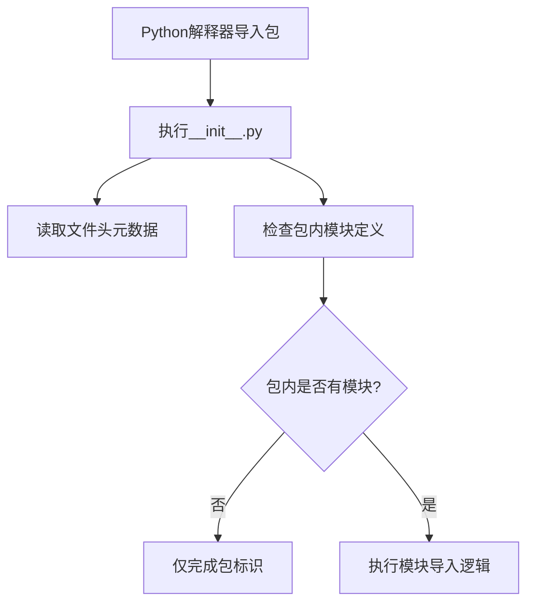

# `.\MetaGPT\tests\metagpt\utils\__init__.py` 详细设计文档

该文件是一个Python包的初始化文件，当前版本仅包含文件头部的元数据注释，没有定义任何实际的类、函数或变量。其主要功能是标识该目录为一个Python包，并为未来的代码模块提供导入入口。

## 整体流程



## 类结构

```
无类层次结构
```

## 全局变量及字段


    

## 全局函数及方法


## 关键组件


### 初始化模块

此文件是一个Python包的初始化模块（__init__.py），用于定义包的公共接口和初始化逻辑。当前版本为空，表明该包可能处于开发初期，或者其功能完全由子模块提供。


## 问题及建议


### 已知问题

-   **空文件问题**：当前 `__init__.py` 文件为空，仅包含文件头注释。这通常意味着该包（package）尚未定义任何需要导出的模块、类或函数，或者开发者可能忘记在此处定义包的公共接口。这会导致其他代码无法通过 `from package import *` 或显式导入来获取包内的任何内容，除非直接导入子模块。

### 优化建议

-   **明确包导出内容**：建议在 `__init__.py` 文件中使用 `__all__` 列表来明确声明该包对外公开的模块、类或函数。这有助于提高代码的可读性和可维护性，并遵循 Python 的最佳实践。例如，如果包内有 `module_a` 和 `module_b`，可以添加 `__all__ = ['module_a', 'module_b']`。
-   **添加包级文档字符串**：在文件头部注释后，添加一个包级别的文档字符串（docstring），简要描述该包的目的、主要功能和包含的核心组件。这有助于其他开发者快速理解包的用途。
-   **考虑包初始化逻辑**：如果该包在导入时需要执行一些初始化操作（如配置加载、资源预加载等），可以将这些逻辑放在 `__init__.py` 中。但需注意，应保持初始化逻辑简洁，避免复杂的副作用。


## 其它


### 设计目标与约束

该代码文件是一个包的初始化文件（`__init__.py`），其主要设计目标是定义Python包的命名空间，并可能执行包的初始化逻辑。当前文件内容为空，表明该包可能仅用于组织模块结构，或初始化逻辑由其他机制（如动态导入）处理。约束包括必须遵循Python的包导入机制，且不应包含复杂的业务逻辑以避免导入时的性能开销和潜在错误。

### 错误处理与异常设计

当前代码文件为空，因此没有显式的错误处理或异常设计。在包初始化过程中，如果存在动态导入或资源加载，应添加适当的异常捕获（如`ImportError`, `FileNotFoundError`）以确保包的健壮性。建议在后续开发中，若添加初始化代码，需考虑异常处理机制。

### 数据流与状态机

由于当前文件为空，不存在数据流或状态机。如果未来该文件用于初始化包级变量或配置，数据流将仅限于模块导入时的变量赋值。状态机不适用。

### 外部依赖与接口契约

该文件作为包的一部分，其外部依赖由包内的其他模块定义。当前没有显式的外部依赖。接口契约方面，该文件定义了包的公共接口（通过`__all__`列表），但当前未设置，意味着默认导出所有不以下划线开头的模块。建议明确声明`__all__`以控制包的公开API。

### 安全考虑

当前文件内容为空，无直接安全风险。但在包初始化时，若涉及动态代码执行（如`exec`）或文件操作，需注意输入验证和权限控制，防止代码注入或未授权访问。

### 测试策略

作为空文件，无需特定测试。但若未来添加初始化逻辑，应编写单元测试验证初始化行为，包括导入是否成功、全局变量是否正确设置等。测试应覆盖正常情况和异常情况。

### 部署与运维

该文件是标准Python包的一部分，部署时随包一起分发。无需特殊运维考虑。若包初始化涉及外部资源（如配置文件、数据库连接），需在部署文档中说明依赖和配置步骤。

### 性能考量

空文件对性能无影响。若未来添加初始化代码，应避免在导入时执行耗时操作（如网络请求、大量计算），以保持模块导入的快速性。建议将耗时初始化延迟到实际使用时（懒加载）。

### 兼容性说明

该文件使用Python标准语法，兼容Python 3.x版本。若使用特定版本特性（如类型提示），需在文档中注明最低Python版本要求。当前无兼容性问题。

### 文档与注释

当前文件缺乏文档字符串和注释。建议添加模块级文档字符串，描述包的目的、主要功能和用法示例。对于未来可能添加的代码，应遵循项目注释规范。

### 配置管理

当前无配置管理。若包需要运行时配置，建议使用配置文件或环境变量，并在初始化文件中提供加载和验证配置的逻辑。配置应与其他代码分离，便于维护。

### 日志记录

当前无日志记录。若包初始化过程需要调试或监控，建议添加日志记录，使用Python标准`logging`模块，记录关键事件和错误信息，便于问题排查。

    