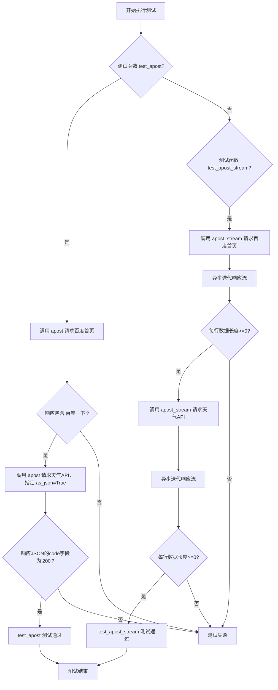
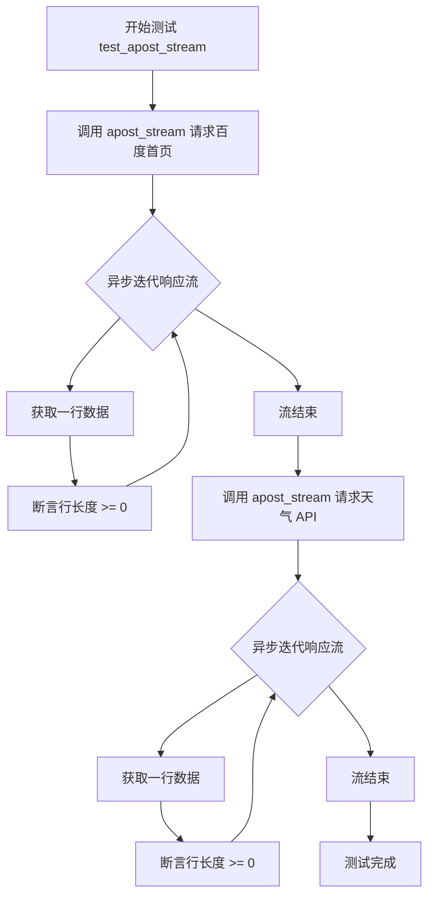

# `.\MetaGPT\tests\metagpt\utils\test_ahttp_client.py` 详细设计文档

该文件是一个针对异步HTTP客户端工具 `ahttp_client` 的单元测试文件，主要测试其核心功能：异步POST请求（`apost`）和异步流式POST请求（`apost_stream`）。测试用例通过向百度首页和公开天气API发送请求，验证了函数能正常返回响应内容（包含特定字符串或JSON结构）以及流式响应能正常迭代。

## 整体流程



## 类结构

```
N/A (本文件为单元测试，无自定义类结构)
```

## 全局变量及字段


    

## 全局函数及方法


### `test_apost`

这是一个使用 `pytest` 框架编写的异步单元测试函数，用于测试 `metagpt.utils.ahttp_client` 模块中的 `apost` 异步 HTTP POST 请求函数。它验证了 `apost` 函数在发送普通请求和 JSON 请求时的基本功能与正确性。

参数：
-  `无显式参数`：`None`，这是一个测试函数，其参数由 `pytest` 框架隐式管理（例如 `event_loop`）。函数内部通过硬编码的 URL 和数据调用被测试函数。

返回值：`None`，测试函数通常不返回业务值，其成功与否由 `assert` 语句决定。如果所有断言通过，则测试通过；否则，测试失败并抛出 `AssertionError`。

#### 流程图

```mermaid
flowchart TD
    Start[开始测试 test_apost] --> Test1[测试用例1: 普通POST请求]
    Test1 --> Call1[调用 apost<br>url='https://www.baidu.com/']
    Call1 --> Assert1[断言结果包含'百度一下']
    Assert1 --> Test2[测试用例2: JSON POST请求]
    Test2 --> Call2[调用 apost<br>url='.../listWeather'<br>data={'cityIds': '101240101'}<br>as_json=True]
    Call2 --> Assert2[断言结果中 code == '200']
    Assert2 --> End[测试结束]
```

#### 带注释源码

```python
@pytest.mark.asyncio  # 使用 pytest-asyncio 插件标记此函数为异步测试
async def test_apost():
    # 测试用例 1: 向百度首页发送一个简单的 POST 请求（通常 GET/POST 对首页无区别，用于测试连通性）
    result = await apost(url="https://www.baidu.com/")
    # 断言返回的 HTML 字符串中包含“百度一下”字样，验证请求成功且返回了预期内容
    assert "百度一下" in result

    # 测试用例 2: 向一个天气 API 发送 POST 请求，并指定数据格式为 JSON
    result = await apost(
        url="http://aider.meizu.com/app/weather/listWeather",
        data={"cityIds": "101240101"},  # 请求体数据
        as_json=True  # 指示函数将响应解析为 JSON 对象
    )
    # 断言返回的 JSON 对象中 `code` 字段的值为 "200"，验证 API 响应状态成功
    assert result["code"] == "200"
```


### `test_apost_stream`

这是一个异步单元测试函数，用于测试 `apost_stream` 函数的功能。它通过向两个不同的 URL 发送异步流式 HTTP 请求，并验证响应流中的每一行数据长度是否非负，从而确保 `apost_stream` 函数能够正确处理流式响应。

参数：

- 无显式参数（通过 `pytest.mark.asyncio` 装饰器标记为异步测试函数）

返回值：`None`，该函数不返回任何值，主要用于执行断言测试。

#### 流程图



#### 带注释源码

```python
@pytest.mark.asyncio  # 标记此函数为异步测试函数，以便 pytest-asyncio 插件能够正确处理
async def test_apost_stream():
    # 测试第一个请求：向百度首页发送流式请求
    result = apost_stream(url="https://www.baidu.com/")
    # 异步迭代响应流，逐行处理数据
    async for line in result:
        # 断言每一行数据的长度至少为0，确保流式响应正常
        assert len(line) >= 0

    # 测试第二个请求：向天气API发送带参数的流式请求
    result = apost_stream(url="http://aider.meizu.com/app/weather/listWeather", data={"cityIds": "101240101"})
    # 异步迭代响应流，逐行处理数据
    async for line in result:
        # 断言每一行数据的长度至少为0，确保流式响应正常
        assert len(line) >= 0
```

## 关键组件


### `apost` 函数

一个用于发送异步 HTTP POST 请求的通用函数，支持返回文本或 JSON 格式的响应。

### `apost_stream` 函数

一个用于发送异步 HTTP POST 请求并返回流式响应的函数，允许逐行或逐块处理返回的数据。


## 问题及建议


### 已知问题

-   **测试用例依赖外部网络服务**：测试用例直接对真实的在线服务（如百度、魅族天气API）发起请求。这导致测试的稳定性、速度和可靠性受外部服务状态和网络环境影响，违反了单元测试的隔离性原则。
-   **缺少对异常和错误情况的测试**：测试用例仅验证了正常情况下的响应（如包含特定字符串或状态码）。没有测试网络超时、服务端错误（如4xx、5xx状态码）、无效URL、请求参数错误等异常场景，测试覆盖不完整。
-   **测试断言过于简单**：断言仅检查响应中是否包含特定字符串或状态码是否为“200”，没有验证响应的数据结构、完整性或业务逻辑的正确性，可能导致潜在问题被忽略。
-   **硬编码测试数据**：测试数据（如URL、城市ID）直接硬编码在测试函数中，降低了测试的可维护性和可配置性。
-   **缺少对`apost_stream`功能的充分验证**：对于流式响应，测试仅断言了每行数据的长度非负，没有验证流式数据的正确性、完整性或特定的数据格式。

### 优化建议

-   **使用Mock或测试替身隔离外部依赖**：建议使用`pytest`的`monkeypatch`、`unittest.mock`或专门的HTTP Mock库（如`responses`、`aioresponses`）来模拟`aiohttp`客户端的响应。这样可以模拟各种正常和异常的网络响应，使测试快速、稳定且不依赖外部环境。
-   **补充异常和边界测试用例**：增加测试用例以覆盖网络错误（如`TimeoutError`、`ClientError`）、HTTP错误状态码（如404、500）、无效的请求参数、JSON解析错误等场景，确保代码的健壮性。
-   **增强测试断言**：对于正常响应，应验证更具体的业务逻辑。例如，对于天气API，可以检查返回的JSON结构是否包含预期的字段（如`city`、`temperature`）。对于流式响应，可以验证接收到的数据块是否符合预期格式或顺序。
-   **将测试数据外部化**：考虑使用`pytest`的`@pytest.mark.parametrize`装饰器来参数化测试数据，或将测试配置（如基础URL、测试用例数据）提取到配置文件或测试夹具（fixture）中，提高可维护性。
-   **为`apost_stream`添加更具体的验证**：可以模拟一个返回已知多行数据的服务端，然后验证`apost_stream`是否能正确、按顺序接收到所有数据行。
-   **考虑添加集成测试**：在单元测试之外，可以建立一套独立的集成测试套件，在可控的测试环境（如使用测试专用的沙箱服务）中运行，以验证与真实服务的集成。但这不应替代被良好隔离的单元测试。


## 其它


### 设计目标与约束

该代码模块的设计目标是提供一个异步HTTP客户端工具，用于支持异步的HTTP POST请求和流式响应处理。主要约束包括：必须支持异步操作以兼容异步框架；需要处理JSON格式的请求和响应；能够处理流式数据，适用于大文件或实时数据场景；保持代码简洁，易于测试和维护。

### 错误处理与异常设计

错误处理主要通过捕获异步HTTP请求过程中可能出现的异常，如网络错误、超时、无效URL等。异常设计包括自定义异常类型和标准异常处理机制，确保在请求失败时能够提供清晰的错误信息，并允许调用者进行适当的错误处理。例如，当请求失败时，应抛出`aiohttp.ClientError`或其子类异常，并在测试中验证异常处理逻辑。

### 数据流与状态机

数据流包括从发起HTTP POST请求到接收响应的整个过程。状态机描述了请求的不同状态：初始化、发送请求、等待响应、处理响应、完成或错误。对于流式请求，状态机还包括持续接收数据块的状态，直到流结束或发生错误。数据流和状态机的设计确保了异步操作的顺序性和可靠性。

### 外部依赖与接口契约

外部依赖主要包括`aiohttp`库，用于异步HTTP请求处理。接口契约定义了`apost`和`apost_stream`函数的参数和返回值：`apost`函数接受URL、数据和JSON标志等参数，返回字符串或JSON对象；`apost_stream`函数接受类似参数，返回一个异步生成器，用于逐行或逐块处理流式响应。接口契约确保了模块与外部系统的兼容性和一致性。

### 测试策略与覆盖率

测试策略包括单元测试和集成测试，覆盖正常请求、异常处理、JSON解析和流式响应等场景。测试用例使用`pytest`和`pytest-asyncio`框架，确保异步代码的正确测试。覆盖率目标包括函数覆盖率、分支覆盖率和异常处理覆盖率，以验证代码的健壮性和可靠性。

### 性能与可扩展性

性能方面，异步设计提高了并发处理能力，适用于高并发场景。可扩展性包括支持自定义请求头、超时设置、重试机制和代理配置等。未来可以通过添加缓存、请求池和负载均衡等功能进一步优化性能和扩展性。

### 安全与合规性

安全方面，需要支持HTTPS、请求验证和防止常见Web攻击（如SQL注入、XSS）。合规性包括遵守数据保护法规（如GDPR），确保用户数据的隐私和安全。代码中应避免硬编码敏感信息，并使用环境变量或配置文件管理密钥和URL。

### 部署与运维

部署方面，模块应作为独立库或集成到更大项目中，支持通过pip安装。运维包括日志记录、监控和告警机制，以便在生产环境中跟踪请求状态和性能指标。建议使用结构化日志和性能监控工具（如Prometheus）进行运维管理。

### 文档与示例

文档应包括API参考、使用示例和常见问题解答。示例代码展示如何调用`apost`和`apost_stream`函数，以及如何处理异常和流式数据。文档应保持更新，以反映代码变更和最佳实践。

### 版本与兼容性

版本管理遵循语义化版本控制（SemVer），确保向后兼容性。兼容性包括支持Python 3.7及以上版本，以及与`aiohttp`库的特定版本兼容。变更日志应记录每个版本的更新内容和破坏性变更。


    