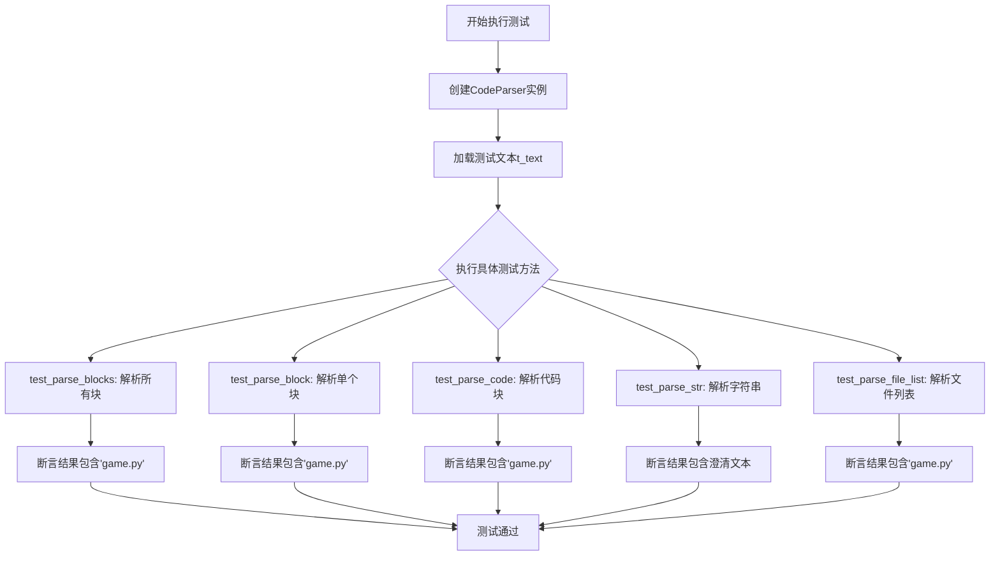
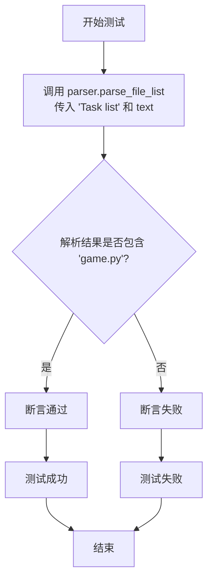
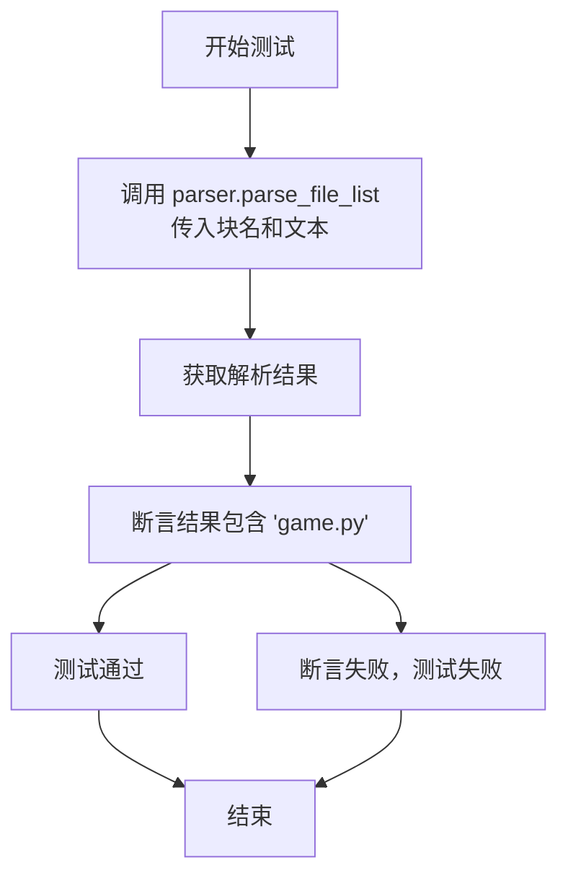
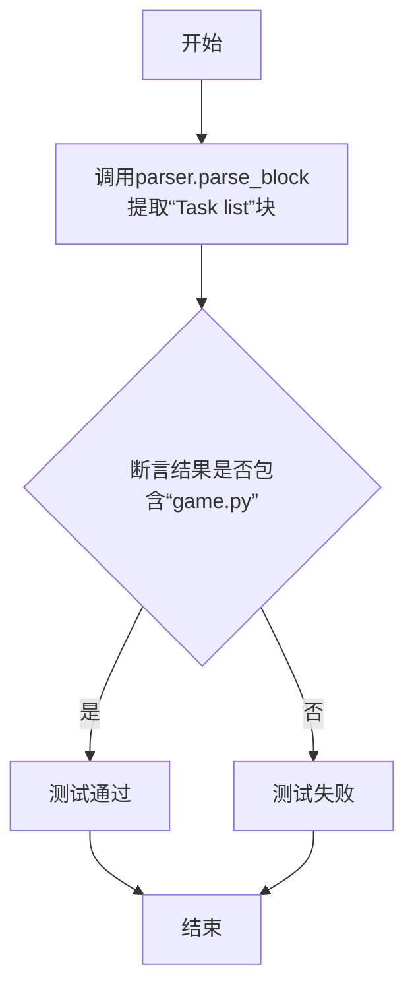
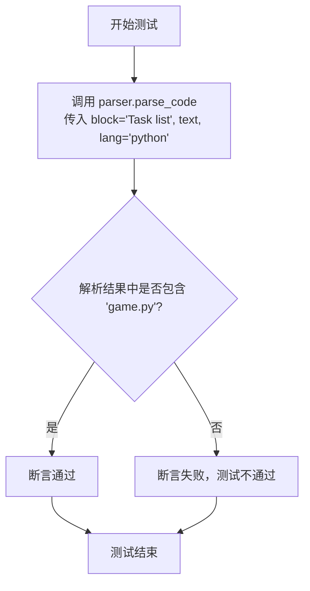
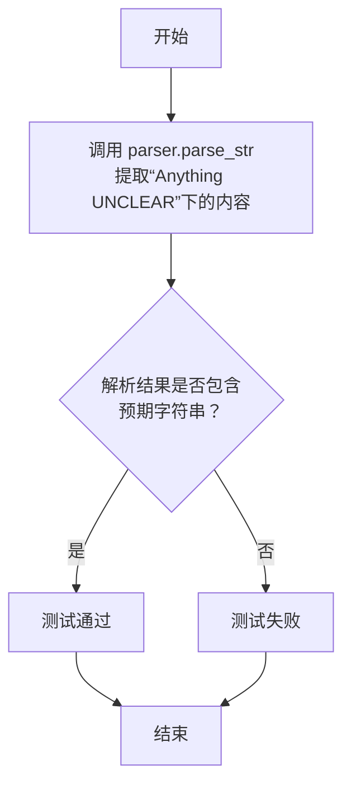
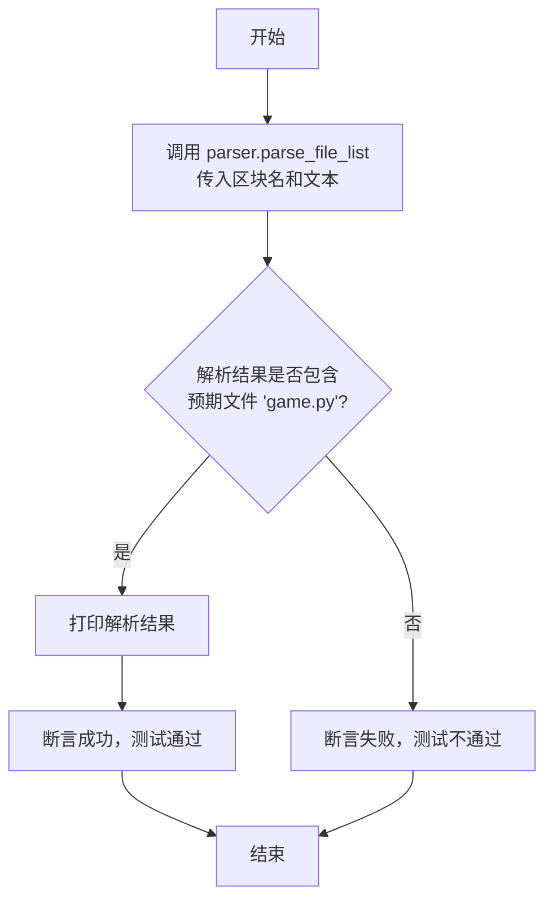

# `.\MetaGPT\tests\metagpt\utils\test_code_parser.py` 详细设计文档

该文件是一个使用pytest框架编写的单元测试文件，用于测试CodeParser类的功能。CodeParser类用于从结构化文本中解析特定格式的代码块、任务列表、文件列表等信息。测试文件包含一个示例文本t_text，该文本模拟了项目设计文档的结构，包含多个用Markdown代码块标记的部分。测试类TestCodeParser通过多个测试方法验证CodeParser能否正确解析这些部分。

## 整体流程



## 类结构

```
TestCodeParser (测试类)
├── parser (fixture: 返回CodeParser实例)
├── text (fixture: 返回测试文本t_text)
├── test_parse_blocks (测试方法: 测试parse_blocks)
├── test_parse_block (测试方法: 测试parse_block)
├── test_parse_code (测试方法: 测试parse_code)
├── test_parse_str (测试方法: 测试parse_str)
└── test_parse_file_list (测试方法: 测试parse_file_list)
```

## 全局变量及字段


### `t_text`
    
一个包含多段结构化文本的字符串，用于测试CodeParser类的解析功能，内容模拟了项目设计文档的常见部分。

类型：`str`
    


    

## 全局函数及方法

### `TestCodeParser.test_parse_file_list`

该方法用于测试 `CodeParser.parse_file_list` 函数的功能，验证其能否从给定的文本中正确解析出指定块（如“Task list”）中的文件列表。测试通过断言检查解析结果是否包含预期的文件名（如“game.py”）。

参数：

- `parser`：`CodeParser`，`CodeParser` 类的实例，用于解析文本中的代码块。
- `text`：`str`，包含待解析内容的文本字符串，其中包含多个以特定标记分隔的代码块。

返回值：`None`，测试方法不返回任何值，仅通过断言验证测试结果。

#### 流程图



#### 带注释源码

```python
def test_parse_file_list(self, parser, text):
    # 调用 CodeParser 实例的 parse_file_list 方法，尝试从 text 中解析出“Task list”块中的文件列表。
    result = parser.parse_file_list("Task list", text)
    # 打印解析结果，便于调试。
    print(result)
    # 使用断言验证解析结果中是否包含预期的文件名“game.py”。
    assert "game.py" in result
```

### `TestCodeParser.test_parse_file_list`

该方法用于测试 `CodeParser.parse_file_list` 函数的功能，验证其能否从给定的文本中正确解析出指定块（如"Task list"）中的文件列表。它通过断言检查解析结果是否包含预期的文件名（如"game.py"）来确认解析的正确性。

参数：

- `self`：`TestCodeParser`，测试类实例，用于访问测试方法和属性
- `parser`：`CodeParser`，`CodeParser` 类的实例，提供文本解析功能
- `text`：`str`，包含结构化代码文档的文本，用于解析测试

返回值：`None`，测试方法通常不返回值，而是通过断言验证结果

#### 流程图



#### 带注释源码

```python
def test_parse_file_list(self, parser, text):
    # 调用 CodeParser 实例的 parse_file_list 方法，
    # 传入块名 "Task list" 和测试文本，解析文件列表
    result = parser.parse_file_list("Task list", text)
    
    # 打印解析结果，便于调试和查看
    print(result)
    
    # 使用断言验证解析结果中是否包含预期的文件名 "game.py"，
    # 如果包含则测试通过，否则测试失败
    assert "game.py" in result
```

### `TestCodeParser.test_parse_blocks`

该方法用于测试 `CodeParser` 类的 `parse_blocks` 方法。它验证了 `parse_blocks` 方法能够正确地从给定的结构化文本中解析出所有命名的代码块，并确保特定的块（如“Task list”）包含预期的内容（如“game.py”）。

参数：

- `self`：`TestCodeParser`，测试类实例，用于访问类属性和方法。
- `parser`：`CodeParser`，`CodeParser` 类的实例，作为测试的依赖项，用于调用 `parse_blocks` 方法。
- `text`：`str`，包含多个结构化代码块的文本，作为 `parse_blocks` 方法的输入。

返回值：`None`，该方法是一个单元测试，不返回任何值，仅通过断言来验证测试结果。

#### 流程图

```mermaid
graph TD
    A[开始] --> B[调用 parser.parse_blocks(text)]
    B --> C{解析结果是否包含<br>“Task list”块且<br>该块包含“game.py”?}
    C -->|是| D[测试通过]
    C -->|否| E[测试失败]
    D --> F[结束]
    E --> F
```

#### 带注释源码

```python
def test_parse_blocks(self, parser, text):
    # 调用 CodeParser 实例的 parse_blocks 方法，传入测试文本
    result = parser.parse_blocks(text)
    # 打印解析结果，便于调试
    print(result)
    # 断言：验证解析结果中“Task list”块的内容包含字符串“game.py”
    assert "game.py" in result["Task list"]
```

### `TestCodeParser.test_parse_block`

该方法用于测试`CodeParser`类的`parse_block`功能，验证其能否从给定的文本中正确提取指定标题下的内容块。

参数：

- `self`：`TestCodeParser`，测试类实例
- `parser`：`CodeParser`，通过pytest fixture注入的`CodeParser`实例
- `text`：`str`，通过pytest fixture注入的测试文本

返回值：`None`，无返回值，通过断言验证测试结果

#### 流程图



#### 带注释源码

```python
def test_parse_block(self, parser, text):
    # 调用CodeParser.parse_block方法，从text中提取标题为"Task list"的代码块
    result = parser.parse_block("Task list", text)
    # 打印提取结果，便于调试
    print(result)
    # 断言：验证提取的结果中是否包含预期的"game.py"字符串
    assert "game.py" in result
```

### `TestCodeParser.test_parse_code`

该方法用于测试 `CodeParser.parse_code` 函数，验证其能否从给定的文本中正确解析出指定代码块（`block`）的代码内容，并确保解析结果符合预期（例如包含特定字符串）。

参数：

- `parser`：`CodeParser`，`CodeParser` 类的实例，用于执行解析操作。
- `text`：`str`，包含待解析代码块的原始文本。

返回值：`None`，这是一个单元测试方法，不返回任何值，而是通过断言（`assert`）来验证测试结果。

#### 流程图



#### 带注释源码

```python
def test_parse_code(self, parser, text):
    # 调用 CodeParser 实例的 parse_code 方法，尝试从 text 中解析出 'Task list' 代码块的内容。
    # 参数说明：
    #   block='Task list': 指定要解析的代码块标题。
    #   text=text: 传入包含代码块的原始文本。
    #   lang='python': 指定代码块的语言为 Python。
    result = parser.parse_code(block="Task list", text=text, lang="python")
    
    # 打印解析结果，便于调试。
    print(result)
    
    # 断言：验证解析结果（result）中是否包含字符串 'game.py'。
    # 这是测试的核心验证点，用于确认 parse_code 方法能正确提取出任务列表中的文件名。
    assert "game.py" in result
```

### `TestCodeParser.test_parse_str`

该方法用于测试 `CodeParser.parse_str` 函数的功能，验证其能否从给定的文本中正确提取并解析指定标题（如“Anything UNCLEAR”）下的内容，并返回特定编程语言（如“python”）格式的字符串。

参数：

- `parser`：`CodeParser`，`CodeParser` 类的实例，用于解析文本。
- `text`：`str`，包含待解析内容的完整文本字符串。

返回值：`None`，该测试方法不返回任何值，仅通过断言验证解析结果。

#### 流程图



#### 带注释源码

```python
def test_parse_str(self, parser, text):
    # 调用 CodeParser 实例的 parse_str 方法
    # 参数1: block_title="Anything UNCLEAR"，指定要提取的文本块标题
    # 参数2: text，传入的包含所有内容的完整文本
    # 参数3: lang="python"，指定期望返回的代码块语言
    result = parser.parse_str("Anything UNCLEAR", text, "python")
    # 打印解析结果，便于调试
    print(result)
    # 断言：验证解析结果中是否包含预期的子字符串
    # 这用于确认 parse_str 方法正确提取了“Anything UNCLEAR”部分的内容
    assert "We need clarification on how the high score " in result
```

### `TestCodeParser.test_parse_file_list`

该方法用于测试 `CodeParser` 类的 `parse_file_list` 功能，验证其能否从给定的文本中正确解析出指定区块（如“Task list”）中的文件列表。

参数：

- `self`：`TestCodeParser`，测试类实例，用于访问测试方法和属性。
- `parser`：`CodeParser`，`CodeParser` 类的实例，提供解析功能。
- `text`：`str`，包含待解析内容的文本字符串。

返回值：`None`，该方法是一个单元测试，不返回业务值，而是通过断言（`assert`）来验证解析结果。

#### 流程图



#### 带注释源码

```python
def test_parse_file_list(self, parser, text):
    # 调用 CodeParser 实例的 parse_file_list 方法，尝试从 `text` 中解析名为 “Task list” 的区块内容。
    # 预期该方法会返回一个文件列表（例如 ['game.py', 'app.py', ...]）。
    result = parser.parse_file_list("Task list", text)
    
    # 打印解析结果，便于调试和观察实际输出。
    print(result)
    
    # 使用断言验证解析结果。检查返回的列表 `result` 中是否包含预期的字符串 “game.py”。
    # 如果包含，则测试通过；如果不包含，则测试失败，并抛出 AssertionError。
    assert "game.py" in result
```

## 关键组件


### 代码解析器 (CodeParser)

一个用于从结构化文本（特别是包含Markdown代码块的文本）中提取特定信息块的工具类。它能够识别文本中的章节标题（如"Task list"），并提取对应代码块内的内容，支持解析为Python数据结构（如列表、字符串）或文件列表。

### 文本块解析 (parse_blocks)

将输入的完整文本按章节标题（如"## Required Python third-party packages"）分割成多个块，并返回一个字典，其中键为块标题，值为该标题下的完整文本内容（包括代码块标记）。这是其他解析方法的基础。

### 特定块解析 (parse_block)

根据给定的块标题（如"Task list"），从输入文本中提取该标题下的完整文本内容（包括代码块标记）。它依赖于`parse_blocks`方法。

### 代码内容解析 (parse_code)

根据给定的块标题和编程语言（如"Task list"和"python"），从输入文本中提取该标题下指定代码块内的纯代码内容，并去除外部的三重反引号标记和语言标识符。

### 字符串解析 (parse_str)

根据给定的块标题和可选的编程语言，从输入文本中提取该标题下的内容。如果指定了语言，则行为类似于`parse_code`，提取代码块内的内容；如果未指定语言，则行为类似于`parse_block`，但会去除可能存在的三重反引号标记。

### 文件列表解析 (parse_file_list)

一个便捷方法，专门用于解析"Task list"这类块，其内容预期是一个Python列表字符串，列表元素是文件名。它内部调用`parse_code`来获取代码字符串，然后使用`ast.literal_eval`安全地将其评估为Python列表对象。


## 问题及建议


### 已知问题

-   **测试代码与生产代码耦合**：`TestCodeParser` 类中的 `test_parse_file_list` 方法被设计为既是一个单元测试方法，又可以在 `if __name__ == "__main__":` 块中直接运行。这违反了单元测试的单一职责原则，使得测试代码本身包含了运行逻辑，降低了代码的清晰度和可维护性。
-   **硬编码的测试数据**：测试数据 `t_text` 作为全局变量直接嵌入在测试文件中。当需要测试不同场景或更新测试数据时，必须修改源代码，这增加了维护成本并降低了测试的灵活性。
-   **脆弱的断言**：测试断言（如 `assert "game.py" in result`）依赖于 `t_text` 中特定字符串的存在。如果 `t_text` 的内容或 `CodeParser` 的输出格式发生变化，即使核心逻辑正确，测试也可能失败，导致测试不健壮。
-   **潜在的代码解析健壮性问题**：测试用例 `t_text` 结构良好，但 `CodeParser` 类（虽然未提供源码）可能对输入文本的格式（如标记符、缩进、空行）有严格要求。如果输入格式不规范，解析方法（如 `parse_blocks`, `parse_block`）可能无法正确提取信息或抛出未处理的异常。
-   **缺少负面测试用例**：当前的测试只验证了正常情况下的解析功能。缺少对异常或边界情况的测试，例如输入为空字符串、格式错误、标记符缺失等情况，无法保证 `CodeParser` 的鲁棒性。

### 优化建议

-   **分离测试运行逻辑**：移除 `if __name__ == "__main__":` 块中直接实例化测试类并调用测试方法的代码。测试应完全通过 `pytest` 命令来驱动和执行，保持测试套件的纯粹性。
-   **外部化测试数据**：考虑将 `t_text` 这类较长的测试数据移至外部文件（如 `test_data.json` 或 `test_data.py`）中，或者使用 `pytest` 的 `@pytest.fixture` 更灵活地生成和注入测试数据，提高可维护性。
-   **增强断言逻辑**：使用更精确的断言，例如验证解析后数据结构（如列表、字典）的内容、长度和类型，而不仅仅是检查子字符串是否存在。这可以使测试对无关的文本变化不敏感，同时更准确地验证业务逻辑。
-   **补充负面和边界测试**：为 `CodeParser` 增加测试用例，覆盖以下场景：
    -   空输入文本。
    -   缺少关键区块标记（如 `## Task list`）的文本。
    -   区块内容为空的文本。
    -   包含非法或意外字符的文本。
    -   验证解析失败时是否抛出了预期的异常或返回了合理的默认值。
-   **重构测试以提高可读性**：为每个测试方法添加清晰的文档字符串，说明测试的目的和场景。考虑使用参数化测试（`@pytest.mark.parametrize`）来测试同一方法在不同输入下的行为，减少重复代码。
-   **考虑模拟（Mock）外部依赖**：如果 `CodeParser` 有外部依赖（如文件I/O、网络请求），在单元测试中应使用 `unittest.mock` 来模拟这些依赖，确保测试的独立性和执行速度。
-   **评估并增强 `CodeParser` 的鲁棒性**：审查 `CodeParser` 的实现代码（未提供），确保其能妥善处理格式不规范的输入，例如使用更宽容的正则表达式或添加输入验证和清理步骤，并提供清晰的错误信息。


## 其它


### 设计目标与约束

该代码是一个单元测试文件，用于测试 `CodeParser` 类的功能。其设计目标是验证 `CodeParser` 能够从结构化的文本中正确解析出不同的代码块、列表和字符串信息。主要约束包括：
1.  **测试隔离性**：每个测试方法应独立运行，不依赖外部状态，通过 `pytest.fixture` 提供 `parser` 和 `text` 实例。
2.  **可读性与维护性**：测试代码应清晰易读，断言条件明确，便于后续维护和扩展。
3.  **功能覆盖**：测试应覆盖 `CodeParser` 类的主要公共方法，包括 `parse_blocks`、`parse_block`、`parse_code`、`parse_str` 和 `parse_file_list`。

### 错误处理与异常设计

该测试文件本身不包含复杂的业务逻辑错误处理，其核心是验证 `CodeParser` 在给定输入下的输出是否符合预期。其错误处理设计主要体现在：
1.  **测试断言**：使用 `assert` 语句验证解析结果是否包含预期的关键内容（如 `"game.py"`）。如果断言失败，`pytest` 框架会抛出 `AssertionError` 并报告测试失败。
2.  **输入验证**：测试依赖于一个预定义的、格式良好的 `t_text` 字符串。它假设 `CodeParser` 能够处理这种特定格式。如果 `CodeParser` 内部对格式有严格要求，其自身的异常应被测试用例捕获（尽管当前测试未显式测试异常路径）。
3.  **潜在异常**：如果 `CodeParser` 的方法在解析过程中遇到意外格式或空输入，可能会抛出 `ValueError`、`KeyError` 或自定义异常。当前的测试套件未包含这些负面测试用例。

### 数据流与状态机

本测试文件的数据流相对简单直接：
1.  **数据源**：固定的多行字符串 `t_text`，模拟了一个包含多个标记代码块的结构化文档。
2.  **处理单元**：`CodeParser` 类的实例。每个测试方法创建一个新的或使用 fixture 提供的解析器。
3.  **数据流转**：每个测试方法将 `t_text` 和特定的参数（如块名称 `"Task list"`）传递给 `CodeParser` 的不同方法。
4.  **结果验证**：解析方法的返回值被捕获到 `result` 变量中，然后通过 `assert` 语句检查 `result` 是否包含预期的子字符串或列表项。
5.  **状态**：测试本身是无状态的。`CodeParser` 被设计为无状态工具类，其方法输出仅依赖于输入参数。

### 外部依赖与接口契约

1.  **外部依赖**：
    *   **pytest**: 测试框架，用于组织测试用例、提供 fixtures (`@pytest.fixture`) 和运行测试。这是开发/测试阶段的依赖。
    *   **metagpt.utils.common.CodeParser**: 这是被测试的核心组件。测试文件完全依赖于它的公共接口（方法签名和行为）。
2.  **接口契约**：
    *   测试与 `CodeParser` 的契约基于对其方法行为的预期。例如：
        *   `parse_blocks(text)`: 应返回一个字典，其中键是块标题（如 `"Task list"`），值是相应的块内容字符串。
        *   `parse_block(block_name, text)`: 应返回指定 `block_name` 对应的完整内容字符串。
        *   `parse_code(block, text, lang)`: 应返回指定代码块内，对应语言 (`lang`) 的代码部分（通常去除三重反引号及语言标识）。
        *   `parse_str(section_name, text, lang)`: 应返回指定部分 (`section_name`) 中，对应语言 (`lang`) 标记内的字符串内容。
        *   `parse_file_list(section_name, text)`: 应返回指定部分中解析出的文件路径列表。
    *   测试用例通过检查返回结果是否包含 `"game.py"` 来间接验证这些契约。更严格的契约测试可能包括验证返回值的完整结构、类型和边界情况。

### 安全性与合规性考虑

此测试代码不涉及生产环境部署、用户数据或网络交互，因此主要的安全与合规性考虑集中在开发实践层面：
1.  **代码安全**：测试代码本身是安全的，不执行动态代码生成或评估。它仅调用 `CodeParser` 的解析方法。
2.  **依赖安全**：依赖于 `pytest` 和 `metagpt`。需要确保这些依赖来自可信源，并且其版本没有已知的重大安全漏洞。这通常在项目级别的依赖管理（如 `requirements.txt`、`poetry.lock`）中处理。
3.  **合规性**：代码中不包含敏感信息（如密钥、个人数据）。`t_text` 是硬编码的示例数据。
4.  **测试数据**：使用的测试数据 `t_text` 是公开、无害的示例，不涉及版权或隐私问题。

### 部署与运维考虑

作为单元测试文件，其部署与运维考虑非常有限：
1.  **部署位置**：该文件应位于项目的测试目录中（例如 `tests/`），与生产代码分离。
2.  **执行方式**：通常通过命令 `pytest path/to/test_code_parser.py` 或 `pytest -k test_code_parser` 在开发环境或 CI/CD 流水线中执行。
3.  **环境要求**：需要安装 `pytest` 和待测试的 `metagpt` 包。通常通过项目的开发依赖或测试环境配置来满足。
4.  **运维监控**：测试本身不被监控。但测试在 CI/CD 中的通过/失败状态是关键的运维指标，用于阻止有缺陷的代码进入生产环境。
5.  **资源消耗**：单元测试执行快速，消耗内存和CPU资源极少，无需特殊运维配置。

    