# `.\MetaGPT\tests\metagpt\utils\test_common.py` 详细设计文档

这是一个单元测试文件，用于测试 metagpt.utils.common 模块中的各种工具函数，包括路径处理、字符串转换、文件读写、命令检查、版本验证、异常处理、命名空间操作、JSON读取、类导入、图像路径提取等功能。

## 整体流程


## 类结构

```
TestGetProjectRoot (测试类)
├── change_etc_dir (辅助方法)
├── test_get_project_root (测试方法)
├── test_get_root_exception (测试方法)
├── test_any_to_str (测试方法)
├── test_any_to_str_set (测试方法)
├── test_check_cmd_exists (测试方法)
├── test_parse_data_exception (测试方法)
├── test_require_python_version (测试方法)
├── test_no_money_exception (测试方法)
├── test_print_members (测试方法)
├── test_parse_recipient (测试方法)
├── test_concat_namespace (测试方法)
├── test_split_namespace (测试方法)
├── test_read_json_file (测试方法)
├── test_import_class_inst (测试方法)
├── test_read_file_block (测试方法)
├── test_read_write (测试方法)
└── test_read_write_error_charset (测试方法)
全局函数
├── test_extract_image_paths
└── test_extract_and_encode_images
```

## 全局变量及字段


    

## 全局函数及方法

### `extract_image_paths`

从给定的文本内容中提取所有符合特定模式的图像文件路径。

参数：
- `content`：`str`，包含可能嵌入图像路径的文本内容

返回值：`list[str]`，提取到的图像文件路径列表，如果没有找到则返回空列表

#### 流程图

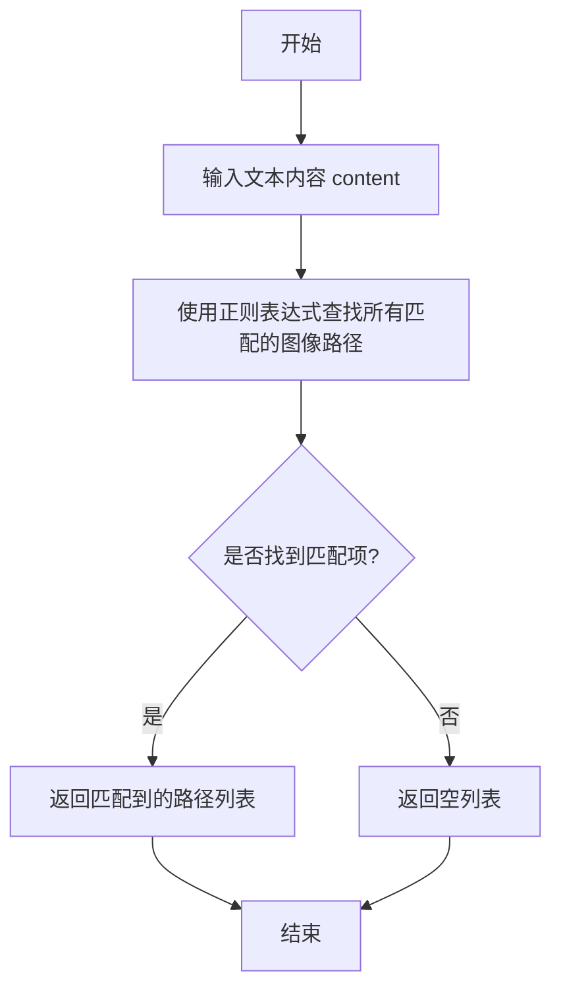

#### 带注释源码

```python
def extract_image_paths(content: str) -> list[str]:
    """
    从给定的文本内容中提取所有符合特定模式的图像文件路径。
    
    该函数使用正则表达式匹配常见的图像文件扩展名（如.jpg、.png、.gif等），
    并返回找到的所有完整文件路径。
    
    Args:
        content (str): 包含可能嵌入图像路径的文本内容
        
    Returns:
        list[str]: 提取到的图像文件路径列表，如果没有找到则返回空列表
    """
    # 定义匹配图像文件路径的正则表达式模式
    # 模式解释：
    #   (?<!\S) - 负向回顾断言，确保路径前没有非空白字符（避免匹配到单词中的点）
    #   (?:/[^/\s]+)+ - 匹配一个或多个由斜杠分隔的路径组件
    #   \.(?:jpg|jpeg|png|gif|bmp|svg|webp) - 匹配常见的图像文件扩展名
    #   (?!\S) - 负向前瞻断言，确保路径后没有非空白字符
    pattern = r'(?<!\S)((?:/[^/\s]+)+\.(?:jpg|jpeg|png|gif|bmp|svg|webp))(?!\S)'
    
    # 使用正则表达式查找所有匹配的图像路径
    matches = re.findall(pattern, content, re.IGNORECASE)
    
    # 返回匹配到的路径列表
    return matches
```

### `test_extract_and_encode_images`

这是一个单元测试函数，用于测试 `extract_and_encode_images` 函数在传入不存在的图片路径时的行为。它验证了当输入字符串中不包含有效或存在的图片路径时，函数是否返回空结果。

参数：
- 无显式参数。该函数是一个测试用例，不接收外部参数。

返回值：`None`，该函数是一个测试用例，不返回业务值，而是通过 `assert` 语句验证测试结果。

#### 流程图

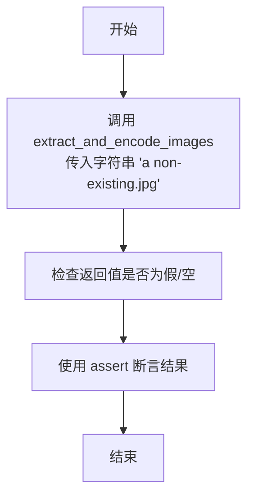

#### 带注释源码

```python
def test_extract_and_encode_images():
    # 调用被测试函数 extract_and_encode_images，传入一个不存在的图片路径字符串
    # 预期行为：当路径不存在时，函数应返回空值（如空列表、None或False）
    # 使用 assert 语句验证函数返回值是否为假（空），以此作为测试通过的判断
    assert not extract_and_encode_images("a non-existing.jpg")
```

### `TestGetProjectRoot.change_etc_dir`

该方法用于将当前工作目录更改为系统的 `/etc` 目录，以便在测试中模拟非项目根目录的环境。

参数：无

返回值：`None`，无返回值

#### 流程图

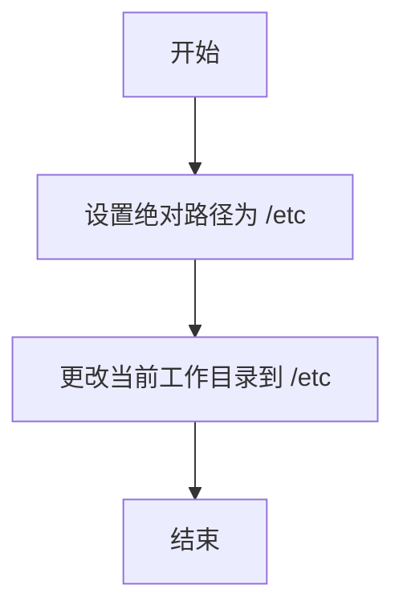

#### 带注释源码

```python
def change_etc_dir(self):
    # current_directory = Path.cwd()  # 注释掉的代码：获取当前工作目录
    abs_root = "/etc"  # 设置目标目录为系统的 /etc 目录
    os.chdir(abs_root)  # 使用 os.chdir 更改当前工作目录到 /etc
```

### `TestGetProjectRoot.test_get_project_root`

该方法是一个单元测试，用于验证 `get_metagpt_root` 函数能够正确返回 MetaGPT 项目的根目录路径，并确保该路径下的 `metagpt` 子目录存在。

参数：
- `self`：`TestGetProjectRoot`，测试类实例，用于访问类方法和属性。

返回值：`None`，无返回值，通过断言验证测试结果。

#### 流程图

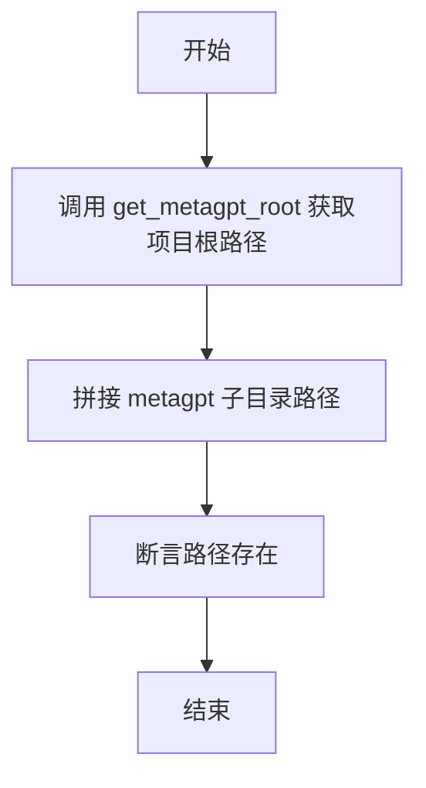

#### 带注释源码

```python
def test_get_project_root(self):
    # 调用 get_metagpt_root 函数获取项目根目录路径
    project_root = get_metagpt_root()
    # 拼接 metagpt 子目录路径
    src_path = project_root / "metagpt"
    # 断言该路径存在，验证项目根目录正确性
    assert src_path.exists()
```

### `TestGetProjectRoot.test_get_root_exception`

这是一个单元测试方法，用于测试 `get_metagpt_root` 函数在特定异常情况下的行为。具体来说，它通过临时将当前工作目录切换到 `/etc` 来模拟一个非项目根目录的环境，然后验证 `get_metagpt_root` 函数是否仍然能够正确返回项目根目录路径。

参数：
-  `self`：`TestGetProjectRoot`，测试类实例的引用。

返回值：`None`，这是一个测试方法，不返回任何值，其目的是通过断言来验证代码行为。

#### 流程图

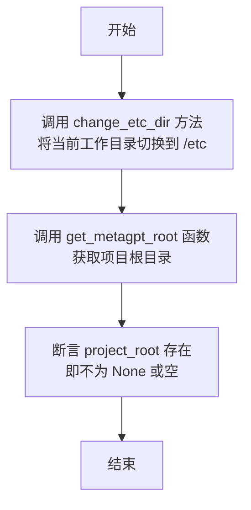

#### 带注释源码

```python
def test_get_root_exception(self):
    # 步骤1：调用辅助方法，将当前工作目录切换到 /etc 目录。
    # 这是为了模拟一个不在项目目录下的环境，测试 get_metagpt_root 函数的健壮性。
    self.change_etc_dir()
    # 步骤2：调用被测试的核心函数 get_metagpt_root。
    # 预期该函数应能通过其他方式（如查找特定标记文件）定位到项目根目录，而不依赖当前工作目录。
    project_root = get_metagpt_root()
    # 步骤3：进行断言验证。
    # 断言 project_root 被成功获取（即其值为真，不为 None 或空路径）。
    # 如果断言失败，则测试不通过，表明 get_metagpt_root 函数在当前工作目录改变时可能无法正确工作。
    assert project_root
```

### `TestGetProjectRoot.test_any_to_str`

这是一个单元测试方法，用于测试 `any_to_str` 函数。它通过创建一系列包含不同输入类型（如类、类实例、字符串）和预期输出字符串的测试用例，来验证 `any_to_str` 函数是否能正确地将各种输入转换为预期的字符串表示形式。

参数：

-  `self`：`TestGetProjectRoot`，测试类实例的引用，用于访问类的方法和属性。

返回值：`None`，单元测试方法通常不返回值，而是通过断言（`assert`）来验证测试结果。

#### 流程图

```mermaid
flowchart TD
    A[开始测试] --> B[定义测试输入列表<br>Input(x, want)]
    B --> C{遍历输入列表}
    C --> D[调用 any_to_str(i.x)]
    D --> E[断言 v == i.want]
    E --> C
    C --> F[所有测试通过]
    F --> G[结束]
```

#### 带注释源码

```python
def test_any_to_str(self):
    # 定义一个内部类 `Input` 作为测试用例的数据结构。
    # 它有两个字段：`x` 是任意类型的输入，`want` 是期望的字符串输出。
    class Input(BaseModel):
        x: Any = None
        want: str

    # 定义测试用例列表。每个元素是一个 `Input` 实例。
    # 测试用例覆盖了多种输入类型：
    # 1. 类本身 (TutorialAssistant)
    # 2. 类的实例 (TutorialAssistant())
    # 3. 另一个类本身 (RunCode)
    # 4. 另一个类的实例 (RunCode())
    # 5. 类本身 (Message)
    # 6. 类的实例 (Message(content=""))
    # 7. 纯字符串 ("A")
    inputs = [
        Input(x=TutorialAssistant, want="metagpt.roles.tutorial_assistant.TutorialAssistant"),
        Input(x=TutorialAssistant(), want="metagpt.roles.tutorial_assistant.TutorialAssistant"),
        Input(x=RunCode, want="metagpt.actions.run_code.RunCode"),
        Input(x=RunCode(), want="metagpt.actions.run_code.RunCode"),
        Input(x=Message, want="metagpt.schema.Message"),
        Input(x=Message(content=""), want="metagpt.schema.Message"),
        Input(x="A", want="A"),
    ]
    # 遍历所有测试用例
    for i in inputs:
        # 调用被测试函数 `any_to_str`，传入输入 `i.x`
        v = any_to_str(i.x)
        # 使用断言验证函数返回的字符串 `v` 是否等于期望的字符串 `i.want`
        assert v == i.want
```

### `TestGetProjectRoot.test_any_to_str_set`

该方法是一个单元测试，用于验证 `any_to_str_set` 函数的功能。它通过创建多个测试用例，检查 `any_to_str_set` 函数是否能正确地将不同类型的输入（如列表、集合、元组、字典）转换为一个包含字符串表示的集合。

参数：

-  `self`：`TestGetProjectRoot`，测试类实例的引用
-  无其他显式参数

返回值：`None`，该方法不返回任何值，仅通过断言验证测试结果

#### 流程图

```mermaid
graph TD
    A[开始] --> B[定义测试输入列表 Inputs]
    B --> C{遍历 inputs 列表?}
    C -->|是| D[获取当前输入 i]
    D --> E[调用 any_to_str_set(i.x)]
    E --> F[断言 v == i.want]
    F --> C
    C -->|否| G[结束]
```

#### 带注释源码

```python
def test_any_to_str_set(self):
    # 定义一个内部类 Input 用于封装测试输入和期望输出
    class Input(BaseModel):
        x: Any = None  # 输入值，可以是任何类型
        want: Set      # 期望的输出集合

    # 定义测试用例列表，每个用例包含输入 x 和期望的输出 want
    inputs = [
        Input(
            x=[TutorialAssistant, RunCode(), "a"],  # 输入为列表，包含类、实例和字符串
            want={"metagpt.roles.tutorial_assistant.TutorialAssistant", "metagpt.actions.run_code.RunCode", "a"},  # 期望的字符串集合
        ),
        Input(
            x={TutorialAssistant, "a"},  # 输入为集合，包含类和字符串
            want={"metagpt.roles.tutorial_assistant.TutorialAssistant", "a"},  # 期望的字符串集合
        ),
        Input(
            x=(TutorialAssistant, RunCode(), "a"),  # 输入为元组，包含类、实例和字符串
            want={"metagpt.roles.tutorial_assistant.TutorialAssistant", "metagpt.actions.run_code.RunCode", "a"},  # 期望的字符串集合
        ),
        Input(
            x={"a": TutorialAssistant, "b": RunCode(), "c": "a"},  # 输入为字典，键值对包含类、实例和字符串
            want={"a", "metagpt.roles.tutorial_assistant.TutorialAssistant", "metagpt.actions.run_code.RunCode"},  # 期望的字符串集合（字典的键和值都会被转换）
        ),
    ]
    # 遍历所有测试用例
    for i in inputs:
        v = any_to_str_set(i.x)  # 调用被测试函数 any_to_str_set
        assert v == i.want  # 断言实际结果与期望结果一致
```

### `TestGetProjectRoot.test_check_cmd_exists`

该方法用于测试`check_cmd_exists`函数在不同操作系统平台下检查命令是否存在的行为。它通过模拟不同平台的输入，验证函数返回的退出码是否符合预期。

参数：

- `self`：`TestGetProjectRoot`，测试类实例的引用，用于访问类属性和方法。

返回值：`None`，测试方法通常不返回值，而是通过断言验证测试结果。

#### 流程图

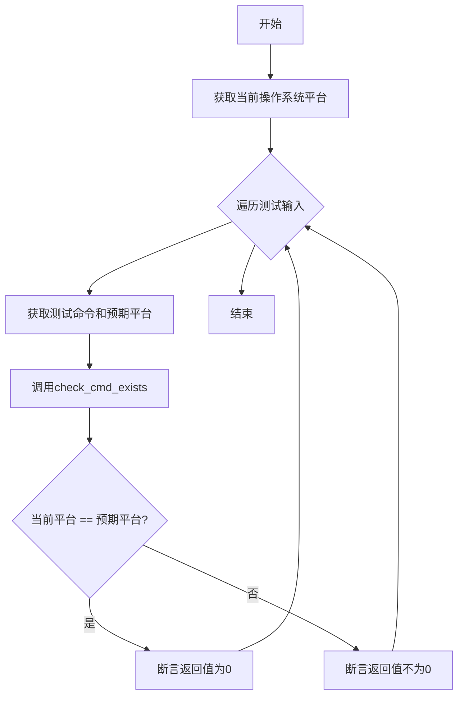

#### 带注释源码

```python
def test_check_cmd_exists(self):
    # 定义输入数据的结构模型
    class Input(BaseModel):
        command: str  # 要检查的命令名称
        platform: str  # 预期该命令存在的操作系统平台

    # 测试用例列表，包含不同命令和对应的预期平台
    inputs = [
        {"command": "cat", "platform": "linux"},  # Linux系统命令
        {"command": "ls", "platform": "linux"},   # Linux系统命令
        {"command": "mspaint", "platform": "windows"},  # Windows系统命令
    ]
    
    # 获取当前运行环境的操作系统平台
    plat = "windows" if platform.system().lower() == "windows" else "linux"
    
    # 遍历所有测试用例
    for i in inputs:
        # 将字典转换为Input对象
        seed = Input(**i)
        # 调用被测试函数，检查命令是否存在
        result = check_cmd_exists(seed.command)
        
        # 根据当前平台与预期平台的匹配情况，验证返回值
        if plat == seed.platform:
            # 如果当前平台与预期平台一致，命令应该存在，返回0
            assert result == 0
        else:
            # 如果平台不一致，命令应该不存在，返回非0值
            assert result != 0
```

### `TestGetProjectRoot.test_parse_data_exception`

这是一个单元测试方法，用于测试 `OutputParser.parse_data` 函数在解析特定数据文件时，是否能够正确处理异常情况并返回包含预期关键词的结果。它通过参数化测试，验证函数对不同输入文件的处理能力。

参数：

- `self`：`TestGetProjectRoot`，测试类实例的引用。
- `filename`：`str`，通过 `@pytest.mark.parametrize` 装饰器传入的参数，表示要测试的数据文件名。
- `want`：`str`，通过 `@pytest.mark.parametrize` 装饰器传入的参数，表示期望在解析结果中包含的关键词。

返回值：`None`，这是一个测试方法，其主要目的是通过断言（`assert`）来验证代码行为，不返回业务值。

#### 流程图

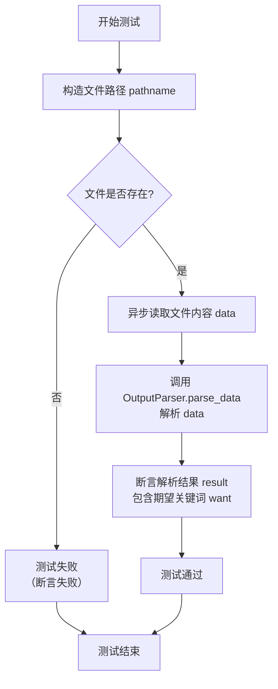

#### 带注释源码

```python
    @pytest.mark.parametrize(("filename", "want"), [("1.md", "File list"), ("2.md", "Language"), ("3.md", "# TODOs")])
    @pytest.mark.asyncio
    async def test_parse_data_exception(self, filename, want):
        # 1. 构造测试数据文件的完整路径。
        #    Path(__file__) 获取当前脚本路径，通过 parent 属性向上回溯目录，定位到项目根目录下的 `data/output_parser` 文件夹。
        pathname = Path(__file__).parent.parent.parent / "data/output_parser" / filename
        # 2. 断言该路径对应的文件确实存在，确保测试前提条件满足。
        assert pathname.exists()
        # 3. 异步读取指定文件的内容，存储到变量 `data` 中。
        data = await aread(filename=pathname)
        # 4. 调用被测试函数 `OutputParser.parse_data`，传入读取到的文件内容进行解析。
        result = OutputParser.parse_data(data=data)
        # 5. 断言解析后的结果字符串中包含期望的关键词 `want`。
        #    这是测试的核心验证点，确保 `parse_data` 函数对特定输入能产生预期的输出片段。
        assert want in result
```

### `TestGetProjectRoot.test_require_python_version`

这是一个单元测试方法，用于测试 `require_python_version` 函数。它通过参数化测试验证函数在不同Python版本要求下的行为，包括成功返回和抛出异常的情况。

参数：

- `ver`：`tuple`，一个表示Python版本号的元组，例如 `(3, 10, 18)`。
- `want`：`bool`，期望的测试结果，表示 `require_python_version` 函数应返回的布尔值。
- `err`：`bool`，一个布尔值，指示测试是否期望 `require_python_version` 函数抛出 `ValueError` 异常。

返回值：`None`，这是一个测试方法，不返回任何值，而是通过断言来验证测试结果。

#### 流程图

```mermaid
flowchart TD
    A[开始测试] --> B{是否期望异常?<br>err == True};
    B -- 是 --> C[调用 require_python_version(ver)<br>期望抛出 ValueError];
    C --> D[捕获到 ValueError?];
    D -- 是 --> E[测试通过];
    D -- 否 --> F[测试失败];
    B -- 否 --> G[调用 require_python_version(ver)<br>获取结果 res];
    G --> H{res == want?};
    H -- 是 --> I[测试通过];
    H -- 否 --> F;
```

#### 带注释源码

```python
    @pytest.mark.parametrize(
        ("ver", "want", "err"), [((1, 2, 3, 4), False, True), ((2, 3, 9), True, False), ((3, 10, 18), False, False)]
    )
    def test_require_python_version(self, ver, want, err):
        try:
            # 调用被测试函数 require_python_version，传入版本元组 ver
            res = require_python_version(ver)
            # 如果没有抛出异常，则断言函数返回值 res 等于期望值 want
            assert res == want
        except ValueError:
            # 如果捕获到 ValueError 异常，则断言 err 参数为 True（即期望抛出异常）
            assert err
```

### `TestGetProjectRoot.test_no_money_exception`

该方法是一个单元测试，用于验证 `NoMoneyException` 异常类的实例化及其 `__str__` 方法的行为。它创建一个带有特定金额参数的 `NoMoneyException` 实例，并断言其字符串表示中包含预期的子字符串。

参数：
-  `self`：`TestGetProjectRoot`，测试类实例的引用。

返回值：`None`，这是一个测试方法，不返回任何值，其目的是通过断言来验证代码行为。

#### 流程图

```mermaid
flowchart TD
    A[开始] --> B[创建 NoMoneyException 实例<br>val = NoMoneyException(3.10)]
    B --> C[获取异常的字符串表示<br>str(val)]
    C --> D{断言<br>字符串包含 'Amount required:'}
    D -->|是| E[测试通过]
    D -->|否| F[测试失败]
    E --> G[结束]
    F --> G
```

#### 带注释源码

```python
def test_no_money_exception(self):
    # 创建一个 NoMoneyException 异常实例，传入金额参数 3.10
    val = NoMoneyException(3.10)
    # 断言：将异常实例转换为字符串后，应包含子字符串 "Amount required:"
    # 这验证了 NoMoneyException 的 __str__ 方法能正确格式化包含金额信息的错误消息
    assert "Amount required:" in str(val)
```

### `TestGetProjectRoot.test_print_members`

这是一个单元测试方法，用于测试 `print_members` 函数。它通过导入指定的模块，然后调用 `print_members` 函数，并期望该函数抛出一个异常（`Exception`）。测试的目的是验证 `print_members` 函数在特定输入下的行为是否符合预期。

参数：

- `self`：`TestGetProjectRoot` 类的实例，用于访问类的方法和属性。
- `module_path`：`str` 类型，表示要导入的模块的路径字符串。

返回值：`None`，这是一个测试方法，不返回任何值，而是通过断言来验证测试结果。

#### 流程图

```mermaid
graph TD
    A[开始] --> B[导入指定模块 module_path]
    B --> C[调用 print_members(module)]
    C --> D{是否抛出 Exception?}
    D -->|是| E[测试通过]
    D -->|否| F[测试失败]
    E --> G[结束]
    F --> G
```

#### 带注释源码

```python
@pytest.mark.parametrize("module_path", ["tests.metagpt.utils.test_common"])
def test_print_members(self, module_path):
    # 导入指定的模块路径
    module = importlib.import_module(module_path)
    # 期望 print_members 函数调用时会抛出 Exception
    with pytest.raises(Exception) as info:
        print_members(module)
        # 如果 print_members 没有抛出异常，则断言失败
        assert info is None
```

### `TestGetProjectRoot.test_parse_recipient`

该方法是一个单元测试，用于验证 `parse_recipient` 函数从给定的文本字符串中解析出收件人名称的功能。它通过参数化测试用例，检查函数是否能正确地从不同格式的文本中提取出预期的收件人名称。

参数：

- `words`：`str`，输入的文本字符串，可能包含“Send To:”前缀和收件人名称。
- `want`：`str`，期望的解析结果，即收件人名称。

返回值：`None`，这是一个测试方法，不返回任何值，仅通过断言验证测试结果。

#### 流程图

```mermaid
flowchart TD
    A[开始测试] --> B[调用 parse_recipient(words)]
    B --> C{解析结果 == want?}
    C -->|是| D[测试通过]
    C -->|否| E[测试失败]
    D --> F[结束]
    E --> F
```

#### 带注释源码

```python
    @pytest.mark.parametrize(
        ("words", "want"), [("", ""), ("## Send To: Engineer", "Engineer"), ("Send To: \nNone", "None")]
    )
    def test_parse_recipient(self, words, want):
        # 调用被测试的 parse_recipient 函数，传入参数 words
        res = parse_recipient(words)
        # 使用断言验证解析结果 res 是否等于期望值 want
        assert want == res
```

### `TestGetProjectRoot.test_concat_namespace`

这是一个单元测试方法，用于测试 `concat_namespace` 函数的功能。它通过断言验证该函数能够正确地将多个字符串参数连接成一个以冒号分隔的命名空间字符串。

参数：

-  `self`：`TestGetProjectRoot`，当前测试类的实例，用于访问类属性和方法。

返回值：`None`，测试方法通常不返回任何值，而是通过断言来验证功能。

#### 流程图

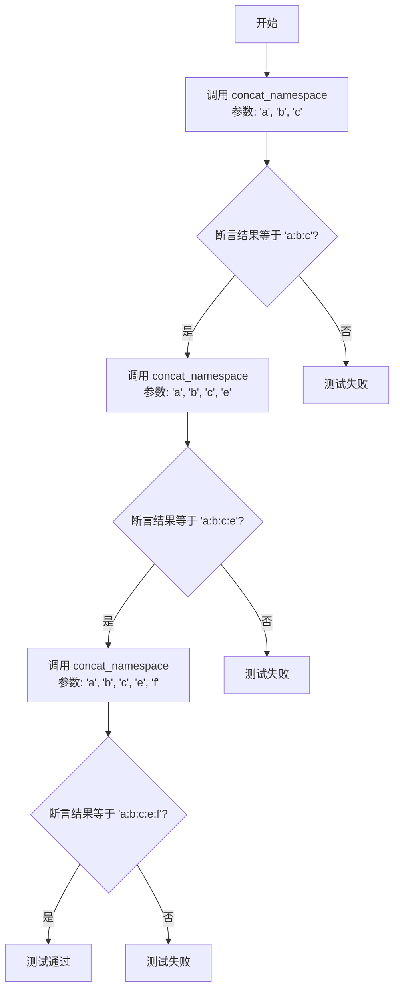

#### 带注释源码

```python
def test_concat_namespace(self):
    # 测试 concat_namespace 函数，验证其能够正确连接三个字符串参数
    assert concat_namespace("a", "b", "c") == "a:b:c"
    # 测试 concat_namespace 函数，验证其能够正确连接四个字符串参数
    assert concat_namespace("a", "b", "c", "e") == "a:b:c:e"
    # 测试 concat_namespace 函数，验证其能够正确连接五个字符串参数
    assert concat_namespace("a", "b", "c", "e", "f") == "a:b:c:e:f"
```

### `TestGetProjectRoot.test_split_namespace`

这是一个单元测试方法，用于测试 `split_namespace` 函数。它通过参数化测试验证函数是否能正确地将给定的命名空间字符串按照指定的分隔符（默认为冒号 `:`）分割成列表，并且可以通过 `maxsplit` 参数控制分割的最大次数。

参数：

- `val`：`str`，待分割的命名空间字符串。
- `want`：`list`，期望的分割结果列表。

返回值：`None`，这是一个测试方法，不返回任何值，而是通过断言（`assert`）来验证测试结果。

#### 流程图

```mermaid
flowchart TD
    A[开始测试] --> B[调用 split_namespace(val, maxsplit=-1)]
    B --> C{结果 res 是否等于 want?}
    C -->|是| D[测试通过]
    C -->|否| E[测试失败，抛出 AssertionError]
    D --> F[结束]
    E --> F
```

#### 带注释源码

```python
    @pytest.mark.parametrize(
        ("val", "want"),
        [
            (
                "tests/metagpt/test_role.py:test_react:Input:subscription",
                ["tests/metagpt/test_role.py", "test_react", "Input", "subscription"],
            ),
            (
                "tests/metagpt/test_role.py:test_react:Input:goal",
                ["tests/metagpt/test_role.py", "test_react", "Input", "goal"],
            ),
        ],
    )
    def test_split_namespace(self, val, want):
        # 调用被测试的 split_namespace 函数，使用默认分隔符和 maxsplit=-1（全部分割）
        res = split_namespace(val, maxsplit=-1)
        # 断言分割结果与期望值一致
        assert res == want
```

### `TestGetProjectRoot.test_read_json_file`

这是一个单元测试方法，用于测试 `read_json_file` 函数的功能。它验证了函数在三种不同场景下的行为：成功读取有效的 JSON 文件、处理不存在的文件路径以及处理非 JSON 格式的文件。

参数：
-  `self`：`TestGetProjectRoot`，测试类实例的引用，用于访问类属性和方法。

返回值：`None`，单元测试方法通常不返回值，而是通过断言（`assert`）来验证测试结果。

#### 流程图

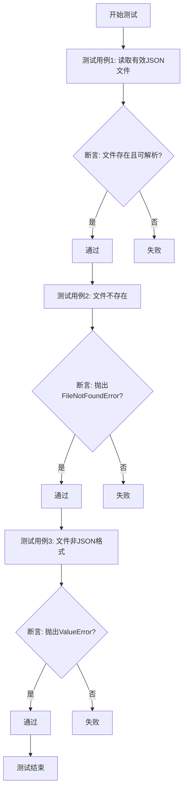

#### 带注释源码

```python
def test_read_json_file(self):
    # 测试用例1: 验证函数能够成功读取并解析一个已知存在的、格式正确的JSON文件。
    # 使用相对路径定位到项目数据目录下的一个具体JSON文件。
    # `assert`语句用于验证函数调用没有抛出异常，并返回了非空结果（在布尔上下文中为True）。
    assert read_json_file(str(Path(__file__).parent / "../../data/ut_writer/yft_swaggerApi.json"), encoding="utf-8")

    # 测试用例2: 验证当提供一个不存在的文件路径时，函数会抛出`FileNotFoundError`异常。
    # `pytest.raises`上下文管理器用于捕获并断言预期的异常。
    with pytest.raises(FileNotFoundError):
        read_json_file("not_exists_file", encoding="utf-8")

    # 测试用例3: 验证当读取一个非JSON格式的文件（此处是Python源文件自身）时，函数会抛出`ValueError`异常。
    # 这测试了JSON解析错误的情况。
    with pytest.raises(ValueError):
        read_json_file(__file__, encoding="utf-8")
```

### `TestGetProjectRoot.test_import_class_inst`

这是一个单元测试方法，用于测试 `metagpt.utils.common.import_class_inst` 函数的功能。该函数根据给定的模块路径和类名动态导入并实例化一个类。此测试验证了该函数能够正确导入 `metagpt.actions.run_code.RunCode` 类，并使用指定的参数 `name="X"` 成功创建其实例，最后断言实例的 `name` 属性值为 `"X"`。

参数：
-  `self`：`TestGetProjectRoot`，当前测试类的实例，用于访问类方法和属性。

返回值：`None`，这是一个单元测试方法，不返回任何值，其目的是通过断言来验证代码行为。

#### 流程图

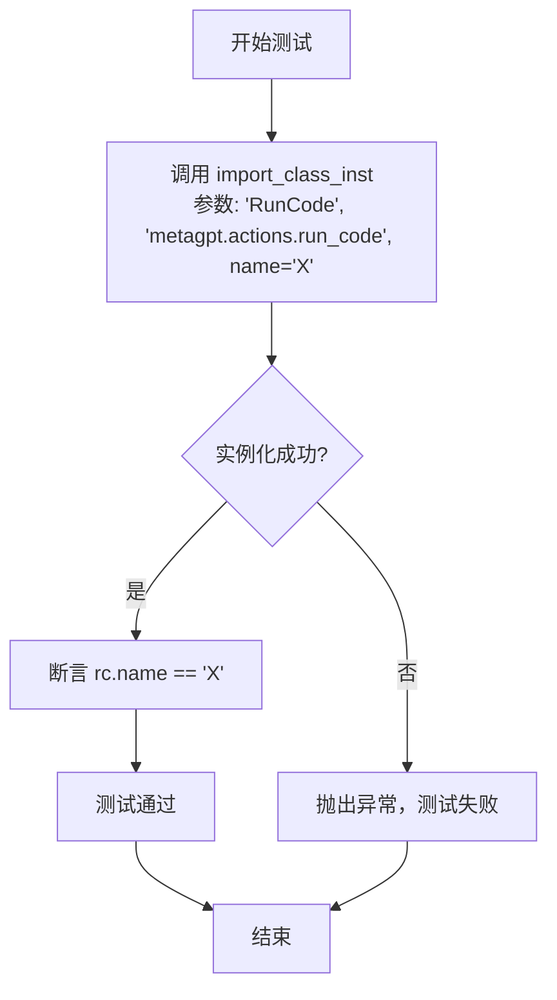

#### 带注释源码

```python
def test_import_class_inst(self):
    # 调用 import_class_inst 函数，动态导入并实例化 'metagpt.actions.run_code' 模块中的 'RunCode' 类。
    # 传入参数 name='X' 用于初始化实例。
    rc = import_class_inst("RunCode", "metagpt.actions.run_code", name="X")
    # 断言：验证实例化对象的 name 属性是否等于 'X'，以确认实例化过程正确且参数传递成功。
    assert rc.name == "X"
```

### `TestGetProjectRoot.test_read_file_block`

这是一个单元测试方法，用于测试 `read_file_block` 函数的功能。它通过指定文件名、起始行号和结束行号，验证该函数能否正确地从文件中读取指定的代码块。

参数：

- `self`：`TestGetProjectRoot`，测试类实例的引用，用于访问类的方法和属性。
- 无其他显式参数。该方法使用 `__file__` 内置变量获取当前测试文件的路径，并硬编码了行号 `6` 作为测试参数。

返回值：`None`，这是一个单元测试方法，不返回任何值，而是通过 `assert` 语句来验证测试结果。

#### 流程图

```mermaid
flowchart TD
    A[开始测试] --> B[调用 read_file_block<br>传入 __file__, 6, 6]
    B --> C{读取文件第6行}
    C -->|成功| D[断言读取内容等于<br>“@File    : test_common.py\n”]
    D --> E[测试通过]
    C -->|失败| F[断言失败，测试不通过]
    F --> G[测试结束]
    E --> G
```

#### 带注释源码

```python
    @pytest.mark.asyncio  # 标记此测试为异步测试，以便 pytest-asyncio 插件能正确处理
    async def test_read_file_block(self):
        # 调用被测试的异步函数 read_file_block
        # 参数 filename: 当前测试文件的路径（__file__）
        # 参数 lineno: 起始行号，设置为 6
        # 参数 end_lineno: 结束行号，设置为 6，表示只读取第6行
        # 预期该函数返回文件第6行的内容
        assert await read_file_block(filename=__file__, lineno=6, end_lineno=6) == "@File    : test_common.py\n"
        # 使用 assert 语句验证函数返回值是否等于预期的字符串
        # 如果相等，测试通过；否则，测试失败
```

### `TestGetProjectRoot.test_read_write`

这是一个单元测试方法，用于测试异步文件读写功能。它创建一个临时文件，写入特定内容，然后读取该文件并验证内容是否一致，最后清理临时文件。

参数：

-  `self`：`TestGetProjectRoot`，当前测试类的实例，用于访问类方法和属性。
-  无其他显式参数。

返回值：`None`，这是一个测试方法，不返回任何值，而是通过断言（`assert`）来验证测试结果。

#### 流程图

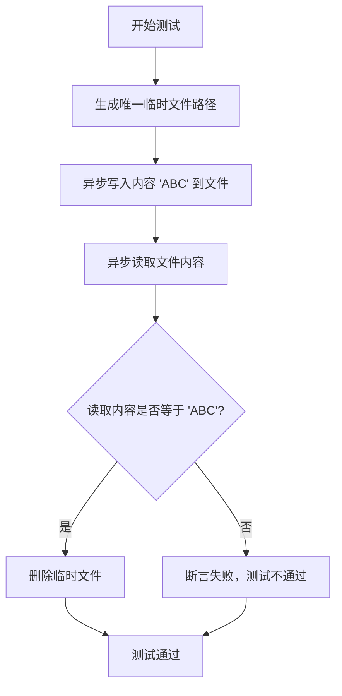

#### 带注释源码

```python
    @pytest.mark.asyncio  # 标记此测试方法为异步测试
    async def test_read_write(self):
        # 构造一个唯一的临时文件路径，位于项目workspace/unittest目录下的随机子目录中
        pathname = Path(__file__).parent / f"../../../workspace/unittest/{uuid.uuid4().hex}" / "test.tmp"
        # 异步调用awrite函数，将字符串"ABC"写入到指定路径的文件中
        await awrite(pathname, "ABC")
        # 异步调用aread函数，从刚写入的文件中读取全部内容
        data = await aread(pathname)
        # 使用断言验证读取到的数据是否等于最初写入的"ABC"
        assert data == "ABC"
        # 测试完成后，删除临时文件，missing_ok=True表示如果文件不存在也不报错
        pathname.unlink(missing_ok=True)
```

### `TestGetProjectRoot.test_read_write_error_charset`

这是一个单元测试方法，用于测试`awrite`和`aread`函数在写入和读取包含特殊字符（特别是中文字符）的文件时的正确性。它验证了在不同编码（如默认的UTF-8和指定的GB2312）下，文件内容的写入和读取是否保持一致。

参数：

-  `self`：`TestGetProjectRoot`，测试类实例的引用，用于访问类属性和方法。
-  无其他显式参数。

返回值：`None`，这是一个测试方法，不返回任何值，通过断言（`assert`）来验证测试结果。

#### 流程图

```mermaid
flowchart TD
    A[开始测试] --> B[生成唯一临时文件路径]
    B --> C[写入内容<br>（含中文字符和特殊符号）]
    C --> D[读取文件内容]
    D --> E{断言：读取内容 == 原始内容？}
    E -->|是| F[写入新内容<br>（指定GB2312编码）]
    F --> G[以UTF-8编码读取文件]
    G --> H{断言：读取内容 == 原始内容？}
    H -->|是| I[测试通过]
    E -->|否| J[测试失败]
    H -->|否| J
```

#### 带注释源码

```python
    @pytest.mark.asyncio
    async def test_read_write_error_charset(self):
        # 步骤1：生成一个唯一的临时文件路径，用于测试，避免与其他测试冲突。
        pathname = Path(__file__).parent / f"../../../workspace/unittest/{uuid.uuid4().hex}" / "test.txt"
        # 步骤2：定义测试内容，包含中文字符、英文字母、数字和一个特殊Unicode箭头符号。
        content = "中国abc123\u27f6"
        # 步骤3：调用异步写入函数`awrite`，将内容写入文件。使用默认编码（UTF-8）。
        await awrite(filename=pathname, data=content)
        # 步骤4：调用异步读取函数`aread`，从文件中读取内容。使用默认编码（UTF-8）。
        data = await aread(filename=pathname)
        # 步骤5：断言读取到的内容与原始写入内容完全一致，验证UTF-8编码下的读写正确性。
        assert data == content

        # 步骤6：定义新的测试内容，这是一段关于GB18030字符集的中文描述。
        content = "GB18030 是中国国家标准局发布的新一代中文字符集标准，是 GBK 的升级版，支持更广泛的字符范围。"
        # 步骤7：再次调用`awrite`，但这次显式指定使用`gb2312`编码写入文件。
        await awrite(filename=pathname, data=content, encoding="gb2312")
        # 步骤8：调用`aread`读取文件，但这次指定使用`utf-8`编码进行读取。
        # 注意：这里存在一个潜在的编码不匹配问题。文件以GB2312写入，但尝试以UTF-8读取。
        # 在标准情况下，这会导致解码错误（如UnicodeDecodeError）。然而，此处的断言期望读取成功且内容一致。
        # 这可能意味着测试环境、`awrite`/`aread`函数的实现，或者文件系统具有某种自动编码处理或转换机制。
        # 这是一个需要关注的点，可能表明测试逻辑或函数行为存在隐含假设。
        data = await aread(filename=pathname, encoding="utf-8")
        # 步骤9：断言以UTF-8读取的内容与原始（GB2312编码写入的）内容一致。
        # 这个断言在编码不匹配的典型场景下很可能失败。它的存在可能用于测试错误处理，或者依赖于特定的函数实现细节。
        assert data == content
```

## 关键组件

### `metagpt.utils.common` 工具函数集

提供了一系列用于文件I/O、路径处理、字符串解析、模块导入、系统检查等通用功能的辅助函数，是支撑MetaGPT项目其他模块运行的基础工具库。

### `OutputParser` 数据解析器

用于解析特定格式的文本数据（如Markdown），提取关键信息，例如从文档中解析出章节标题或待办事项列表。

### `NoMoneyException` 自定义异常

一个自定义的异常类，用于在特定业务逻辑（如资金不足）中抛出明确的错误信息。

### `TutorialAssistant` 教程助手角色

一个具体的角色类，用于演示和测试`any_to_str`和`any_to_str_set`函数如何处理类及其实例的字符串表示。

### `RunCode` 运行动作

一个具体的动作类，同样用于演示和测试`any_to_str`和`any_to_str_set`函数，以及`import_class_inst`函数的动态导入功能。

### `Message` 消息模型

一个数据模型类，用于在测试中作为参数传递，验证工具函数对复杂对象的处理能力。

### `BaseModel` 数据验证基类

来自Pydantic库，用于在测试用例中定义结构化的输入数据，确保测试数据的类型安全和清晰性。

### `pytest` 测试框架

用于组织和运行所有单元测试，通过参数化测试、异步测试等功能，全面验证各个工具函数的正确性和鲁棒性。

## 问题及建议


### 已知问题

-   **测试用例依赖外部文件路径**：`test_parse_data_exception` 和 `test_read_json_file` 等测试用例依赖于项目根目录下的 `data/` 文件夹中的特定文件。如果这些文件被移动、重命名或删除，测试将失败，降低了测试的健壮性和可移植性。
-   **平台特定测试逻辑不严谨**：`test_check_cmd_exists` 测试用例中，通过 `platform.system()` 判断当前平台，但测试数据中仅包含 `linux` 和 `windows` 两种平台。在 macOS 或其他平台上运行此测试时，所有测试条目都会因为平台不匹配而断言 `result != 0`，这可能导致测试结果不准确或产生误导。
-   **异常测试断言过于宽泛**：`test_print_members` 测试用例使用 `pytest.raises(Exception)` 来捕获异常，但 `Exception` 是所有非退出异常的基类。这导致测试无法精确验证是否抛出了预期的特定异常（例如 `AttributeError` 或 `ImportError`），降低了测试的精确度。
-   **临时文件清理可能不彻底**：`test_read_write` 和 `test_read_write_error_charset` 测试用例中，使用 `uuid.uuid4().hex` 创建了唯一的临时目录和文件，并在测试结束后尝试删除文件。然而，代码只删除了文件，没有删除其父目录（`workspace/unittest/{uuid}/`），这可能导致测试运行后残留大量空目录，长期积累会浪费磁盘空间。
-   **硬编码的测试数据路径**：多个测试用例（如 `test_parse_data_exception`）使用 `Path(__file__).parent.parent.parent / “data/...”` 来构造文件路径。这种硬编码方式使得测试代码与项目目录结构紧密耦合，如果项目结构发生变化，需要修改多处测试代码。

### 优化建议

-   **使用测试固件管理测试数据**：建议使用 `pytest` 的 `fixture` 机制来管理测试所需的外部文件。可以将文件路径或文件内容定义为固件，提高代码复用性，并使测试用例更清晰。对于必须存在的文件，可以在固件中进行存在性检查。
-   **改进平台兼容性测试**：重构 `test_check_cmd_exists` 测试。可以将其拆分为两个测试：一个测试当前平台下已知存在的命令（如 `‘ls‘` 在 Unix-like 系统，`‘dir‘` 在 Windows），另一个测试一个肯定不存在的命令。或者，使用 `pytest.mark.skipif` 根据平台跳过不相关的测试用例，使测试逻辑更清晰。
-   **精确化异常断言**：修改 `test_print_members` 测试用例，将 `pytest.raises(Exception)` 替换为更具体的异常类型，例如 `pytest.raises((AttributeError, ImportError))` 或根据 `print_members` 函数实际可能抛出的异常来确定。这能使测试意图更明确，并避免意外通过其他类型的异常。
-   **确保测试环境完全清理**：在创建临时文件的测试用例中，应确保在测试结束后清理所有创建的临时资源。可以使用 Python 标准库的 `tempfile.TemporaryDirectory` 上下文管理器来创建临时目录，这样在退出上下文时会自动清理整个目录及其内容，避免残留。
-   **抽象化路径构造逻辑**：考虑将项目根目录、测试数据目录等常用路径定义为模块级常量或通过固件提供。例如，可以定义一个 `DATA_ROOT = Path(__file__).parent.parent.parent / “data”`，然后在测试用例中引用 `DATA_ROOT / “output_parser” / filename`。这样，当路径需要调整时，只需修改一处。
-   **增加异步测试的覆盖率**：当前测试覆盖了 `aread`, `awrite`, `read_file_block` 等异步函数，但可以进一步考虑测试这些函数在并发、大文件、网络异常等边界条件下的行为，以提高代码鲁棒性。
-   **补充缺失的测试用例**：例如，`extract_and_encode_images` 函数目前只有一个测试用例（检查不存在的文件）。应增加测试用例来验证其对于存在的图片文件、不同格式图片、包含多个图片路径的文本等场景的处理是否正确。


## 其它


### 设计目标与约束

本模块是 `metagpt.utils.common` 的单元测试文件，其核心设计目标是：
1.  **功能验证**：确保 `common` 模块中各个工具函数（如 `any_to_str`, `check_cmd_exists`, `aread`, `awrite` 等）的行为符合预期，覆盖正常流程、边界条件和异常情况。
2.  **代码质量**：通过单元测试保障代码的健壮性和可靠性，防止后续代码变更引入回归错误。
3.  **跨平台兼容性**：部分测试（如 `test_check_cmd_exists`）需要考虑不同操作系统（Windows/Linux）下的行为差异。
4.  **异步支持**：对异步函数（如 `aread`, `awrite`, `read_file_block`）进行正确的异步测试。
5.  **可维护性**：测试用例应清晰、独立，并使用参数化测试（`@pytest.mark.parametrize`）来减少重复代码，提高测试覆盖率和可读性。

主要约束包括：
*   测试不应依赖外部网络或特定环境配置（如特定的文件路径、服务），临时文件应在测试后清理。
*   测试执行速度应尽可能快，避免不必要的 I/O 或计算。
*   测试代码本身应遵循项目约定的代码风格和结构。

### 错误处理与异常设计

测试文件本身不直接处理业务逻辑错误，而是验证被测试函数（`common` 模块中的函数）的错误处理机制是否正确。测试中体现的错误处理设计包括：
1.  **异常断言**：使用 `pytest.raises` 上下文管理器来验证函数在特定输入下是否会抛出预期的异常（如 `FileNotFoundError`, `ValueError`）。例如，`test_read_json_file` 测试了读取不存在的文件或非 JSON 文件时的异常抛出。
2.  **返回值验证**：对于可能返回错误码或特殊值的函数（如 `check_cmd_exists`），测试验证其在特定平台下返回正确的值（0 表示存在，非 0 表示不存在）。
3.  **资源清理**：在涉及文件操作的测试（如 `test_read_write`）中，使用 `uuid` 生成唯一临时路径，并在测试结束后通过 `unlink(missing_ok=True)` 清理临时文件，确保测试不会留下垃圾数据，也避免了因文件已存在导致的测试失败。
4.  **异步错误传播**：异步测试方法（标记为 `@pytest.mark.asyncio`）确保异步函数中的异常能正确抛出并被测试框架捕获。

### 数据流与状态机

本测试文件不涉及复杂的状态机。其数据流主要体现在：
1.  **测试数据准备**：通过内联定义（如 `Input` Pydantic 模型）、参数化装饰器提供多组输入/预期输出数据，或动态生成临时文件内容。
2.  **函数调用与验证**：测试用例调用 `common` 模块中的目标函数，传入准备好的输入数据。
3.  **结果断言**：将函数返回的结果与预期的结果进行比较（使用 `assert` 语句）。断言涵盖了字符串相等性、集合相等性、布尔值、异常匹配、文件内容一致性等。
4.  **测试隔离**：每个测试方法（`test_*`）都是独立的，通过 `pytest` 框架执行，互不干扰。类级别的 `setup`/`teardown` 在本文件中未使用，但 `test_get_root_exception` 通过 `change_etc_dir` 临时改变了工作目录，测试后依赖 `pytest` 的测试隔离机制恢复。

### 外部依赖与接口契约

测试文件的外部依赖和接口契约如下：
1.  **被测试模块**：`metagpt.utils.common`。测试文件严格依赖于该模块公开的函数接口（函数名、参数、返回值类型）。任何对这些接口的破坏性变更都将导致测试失败。
2.  **测试框架**：`pytest`。依赖其测试发现、用例执行、参数化、异步支持和断言功能。
3.  **辅助库**：
    *   `pydantic`：用于在测试方法内结构化地定义测试输入和预期输出，提高可读性和类型安全。
    *   `importlib`：用于动态导入模块，支持 `print_members` 函数的测试。
    *   `platform`：用于判断当前操作系统，以验证 `check_cmd_exists` 的跨平台行为。
    *   `uuid`：用于生成唯一的临时文件名，避免并发测试冲突。
    *   `pathlib.Path`：用于跨平台、面向对象的文件路径操作。
4.  **系统命令**：`test_check_cmd_exists` 间接依赖于系统环境变量 `PATH` 中是否存在 `cat`, `ls`, `mspaint` 等命令。
5.  **文件系统**：多个测试用例（如 `test_read_json_file`, `test_read_write`, `test_parse_data_exception`）依赖于项目目录结构下特定的数据文件（位于 `../data/` 等相对路径）。这构成了测试环境的一个隐式契约：这些数据文件必须存在且内容符合预期。
6.  **Python 版本**：`test_require_python_version` 测试了与 Python 解释器版本的隐式契约。

### 安全考虑

1.  **路径遍历**：测试中使用的文件路径多为基于 `__file__` 构造的相对路径或临时路径，降低了路径遍历攻击的风险。`extract_image_paths` 函数的测试仅验证其正则匹配功能，未涉及实际文件访问。
2.  **临时文件安全**：使用 `uuid.uuid4().hex` 生成不可预测的临时目录名，降低了冲突和恶意预测的风险。测试后主动删除临时文件。
3.  **代码执行**：`test_import_class_inst` 动态导入了 `RunCode` 类并实例化。虽然此测试在受控环境下是安全的，但需要确保生产代码中类似功能（如果存在）对输入的模块和类名有严格的校验，防止任意代码执行。
4.  **异常信息泄露**：测试验证了异常被正确抛出，但未深入测试异常信息是否包含敏感数据。这是被测试函数 (`common`模块) 需要负责的。
5.  **异步安全**：异步 I/O 操作（`aread`/`awrite`）的测试确保了在并发环境下文件读写的正确性（通过内容断言），但未进行高并发压力测试。

### 性能考量

1.  **测试执行速度**：测试用例以单元测试为主，不涉及集成或端到端测试，整体执行速度快。文件 I/O 操作仅限于必要的小文件读写。
2.  **参数化测试**：大量使用 `@pytest.mark.parametrize`，使得多组数据能在一个测试函数中运行，减少了测试框架启动和清理的开销，提高了测试效率。
3.  **资源开销**：每个测试方法创建的资源（如临时文件）都在该方法内或通过 `pytest` 的 fixture 机制进行清理，避免了内存或磁盘空间的累积消耗。
4.  **被测试函数性能**：本测试文件主要验证功能正确性，而非 `common` 模块中各个函数的性能。性能测试（如压力测试、基准测试）通常是独立的测试活动。
5.  **网络与外部依赖**：测试不依赖网络服务或外部 API，避免了网络延迟带来的不确定性，保证了测试的稳定性和速度。

### 部署与运维

1.  **测试作为CI/CD的一部分**：此文件应被集成到项目的持续集成（CI）流水线中，每次代码提交或合并请求时自动运行，确保 `common` 工具模块的修改不会引入缺陷。
2.  **测试环境一致性**：由于部分测试（`check_cmd_exists`, 文件路径）与操作系统相关，CI/CD 环境需要提供与测试用例预期一致的环境（如 Linux 环境应有 `cat`, `ls` 命令），或通过 mocking 技术隔离这些依赖。
3.  **测试数据管理**：测试依赖的静态数据文件（如 `../data/output_parser/1.md`）需要随代码库一同维护，确保其内容与测试断言一致。这些文件是测试套件的一部分。
4.  **临时目录管理**：测试中写入的临时文件位于 `workspace/unittest/` 目录下。在运维层面，可能需要定期清理此目录，或确保 CI 环境有足够的磁盘空间。测试自身的清理逻辑是可靠的。
5.  **测试报告**：通过 `pytest` 运行可以生成多种格式的测试报告（如 JUnit XML），便于集成到 CI 系统进行结果分析和通知。
6.  **测试可配置性**：测试本身没有外部配置文件。其行为由代码内嵌的测试数据和 `pytest` 命令行参数控制（如 `-s` 输出打印信息，`-v` 详细输出）。
7.  **与代码覆盖率工具集成**：此测试文件应与覆盖率工具（如 `pytest-cov`）配合使用，以衡量对 `metagpt.utils.common` 模块的代码覆盖率，并指导补充测试用例。


    