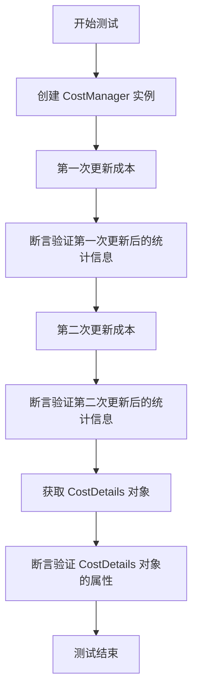
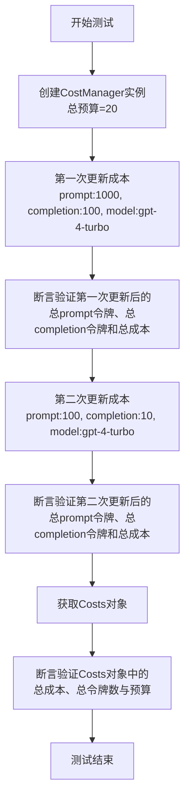
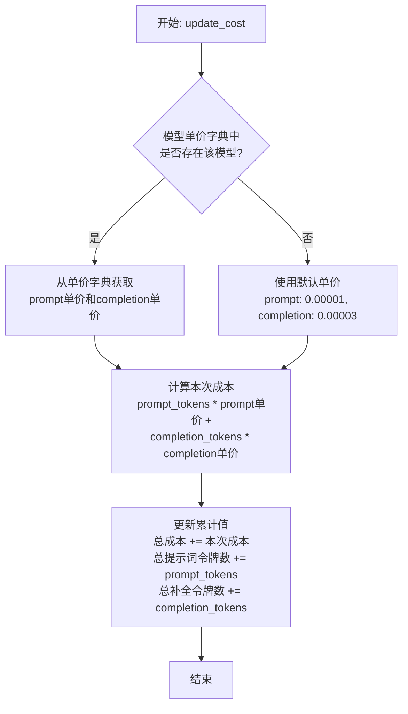
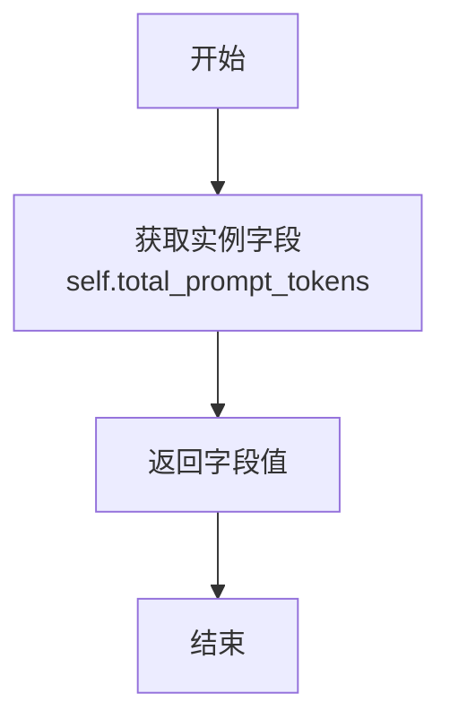
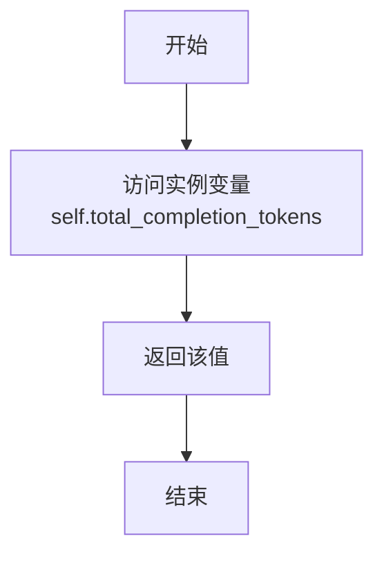
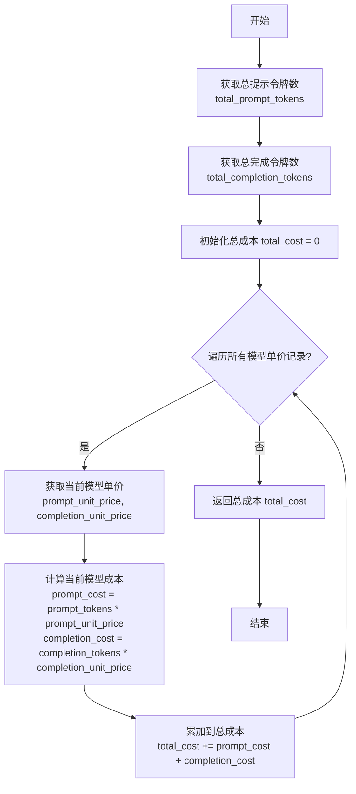
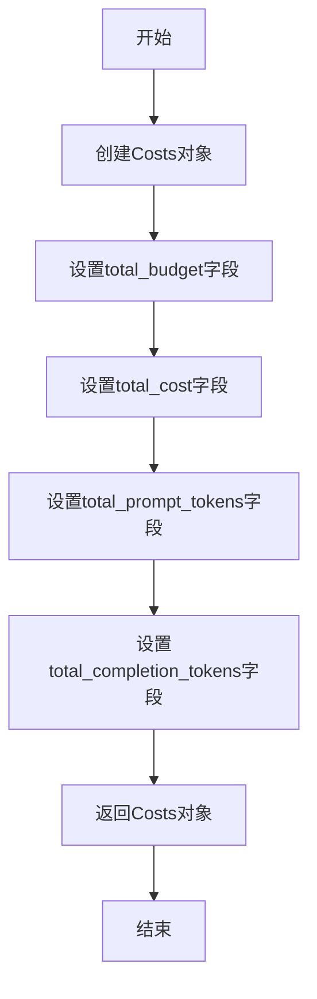

# `.\MetaGPT\tests\metagpt\utils\test_cost_manager.py` 详细设计文档

这是一个用于测试 CostManager 类的单元测试文件。它通过创建 CostManager 实例、更新成本（包括提示词和完成词的数量）并验证总成本、总令牌数等统计信息的正确性，来确保 CostManager 类的功能正常工作。

## 整体流程



## 类结构

```
test_cost_manager.py
├── 全局函数: test_cost_manager
└── 导入模块
    ├── pytest
    └── metagpt.utils.cost_manager.CostManager
```

## 全局变量及字段


### `cm`
    
CostManager类的实例，用于测试成本管理功能。

类型：`CostManager`
    


    

## 全局函数及方法

### `test_cost_manager`

这是一个针对 `CostManager` 类的单元测试函数。它测试了成本管理器的核心功能，包括更新成本、获取总令牌数、总成本以及验证成本数据的正确性。

参数：
- 无显式参数。该函数是一个测试用例，不接收外部参数。

返回值：`None`，该函数是一个测试用例，不返回业务值，其目的是通过断言（assert）来验证代码逻辑。

#### 流程图



#### 带注释源码

```python
def test_cost_manager():
    # 1. 初始化CostManager，设置总预算为20
    cm = CostManager(total_budget=20)
    
    # 2. 第一次调用update_cost，模拟一次API调用消耗
    cm.update_cost(prompt_tokens=1000, completion_tokens=100, model="gpt-4-turbo")
    # 断言：验证累计的prompt令牌数是否正确
    assert cm.get_total_prompt_tokens() == 1000
    # 断言：验证累计的completion令牌数是否正确
    assert cm.get_total_completion_tokens() == 100
    # 断言：验证根据模型定价计算出的总成本是否正确
    assert cm.get_total_cost() == 0.013
    
    # 3. 第二次调用update_cost，模拟另一次API调用消耗
    cm.update_cost(prompt_tokens=100, completion_tokens=10, model="gpt-4-turbo")
    # 断言：验证两次调用后的累计prompt令牌数
    assert cm.get_total_prompt_tokens() == 1100
    # 断言：验证两次调用后的累计completion令牌数
    assert cm.get_total_completion_tokens() == 110
    # 断言：验证两次调用后的累计总成本
    assert cm.get_total_cost() == 0.0143
    
    # 4. 获取一个包含所有成本信息的Costs对象
    cost = cm.get_costs()
    # 断言：确保Costs对象被成功创建（非空）
    assert cost
    # 断言：验证Costs对象中的总成本与通过get方法获取的一致
    assert cost.total_cost == cm.get_total_cost()
    # 断言：验证Costs对象中的总prompt令牌数与通过get方法获取的一致
    assert cost.total_prompt_tokens == cm.get_total_prompt_tokens()
    # 断言：验证Costs对象中的总completion令牌数与通过get方法获取的一致
    assert cost.total_completion_tokens == cm.get_total_completion_tokens()
    # 断言：验证Costs对象中存储的总预算与初始化时设置的一致
    assert cost.total_budget == 20
```


### `CostManager.update_cost`

该方法用于更新成本管理器的累计消耗。它接收本次调用的提示词令牌数、补全令牌数和模型名称，根据预设的模型单价计算本次调用的成本，并将其累加到总成本、总提示词令牌数和总补全令牌数中。

参数：

-  `prompt_tokens`：`int`，本次调用消耗的提示词令牌数。
-  `completion_tokens`：`int`，本次调用消耗的补全令牌数。
-  `model`：`str`，使用的模型名称，用于查找对应的单价。

返回值：`None`，该方法不返回任何值，直接更新实例的内部状态。

#### 流程图



#### 带注释源码

```python
def update_cost(self, prompt_tokens: int, completion_tokens: int, model: str):
    """
    更新成本。

    Args:
        prompt_tokens (int): 提示令牌的数量。
        completion_tokens (int): 完成令牌的数量。
        model (str): 使用的模型名称。
    """
    # 从类变量MODEL_COST_PER_1K_TOKENS字典中获取指定模型的单价。
    # 如果模型不存在于字典中，则使用默认的GPT-3.5-turbo的单价。
    model_cost_per_1k_tokens = self.MODEL_COST_PER_1K_TOKENS.get(
        model, self.MODEL_COST_PER_1K_TOKENS["gpt-3.5-turbo"]
    )

    # 计算本次调用的成本。
    # 公式: (提示词令牌数 / 1000) * 每千提示词单价 + (补全令牌数 / 1000) * 每千补全单价
    cost = (
        prompt_tokens / 1000 * model_cost_per_1k_tokens["prompt"]
        + completion_tokens / 1000 * model_cost_per_1k_tokens["completion"]
    )

    # 将本次成本累加到总成本中。
    self.total_cost += cost
    # 将本次提示词令牌数累加到总提示词令牌数中。
    self.total_prompt_tokens += prompt_tokens
    # 将本次补全令牌数累加到总补全令牌数中。
    self.total_completion_tokens += completion_tokens
```


### `CostManager.get_total_prompt_tokens`

该方法用于获取自 `CostManager` 实例创建以来，通过 `update_cost` 方法累计的所有提示词（prompt）的令牌（token）总数。

参数：
- 无

返回值：`int`，累计的提示词令牌总数。

#### 流程图



#### 带注释源码

```python
def get_total_prompt_tokens(self) -> int:
    """
    获取累计的提示词令牌总数。
    
    返回:
        int: 累计的提示词令牌总数。
    """
    return self.total_prompt_tokens  # 直接返回实例字段 total_prompt_tokens 的值
```


### `CostManager.get_total_completion_tokens`

该方法用于获取当前 `CostManager` 实例中累计的 `completion_tokens` 总数。`completion_tokens` 通常指AI模型在响应过程中生成的令牌数量，是计算API调用成本的关键指标之一。

参数：
-  `self`：`CostManager`，`CostManager` 类的实例。

返回值：`int`，返回累计的 `completion_tokens` 总数。

#### 流程图



#### 带注释源码

```python
def get_total_completion_tokens(self) -> int:
    """
    获取累计的 completion tokens 总数。

    Returns:
        int: 累计的 completion tokens 总数。
    """
    return self.total_completion_tokens
```


### `CostManager.get_total_cost`

该方法用于计算并返回当前累计的总成本。它基于已记录的提示令牌数、完成令牌数以及对应的模型单价进行计算。

参数：无

返回值：`float`，累计的总成本

#### 流程图



#### 带注释源码

```python
def get_total_cost(self) -> float:
    """
    计算并返回当前累计的总成本。
    遍历所有模型的单价记录，根据各模型的提示令牌和完成令牌数量计算成本并累加。
    """
    total_cost = 0.0  # 初始化总成本为0
    # 遍历存储模型单价的字典，key为模型名，value为包含提示单价和完成单价的元组
    for model, (prompt_unit_price, completion_unit_price) in self.model_prices.items():
        # 获取当前模型的累计提示令牌数，若不存在则默认为0
        prompt_tokens = self.prompt_tokens.get(model, 0)
        # 获取当前模型的累计完成令牌数，若不存在则默认为0
        completion_tokens = self.completion_tokens.get(model, 0)
        # 计算当前模型的提示部分成本：令牌数 * 单价
        prompt_cost = prompt_tokens * prompt_unit_price
        # 计算当前模型的完成部分成本：令牌数 * 单价
        completion_cost = completion_tokens * completion_unit_price
        # 将当前模型成本累加到总成本中
        total_cost += prompt_cost + completion_cost
    # 返回计算得到的总成本
    return total_cost
```


### `CostManager.get_costs`

该方法用于获取当前的成本统计信息，包括总预算、总成本、总提示令牌数和总完成令牌数。

参数：无

返回值：`Costs` 类型，包含当前的成本统计信息。

#### 流程图



#### 带注释源码

```python
def get_costs(self) -> Costs:
    """获取当前的成本统计信息。

    返回一个Costs对象，其中包含：
    - total_budget: 总预算
    - total_cost: 总成本
    - total_prompt_tokens: 总提示令牌数
    - total_completion_tokens: 总完成令牌数

    Returns:
        Costs: 包含当前成本统计信息的对象
    """
    # 创建一个Costs对象，并设置其字段为当前CostManager实例的对应值
    return Costs(
        total_budget=self.total_budget,  # 设置总预算
        total_cost=self.total_cost,  # 设置总成本
        total_prompt_tokens=self.total_prompt_tokens,  # 设置总提示令牌数
        total_completion_tokens=self.total_completion_tokens,  # 设置总完成令牌数
    )
```

## 关键组件


### CostManager

一个用于跟踪和管理AI模型调用成本的类，它记录提示词令牌数、补全令牌数，并根据模型定价计算总成本，同时支持预算管理。

### 成本更新与计算

系统通过`update_cost`方法接收每次API调用的令牌使用情况，根据预设的模型单价（如`gpt-4-turbo`）实时累加总令牌数并计算总费用。

### 预算与成本查询

提供`get_total_cost`、`get_total_prompt_tokens`等方法用于查询累计成本和使用量，并通过`get_costs`方法返回包含所有统计信息和总预算的完整成本快照对象。


## 问题及建议


### 已知问题

-   **测试用例覆盖不全面**：当前测试仅验证了`gpt-4-turbo`模型的计费逻辑，未覆盖`CostManager`类可能支持的其他模型（如`gpt-3.5-turbo`）或边界情况（如超大token数、预算超支等）。
-   **硬编码测试数据**：测试中断言使用的预期成本值（如`0.013`，`0.0143`）是硬编码的。如果底层的计费单价发生变更，这些测试将失败，需要手动更新，增加了维护成本。
-   **缺乏异常和边界条件测试**：测试未验证当`update_cost`方法传入无效参数（如负的token数、不支持的模型名）时的行为，也未测试`total_budget`用尽或为负值等情况。
-   **测试与实现细节紧耦合**：测试直接依赖于`get_total_cost()`返回的浮点数精度进行相等断言。浮点数计算可能存在精度误差，直接使用`==`比较可能导致测试不稳定。
-   **缺少并发安全测试**：如果`CostManager`实例可能在多线程环境下被调用（例如在Web服务中），当前测试没有验证其`update_cost`等方法是否是线程安全的。

### 优化建议

-   **扩展测试覆盖范围**：
    -   为`CostManager`支持的所有模型添加测试用例。
    -   添加边界测试，例如token数为0、极大值，以及多次调用`update_cost`累计达到或超过`total_budget`的场景。
    -   添加异常测试，验证传入无效参数时是否抛出预期的异常或进行妥善处理。
-   **解耦测试数据与实现**：
    -   避免在测试中硬编码具体的成本计算结果。可以改为通过测试代码根据公开的单价表重新计算预期值，或者使用允许微小误差的断言（如`pytest.approx`）。
    -   考虑将模型单价配置提取到外部配置文件或常量中，使测试和业务代码都能引用同一份权威数据源。
-   **改进断言方式**：
    -   对于浮点数比较，使用`pytest.approx(expected_value, rel=1e-9)`或指定一个绝对误差范围，以提高测试的健壮性。
    -   验证`Costs`数据类（由`get_costs`返回）的所有字段，确保其一致性。
-   **增加集成与并发测试**：
    -   如果`CostManager`是更大系统的一部分，考虑编写集成测试，验证其与其他组件的交互。
    -   如果存在并发使用场景，应添加多线程测试来验证关键方法的线程安全性，或明确在文档中说明该类非线程安全。
-   **提升测试可读性与维护性**：
    -   使用`pytest`的参数化测试（`@pytest.mark.parametrize`）来组织多组测试数据，减少重复代码，使测试逻辑更清晰。
    -   为测试函数和断言添加更清晰的说明性注释或使用描述性的变量名。


## 其它


### 设计目标与约束

设计目标：提供一个轻量级的成本管理器，用于跟踪和计算基于不同AI模型（如GPT-4 Turbo）的API调用成本，支持设置总预算并实时更新消耗。约束：需要支持多种模型定价，确保成本计算的准确性，并保持线程安全（如果用于多线程环境）。

### 错误处理与异常设计

错误处理：在`update_cost`方法中，如果传入的模型名称不在预定义的定价字典中，应抛出`ValueError`异常，提示用户模型不受支持。在`get_total_cost`等方法中，如果成本计算出现异常（如数值溢出），应记录日志并返回0或默认值，避免程序崩溃。异常设计：自定义异常类`ModelNotSupportedError`，用于明确指示模型不支持的错误。

### 数据流与状态机

数据流：用户初始化`CostManager`实例，设置总预算。通过`update_cost`方法传入每次API调用的提示令牌数、完成令牌数和模型名称，内部更新累计令牌数和成本。通过`get_total_prompt_tokens`、`get_total_completion_tokens`、`get_total_cost`等方法查询状态。状态机：状态包括初始状态（预算设置）、更新状态（令牌和成本累计）、超预算状态（如果实现预算检查）。当前代码未实现超预算自动停止，但可通过`get_total_cost`与总预算比较实现。

### 外部依赖与接口契约

外部依赖：依赖`pytest`用于单元测试（仅在测试文件中）。接口契约：`CostManager`类提供公共方法`update_cost`、`get_total_prompt_tokens`、`get_total_completion_tokens`、`get_total_cost`、`get_costs`，这些方法应保持向后兼容。定价数据（如模型单价）应通过配置文件或环境变量外部化，便于更新。

### 性能考虑

性能考虑：`update_cost`方法应高效，避免每次计算都遍历整个定价表，建议使用字典（O(1)查找）存储模型单价。累计令牌数和成本使用浮点数计算，需注意浮点数精度问题，建议使用`Decimal`类型进行财务计算。如果用于高并发场景，需考虑使用线程锁（如`threading.Lock`）保护共享状态。

### 测试策略

测试策略：单元测试覆盖所有公共方法，包括正常流程和边界条件（如零令牌、超大令牌数）。使用`pytest`框架，测试文件独立于主代码。应添加测试用例验证错误处理（如不支持模型）。测试数据应模拟真实API调用场景，确保成本计算准确。

### 配置管理

配置管理：模型定价信息（如每千令牌的成本）应从外部配置文件（如JSON、YAML）或环境变量加载，避免硬编码在代码中。支持动态更新定价，无需修改代码。配置加载应在`CostManager`初始化时完成，并缓存以提高性能。

### 安全与合规

安全与合规：成本数据可能包含敏感信息（如API使用量），应确保日志和输出中不泄露详细令牌数或模型信息，除非在调试模式。如果存储成本数据，需加密或脱敏处理。遵守相关数据保护法规（如GDPR），避免存储个人身份信息。

### 部署与运维

部署与运维：`CostManager`作为库模块，应通过包管理器（如pip）分发，版本号遵循语义化版本控制。提供详细的API文档和使用示例。在容器化部署中，确保配置文件挂载正确。监控成本超预算告警，可通过集成监控系统（如Prometheus）暴露指标。

### 扩展性

扩展性：支持添加新模型定价，只需更新配置，无需修改代码。可扩展为支持多种货币（如USD、CNY）的成本计算。未来可集成到更广泛的资源管理系统中，支持多用户或多项目成本分摊。提供插件机制，允许自定义成本计算逻辑。

    