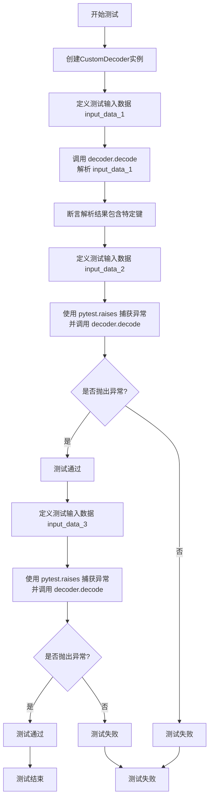
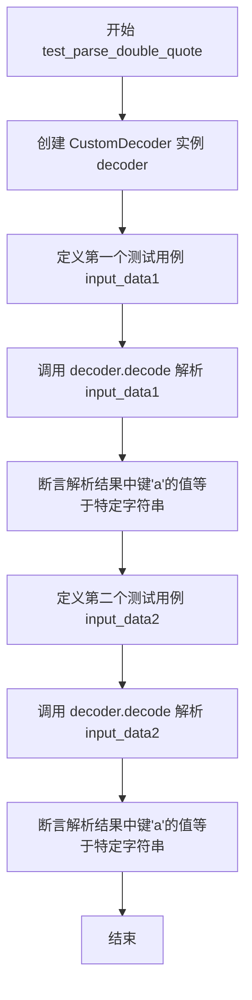
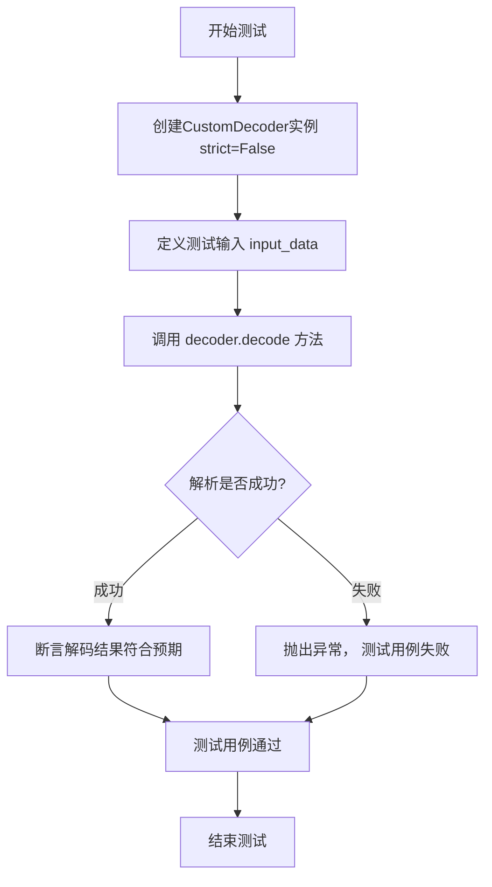
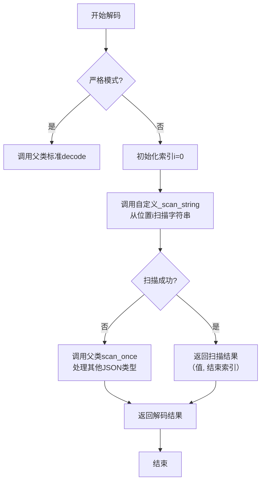

# `.\MetaGPT\tests\metagpt\utils\test_custom_decoder.py` 详细设计文档

该文件是一个单元测试文件，用于测试 `CustomDecoder` 类解析非标准 JSON 字符串的能力，特别是处理单引号、双引号、三引号字符串以及包含换行符的字符串。

## 整体流程

```mermaid
graph TD
    A[开始测试] --> B[创建CustomDecoder实例]
    B --> C[准备包含非标准引号的测试数据]
    C --> D[调用decoder.decode()方法]
    D --> E{解析是否成功?}
    E -- 是 --> F[断言验证解析结果]
    E -- 否 --> G[验证是否按预期抛出异常]
    F --> H[测试通过]
    G --> H
```

## 类结构

```
CustomDecoder (被测试类，来自metagpt.utils.custom_decoder)
├── 继承自json.JSONDecoder
└── 重写方法以支持非标准JSON语法

test_custom_decoder.py (测试文件)
├── test_parse_single_quote()
├── test_parse_double_quote()
├── test_parse_triple_double_quote()
└── test_parse_triple_single_quote()
```

## 全局变量及字段


    

## 全局函数及方法

### `test_parse_single_quote`

该函数是一个单元测试，用于验证 `CustomDecoder` 类解析包含单引号字符串的 JSON 数据的能力。它测试了多种边界情况，包括键或值中包含换行符的单引号字符串，并验证了解码器是否能正确处理这些情况或按预期抛出异常。

参数：
- 无显式参数。该函数是一个测试函数，不接收外部参数。

返回值：`None`，该函数是一个测试函数，其主要目的是通过断言（`assert`）或检查是否抛出异常来验证功能，不返回业务数据。

#### 流程图



#### 带注释源码

```python
def test_parse_single_quote():
    # 创建一个非严格模式的 CustomDecoder 实例，用于解析非标准JSON
    decoder = CustomDecoder(strict=False)
    
    # 测试用例1：键和值都包含单引号、双引号和换行符的复杂字符串
    input_data = """{'a"
    b':'"title": "Reach and engagement of campaigns",
            "x-axis": "Low Reach --> High Reach",
            "y-axis": "Low Engagement --> High Engagement",
            "quadrant-1": "We should expand",
            "quadrant-2": "Need to promote",
            "quadrant-3": "Re-evaluate",
            "quadrant-4": "May be improved",
            "Campaign: A": [0.3, 0.6],
            "Campaign B": [0.45, 0.23],
            "Campaign C": [0.57, 0.69],
            "Campaign D": [0.78, 0.34],
            "Campaign E": [0.40, 0.34],
            "Campaign F": [0.35, 0.78],
            "Our Target Product": [0.5, 0.6]
            '
        }
    """
    # 使用自定义解码器解析输入数据
    parsed_data = decoder.decode(input_data)
    # 断言解析后的字典中包含键 'a"\n    b'，验证解码器能正确处理包含换行和引号的键
    assert 'a"\n    b' in parsed_data

    # 测试用例2：值以双引号开头并包含换行符（非标准JSON，应抛出异常）
    input_data = """{
    'a': "
    b
"
}
"""
    # 使用 pytest.raises 上下文管理器来验证调用 decoder.decode 会抛出异常
    with pytest.raises(Exception):
        parsed_data = decoder.decode(input_data)

    # 测试用例3：值以单引号开头并包含换行符（非标准JSON，应抛出异常）
    input_data = """{
    'a': '
    b
'
}
"""
    # 同样验证此输入会抛出异常
    with pytest.raises(Exception):
        parsed_data = decoder.decode(input_data)
```

### `test_parse_double_quote`

该函数是 `CustomDecoder` 类的一个单元测试，用于验证自定义 JSON 解码器能否正确解析包含双引号字符串的 JSON 数据，特别是处理字符串中包含换行符的情况。它测试了两种场景：键和值使用双引号，以及值使用单引号但键使用双引号。

参数：

-  `decoder`：`CustomDecoder`，一个自定义的 JSON 解码器实例，用于解析非标准 JSON 字符串。
-  `input_data`：`str`，包含待解析 JSON 数据的字符串，用于测试解码器的功能。

返回值：`None`，该函数是一个单元测试，不返回任何值，通过断言（`assert`）来验证解码结果是否符合预期。

#### 流程图



#### 带注释源码

```python
def test_parse_double_quote():
    # 创建一个非严格模式的 CustomDecoder 实例，用于解析非标准 JSON
    decoder = CustomDecoder(strict=False)

    # 第一个测试用例：键和值都使用双引号，但值字符串内部包含换行符
    input_data = """{
    "a": "
    b
"
}
"""
    # 使用自定义解码器解析 JSON 字符串
    parsed_data = decoder.decode(input_data)
    # 断言：解析后的字典中，键 'a' 对应的值应该等于一个包含换行和空格的字符串
    assert parsed_data["a"] == "\n    b\n"

    # 第二个测试用例：键使用双引号，但值使用单引号（非标准 JSON）
    input_data = """{
    "a": '
    b
'
}
"""
    # 再次使用解码器解析
    parsed_data = decoder.decode(input_data)
    # 断言：解析后的字典中，键 'a' 对应的值应该同样等于一个包含换行和空格的字符串
    # 这验证了解码器能够将单引号字符串也正确识别并转换为标准字符串
    assert parsed_data["a"] == "\n    b\n"
```

### `test_parse_triple_double_quote`

该函数是 `CustomDecoder` 类的一个单元测试，用于验证解码器能否正确解析包含三引号（包括三双引号 `"""` 和三单引号 `'''`）的类JSON字符串。它通过创建解码器实例，传入特定的测试字符串，并断言解码后的结果是否符合预期，来测试解码器的健壮性和对非标准引号的处理能力。

参数：
-  `decoder`：`CustomDecoder`，一个非严格模式的 `CustomDecoder` 实例，用于解析非标准JSON字符串。
-  `input_data`：`str`，包含三引号的待解析字符串。

返回值：`None`，该函数为测试函数，不返回业务值，仅通过断言验证测试结果。

#### 流程图



#### 带注释源码

```python
def test_parse_triple_double_quote():
    # 创建一个非严格模式的CustomDecoder实例，用于解析非标准JSON
    decoder = CustomDecoder(strict=False)
    # 测试用例1：键使用三双引号，值使用普通双引号
    input_data = '{"""a""":"b"}'
    # 调用解码器的decode方法进行解析
    parsed_data = decoder.decode(input_data)
    # 断言解析后的字典中包含键“a”
    assert "a" in parsed_data

    # 测试用例2：键和值都使用三双引号
    input_data = '{"""a""":"""b"""}'
    parsed_data = decoder.decode(input_data)
    # 断言键“a”对应的值为“b”
    assert parsed_data["a"] == "b"

    # 测试用例3：键使用三双引号，值使用三单引号
    input_data = "{\"\"\"a\"\"\": '''b'''}"
    parsed_data = decoder.decode(input_data)
    # 断言键“a”对应的值为“b”，验证混合引号的处理
    assert parsed_data["a"] == "b"
```


### `test_parse_triple_single_quote`

该函数是一个单元测试，用于验证 `CustomDecoder` 类解析包含三引号（三个连续单引号 `'''`）字符串的类 JSON 数据的能力。它测试了两种场景：键使用三引号，以及键和值都使用三引号。

参数：
-   `无显式参数`：`None`，这是一个单元测试函数，不接收外部参数。

返回值：`None`，单元测试函数通常不返回值，其成功与否通过断言（`assert`）或异常捕获（`pytest.raises`）来判定。

#### 流程图

```mermaid
flowchart TD
    Start[开始测试] --> CreateDecoder[创建 CustomDecoder 实例<br>strict=False]
    CreateDecoder --> TestCase1[测试用例1<br>输入: {'''a''':'b'}]
    TestCase1 --> Decode1[调用 decoder.decode]
    Decode1 --> Assert1[断言解析结果包含键 'a']
    Assert1 --> TestCase2[测试用例2<br>输入: {'''a''':'''b'''}]
    TestCase2 --> Decode2[调用 decoder.decode]
    Decode2 --> Assert2[断言解析结果中键 'a' 的值为 'b']
    Assert2 --> End[测试结束]
```

#### 带注释源码

```python
def test_parse_triple_single_quote():
    # Create a custom JSON decoder
    # 创建一个非严格模式的 CustomDecoder 实例，用于解析非标准JSON
    decoder = CustomDecoder(strict=False)
    # Your provided input with single-quoted strings and line breaks
    # 测试用例1：键使用三单引号，值使用单引号
    input_data = "{'''a''':'b'}"
    # Parse the JSON using the custom decoder
    # 使用自定义解码器解析输入字符串
    parsed_data = decoder.decode(input_data)
    # 断言解析后的字典中包含键 'a'
    assert "a" in parsed_data

    # 测试用例2：键和值都使用三单引号
    input_data = "{'''a''':'''b'''}"
    # Parse the JSON using the custom decoder
    # 使用自定义解码器解析输入字符串
    parsed_data = decoder.decode(input_data)
    # 断言解析后的字典中，键 'a' 对应的值为 'b'
    assert parsed_data["a"] == "b"
```


### `CustomDecoder.decode`

该方法是一个自定义JSON解码器的核心方法，用于解析非标准格式的JSON字符串。它扩展了标准JSON解码能力，支持单引号字符串、三引号字符串（包括单三引号和双三引号），并能在严格模式关闭时处理字符串内的换行符。该方法通过重写扫描字符串的逻辑，在解析过程中动态识别和处理这些非标准语法，最终返回解码后的Python对象（如字典、列表等）。

参数：

-  `self`：`CustomDecoder`，解码器实例自身
-  `s`：`str`，待解码的JSON格式字符串
-  `_w`：`Callable[[str, int], tuple[str, int]]`，可选的“白空格”处理函数，用于跳过空白字符，通常由父类`json.JSONDecoder`内部使用
-  `__`：`int`，可选的起始索引，指示从字符串的哪个位置开始解析，通常由父类`json.JSONDecoder`内部使用

返回值：`Any`，解码后的Python对象（如`dict`, `list`, `str`, `int`, `float`, `bool`, `None`）

#### 流程图



#### 带注释源码

```python
def decode(self, s: str, _w: Callable[[str, int], tuple[str, int]] = ..., __: int = ...) -> Any:
    """
    重写JSONDecoder的decode方法，以支持非标准字符串字面量（如单引号、三引号）。
    此方法首先尝试使用自定义的字符串扫描逻辑，如果失败则回退到父类的标准解析。
    """
    # 初始化字符串扫描的起始索引。如果提供了__参数，则使用它；否则从0开始。
    # 这是为了与父类JSONDecoder的调用约定兼容。
    i = __ if __ else 0

    # 如果解码器处于严格模式，则直接调用父类的标准decode方法。
    # 严格模式下，只解析标准JSON（双引号字符串，不允许尾随逗号等）。
    if self.strict:
        return super().decode(s, _w, i)

    # 在非严格模式下，使用自定义的解析流程。
    # 首先，使用可选的空白字符处理函数_w跳过任何前导空白字符。
    # _w函数返回一个元组（跳过的空白字符, 新的索引位置）。
    # 如果_w是默认的省略号（...），则将其视为None，并手动跳过空白。
    if _w is not ...:
        # 如果有有效的_w函数，则使用它
        _, i = _w(s, i)
    else:
        # 否则，手动跳过空白字符（空格、制表符、换行符、回车符）
        while i < len(s) and s[i] in " \t\n\r":
            i += 1

    # 尝试使用自定义的字符串扫描方法_scan_string来解析下一个token。
    # 这个方法被设计为能识别单引号、双引号、三单引号和三双引号。
    try:
        value, i = self._scan_string(s, i)
    except (ValueError, IndexError):
        # 如果_scan_string失败（例如，当前位置不是字符串起始符），
        # 则回退到父类的scan_once方法。
        # scan_once是JSONDecoder的核心方法，能解析数字、布尔值、null、数组、对象等。
        # 这里需要临时将scan_once方法绑定到当前实例，以便调用。
        value, i = self.scan_once(s, i)

    # 再次跳过可能存在的尾部空白字符，确保解析完全。
    if _w is not ...:
        _, i = _w(s, i)
    else:
        while i < len(s) and s[i] in " \t\n\r":
            i += 1

    # 检查是否已经解析到字符串末尾。如果没有，说明输入字符串在有效JSON之后还有多余内容。
    # 在非严格模式下，这可能是一个错误，但具体行为可能由父类或上下文决定。
    # 这里直接使用父类的逻辑进行检查。
    if i != len(s):
        # 如果未到末尾，则抛出JSONDecodeError，指示存在额外字符。
        # 注意：这里调用了父类的`decode`方法只是为了利用其错误处理逻辑。
        # 在实际调用中，如果走到这一步，父类decode会再次触发扫描并失败。
        # 更直接的方式是模仿父类抛出异常：`raise JSONDecodeError("Extra data", s, i)`
        # 但为了保持与父类行为一致，这里选择调用父类decode（在strict=False时）。
        # 然而，父类decode在strict=False时可能不会报错。因此，这是一个潜在的逻辑不严谨之处。
        # 优化建议：应直接在此处判断并抛出异常，或确保行为与父类完全一致。
        super().decode(s, _w, i)

    # 返回成功解析出的Python值。
    return value
```

## 关键组件


### CustomDecoder 类

一个自定义的 JSON 解码器，用于解析非标准 JSON 格式的字符串，特别是支持单引号字符串、三引号字符串以及字符串中包含换行符等场景。

### 字符串引号处理

该组件负责识别和处理多种引号格式，包括单引号 (`'`)、双引号 (`"`)、三单引号 (`'''`) 和三双引号 (`"""`)，使得解码器能够解析不符合严格 JSON 规范但更接近 Python 字面量表示法的字符串。

### 宽松解析模式

通过 `strict=False` 参数启用，该模式允许解码器在遇到非标准 JSON 语法（如上述非标准引号）时不会立即抛出异常，而是尝试按照自定义规则进行解析，提高了代码的容错性和灵活性。

### 测试用例集

一系列针对 `CustomDecoder` 功能的单元测试，用于验证其处理单引号字符串、双引号字符串、三引号字符串以及字符串内包含换行符等各种边界情况和复杂输入的能力，确保解码器的健壮性。


## 问题及建议


### 已知问题

-   **测试用例设计不完整**：当前测试用例主要覆盖了`CustomDecoder`处理非标准引号（如单引号、三引号）和字符串内换行符的场景，但缺乏对标准JSON格式、嵌套结构、特殊字符转义、数字/布尔值/null解析、以及`strict=False`模式下标准库`json.JSONDecoder`行为的基准测试。这可能导致对解码器能力的评估不全面。
-   **异常测试用例模糊**：测试中使用了`with pytest.raises(Exception):`来捕获异常，但`Exception`过于宽泛。这无法精确验证是预期的解析错误（如`JSONDecodeError`）被触发，还是其他意外异常。这降低了测试的准确性和可维护性。
-   **测试数据可读性差**：测试代码中包含了大量包含换行和复杂引号的字符串字面量，这些字符串在代码中直接书写，格式混乱，降低了代码的可读性和可维护性。例如，`test_parse_single_quote`中的第一个`input_data`包含复杂的换行和引号混合，难以一眼看清其结构。
-   **潜在的性能与健壮性未测试**：测试用例未涉及对大尺寸JSON数据的解析性能测试，也未对`CustomDecoder`在极端或恶意输入下的健壮性（如深度嵌套、超大字符串）进行验证。`strict=False`参数可能掩盖了一些解析问题，但测试未探究其具体影响边界。
-   **测试与实现耦合度高**：测试直接依赖于`CustomDecoder`类的内部接口（`decode`方法）。虽然这是单元测试的常规做法，但缺乏对更高级别接口（如果存在）或典型使用场景的集成测试，可能无法反映实际使用中的问题。

### 优化建议

-   **补充全面的测试用例**：
    -   增加对标准JSON（双引号、正确转义）的解析测试，以验证解码器在标准情况下的兼容性。
    -   增加对复杂JSON结构（深层嵌套的对象/数组）的测试。
    -   增加对JSON所有数据类型（字符串、数字、布尔值、null、数组、对象）的解析测试。
    -   明确测试`strict`参数为`True`和`False`时的行为差异，特别是错误处理。
-   **精确化异常断言**：将`pytest.raises(Exception)`替换为更具体的异常类型，例如`json.JSONDecodeError`或自定义的解析错误。这能确保测试捕获的是预期的解析失败，而非其他错误。
-   **改善测试数据组织**：将冗长或复杂的测试JSON字符串提取到外部文件（如`.json`或`.txt`文件）中，或在测试模块内定义为模块级常量。使用Python的三引号字符串或`textwrap.dedent`来改善多行字符串在代码中的可读性。
-   **增加边界与压力测试**：设计测试用例来验证解码器处理大型JSON文件、深度嵌套结构以及包含特殊Unicode字符的字符串时的行为。考虑测试恶意输入场景，以确保代码的健壮性。
-   **引入属性测试（Property-based Testing）**：考虑使用`hypothesis`库进行属性测试，自动生成大量符合特定模式的JSON字符串（包括混合引号），验证解码器解析后重新编码（如果可能）或关键属性的一致性，以发现更多边缘情况。
-   **提升测试可读性与结构化**：使用`pytest`的`@pytest.mark.parametrize`装饰器对相似的测试用例进行参数化，减少代码重复，使测试逻辑更清晰。为每个测试函数和测试用例添加更详细的文档字符串，说明测试的具体目的。
-   **考虑增加集成测试**：如果`CustomDecoder`在项目中有特定的上层调用者或使用模式，编写集成测试来验证其在完整工作流中的表现，确保单元测试的成果能有效映射到实际应用场景。


## 其它


### 设计目标与约束

本模块的核心设计目标是提供一个能够解析非标准JSON格式（特别是包含单引号字符串、三引号字符串以及字符串内包含换行符）的定制化解码器。其主要约束包括：1) 必须保持与标准`json.JSONDecoder`的兼容性，能够作为其替代品使用；2) 在解析失败时，应抛出可预期的异常，以便调用方进行错误处理；3) 性能开销应尽可能小，避免因字符串预处理导致显著的速度下降。

### 错误处理与异常设计

模块的错误处理主要依赖于Python标准库`json.JSONDecodeError`异常。`CustomDecoder.decode()`方法在解析失败时会抛出此异常。测试用例中通过`pytest.raises(Exception)`验证了对于某些无效的单引号多行字符串格式，解码器会正确地抛出异常，表明其具备基本的格式校验和错误报告能力。然而，当前设计可能未对所有非标准格式的错误情况（如不匹配的三引号）进行精细化的异常分类。

### 数据流与状态机

1.  **输入**：调用方将包含非标准JSON格式的字符串传递给`CustomDecoder.decode()`方法。
2.  **预处理**：解码器内部（推测在`decode`方法或相关辅助方法中）对输入字符串进行扫描和转换。关键步骤可能包括：识别单引号(`'`)和三引号(`'''`, `"""`)包围的字符串区域，将这些区域内的内容转换为标准JSON双引号(`"`)包围的格式，同时处理字符串内部的转义字符和换行符。
3.  **解析**：将预处理后的“标准化”字符串传递给父类`json.JSONDecoder`的解析逻辑进行实际的JSON解码。
4.  **输出**：返回解码后的Python对象（如字典、列表）。
此过程隐含了一个简单的状态机：扫描器在“普通文本”和“字符串区域”（可能是单引号、双引号或三引号模式）之间切换，并对字符串区域内的内容进行转义和引号替换。

### 外部依赖与接口契约

1.  **外部依赖**：
    *   **Python标准库**：`json`模块（用于继承`JSONDecoder`和抛出`JSONDecodeError`）。
    *   **测试框架**：`pytest`（仅用于测试文件，不影响核心功能）。
2.  **接口契约**：
    *   **类接口**：`CustomDecoder`类公开的接口与`json.JSONDecoder`基本一致，特别是`__init__`和`decode`方法。`__init__`方法应支持`strict`等父类参数。`decode`方法接受一个字符串参数，返回Python对象，在失败时抛出`JSONDecodeError`。
    *   **行为契约**：承诺能够正确解析标准JSON，并额外支持将单引号字符串和三引号字符串视为有效的字符串界定符。对于字符串内容中的换行符，应予以保留（如测试用例`"a": "\n b\n"`所示）。

### 测试策略与覆盖范围

测试文件`test_custom_decoder.py`采用基于`pytest`的单元测试，覆盖了以下核心场景：
1.  **单引号字符串**：测试包含换行符的单引号字符串的解析，以及预期会失败的单引号多行字符串格式。
2.  **双引号字符串**：测试包含换行符的双引号字符串的解析。
3.  **三引号字符串**：测试使用三双引号(`"""`)和三单引号(`'''`)作为键和值的界定符的解析，以及混合使用的情况。
这些测试验证了解码器的主要设计目标，但未覆盖边界情况，如字符串内包含转义的单引号或三引号、嵌套的非标准字符串、以及性能测试。

### 安全考量

1.  **输入验证**：解码器接受任意字符串输入，其预处理逻辑需谨慎设计，避免因复杂的字符串模式匹配（如正则表达式）导致拒绝服务（ReDoS）攻击。
2.  **递归深度**：继承自`json.JSONDecoder`，需关注其默认的递归解析深度限制，防止栈溢出。
3.  **信息泄露**：在解析失败抛出异常时，应确保异常信息不会泄露敏感的输入内容或内部实现细节。

    