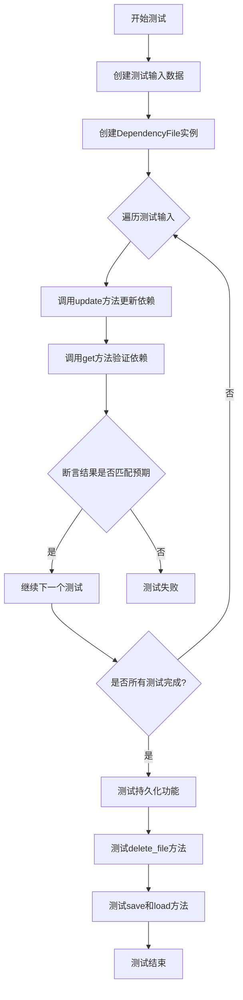
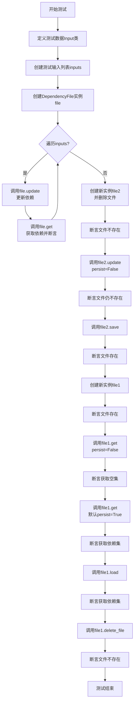

# `.\MetaGPT\tests\metagpt\utils\test_dependency_file.py` 详细设计文档

该文件是 `dependency_file.py` 模块的单元测试，用于验证 `DependencyFile` 类管理文件依赖关系的功能，包括更新、获取、保存、加载和删除依赖数据。

## 整体流程



## 类结构

```
test_dependency_file.py (测试文件)
├── Input (内部测试数据类)
└── test_dependency_file (异步测试函数)
```

## 全局变量及字段


### `inputs`
    
测试用例列表，包含多个Input对象，用于验证DependencyFile类的功能

类型：`List[Input]`
    


### `file`
    
第一个DependencyFile实例，用于测试基本的更新和查询操作

类型：`DependencyFile`
    


### `file2`
    
第二个DependencyFile实例，用于测试持久化相关的操作（如save、delete_file）

类型：`DependencyFile`
    


### `file1`
    
第三个DependencyFile实例，用于测试加载和删除文件后的状态验证

类型：`DependencyFile`
    


### `Input.x`
    
文件名或路径，表示依赖关系中的目标文件

类型：`Union[Path, str]`
    


### `Input.deps`
    
可选的依赖文件集合，表示目标文件所依赖的其他文件

类型：`Optional[Set[Union[Path, str]]]`
    


### `Input.key`
    
可选的查询键，用于在测试中指定查询时使用的文件名（默认为x的值）

类型：`Optional[Union[Path, str]]`
    


### `Input.want`
    
期望的依赖文件路径集合（字符串形式），用于断言验证测试结果

类型：`Set[str]`
    
    

## 全局函数及方法

### `test_dependency_file`

这是一个针对 `DependencyFile` 类的异步单元测试函数。它通过一系列测试用例来验证 `DependencyFile` 类的核心功能，包括更新依赖关系、获取依赖项、持久化存储（保存/加载）以及文件删除操作。测试覆盖了正常路径、边界条件（如空依赖）以及持久化标志的行为。

参数：
- 无显式参数。该函数是一个测试用例，使用 `pytest` 框架运行。

返回值：`None`，该函数不返回任何值，其目的是通过断言（`assert`）来验证代码行为。

#### 流程图



#### 带注释源码

```python
#!/usr/bin/env python
# -*- coding: utf-8 -*-
"""
@Time    : 2023/11/22
@Author  : mashenquan
@File    : test_dependency_file.py
@Desc: Unit tests for dependency_file.py
"""
from __future__ import annotations

from pathlib import Path
from typing import Optional, Set, Union

import pytest
from pydantic import BaseModel

from metagpt.utils.dependency_file import DependencyFile


@pytest.mark.asyncio  # 标记此测试函数为异步测试
async def test_dependency_file():
    # 定义内部数据类，用于结构化测试输入和期望输出
    class Input(BaseModel):
        x: Union[Path, str]  # 主文件名
        deps: Optional[Set[Union[Path, str]]] = None  # 依赖文件集合，可选
        key: Optional[Union[Path, str]] = None  # 查询时使用的键，可选（默认为x）
        want: Set[str]  # 期望的依赖项结果（字符串集合）

    # 定义测试用例列表
    inputs = [
        # 用例1: 使用字符串路径，提供依赖集
        Input(x="a/b.txt", deps={"c/e.txt", Path(__file__).parent / "d.txt"}, want={"c/e.txt", "d.txt"}),
        # 用例2: 使用Path对象路径，提供依赖集和不同的查询键
        Input(
            x=Path(__file__).parent / "x/b.txt",
            deps={"s/e.txt", Path(__file__).parent / "d.txt"},
            key="x/b.txt",
            want={"s/e.txt", "d.txt"},
        ),
        # 用例3: 依赖集为None，期望空集
        Input(x="f.txt", deps=None, want=set()),
        # 用例4: 依赖集为None，期望空集
        Input(x="a/b.txt", deps=None, want=set()),
    ]

    # 创建DependencyFile实例，工作目录为当前文件所在目录
    file = DependencyFile(workdir=Path(__file__).parent)

    # 遍历所有测试用例
    for i in inputs:
        # 1. 更新依赖：将依赖关系写入内部数据结构（可能持久化）
        await file.update(filename=i.x, dependencies=i.deps)
        # 2. 获取依赖：根据键（优先用key，否则用x）获取依赖项，并与期望结果断言
        assert await file.get(filename=i.key or i.x) == i.want

    # --- 测试持久化相关操作 ---
    # 创建新实例，并立即删除其对应的物理文件
    file2 = DependencyFile(workdir=Path(__file__).parent)
    file2.delete_file()
    assert not file.exists  # 断言文件已被删除

    # 更新依赖但不持久化（persist=False）
    await file2.update(filename="a/b.txt", dependencies={"c/e.txt", Path(__file__).parent / "d.txt"}, persist=False)
    assert not file.exists  # 断言文件仍然不存在（因为未保存）

    # 显式保存到文件
    await file2.save()
    assert file2.exists  # 断言文件现在存在

    # 创建另一个新实例，验证其能读取到已保存的数据
    file1 = DependencyFile(workdir=Path(__file__).parent)
    assert file1.exists  # 断言文件存在（因为file2保存了）
    # 获取依赖但不从文件加载（persist=False），应返回空集（因为内存中无数据）
    assert await file1.get("a/b.txt", persist=False) == set()
    # 默认获取（persist=True），应从文件加载并返回依赖集
    assert await file1.get("a/b.txt") == {"c/e.txt", "d.txt"}
    # 显式加载文件数据到内存
    await file1.load()
    # 再次获取，应返回依赖集
    assert await file1.get("a/b.txt") == {"c/e.txt", "d.txt"}
    # 删除物理文件
    file1.delete_file()
    assert not file.exists  # 断言文件已被删除


if __name__ == "__main__":
    # 允许直接运行此脚本执行测试
    pytest.main([__file__, "-s"])
```

## 关键组件


### 依赖文件管理

用于管理文件依赖关系的组件，支持记录、更新、查询和持久化文件之间的依赖关系。

### 异步操作支持

支持异步的依赖关系更新、加载和查询操作，适用于异步编程环境。

### 路径规范化处理

自动处理不同形式的路径输入（字符串或Path对象），并统一为相对路径字符串进行存储。

### 惰性持久化机制

支持延迟持久化操作，允许批量更新依赖关系后一次性保存到文件系统。

### 工作目录上下文

基于指定工作目录进行相对路径计算，确保依赖关系的路径解析一致性。


## 问题及建议


### 已知问题

-   **测试用例与实现逻辑耦合度高**：测试用例 `test_dependency_file` 直接操作了 `DependencyFile` 类的内部方法（如 `update`, `get`, `save`, `load`, `delete_file`），并假设了文件持久化的具体行为（如 `persist=False` 参数）。这使得测试用例高度依赖于 `dependency_file.py` 的当前实现细节，一旦 `DependencyFile` 类的接口或内部逻辑发生变化（例如，`persist` 参数被移除或重命名），该测试用例将立即失效，降低了测试的健壮性和可维护性。
-   **测试数据构造存在潜在路径问题**：测试用例中使用了 `Path(__file__).parent` 来构造相对路径。虽然这在当前测试文件的上下文中有效，但如果测试运行的工作目录或测试文件的位置发生变化，可能会导致路径解析错误，使得测试结果不稳定。
-   **缺少对异常和边界条件的测试**：当前的测试用例主要覆盖了正常的功能流程，但缺少对 `DependencyFile` 类在异常情况下的行为验证。例如，当传入的 `filename` 参数为非法路径、`dependencies` 集合中包含无效路径、或者尝试获取一个不存在的文件的依赖时，类应如何响应（抛出异常、返回空集合等）并未被测试覆盖。
-   **测试用例单一且功能混合**：`test_dependency_file` 函数试图在一个测试中验证多个功能点（更新、获取、保存、加载、删除文件、持久化标志的作用）。这违反了单元测试的“单一职责”原则，当一个功能点失败时，难以快速定位问题所在，也降低了测试的可读性。

### 优化建议

-   **重构测试用例，降低耦合**：将测试用例重构为更关注 `DependencyFile` 类公开API的行为，而非其内部实现。避免直接测试 `persist` 这样的内部控制标志。可以分别为 `update`、`get`、`save`、`load`、`delete_file` 等方法编写独立的测试函数，每个函数只测试一个明确的功能。使用模拟（Mock）或桩（Stub）来隔离文件系统的依赖，使测试更快速、更稳定。
-   **使用固定的测试数据目录**：在测试设置中，明确创建一个临时目录作为 `workdir`，所有测试数据都基于此目录生成。测试结束后清理该目录。这可以消除因运行环境不同导致的路径问题，并确保测试的独立性。可以使用 `pytest` 的 `tmp_path` 夹具来实现。
-   **补充异常和边界测试**：为 `DependencyFile` 类设计并添加针对错误输入的测试用例。例如：
    -   测试 `update` 方法传入 `None` 作为 `filename`。
    -   测试 `get` 方法查询一个从未被 `update` 过的文件。
    -   测试 `dependencies` 集合中包含无法解析的路径字符串。
    -   测试 `save` 和 `load` 方法在文件权限不足或磁盘已满时的行为。
-   **拆分测试函数，提升可读性和可维护性**：将庞大的 `test_dependency_file` 函数拆分为多个小的、专注的测试函数。例如：
    -   `test_update_and_get_dependencies`
    -   `test_save_and_load_persistence`
    -   `test_delete_file`
    -   `test_update_with_persist_flag` (如果该标志是公开API的一部分)
    -   `test_handles_invalid_input`
    每个测试函数应该有清晰的名称，并只验证一个逻辑单元。
-   **考虑添加集成测试**：在单元测试之外，可以补充一个轻量级的集成测试，验证 `DependencyFile` 在实际文件系统环境下的完整工作流程（包括文件的真实读写）。这可以与上述单元测试（使用模拟）形成互补，确保组件集成后的正确性。


## 其它


### 设计目标与约束

1. **设计目标**：
   - 提供一个轻量级的依赖关系管理工具，用于跟踪文件之间的依赖关系。
   - 支持异步操作，以提高I/O密集型任务的性能。
   - 提供持久化存储功能，允许将依赖关系保存到磁盘并从磁盘加载。
   - 支持跨平台路径处理，兼容`str`和`Path`类型。

2. **设计约束**：
   - 依赖关系数据存储在单个JSON文件中，文件名为`.dependency.json`，位于指定的工作目录下。
   - 依赖关系以键值对形式存储，键为文件名（相对路径），值为依赖文件集合（相对路径）。
   - 所有路径在存储时均转换为相对于工作目录的字符串形式，以确保一致性和可移植性。
   - 支持非持久化操作（`persist=False`），允许在内存中更新依赖关系而不立即写入磁盘。

### 错误处理与异常设计

1. **异常类型**：
   - 未定义特定的自定义异常，依赖Python内置异常（如`FileNotFoundError`、`JSONDecodeError`）和`pydantic`验证错误。
   - 在文件操作（如加载、保存）中可能抛出`IOError`或`OSError`。

2. **错误处理策略**：
   - 在`load`方法中，如果文件不存在，则静默初始化空依赖关系字典。
   - 在`save`方法中，使用原子写入（写入临时文件后重命名）以避免数据损坏。
   - 在`update`和`get`方法中，通过参数验证确保输入类型正确，依赖`pydantic`模型进行类型检查。
   - 在异步方法中，使用`try-except`块捕获可能的I/O异常，并记录日志（如果配置了日志系统）。

### 数据流与状态机

1. **数据流**：
   - **输入**：文件名（`str`或`Path`）和依赖集合（`Set[str | Path]`）。
   - **处理**：将路径转换为相对路径字符串，更新内部字典（`self._data`）。
   - **输出**：依赖集合（`Set[str]`）或持久化文件（`.dependency.json`）。

2. **状态机**：
   - **初始状态**：`DependencyFile`实例化后，`_data`为空字典，`_filepath`指向工作目录下的`.dependency.json`。
   - **加载状态**：调用`load`方法后，`_data`从磁盘文件加载（如果文件存在）。
   - **更新状态**：调用`update`方法后，`_data`更新，根据`persist`参数决定是否立即保存到磁盘。
   - **保存状态**：调用`save`方法后，`_data`序列化为JSON并写入磁盘。
   - **清理状态**：调用`delete_file`方法后，磁盘文件被删除，`_data`清空。

### 外部依赖与接口契约

1. **外部依赖**：
   - `pathlib.Path`：用于跨平台路径操作。
   - `pydantic.BaseModel`：用于输入数据的验证和序列化（在测试中使用）。
   - `json`模块：用于依赖关系数据的序列化和反序列化。
   - `asyncio`：用于支持异步文件I/O操作。

2. **接口契约**：
   - `DependencyFile`类提供以下公共方法：
     - `update(filename, dependencies, persist=True)`：更新指定文件的依赖关系。
     - `get(filename, persist=True)`：获取指定文件的依赖关系。
     - `load()`：从磁盘加载依赖关系数据。
     - `save()`：将依赖关系数据保存到磁盘。
     - `delete_file()`：删除磁盘上的依赖关系文件。
   - 所有路径参数均接受`str`或`Path`类型，返回的依赖集合为`Set[str]`。
   - 异步方法需在异步上下文中调用，否则会引发运行时错误。

### 性能考虑

1. **时间复杂度**：
   - `update`和`get`操作的时间复杂度为O(1)，基于字典查找。
   - `load`和`save`操作的时间复杂度为O(n)，其中n为依赖关系条目数，涉及文件I/O和JSON序列化。

2. **空间复杂度**：
   - 内存中存储整个依赖关系字典，空间复杂度为O(n)，其中n为文件数量。
   - 磁盘存储为单个JSON文件，大小与依赖关系数量成正比。

3. **优化建议**：
   - 对于大规模依赖关系（如数万文件），考虑使用数据库（如SQLite）替代JSON文件存储。
   - 实现增量保存机制，避免每次更新都全量写入磁盘。
   - 添加缓存机制，减少重复的磁盘读取操作。

### 安全考虑

1. **路径安全**：
   - 所有路径均转换为相对路径，防止绝对路径泄露系统信息。
   - 路径规范化处理，避免目录遍历攻击（如`../`）。

2. **数据安全**：
   - JSON文件仅存储相对路径，不包含敏感信息。
   - 文件写入使用原子操作，防止数据损坏。
   - 异步操作确保文件锁正确处理，避免并发写入冲突。

### 测试策略

1. **单元测试**：
   - 覆盖所有公共方法（`update`、`get`、`load`、`save`、`delete_file`）。
   - 测试边界条件（如空依赖、重复路径、非法路径）。
   - 验证异步行为和非持久化模式。

2. **集成测试**：
   - 测试与真实文件系统的交互（创建、读取、更新、删除文件）。
   - 验证跨平台路径兼容性（Windows、Linux、macOS）。

3. **性能测试**：
   - 测量大规模依赖关系下的内存使用和I/O性能。
   - 验证并发访问下的正确性和稳定性。

    