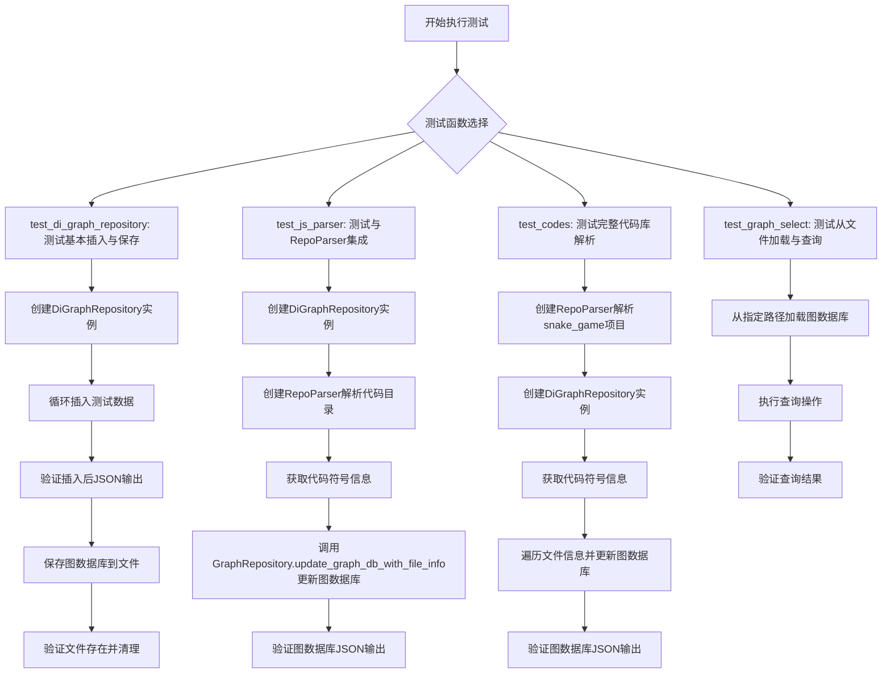
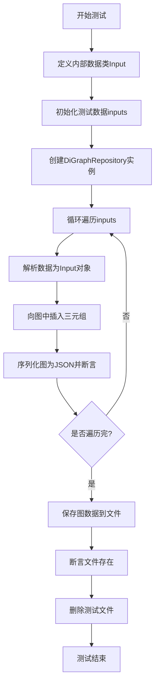
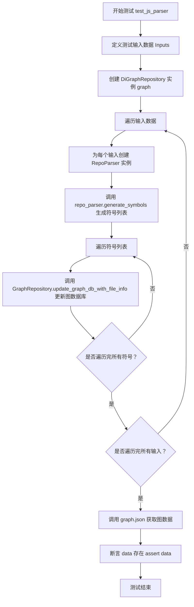
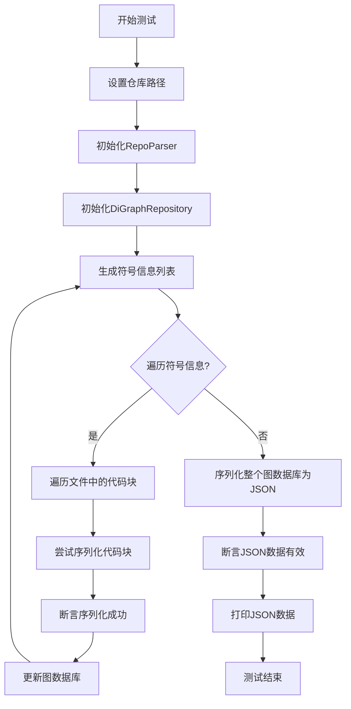
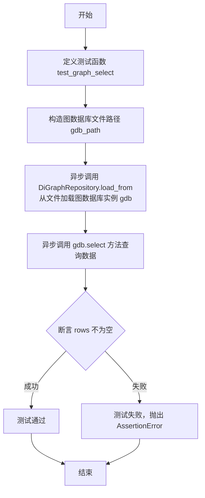

# `.\MetaGPT\tests\metagpt\utils\test_di_graph_repository.py` 详细设计文档

该文件是一个单元测试文件，用于测试 DiGraphRepository 类的功能，包括插入三元组数据、保存图数据库、从文件加载图数据库、查询数据，以及测试与 RepoParser 的集成，验证代码符号信息能被正确解析并更新到图数据库中。

## 整体流程



## 类结构

```
BaseModel (Pydantic基类)
├── Input (测试内部类)
├── RepoParser (外部导入类)
├── GraphRepository (外部导入类)
└── DiGraphRepository (外部导入类，主要测试对象)
```

## 全局变量及字段


### `DEFAULT_WORKSPACE_ROOT`
    
默认工作空间根目录路径，用于指定项目的基础工作目录。

类型：`Path`
    


### `Input.s`
    
表示RDF三元组中的主语（subject），通常用于标识代码实体或资源。

类型：`str`
    


### `Input.p`
    
表示RDF三元组中的谓词（predicate），用于描述主语和宾语之间的关系或属性。

类型：`str`
    


### `Input.o`
    
表示RDF三元组中的宾语（object），是谓词描述的具体值或关联对象。

类型：`str`
    


### `Input.path`
    
表示文件或目录的路径字符串，用于指定代码解析的目标位置。

类型：`str`
    
    

## 全局函数及方法

### `test_di_graph_repository`

该函数是一个异步单元测试，用于验证`DiGraphRepository`类的基本功能，包括插入三元组数据、序列化为JSON、保存到文件以及清理测试文件。

参数：
- 无显式参数。该函数是一个测试函数，不接收外部参数。

返回值：`None`，该函数是一个测试函数，不返回业务值，而是通过断言（`assert`）验证测试结果。

#### 流程图



#### 带注释源码

```python
@pytest.mark.asyncio
async def test_di_graph_repository():
    # 1. 定义一个内部数据模型Input，用于结构化测试数据
    class Input(BaseModel):
        s: str  # 主语
        p: str  # 谓语
        o: str  # 宾语

    # 2. 初始化测试数据，包含两个三元组
    inputs = [
        {"s": "main.py:Game:draw", "p": "method:hasDescription", "o": "Draw image"},
        {"s": "main.py:Game:draw", "p": "method:hasDescription", "o": "Show image"},
    ]
    # 3. 获取当前文件所在目录作为测试根路径
    path = Path(__file__).parent
    # 4. 创建一个名为"test"的DiGraphRepository实例
    graph = DiGraphRepository(name="test", root=path)
    
    # 5. 遍历测试数据，执行插入和验证操作
    for i in inputs:
        # 5.1 将字典数据解析为Input对象
        data = Input(**i)
        # 5.2 异步插入三元组到图中
        await graph.insert(subject=data.s, predicate=data.p, object_=data.o)
        # 5.3 将图序列化为JSON并断言结果非空
        v = graph.json()
        assert v
    
    # 6. 异步保存图数据到文件系统
    await graph.save()
    # 7. 断言保存的文件确实存在
    assert graph.pathname.exists()
    # 8. 测试完成后，删除生成的测试文件以清理环境
    graph.pathname.unlink()
```

### `test_js_parser`

这是一个使用 `pytest` 框架编写的异步单元测试函数。它的核心功能是测试 `RepoParser` 类解析指定目录下的代码文件，并利用 `GraphRepository.update_graph_db_with_file_info` 方法将解析出的符号信息（如类、方法等）更新到一个有向图数据库（`DiGraphRepository`）中，最后验证图数据库是否成功生成了数据。

参数：
- 无显式参数。作为 `pytest` 测试用例，它通过 `pytest.mark.asyncio` 装饰器管理异步执行。

返回值：`None`，`pytest` 测试用例通常不显式返回值，其成功与否由内部的 `assert` 语句决定。

#### 流程图



#### 带注释源码

```python
@pytest.mark.asyncio  # 标记此测试函数为异步函数，以便 pytest-asyncio 插件能正确处理。
async def test_js_parser():
    # 定义一个内部数据模型，用于验证和结构化测试输入。
    class Input(BaseModel):
        path: str  # 参数：要解析的代码仓库根目录路径。

    # 定义测试输入数据列表。这里只有一个测试用例，指向项目内的一个示例代码目录。
    inputs = [
        {"path": str(Path(__file__).parent / "../../data/code")},
    ]
    # 获取当前测试文件所在目录，作为图数据库的存储根目录。
    path = Path(__file__).parent
    # 创建一个有向图数据库实例，用于存储后续解析出的代码符号关系。
    graph = DiGraphRepository(name="test", root=path)
    
    # 遍历所有测试输入。
    for i in inputs:
        # 将输入字典转换为 Input 对象，进行数据验证。
        data = Input(**i)
        # 创建代码仓库解析器，传入要解析的目录路径。
        repo_parser = RepoParser(base_directory=data.path)
        # 调用解析器，生成代码符号列表（如文件、类、方法等信息）。
        symbols = repo_parser.generate_symbols()
        # 遍历生成的每一个符号（通常代表一个文件的信息）。
        for s in symbols:
            # 调用 GraphRepository 的类方法，将当前文件符号 `s` 的信息插入或更新到图数据库 `graph` 中。
            # 此过程可能涉及创建节点（如类、方法）和边（如继承、调用关系）。
            await GraphRepository.update_graph_db_with_file_info(graph_db=graph, file_info=s)
    # 所有符号处理完毕后，将图数据库的内容序列化为 JSON 格式的字符串。
    data = graph.json()
    # 断言：确保图数据库成功生成了数据（即 `data` 变量不为空或 None）。
    # 这是测试的主要验证点，用于确认解析和更新流程正常工作。
    assert data
```

### `test_codes`

这是一个异步单元测试函数，用于测试 `DiGraphRepository` 和 `RepoParser` 的集成功能。它从指定的工作空间目录解析代码仓库，提取符号信息，并将这些信息更新到一个有向图数据库中。最后，它验证图数据库可以正确序列化为JSON格式。

参数：
- 无显式参数。该函数是一个测试用例，不接收外部参数。

返回值：`None`，该函数是一个测试用例，不返回业务值，而是通过断言（`assert`）来验证测试结果。

#### 流程图



#### 带注释源码

```python
@pytest.mark.asyncio
@pytest.mark.skip  # 此测试被标记为跳过，执行测试套件时不会运行
async def test_codes():
    # 设置要解析的代码仓库路径，指向工作空间下的'snake_game'目录
    path = DEFAULT_WORKSPACE_ROOT / "snake_game"
    # 初始化仓库解析器，传入基础目录路径
    repo_parser = RepoParser(base_directory=path)

    # 初始化一个有向图数据库，用于存储代码结构信息
    graph = DiGraphRepository(name="test", root=path)
    # 调用解析器，生成代码仓库的符号信息列表
    symbols = repo_parser.generate_symbols()
    # 遍历每个文件的符号信息
    for file_info in symbols:
        # 遍历文件中的每个代码块（如类、函数定义）
        for code_block in file_info.page_info:
            try:
                # 尝试将代码块对象序列化为JSON字符串，验证其可序列化性
                val = code_block.model_dump_json()
                # 断言序列化成功，val应为非空值
                assert val
            except TypeError as e:
                # 如果发生类型错误（通常因不可序列化对象引起），断言错误不应发生
                assert not e
        # 将当前文件的符号信息更新到图数据库中
        await GraphRepository.update_graph_db_with_file_info(graph_db=graph, file_info=file_info)
    # 将整个图数据库序列化为JSON格式
    data = graph.json()
    # 断言序列化后的数据有效（非空）
    assert data
    # 打印JSON数据，便于调试或查看结果
    print(data)
```

### `test_graph_select`

这是一个异步单元测试函数，用于测试 `DiGraphRepository` 类的 `select` 方法。它首先从一个指定的 JSON 文件路径加载一个图数据库实例，然后调用 `select` 方法查询数据，并断言返回的结果不为空。

参数：

-  `gdb_path`：`pathlib.Path`，指向包含序列化图数据库数据的 JSON 文件路径。

返回值：`None`，这是一个测试函数，不返回业务值，其成功与否由内部的 `assert` 语句决定。

#### 流程图



#### 带注释源码

```python
@pytest.mark.asyncio  # 使用 pytest 的异步测试标记
async def test_graph_select():
    # 构造图数据库 JSON 文件的路径，该文件位于测试文件父目录的 `../../data/graph_db/` 下，名为 `networkx.sequence_view.json`
    gdb_path = Path(__file__).parent / "../../data/graph_db/networkx.sequence_view.json"
    
    # 异步调用 DiGraphRepository 的类方法 load_from，从指定路径加载并反序列化一个图数据库实例
    gdb = await DiGraphRepository.load_from(gdb_path)
    
    # 异步调用加载得到的图数据库实例 gdb 的 select 方法，查询其中的所有三元组数据
    rows = await gdb.select()
    
    # 断言查询结果 rows 不为空（即至少包含一条记录），这是本测试的核心验证点
    assert rows
```

## 关键组件


### DiGraphRepository

一个基于有向图（DiGraph）的图数据库仓库实现，用于存储和查询以三元组（subject, predicate, object）形式表示的知识或代码符号关系，支持数据的插入、查询、序列化到JSON文件以及从文件加载。

### RepoParser

一个仓库解析器，用于分析指定代码仓库目录，提取其中的代码符号（如类、方法、函数等）及其结构信息，生成可供图数据库处理的符号数据。

### GraphRepository

一个图数据库仓库的抽象或基类，提供了更新图数据库的标准接口（如`update_graph_db_with_file_info`），用于将代码解析器生成的符号信息整合到具体的图数据库实例中。

### 三元组数据模型 (Input in tests)

在测试中定义的`Input`数据模型（基于Pydantic），用于规范化和验证要插入图数据库的三元组数据，确保数据格式的正确性。


## 问题及建议


### 已知问题

-   **测试数据清理不彻底**：`test_di_graph_repository` 测试用例中，虽然使用 `graph.pathname.unlink()` 删除了测试生成的图数据库文件，但如果测试在 `assert` 语句处失败，文件删除操作将不会执行，导致残留测试文件。
-   **硬编码的测试路径**：`test_js_parser` 和 `test_codes` 测试用例中，使用了相对路径 `"../../data/code"` 和 `DEFAULT_WORKSPACE_ROOT / "snake_game"`。这些路径依赖于特定的项目目录结构，降低了测试的可移植性和在CI/CD环境中的可靠性。
-   **被跳过的测试用例**：`test_codes` 测试用例被 `@pytest.mark.skip` 装饰器跳过，这意味着它包含的功能或场景未被持续验证，可能隐藏了潜在的问题或导致代码覆盖率不足。
-   **异常处理过于宽泛**：在 `test_codes` 测试用例的循环中，使用 `try...except` 捕获 `TypeError` 并断言异常不存在 (`assert not e`)。这种写法意图不清晰，且 `assert not e` 在异常对象 `e` 存在时永远为 `False`，逻辑错误。这掩盖了 `code_block.model_dump_json()` 可能抛出的真实问题。
-   **资源管理风险**：测试用例中创建了 `DiGraphRepository` 实例，但未在测试结束后显式关闭或清理其可能持有的资源（如文件句柄、内存缓存）。虽然Python有垃圾回收，但在异步或复杂场景下可能不够及时。

### 优化建议

-   **使用 pytest 临时目录和固件**：建议使用 `pytest` 提供的 `tmp_path` 固件来创建和管理测试用的临时文件和目录。这可以确保测试文件被自动清理，无论测试通过与否。例如，将 `test_di_graph_repository` 中的 `path` 参数替换为 `tmp_path`。
-   **抽象和注入测试资源路径**：将测试数据路径定义为配置或通过环境变量注入，或者使用 `pytest` 的 `monkeypatch` 或自定义固件来模拟这些路径，以提高测试的独立性和可配置性。
-   **修复或移除被跳过的测试**：审查 `test_codes` 测试用例，修复其存在的问题（如路径依赖、异常处理逻辑），然后移除 `@pytest.mark.skip` 装饰器，使其参与常规测试流程。如果该测试已过时或不必要，则应直接删除。
-   **明确异常处理逻辑**：重构 `test_codes` 中的异常处理。如果目的是验证 `model_dump_json()` 不抛出 `TypeError`，应更精确地断言。更好的做法是让测试失败以暴露问题，或者如果某些 `code_block` 预期可能序列化失败，则应明确测试这种边界情况，而不是笼统地捕获并忽略。
-   **实现上下文管理器或使用固件进行资源管理**：为 `DiGraphRepository` 类实现 `__aenter__` 和 `__aexit__` 方法，使其支持异步上下文管理器协议（`async with`）。在测试中，使用该协议来确保资源的正确获取和释放。或者，使用 `pytest` 的异步固件来管理 `DiGraphRepository` 实例的生命周期。
-   **增加测试覆盖率和断言**：当前测试主要验证“不抛出异常”和“返回非空数据”。建议增加更具体的断言，例如验证插入图数据库后的查询结果是否符合预期，验证 `RepoParser` 解析出的符号数量或内容等，以增强测试的健壮性。
-   **分离测试关注点**：`test_js_parser` 测试用例同时测试了 `RepoParser` 和 `GraphRepository.update_graph_db_with_file_info` 的集成。考虑将其拆分为更细粒度的单元测试，例如单独测试 `RepoParser.generate_symbols` 和 `GraphRepository.update_graph_db_with_file_info`，并使用Mock对象隔离依赖。


## 其它


### 设计目标与约束

本测试套件的设计目标是验证`DiGraphRepository`类的核心功能，包括图数据的插入、持久化、加载、查询以及与`RepoParser`的集成。约束条件包括：测试应独立运行，不依赖外部服务；测试数据应使用临时文件或预设的测试数据，并在测试后清理；测试应覆盖异步操作；部分集成测试（如`test_codes`）可能因环境依赖而被跳过。

### 错误处理与异常设计

测试代码中的错误处理主要围绕断言（`assert`）展开，用于验证预期行为。例如，验证插入数据后`json()`方法返回非空值，验证文件被成功保存和删除。在`test_codes`中，通过`try-except`块捕获`TypeError`，但此异常处理逻辑主要用于演示，实际测试中期望不抛出异常。整体上，测试依赖于`pytest`的断言机制来报告失败，未显式设计复杂的异常处理流程。

### 数据流与状态机

测试数据流始于预定义的输入数据（如`inputs`列表），通过`DiGraphRepository`的`insert`方法或`RepoParser`的`generate_symbols`方法转换为图节点和边，最终持久化为JSON文件或通过`json()`方法序列化。状态变化包括：图数据库从空状态到包含插入数据的状态；文件系统上临时文件的创建与删除。测试`test_graph_select`展示了从持久化文件加载图数据库并查询数据的状态恢复流程。

### 外部依赖与接口契约

测试代码的外部依赖包括：`pytest`测试框架、`pydantic`用于数据验证、`metagpt`项目内部的`RepoParser`、`GraphRepository`、`DiGraphRepository`等模块。接口契约主要体现在：`DiGraphRepository`需提供`insert`、`save`、`json`、`load_from`、`select`等方法；`RepoParser`需提供`generate_symbols`方法返回符号信息；`GraphRepository.update_graph_db_with_file_info`需接受图数据库和文件信息作为参数。测试数据文件路径（如`../../data/code`和`../../data/graph_db/`）是关键的测试资源依赖。

### 测试策略与覆盖范围

测试策略包含单元测试（如`test_di_graph_repository`对基本CRUD操作的测试）、集成测试（如`test_js_parser`和`test_codes`对代码解析和图构建的测试）以及数据加载测试（`test_graph_select`）。覆盖范围包括：图数据的插入与序列化、文件持久化与清理、从代码仓库解析符号并更新图数据库、从文件加载图数据库并执行查询。通过`@pytest.mark.skip`标记了可能依赖特定工作空间环境的集成测试。

### 环境与配置依赖

测试执行依赖于特定的目录结构和测试数据文件：`../../data/code`目录用于存放被解析的源代码示例；`../../data/graph_db/networkx.sequence_view.json`是预先生成的图数据库文件，用于测试加载功能。环境变量或配置`DEFAULT_WORKSPACE_ROOT`用于定位`snake_game`项目路径（在跳过的测试中）。测试运行前需确保这些资源存在且路径正确。


    