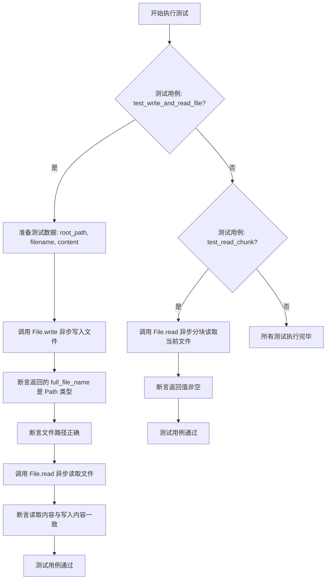
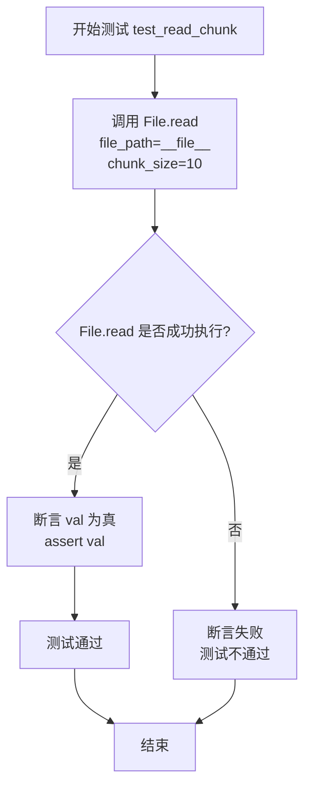
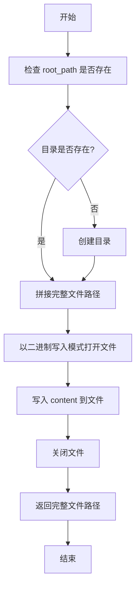
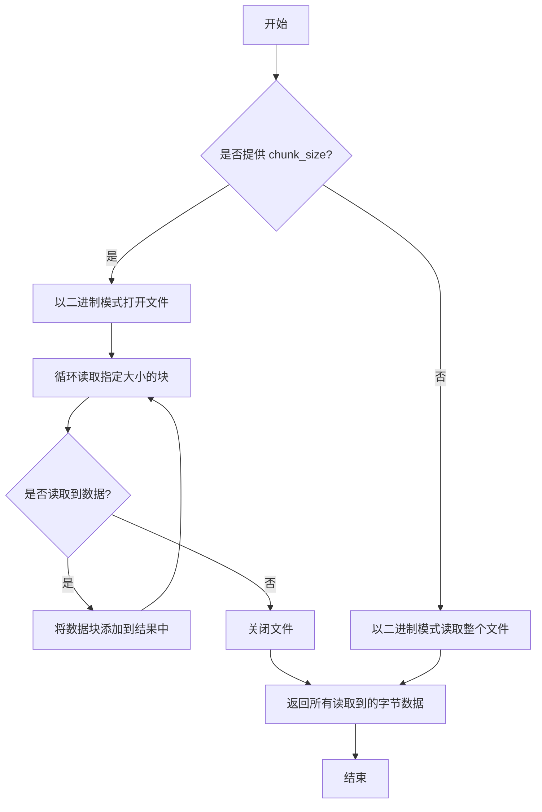

# `.\MetaGPT\tests\metagpt\utils\test_file.py` 详细设计文档

这是一个使用 pytest 框架编写的异步单元测试文件，用于测试 `metagpt.utils.file.File` 类中的文件读写功能，包括完整的文件写入与读取测试，以及分块读取测试。

## 整体流程



## 类结构

```
测试文件 (test_file.py)
├── 全局函数: test_write_and_read_file (异步测试函数)
├── 全局函数: test_read_chunk (异步测试函数)
└── 外部依赖类: File (来自 metagpt.utils.file)
```

## 全局变量及字段


### `root_path`
    
测试用例参数，表示文件操作的根目录路径。

类型：`pathlib.Path`
    


### `filename`
    
测试用例参数，表示要操作的文件名。

类型：`str`
    


### `content`
    
测试用例参数，表示要写入文件的原始字节内容。

类型：`bytes`
    


### `full_file_name`
    
在测试函数中存储File.write方法返回的完整文件路径。

类型：`pathlib.Path`
    


### `file_data`
    
在测试函数中存储File.read方法返回的文件内容字节数据。

类型：`bytes`
    


### `val`
    
在test_read_chunk测试函数中存储File.read方法返回的分块读取内容。

类型：`bytes`
    


    

## 全局函数及方法

### `test_write_and_read_file`

这是一个使用 `pytest` 框架编写的异步单元测试函数。它的核心功能是测试 `File` 类的 `write` 和 `read` 方法，验证它们能够正确地协同工作：将内容写入指定路径的文件，然后从该文件读取内容，并确保读取的内容与原始写入的内容一致。

参数：

- `root_path`：`Path`，测试文件将被写入的根目录路径。
- `filename`：`str`，要创建和读取的测试文件的名称。
- `content`：`bytes`，要写入测试文件的原始字节内容。

返回值：`None`，这是一个测试函数，不返回业务值，其成功与否由内部的 `assert` 语句判定。

#### 流程图

```mermaid
flowchart TD
    A[开始测试] --> B[调用 File.write<br>写入内容到文件]
    B --> C{写入成功?<br>返回路径为Path对象}
    C -- 是 --> D[断言返回路径<br>与预期路径一致]
    D --> E[调用 File.read<br>从文件读取内容]
    E --> F{读取成功?<br>返回字节数据]
    F -- 是 --> G[断言读取解码后的内容<br>与原始内容一致]
    G --> H[测试通过]
    C -- 否 --> I[断言失败<br>测试终止]
    F -- 否 --> I
```

#### 带注释源码

```python
async def test_write_and_read_file(root_path: Path, filename: str, content: bytes):
    # 步骤1: 调用 File.write 异步方法，将内容编码后写入指定路径的文件。
    # 该方法应返回写入文件的完整路径。
    full_file_name = await File.write(root_path=root_path, filename=filename, content=content.encode("utf-8"))
    
    # 断言1: 验证 write 方法返回的是一个 Path 对象。
    assert isinstance(full_file_name, Path)
    # 断言2: 验证返回的完整路径与预期的路径（root_path / filename）一致。
    assert root_path / filename == full_file_name
    
    # 步骤2: 调用 File.read 异步方法，从刚写入的完整文件路径中读取数据。
    file_data = await File.read(full_file_name)
    
    # 断言3: 验证读取到的字节数据解码后与最初传入的 content 字符串完全一致。
    # 这是本测试的核心断言，确保写和读操作的数据完整性。
    assert file_data.decode("utf-8") == content
```

### `test_read_chunk`

这是一个异步的单元测试函数，用于测试 `File.read` 方法在指定 `chunk_size` 参数时的分块读取功能。它通过读取当前测试文件本身来验证分块读取操作是否成功执行。

参数：

-   `无显式参数`：`无`，这是一个单元测试函数，其参数由 `pytest` 框架通过装饰器（如 `@pytest.mark.asyncio`）隐式管理。

返回值：`None`，单元测试函数通常不直接返回值，而是通过断言（`assert`）来验证测试结果。测试框架会根据断言的成功或失败来报告测试状态。

#### 流程图



#### 带注释源码

```python
# 使用 pytest 的 asyncio 标记，表明这是一个异步测试函数
@pytest.mark.asyncio
async def test_read_chunk():
    # 调用 File 类的异步 read 方法，传入当前文件路径 (__file__) 和分块大小 (chunk_size=10)
    # 目的是测试分块读取功能
    val = await File.read(file_path=__file__, chunk_size=10)
    # 断言：验证读取操作返回的值 (val) 为真（非空或非None），
    # 以此判断分块读取功能是否正常工作
    assert val
```

### `File.write`

`File.write` 是一个异步类方法，用于将内容写入指定路径的文件中。它首先确保目标目录存在，然后将内容写入文件，最后返回写入文件的完整路径。

参数：

- `root_path`：`Path`，目标文件所在的根目录路径
- `filename`：`str`，要写入的文件名
- `content`：`bytes`，要写入文件的二进制内容

返回值：`Path`，写入文件的完整路径（包括目录和文件名）

#### 流程图



#### 带注释源码

```python
@classmethod
async def write(cls, root_path: Path, filename: str, content: bytes) -> Path:
    """
    将内容写入指定路径的文件中
    
    Args:
        root_path: 目标文件所在的根目录路径
        filename: 要写入的文件名
        content: 要写入文件的二进制内容
    
    Returns:
        写入文件的完整路径
    """
    # 确保目标目录存在，如果不存在则创建
    root_path.mkdir(parents=True, exist_ok=True)
    
    # 拼接完整的文件路径
    file_path = root_path / filename
    
    # 以二进制写入模式打开文件并写入内容
    with open(file_path, "wb") as writer:
        writer.write(content)
    
    # 返回写入文件的完整路径
    return file_path
```

### `File.read`

从指定文件路径异步读取文件内容。如果提供了 `chunk_size` 参数，则以指定大小的块流式读取文件；否则，一次性读取整个文件。

参数：

- `file_path`：`Path`，要读取的文件的路径。
- `chunk_size`：`int`，可选参数，指定每次读取的字节块大小。如果未提供，则一次性读取整个文件。

返回值：`bytes`，读取到的文件内容，以字节形式返回。

#### 流程图



#### 带注释源码

```python
@classmethod
async def read(cls, file_path: Path, chunk_size: int = -1) -> bytes:
    """
    从指定文件路径异步读取文件内容。

    如果提供了 `chunk_size` 参数，则以指定大小的块流式读取文件；否则，一次性读取整个文件。

    Args:
        file_path (Path): 要读取的文件的路径。
        chunk_size (int, optional): 每次读取的字节块大小。默认为 -1，表示一次性读取整个文件。

    Returns:
        bytes: 读取到的文件内容，以字节形式返回。
    """
    # 如果 chunk_size 大于 0，则以块的形式读取文件
    if chunk_size > 0:
        data = b""  # 初始化一个空的字节串来存储读取的数据
        # 以二进制模式打开文件
        async with aiofiles.open(file_path, mode="rb") as reader:
            while True:
                # 读取指定大小的块
                chunk = await reader.read(chunk_size)
                # 如果没有读取到数据，说明已到达文件末尾，退出循环
                if not chunk:
                    break
                # 将读取到的块添加到数据中
                data += chunk
        # 返回所有读取到的字节数据
        return data
    # 如果 chunk_size 不大于 0，则一次性读取整个文件
    async with aiofiles.open(file_path, mode="rb") as reader:
        # 读取整个文件内容并返回
        return await reader.read()
```

## 关键组件


### File 类

一个用于异步文件读写操作的实用工具类，封装了文件的写入、读取和分块读取功能。

### 异步文件操作

支持异步的文件写入和读取操作，允许在异步上下文中高效地处理文件I/O，避免阻塞主线程。

### 分块读取

提供分块读取文件内容的功能，允许按指定大小逐块读取大文件，适用于处理大型文件或流式数据。

### 路径处理

使用 `pathlib.Path` 进行路径操作，确保跨平台兼容性和路径安全性，支持路径的拼接和验证。

### 单元测试框架

使用 `pytest` 框架进行异步单元测试，通过参数化测试用例验证文件读写功能的正確性和一致性。

### 编码处理

在文件读写过程中处理字符串与字节之间的编码转换，确保文本内容的正确存储和读取。

### 测试数据管理

通过参数化测试用例管理测试数据和预期结果，确保测试的覆盖率和可维护性。


## 问题及建议


### 已知问题

-   **测试数据硬编码**：测试用例 `test_write_and_read_file` 的参数 `root_path` 和 `content` 是硬编码的。这降低了测试的灵活性，并且 `root_path` 指向了一个相对路径 `../../../workspace/unittest/data/tutorial_docx/2023-09-07_17-05-20`，这使得测试依赖于特定的目录结构，在其他环境或项目结构变化时可能失败。
-   **测试覆盖不完整**：测试用例 `test_read_chunk` 仅验证了 `File.read` 方法在指定 `chunk_size` 参数时不会抛出异常并返回非空值，但没有验证分块读取内容的正确性（例如，读取的内容是否完整、顺序是否正确）。这是一个不充分的测试。
-   **潜在的编码问题**：在 `test_write_and_read_file` 中，`content` 参数的类型标注为 `bytes`，但测试数据传入的是字符串 `"Hello World!"`，随后在测试函数内部调用 `content.encode("utf-8")`。这存在类型标注与实际使用不一致的问题，虽然测试能运行，但可能误导阅读者或引发静态类型检查工具（如mypy）的警告。
-   **缺少异常场景测试**：当前测试只覆盖了正常路径（Happy Path），没有测试 `File.write` 和 `File.read` 方法在遇到无效路径、权限不足、磁盘空间不足等异常情况时的行为。

### 优化建议

-   **使用临时目录和动态数据**：建议使用 `pytest` 的 `tmp_path` fixture 来创建临时目录作为 `root_path`，避免硬编码和依赖外部目录。测试内容也可以动态生成，例如使用随机字符串，以提高测试的独立性和可重复性。
-   **增强分块读取测试**：对于 `test_read_chunk`，应该编写更详细的断言来验证分块读取的功能。例如，可以先将已知内容写入文件，然后使用 `File.read` 分块读取，并拼接后与原始内容进行比较。也可以测试不同的 `chunk_size`（包括大于、等于和小于文件大小的情况）。
-   **修正类型标注并分离关注点**：将 `test_write_and_read_file` 测试函数的 `content` 参数类型标注为 `str`，或者在 `@pytest.mark.parametrize` 中直接提供 `bytes` 类型的数据。更好的做法是保持参数为 `str`，在测试函数内部编码，这样测试用例看起来更清晰。
-   **补充异常和边界测试**：增加测试用例来验证 `File` 类方法在错误输入或异常条件下的行为。例如，尝试向只读目录写入文件、读取不存在的文件、传入无效的 `chunk_size`（如负数或零）等。这有助于确保代码的健壮性，并作为使用示例。
-   **考虑测试结构优化**：可以将 `File` 类的读写测试分离到不同的测试函数中，例如 `test_file_write`、`test_file_read` 和 `test_file_read_chunk`，使每个测试函数的职责更单一。同时，可以使用 `pytest.fixture` 来设置和清理测试所需的公共资源（如测试文件）。


## 其它


### 设计目标与约束

本测试代码的设计目标是验证 `File` 类的核心功能，包括异步写入文件、异步读取整个文件以及异步分块读取文件。约束条件包括：
1.  必须使用 `pytest` 框架进行异步测试。
2.  测试应覆盖正常路径和边界情况（如分块读取）。
3.  测试数据应使用相对路径，确保在不同环境下的可移植性。
4.  测试执行后不应遗留测试文件，但当前代码未包含清理逻辑，这是一个潜在问题。

### 错误处理与异常设计

当前测试代码主要关注功能正确性，通过 `assert` 语句验证预期行为。然而，它缺乏对 `File` 类方法可能抛出的异常（如 `IOError`, `PermissionError`）的显式测试。例如：
1.  未测试向只读目录写入文件时的错误处理。
2.  未测试读取不存在的文件时的异常情况。
3.  异步操作中的异常传播未被捕获和断言。
改进建议：增加使用 `pytest.raises` 的测试用例来验证错误处理逻辑。

### 数据流与状态机

本测试代码的数据流相对简单：
1.  **写入流程**：测试参数 (`root_path`, `filename`, `content`) -> `File.write` -> 生成文件 -> 返回 `full_file_name` (Path对象) -> 验证路径和文件内容。
2.  **读取流程**：`full_file_name` -> `File.read` -> 返回文件数据 (`bytes`) -> 解码并与原始 `content` 比较。
3.  **分块读取流程**：当前文件路径 (`__file__`) 和 `chunk_size` -> `File.read` (分块模式) -> 返回数据块 -> 验证非空。
测试本身不维护复杂状态，主要验证 `File` 类方法输入与输出的对应关系。

### 外部依赖与接口契约

1.  **外部依赖**：
    *   `pytest` 和 `pytest-asyncio`：测试框架和异步支持。
    *   `pathlib.Path`：用于路径操作。
    *   `metagpt.utils.file.File`：被测试的核心类。
2.  **接口契约**：
    *   `File.write`：契约要求接收 `root_path` (Path), `filename` (str), `content` (bytes)，异步返回写入文件的完整路径 (Path)。测试验证了此契约。
    *   `File.read`：契约要求接收 `file_path` (Path) 和可选的 `chunk_size` (int)，异步返回文件内容 (bytes) 或迭代器。测试验证了两种模式。
    *   测试用例通过 `@pytest.mark.parametrize` 定义了与 `File.write`/`read` 配合的测试数据契约。

### 测试策略与覆盖范围

1.  **策略**：采用基于参数的测试和独立用例相结合的方式。
    *   `test_write_and_read_file`：使用参数化测试，验证文件写入和读取的集成流程及内容一致性。
    *   `test_read_chunk`：独立测试分块读取功能。
2.  **覆盖范围**：
    *   **功能覆盖**：覆盖了同步写入/读取、异步分块读取。
    *   **路径覆盖**：使用了相对路径构造测试目录。
    *   **缺失覆盖**：
        *   错误和异常场景（如无效路径、权限不足）。
        *   文件编码异常。
        *   大文件或空文件的分块读取边界情况。
        *   并发读写场景（如果 `File` 类支持）。

### 环境与配置

1.  **测试环境**：测试文件 (`test_file.py`) 位于项目测试目录中。测试数据写入到相对于项目根目录的 `workspace/unittest/data/tutorial_docx/` 下的日期时间子目录中，这有助于隔离测试数据但依赖于特定的目录结构。
2.  **配置**：测试通过 `if __name__ == "__main__":` 块支持直接运行。使用 `-s` 标志允许控制台输出，便于调试。
3.  **潜在问题**：测试数据目录路径 (`../../../workspace/...`) 硬编码在测试中，如果测试文件位置或项目结构改变，可能导致测试失败。建议使用更稳定的路径获取方式或 pytest 配置。

### 安全与合规考虑

1.  **数据安全**：测试写入的内容为简单的 "Hello World!"，不涉及敏感数据。
2.  **文件系统安全**：测试在指定目录内创建和读取文件，目前看没有越权风险。但未测试 `File` 类是否对路径遍历攻击（如 `../../../etc/passwd`）有防护。
3.  **资源清理**：测试创建了物理文件 (`test.md`)，但代码中没有在测试后删除该文件的逻辑，可能导致测试残留物累积。最佳实践是在测试 setup/teardown 阶段或使用 fixture 进行清理。
4.  **合规性**：代码本身符合基本的 Python 编码规范（如 PEP 8）。测试名称清晰，符合 pytest 约定。

    