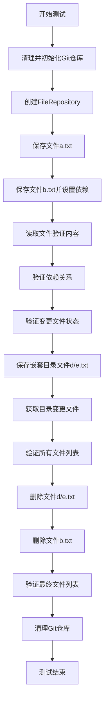
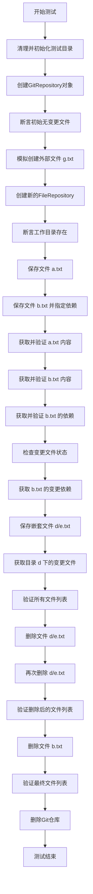
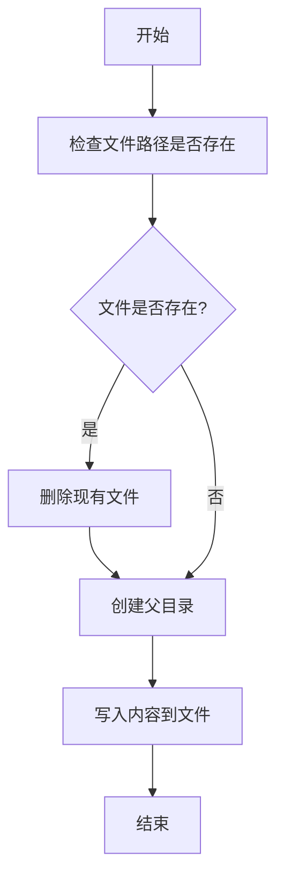
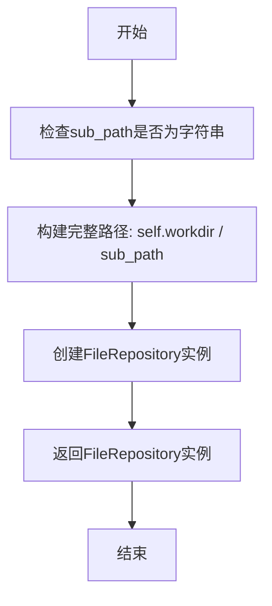
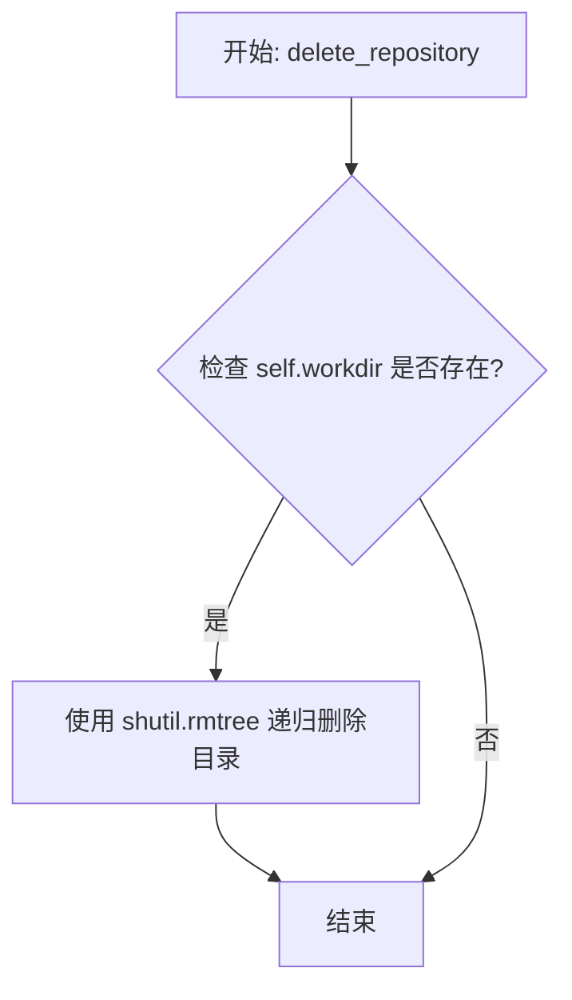
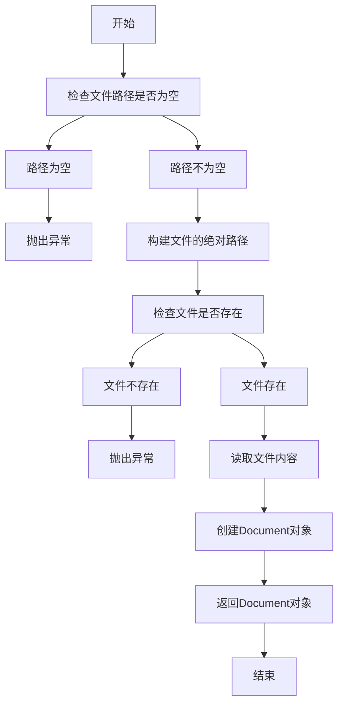
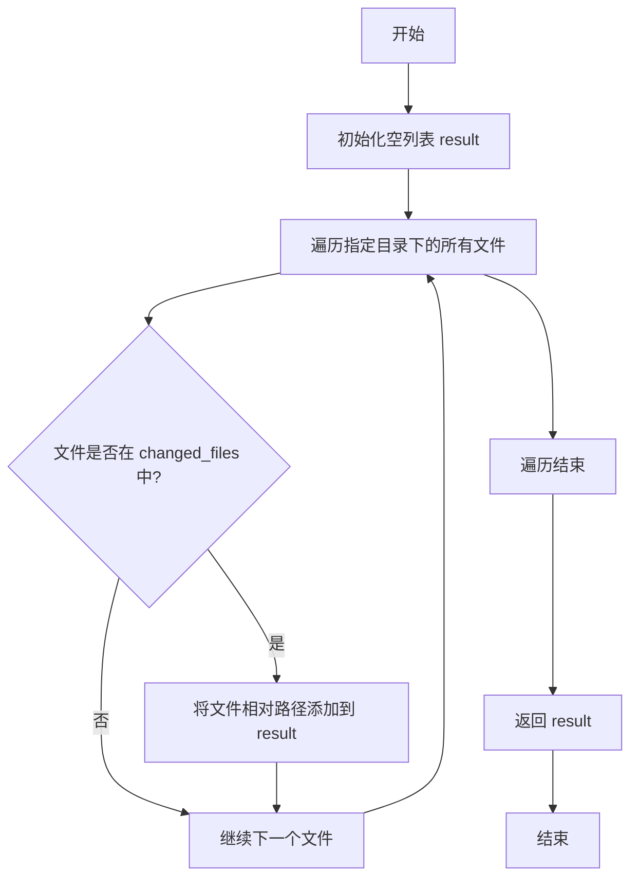

# `.\MetaGPT\tests\metagpt\utils\test_file_repository.py` 详细设计文档

这是一个单元测试文件，用于测试GitRepository和FileRepository的功能，包括文件创建、保存、读取、依赖管理、变更跟踪和删除等操作。

## 整体流程



## 类结构

```
测试文件结构
├── 导入模块
│   ├── shutil
│   ├── Path
│   ├── pytest
│   ├── GitRepository
│   └── mock_file
└── 测试函数
    └── test_file_repo
```

## 全局变量及字段


### `local_path`
    
测试中使用的本地文件系统路径，指向测试仓库的根目录。

类型：`pathlib.Path`
    


### `git_repo`
    
GitRepository实例，用于管理Git仓库操作。

类型：`metagpt.utils.git_repository.GitRepository`
    


### `file_repo_path`
    
文件仓库的相对路径字符串，用于在Git仓库内创建子目录。

类型：`str`
    


### `full_path`
    
文件仓库的完整绝对路径，由local_path和file_repo_path组合而成。

类型：`pathlib.Path`
    


### `file_repo`
    
FileRepository实例，用于在指定目录内管理文件的增删改查和依赖关系。

类型：`metagpt.utils.git_repository.FileRepository`
    


### `doc`
    
从文件仓库中获取的文档对象，包含文件内容和元数据。

类型：`metagpt.utils.git_repository.Document`
    


### `GitRepository.local_path`
    
Git仓库的本地根目录路径。

类型：`pathlib.Path`
    


### `GitRepository.auto_init`
    
布尔标志，指示是否在初始化时自动创建Git仓库。

类型：`bool`
    


### `GitRepository.changed_files`
    
记录Git仓库中已修改但未提交的文件及其变更类型的字典。

类型：`Dict[str, ChangeType]`
    


### `FileRepository.workdir`
    
文件仓库的工作目录绝对路径，所有文件操作都基于此目录。

类型：`pathlib.Path`
    


### `FileRepository.changed_files`
    
记录文件仓库内已修改但未保存到Git的文件及其变更类型的字典。

类型：`Dict[str, ChangeType]`
    


### `FileRepository.all_files`
    
文件仓库内所有文件的相对路径集合。

类型：`Set[str]`
    
    

## 全局函数及方法

### `test_file_repo`

这是一个异步单元测试函数，用于测试 `GitRepository` 和 `FileRepository` 类的功能。它模拟了在一个Git仓库中创建文件仓库、保存文件、获取文件、管理文件依赖、检查变更文件以及删除文件等一系列操作，以验证相关类的正确性。

参数：

- 无显式参数，但作为 `pytest` 测试函数，它依赖于 `pytest` 框架提供的测试上下文。

返回值：`None`，这是一个测试函数，其主要目的是通过断言验证代码行为，不返回业务值。

#### 流程图



#### 带注释源码

```python
@pytest.mark.asyncio  # 标记此函数为异步测试函数
async def test_file_repo():
    # 1. 设置测试环境：定义测试用的本地路径，并确保它是干净的。
    local_path = Path(__file__).parent / "file_repo_git"
    if local_path.exists():
        shutil.rmtree(local_path)  # 如果路径已存在，则递归删除整个目录树

    # 2. 初始化Git仓库：在指定路径创建GitRepository对象，并自动初始化仓库。
    git_repo = GitRepository(local_path=local_path, auto_init=True)
    # 断言新初始化的仓库没有变更的文件
    assert not git_repo.changed_files

    # 3. 模拟外部操作：在Git仓库根目录创建一个空文件g.txt。
    #    这可能是为了测试Git仓库对非托管文件的处理，但在此测试中未进一步使用。
    await mock_file(local_path / "g.txt", "")

    # 4. 创建文件仓库：在Git仓库内创建一个名为'file_repo1'的子目录作为文件仓库。
    file_repo_path = "file_repo1"
    full_path = local_path / file_repo_path
    # 断言该子目录在创建前不存在
    assert not full_path.exists()
    # 通过GitRepository对象创建一个新的FileRepository
    file_repo = git_repo.new_file_repository(file_repo_path)
    # 断言文件仓库的工作目录路径正确
    assert file_repo.workdir == full_path
    # 断言工作目录已被创建
    assert file_repo.workdir.exists()

    # 5. 测试文件保存与依赖：
    #    5.1 保存文件a.txt，内容为"AAA"，无依赖。
    await file_repo.save("a.txt", "AAA")
    #    5.2 保存文件b.txt，内容为"BBB"，并指定其依赖为a.txt和c.txt。
    #        依赖路径可以是绝对路径或相对于文件仓库的路径。
    await file_repo.save("b.txt", "BBB", [str(full_path / "a.txt"), f"{file_repo_path}/c.txt"])

    # 6. 测试文件获取：
    #    6.1 获取a.txt，验证其内容为"AAA"。
    doc = await file_repo.get("a.txt")
    assert "AAA" == doc.content
    #    6.2 获取b.txt，验证其内容为"BBB"。
    doc = await file_repo.get("b.txt")
    assert "BBB" == doc.content

    # 7. 测试依赖管理：
    #    获取b.txt的依赖，验证返回的依赖集合正确。
    assert {f"{file_repo_path}/a.txt", f"{file_repo_path}/c.txt"} == await file_repo.get_dependency("b.txt")

    # 8. 测试变更跟踪：
    #    检查文件仓库的变更文件列表，a.txt和b.txt应被标记为'UNTRACTED'（未跟踪？此处拼写可能为'UNTRACKED'）。
    assert {"a.txt": ChangeType.UNTRACTED, "b.txt": ChangeType.UNTRACTED} == file_repo.changed_files
    #    获取b.txt的变更依赖（即依赖中哪些文件有变更），这里只有a.txt在变更列表中。
    assert {f"{file_repo_path}/a.txt"} == await file_repo.get_changed_dependency("b.txt")

    # 9. 测试嵌套目录操作：
    #    在子目录d中保存文件e.txt。
    await file_repo.save("d/e.txt", "EEE")
    #    获取目录'd'下的所有变更文件，应返回['d/e.txt']。
    assert ["d/e.txt"] == file_repo.get_change_dir_files("d")
    #    验证文件仓库中的所有文件集合。
    assert set(file_repo.all_files) == {"a.txt", "b.txt", "d/e.txt"}

    # 10. 测试文件删除：
    #     10.1 删除文件d/e.txt。
    await file_repo.delete("d/e.txt")
    #     10.2 再次删除同一文件（测试幂等性，不应报错）。
    await file_repo.delete("d/e.txt")  # delete twice
    #     验证删除后文件列表。
    assert set(file_repo.all_files) == {"a.txt", "b.txt"}
    #     10.3 删除文件b.txt。
    await file_repo.delete("b.txt")
    #     验证最终文件列表只剩下a.txt。
    assert set(file_repo.all_files) == {"a.txt"}

    # 11. 清理：删除整个Git仓库（包括文件仓库）。
    git_repo.delete_repository()
```

### `mock_file`

`mock_file` 是一个用于在指定路径创建模拟文件的辅助函数。它主要用于单元测试中，快速生成一个具有指定内容的文件，以模拟文件系统的操作。

参数：

- `file_path`：`Path`，要创建的模拟文件的完整路径。
- `content`：`str`，要写入文件的内容。

返回值：`None`，无返回值。

#### 流程图



#### 带注释源码

```python
async def mock_file(file_path, content):
    """
    在指定路径创建模拟文件。
    
    参数:
        file_path (Path): 要创建的模拟文件的完整路径。
        content (str): 要写入文件的内容。
    
    返回值:
        None: 无返回值。
    """
    # 如果文件已存在，先删除
    if file_path.exists():
        file_path.unlink()
    # 确保文件的父目录存在
    file_path.parent.mkdir(parents=True, exist_ok=True)
    # 将内容写入文件
    file_path.write_text(content)
```

### `GitRepository.new_file_repository`

该方法用于在Git仓库中创建一个新的文件仓库（FileRepository）实例，该实例将管理指定子目录下的文件操作，包括保存、获取、删除文件以及跟踪文件依赖关系。

参数：

- `sub_path`：`str`，相对于Git仓库根目录的子路径，用于指定文件仓库的工作目录。

返回值：`FileRepository`，返回一个初始化好的FileRepository对象，该对象与指定的子目录关联，并可以执行文件操作。

#### 流程图



#### 带注释源码

```python
def new_file_repository(self, sub_path: str) -> "FileRepository":
    """
    在Git仓库中创建一个新的文件仓库（FileRepository）实例。

    该方法根据提供的子路径（sub_path）在Git仓库的工作目录下创建一个新的FileRepository实例。
    FileRepository用于管理指定子目录下的文件操作，包括保存、获取、删除文件以及跟踪文件依赖关系。

    参数：
    - sub_path: str，相对于Git仓库根目录的子路径，用于指定文件仓库的工作目录。

    返回值：
    - FileRepository: 返回一个初始化好的FileRepository对象，该对象与指定的子目录关联，并可以执行文件操作。
    """
    # 构建文件仓库的完整工作目录路径
    workdir = self.workdir / sub_path
    # 创建并返回FileRepository实例，传入GitRepository实例和工作目录路径
    return FileRepository(git_repo=self, workdir=workdir)
```

### `GitRepository.delete_repository`

该方法用于删除与 `GitRepository` 实例关联的本地 Git 仓库目录及其所有内容。它通过调用 `shutil.rmtree` 递归删除 `self.workdir` 指向的目录，从而彻底清理本地文件系统中的仓库副本。

参数：
- 无显式参数。该方法是一个实例方法，操作对象是 `self` 所代表的 `GitRepository` 实例。

返回值：`None`，该方法不返回任何值。

#### 流程图



#### 带注释源码

```python
def delete_repository(self):
    """
    删除与当前 GitRepository 实例关联的整个本地仓库目录。
    这是一个破坏性操作，会永久删除 `self.workdir` 路径下的所有文件和子目录。
    """
    # 检查工作目录路径是否存在
    if self.workdir.exists():
        # 使用 shutil.rmtree 递归删除目录及其所有内容
        shutil.rmtree(self.workdir)
```

### `FileRepository.save`

该方法用于将指定内容保存到文件仓库中的一个文件中，并可选择性地记录该文件的依赖关系。如果文件已存在，则覆盖其内容；如果文件路径包含子目录，则会自动创建所需的目录结构。保存操作会标记文件为已更改，并更新依赖关系映射。

参数：

- `filename`：`str`，要保存的文件名，可以包含相对路径（如 `"subdir/file.txt"`）
- `content`：`str`，要写入文件的文本内容
- `dependencies`：`List[str]`，可选参数，表示该文件所依赖的其他文件路径列表。依赖路径可以是相对于文件仓库工作目录的路径，也可以是绝对路径。默认为空列表。

返回值：`None`，无返回值

#### 流程图

```mermaid
graph TD
    A[开始: save(filename, content, dependencies)] --> B{参数 dependencies 是否为 None?};
    B -- 是 --> C[将 dependencies 设为空列表];
    B -- 否 --> D;
    C --> D[构建文件的完整路径];
    D --> E{文件所在目录是否存在?};
    E -- 否 --> F[创建所有必要的目录];
    E -- 是 --> G;
    F --> G[以写入模式打开文件];
    G --> H[将 content 写入文件];
    H --> I[关闭文件];
    I --> J[将文件标记为已更改<br>ChangeType.UNTRACTED];
    J --> K[更新依赖关系映射<br>self.dependencies[filename] = dependencies];
    K --> L[结束];
```

#### 带注释源码

```python
async def save(self, filename: str, content: str, dependencies: Optional[List[str]] = None):
    """
    保存内容到指定文件，并记录其依赖关系。

    Args:
        filename: 文件名，可包含路径（如 'subdir/file.txt'）
        content: 要保存的文本内容
        dependencies: 该文件依赖的其他文件路径列表，默认为空
    """
    # 如果未提供依赖列表，则初始化为空列表
    if dependencies is None:
        dependencies = []
    
    # 构建文件的完整路径（基于工作目录）
    path = self.workdir / filename
    
    # 确保文件所在目录存在，如果不存在则创建
    path.parent.mkdir(parents=True, exist_ok=True)
    
    # 以文本写入模式打开文件，并写入内容
    path.write_text(content, encoding="utf-8")
    
    # 在变更文件映射中标记此文件为“未跟踪”的更改状态
    self.changed_files[filename] = ChangeType.UNTRACTED
    
    # 更新依赖关系映射：将此文件与其依赖列表关联
    self.dependencies[filename] = dependencies
```

### `FileRepository.get`

该方法用于从文件仓库中获取指定路径的文件内容，并返回一个文档对象，其中包含文件的内容和元数据。

参数：

- `file_path`：`str`，要获取的文件在仓库中的相对路径。

返回值：`Document`，返回一个文档对象，包含文件的内容和元数据。

#### 流程图



#### 带注释源码

```python
async def get(self, file_path: str) -> Document:
    """
    从文件仓库中获取指定路径的文件内容。

    参数：
        file_path (str): 要获取的文件在仓库中的相对路径。

    返回值：
        Document: 包含文件内容和元数据的文档对象。

    异常：
        ValueError: 如果文件路径为空或文件不存在。
    """
    # 检查文件路径是否为空
    if not file_path:
        raise ValueError("File path cannot be empty.")
    
    # 构建文件的绝对路径
    full_path = self.workdir / file_path
    
    # 检查文件是否存在
    if not full_path.exists():
        raise ValueError(f"File '{file_path}' does not exist in the repository.")
    
    # 读取文件内容
    with open(full_path, 'r', encoding='utf-8') as f:
        content = f.read()
    
    # 创建并返回Document对象
    return Document(content=content, metadata={"file_path": file_path})
```

### `FileRepository.get_dependency`

该方法用于获取指定文件在仓库中的依赖关系列表。它通过读取文件的元数据（存储在 `.dependencies` 文件中）来解析并返回该文件所依赖的其他文件的路径集合。

参数：

- `filename`：`str`，需要查询依赖关系的文件名（相对于仓库工作目录的路径）。

返回值：`Set[str]`，返回一个包含依赖文件路径的集合。每个路径都是相对于Git仓库根目录的完整路径。如果文件没有依赖或依赖文件不存在，则返回空集合。

#### 流程图

```mermaid
graph TD
    A[开始: get_dependency(filename)] --> B{filename 是否在 all_files 中?};
    B -- 否 --> C[返回空集合 set()];
    B -- 是 --> D[构造依赖文件路径: deps_path = workdir / '.dependencies' / filename];
    D --> E{依赖文件 deps_path 是否存在?};
    E -- 否 --> C;
    E -- 是 --> F[读取 deps_path 文件内容];
    F --> G[按行分割内容，去除空行和空白字符];
    G --> H[将每一行转换为相对于Git仓库根目录的路径];
    H --> I[返回路径集合];
    I --> J[结束];
```

#### 带注释源码

```python
async def get_dependency(self, filename: str) -> Set[str]:
    """
    获取指定文件的依赖项。

    该方法通过读取与给定文件名关联的 `.dependencies` 文件来解析依赖关系。
    依赖文件中的每一行都被视为一个依赖项路径，这些路径被转换为相对于Git仓库根目录的绝对路径后返回。

    Args:
        filename (str): 需要查询依赖的文件名，路径相对于当前FileRepository的工作目录。

    Returns:
        Set[str]: 一个包含依赖文件路径的集合。路径是相对于Git仓库根目录的。
                  如果文件不存在或没有依赖文件，则返回空集合。
    """
    # 首先检查请求的文件是否存在于当前仓库的文件列表中
    if filename not in self.all_files:
        # 如果文件不存在，则没有依赖关系，返回空集合
        return set()
    
    # 构建存储该文件依赖关系的元数据文件路径
    # 依赖信息存储在仓库工作目录下的 `.dependencies` 子目录中，文件名与源文件相同
    deps_path = self.workdir / ".dependencies" / filename
    
    # 检查依赖文件是否存在
    if not deps_path.exists():
        # 如果依赖文件不存在，说明该文件没有记录的依赖项，返回空集合
        return set()
    
    # 读取依赖文件的内容
    content = await deps_path.read_text(encoding="utf-8")
    # 将内容按行分割，并过滤掉空行和纯空白字符的行
    lines = [line.strip() for line in content.splitlines() if line.strip()]
    
    # 初始化一个集合用于存储处理后的依赖路径
    dependencies = set()
    for line in lines:
        # 将依赖文件中的每一行路径转换为相对于Git仓库根目录的路径
        # self.root 是Git仓库的根目录，self.workdir 是当前FileRepository的工作目录
        # Path(line) 可能是相对路径或绝对路径（相对于工作目录），resolve() 将其解析为绝对路径
        # relative_to(self.root) 再计算出相对于Git仓库根目录的相对路径
        # 最后转换为字符串形式并添加到集合中
        dep_path = str((self.workdir / Path(line)).resolve().relative_to(self.root))
        dependencies.add(dep_path)
    
    # 返回最终的依赖路径集合
    return dependencies
```


### `FileRepository.get_changed_dependency`

该方法用于获取指定文件在文件仓库中已发生变更的依赖项列表。它通过查询文件的依赖关系，并与当前仓库中标记为已变更的文件进行比对，筛选出那些既是该文件的依赖项又处于变更状态的文件。

参数：

-  `filename`：`str`，需要查询其变更依赖项的目标文件名。

返回值：`Set[str]`，返回一个包含已变更依赖项文件路径的集合。这些路径是相对于Git仓库根目录的完整路径。

#### 流程图

```mermaid
flowchart TD
    A[开始: get_changed_dependency(filename)] --> B[获取文件filename的所有依赖项]
    B --> C[获取仓库中所有已变更的文件]
    C --> D[遍历每个依赖项]
    D --> E{依赖项是否在已变更文件列表中?}
    E -- 是 --> F[将依赖项路径加入结果集]
    E -- 否 --> G[跳过]
    F --> G
    G --> H{是否还有下一个依赖项?}
    H -- 是 --> D
    H -- 否 --> I[返回结果集]
    I --> J[结束]
```

#### 带注释源码

```python
    async def get_changed_dependency(self, filename: str) -> Set[str]:
        """Get the changed dependencies of a file.
        
        Args:
            filename: The name of the file to query.
            
        Returns:
            A set of changed dependency file paths.
        """
        # 1. 获取指定文件的所有依赖项。依赖项路径是相对于Git仓库根目录的。
        dependencies = await self.get_dependency(filename)
        # 2. 获取当前文件仓库中所有已标记为变更的文件。
        #    self.changed_files 是一个字典，键为文件名（相对路径），值为变更类型。
        changed = self.changed_files
        # 3. 初始化一个空集合，用于存储那些既是依赖项又已发生变更的文件路径。
        changed_dependency = set()
        # 4. 遍历每一个依赖项。
        for dependency in dependencies:
            # 5. 将依赖项路径（相对于Git仓库根目录）转换为相对于当前文件仓库工作目录的路径。
            #    这是为了与 self.changed_files 中的键（即相对路径）进行匹配。
            relative_path = self._get_relative_path(dependency)
            # 6. 检查转换后的路径是否存在于已变更文件的字典中。
            if relative_path in changed:
                # 7. 如果存在，说明这个依赖项已经发生了变更，将其原始路径（依赖项路径）加入结果集。
                changed_dependency.add(dependency)
        # 8. 返回包含所有已变更依赖项路径的集合。
        return changed_dependency
```


### `FileRepository.get_change_dir_files`

该方法用于获取指定目录下所有已更改的文件列表。它遍历工作目录中指定路径下的所有文件，检查每个文件是否在 `changed_files` 字典中（即文件状态为已更改），并返回这些文件的相对路径列表。

参数：

- `relative_path`：`str`，相对于工作目录的目录路径，用于指定要检查更改文件的目录。

返回值：`List[str]`，返回指定目录下所有已更改文件的相对路径列表。

#### 流程图



#### 带注释源码

```python
def get_change_dir_files(self, relative_path: str) -> List[str]:
    """
    获取指定目录下所有已更改的文件列表。

    该方法遍历工作目录中指定路径下的所有文件，检查每个文件是否在 `changed_files` 字典中
    （即文件状态为已更改），并返回这些文件的相对路径列表。

    Args:
        relative_path (str): 相对于工作目录的目录路径，用于指定要检查更改文件的目录。

    Returns:
        List[str]: 指定目录下所有已更改文件的相对路径列表。
    """
    result = []  # 初始化结果列表
    # 构建目标目录的完整路径
    target_dir = self.workdir / relative_path
    # 遍历目标目录下的所有文件
    for file_path in target_dir.rglob("*"):
        if file_path.is_file():  # 确保是文件而不是目录
            # 获取文件相对于工作目录的路径
            rel_file_path = file_path.relative_to(self.workdir)
            # 检查文件是否在 changed_files 字典中（即已更改）
            if str(rel_file_path) in self.changed_files:
                # 将文件的相对路径添加到结果列表中
                result.append(str(rel_file_path))
    return result  # 返回结果列表
```


### `FileRepository.delete`

该方法用于从文件仓库中删除指定的文件。它会从工作目录中移除文件，并更新内部状态以反映文件已被删除。如果文件不存在，则静默处理。

参数：

-  `filename`：`str`，要删除的文件名（相对于文件仓库工作目录的路径）

返回值：`None`，无返回值

#### 流程图

```mermaid
flowchart TD
    A[开始: delete(filename)] --> B{文件是否存在?}
    B -- 是 --> C[删除物理文件]
    C --> D[从all_files集合中移除filename]
    D --> E[从changed_files字典中移除filename]
    E --> F[结束]
    B -- 否 --> F
```

#### 带注释源码

```python
async def delete(self, filename: str):
    """
    删除文件仓库中的指定文件。
    
    该方法执行以下操作：
    1. 构建文件的完整路径。
    2. 如果文件存在，则删除物理文件。
    3. 从内部状态（all_files, changed_files）中移除该文件的记录。
    
    Args:
        filename (str): 要删除的文件名（相对于文件仓库工作目录的路径）
    """
    # 构建文件的完整路径
    filepath = self.workdir / filename
    
    # 如果文件存在，则删除物理文件
    if filepath.exists():
        filepath.unlink()
    
    # 从内部文件列表中移除该文件（如果存在）
    if filename in self.all_files:
        self.all_files.remove(filename)
    
    # 从变更文件字典中移除该文件的记录（如果存在）
    if filename in self.changed_files:
        del self.changed_files[filename]
```


## 关键组件


### GitRepository

Git仓库管理组件，负责在指定本地路径初始化和管理Git仓库，包括创建新的文件仓库、跟踪文件变更以及清理仓库。

### FileRepository

文件仓库组件，作为GitRepository的子仓库，提供文件级别的操作，如保存、读取、删除文件，以及管理文件间的依赖关系和变更跟踪。

### ChangeType

变更类型枚举，用于标识文件在Git仓库中的状态，例如未跟踪（UNTRACTED）等状态，以支持变更管理和依赖分析。

### 依赖管理

文件依赖关系管理组件，允许在保存文件时指定其依赖的其他文件路径，并能够查询文件的依赖项以及受影响的依赖变更，支持构建文件间的依赖图。

### 惰性加载与缓存

通过`get`方法实现文件的惰性加载，可能包含缓存机制以避免重复读取文件内容，提高访问效率，同时支持依赖变更的增量更新。

### 路径与工作目录管理

工作目录和路径解析组件，确保文件操作在正确的相对或绝对路径下执行，支持嵌套目录结构的文件存储和检索。

### 测试框架与模拟

基于pytest的单元测试框架，包含模拟文件创建和清理的辅助函数，用于验证FileRepository和GitRepository组件的功能正确性。


## 问题及建议


### 已知问题

-   **测试代码与实现代码耦合度高**：测试文件 `test_file_repository.py` 直接引用了被测试模块 `metagpt.utils.git_repository` 中的 `GitRepository` 和 `ChangeType` 类，以及测试工具 `mock_file`。这表明测试可能依赖于具体的实现细节，而非纯粹的接口契约，降低了测试的独立性和可维护性。
-   **测试数据清理不彻底**：测试开始时尝试删除 `local_path` 目录，但若删除操作因权限等原因失败，测试可能会在脏数据环境下运行，导致结果不可预测或污染后续测试。
-   **硬编码的测试路径**：测试中使用了硬编码的路径 `"file_repo_git"` 和 `"file_repo1"`。这降低了测试的灵活性，且在多环境或并发执行时可能引发路径冲突。
-   **异步测试的潜在风险**：测试函数标记为 `@pytest.mark.asyncio`，但测试中混合了同步操作（如 `shutil.rmtree`, `Path.exists`）和异步操作（如 `file_repo.save`）。虽然当前可能工作正常，但这种混合模式在复杂的异步上下文中可能引发难以调试的问题。
-   **重复删除操作未验证**：测试中故意对文件 `"d/e.txt"` 执行了两次删除操作（`await file_repo.delete("d/e.txt")`），但未明确断言第二次删除的行为（如是否抛出异常、返回特定状态或保持幂等性）。这掩盖了 `delete` 方法在重复调用时的实际契约。
-   **测试覆盖不完整**：测试主要覆盖了“正常路径”，但未涉及边界条件（如空文件名、包含特殊字符的路径）、错误处理（如读取不存在的文件、保存到非法路径）以及 `GitRepository` 与 `FileRepository` 交互的其他复杂场景。

### 优化建议

-   **解耦测试依赖**：考虑使用测试替身（Test Doubles），如模拟对象（Mocks）或存根（Stubs），来隔离对 `GitRepository` 的依赖。可以定义一个清晰的 `FileRepository` 接口或抽象基类，并对具体实现进行测试。将 `mock_file` 等工具函数移至公共测试工具模块。
-   **增强测试数据管理**：使用 `pytest` 的 `tmp_path` 夹具来管理临时测试目录，确保每次测试都在独立的、自动清理的临时目录中运行，避免环境残留。例如：`def test_file_repo(tmp_path: Path):`。
-   **参数化测试路径**：将硬编码的路径提取为测试配置或常量，或使用 `tmp_path` 动态生成，提高测试的灵活性和隔离性。
-   **统一异步上下文**：确保测试函数内所有文件系统操作（如目录创建、删除）也在异步上下文中执行，或使用适当的同步异步桥接方式。考虑使用 `asyncio.to_thread` 包装阻塞的 I/O 操作，或使用异步文件系统库（如 `aiofiles`）。
-   **明确并测试删除操作的契约**：为 `file_repo.delete` 方法添加明确的测试用例，验证其幂等性（重复删除成功或返回相同状态）或非幂等性（第二次删除抛出 `FileNotFoundError`）。更新测试以包含相应的断言。
-   **扩展测试覆盖范围**：添加更多测试用例，覆盖以下场景：
    -   文件不存在时的 `get` 操作。
    -   包含 `..` 或绝对路径等可能的安全风险的路径处理。
    -   依赖关系循环的检测与处理。
    -   `save` 方法中依赖路径的格式验证（如当前测试中混合使用了绝对路径和相对路径）。
    -   `get_change_dir_files` 在目录不存在或为空时的行为。
    -   并发访问下的行为（如果应用支持）。
-   **提升测试可读性**：将长的测试函数拆分为多个聚焦的小测试函数，每个函数测试一个特定的功能点。使用更具描述性的断言信息。
-   **考虑添加集成测试**：当前测试更像是单元测试。可以补充一个集成测试，在一个更真实、包含完整 `GitRepository` 操作（如提交、分支）的流程中验证 `FileRepository` 的行为。


## 其它


### 设计目标与约束

本测试代码的设计目标是验证 `GitRepository` 和 `FileRepository` 类（通过 `git_repo.new_file_repository` 创建）的核心功能，包括文件创建、保存、读取、依赖关系管理、变更跟踪以及目录和文件删除。测试遵循单元测试的最佳实践，使用 `pytest` 框架和 `asyncio` 以支持异步操作。主要约束包括：测试执行前需清理可能存在的旧测试目录，测试执行后需清理创建的测试资源，以确保测试的独立性和可重复性。

### 错误处理与异常设计

测试代码本身不包含复杂的业务逻辑错误处理，其错误处理主要体现在对 `pytest` 断言的使用上。如果被测试的功能未按预期工作，`assert` 语句将抛出 `AssertionError`，导致测试失败。这是单元测试中标准的错误验证方式。测试设置阶段（如目录清理）和清理阶段（如 `git_repo.delete_repository()`）的操作如果失败，可能会引发异常并导致测试错误，这有助于暴露环境或依赖问题。

### 数据流与状态机

测试的数据流始于准备一个干净的本地 Git 仓库 (`git_repo`)。随后，在该仓库下创建一个 `FileRepository` (`file_repo`)。测试通过调用 `file_repo` 的 `save`、`get`、`get_dependency`、`get_changed_dependency`、`get_change_dir_files`、`delete` 等方法，并验证其返回值，来驱动数据流。核心状态包括：
1.  **文件系统状态**：`workdir` 目录下文件的存在与否及其内容。
2.  **变更跟踪状态**：`file_repo.changed_files` 字典，记录文件路径到 `ChangeType` 的映射。
3.  **依赖关系状态**：通过 `save` 方法中的 `dependencies` 参数建立，并通过 `get_dependency` 和 `get_changed_dependency` 查询。
测试通过一系列操作（保存、删除）改变这些状态，并使用断言验证状态变更是否符合预期，构成了一个隐式的状态验证流程。

### 外部依赖与接口契约

1.  **`metagpt.utils.git_repository` 模块**：测试的核心依赖。它提供了 `GitRepository` 和 `ChangeType`。测试假设 `GitRepository` 的构造函数、`new_file_repository`、`delete_repository` 方法以及 `changed_files` 属性行为符合预期。
2.  **`tests.metagpt.utils.test_git_repository` 模块**：依赖其中的 `mock_file` 工具函数来创建初始测试文件。
3.  **`pytest` 框架**：提供测试运行、断言和异步测试支持 (`@pytest.mark.asyncio`)。
4.  **标准库**：
    *   `pathlib.Path`：用于平台无关的路径操作。
    *   `shutil`：用于递归删除目录。
    *   `asyncio`：用于支持测试函数中的异步操作。
测试代码与这些依赖的接口契约通过函数调用和属性访问实现，并通过断言验证契约的履行情况。

### 测试策略与用例覆盖

本测试采用**集成单元测试**策略，它不仅仅测试单个函数，而是测试 `FileRepository` 在其依赖的 `GitRepository` 上下文中的一系列关键交互和状态变化。覆盖的用例包括：
*   **仓库初始化**：创建 `FileRepository` 及其工作目录。
*   **文件CRUD操作**：保存新文件、读取文件内容、删除文件（包括重复删除的幂等性）。
*   **依赖管理**：建立文件依赖关系、查询完整依赖列表、查询发生变更的依赖项。
*   **变更跟踪**：验证保存操作后文件的变更状态。
*   **目录操作**：获取指定目录下的变更文件列表。
*   **资源清理**：测试开始前清理旧数据，测试结束后删除整个测试仓库。
测试通过一个线性的、连贯的测试函数 (`test_file_repo`) 串联了这些用例，验证了模块的核心工作流程。

### 环境假设与前置条件

1.  **可写的工作目录**：测试执行进程对 `Path(__file__).parent` 指向的目录具有写入权限，以便创建和删除 `file_repo_git` 子目录。
2.  **可用的 Git 环境**：系统中安装并配置了 Git，因为 `GitRepository` 的实现很可能依赖于 Git 命令行或库来操作本地仓库。
3.  **纯净的测试环境**：理想情况下，`file_repo_git` 目录在测试开始时不应存在。测试代码自身包含了清理逻辑 (`shutil.rmtree`)，但若因权限等原因清理失败，可能导致测试结果不一致。
4.  **异步事件循环**：由于测试函数是异步的，需要由支持异步的测试运行器（如 `pytest` 配合 `pytest-asyncio`）来执行。

    