# `.\MetaGPT\tests\metagpt\utils\test_git_repository.py` 详细设计文档

该文件是 `git_repository.py` 模块的单元测试，用于测试 `GitRepository` 类的核心功能，包括仓库的初始化、文件操作（增删改）、变更管理（添加、提交）、状态查询、`.gitignore` 过滤、依赖文件管理以及仓库的打开、重命名和删除等。

## 整体流程

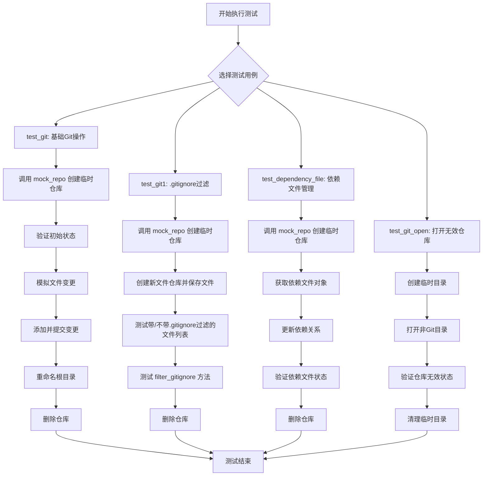

## 类结构

```
test_git_repository.py (测试模块)
├── mock_file (全局辅助函数)
├── mock_repo (全局辅助函数)
└── 测试类 (隐式，由pytest组织)
    ├── test_git (测试方法)
    ├── test_git1 (测试方法)
    ├── test_dependency_file (测试方法)
    └── test_git_open (测试方法)
```

## 全局变量及字段


### `GitRepository.workdir`
    
表示Git仓库的工作目录路径，指向本地文件系统中的仓库根目录。

类型：`Path`
    


### `GitRepository.changed_files`
    
存储当前工作目录中相对于上次提交状态发生变更的文件路径列表，包括新增、修改和删除的文件。

类型：`List[str]`
    


### `GitRepository.status`
    
指示Git仓库当前是否有未提交的变更，True表示存在变更，False表示工作区干净。

类型：`bool`
    


### `GitRepository.is_valid`
    
标识GitRepository对象是否关联了一个有效的Git仓库目录，True表示有效，False表示无效或未初始化。

类型：`bool`
    
    

## 全局函数及方法

### `mock_file`

该函数用于异步地创建或覆盖一个文件，并写入指定的内容。它是对 `awrite` 函数的简单封装，主要用于在单元测试中模拟文件操作。

参数：

- `filename`：`Path` 或 `str`，目标文件的路径。
- `content`：`str`，默认为空字符串，要写入文件的内容。

返回值：`None`，无返回值。

#### 流程图

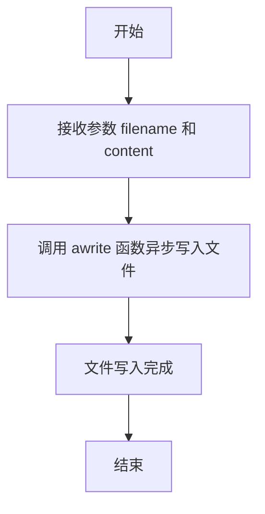

#### 带注释源码

```python
async def mock_file(filename, content=""):
    # 异步地将 content 内容写入到 filename 指定的文件中。
    # 如果文件已存在，则会被覆盖。
    await awrite(filename=filename, data=content)
```

### `mock_repo`

该函数用于创建一个模拟的 Git 仓库，包括初始化仓库、创建测试文件，并返回仓库对象和子目录路径。

参数：

- `local_path`：`Path`，本地路径，用于创建模拟仓库的目录

返回值：`(GitRepository, Path)`，返回一个元组，包含创建的 GitRepository 对象和子目录路径

#### 流程图

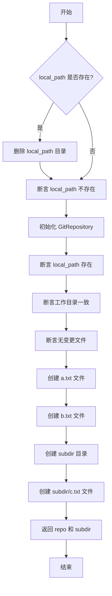

#### 带注释源码

```python
async def mock_repo(local_path) -> (GitRepository, Path):
    # 如果本地路径已存在，则删除该目录及其内容
    if local_path.exists():
        shutil.rmtree(local_path)
    # 断言本地路径不存在
    assert not local_path.exists()
    # 初始化 GitRepository，自动创建仓库
    repo = GitRepository(local_path=local_path, auto_init=True)
    # 断言本地路径存在
    assert local_path.exists()
    # 断言工作目录与本地路径一致
    assert local_path == repo.workdir
    # 断言没有变更文件
    assert not repo.changed_files

    # 创建测试文件 a.txt
    await mock_file(local_path / "a.txt")
    # 创建测试文件 b.txt
    await mock_file(local_path / "b.txt")
    # 创建子目录 subdir
    subdir = local_path / "subdir"
    subdir.mkdir(parents=True, exist_ok=True)
    # 在子目录中创建测试文件 c.txt
    await mock_file(subdir / "c.txt")
    # 返回仓库对象和子目录路径
    return repo, subdir
```

### `test_git`

该函数是一个单元测试，用于验证 `GitRepository` 类的核心功能，包括初始化仓库、添加文件、提交更改、重命名工作目录以及删除仓库等操作。

参数：

- 无显式参数，但通过 `pytest.mark.asyncio` 装饰器支持异步执行。

返回值：`None`，无返回值，仅用于测试验证。

#### 流程图

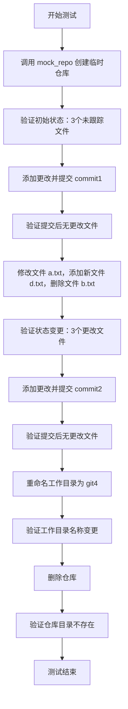

#### 带注释源码

```python
@pytest.mark.asyncio
async def test_git():
    # 定义临时仓库路径
    local_path = Path(__file__).parent / "git"
    # 调用 mock_repo 创建临时仓库并获取仓库对象和子目录
    repo, subdir = await mock_repo(local_path)

    # 验证初始状态：应有3个未跟踪文件（a.txt, b.txt, subdir/c.txt）
    assert len(repo.changed_files) == 3
    # 添加所有更改文件到暂存区
    repo.add_change(repo.changed_files)
    # 提交更改，提交信息为 "commit1"
    repo.commit("commit1")
    # 验证提交后无更改文件
    assert not repo.changed_files

    # 修改文件 a.txt 内容为 "tests"
    await mock_file(local_path / "a.txt", "tests")
    # 在子目录下创建新文件 d.txt
    await mock_file(subdir / "d.txt")
    # 删除文件 b.txt
    rmfile = local_path / "b.txt"
    rmfile.unlink()
    # 验证仓库状态已变更
    assert repo.status

    # 验证更改文件数量为3（修改的a.txt、新增的d.txt、删除的b.txt）
    assert len(repo.changed_files) == 3
    # 添加所有更改文件到暂存区
    repo.add_change(repo.changed_files)
    # 提交更改，提交信息为 "commit2"
    repo.commit("commit2")
    # 验证提交后无更改文件
    assert not repo.changed_files

    # 验证仓库状态（应为 True，表示有提交历史）
    assert repo.status

    # 创建新目录 git4
    exist_dir = repo.workdir / "git4"
    exist_dir.mkdir(parents=True, exist_ok=True)
    # 重命名工作目录为 git4
    repo.rename_root("git4")
    # 验证工作目录名称已变更为 git4
    assert repo.workdir.name == "git4"

    # 删除整个仓库目录
    repo.delete_repository()
    # 验证仓库目录已不存在
    assert not local_path.exists()
```

### `test_git1`

这是一个针对 `GitRepository` 类的单元测试函数，主要测试了仓库的初始化、文件过滤（特别是 `.gitignore` 规则的应用）以及仓库的清理功能。

参数：

-   `无显式参数`：`无`，这是一个使用 `pytest.mark.asyncio` 装饰的异步测试函数，由测试框架自动调用。

返回值：`None`，测试函数通常不返回有意义的值，其成功与否由断言（`assert`）决定。

#### 流程图

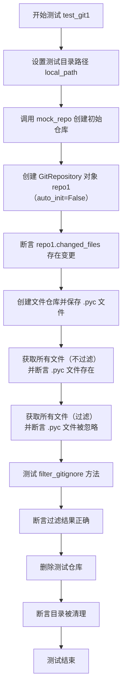

#### 带注释源码

```python
@pytest.mark.asyncio
async def test_git1():
    # 1. 设置测试用的本地目录路径，指向一个名为 "git1" 的子目录。
    local_path = Path(__file__).parent / "git1"
    # 2. 调用辅助函数 mock_repo 来创建并初始化一个临时的 Git 仓库，并填充一些测试文件。
    await mock_repo(local_path)

    # 3. 以 `auto_init=False` 模式打开已存在的仓库。
    #    这测试了 GitRepository 打开现有仓库的能力。
    repo1 = GitRepository(local_path=local_path, auto_init=False)
    # 4. 断言仓库中存在变更的文件（即上一步 mock_repo 创建的文件）。
    assert repo1.changed_files

    # 5. 测试文件仓库功能：创建一个专门用于管理 `__pycache__` 目录的文件仓库对象。
    file_repo = repo1.new_file_repository("__pycache__")
    # 6. 在该文件仓库中保存一个 `.pyc` 文件（Python 字节码缓存文件）。
    await file_repo.save("a.pyc", content="")
    # 7. 获取仓库中的所有文件，包括被 `.gitignore` 规则忽略的文件。
    #    断言 `.pyc` 文件存在于返回的文件列表中。
    all_files = repo1.get_files(relative_path=".", filter_ignored=False)
    assert "__pycache__/a.pyc" in all_files
    # 8. 再次获取文件，但这次应用 `.gitignore` 规则进行过滤。
    #    断言 `.pyc` 文件（通常被 `.gitignore` 排除）不在返回的列表中。
    all_files = repo1.get_files(relative_path=".", filter_ignored=True)
    assert "__pycache__/a.pyc" not in all_files

    # 9. 直接测试 `filter_gitignore` 方法：提供一个文件名列表，过滤掉被忽略的文件。
    #    这里模拟了一个常见场景：`__pycache__` 目录被忽略，而 `.py` 源文件被保留。
    res = repo1.filter_gitignore(filenames=["snake_game/snake_game/__pycache__", "snake_game/snake_game/game.py"])
    # 10. 断言过滤后只保留了 `game.py` 文件。
    assert res == ["snake_game/snake_game/game.py"]

    # 11. 清理：删除整个测试仓库目录。
    repo1.delete_repository()
    # 12. 断言目录已被成功删除，确保测试环境干净。
    assert not local_path.exists()
```

### `test_dependency_file`

该函数是一个单元测试，用于测试 `GitRepository` 类的 `get_dependency` 方法及其返回的依赖文件对象的 `update` 和 `exists` 功能。它验证了依赖文件对象在更新前后其存在状态的变化，以及仓库删除后依赖文件是否随之失效。

参数：

-  `local_path`：`Path`，测试使用的本地Git仓库路径，具体为当前文件父目录下的"git2"子目录。

返回值：`None`，该函数为单元测试，不返回业务值，仅通过断言验证功能。

#### 流程图

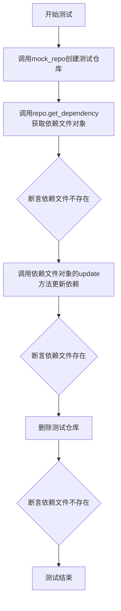

#### 带注释源码

```python
@pytest.mark.asyncio
async def test_dependency_file():
    # 定义测试仓库的本地路径，位于当前测试文件所在目录的“git2”子目录下
    local_path = Path(__file__).parent / "git2"
    # 调用辅助函数mock_repo，创建并初始化一个Git仓库，并返回仓库对象和子目录路径
    repo, subdir = await mock_repo(local_path)

    # 从仓库对象中获取依赖文件对象（DependencyFile实例）
    dependancy_file = await repo.get_dependency()
    # 断言：初始状态下，依赖文件应该不存在
    assert not dependancy_file.exists

    # 调用依赖文件对象的update方法，为其指定一个文件名和一组依赖项
    await dependancy_file.update(filename="a/b.txt", dependencies={"c/d.txt", "e/f.txt"})
    # 断言：更新操作后，依赖文件应该存在
    assert dependancy_file.exists

    # 删除整个测试仓库（包括工作目录）
    repo.delete_repository()
    # 断言：仓库被删除后，依赖文件对象应检测到其关联的实体文件已不存在
    assert not dependancy_file.exists
```

### `test_git_open`

该函数是一个单元测试，用于验证 `GitRepository` 类的 `open` 方法在尝试打开一个非 Git 仓库目录时的行为。它创建一个临时目录，尝试将其作为 Git 仓库打开，并断言仓库处于无效状态且没有工作目录。

参数：

-  `local_path`：`Path`，用于测试的临时目录路径

返回值：`None`，无返回值

#### 流程图

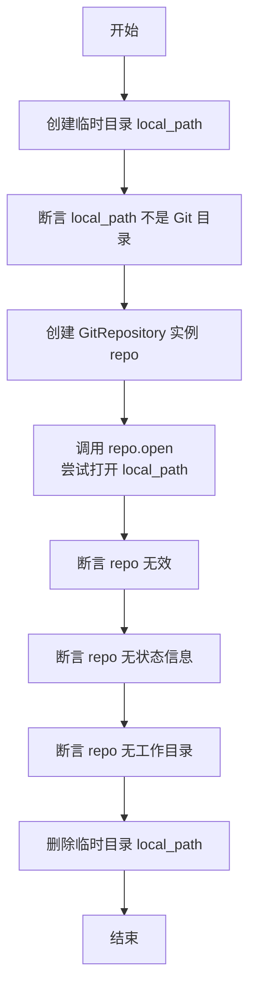

#### 带注释源码

```python
@pytest.mark.asyncio
async def test_git_open():
    # 定义测试用的临时目录路径
    local_path = Path(__file__).parent / "git3"
    # 确保该目录存在，如果不存在则创建
    local_path.mkdir(exist_ok=True, parents=True)

    # 断言：该目录目前不是一个 Git 仓库目录
    assert not GitRepository.is_git_dir(local_path)
    # 创建一个新的 GitRepository 实例
    repo = GitRepository()
    # 尝试将该目录作为 Git 仓库打开，auto_init=False 表示不自动初始化
    repo.open(local_path, auto_init=False)
    # 断言：由于目录不是 Git 仓库，repo 应处于无效状态
    assert not repo.is_valid
    # 断言：repo 应没有状态信息
    assert not repo.status
    # 断言：repo 应没有关联的工作目录
    assert not repo.workdir

    # 测试结束后，清理创建的临时目录
    shutil.rmtree(path=str(local_path), ignore_errors=True)
```

### `GitRepository.__init__`

初始化一个GitRepository对象，用于管理本地Git仓库。根据参数决定是打开现有仓库、初始化新仓库还是创建空对象。

参数：

- `local_path`：`Union[str, Path, None]`，本地Git仓库的路径。如果为None，则创建一个未初始化的GitRepository对象。
- `auto_init`：`bool`，如果为True且`local_path`不存在或不是Git仓库，则自动初始化一个新的Git仓库。
- `init_options`：`Dict[str, Any]`，传递给`git init`命令的额外选项字典。

返回值：`None`，构造函数不返回值。

#### 流程图

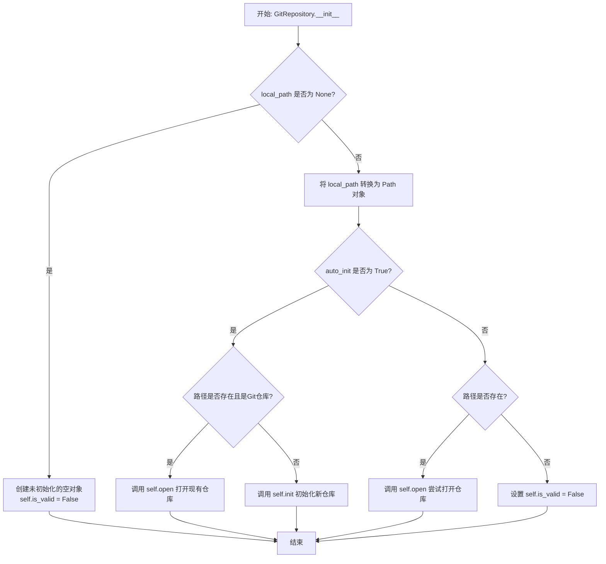

#### 带注释源码

```python
def __init__(self, local_path: Union[str, Path, None] = None, auto_init: bool = True, init_options: Dict[str, Any] = None):
    """
    初始化GitRepository实例。

    Args:
        local_path: 本地Git仓库路径。如果为None，则创建一个未关联本地目录的对象。
        auto_init: 如果为True，当路径不存在或不是Git仓库时，自动执行`git init`。
        init_options: 传递给`git init`命令的额外选项。
    """
    # 初始化实例变量
    self.workdir = None  # 类型: Optional[Path]，工作目录路径
    self.git = None      # 类型: Optional[git.Repo]，gitpython的Repo对象
    self.is_valid = False  # 类型: bool，标识此GitRepository对象是否关联一个有效的本地Git仓库

    # 如果未提供路径，则创建一个未初始化的对象并直接返回
    if local_path is None:
        return

    # 将路径字符串转换为Path对象，便于后续操作
    local_path = Path(local_path)

    # 根据auto_init参数决定行为
    if auto_init:
        # 自动初始化模式
        if local_path.exists() and self.is_git_dir(local_path):
            # 路径已存在且是一个Git仓库，则打开它
            self.open(local_path)
        else:
            # 路径不存在或不是Git仓库，则初始化一个新的仓库
            self.init(local_path, init_options)
    else:
        # 非自动初始化模式
        if local_path.exists():
            # 路径存在，尝试打开（如果它不是Git仓库，open方法会将is_valid设为False）
            self.open(local_path)
        else:
            # 路径不存在，且不自动初始化，则标记对象为无效
            self.is_valid = False
```

### `GitRepository.add_change`

该方法用于将指定的文件添加到Git暂存区，准备进行提交。

参数：

- `files`：`List[Path]`，需要添加到暂存区的文件路径列表

返回值：`None`，无返回值

#### 流程图

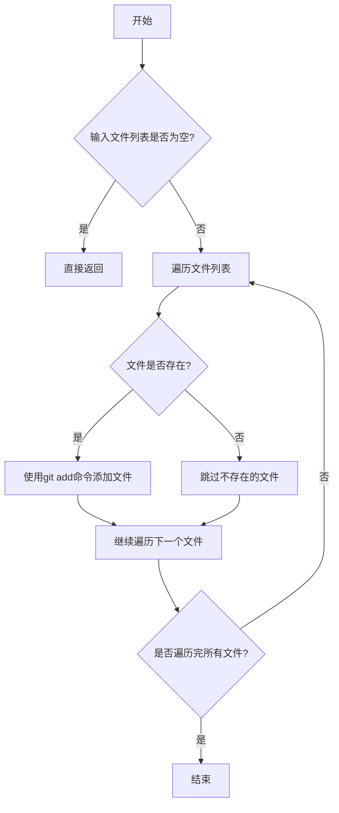

#### 带注释源码

```python
def add_change(self, files: List[Path]):
    """
    将指定的文件添加到Git暂存区。
    
    参数:
        files: 需要添加到暂存区的文件路径列表
        
    说明:
        1. 如果文件列表为空，则直接返回
        2. 遍历文件列表，对每个存在的文件执行git add命令
        3. 不存在的文件会被跳过
    """
    if not files:
        return
    
    # 遍历所有文件，将每个文件添加到暂存区
    for f in files:
        # 检查文件是否存在，只添加存在的文件
        if f.exists():
            # 执行git add命令，将文件添加到暂存区
            self.repo.git.add(str(f))
```

### `GitRepository.commit`

该方法用于将暂存区的更改提交到 Git 仓库，并附带一条提交信息。

参数：

-  `message`：`str`，提交信息，描述本次提交的内容。

返回值：`None`，无返回值。

#### 流程图

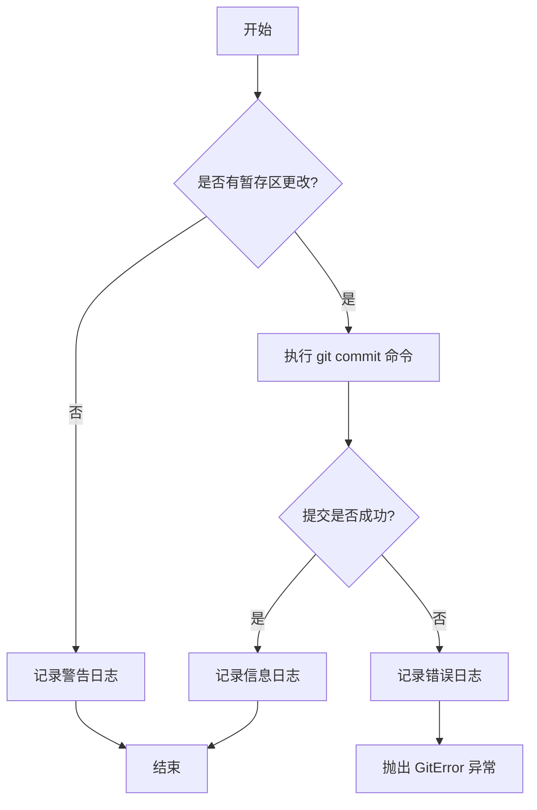

#### 带注释源码

```python
def commit(self, message: str):
    """
    提交暂存区的更改到 Git 仓库。

    该方法使用 `git commit -m` 命令来提交更改。如果暂存区没有更改，则记录一条警告日志。
    如果提交过程中发生错误，将记录错误日志并抛出 GitError 异常。

    Args:
        message (str): 提交信息，用于描述本次提交的内容。

    Raises:
        GitError: 如果提交过程中发生错误。

    Returns:
        None
    """
    # 检查暂存区是否有更改
    if not self.repo.index.diff("HEAD"):
        # 如果没有更改，记录警告日志
        logger.warning("No changes to commit.")
        return

    try:
        # 执行 git commit 命令
        self.repo.index.commit(message)
        # 提交成功后记录信息日志
        logger.info(f"Committed with message: {message}")
    except Exception as e:
        # 如果提交失败，记录错误日志并抛出异常
        logger.error(f"Failed to commit: {e}")
        raise GitError(f"Failed to commit: {e}")
```

### `GitRepository.rename_root`

重命名Git仓库的根目录（工作目录）到新的名称，并更新内部状态以反映新的工作目录路径。

参数：

- `new_name`：`str`，新的根目录名称

返回值：`None`，无返回值

#### 流程图

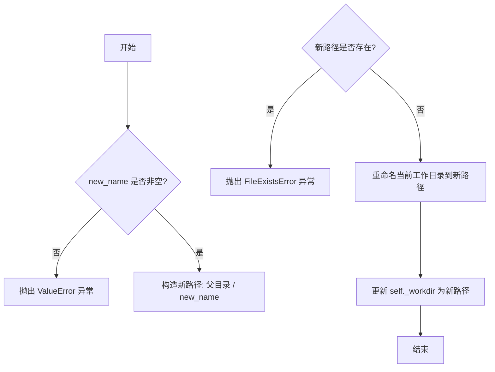

#### 带注释源码

```python
def rename_root(self, new_name: str):
    """
    重命名Git仓库的根目录（工作目录）到新的名称，并更新内部状态以反映新的工作目录路径。

    参数:
        new_name (str): 新的根目录名称。

    异常:
        ValueError: 如果 `new_name` 为空字符串。
        FileExistsError: 如果目标目录已存在。

    注意:
        此方法会物理移动文件系统中的目录，并更新对象的 `_workdir` 属性。
    """
    # 检查新名称是否有效
    if not new_name:
        raise ValueError("new_name cannot be empty")
    
    # 获取当前工作目录的父目录
    parent = self._workdir.parent
    # 构造完整的新路径
    new_path = parent / new_name
    
    # 检查目标路径是否已存在
    if new_path.exists():
        raise FileExistsError(f"Target directory already exists: {new_path}")
    
    # 执行重命名操作
    self._workdir.rename(new_path)
    # 更新内部工作目录引用
    self._workdir = new_path
```

### `GitRepository.delete_repository`

该方法用于删除当前Git仓库的本地工作目录及其所有内容，包括.git目录。它会递归删除整个工作目录，确保所有相关文件被清理。

参数：无

返回值：`None`，无返回值

#### 流程图

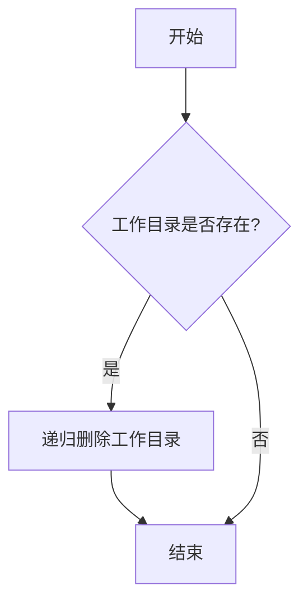

#### 带注释源码

```python
def delete_repository(self):
    """删除当前Git仓库的本地工作目录及其所有内容，包括.git目录。"""
    if self.workdir.exists():  # 检查工作目录是否存在
        shutil.rmtree(self.workdir)  # 递归删除整个工作目录
```

### `GitRepository.new_file_repository`

创建一个新的 `FileRepository` 实例，用于在指定子目录下进行文件操作。该方法会基于当前 Git 仓库的根目录和给定的相对路径，构建一个新的 `FileRepository` 对象，方便在特定子目录中进行文件的保存、读取等操作。

参数：

- `relative_path`：`str`，相对于 Git 仓库根目录的子目录路径。如果该路径不存在，会自动创建。

返回值：`FileRepository`，返回一个配置好的 `FileRepository` 实例，其根目录指向 Git 仓库下的 `relative_path` 子目录。

#### 流程图

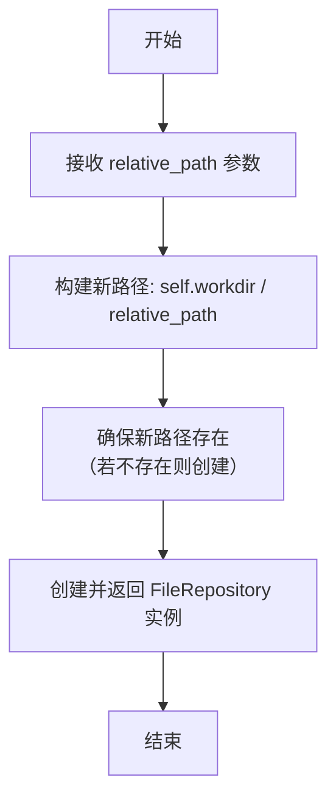

#### 带注释源码

```python
def new_file_repository(self, relative_path: str) -> "FileRepository":
    """
    创建一个新的 FileRepository 实例，用于在指定子目录下进行文件操作。

    参数:
        relative_path (str): 相对于 Git 仓库根目录的子目录路径。

    返回:
        FileRepository: 一个配置好的 FileRepository 实例。
    """
    # 基于当前 Git 仓库的工作目录和给定的相对路径，构建新的目录路径。
    new_root = self.workdir / relative_path
    # 确保目标目录存在，如果不存在则创建它（包括所有父目录）。
    new_root.mkdir(parents=True, exist_ok=True)
    # 创建并返回一个 FileRepository 实例，其根目录设置为新构建的路径。
    return FileRepository(root=new_root)
```

### `GitRepository.get_files`

该方法用于获取Git仓库中指定相对路径下的所有文件列表，可选择是否过滤被`.gitignore`忽略的文件。

参数：

- `relative_path`：`Union[str, Path]`，相对于Git仓库工作目录的路径，用于指定要搜索文件的目录。
- `filter_ignored`：`bool`，是否过滤被`.gitignore`规则忽略的文件，默认为`True`。

返回值：`List[str]`，返回一个字符串列表，包含指定路径下所有文件的相对路径（相对于Git仓库根目录）。

#### 流程图

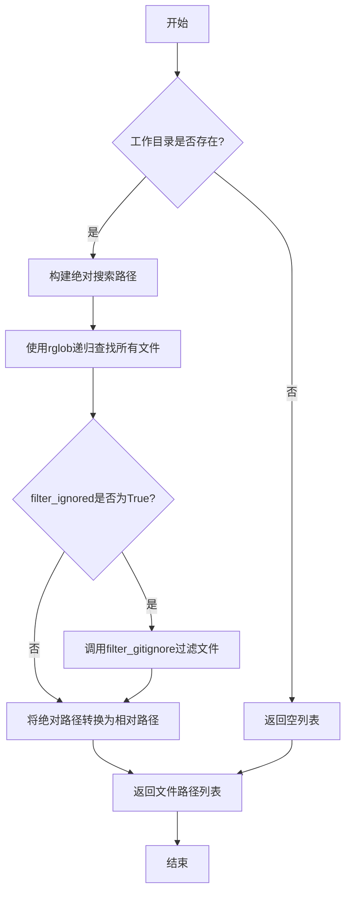

#### 带注释源码

```python
def get_files(self, relative_path: Union[str, Path] = ".", filter_ignored: bool = True) -> List[str]:
    """
    获取Git仓库中指定路径下的所有文件。

    Args:
        relative_path (Union[str, Path]): 相对于Git仓库工作目录的路径。
        filter_ignored (bool): 是否过滤被.gitignore忽略的文件。

    Returns:
        List[str]: 文件相对路径列表。
    """
    # 如果工作目录不存在，直接返回空列表
    if not self.workdir:
        return []

    # 构建要搜索的绝对路径
    search_path = self.workdir / relative_path

    # 使用rglob递归查找该目录下的所有文件（不包括目录本身）
    # 结果转换为绝对路径字符串列表
    files = [str(f) for f in search_path.rglob("*") if f.is_file()]

    # 如果需要过滤被.gitignore忽略的文件
    if filter_ignored:
        # 调用filter_gitignore方法进行过滤
        files = self.filter_gitignore(files)

    # 将绝对路径转换为相对于Git仓库根目录的相对路径
    # 使用Path对象的relative_to方法，并转换为字符串
    files = [str(Path(f).relative_to(self.workdir)) for f in files]

    return files
```

### `GitRepository.filter_gitignore`

该方法用于过滤掉符合 `.gitignore` 规则的文件名列表，返回一个不包含被忽略文件的新列表。

参数：

- `filenames`：`List[str]`，需要过滤的文件名列表

返回值：`List[str]`，过滤后的文件名列表，不包含被 `.gitignore` 规则匹配的文件

#### 流程图

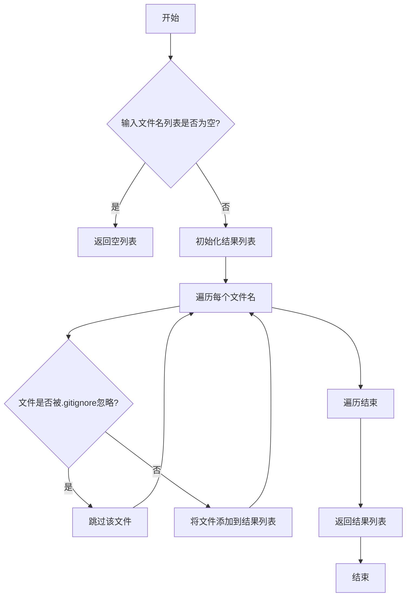

#### 带注释源码

```python
def filter_gitignore(self, filenames: List[str]) -> List[str]:
    """
    过滤掉符合.gitignore规则的文件名
    
    Args:
        filenames: 需要过滤的文件名列表
        
    Returns:
        过滤后的文件名列表，不包含被.gitignore规则匹配的文件
    """
    # 如果输入列表为空，直接返回空列表
    if not filenames:
        return []
    
    # 初始化结果列表
    result = []
    
    # 遍历每个文件名
    for filename in filenames:
        # 检查文件是否被.gitignore规则忽略
        if not self._is_ignored(filename):
            # 如果没有被忽略，添加到结果列表
            result.append(filename)
    
    # 返回过滤后的结果
    return result
```

### `GitRepository.get_dependency`

该方法用于获取或创建一个 `DependencyFile` 对象，该对象用于管理 Git 仓库中的依赖关系文件（默认为 `.dependency.json`）。如果文件不存在，则返回一个表示不存在的 `DependencyFile` 对象；如果文件存在，则加载其内容并返回。

参数：

-  `self`：`GitRepository`，当前 GitRepository 实例

返回值：`DependencyFile`，返回一个 `DependencyFile` 对象，用于管理依赖关系文件

#### 流程图

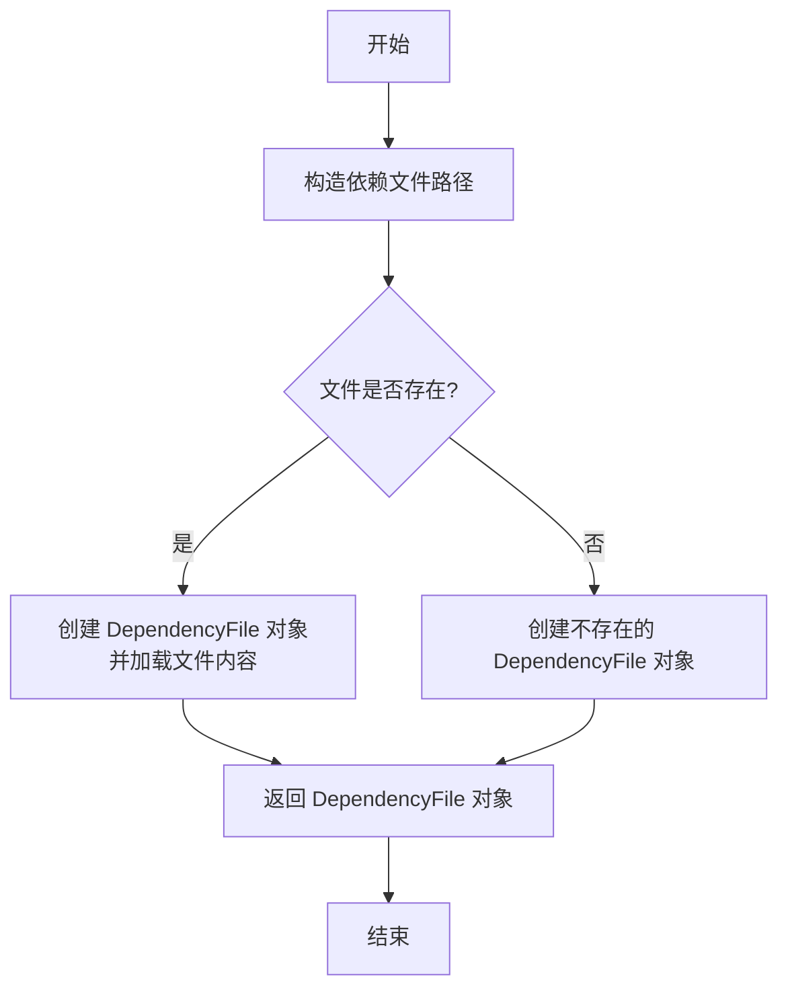

#### 带注释源码

```python
async def get_dependency(self) -> DependencyFile:
    """Get or create a DependencyFile object for managing dependency relationships in the Git repository.

    Returns:
        DependencyFile: A DependencyFile object for managing the dependency file.
    """
    # 构造依赖文件的路径，默认为工作目录下的 .dependency.json
    dependency_file = self.workdir / ".dependency.json"
    # 创建 DependencyFile 对象，传入文件路径和 GitRepository 实例
    df = DependencyFile(root=self.workdir, path=dependency_file, git_repo=self)
    # 如果依赖文件存在，则加载其内容
    if dependency_file.exists():
        await df.load()
    # 返回 DependencyFile 对象
    return df
```

### `GitRepository.open`

该方法用于打开一个已存在的 Git 仓库或初始化一个新的 Git 仓库。如果指定路径不是一个有效的 Git 仓库，并且 `auto_init` 参数为 `True`，则会自动初始化一个新的仓库；否则，将保持仓库为无效状态。

参数：

- `local_path`：`Path`，本地文件系统路径，指向要打开或初始化的 Git 仓库目录。
- `auto_init`：`bool`，如果为 `True`，当指定路径不是 Git 仓库时，会自动初始化一个新的 Git 仓库；如果为 `False`，则不会初始化，仓库将保持无效状态。

返回值：`None`，无返回值。该方法会更新 `GitRepository` 实例的内部状态，包括 `workdir`、`is_valid` 和 `status` 等属性。

#### 流程图

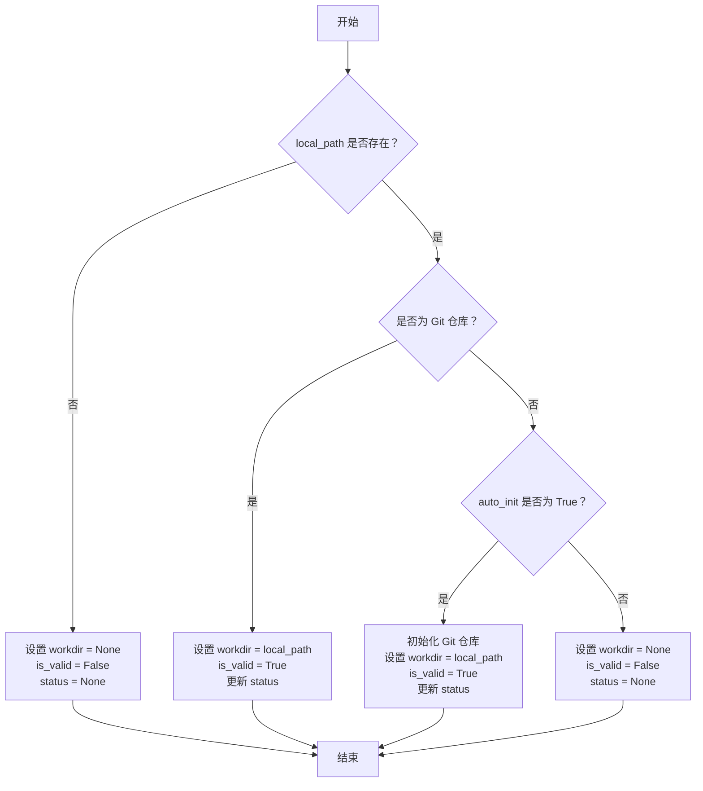

#### 带注释源码

```python
def open(self, local_path: Path, auto_init: bool = True):
    """
    打开一个已存在的 Git 仓库或初始化一个新的 Git 仓库。

    参数:
        local_path (Path): 本地文件系统路径，指向要打开或初始化的 Git 仓库目录。
        auto_init (bool): 如果为 True，当指定路径不是 Git 仓库时，会自动初始化一个新的 Git 仓库；
                          如果为 False，则不会初始化，仓库将保持无效状态。

    返回值:
        None: 无返回值。该方法会更新 GitRepository 实例的内部状态。
    """
    # 检查指定路径是否存在
    if not local_path.exists():
        # 如果路径不存在，设置仓库为无效状态
        self.workdir = None
        self.is_valid = False
        self.status = None
        return

    # 检查指定路径是否为 Git 仓库
    if self.is_git_dir(local_path):
        # 如果是 Git 仓库，设置工作目录并更新状态
        self.workdir = local_path
        self.is_valid = True
        self.update_status()
    else:
        # 如果不是 Git 仓库，根据 auto_init 参数决定是否初始化
        if auto_init:
            # 初始化新的 Git 仓库
            self.init(local_path)
            self.workdir = local_path
            self.is_valid = True
            self.update_status()
        else:
            # 不初始化，设置仓库为无效状态
            self.workdir = None
            self.is_valid = False
            self.status = None
```

### `GitRepository.is_git_dir`

`GitRepository.is_git_dir` 是一个静态方法，用于判断给定的路径是否是一个有效的 Git 仓库目录。它通过检查该路径下是否存在 `.git` 子目录或文件来确定。

参数：

- `path`：`Path`，需要检查的路径对象。

返回值：`bool`，如果路径是一个有效的 Git 仓库目录则返回 `True`，否则返回 `False`。

#### 流程图

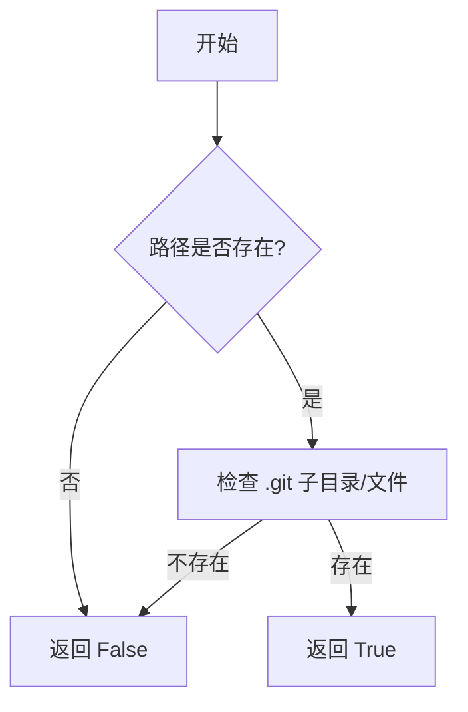

#### 带注释源码

```python
@staticmethod
def is_git_dir(path: Path) -> bool:
    """
    检查给定路径是否是一个 Git 仓库目录。

    参数:
        path (Path): 需要检查的路径。

    返回:
        bool: 如果路径是一个 Git 仓库目录则返回 True，否则返回 False。
    """
    # 检查路径是否存在
    if not path.exists():
        return False
    # 检查路径下是否存在 .git 子目录或文件
    git_dir = path / ".git"
    return git_dir.exists()
```

## 关键组件


### GitRepository 类

GitRepository 类是 Git 仓库的核心封装，提供了 Git 仓库的初始化、打开、文件状态管理、提交、重命名、删除等操作，并支持通过 `.gitignore` 规则过滤文件。

### 文件仓库 (FileRepository)

通过 `GitRepository.new_file_repository` 方法创建，用于在 Git 仓库的特定子目录（如 `__pycache__`）内进行文件操作，其行为受父 Git 仓库的 `.gitignore` 规则约束。

### 依赖关系文件 (DependencyFile)

通过 `GitRepository.get_dependency` 方法获取，用于管理文件间的依赖关系。它支持更新指定文件的依赖集，并能持久化存储这些依赖信息。

### Git 操作封装

代码封装了底层的 Git 命令操作，如 `git init`, `git add`, `git commit`, `git status` 等，通过类方法提供高层接口，简化了版本控制流程。

### 路径与状态管理

管理 Git 仓库的工作目录路径 (`workdir`)，跟踪仓库的变更文件列表 (`changed_files`)，并判断仓库的有效性 (`is_valid`) 和状态 (`status`)。

### .gitignore 规则过滤

提供了 `filter_gitignore` 方法，能够根据仓库的 `.gitignore` 规则过滤掉不应被版本控制的文件（如 `__pycache__` 目录下的文件）。


## 问题及建议


### 已知问题

-   **测试代码中的路径清理不彻底**：测试函数 `test_git`、`test_git1`、`test_dependency_file` 在结束时都调用了 `repo.delete_repository()` 来删除测试目录。然而，`test_git_open` 函数在测试失败或异常退出时，可能不会执行到 `shutil.rmtree` 语句，导致测试目录 `git3` 残留。这违反了测试的独立性原则，可能影响后续测试的执行。
-   **测试数据污染风险**：测试函数创建的临时目录（`git`， `git1`， `git2`， `git3`）位于与测试文件相同的父目录下。如果测试运行被意外中断，这些目录可能不会被清理，从而污染项目结构，并可能被误认为是有效的代码目录。
-   **缺少对 `GitRepository` 类边界条件的测试**：当前测试主要覆盖了正常流程，但缺少对一些边界或异常情况的测试，例如：对已存在的仓库进行重复初始化（`auto_init=True`）、在无效路径上执行操作、测试 `add_change` 和 `commit` 方法在无变更文件时的行为等。
-   **异步测试的潜在问题**：测试函数被标记为 `@pytest.mark.asyncio`，但 `mock_repo` 辅助函数和 `mock_file` 函数也是异步的。虽然当前使用方式正确，但在更复杂的测试场景或并发环境下，需要确保异步调用的正确性和资源清理的时机。

### 优化建议

-   **使用 pytest 的临时目录夹具**：建议使用 `pytest` 提供的 `tmp_path` 或 `tmpdir` 夹具来创建临时测试目录。这些夹具能确保测试结束后自动清理目录，从根本上解决测试数据残留和污染的问题，使测试更加健壮和独立。
-   **增强测试覆盖范围**：补充针对 `GitRepository` 类关键方法的负面测试用例和边界条件测试。例如，测试 `open` 方法在非 Git 目录且 `auto_init=False` 时的行为，测试 `commit` 时没有暂存变更的情况，测试 `get_files` 方法在不同过滤条件下的准确性等。
-   **重构测试辅助函数**：考虑将 `mock_repo` 函数也改为使用 `tmp_path` 夹具，使其接收一个基础路径参数，而不是在函数内部硬编码构建路径。这可以提高测试辅助函数的可重用性和清晰度。
-   **明确测试依赖与清理**：确保每个测试函数都是自包含的，其前置（setup）和后置（teardown）逻辑清晰。对于 `test_git_open` 这类可能无法通过被测对象本身清理资源的测试，应使用 `try...finally` 块或 `pytest` 的夹具来保证清理操作一定会执行。
-   **考虑添加集成测试标签**：当前测试涉及文件系统操作和外部 Git 命令调用，属于集成测试范畴。可以考虑使用 `@pytest.mark.integration` 等标签进行标记，以便在需要时快速运行或跳过这部分测试。


## 其它


### 设计目标与约束

本测试代码的设计目标是验证 `GitRepository` 类的核心功能，包括仓库初始化、文件操作（增删改）、变更管理（`add_change`, `commit`）、状态查询、`.gitignore` 过滤、依赖文件管理以及仓库的打开、重命名和删除。约束条件包括：1) 使用 `pytest` 异步测试框架；2) 每个测试用例需独立创建和清理临时目录，避免测试间相互影响；3) 测试应覆盖正常流程和边界条件（如无效仓库打开）。

### 错误处理与异常设计

测试代码本身不包含复杂的错误处理逻辑，其目的是验证 `GitRepository` 类在特定输入下的行为是否符合预期。测试通过 `assert` 语句来验证结果，若断言失败则测试不通过，这间接测试了被测试代码的错误处理能力。例如，`test_git_open` 测试了打开一个非 Git 仓库目录时，`GitRepository` 实例的 `is_valid` 属性应为 `False`。测试代码通过 `try-except` 或依赖 `pytest.raises` 来验证被测试代码是否抛出了预期的异常（虽然当前代码片段未展示此模式）。

### 数据流与状态机

测试代码的数据流围绕 `GitRepository` 实例的状态变化展开：
1.  **初始状态**：通过 `mock_repo` 创建新仓库，初始状态为 `changed_files` 为空。
2.  **变更状态**：通过 `mock_file` 创建或修改文件后，`changed_files` 列表更新。
3.  **暂存与提交状态**：调用 `add_change` 和 `commit` 后，`changed_files` 应清空，仓库生成新的提交记录。
4.  **清理状态**：每个测试用例最后调用 `delete_repository`，将工作目录完全删除，状态回归到初始不存在状态。
测试通过验证这些状态转换的正确性来确保 `GitRepository` 类的核心逻辑。

### 外部依赖与接口契约

1.  **外部依赖**：
    *   `metagpt.utils.git_repository.GitRepository`: 被测试的核心类。
    *   `metagpt.utils.common.awrite`: 用于异步写入文件的工具函数。
    *   `pytest` 及 `pytest.mark.asyncio`: 测试框架和异步测试支持。
    *   `pathlib.Path`, `shutil`: 标准库，用于路径操作和目录清理。
2.  **接口契约**：
    *   `mock_repo` 辅助函数：契约是接收一个 `Path` 对象，返回一个初始化好的 `GitRepository` 实例和一个子目录 `Path` 对象。它负责创建临时目录和初始文件。
    *   `GitRepository` 类的方法：测试用例依赖于其公开 API（如 `workdir`, `changed_files`, `add_change`, `commit`, `get_files`, `filter_gitignore`, `get_dependency`, `open`, `delete_repository`）的行为契约。测试验证这些方法在给定输入下产生预期的输出或状态改变。

    