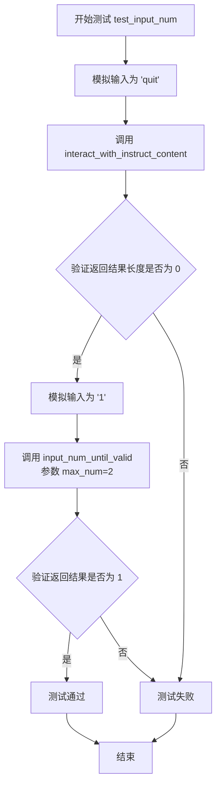
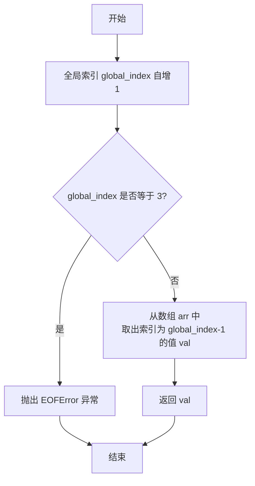

# `.\MetaGPT\tests\metagpt\utils\test_human_interaction.py` 详细设计文档

该代码是一个针对 HumanInteraction 类的单元测试文件，主要测试其与用户交互以收集和验证结构化指令内容的功能。核心功能包括：模拟用户输入以测试交互流程、验证输入数据类型、以及测试在多种输入场景下（包括正常输入、忽略、退出和异常）的健壮性。

## 整体流程

```mermaid
graph TD
    A[开始测试] --> B{测试函数选择}
    B --> C[test_input_num]
    B --> D[test_check_input_type]
    B --> E[test_human_interact_valid_content]
    C --> C1[模拟输入'quit']
    C1 --> C2[调用interact_with_instruct_content]
    C2 --> C3[断言结果长度为0]
    C --> C4[模拟输入'1']
    C4 --> C5[调用input_num_until_valid]
    C5 --> C6[断言返回值为1]
    D --> D1[测试字符串类型检查]
    D1 --> D2[断言检查通过]
    D --> D3[测试列表字符串类型检查]
    D3 --> D4[断言检查通过]
    D --> D5[测试无效列表字符串类型检查]
    D5 --> D6[断言检查失败]
    E --> E1[设置模拟输入序列]
    E1 --> E2[调用interact_with_instruct_content (review模式)]
    E2 --> E3[断言收集到一个字段内容]
    E1 --> E4[重置索引，调用interact_with_instruct_content (revise模式)]
    E4 --> E5[断言收集到一个字段内容]
```

## 类结构

```
BaseModel (Pydantic)
└── InstructContent (测试用数据模型)

HumanInteraction (被测试类，来自metagpt.utils.human_interaction)

全局函数 (测试函数)
├── test_input_num
├── test_check_input_type
└── test_human_interact_valid_content

辅助函数
└── mock_input
```

## 全局变量及字段


### `data_mapping`
    
一个字典，用于映射字段名到其期望的类型和约束条件，用于指导用户输入验证。

类型：`dict[str, tuple[type, ...]]`
    


### `human_interaction`
    
HumanInteraction 类的实例，用于管理与用户交互的逻辑，如输入验证和内容收集。

类型：`HumanInteraction`
    


### `global_index`
    
全局计数器，用于在模拟用户输入时跟踪当前输入调用的索引，以返回预设的输入序列。

类型：`int`
    


### `InstructContent.test_field1`
    
InstructContent 模型中的一个字符串字段，用于存储测试数据。

类型：`str`
    


### `InstructContent.test_field2`
    
InstructContent 模型中的一个字符串列表字段，用于存储测试数据列表。

类型：`list[str]`
    
    

## 全局函数及方法


### `test_input_num`

该函数是一个单元测试函数，用于测试 `HumanInteraction` 类中与数字输入验证相关的功能。它通过模拟用户输入来验证 `input_num_until_valid` 方法是否能正确处理边界情况（如输入"quit"退出）和有效数字输入。

参数：

- `mocker`：`pytest-mock` 提供的 `MockerFixture` 类型，用于模拟（mock）Python内置函数或对象，以便在测试中控制外部依赖的行为。

返回值：`None`，单元测试函数通常不返回有意义的值，其目的是通过断言（assert）来验证代码行为。

#### 流程图



#### 带注释源码

```python
def test_input_num(mocker):
    # 使用 mocker 模拟内置的 input 函数，使其在调用时始终返回字符串 "quit"
    mocker.patch("builtins.input", lambda _: "quit")

    # 调用 HumanInteraction 实例的 interact_with_instruct_content 方法
    # 预期当用户输入"quit"时，该方法应返回一个空列表（或字典），表示没有有效的交互内容
    interact_contents = human_interaction.interact_with_instruct_content(InstructContent(), data_mapping)
    # 断言：验证返回的 interact_contents 长度是否为 0，确保"quit"触发了正确的退出逻辑
    assert len(interact_contents) == 0

    # 再次使用 mocker 模拟 input 函数，这次使其始终返回字符串 "1"
    mocker.patch("builtins.input", lambda _: "1")
    # 调用 input_num_until_valid 方法，参数 max_num=2 表示允许的有效数字范围是 1 或 2
    input_num = human_interaction.input_num_until_valid(2)
    # 断言：验证方法返回的数字是否为 1，确保它能正确解析字符串"1"并返回整数 1
    assert input_num == 1
```


### `HumanInteraction.check_input_type`

该方法用于检查用户输入的字符串是否符合指定的类型要求。它尝试将输入字符串转换为目标类型，并根据转换是否成功返回布尔值和转换结果（或错误信息）。

参数：

-  `input_str`：`str`，需要检查类型的用户输入字符串。
-  `req_type`：`type`，期望的目标数据类型（例如 `str`, `list[str]`）。

返回值：`tuple[bool, Any | str]`，返回一个元组。第一个元素是布尔值，表示类型检查是否成功；第二个元素是转换成功后的结果（如果成功）或错误信息字符串（如果失败）。

#### 流程图

```mermaid
flowchart TD
    A[开始] --> B{尝试将 input_str 转换为 req_type}
    B -- 转换成功 --> C[返回 (True, 转换结果)]
    B -- 转换失败 --> D[返回 (False, 错误信息)]
    C --> E[结束]
    D --> E
```

#### 带注释源码

```python
def check_input_type(self, input_str: str, req_type: type) -> tuple[bool, Any | str]:
    """
    检查输入字符串是否符合指定的类型要求。

    Args:
        input_str (str): 用户输入的字符串。
        req_type (type): 期望的目标数据类型。

    Returns:
        tuple[bool, Any | str]: 一个元组，第一个元素表示检查是否通过（布尔值），
                                第二个元素是转换后的结果（如果成功）或错误信息（如果失败）。
    """
    try:
        # 尝试将输入字符串转换为目标类型
        # 对于 str 类型，直接返回原字符串
        # 对于 list[str] 等复杂类型，使用 ast.literal_eval 进行安全求值
        if req_type == str:
            result = input_str
        else:
            result = ast.literal_eval(input_str)
            # 可选：可以在这里添加进一步的类型验证，例如确保结果是 list[str]
            # 但当前实现主要依赖 literal_eval 的成功与否
        return True, result
    except Exception as e:
        # 如果转换失败，返回 False 和错误信息
        return False, str(e)
```


### `mock_input`

这是一个用于模拟用户输入的函数，主要用于单元测试。它通过一个全局索引`global_index`来按顺序返回预设的输入值数组`arr`中的元素。当索引指向特定位置（例如索引为3）时，会模拟输入流结束（EOFError）的情况，以测试代码对异常输入的处理能力。

参数：

-  `*args`：`tuple`，可变位置参数，用于接收`input`函数可能传入的提示信息参数，但在此模拟函数中未使用。
-  `**kwargs`：`dict`，可变关键字参数，用于接收`input`函数可能传入的命名参数，但在此模拟函数中未使用。

返回值：`str`，返回预设输入数组`arr`中对应索引的字符串值。

#### 流程图



#### 带注释源码

```python
def mock_input(*args, **kwargs):
    """there are multi input call, return it by global_index"""
    # 预设的输入值序列，用于模拟用户的不同输入
    arr = ["1", '["test"]', "ignore", "quit"]
    # 声明使用全局变量 global_index，用于记录当前模拟到了第几次输入调用
    global global_index
    # 每次调用，全局索引加1
    global_index += 1
    # 当索引为3时，模拟输入流结束（例如用户按下了Ctrl+D）
    if global_index == 3:
        raise EOFError()
    # 根据当前索引（注意减1以匹配数组下标）获取预设的输入值
    val = arr[global_index - 1]
    # 返回模拟的输入值
    return val
```


### `test_human_interact_valid_content`

这是一个单元测试函数，用于测试 `HumanInteraction` 类的 `interact_with_instruct_content` 方法。它通过模拟用户输入（包括有效输入、无效输入和退出指令）来验证该方法在“review”和“revise”两种模式下，能否正确地处理交互、过滤无效内容并返回有效的字段数据。

参数：

-  `mocker`：`pytest-mock` 提供的 `MockerFixture` 类型对象，用于模拟（mock）函数或方法的行为，在本测试中主要用于模拟 `builtins.input` 函数。

返回值：`None`，这是一个单元测试函数，不返回任何值，其目的是通过断言（assert）来验证代码行为。

#### 流程图

```mermaid
flowchart TD
    A[开始测试] --> B[模拟输入函数 mock_input]
    B --> C[调用 interact_with_instruct_content<br>模式为 'review']
    C --> D{断言结果长度是否为1<br>且 test_field2 值为 '["test"]'?}
    D -->|是| E[重置全局索引 global_index]
    E --> F[再次调用 interact_with_instruct_content<br>模式为 'revise']
    F --> G{断言结果长度是否为1<br>且 test_field2 值为 ["test"]?}
    G -->|是| H[测试通过]
    D -->|否| I[测试失败]
    G -->|否| I
```

#### 带注释源码

```python
def test_human_interact_valid_content(mocker):
    # 使用 mocker 将内置的 input 函数替换为自定义的 mock_input 函数。
    # mock_input 函数会按预定义的序列返回输入值，以模拟用户的不同操作。
    mocker.patch("builtins.input", mock_input)
    
    # 测试场景1: 模式为 "review"
    # 创建一个新的 HumanInteraction 实例，并调用其 interact_with_instruct_content 方法。
    # 传入一个空的 InstructContent 对象、数据映射 data_mapping 和模式字符串 "review"。
    # 该方法预期会与模拟的用户进行交互，并返回有效的字段内容。
    input_contents = HumanInteraction().interact_with_instruct_content(InstructContent(), data_mapping, "review")
    
    # 断言1: 返回的字典应该只包含一个键值对（因为 mock_input 序列中只有一次有效输入）。
    assert len(input_contents) == 1
    # 断言2: 返回的字典中，键 "test_field2" 对应的值应该是字符串 '["test"]'。
    # 注意在 "review" 模式下，列表类型的输入可能以字符串形式返回。
    assert input_contents["test_field2"] == '["test"]'

    # 重置全局变量 global_index，以便为下一个测试场景准备相同的输入序列。
    global global_index
    global_index = 0
    
    # 测试场景2: 模式为 "revise"
    # 再次调用 interact_with_instruct_content 方法，但此次模式改为 "revise"。
    input_contents = HumanInteraction().interact_with_instruct_content(InstructContent(), data_mapping, "revise")
    
    # 断言3: 返回的字典应该同样只包含一个键值对。
    assert len(input_contents) == 1
    # 断言4: 在 "revise" 模式下，键 "test_field2" 对应的值应该被正确解析为 Python 列表 ["test"]。
    assert input_contents["test_field2"] == ["test"]
```


## 关键组件


### HumanInteraction 类

提供与用户进行交互的功能，支持通过命令行输入来填充或修改指定的数据结构，并包含输入验证和类型检查机制。

### InstructContent 类

一个基于 Pydantic 的模型类，用于定义需要与用户交互的数据结构，包含测试字段以验证交互逻辑。

### data_mapping 字典

定义了字段名到其期望类型和约束的映射，用于在交互过程中指导用户输入并验证输入数据的类型和格式。

### 输入验证与类型检查

通过 `check_input_type` 方法验证用户输入是否符合预期的数据类型，支持字符串和列表等类型的检查，确保输入数据的有效性。

### 交互流程控制

通过 `interact_with_instruct_content` 方法控制与用户的交互流程，支持多次输入、类型验证、错误处理以及用户中断（如输入 "quit"）的功能。

### 模拟输入与测试

在单元测试中通过模拟输入（如 `mock_input` 函数）来验证交互逻辑的正确性，包括正常输入、异常输入和用户中断场景的测试。


## 问题及建议


### 已知问题

-   **全局变量 `global_index` 在测试中引入状态污染**：`test_human_interact_valid_content` 函数及其内部的 `mock_input` 函数使用了全局变量 `global_index` 来模拟多次输入。这导致测试用例之间存在状态依赖，当测试执行顺序改变或并行执行时，可能导致不可预测的失败。
-   **`mock_input` 函数设计脆弱**：该函数通过硬编码的输入序列 `["1", '["test"]', "ignore", "quit"]` 和全局索引来模拟输入。如果被测试的 `HumanInteraction.interact_with_instruct_content` 方法的内部逻辑发生变化（例如，调用 `input()` 的次数或顺序改变），此模拟函数将无法正确工作，导致测试失败，且错误原因难以排查。
-   **测试数据 `data_mapping` 定义与 `InstructContent` 模型存在冗余**：`data_mapping` 在测试中手动定义，其内容与 `InstructContent` 类的Pydantic模型定义（`test_field1: str`, `test_field2: list[str]`）本质上是重复的。这增加了维护成本，当模型字段变更时，需要同步更新两处。
-   **`check_input_type` 测试用例的输入字符串具有误导性**：测试中使用了输入字符串 `'{"key", "value"}'` 来测试 `list[str]` 类型，但此字符串格式既不是有效的Python列表字面量，也不是JSON数组格式，导致断言 `assert not ret` 虽然通过，但未能清晰测试方法对标准格式（如JSON）的解析能力，降低了测试的明确性和价值。

### 优化建议

-   **使用 `mocker` 的 `side_effect` 替代自定义的 `mock_input` 和全局变量**：重构 `test_human_interact_valid_content` 测试，利用 `mocker.patch` 的 `side_effect` 参数直接提供一个可迭代的返回值序列（如 `side_effect=["1", '["test"]', "ignore", "quit"]`）。这可以消除对全局变量 `global_index` 的依赖，使测试更简洁、可靠，且易于理解。
-   **从 `InstructContent` 模型自动生成 `data_mapping`**：考虑在 `HumanInteraction` 类或测试工具中提供一个辅助函数，能够根据Pydantic模型的类型注解自动生成 `data_mapping` 字典。这样可以确保数据映射始终与模型定义同步，减少维护开销和人为错误。
-   **增强 `check_input_type` 测试的清晰度**：修改针对 `list[str]` 等复杂类型的测试用例，使用标准的、可解析的字符串格式（如JSON格式的 `'["test", "string"]'`）作为有效输入，并使用明显无效的格式（如 `"not a list"`）作为无效输入。这能使测试意图更明确，并更好地验证方法的核心解析逻辑。
-   **考虑为 `HumanInteraction` 增加输入验证和转换的单元测试**：当前测试主要覆盖交互流程。建议增加更细粒度的单元测试，专门针对 `check_input_type` 方法以及 `interact_with_instruct_content` 中负责将字符串输入转换为目标类型（如将JSON字符串解析为Python列表）的内部逻辑进行测试，确保边界情况和错误处理得到充分覆盖。


## 其它


### 设计目标与约束

本模块的核心设计目标是提供一个灵活、可扩展的人机交互框架，用于在自动化流程中收集结构化的用户输入。其核心约束包括：1) 必须支持通过Pydantic模型定义数据结构；2) 必须能够验证用户输入是否符合预定义的类型和格式；3) 必须提供优雅的退出机制（如输入“quit”）；4) 必须能够处理输入过程中的异常（如EOFError）；5) 设计需保持简洁，便于单元测试的模拟和验证。

### 错误处理与异常设计

模块的错误处理主要围绕用户输入验证和交互流程控制。`check_input_type`方法负责类型验证，对于无效输入返回`(False, error_msg)`，而非抛出异常，将错误处理权交给调用者。`input_num_until_valid`和`interact_with_instruct_content`方法通过循环提示来容忍无效输入。关键异常处理包括捕获`EOFError`（模拟`Ctrl+D`输入）和`KeyboardInterrupt`（未在测试中体现，但应为潜在处理项），这些异常会被捕获并可能触发流程终止或默认行为，确保交互过程的健壮性。

### 数据流与状态机

数据流始于预定义的`InstructContent`模型和`data_mapping`。`interact_with_instruct_content`方法作为主入口，其内部状态机驱动流程：1) **字段遍历状态**：按`data_mapping`顺序提示用户输入每个字段；2) **输入验证状态**：对每个输入调用`check_input_type`进行验证，失败则循环提示；3) **指令处理状态**：识别特殊指令如“quit”（退出）、“ignore”（跳过当前字段）、“<”（回退到上一字段）；4) **结果组装状态**：将验证通过的输入值填充到返回的字典中。`input_num_until_valid`方法是一个简化的子状态机，用于在给定范围内循环获取有效的数字输入。

### 外部依赖与接口契约

1.  **Pydantic (`BaseModel`)**：用于定义强类型的输入数据结构（`InstructContent`），是本模块数据契约的基础。
2.  **Python内置`input`函数**：作为最核心的外部依赖，用于从标准输入获取用户指令。模块通过`mocker.patch`在测试中替换此函数，体现了对它的抽象依赖。
3.  **`typing`模块**：`list[str]`等类型提示用于定义`data_mapping`中的期望类型，是`check_input_type`方法进行类型验证的依据。
4.  **接口契约**：`HumanInteraction`类对外的主要契约是`interact_with_instruct_content(instruct_content: BaseModel, data_mapping: dict, ...) -> dict`方法。它约定调用者需提供符合`BaseModel`的初始对象和描述字段类型映射的字典，并返回一个包含用户输入值的字典。`data_mapping`的格式（如`{"field": (type, ...)}`）是一个重要的隐含契约。

    