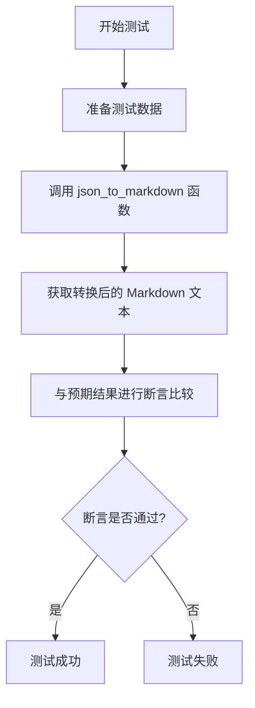
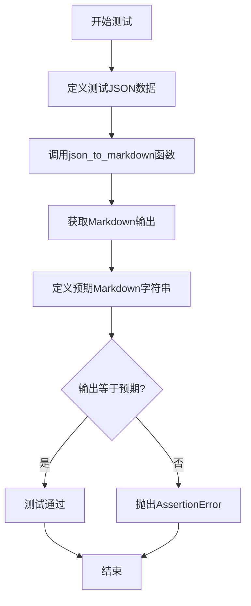

# `.\MetaGPT\tests\metagpt\utils\test_json_to_markdown.py` 详细设计文档

该文件是一个单元测试，用于验证 `json_to_markdown` 函数的功能。该函数接收一个嵌套的 JSON 对象，并将其转换为结构化的 Markdown 文本，其中 JSON 的键作为标题，值作为内容，列表被转换为无序列表，嵌套对象则生成更深层级的标题。

## 整体流程



## 类结构

```
该文件不包含类定义，仅包含一个全局函数。
```

## 全局变量及字段


### `json_data`
    
一个嵌套的字典，包含示例数据，用于测试 json_to_markdown 函数。

类型：`dict`
    


### `markdown_output`
    
通过调用 json_to_markdown 函数转换 json_data 后生成的 Markdown 字符串。

类型：`str`
    


### `expected`
    
预期的 Markdown 输出字符串，用于与 markdown_output 进行比较以验证测试结果。

类型：`str`
    


    

## 全局函数及方法


### `test_json_to_markdown`

这是一个用于测试 `json_to_markdown` 函数的单元测试函数。它通过提供一个嵌套的 JSON 数据结构，调用 `json_to_markdown` 函数将其转换为 Markdown 格式，并将结果与预期的 Markdown 字符串进行比较，以验证转换功能的正确性。

参数：
- 无显式参数。该函数不接受任何外部参数。

返回值：`None`，该函数不返回任何值。它是一个测试函数，通过 `assert` 语句来验证功能，如果断言失败则抛出 `AssertionError` 异常。

#### 流程图



#### 带注释源码

```python
def test_json_to_markdown():
    # Example nested JSON data
    # 定义一个嵌套的JSON数据结构作为测试输入
    json_data = {
        "title": "Sample JSON to Markdown Conversion",
        "description": "Convert JSON to Markdown with headings and lists.",
        "tags": ["json", "markdown", "conversion"],
        "content": {
            "section1": {"subsection1": "This is a subsection.", "subsection2": "Another subsection."},
            "section2": "This is the second section content.",
        },
    }

    # Convert JSON to Markdown with nested sections
    # 调用被测试函数，将JSON转换为Markdown
    markdown_output = json_to_markdown(json_data)

    # 定义转换后期望得到的Markdown字符串
    expected = """## title

Sample JSON to Markdown Conversion

## description

Convert JSON to Markdown with headings and lists.

## tags

- json
- markdown
- conversion

## content

### section1

#### subsection1

This is a subsection.

#### subsection2

Another subsection.

### section2

This is the second section content.

"""
    # Print or use the generated Markdown
    # 可选：打印生成的Markdown用于调试
    # print(markdown_output)
    
    # 使用断言验证实际输出与预期输出是否完全一致
    assert expected == markdown_output
```


## 关键组件


### JSON 到 Markdown 转换器

将嵌套的 JSON 数据结构递归地转换为格式化的 Markdown 文档，支持标题、列表和嵌套章节。

### 递归数据处理

通过递归函数处理嵌套的字典和列表结构，确保深层嵌套的数据也能被正确转换为对应的 Markdown 层级。

### 字符串格式化与转义

对输入数据进行字符串格式化，并处理 Markdown 特殊字符的转义，以确保生成的 Markdown 内容正确且可读。

### 断言测试框架

使用断言（assert）来验证转换函数的输出是否符合预期，确保功能的正确性和稳定性。


## 问题及建议


### 已知问题

-   **测试用例覆盖不完整**：当前测试仅验证了一个特定的、结构相对简单的嵌套JSON输入。它没有测试边界情况，例如：空JSON对象 `{}`、包含空值（`None`）或空字符串的字段、包含非常深层次嵌套的对象、包含数组嵌套在数组中的复杂结构、或包含非字符串基本类型（如数字、布尔值）作为叶子节点值的情况。这可能导致 `json_to_markdown` 函数在实际处理这些边缘数据时行为未定义或出错。
-   **测试与实现强耦合**：测试用例 `test_json_to_markdown` 直接断言输出与一个硬编码的、格式严格的字符串完全相等。这种“黄金文件”测试方式非常脆弱。对 `json_to_markdown` 函数输出的任何微小格式调整（例如，在标题后增加一个空格、改变列表项的缩进）都会导致测试失败，即使核心转换逻辑是正确的。这增加了维护成本，并可能阻碍对输出格式的合理改进。
-   **缺乏对函数核心逻辑的验证**：测试只检查了最终输出字符串，但没有验证转换过程中的关键逻辑，例如不同数据类型的处理规则（字典转标题、列表转项目符号列表、字符串直接输出）、嵌套层数与标题级别（`#`的数量）的对应关系是否正确。如果函数内部逻辑复杂，此测试无法定位具体是哪个环节出了问题。

### 优化建议

-   **重构测试以提高健壮性和可维护性**：
    -   将硬编码的预期字符串拆分为更小的、可组合的部分进行断言。例如，可以分别检查是否存在特定的标题行、列表项是否正确生成、嵌套关系是否通过缩进或标题级别体现。
    -   使用正则表达式或专门的Markdown解析/断言库来检查输出的结构，而不是精确的字符串匹配。这允许输出在空白符等非关键细节上有一定灵活性。
    -   为 `json_to_markdown` 函数编写一组更全面的单元测试，覆盖上述“已知问题”中提到的各种边界情况和输入类型。
-   **增强测试的清晰度和诊断信息**：
    -   当断言失败时，当前测试只会报告 `AssertionError`。建议在断言前，如果输出不匹配，可以打印或记录预期和实际的差异，便于快速定位问题。Python 的 `unittest` 或 `pytest` 框架提供了更丰富的断言和差异展示功能。
    -   考虑使用参数化测试（如 `pytest.mark.parametrize`）来优雅地测试多个输入/输出对，使测试用例更简洁、更易于扩展。
-   **考虑测试驱动开发（TDD）或补充集成测试**：
    -   如果 `json_to_markdown` 函数是项目的关键组件，应考虑为其编写更严格的单元测试套件，并可能补充集成测试，验证其与上下游模块配合时，生成的Markdown能被正确渲染或解析。


## 其它


### 设计目标与约束

该代码的设计目标是提供一个简单、通用的工具，将嵌套的JSON数据结构转换为结构化的Markdown文档。其核心约束包括：
1.  **通用性**：能够处理任意深度和结构的JSON对象，包括嵌套对象、数组和基本数据类型。
2.  **可读性**：生成的Markdown应具有良好的层级结构，使用标题（`##`, `###`, `####`）和列表（`-`）来清晰展示JSON的键值关系。
3.  **轻量级与无状态**：转换函数应是纯函数，不依赖外部状态，输入JSON，输出Markdown字符串。
4.  **字符串处理**：主要逻辑围绕字符串拼接和递归遍历展开，不涉及复杂的解析或网络请求。

### 错误处理与异常设计

当前测试代码（`test_json_to_markdown`）未展示核心函数`json_to_markdown`的错误处理机制。基于其设计目标，潜在的错误处理需求包括：
1.  **输入验证**：`json_to_markdown`函数应能处理非字典类型的输入（如`None`、列表、字符串）。目前行为可能是递归处理或抛出异常，需明确。
2.  **键名处理**：JSON键名可能包含Markdown特殊字符（如`#`, `*`, `-`），直接用作标题可能导致格式混乱。当前实现可能未做转义处理。
3.  **递归深度**：对于极端深度嵌套的JSON，递归转换可能导致栈溢出。应考虑添加递归深度限制或改用迭代算法。
4.  **测试断言**：测试用例使用`assert expected == markdown_output`进行字符串全匹配。这要求转换逻辑必须完全精确，包括空格和换行符。任何细微差别（如末尾换行符）都会导致测试失败，体现了对输出格式的严格约束。

### 数据流与状态机

1.  **数据流**：
    *   **输入**：测试函数`test_json_to_markdown`中定义了一个固定的嵌套字典`json_data`作为输入数据。
    *   **转换**：数据被传递给`json_to_markdown`函数。该函数内部逻辑（未在提供代码中展示）应递归遍历此字典：
        *   对于每个键值对，将键转换为Markdown标题（层级根据嵌套深度决定）。
        *   如果值是字符串或数字，将其作为段落内容。
        *   如果值是列表，将其转换为Markdown无序列表。
        *   如果值是字典，递归处理，并增加标题层级。
    *   **输出**：生成一个多行的Markdown格式字符串`markdown_output`。
    *   **验证**：生成的字符串与硬编码的`expected`字符串进行比较，完全一致则测试通过。

2.  **状态机（简化）**：核心转换过程可以看作一个递归状态机：
    *   **状态**：当前正在处理的JSON节点（字典、列表、基本类型）及其在整体结构中的深度（`depth`）。
    *   **转移**：
        *   状态为“处理字典键`k`，深度为`d`” -> 输出`##`(重复d+1次) + `k`，然后转移到“处理值`v`，深度为`d+1`”。
        *   状态为“处理列表`l`，深度为`d`” -> 为每个元素`e`输出`- `，然后转移到“处理元素`e`，深度为`d`”（列表项不增加标题深度）。
        *   状态为“处理基本类型`v`” -> 输出`v`并换行，返回上一层。
    *   **初始状态**：处理根字典，深度为0。
    *   **终止状态**：所有节点处理完毕。

### 外部依赖与接口契约

1.  **外部依赖**：
    *   **Python标准库**：仅依赖内置类型和递归调用，无第三方库依赖。这确保了代码的轻量和可移植性。
    *   **被测试模块**：测试代码依赖于`from metagpt.utils.json_to_markdown import json_to_markdown`。这是测试的主体，其接口契约至关重要。

2.  **接口契约**：
    *   **函数签名**：`json_to_markdown(data: dict) -> str`
    *   **前置条件（假设）**：
        *   输入`data`应是一个JSON可序列化的Python字典（或类似结构）。对于非字典输入的行为未定义。
        *   字典的键应为字符串类型。
    *   **后置条件（保证）**：
        *   返回一个字符串，其内容为输入数据的Markdown表示。
        *   生成的Markdown应能通过标准Markdown解析器正确渲染出层级结构。
        *   测试用例中定义的特定输入应产生完全一致的输出（`expected`字符串）。
    *   **调用方义务**：调用者需确保传入的数据结构不会导致递归过深（如果函数未做防护），并理解键名中的Markdown特殊字符可能不会被转义。

### 测试策略与覆盖范围

1.  **测试策略**：这是一个单元测试，用于验证`json_to_markdown`函数的核心功能。它采用**示例测试**和**断言匹配**的策略。
2.  **覆盖范围**：
    *   **数据类型**：测试用例覆盖了字符串、列表、嵌套字典等多种JSON结构。
    *   **层级嵌套**：覆盖了多级嵌套（如`content -> section1 -> subsection1`）。
    *   **边界情况**：当前测试未覆盖空字典、空列表、非常长的字符串、键名包含特殊字符、数字/布尔值/`None`等基本类型。这些是测试覆盖的潜在缺口。
    *   **正面测试**：本测试是一个典型的正面测试，验证功能在正常输入下的正确性。
3.  **测试脆弱性**：由于直接进行字符串全匹配，测试对函数实现的细节（如空格、缩进、换行符）非常敏感，这可能导致**脆弱测试**——即函数逻辑正确但输出格式的微小调整就会导致测试失败。


    