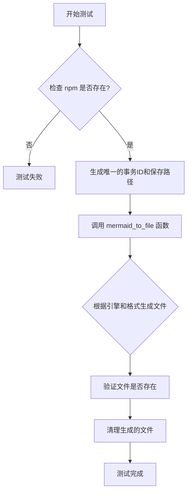
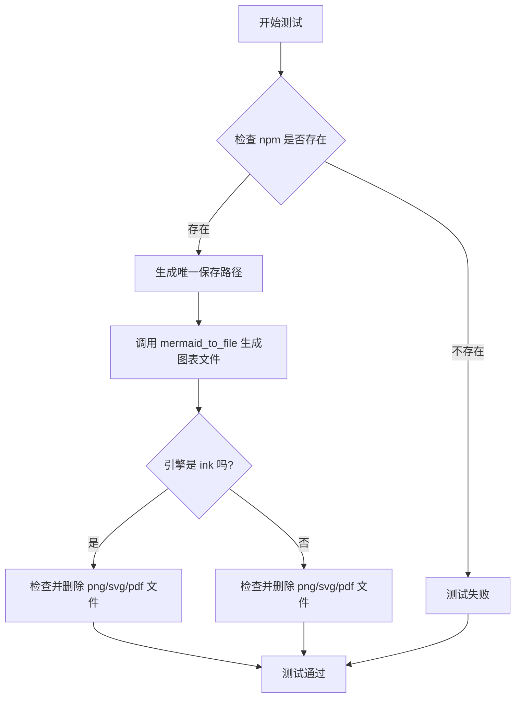

# `.\MetaGPT\tests\metagpt\utils\test_mermaid.py` 详细设计文档

这是一个使用 pytest 框架编写的单元测试文件，用于测试 `mermaid_to_file` 函数的功能。该函数的核心功能是将 Mermaid 图表代码（以 MMC1 常量表示）通过不同的渲染引擎（如 nodejs 或 ink）转换为多种格式的图像文件（如 PNG、SVG、PDF），并验证文件是否成功生成。测试通过参数化来覆盖不同的引擎和输出格式组合，并在测试后清理生成的文件。

## 整体流程



## 类结构

```
test_mermaid.py (测试文件)
├── test_mermaid (测试函数)
│   ├── 参数: engine (渲染引擎)
│   ├── 参数: suffixes (输出格式后缀列表)
│   ├── 参数: context (pytest 上下文)
│   └── 参数: mermaid_mocker (模拟对象)
```

## 全局变量及字段


### `DEFAULT_WORKSPACE_ROOT`
    
默认工作空间根目录路径，用于存储生成的文件。

类型：`pathlib.Path`
    


### `MMC1`
    
Mermaid 图表的示例代码或标识符，用于测试转换功能。

类型：`str`
    


    

## 全局函数及方法

### `test_mermaid`

这是一个使用 `pytest` 编写的异步测试函数，用于测试 `mermaid_to_file` 函数。它通过参数化测试来验证不同的 Mermaid 图表渲染引擎（如 `nodejs` 和 `ink`）以及不同的输出文件格式（如 `png`、`svg`、`pdf`）是否正常工作。测试会检查必要的命令行工具是否存在，调用 `mermaid_to_file` 生成图表文件，然后验证文件是否被正确创建，并在测试结束后清理这些文件。

参数：

- `engine`：`str`，指定使用的 Mermaid 渲染引擎，例如 `"nodejs"` 或 `"ink"`。
- `suffixes`：`list[str]` 或 `None`，指定输出文件的格式后缀列表，例如 `["png", "svg", "pdf"]`。如果为 `None`，则默认生成 PNG 格式。
- `context`：`pytest` 的上下文对象，用于测试环境的管理和依赖注入。
- `mermaid_mocker`：`pytest` 的模拟对象，用于模拟 Mermaid 相关的依赖或行为，以确保测试的隔离性和可重复性。

返回值：`None`，这是一个测试函数，不返回任何值，其主要目的是通过断言（`assert`）来验证代码行为是否符合预期。

#### 流程图



#### 带注释源码

```python
#!/usr/bin/env python
# -*- coding: utf-8 -*-
"""
@Time    : 2023/12/27
@Author  : mashenquan
@File    : test_mermaid.py
"""

import pytest

from metagpt.const import DEFAULT_WORKSPACE_ROOT
from metagpt.utils.common import check_cmd_exists, new_transaction_id
from metagpt.utils.mermaid import MMC1, mermaid_to_file


@pytest.mark.asyncio  # 标记此测试函数为异步函数
@pytest.mark.parametrize(
    ("engine", "suffixes"), [("nodejs", None), ("nodejs", ["png", "svg", "pdf"]), ("ink", None)]
)  # 参数化测试：测试三种组合情况
async def test_mermaid(engine, suffixes, context, mermaid_mocker):
    # nodejs prerequisites: npm install -g @mermaid-js/mermaid-cli
    # ink prerequisites: connected to internet
    # playwright prerequisites: playwright install --with-deps chromium
    assert check_cmd_exists("npm") == 0  # 断言 npm 命令存在，确保测试环境正确

    save_to = DEFAULT_WORKSPACE_ROOT / f"{new_transaction_id()}/{engine}/1"  # 生成一个基于事务ID的唯一保存路径
    await mermaid_to_file(engine, MMC1, save_to, suffixes=suffixes)  # 异步调用 mermaid_to_file 生成图表文件

    # ink does not support pdf
    exts = ["." + i for i in suffixes] if suffixes else [".png"]  # 根据 suffixes 参数确定要检查的文件扩展名列表
    if engine == "ink":  # 如果使用的是 ink 引擎
        for ext in exts:
            assert save_to.with_suffix(ext).exists()  # 断言文件存在
            save_to.with_suffix(ext).unlink(missing_ok=True)  # 删除文件，missing_ok=True 表示如果文件不存在也不报错
    else:  # 如果使用的是其他引擎（如 nodejs）
        for ext in exts:
            assert save_to.with_suffix(ext).exists()  # 断言文件存在
            save_to.with_suffix(ext).unlink(missing_ok=True)  # 删除文件


if __name__ == "__main__":
    pytest.main([__file__, "-s"])  # 允许直接运行此脚本进行测试，-s 参数允许输出打印信息
```

## 关键组件


### Mermaid 转换引擎

支持多种后端引擎（如 Node.js、Ink）将 Mermaid 文本代码转换为图像文件（如 PNG、SVG、PDF）。

### 文件输出管理

根据指定的文件路径和后缀列表，生成并管理转换后的图像文件，包括文件的存在性验证和测试后的清理。

### 测试参数化与配置

通过参数化测试用例，支持对不同转换引擎和输出格式组合进行自动化测试，并处理不同引擎的特性差异（如 Ink 引擎不支持 PDF 格式）。

### 外部命令与依赖检查

在测试执行前验证必要的系统命令（如 `npm`）是否存在，以确保转换引擎所需的环境依赖已满足。


## 问题及建议


### 已知问题

-   **测试依赖外部环境**：测试用例 `test_mermaid` 的成功执行依赖于外部命令 `npm` 的存在。如果测试环境中未安装 Node.js 和 npm，测试将失败，这降低了测试的可移植性和可靠性。
-   **测试用例条件不完整**：测试参数化中注释了 `playwright` 和 `pyppeteer` 引擎，但未包含在测试参数中。这可能导致对 `mermaid_to_file` 函数在这些引擎下的功能覆盖不足，存在测试盲区。
-   **文件清理逻辑重复**：测试用例中，针对 `ink` 引擎和其他引擎（如 `nodejs`）的文件存在性检查和清理逻辑几乎完全相同，存在代码重复，增加了维护成本。
-   **硬编码测试数据**：测试中使用了硬编码的 Mermaid 代码 `MMC1` 和路径 `1`，这限制了测试的灵活性，无法验证函数处理不同输入的能力。
-   **异常处理缺失**：测试用例没有显式测试 `mermaid_to_file` 函数在输入无效、引擎不支持或文件写入失败等异常情况下的行为，测试覆盖不全面。

### 优化建议

-   **模拟外部依赖**：使用 `pytest` 的 `monkeypatch` 或 `unittest.mock` 来模拟 `check_cmd_exists` 函数和外部命令（如 `mmdc`）的调用，消除测试对实际外部环境的依赖，使测试更稳定、可移植。
-   **完善测试参数化**：将 `playwright` 和 `pyppeteer` 引擎加入参数化列表，并为它们提供相应的模拟或测试条件，确保所有支持的引擎都被测试覆盖。如果某些引擎在测试环境中不可用，应明确跳过并给出原因。
-   **重构清理逻辑**：将文件存在性断言和清理逻辑提取为一个独立的辅助函数，供所有引擎分支调用，消除代码重复，提高代码可读性和可维护性。
-   **参数化测试输入**：将测试用的 Mermaid 代码和输出文件名也进行参数化，使用 `@pytest.mark.parametrize` 提供多组测试数据，以验证函数对不同输入的处理能力。
-   **增加异常测试用例**：添加新的测试用例，专门测试 `mermaid_to_file` 函数在异常场景下的行为，例如传入无效的引擎名称、空的 Mermaid 代码、无法访问的保存路径等，确保函数的健壮性。
-   **使用临时目录**：利用 `pytest` 的 `tmp_path` fixture 来创建临时目录作为 `save_to` 路径，测试结束后自动清理，避免在文件系统中留下测试残留文件，使测试更加干净。
-   **明确测试前提条件**：在测试函数或类级别使用 `pytest.mark.skipif` 装饰器，根据环境是否满足条件（如 `npm` 是否安装）来决定是否跳过测试，并提供清晰的跳过原因。


## 其它


### 设计目标与约束

本测试代码的设计目标是验证 `mermaid_to_file` 函数在不同渲染引擎（`nodejs` 和 `ink`）下的功能正确性，并确保其能够生成指定的文件格式（如 PNG、SVG、PDF）。主要约束包括：1) 测试执行依赖于外部命令（如 `npm`）的存在；2) `ink` 引擎不支持 PDF 格式生成；3) 测试环境可能需要网络连接（对于 `ink` 引擎）或特定浏览器驱动（对于 `playwright` 和 `pyppeteer`，当前已注释）。

### 错误处理与异常设计

代码中通过 `assert check_cmd_exists("npm") == 0` 在测试开始前检查 `npm` 命令是否存在，若不存在则测试失败。`mermaid_to_file` 函数内部应处理引擎调用失败、文件写入错误等异常，但本测试代码未显式捕获这些异常，而是依赖 `pytest` 框架在断言失败时抛出异常。文件删除操作使用 `unlink(missing_ok=True)` 避免因文件不存在而抛出异常。

### 数据流与状态机

数据流起始于测试参数（`engine`, `suffixes`），通过 `mermaid_to_file` 函数将固定的 Mermaid 代码（`MMC1`）转换为文件，并保存到由 `DEFAULT_WORKSPACE_ROOT`、事务 ID 和引擎名构成的动态路径下。测试验证生成的文件是否存在，并在验证后清理这些文件。整个过程是线性的，无复杂状态转换。

### 外部依赖与接口契约

1.  **外部命令**：依赖 `npm` 命令（通过 `check_cmd_exists` 验证），`nodejs` 引擎可能进一步依赖 `@mermaid-js/mermaid-cli` 全局包。
2.  **网络服务**：`ink` 引擎需要互联网连接以调用在线渲染服务。
3.  **Python 包**：依赖 `pytest` 进行测试，依赖 `metagpt` 模块中的 `mermaid_to_file`、`check_cmd_exists`、`new_transaction_id` 等函数。
4.  **接口契约**：`mermaid_to_file` 函数需接受 `engine`（字符串）、Mermaid 代码（字符串）、保存路径（`Path` 对象）和可选的 `suffixes`（列表）参数，并异步执行文件生成。

### 测试策略与覆盖

采用参数化测试（`@pytest.mark.parametrize`）覆盖 `nodejs` 和 `ink` 引擎，以及不同的输出格式组合。测试用例验证：1) 在给定引擎和格式下文件能成功生成；2) 生成的文件存在于预期路径；3) 测试后能清理生成的文件。当前未覆盖 `playwright` 和 `pyppeteer` 引擎（已注释）。测试依赖于模拟（`mermaid_mocker`）来避免实际调用外部服务可能的不稳定性。

### 环境配置与前提条件

测试执行前需确保：1) `npm` 命令已安装且可用；2) 若测试 `nodejs` 引擎，需全局安装 `@mermaid-js/mermaid-cli`（`npm install -g @mermaid-js/mermaid-cli`）；3) 若测试 `ink` 引擎，需保证网络连通性；4) 若未来启用 `playwright`，需安装浏览器驱动（`playwright install --with-deps chromium`）。这些条件在测试代码中以注释形式说明，但未在代码中自动配置或跳过。

    