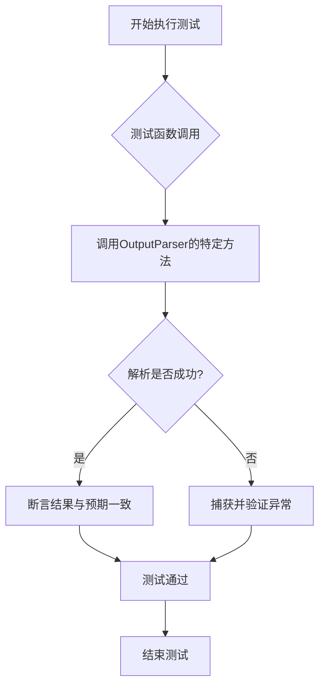
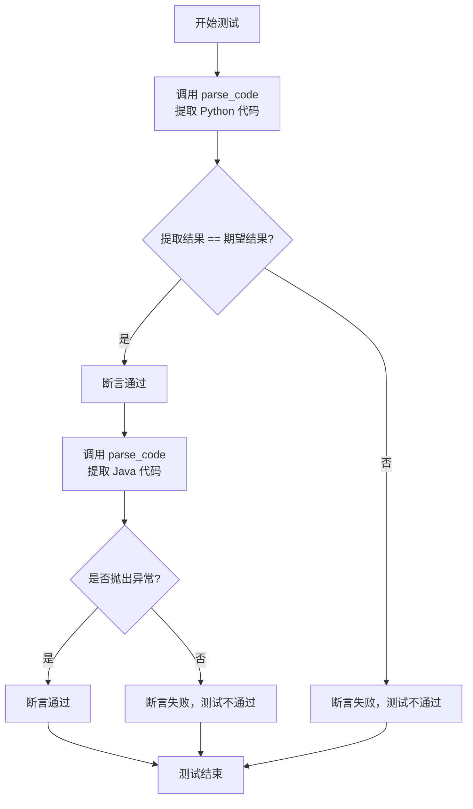
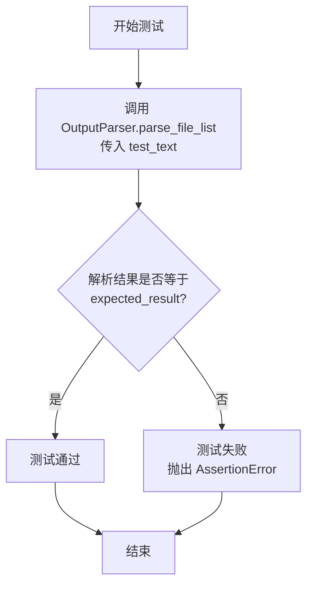
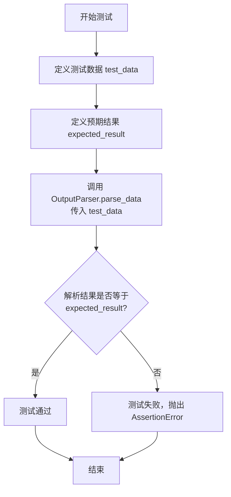
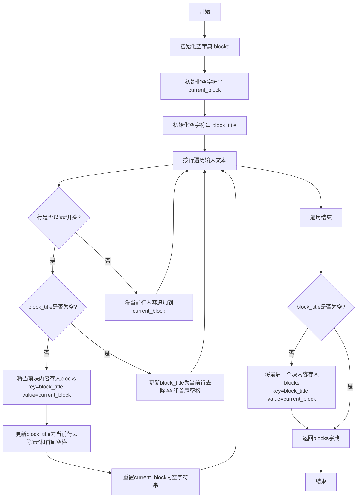
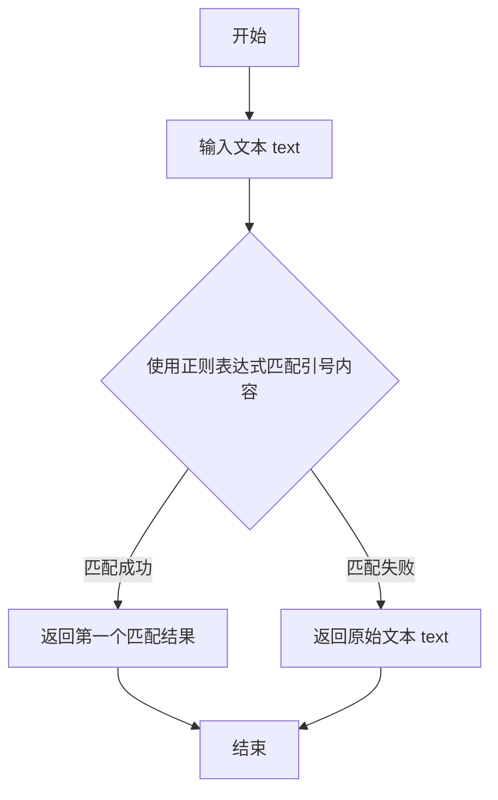

# `.\MetaGPT\tests\metagpt\utils\test_output_parser.py` 详细设计文档

该文件是一个针对 `OutputParser` 类的单元测试文件，用于验证其解析结构化文本、代码块、字符串、文件列表以及从文本中提取特定数据结构（如列表、字典）的功能。测试覆盖了多种输入场景，包括正常情况和异常情况，以确保解析器的健壮性和准确性。

## 整体流程



## 类结构

```
OutputParser (被测试类)
├── parse_blocks (方法)
├── parse_code (方法)
├── parse_python_code (方法)
├── parse_str (方法)
├── parse_file_list (方法)
├── parse_data (方法)
└── extract_struct (方法)
└── parse_data_with_mapping (方法)
```

## 全局变量及字段


### `OUTPUT_MAPPING`
    
一个字典，定义了从Markdown标题到期望数据类型的映射关系，用于指导`parse_data_with_mapping`方法解析结构化数据。

类型：`Dict[str, Tuple[Union[type, List[type]], ...]]`
    


### `t_text_with_content_tag`
    
一个包含`[CONTENT]`和`[/CONTENT]`标签的原始测试文本字符串，用于测试`parse_data_with_mapping`方法处理带标签内容的能力。

类型：`str`
    


### `t_text_raw`
    
通过移除`t_text_with_content_tag`中的`[CONTENT]`和`[/CONTENT]`标签得到的纯文本字符串，用于与解析结果进行对比验证。

类型：`str`
    


### `d`
    
调用`OutputParser.parse_data_with_mapping`方法解析`t_text_with_content_tag`后得到的结果字典，包含了根据`OUTPUT_MAPPING`映射解析出的结构化数据。

类型：`Dict[str, Union[str, List[str], List[Tuple[str, str]]]]`
    


    

## 全局函数及方法


### `test_parse_blocks`

该函数是一个单元测试，用于验证 `OutputParser.parse_blocks` 方法的功能。它提供一个包含特定标记的测试字符串，并断言该方法的解析结果与预期字典匹配。

参数：

-  `无`：`无`，该函数不接受任何参数。

返回值：`无`，该函数不返回任何值，仅执行断言。

#### 流程图

```mermaid
flowchart TD
    A[开始测试] --> B[定义测试字符串 test_text]
    B --> C[定义预期结果 expected_result]
    C --> D[调用 OutputParser.parse_blocks(test_text)]
    D --> E{解析结果 == expected_result?}
    E -- 是 --> F[测试通过]
    E -- 否 --> G[测试失败，抛出 AssertionError]
    F --> H[结束]
    G --> H
```

#### 带注释源码

```python
def test_parse_blocks():
    # 定义一个测试字符串，其中包含两个以 '##' 开头的区块标记
    test_text = "##block1\nThis is block 1.\n##block2\nThis is block 2."
    # 定义预期的解析结果，一个字典，键为区块名，值为区块内容
    expected_result = {"block1": "This is block 1.", "block2": "This is block 2."}
    # 断言：调用 `OutputParser.parse_blocks` 方法解析 `test_text` 的结果应等于 `expected_result`
    assert OutputParser.parse_blocks(test_text) == expected_result
```


### `test_parse_code`

这是一个单元测试函数，用于测试 `OutputParser.parse_code` 方法。它验证了该方法能够正确地从包含代码块的字符串中提取指定语言的代码，并且在语言不匹配时能够抛出异常。

参数：

-  `test_text`：`str`，包含代码块的输入字符串。
-  `expected_result`：`str`，期望从 `test_text` 中提取出的代码字符串。

返回值：`None`，这是一个测试函数，不返回任何值，通过 `assert` 语句验证测试结果。

#### 流程图



#### 带注释源码

```python
def test_parse_code():
    # 测试用例1：验证能够正确提取Python代码
    # 输入字符串包含Python代码块标记
    test_text = "```python\nprint('Hello, world!')```"
    # 期望提取出的纯代码内容
    expected_result = "print('Hello, world!')"
    # 断言：调用parse_code方法提取'python'代码，结果应与期望值一致
    assert OutputParser.parse_code(test_text, "python") == expected_result

    # 测试用例2：验证当指定语言与代码块语言不匹配时抛出异常
    # 使用pytest的raises上下文管理器来捕获异常
    with pytest.raises(Exception):
        # 尝试从标记为python的代码块中提取'java'代码，这应该失败并抛出异常
        OutputParser.parse_code(test_text, "java")
```


### `OutputParser.parse_python_code`

该方法用于从可能包含代码块的文本中提取Python代码。它会处理多种格式的输入，包括完整的Markdown代码块（带或不带语言标识符）、纯代码片段，以及代码块被部分标记包围的情况。方法的核心是识别并提取有效的Python代码，同时处理嵌套的代码块标记。

参数：

- `text`：`str`，包含Python代码的文本，可能被代码块标记（```）包围。

返回值：`str`，提取出的纯Python代码字符串。

#### 流程图

```mermaid
flowchart TD
    A[开始: parse_python_code(text)] --> B{text 是否包含 '```'?}
    B -- 是 --> C[提取 '```' 之间的内容]
    B -- 否 --> D[直接使用 text]
    C --> E{提取的内容是否以 'python' 开头?}
    E -- 是 --> F[移除开头的 'python' 行]
    E -- 否 --> G[保留提取的内容]
    F --> G
    G --> H[去除首尾空白字符]
    D --> H
    H --> I{处理后的代码是否为空?}
    I -- 是 --> J[抛出 ValueError 异常]
    I -- 否 --> K[返回处理后的代码]
    J --> L[结束: 异常]
    K --> M[结束: 返回代码]
```

#### 带注释源码

```python
@staticmethod
def parse_python_code(text: str) -> str:
    """
    从可能包含代码块的文本中提取Python代码。
    处理多种格式：完整的代码块、部分标记、纯代码。
    Args:
        text (str): 包含Python代码的文本。
    Returns:
        str: 提取出的纯Python代码。
    Raises:
        ValueError: 如果提取后代码为空。
    """
    # 如果文本中包含代码块标记 '```'
    if '```' in text:
        # 分割文本，获取第一个代码块开始标记之后和结束标记之前的部分
        blocks = text.split('```')
        for block in blocks:
            # 如果代码块以 'python' 开头（可能带换行），则提取其后的内容
            if block.startswith('python'):
                code = block[6:].strip()  # 移除 'python' 前缀并去除空白
                break
            # 如果代码块不以 'python' 开头，但包含代码内容，则直接使用
            elif block.strip() != '':
                code = block.strip()
                break
        else:
            # 如果没有找到有效的代码块，则使用整个文本（去除标记）
            code = text.strip('` \n')
    else:
        # 如果没有代码块标记，直接使用文本
        code = text.strip()
    # 如果最终提取的代码为空，抛出异常
    if not code:
        raise ValueError
    return code
```


### `test_parse_str`

这是一个单元测试函数，用于测试 `OutputParser` 类的 `parse_str` 方法。该测试验证了 `parse_str` 方法能否正确地从一段包含赋值语句的字符串中提取出字符串值。

参数：

-  `test_text`：`str`，包含赋值语句的输入字符串，例如 `"name = 'Alice'"`。
-  `expected_result`：`str`，期望 `parse_str` 方法从 `test_text` 中提取出的字符串值。

返回值：`None`，这是一个测试函数，不返回业务值，它通过 `assert` 语句来验证测试结果。

#### 流程图

```mermaid
flowchart TD
    A[开始测试] --> B[准备测试数据<br>test_text = &quot;name = 'Alice'&quot;]
    B --> C[调用被测方法<br>OutputParser.parse_str(test_text)]
    C --> D{获取实际结果<br>actual_result}
    D --> E[准备期望结果<br>expected_result = 'Alice']
    E --> F{断言比较<br>actual_result == expected_result?}
    F -- 是 --> G[测试通过]
    F -- 否 --> H[测试失败，抛出AssertionError]
    G --> I[结束]
    H --> I
```

#### 带注释源码

```python
def test_parse_str():
    # 定义测试输入：一个包含变量赋值和字符串值的文本
    test_text = "name = 'Alice'"
    # 定义期望的输出：从上述文本中应提取出的字符串 'Alice'
    expected_result = "Alice"
    # 断言：调用 OutputParser.parse_str 方法处理 test_text 的结果应等于 expected_result
    # 这是测试的核心，验证 parse_str 方法的功能是否符合预期
    assert OutputParser.parse_str(test_text) == expected_result
```


### `test_parse_file_list`

该函数是一个单元测试，用于验证 `OutputParser.parse_file_list` 方法是否能正确地从给定的字符串中解析出文件列表。

参数：

-  `test_text`：`str`，包含待解析文件列表信息的输入字符串。
-  `expected_result`：`List[str]`，期望的解析结果，即一个字符串列表。

返回值：`None`，该函数不返回任何值，其功能是通过 `assert` 语句验证解析结果是否符合预期。

#### 流程图



#### 带注释源码

```python
def test_parse_file_list():
    # 定义一个测试字符串，模拟包含文件列表的输入
    test_text = "files=['file1', 'file2', 'file3']"
    # 定义期望的解析结果
    expected_result = ["file1", "file2", "file3"]
    # 使用 assert 语句验证 OutputParser.parse_file_list 方法的解析结果是否与期望值一致
    assert OutputParser.parse_file_list(test_text) == expected_result

    # 以下是被注释掉的代码，用于测试当输入格式错误时，方法是否会抛出异常
    # with pytest.raises(Exception):
    #     OutputParser.parse_file_list("wrong_input")
```


### `test_parse_data`

该函数是一个单元测试，用于验证 `OutputParser.parse_data` 方法的功能。它提供一个包含多个区块（如代码块和文件列表）的测试字符串，并断言解析结果与预期值一致。

参数：

-  `test_data`：`str`，包含待解析数据的字符串，格式为以 `##` 开头的区块标题和对应的内容。
-  `expected_result`：`dict`，预期的解析结果字典，用于与 `parse_data` 方法的输出进行比较。

返回值：`None`，该函数不返回任何值，仅用于执行断言测试。

#### 流程图



#### 带注释源码

```python
def test_parse_data():
    # 定义测试数据字符串，包含两个区块：
    # 1. 区块标题为 "block1"，内容是一个Python代码块。
    # 2. 区块标题为 "block2"，内容是一个文件列表字符串。
    test_data = "##block1\n```python\nprint('Hello, world!')\n```\n##block2\nfiles=['file1', 'file2', 'file3']"
    
    # 定义预期的解析结果：
    # - "block1" 对应解析后的代码字符串（不含标记）。
    # - "block2" 对应解析后的文件列表。
    expected_result = {"block1": "print('Hello, world!')\n", "block2": ["file1", "file2", "file3"]}
    
    # 断言：调用 `OutputParser.parse_data` 方法解析 `test_data` 的结果必须等于 `expected_result`。
    # 如果相等，测试通过；如果不相等，测试失败并抛出 `AssertionError`。
    assert OutputParser.parse_data(test_data) == expected_result
```


### `OutputParser.extract_struct`

该方法用于从给定的文本中提取并解析出指定数据结构（列表或字典）。它通过扫描文本，寻找第一个匹配目标数据结构的字符（`[` 或 `{`），然后使用 Python 的 `ast.literal_eval` 安全地评估该字符串片段，将其转换为对应的 Python 数据结构（`list` 或 `dict`）。如果文本中不包含目标结构，则返回一个空列表或空字典。

参数：
-  `text`：`str`，需要解析的原始文本。
-  `data_type`：`Union[type(list), type(dict)]`，期望提取的数据结构类型，只能是 `list` 或 `dict`。

返回值：`Union[list, dict]`，从文本中解析出的列表或字典对象。如果未找到匹配的结构，则返回对应类型的空实例（`[]` 或 `{}`）。

#### 流程图

```mermaid
flowchart TD
    A[开始: extract_struct(text, data_type)] --> B{data_type 是否为 list?};
    B -- 是 --> C[查找 text 中第一个 '[' 的位置];
    B -- 否 --> D[查找 text 中第一个 '{' 的位置];
    C --> E{是否找到?};
    D --> E;
    E -- 否 --> F[返回空列表 [] 或空字典 {}];
    E -- 是 --> G[从找到的位置开始，尝试匹配<br/>对应的结束符 ']' 或 '}'];
    G --> H{是否成功匹配到完整结构?};
    H -- 否 --> I[抛出异常];
    H -- 是 --> J[提取结构字符串];
    J --> K[使用 ast.literal_eval 安全评估字符串];
    K --> L[返回解析后的 list 或 dict 对象];
```

#### 带注释源码

```python
@staticmethod
def extract_struct(text: str, data_type: Union[type(list), type(dict)]) -> Union[list, dict]:
    """
    从文本中提取并解析指定的数据结构（列表或字典）。
    该方法通过查找文本中第一个匹配的起始字符（'[' 对应列表，'{' 对应字典），
    然后尝试定位其对应的结束字符（']' 或 '}'），最后使用 `ast.literal_eval` 安全地评估该字符串片段。

    Args:
        text (str): 需要解析的原始文本。
        data_type (Union[type(list), type(dict)]): 期望提取的数据结构类型，只能是 `list` 或 `dict`。

    Returns:
        Union[list, dict]: 解析出的列表或字典对象。如果未找到匹配的结构，则返回对应类型的空实例。

    Raises:
        Exception: 如果找到起始字符但无法匹配到正确的结束字符，或 `ast.literal_eval` 评估失败。
    """
    # 根据目标数据类型，确定要查找的起始和结束字符
    if data_type == list:
        left_ch, right_ch = "[", "]"
    elif data_type == dict:
        left_ch, right_ch = "{", "}"
    else:
        # 如果传入的数据类型不是 list 或 dict，抛出 ValueError
        raise ValueError(f"Invalid data type: {data_type}")

    # 在文本中查找第一个起始字符的位置
    left_idx = text.find(left_ch)
    # 如果没找到起始字符，返回对应数据类型的空实例
    if left_idx == -1:
        return data_type()

    # 初始化栈，用于括号匹配
    stack = []
    # 从起始字符的位置开始遍历文本
    for i in range(left_idx, len(text)):
        ch = text[i]
        if ch == left_ch:
            # 遇到起始字符，入栈
            stack.append(ch)
        elif ch == right_ch:
            # 遇到结束字符，将栈顶的起始字符出栈
            stack.pop()
            # 如果栈为空，说明找到了匹配的结束字符
            if not stack:
                # 提取从起始字符到结束字符（包含）的完整字符串
                data_text = text[left_idx : i + 1]
                try:
                    # 使用 ast.literal_eval 安全地评估字符串，将其转换为 Python 对象
                    # literal_eval 只能评估 Python 字面量结构（字符串、数字、元组、列表、字典、布尔值、None）
                    data = ast.literal_eval(data_text)
                    # 确保解析出的数据类型与期望的一致
                    if isinstance(data, data_type):
                        return data
                    else:
                        # 如果不一致，抛出异常
                        raise Exception(f"Extracted data is not of type {data_type}")
                except (SyntaxError, ValueError) as e:
                    # 如果评估失败（例如字符串不是有效的 Python 字面量），抛出异常
                    raise Exception(f"Failed to parse extracted data: {e}")
    # 如果遍历完文本仍未找到匹配的结束字符，抛出异常
    raise Exception(f"No matching right delimiter found for {left_ch}")
```


### `OutputParser.parse_data_with_mapping`

该方法用于解析包含结构化数据的文本（通常为Markdown格式），并根据一个预定义的映射规则字典，将文本中的不同部分（区块）解析为特定类型的Python对象（如字符串、列表、字典等）。它首先将文本按Markdown标题（`##`）分割成多个区块，然后根据映射规则中指定的类型对每个区块的内容进行解析。

参数：

-  `text`：`str`，需要解析的原始文本字符串。
-  `mapping`：`Dict[str, Tuple[type, ...]]`，一个映射规则字典。键为区块的标题（如“Original Requirements”），值为一个元组，其中第一个元素是期望解析成的目标数据类型（如`str`, `List[str]`, `dict`等），后续元素（`...`）为预留位置。

返回值：`Dict[str, Any]`，返回一个字典，其键与`mapping`参数中的键相对应，值为根据映射规则解析后的Python对象。

#### 流程图

```mermaid
flowchart TD
    A[开始: parse_data_with_mapping(text, mapping)] --> B[调用 parse_blocks(text)<br>将文本按'##'分割为区块字典]
    B --> C[初始化空字典 result]
    C --> D[遍历 mapping 中的每个键值对 key, (data_type, ...)]
    D --> E{区块字典中<br>是否存在 key?}
    E -- 是 --> F[获取该区块的原始内容 raw_content]
    E -- 否 --> G[将 result[key] 设为 None]
    G --> H
    F --> I{data_type 是否为 str?}
    I -- 是 --> J[直接使用 raw_content<br>赋值给 result[key]]
    I -- 否 --> K[调用 extract_struct(raw_content, data_type)<br>尝试从内容中提取目标结构]
    K --> L{extract_struct 是否成功?}
    L -- 是 --> M[将提取结果赋值给 result[key]]
    L -- 否 --> N[将 raw_content 赋值给 result[key]]
    J --> H
    M --> H
    N --> H
    H[检查是否遍历完所有 key] -- 否 --> D
    H -- 是 --> O[返回结果字典 result]
```

#### 带注释源码

```python
# 假设这是 OutputParser 类中的一个静态方法
@staticmethod
def parse_data_with_mapping(text: str, mapping: Dict[str, Tuple[type, ...]]) -> Dict[str, Any]:
    """
    根据提供的映射规则解析文本数据。

    该方法将输入文本按Markdown标题分割成区块，然后根据`mapping`字典中
    定义的规则，将每个区块的内容解析为指定的数据类型。

    Args:
        text (str): 待解析的原始文本，通常包含Markdown格式的标题和内容。
        mapping (Dict[str, Tuple[type, ...]]): 标题到数据类型的映射规则。
            键是区块的标题（如"Original Requirements"），
            值是一个元组，第一个元素是期望的数据类型（如str, List[str]）。

    Returns:
        Dict[str, Any]: 一个字典，键为mapping中的标题，值为解析后的数据。
            如果某个标题在文本中未找到，其对应的值将为None。
            如果解析失败（如extract_struct抛出异常），则保留原始字符串内容。
    """
    # 1. 将文本按'##'分割成字典，键为标题，值为内容
    # 例如: {"Original Requirements": "The user wants...", "Product Goals": "- Create a..."}
    blocks = OutputParser.parse_blocks(text)
    
    # 2. 初始化结果字典
    result = {}
    
    # 3. 遍历映射规则中的每一项
    for key, (data_type, *_) in mapping.items():
        # 3.1 检查当前标题是否存在于解析出的区块中
        if key in blocks:
            raw_content = blocks[key]  # 获取该区块的原始文本内容
            
            # 3.2 如果目标类型是字符串，则直接使用原始内容
            if data_type == str:
                result[key] = raw_content
            else:
                # 3.3 否则，尝试从原始内容中提取目标数据结构（如列表、字典）
                try:
                    # extract_struct 会尝试在文本中寻找类似Python字面量的结构（如[...], {...}）并解析
                    result[key] = OutputParser.extract_struct(raw_content, data_type)
                except Exception:
                    # 3.4 如果提取失败（例如文本格式不符合预期），则回退到使用原始字符串
                    result[key] = raw_content
        else:
            # 3.5 如果文本中不存在该标题的区块，则结果为None
            result[key] = None
    
    # 4. 返回最终的结果字典
    return result
```


### `OutputParser.parse_blocks`

该方法用于解析包含特定标记块的文本，将其转换为字典结构。它通过识别以“##”开头的行作为块的标题，并将后续内容（直到下一个“##”标题或文本结束）作为该块的内容，从而构建一个键值对字典。

参数：

- `text`：`str`，需要解析的原始文本字符串，其中包含以“##”标记的块。

返回值：`dict`，返回一个字典，其中键为块的标题（去除“##”前缀和首尾空格），值为对应块的内容字符串（去除首尾空格）。

#### 流程图



#### 带注释源码

```python
@staticmethod
def parse_blocks(text: str):
    """
    解析包含'##'标题块的文本，返回字典。
    例如：
        ##block1
        content1
        ##block2
        content2
    返回：{'block1': 'content1', 'block2': 'content2'}
    """
    blocks = {}  # 初始化存储块的字典
    current_block = ""  # 当前正在构建的块内容
    block_title = ""  # 当前块的标题

    # 按行遍历输入文本
    for line in text.split('\n'):
        if line.startswith('##'):  # 检测到新的块标题
            if block_title:  # 如果已有上一个块标题，则保存上一个块
                blocks[block_title] = current_block.strip()  # 保存块，内容去除首尾空格
            # 更新当前块标题为当前行（去除'##'和首尾空格）
            block_title = line.lstrip('#').strip()
            current_block = ""  # 重置当前块内容
        else:
            # 如果不是标题行，则将内容追加到当前块
            current_block += line + '\n'

    # 循环结束后，保存最后一个块（如果存在）
    if block_title:
        blocks[block_title] = current_block.strip()

    return blocks  # 返回解析后的块字典
```


### `OutputParser.parse_code`

从包含代码块的字符串中提取指定语言的代码。该方法会移除代码块标记（如 \`\`\`python）和可能的额外空白，返回纯代码字符串。如果未找到指定语言的代码块或代码块格式不正确，会抛出异常。

参数：

-  `text`：`str`，包含代码块的原始文本
-  `lang`：`str`，期望提取的编程语言（例如 "python"）

返回值：`str`，提取出的纯代码字符串

#### 流程图

```mermaid
flowchart TD
    A[开始: parse_code(text, lang)] --> B{text 是否包含<br>```lang 代码块?};
    B -- 否 --> C[抛出异常];
    B -- 是 --> D[提取 ```lang 和 ``` 之间的内容];
    D --> E[去除内容首尾的空白字符];
    E --> F[返回纯代码字符串];
    F --> G[结束];
```

#### 带注释源码

```python
@staticmethod
def parse_code(text: str, lang: str) -> str:
    """
    从文本中解析出指定语言的代码。

    Args:
        text (str): 包含代码块的原始文本。
        lang (str): 期望提取的编程语言（例如 "python"）。

    Returns:
        str: 提取出的纯代码字符串。

    Raises:
        Exception: 如果未找到指定语言的代码块。
    """
    # 构建匹配指定语言代码块的正则表达式模式
    # 模式匹配 ```lang 开头，后跟任意字符（非贪婪），直到遇到 ``` 结束
    pattern = rf'```{lang}\n(.*?)```'
    # 在文本中搜索匹配项，re.DOTALL 标志使 '.' 匹配包括换行符在内的所有字符
    match = re.search(pattern, text, re.DOTALL)

    # 如果找到匹配项
    if match:
        # 返回第一个捕获组（即代码内容），并去除首尾的空白字符
        return match.group(1).strip()
    else:
        # 未找到匹配项，抛出异常
        raise Exception(f'未找到指定语言 {lang} 的代码块')
```


### `OutputParser.parse_python_code`

该方法用于从一段可能包含Markdown代码块标记的文本中，提取并返回纯Python代码。它能够处理多种常见格式，包括完整的Markdown代码块、不完整的代码块标记以及纯代码文本，并确保提取的代码是有效的Python代码。

参数：

-  `text`：`str`，输入的文本，可能包含Python代码和Markdown代码块标记（如 ````python` 和 ````）。

返回值：`str`，提取出的纯Python代码字符串。如果提取失败或代码无效，将抛出 `ValueError` 异常。

#### 流程图

```mermaid
flowchart TD
    A[开始: parse_python_code(text)] --> B{文本是否包含 '```python'?};
    B -- 是 --> C[提取 '```python' 之后的部分];
    B -- 否 --> D[使用原始文本];
    C --> E{提取部分是否包含 '```'?};
    E -- 是 --> F[提取第一个 '```' 之前的部分];
    E -- 否 --> G[使用提取部分];
    D --> H[使用原始文本];
    F --> I[合并为候选代码];
    G --> I;
    H --> I;
    I --> J[去除候选代码首尾空白字符];
    J --> K{候选代码是否为空?};
    K -- 是 --> L[抛出 ValueError];
    K -- 否 --> M[使用 ast.parse 验证语法];
    M --> N{语法是否有效?};
    N -- 是 --> O[返回候选代码];
    N -- 否 --> L;
```

#### 带注释源码

```python
@staticmethod
def parse_python_code(text: str) -> str:
    """
    从文本中解析Python代码。
    支持多种格式：
        1. 包含在 ```python ... ``` 中的代码
        2. 以 ```python 开头但没有结束标记的代码
        3. 纯代码文本
        4. 以 ``` 结尾的代码
    如果解析出的代码不是有效的Python代码，将抛出 ValueError。
    """
    # 尝试匹配以 ```python 开头的代码块
    if '```python' in text:
        # 分割文本，取 ```python 之后的部分
        blocks = text.split('```python')
        # 取第一个代码块（假设只有一个代码块）
        code = blocks[1] if len(blocks) > 1 else blocks[0]
        # 如果代码块以 ``` 结束，则分割并取之前的部分
        if '```' in code:
            code = code.split('```')[0]
    else:
        # 如果没有 ```python 标记，则使用原始文本
        code = text
        # 如果文本以 ``` 结尾，则移除它
        if code.endswith('```'):
            code = code[:-3]

    # 去除代码首尾的空白字符
    code = code.strip()

    # 如果代码为空，抛出异常
    if not code:
        raise ValueError("解析出的Python代码为空")

    # 使用 ast 模块验证代码语法
    try:
        import ast
        ast.parse(code)
    except SyntaxError as e:
        # 如果语法无效，抛出 ValueError
        raise ValueError(f"解析出的代码不是有效的Python代码: {e}")

    # 返回有效的Python代码
    return code
```

### `OutputParser.parse_str`

该方法用于从给定的字符串中提取出被单引号或双引号包裹的文本内容。它通过正则表达式匹配字符串中的引号内容，并返回第一个匹配到的结果。如果未找到匹配项，则返回原始字符串。

参数：

- `text`：`str`，需要解析的原始文本字符串。

返回值：`str`，解析出的字符串内容，如果未找到引号包裹的内容则返回原字符串。

#### 流程图



#### 带注释源码

```python
@staticmethod
def parse_str(text: str) -> str:
    """
    从给定的文本中提取被单引号或双引号包裹的字符串。
    
    该方法使用正则表达式匹配文本中由单引号或双引号括起来的内容。
    如果找到匹配项，则返回第一个匹配到的内容（不包含引号本身）。
    如果未找到匹配项，则返回原始文本。
    
    Args:
        text (str): 需要解析的原始文本。
        
    Returns:
        str: 解析出的字符串内容，如果未找到则返回原文本。
    """
    # 定义正则表达式模式，用于匹配单引号或双引号内的内容
    # 模式解释：
    #   r\"\"\"：原始字符串，避免转义字符干扰
    #   ['\"]：匹配单引号或双引号
    #   (.*?)：非贪婪匹配任意字符，直到遇到结束引号
    #   ['\"]：匹配结束的单引号或双引号
    pattern = r"['\"](.*?)['\"]"
    
    # 使用re.search在文本中搜索第一个匹配项
    match = re.search(pattern, text)
    
    # 如果找到匹配项，返回匹配到的内容（group(1)获取第一个括号内的内容）
    if match:
        return match.group(1)
    
    # 如果未找到匹配项，返回原始文本
    return text
```


### `OutputParser.parse_file_list`

该方法用于从给定的文本字符串中解析出文件列表。它期望输入文本包含一个类似Python列表的字符串（例如 `files=['file1', 'file2']`），并从中提取出列表内容。

参数：

-  `text`：`str`，包含文件列表的文本字符串，通常格式为 `files=['file1', 'file2']`。

返回值：`List[str]`，解析出的文件名字符串列表。

#### 流程图

```mermaid
flowchart TD
    A[开始: parse_file_list(text)] --> B{文本是否包含'files='?};
    B -- 否 --> C[抛出异常];
    B -- 是 --> D[提取'files='之后的部分];
    D --> E[使用ast.literal_eval解析提取的字符串];
    E --> F{解析结果是否为列表?};
    F -- 否 --> C;
    F -- 是 --> G[返回解析得到的列表];
    C --> H[结束: 异常];
    G --> I[结束: 返回列表];
```

#### 带注释源码

```python
@staticmethod
def parse_file_list(text: str) -> List[str]:
    """
    解析文本中的文件列表。
    期望输入格式为：`files=['file1', 'file2', 'file3']`
    
    Args:
        text (str): 包含文件列表的文本字符串。
        
    Returns:
        List[str]: 解析出的文件名字符串列表。
        
    Raises:
        Exception: 当文本格式不符合预期或解析失败时抛出异常。
    """
    # 1. 检查输入文本是否包含预期的前缀 'files='
    if "files=" not in text:
        raise Exception("未找到文件列表")
    
    # 2. 找到'files='的位置，并截取其后所有字符作为待解析的列表字符串
    # 例如，从 "files=['a', 'b']" 中提取出 "['a', 'b']"
    files_part = text.split("files=")[1]
    
    # 3. 使用ast.literal_eval安全地评估字符串，将其转换为Python对象（此处应为列表）
    # 这比直接使用eval更安全，因为它只允许解析Python字面量结构（字符串、数字、元组、列表、字典、布尔值、None）
    files = ast.literal_eval(files_part)
    
    # 4. 验证解析结果是否为列表类型
    if not isinstance(files, list):
        raise Exception("解析出的内容不是列表")
    
    # 5. 返回解析得到的文件列表
    return files
```


### `OutputParser.parse_data`

`parse_data` 方法用于解析包含多个结构化数据块的文本。它首先将文本按特定标记（如 `##block1`）分割成不同的块，然后根据每个块的内容类型（例如，Python代码块或文件列表）进行相应的解析，最终返回一个字典，其中键是块名，值是解析后的数据。

参数：

- `data`：`str`，包含多个结构化数据块的文本字符串。

返回值：`dict`，解析后的数据字典，键为块名，值为对应块解析后的数据。

#### 流程图

```mermaid
graph TD
    A[开始] --> B[调用 parse_blocks 方法分割文本为块]
    B --> C[遍历每个块]
    C --> D{判断块内容是否以 '```' 开头?}
    D -- 是 --> E[调用 parse_python_code 解析为 Python 代码]
    D -- 否 --> F{判断块内容是否包含 'files=['?}
    F -- 是 --> G[调用 parse_file_list 解析为文件列表]
    F -- 否 --> H[调用 parse_str 解析为字符串]
    E --> I[将解析结果存入字典]
    G --> I
    H --> I
    C --> J{是否遍历完所有块?}
    J -- 否 --> C
    J -- 是 --> K[返回解析后的字典]
    K --> L[结束]
```

#### 带注释源码

```python
@staticmethod
def parse_data(data: str) -> dict:
    """
    解析包含多个结构化数据块的文本。
    首先将文本按特定标记分割成块，然后根据每个块的内容类型进行解析。
    
    Args:
        data (str): 包含多个结构化数据块的文本字符串。
    
    Returns:
        dict: 解析后的数据字典，键为块名，值为对应块解析后的数据。
    """
    # 调用 parse_blocks 方法将文本按 '##' 标记分割成块
    # 返回一个字典，键为块名（如 'block1'），值为块内容字符串
    block_dict = OutputParser.parse_blocks(data)
    
    # 初始化结果字典
    parsed_dict = {}
    
    # 遍历每个块
    for block, content in block_dict.items():
        # 如果块内容以 '```' 开头，说明是代码块
        if content.startswith("```"):
            # 调用 parse_python_code 方法解析 Python 代码
            # 去除代码块标记（如 ```python）并提取纯代码
            parsed_dict[block] = OutputParser.parse_python_code(content)
        # 如果块内容包含 'files=['，说明是文件列表
        elif "files=[" in content:
            # 调用 parse_file_list 方法解析文件列表
            # 提取列表内容并转换为 Python 列表
            parsed_dict[block] = OutputParser.parse_file_list(content)
        else:
            # 否则，将内容视为普通字符串
            # 调用 parse_str 方法解析字符串（例如，提取引号内的内容）
            parsed_dict[block] = OutputParser.parse_str(content)
    
    # 返回解析后的字典
    return parsed_dict
```

### `OutputParser.extract_struct`

该方法用于从给定的文本中提取并解析出指定数据结构（列表或字典）。它通过查找文本中第一个匹配的列表或字典的起始和结束位置，然后使用 `ast.literal_eval` 安全地解析该部分文本为 Python 数据结构。

参数：

- `text`：`str`，包含可能的数据结构（列表或字典）的原始文本。
- `data_type`：`Union[type(list), type(dict)]`，期望提取的数据结构类型，只能是 `list` 或 `dict`。

返回值：`Union[list, dict, None]`，解析成功则返回对应的列表或字典对象；如果文本中不包含匹配的数据结构，则返回 `None`；如果解析失败，则抛出异常。

#### 流程图

```mermaid
graph TD
    A[开始: extract_struct(text, data_type)] --> B{data_type 是否为 list?};
    B -- 是 --> C[查找 text 中第一个 '[' 的位置 start];
    B -- 否 --> D[查找 text 中第一个 '{' 的位置 start];
    C --> E{start 是否找到?};
    D --> E;
    E -- 否 --> F[返回 None];
    E -- 是 --> G[初始化 stack = 1, idx = start + 1];
    G --> H{idx < len(text)?};
    H -- 否 --> I[抛出异常: 未找到匹配的结束符];
    H -- 是 --> J{当前字符是开始符 '[' 或 '{'?};
    J -- 是 --> K[stack += 1];
    J -- 否 --> L{当前字符是结束符 ']' 或 '}'?};
    L -- 是 --> M[stack -= 1];
    M --> N{stack == 0?};
    N -- 是 --> O[end = idx + 1];
    N -- 否 --> P[idx += 1];
    P --> H;
    L -- 否 --> P;
    K --> P;
    O --> Q[提取子串 data_str = text[start:end]];
    Q --> R[尝试使用 ast.literal_eval 解析 data_str];
    R --> S{解析成功?};
    S -- 是 --> T[返回解析结果 parsed_data];
    S -- 否 --> U[抛出解析异常];
    F --> V[结束];
    T --> V;
    I --> V;
    U --> V;
```

#### 带注释源码

```python
    @staticmethod
    def extract_struct(text: str, data_type: Union[type(list), type(dict)]) -> Union[list, dict, None]:
        """
        Extracts and parses the first occurrence of a specified data structure (list or dictionary) from a given text.

        This method searches for the first valid Python list or dictionary representation within the input text,
        depending on the specified `data_type`. It uses bracket matching to find the correct boundaries of the
        structure and then safely evaluates it using `ast.literal_eval`.

        Args:
            text (str): The input text that may contain a string representation of a list or dictionary.
            data_type (Union[type(list), type(dict)]): The type of data structure to extract. Must be either `list` or `dict`.

        Returns:
            Union[list, dict, None]: The parsed list or dictionary if found and successfully parsed; 
                                     `None` if no matching structure is found in the text.

        Raises:
            ValueError: If `data_type` is not `list` or `dict`.
            SyntaxError: If the extracted substring is not a valid Python literal (list or dict).
            Exception: For other parsing errors or if the structure is malformed (e.g., unmatched brackets).
        """
        # 确定要查找的开始和结束字符
        if data_type == list:
            start_char, end_char = "[", "]"
        elif data_type == dict:
            start_char, end_char = "{", "}"
        else:
            # 如果 data_type 不是 list 或 dict，抛出 ValueError
            raise ValueError("data_type must be list or dict.")

        # 在文本中查找第一个开始字符的位置
        start = text.find(start_char)
        if start == -1:
            # 如果没找到开始字符，说明文本中不包含目标数据结构，返回 None
            return None

        # 初始化栈用于括号匹配，idx 用于遍历文本
        stack = 1
        idx = start + 1
        # 遍历文本，直到找到匹配的结束字符
        while idx < len(text) and stack > 0:
            if text[idx] == start_char:
                # 遇到嵌套的开始字符，栈加一
                stack += 1
            elif text[idx] == end_char:
                # 遇到结束字符，栈减一
                stack -= 1
            idx += 1

        if stack != 0:
            # 如果栈不为零，说明括号不匹配，抛出异常
            raise Exception(f"Invalid data structure in text: {text[start:idx]}")

        # 提取包含数据结构的子字符串
        data_str = text[start:idx]
        try:
            # 使用 ast.literal_eval 安全地解析字符串为 Python 对象
            parsed_data = ast.literal_eval(data_str)
        except (SyntaxError, ValueError) as e:
            # 如果解析失败，抛出异常
            raise Exception(f"Failed to parse data structure from text: {data_str}") from e

        # 返回解析后的数据
        return parsed_data
```

### `OutputParser.parse_data_with_mapping`

该方法用于解析包含结构化数据的文本，并根据一个预定义的映射规则，将文本中的不同部分（块）解析为指定的Python数据类型。它首先将文本分割成多个块，然后根据映射中每个块对应的类型（如`str`, `List[str]`, `List[Tuple[str, str]]`等）调用相应的解析方法（如`parse_str`, `parse_file_list`, `extract_struct`）来提取和转换数据。

参数：

- `text`：`str`，包含待解析结构化数据的输入文本。
- `mapping`：`Dict[str, Tuple[type, ...]]`，一个字典，定义了文本中每个块（键）应被解析成的目标数据类型（值是一个元组，第一个元素是类型）。

返回值：`Dict[str, Any]`，返回一个字典，其中键是映射中定义的块名称，值是根据映射规则解析后的对应数据。

#### 流程图

```mermaid
flowchart TD
    A[开始: parse_data_with_mapping(text, mapping)] --> B[调用 parse_blocks(text) 将文本分割为块字典]
    B --> C[初始化空字典 parsed_data]
    C --> D[遍历 mapping 中的每个键值对 key, type_hint]
    D --> E{当前 key 是否存在于块字典中?}
    E -- 是 --> F[根据 type_hint 确定解析策略]
    E -- 否 --> G[将 None 存入 parsed_data[key]]
    G --> H
    F --> I{type_hint 是否为 str?}
    I -- 是 --> J[调用 parse_str 解析块内容]
    I -- 否 --> K{type_hint 是否为 List[str]?}
    K -- 是 --> L[调用 parse_file_list 解析块内容]
    K -- 否 --> M[调用 extract_struct 解析块内容]
    J --> N[将解析结果存入 parsed_data[key]]
    L --> N
    M --> N
    N --> H[继续遍历下一个键值对]
    H --> D
    D -- 遍历结束 --> O[返回 parsed_data 字典]
```

#### 带注释源码

```python
@staticmethod
def parse_data_with_mapping(text: str, mapping: Dict[str, Tuple[type, ...]]) -> Dict[str, Any]:
    """
    根据给定的映射解析文本数据。

    该方法将输入文本按块分割，然后根据映射字典中指定的类型对每个块进行解析。
    映射字典的键是块名，值是一个元组，其第一个元素指定了该块应被解析成的数据类型。

    Args:
        text (str): 包含待解析数据的输入文本。
        mapping (Dict[str, Tuple[type, ...]]): 块名到目标数据类型的映射。

    Returns:
        Dict[str, Any]: 解析后的数据字典，键为块名，值为解析后的数据。
    """
    # 1. 将文本分割成块。parse_blocks 方法预期文本使用 '##' 作为块标题的分隔符。
    blocks = OutputParser.parse_blocks(text)
    parsed_data = {}

    # 2. 遍历映射中的每一项，对每个指定的块进行解析。
    for key, type_hint in mapping.items():
        # 2.1 检查当前块是否存在于分割后的块字典中。
        if key in blocks:
            # 2.2 根据映射中定义的目标类型，选择相应的解析方法。
            if type_hint[0] == str:
                # 目标类型是字符串，使用 parse_str 方法解析。
                # parse_str 通常处理 'key = "value"' 或 'key: value' 格式的字符串。
                parsed_data[key] = OutputParser.parse_str(blocks[key])
            elif type_hint[0] == List[str]:
                # 目标类型是字符串列表，使用 parse_file_list 方法解析。
                # parse_file_list 通常处理类似 "files=['a.txt', 'b.txt']" 的文本。
                parsed_data[key] = OutputParser.parse_file_list(blocks[key])
            else:
                # 对于其他复杂类型（如 List[Tuple[str, str]] 或 dict），使用 extract_struct 方法。
                # extract_struct 会尝试从文本中提取出第一个符合目标Python数据结构（list或dict）的字符串并求值。
                parsed_data[key] = OutputParser.extract_struct(blocks[key], type_hint[0])
        else:
            # 2.3 如果映射中指定的块在输入文本中不存在，则将其值设为 None。
            parsed_data[key] = None
    # 3. 返回包含所有解析结果的字典。
    return parsed_data
```

## 关键组件


### 输出解析器 (OutputParser)

一个用于解析和提取结构化数据（如代码块、键值对、列表、字典等）的工具类，支持从Markdown格式的文本中提取特定信息。

### 代码块解析 (parse_code / parse_python_code)

从包含代码标记（如 \`\`\`python ... \`\`\`）的文本中提取指定语言或Python语言的代码内容，并清理标记。

### 文本块解析 (parse_blocks)

根据Markdown风格的标题（如 `##block_name`）将文本分割成多个命名的文本块，并返回一个字典。

### 数据结构提取 (extract_struct)

从任意文本中提取并解析出有效的Python列表或字典结构，支持嵌套和复杂数据类型。

### 映射解析 (parse_data_with_mapping)

根据预定义的字段类型映射（如 `{"Field": (type, ...)}`），从Markdown文本中自动提取、解析并转换多个字段的数据，生成一个结构化的字典。


## 问题及建议


### 已知问题

-   **异常处理不一致且不明确**：`test_parse_code` 测试中期望抛出通用的 `Exception`，而 `test_parse_python_code` 测试中期望抛出具体的 `ValueError`。这表明 `OutputParser.parse_code` 方法可能对不同类型的解析失败（如语言不匹配、代码块格式错误）使用了通用的异常类型，降低了错误信息的可读性和可调试性。
-   **代码健壮性不足**：`test_parse_file_list` 测试中有一行被注释掉的测试用例 `# OutputParser.parse_file_list("wrong_input")`，这暗示 `parse_file_list` 方法可能对非预期的输入格式处理不够健壮，容易引发未处理的异常。
-   **测试用例覆盖不完整**：`test_extract_struct` 测试中，当 `text` 为 `"""xxx xx"""` 且 `data_type` 为 `list` 时，期望的 `parsed_data` 是空列表 `[]`。这测试了未找到有效数据结构时的行为，但未明确测试和定义当 `data_type` 为 `dict` 时，在文本中未找到字典结构的预期行为（是返回空字典 `{}` 还是抛出异常？），存在模糊性。
-   **功能耦合与职责模糊**：`OutputParser` 类似乎承担了多种解析职责（解析文本块、代码、字符串、文件列表、数据结构等）。随着功能增加，这个类可能变得臃肿（“上帝类”），违反了单一职责原则，增加了维护复杂度。

### 优化建议

-   **规范化和细化异常类型**：建议为不同的解析失败场景定义更具体的异常类（例如 `CodeParsingError`, `BlockParsingError`, `StructureExtractionError`）。在 `parse_code` 等方法中，根据错误原因抛出相应的具体异常，而非通用的 `Exception`。这能提升代码的可维护性和调用方的错误处理能力。
-   **增强输入验证和健壮性**：对所有解析方法的输入进行更严格的验证。对于 `parse_file_list` 等方法，应明确处理非法输入，例如返回空列表、默认值或抛出带有清晰信息的特定异常，而不是让底层错误（如 `eval` 或 `ast.literal_eval` 的异常）直接暴露。
-   **补充测试用例，明确边界行为**：完善测试套件，特别是针对边界条件和错误场景。例如，明确并测试 `extract_struct` 方法在 `data_type=dict` 但文本中无有效字典时的行为。激活并完善被注释掉的测试用例，确保所有方法都有完整的异常路径测试。
-   **考虑重构以遵循单一职责原则**：评估 `OutputParser` 类的规模。如果功能持续增长，可以考虑将其拆分为多个更专注的类，例如 `CodeBlockParser`, `TextBlockParser`, `DataStructureParser` 等。或者，引入策略模式，将不同的解析逻辑封装到独立的可插拔组件中。这能提高代码的内聚性、可测试性和可扩展性。
-   **优化 `parse_python_code` 的冗余调用**：在 `test_parse_python_code` 中，有两行完全相同的断言 `assert OutputParser.parse_python_code("print('Hello, world!')```") == expected_result`。虽然不影响功能，但清理冗余的测试代码可以提高测试套件的整洁度。


## 其它


### 设计目标与约束

本模块（`OutputParser`）的设计目标是提供一个通用、健壮且易于使用的工具类，用于从非结构化的文本（特别是大语言模型生成的文本）中提取和解析结构化数据。其核心约束包括：1) 必须能处理包含Markdown格式（如代码块、标题块）的文本；2) 必须能容错处理不完美或格式略有偏差的输入；3) 解析逻辑应清晰、可预测，便于单元测试覆盖；4) 作为基础工具，性能开销需保持在较低水平。

### 错误处理与异常设计

模块采用防御性编程和显式异常抛出相结合的策略。对于明确的格式错误（如`parse_code`中语言不匹配、`parse_python_code`中无法提取有效代码、`extract_struct`中JSON解析失败），会抛出`ValueError`或通用的`Exception`。对于`parse_blocks`、`parse_str`、`parse_file_list`等方法，当输入格式不符合预期时，可能返回空字典、空字符串、空列表或原始文本的一部分，行为相对宽松，这取决于具体方法实现。测试用例通过`pytest.raises`验证了异常抛出的场景。

### 数据流与状态机

模块处理的数据流是单向的：原始文本输入 -> 解析器方法 -> 结构化数据输出。内部不存在复杂的状态机。主要的数据转换路径有两条：1) **基于分隔符的解析路径**：如`parse_blocks`使用`##`作为块分隔符，`parse_code`使用````作为代码块分隔符。2) **基于模式匹配与结构提取的路径**：如`extract_struct`方法，其核心流程为：在文本中搜索第一个`[`或`{` -> 向后寻找配对的`]`或`}` -> 尝试将截取的子串解析为Python列表或字典。`parse_data`和`parse_data_with_mapping`则组合了上述路径，先分块，再对每个块应用相应的解析逻辑（代码、列表、字符串或自定义结构提取）。

### 外部依赖与接口契约

1.  **内部依赖**：依赖于`metagpt.utils.common`模块中的`OutputParser`类。所有功能均通过该类的静态方法提供。
2.  **标准库依赖**：主要依赖`typing`（用于类型注解）、`re`（正则表达式，用于文本模式匹配，在源码中推断）、`json`（用于`extract_struct`中的结构解析，在源码中推断）。测试文件额外依赖`pytest`。
3.  **接口契约**：
    *   **输入**：各方法主要接受字符串(`str`)作为输入。`parse_data_with_mapping`额外接受一个`OUTPUT_MAPPING`字典，定义了各字段期望的数据类型。
    *   **输出**：输出类型多样，包括字典(`dict`)、字符串(`str`)、列表(`list`)，具体由方法功能决定。
    *   **行为**：方法均为静态方法，无副作用。给定相同输入，应产生相同输出。对于格式良好的输入，应返回准确的结构化数据；对于格式不良的输入，行为如“错误处理”部分所述。

### 安全性与边界条件

1.  **代码注入**：`parse_python_code`和`parse_code`方法提取的是代码文本，本身不执行。安全责任在使用方。但提取逻辑需确保不会因嵌套或转义的符号（如````python print('```')```）而提取错误。
2.  **资源耗尽**：`extract_struct`方法在寻找配对括号时，如果文本中括号严重不匹配（如极度多的前括号），最坏情况下可能遍历整个字符串，但输入文本长度通常受LLM响应限制，风险可控。
3.  **边界条件处理**：测试用例覆盖了多种边界情况，如无标记的代码、标记不完整、内容中包含分隔符本身、空输入、JSON结构残缺等，确保了模块的鲁棒性。

    