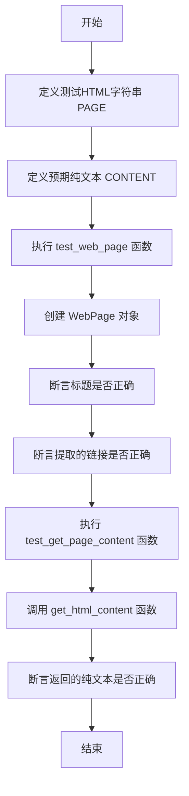
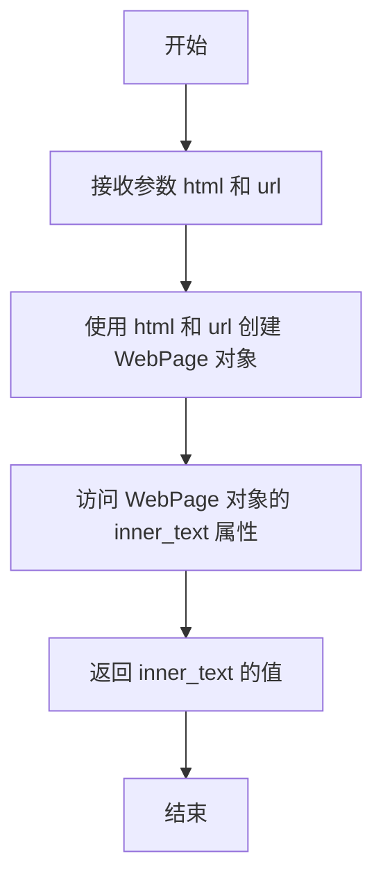
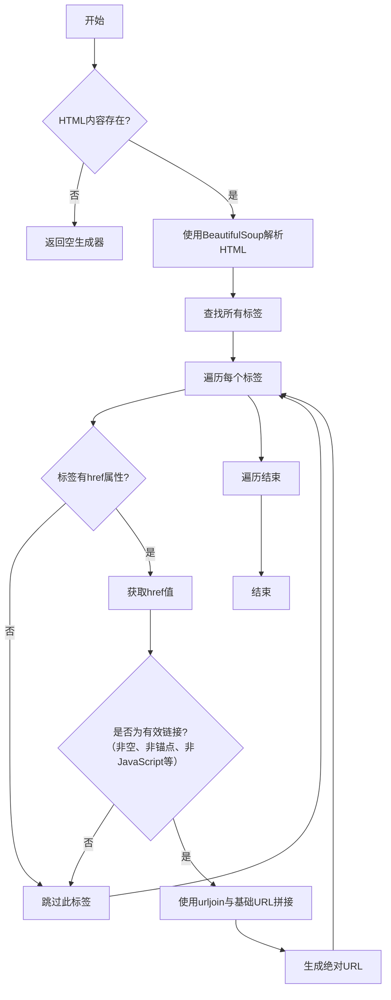

# `.\MetaGPT\tests\metagpt\utils\test_parse_html.py` 详细设计文档

该代码是一个测试文件，用于验证 `metagpt.utils.parse_html` 模块中 `WebPage` 类和 `get_html_content` 函数的功能。它通过一个预定义的 HTML 字符串 (`PAGE`) 和预期的纯文本内容 (`CONTENT`) 来测试 HTML 解析、链接提取和纯文本内容提取的正确性。

## 整体流程



## 类结构

```
metagpt.utils.parse_html (外部模块)
├── WebPage (类)
└── get_html_content (函数)
```

## 全局变量及字段


### `PAGE`
    
一个包含示例HTML页面内容的字符串常量，用于测试HTML解析功能。

类型：`str`
    


### `CONTENT`
    
一个包含从示例HTML页面中提取的纯文本内容的字符串常量，用于验证HTML解析结果。

类型：`str`
    


### `WebPage.inner_text`
    
存储网页的纯文本内容，即去除所有HTML标签后的文本。

类型：`str`
    


### `WebPage.html`
    
存储网页的原始HTML源代码。

类型：`str`
    


### `WebPage.url`
    
存储网页的URL地址，用于解析相对链接。

类型：`str`
    
    

## 全局函数及方法

### `test_web_page`

该函数是一个单元测试，用于验证 `parse_html.WebPage` 类的功能。它创建一个 `WebPage` 对象，并断言其 `title` 属性以及通过 `get_links()` 方法获取的链接列表是否符合预期。

参数：无

返回值：无

#### 流程图

```mermaid
flowchart TD
    A[开始] --> B[创建WebPage对象<br>传入CONTENT, PAGE, url]
    B --> C[断言page.title == 'Random HTML Example']
    C --> D[断言list(page.get_links()) == <br>['http://example.com/test', 'https://metagpt.com']]
    D --> E[结束]
```

#### 带注释源码

```python
def test_web_page():
    # 使用给定的HTML字符串、提取的文本内容和基础URL创建一个WebPage对象
    page = parse_html.WebPage(inner_text=CONTENT, html=PAGE, url="http://example.com")
    # 断言WebPage对象的title属性与HTML中的<title>标签内容一致
    assert page.title == "Random HTML Example"
    # 断言WebPage对象的get_links()方法返回的链接列表与预期相符
    # 预期结果包含两个链接：一个相对路径被解析为绝对URL，一个已经是绝对URL
    assert list(page.get_links()) == ["http://example.com/test", "https://metagpt.com"]
```

### `parse_html.get_html_content`

该函数是 `parse_html` 模块中的一个全局函数，其核心功能是解析给定的 HTML 字符串，提取并返回其纯文本内容。它通过创建一个 `WebPage` 对象，并调用其 `inner_text` 属性来实现此功能。

参数：

- `html`：`str`，需要被解析的 HTML 字符串。
- `url`：`str`，与 HTML 内容关联的 URL，用于解析相对链接。

返回值：`str`，从 HTML 中提取出的纯文本内容。

#### 流程图



#### 带注释源码

```python
def get_html_content(html: str, url: str) -> str:
    """
    解析 HTML 字符串并返回其纯文本内容。

    该函数是 parse_html 模块的一个便捷函数，它通过创建一个 WebPage 对象
    并访问其 inner_text 属性来提取 HTML 中的文本。

    Args:
        html (str): 需要被解析的 HTML 字符串。
        url (str): 与 HTML 内容关联的 URL，用于解析相对链接。

    Returns:
        str: 从 HTML 中提取出的纯文本内容。
    """
    # 创建一个 WebPage 对象，传入 HTML 字符串和 URL
    page = WebPage(html=html, url=url)
    # 返回 WebPage 对象的 inner_text 属性，即提取出的纯文本
    return page.inner_text
```

### `WebPage.get_links`

该方法用于从当前网页的HTML内容中提取所有有效的超链接（`<a>`标签的`href`属性），并将相对URL转换为绝对URL。

参数：
- `self`：`WebPage`，当前WebPage实例，包含网页的HTML内容、内部文本和基础URL。

返回值：`Generator[str, None, None]`，一个生成器，依次生成处理后的绝对URL字符串。

#### 流程图



#### 带注释源码

```python
def get_links(self) -> Generator[str, None, None]:
    """
    从网页HTML中提取所有链接。
    返回一个生成器，生成绝对URL。
    """
    # 检查实例是否包含HTML内容
    if not self.html:
        return
    # 使用BeautifulSoup解析HTML
    soup = BeautifulSoup(self.html, "html.parser")
    # 查找所有的<a>标签
    for link in soup.find_all("a"):
        # 获取href属性值
        href = link.get("href")
        # 如果href不存在或为空，则跳过
        if not href:
            continue
        # 过滤掉页面内锚点链接（以#开头）
        if href.startswith("#"):
            continue
        # 过滤掉JavaScript链接
        if href.startswith("javascript:"):
            continue
        # 过滤掉其他非HTTP/HTTPS协议（如mailto:, ftp:）
        if not href.startswith(("http://", "https://")):
            # 对于相对路径，使用基础URL（self.url）进行拼接，生成绝对URL
            href = urljoin(self.url, href)
        # 生成处理后的绝对URL
        yield href
```

## 关键组件


### WebPage 类

一个用于封装和解析HTML页面的类，提供获取页面标题、提取纯文本内容以及过滤和规范化页面内链接的功能。

### parse_html.get_html_content 函数

一个工具函数，用于从给定的HTML字符串和基础URL中提取并返回纯文本内容，内部通过创建WebPage实例并调用其inner_text属性实现。

### HTML 解析与文本提取

负责将HTML文档中的结构化标签（如标题、段落、列表、表格等）转换为连续的纯文本字符串，同时处理内联元素（如链接、强调文本）的文本内容。

### 链接提取与规范化

负责从HTML文档中识别所有`<a>`标签的`href`属性，并根据基础URL对相对链接进行规范化处理，同时过滤掉非HTTP/HTTPS协议的链接（如锚点、JavaScript、FTP等）。

### 元信息提取

负责从HTML文档的`<title>`标签中提取页面的标题信息。


## 问题及建议


### 已知问题

-   **测试用例覆盖不完整**：当前测试仅验证了`parse_html.WebPage`的`title`和`get_links`方法，以及`parse_html.get_html_content`函数的返回值。未对`WebPage`类的其他潜在方法（如`get_images`、`get_forms`等）或异常场景（如传入无效HTML、空URL等）进行测试，可能导致未发现的边界情况错误。
-   **硬编码的测试数据**：测试数据`PAGE`和`CONTENT`直接硬编码在测试文件中。如果`parse_html`模块的解析逻辑发生变化（例如，文本提取规则调整），需要手动同步更新`CONTENT`常量，容易出错且维护不便。
-   **测试与实现细节紧耦合**：测试`test_get_page_content`直接断言返回的文本内容`CONTENT`与一个非常具体的字符串完全相等。这种测试过于脆弱，任何微小的格式调整（如空格、换行符处理变化）都会导致测试失败，即使核心功能（提取主要文本）依然正确。
-   **缺乏对`parse_html`模块内部逻辑的验证**：测试主要验证了输入输出，但没有验证`parse_html`模块内部是否正确处理了HTML中的各种标签（如列表、表格、表单）、属性过滤（如`javascript:`链接被忽略）以及相对URL的补全逻辑。这些逻辑的正确性仅通过最终结果间接推断。

### 优化建议

-   **增强测试覆盖范围**：为`parse_html.WebPage`类编写更全面的单元测试，覆盖其所有公共方法（如`get_links`、`get_images`、`soup`属性等）。同时，增加对异常输入（如`None`、空字符串、格式错误的HTML）的测试，确保代码的健壮性。
-   **使用动态或更灵活的测试断言**：对于`test_get_page_content`，可以改为断言提取的文本包含关键内容（如“This is a Heading”、“Item 1”），而不是与一个硬编码的长字符串完全匹配。或者，可以计算提取文本与预期文本的相似度（如使用difflib），允许非关键性差异。
-   **将测试数据外部化或参数化**：考虑使用`pytest`的`@pytest.mark.parametrize`装饰器，将不同的HTML用例和预期结果作为参数传入，使测试更清晰且易于扩展。对于复杂的预期结果，可以将其存储在单独的测试数据文件中（如JSON）。
-   **添加集成测试或组件测试**：创建测试来验证`parse_html`模块与真实网页或复杂HTML片段的交互，确保其解析逻辑在实际场景中有效。可以模拟网络请求，测试从URL到`WebPage`对象的完整流程。
-   **重构测试以关注行为而非实现**：将测试重点放在`parse_html`模块对外承诺的行为上（例如，“能提取纯文本”、“能提取并补全有效链接”），而不是具体的字符串输出格式。这样可以在不修改测试的情况下，对模块内部实现进行优化。
-   **考虑添加性能测试**：如果`parse_html`用于处理大量或复杂的HTML页面，建议添加性能基准测试，以确保解析效率在可接受范围内，并监控代码变更可能引入的性能回归。


## 其它


### 设计目标与约束

本模块的核心设计目标是提供一个轻量级、高效的HTML解析工具，用于从HTML字符串中提取关键信息，特别是纯文本内容（inner_text）和有效的超链接。其设计遵循以下约束：
1.  **功能聚焦**：专注于内容提取，不提供完整的DOM操作或渲染能力。
2.  **外部依赖最小化**：主要依赖Python标准库（如`html.parser`），确保可移植性和低开销。
3.  **接口简洁**：对外提供简单的类（`WebPage`）和函数（`get_html_content`）接口，易于理解和使用。
4.  **链接处理规范化**：能够将相对URL转换为基于基础URL的绝对URL，并过滤掉非HTTP(S)协议或无效的链接。

### 错误处理与异常设计

当前代码示例中未显式展示错误处理逻辑。根据`parse_html`模块的常规设计，其错误处理策略可能包括：
1.  **静默处理**：对于HTML解析过程中遇到的畸形标签或结构，解析器（如`html.parser`）通常会尝试恢复并继续解析，而非抛出异常。模块可能选择接受解析器的这种行为，不额外包装异常。
2.  **输入验证**：`WebPage`类的构造函数或`get_html_content`函数可能对输入的`html`和`url`参数进行基础检查（如类型检查），但代码片段中未体现。更健壮的设计应包括对空字符串或无效URL格式的处理。
3.  **链接解析容错**：在`get_links`方法中，使用`urllib.parse.urljoin`进行URL拼接时，该函数本身具备一定的容错能力。模块可能依赖于此，而未对拼接结果进行额外的有效性校验（如网络可达性）。
4.  **断言用于测试**：在提供的测试代码中，使用`assert`语句验证功能，这在生产环境中不适用。生产代码应使用更合适的错误报告机制。

### 数据流与状态机

模块的数据流相对简单直接：
1.  **输入**：原始HTML字符串（`html`）和可选的基准URL（`url`）。
2.  **处理**：
    *   `get_html_content`函数或`WebPage`的内部解析逻辑，遍历HTML节点树，提取文本节点内容并拼接。
    *   `WebPage.get_links`方法遍历特定标签（如`<a>`），提取`href`属性，并利用基准URL进行规范化。
3.  **输出**：
    *   纯文本内容（字符串）。
    *   规范化后的链接列表（字符串列表）。
    *   `WebPage`对象，封装了上述输入、处理后的结果（如`inner_text`, `title`）以及提供获取链接的方法。
4.  **状态**：`WebPage`类实例化后，其状态（字段）是只读的，不存在复杂的状态变迁。它是一个简单的数据容器兼处理器。

### 外部依赖与接口契约

1.  **外部依赖**：
    *   `metagpt.utils.parse_html`：这是模块自身的命名空间。具体实现依赖于Python标准库，如：
        *   `html.parser`（或`html`模块中的其他解析器）：用于解析HTML。
        *   `urllib.parse`：用于URL的拼接和解析。
    *   无第三方库依赖（如BeautifulSoup, lxml），这符合其轻量级的设计目标。
2.  **接口契约**：
    *   `parse_html.WebPage`类：
        *   **构造函数**：期望接收`inner_text`（字符串）、`html`（字符串）、`url`（字符串）参数。
        *   `title`属性：应返回HTML中`<title>`标签的内容。
        *   `get_links`方法：应返回一个可迭代对象（如生成器或列表），包含从HTML中提取并规范化后的有效HTTP(S)链接。
    *   `parse_html.get_html_content`函数：
        *   **输入**：`html`（字符串）、`url`（字符串）。
        *   **输出**：从HTML中提取的纯文本内容（字符串）。
    *   **隐含契约**：`WebPage`对象的`inner_text`属性应与使用相同参数调用`get_html_content`函数的结果一致。

    