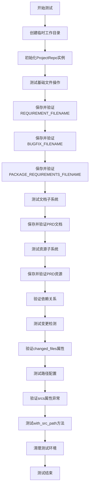
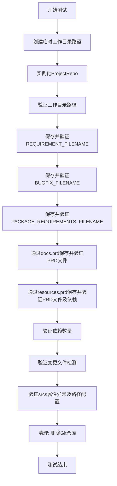
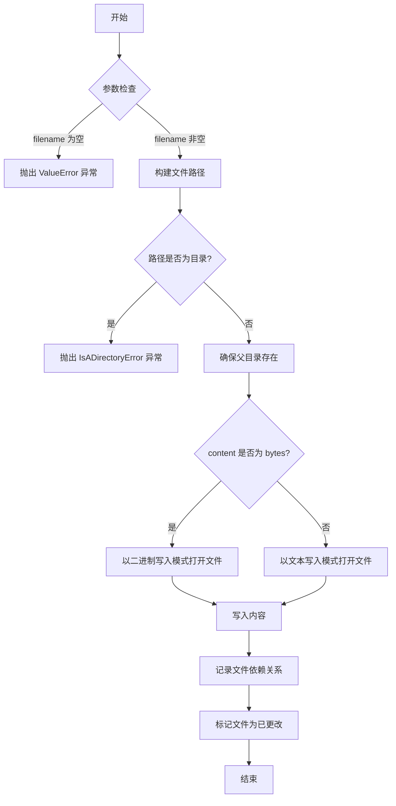
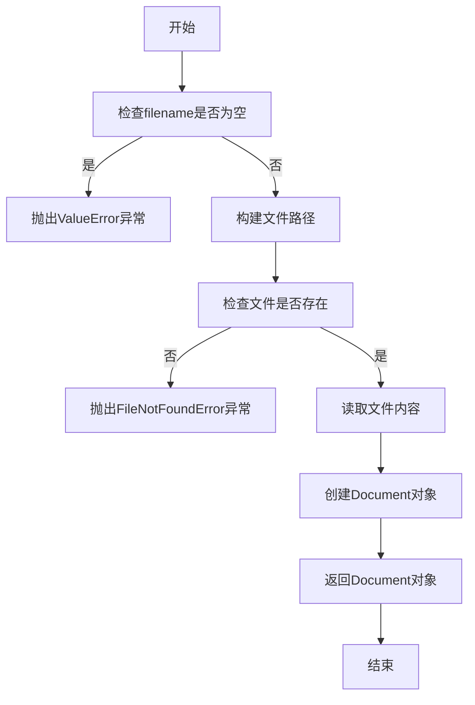
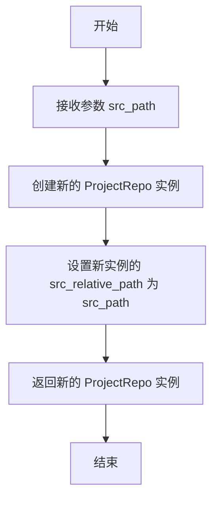

# `.\MetaGPT\tests\metagpt\utils\test_project_repo.py` 详细设计文档

这是一个单元测试文件，用于测试ProjectRepo类的功能，包括文件保存、读取、依赖管理、变更检测以及路径配置等操作。

## 整体流程



## 类结构

```
ProjectRepo (项目仓库管理类)
├── docs (文档子系统)
│   └── prd (PRD文档管理)
├── resources (资源子系统)
│   └── prd (PRD资源管理)
├── tests (测试子系统)
└── srcs (源代码子系统)
```

## 全局变量及字段


### `BUGFIX_FILENAME`
    
常量字符串，表示bug修复文档的文件名。

类型：`str`
    


### `PACKAGE_REQUIREMENTS_FILENAME`
    
常量字符串，表示包依赖需求文档的文件名。

类型：`str`
    


### `PRDS_FILE_REPO`
    
常量字符串，表示PRD（产品需求文档）文件存储库的路径或标识。

类型：`str`
    


### `REQUIREMENT_FILENAME`
    
常量字符串，表示需求文档的文件名。

类型：`str`
    


### `ProjectRepo.git_repo`
    
Git仓库对象，用于管理项目代码的版本控制操作。

类型：`GitRepo`
    


### `ProjectRepo.workdir`
    
项目的工作目录路径，通常与git_repo的工作目录相同。

类型：`Path`
    


### `ProjectRepo.docs`
    
文档存储库对象，用于管理项目文档的保存、获取和依赖关系。

类型：`DocumentRepo`
    


### `ProjectRepo.resources`
    
资源存储库对象，用于管理项目资源文件的保存、获取和依赖关系。

类型：`ResourceRepo`
    


### `ProjectRepo.tests`
    
测试存储库对象，用于管理项目测试文件。

类型：`TestRepo`
    


### `ProjectRepo.srcs`
    
源代码存储库对象，用于管理项目源代码文件，需要调用with_src_path方法初始化。

类型：`SourceRepo`
    


### `ProjectRepo.src_relative_path`
    
源代码的相对路径，在调用with_src_path方法后设置。

类型：`Path`
    


### `ProjectRepo.changed_files`
    
自上次提交以来发生更改的文件列表。

类型：`List[Path]`
    
    

## 全局函数及方法

### `test_project_repo`

这是一个异步单元测试函数，用于测试 `ProjectRepo` 类的核心功能，包括文件保存、读取、依赖管理、变更检测以及路径配置等操作。它通过创建一个临时工作目录，执行一系列操作来验证 `ProjectRepo` 的行为是否符合预期。

参数：
- 无显式参数。

返回值：`None`，这是一个测试函数，不返回任何值，其成功与否由断言（`assert`）决定。

#### 流程图



#### 带注释源码

```python
async def test_project_repo():
    # 1. 创建临时工作目录路径：基于当前文件位置，向上三级到workspace/unittest，并附加一个随机UUID以确保目录唯一。
    root = Path(__file__).parent / f"../../../workspace/unittest/{uuid.uuid4().hex}"
    root = root.resolve()  # 解析为绝对路径

    # 2. 实例化ProjectRepo，传入工作目录路径。
    pr = ProjectRepo(root=str(root))
    # 3. 验证ProjectRepo内部Git仓库的工作目录与传入的root一致。
    assert pr.git_repo.workdir == root
    # 4. 验证ProjectRepo的工作目录属性与Git仓库的工作目录一致。
    assert pr.workdir == pr.git_repo.workdir

    # 5. 测试基础文件操作：保存REQUIREMENT_FILENAME并读取验证内容。
    await pr.save(filename=REQUIREMENT_FILENAME, content=REQUIREMENT_FILENAME)
    doc = await pr.get(filename=REQUIREMENT_FILENAME)
    assert doc.content == REQUIREMENT_FILENAME

    # 6. 测试保存和读取BUGFIX_FILENAME。
    await pr.save(filename=BUGFIX_FILENAME, content=BUGFIX_FILENAME)
    doc = await pr.get(filename=BUGFIX_FILENAME)
    assert doc.content == BUGFIX_FILENAME

    # 7. 测试保存和读取PACKAGE_REQUIREMENTS_FILENAME。
    await pr.save(filename=PACKAGE_REQUIREMENTS_FILENAME, content=PACKAGE_REQUIREMENTS_FILENAME)
    doc = await pr.get(filename=PACKAGE_REQUIREMENTS_FILENAME)
    assert doc.content == PACKAGE_REQUIREMENTS_FILENAME

    # 8. 测试通过docs.prd子模块保存PRD文件，并指定依赖。
    await pr.docs.prd.save(filename="1.prd", content="1.prd", dependencies=[REQUIREMENT_FILENAME])
    doc = await pr.docs.prd.get(filename="1.prd")
    assert doc.content == "1.prd"

    # 9. 测试通过resources.prd子模块保存PRD文件，并指定更复杂的依赖。
    await pr.resources.prd.save(
        filename="1.prd",
        content="1.prd",
        dependencies=[REQUIREMENT_FILENAME, f"{PRDS_FILE_REPO}/1.prd"],
    )
    doc = await pr.resources.prd.get(filename="1.prd")
    assert doc.content == "1.prd"
    # 10. 验证获取的依赖列表长度是否正确。
    dependencies = await pr.resources.prd.get_dependency(filename="1.prd")
    assert len(dependencies) == 2

    # 11. 测试变更文件检测功能。
    assert pr.changed_files  # 主repo应有变更文件
    assert pr.docs.prd.changed_files  # docs.prd子模块应有变更文件
    assert not pr.tests.changed_files  # tests子模块应无变更文件（未操作）

    # 12. 测试srcs属性的延迟初始化行为及路径配置。
    with pytest.raises(ValueError):
        pr.srcs  # 在未设置源路径前访问应抛出ValueError
    # 设置源路径后，验证srcs的根路径和相对路径是否正确。
    assert pr.with_src_path("test_src").srcs.root_path == Path("test_src")
    assert pr.src_relative_path == Path("test_src")

    # 13. 测试结束，清理临时创建的Git仓库。
    pr.git_repo.delete_repository()
```

### `ProjectRepo.__init__`

`ProjectRepo` 类的构造函数，用于初始化一个项目仓库实例。它接收一个根目录路径，并基于此路径初始化内部的 Git 仓库对象 (`GitRepository`) 以及文档、资源、测试等子仓库管理器。该方法是创建项目仓库的入口点，确保工作目录存在并准备好后续的文件操作。

参数：

- `root`：`str`，项目仓库的根目录路径。如果该目录不存在，将在后续操作中创建。

返回值：`None`，构造函数不返回任何值。

#### 流程图

```mermaid
flowchart TD
    A[开始: ProjectRepo.__init__] --> B[接收参数 root]
    B --> C[初始化 self._root = Path(root)]
    C --> D[初始化 self._git_repo = GitRepository<br>传入 workdir=self._root]
    D --> E[初始化 self._docs = DocumentRepo<br>传入 git_repo=self._git_repo]
    E --> F[初始化 self._resources = ResourceRepo<br>传入 git_repo=self._git_repo]
    F --> G[初始化 self._tests = TestRepo<br>传入 git_repo=self._git_repo]
    G --> H[初始化 self._src_path = None]
    H --> I[结束]
```

#### 带注释源码

```python
def __init__(self, root: str):
    """
    初始化 ProjectRepo 实例。

    Args:
        root (str): 项目仓库的根目录路径。
    """
    # 将传入的根目录字符串转换为 Path 对象，便于后续的路径操作
    self._root = Path(root)
    # 初始化 Git 仓库对象，将根目录作为工作目录
    self._git_repo = GitRepository(workdir=self._root)
    # 初始化文档仓库管理器，用于管理项目中的文档文件
    self._docs = DocumentRepo(git_repo=self._git_repo)
    # 初始化资源仓库管理器，用于管理项目中的资源文件
    self._resources = ResourceRepo(git_repo=self._git_repo)
    # 初始化测试仓库管理器，用于管理项目中的测试文件
    self._tests = TestRepo(git_repo=self._git_repo)
    # 初始化源代码相对路径，默认为 None，表示尚未设置
    self._src_path = None
```

### `ProjectRepo.save`

该方法用于将指定内容保存到项目仓库的指定文件中，并可选地记录文件依赖关系。如果文件所在目录不存在，则会自动创建。保存后，文件会被标记为已更改，以便后续的版本控制操作。

参数：

- `filename`：`str`，要保存的文件名，可以是相对路径或绝对路径。
- `content`：`Union[str, bytes]`，要保存的内容，可以是字符串或字节数据。
- `dependencies`：`List[str]`，可选参数，表示该文件所依赖的其他文件列表。默认为空列表。

返回值：`None`，无返回值。

#### 流程图



#### 带注释源码

```python
async def save(self, filename: str, content: Union[str, bytes], dependencies: List[str] = None):
    """
    保存内容到指定文件，并记录依赖关系。

    Args:
        filename (str): 要保存的文件名。
        content (Union[str, bytes]): 要保存的内容。
        dependencies (List[str], optional): 文件依赖列表。默认为 None。

    Raises:
        ValueError: 如果 filename 为空。
        IsADirectoryError: 如果路径指向一个目录。
    """
    if not filename:
        raise ValueError("filename cannot be empty")
    
    # 构建完整的文件路径
    path = self.root_path / filename
    
    # 检查路径是否为目录
    if path.exists() and path.is_dir():
        raise IsADirectoryError(f"Cannot save to a directory: {path}")
    
    # 确保父目录存在
    path.parent.mkdir(parents=True, exist_ok=True)
    
    # 根据内容类型选择写入模式
    mode = "wb" if isinstance(content, bytes) else "w"
    encoding = None if isinstance(content, bytes) else "utf-8"
    
    # 写入文件内容
    with open(path, mode, encoding=encoding) as f:
        f.write(content)
    
    # 记录依赖关系
    if dependencies is not None:
        await self._save_dependency(filename, dependencies)
    
    # 标记文件为已更改
    self._changed_files.add(str(path))
```

### `ProjectRepo.get`

该方法用于从项目仓库中获取指定文件的内容，并返回一个包含文件信息和内容的文档对象。

参数：

- `filename`：`str`，要获取的文件名

返回值：`Document`，包含文件信息和内容的文档对象

#### 流程图



#### 带注释源码

```python
async def get(self, filename: str) -> Document:
    """
    获取指定文件的内容
    
    Args:
        filename: 要获取的文件名
        
    Returns:
        Document: 包含文件信息和内容的文档对象
        
    Raises:
        ValueError: 当filename为空时
        FileNotFoundError: 当文件不存在时
    """
    # 检查文件名是否为空
    if not filename:
        raise ValueError("Filename cannot be empty")
    
    # 构建完整的文件路径
    filepath = self.workdir / filename
    
    # 检查文件是否存在
    if not filepath.exists():
        raise FileNotFoundError(f"File {filename} not found in {self.workdir}")
    
    # 读取文件内容
    content = filepath.read_text(encoding="utf-8")
    
    # 创建并返回Document对象
    return Document(
        root_path=self.workdir,
        filename=filename,
        content=content
    )
```

### `ProjectRepo.with_src_path`

该方法用于为 `ProjectRepo` 实例创建一个新的、具有指定源代码根路径的子上下文。它返回一个新的 `ProjectRepo` 实例，该实例的 `srcs` 属性指向新的路径，而其他属性（如 `docs`、`resources` 等）保持不变，从而允许在特定的源代码目录结构下进行操作。

参数：

- `src_path`：`str`，源代码的根目录路径（相对于项目根目录）。

返回值：`ProjectRepo`，一个新的 `ProjectRepo` 实例，其 `srcs` 属性已配置为指定的 `src_path`。

#### 流程图



#### 带注释源码

```python
    def with_src_path(self, src_path: str) -> "ProjectRepo":
        """
        创建一个新的 ProjectRepo 实例，该实例的 srcs 属性指向指定的 src_path。
        其他属性（如 docs、resources 等）保持不变。
        
        Args:
            src_path (str): 源代码的根目录路径（相对于项目根目录）。
            
        Returns:
            ProjectRepo: 一个新的 ProjectRepo 实例。
        """
        # 创建一个新的 ProjectRepo 实例，复制当前实例的 git_repo 和 docs 等属性
        new_repo = ProjectRepo(git_repo=self.git_repo, docs=self.docs, resources=self.resources, tests=self.tests)
        # 设置新实例的源代码相对路径
        new_repo.src_relative_path = Path(src_path)
        return new_repo
```

## 关键组件


### ProjectRepo

一个用于管理项目代码仓库的类，提供了文件保存、读取、依赖管理等功能，并支持与Git仓库的集成。

### Git仓库集成

通过`git_repo`属性与Git仓库进行交互，支持工作目录管理、文件变更跟踪和仓库删除等操作。

### 文档管理

通过`docs`属性提供对项目文档的管理，支持保存、读取和依赖关系管理，例如PRD文档。

### 资源管理

通过`resources`属性提供对项目资源文件的管理，支持保存、读取和依赖关系管理，例如PRD资源文件。

### 测试管理

通过`tests`属性提供对项目测试文件的管理，支持变更跟踪。

### 源代码管理

通过`srcs`属性提供对项目源代码的管理，支持设置源代码相对路径。

### 文件操作

提供`save`和`get`方法用于文件的保存和读取，支持异步操作。

### 依赖管理

提供`get_dependency`方法用于获取文件的依赖关系。

### 变更跟踪

通过`changed_files`属性跟踪项目中发生变更的文件。

### 路径管理

支持通过`with_src_path`方法设置源代码的相对路径，并通过`src_relative_path`属性获取该路径。


## 问题及建议


### 已知问题

-   **测试数据清理不彻底**：测试用例使用 `uuid.uuid4().hex` 生成临时工作区路径，并在测试结束时调用 `pr.git_repo.delete_repository()` 尝试删除。然而，此方法可能无法完全清理所有在测试过程中创建的文件和目录，尤其是在测试因异常提前退出时，可能导致残留文件堆积在文件系统中。
-   **硬编码的路径依赖**：测试代码中使用了相对路径 `Path(__file__).parent / f"../../../workspace/unittest/{uuid.uuid4().hex}"` 来定位工作区。这种硬编码方式使得测试对项目的目录结构有强依赖，如果项目结构发生变化或测试在不同环境中运行（如CI/CD流水线），可能导致路径解析失败。
-   **异步测试的潜在问题**：测试函数 `test_project_repo` 被定义为 `async`，但使用了 `pytest.main` 同步运行。虽然 `pytest` 支持异步测试，但直接调用 `pytest.main` 可能无法正确处理异步测试用例，尤其是在某些运行环境下，可能导致测试未被正确执行或产生意外行为。
-   **异常测试断言过于宽泛**：使用 `with pytest.raises(ValueError):` 来测试 `pr.srcs` 属性访问抛出 `ValueError`。这个断言只检查了异常类型，没有验证异常的具体信息或上下文，可能掩盖了其他非预期的 `ValueError` 或允许不符合预期的异常信息通过测试。

### 优化建议

-   **使用临时目录和自动清理**：建议使用 `tempfile.TemporaryDirectory` 或 `pytest` 的 `tmp_path` fixture 来创建和管理测试用的临时目录。这些工具能确保测试结束后目录及其内容被自动、可靠地清理，避免文件残留。
-   **解耦路径配置**：将工作区的基础路径提取为配置项或使用环境变量，并在测试中通过配置获取。或者，直接使用 `pytest` 的 `tmp_path` fixture，它提供了一个独立于项目结构的临时路径，能提高测试的可移植性和可靠性。
-   **使用pytest-asyncio并规范异步测试**：为项目添加 `pytest-asyncio` 插件，并使用 `@pytest.mark.asyncio` 装饰器来标记异步测试函数。确保测试通过 `pytest` 命令正常触发和执行，而不是直接调用 `pytest.main`。
-   **增强异常断言**：在 `pytest.raises` 中结合使用 `match` 参数，通过正则表达式来验证异常信息，确保抛出的正是预期的那个特定错误。例如：`with pytest.raises(ValueError, match="Expected error message"):`。这能使测试意图更明确，对错误的断言更精确。
-   **考虑测试的原子性和独立性**：当前测试在一个函数中验证了 `ProjectRepo` 的多个功能（保存、读取、依赖管理、变更检测、属性访问等）。考虑将其拆分为多个更小、更专注的测试函数（如 `test_save_and_get`, `test_dependency_management`, `test_changed_files` 等），每个函数只测试一个特定功能。这有助于提高测试的可读性、可维护性，并在测试失败时更容易定位问题。
-   **补充负面测试用例**：除了测试正常流程，建议增加更多负面测试用例，例如：尝试获取不存在的文件、使用无效路径进行操作、测试依赖关系循环等，以验证代码的健壮性和错误处理能力。


## 其它


### 设计目标与约束

本测试代码的设计目标是验证 `ProjectRepo` 类及其相关组件（如 `docs`、`resources` 等子管理器）的核心功能，包括文件保存、读取、依赖关系管理以及变更状态跟踪。约束条件包括：测试应在隔离的临时目录中进行以避免污染现有数据；测试完成后需清理临时资源；测试需覆盖正常流程和异常情况（如访问未初始化的属性）。

### 错误处理与异常设计

测试代码中显式地测试了异常情况：通过 `pytest.raises(ValueError)` 来验证在未设置源代码路径时访问 `pr.srcs` 属性会抛出 `ValueError` 异常。这确保了 `ProjectRepo` 类对非法状态访问进行了正确的防御性编程。其他操作（如 `save`、`get`）的成功与否通过 `assert` 语句进行验证，隐式依赖于被测试方法内部的错误处理机制（如文件不存在、路径错误等应抛出适当异常或返回空值）。

### 数据流与状态机

1.  **初始状态**：创建 `ProjectRepo` 实例，关联到一个新的临时 Git 仓库工作目录。
2.  **文件操作流**：
    *   `save` 操作：接收文件名和内容，将内容写入工作目录的对应文件，并可能记录依赖关系。此操作会更新 `changed_files` 状态。
    *   `get` 操作：根据文件名从工作目录读取文件内容并返回封装对象。
    *   `get_dependency` 操作：查询指定文件记录的依赖关系列表。
3.  **状态变迁**：
    *   执行 `save` 后，对应管理器（如 `pr`、`pr.docs.prd`）的 `changed_files` 应变为 `True` 或非空。
    *   未执行过 `save` 的管理器（如 `pr.tests`），其 `changed_files` 应保持为 `False` 或空。
    *   调用 `pr.with_src_path("test_src")` 后，`srcs` 属性被初始化，`src_relative_path` 状态更新。
4.  **终结状态**：测试最后调用 `pr.git_repo.delete_repository()` 清理临时仓库，系统状态回归初始。

### 外部依赖与接口契约

1.  **`ProjectRepo` 类**：来自 `metagpt.utils.project_repo`。测试依赖于其提供的 `save`、`get`、`get_dependency`、`changed_files`、`with_src_path`、`srcs`、`src_relative_path` 等接口，以及其内部 `docs`、`resources` 等子组件的接口。
2.  **`pytest` 框架**：用于组织测试用例、提供断言工具（`assert`）和异常捕获工具（`pytest.raises`）。
3.  **`pathlib.Path`**：用于跨平台的文件路径操作。
4.  **`uuid`**：用于生成唯一的临时目录名，确保测试隔离。
5.  **`metagpt.const` 中的常量**：定义了测试中使用的标准文件名（如 `REQUIREMENT_FILENAME`）和路径常量（如 `PRDS_FILE_REPO`），测试代码与这些常量值存在耦合。

    