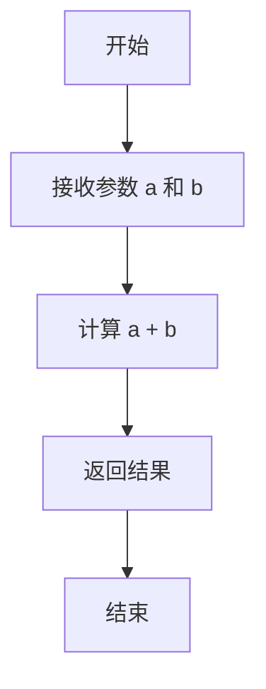
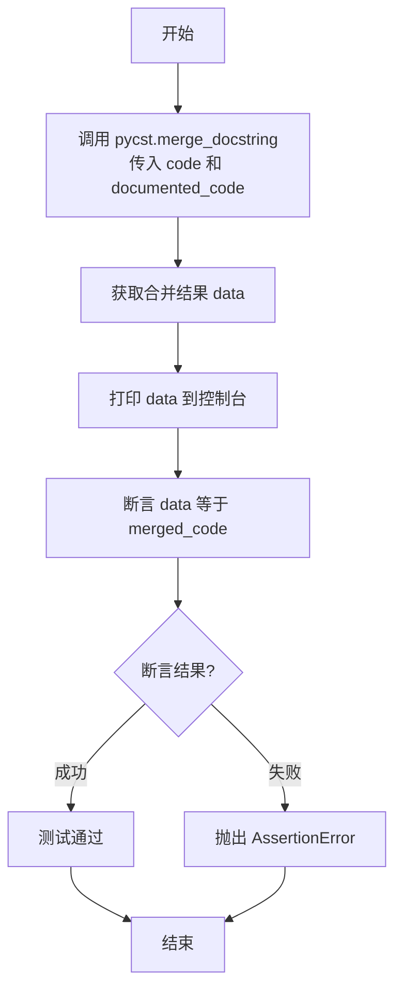
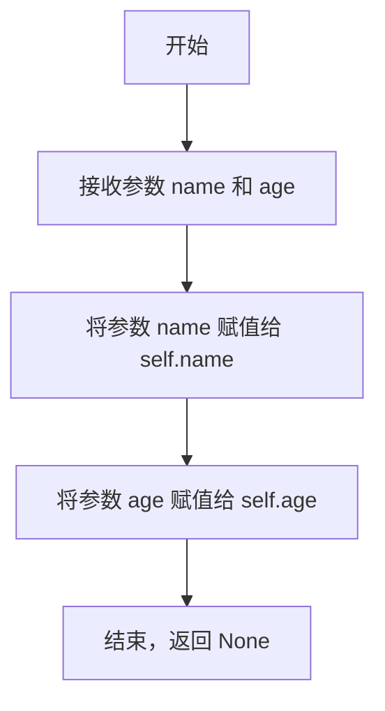
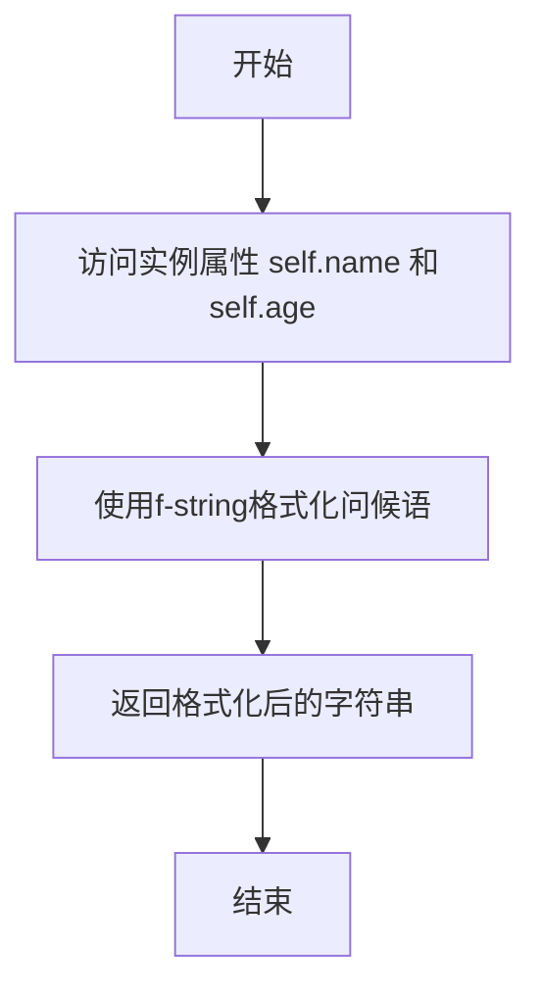

# `.\MetaGPT\tests\metagpt\utils\test_pycst.py` 详细设计文档

该代码的核心功能是测试一个文档字符串合并工具，该工具能够将源代码中的函数和类定义与独立的文档字符串描述进行智能合并，生成包含完整文档字符串的最终代码。

## 整体流程

```mermaid
graph TD
    A[开始] --> B[输入原始代码(code)]
    B --> C[输入带文档的代码(documented_code)]
    C --> D[调用pycst.merge_docstring]
    D --> E{合并成功?}
    E -- 是 --> F[输出合并后的代码(merged_code)]
    E -- 否 --> G[抛出异常]
    F --> H[断言合并结果与预期一致]
    H --> I[测试通过]
```

## 类结构

```
Module (test_merge_docstring.py)
├── Global Variables
│   ├── code
│   ├── documented_code
│   └── merged_code
├── Global Functions
│   └── test_merge_docstring
└── Classes
    └── Person
```

## 全局变量及字段


### `code`
    
包含原始函数和类定义的源代码字符串，用于测试文档字符串合并功能。

类型：`str`
    


### `documented_code`
    
包含文档字符串的源代码字符串，用于与原始代码合并以生成完整的文档化代码。

类型：`str`
    


### `merged_code`
    
合并原始代码和文档字符串后的完整源代码字符串，作为测试的预期结果。

类型：`str`
    


### `Person.name`
    
表示Person实例的姓名属性，在__init__方法中初始化。

类型：`str`
    


### `Person.age`
    
表示Person实例的年龄属性，在__init__方法中初始化。

类型：`int`
    
    

## 全局函数及方法

### `add_numbers`

该函数用于计算两个整数的和并返回结果。它通过 `@overload` 装饰器提供了类型提示，表明可以处理整数和浮点数，但实际实现仅支持整数相加。

参数：

- `a`：`int`，第一个整数
- `b`：`int`，第二个整数

返回值：`int`，两个整数的和

#### 流程图



#### 带注释源码

```python
@overload
def add_numbers(a: int, b: int):
    # 重载声明，表示函数可以接受两个整数参数
    ...

@overload
def add_numbers(a: float, b: float):
    # 重载声明，表示函数可以接受两个浮点数参数
    ...

def add_numbers(a: int, b: int):
    """This function is used to add two numbers and return the result.

    Parameters:
        a: The first integer.
        b: The second integer.

    Returns:
        int: The sum of the two numbers.
    """
    return a + b  # 返回两个整数的和
```

### `test_merge_docstring`

该函数是一个单元测试函数，用于测试 `pycst.merge_docstring` 方法的功能。它通过提供原始代码字符串和带有文档字符串的代码字符串，验证合并后的结果是否与预期的合并代码字符串一致。

参数：
- 无显式参数。该函数是一个无参数测试函数。

返回值：`None`，该函数不返回任何值，仅执行断言测试。

#### 流程图



#### 带注释源码

```python
def test_merge_docstring():
    # 调用 pycst.merge_docstring 函数，传入原始代码字符串 `code` 和带有文档字符串的代码字符串 `documented_code`。
    # 该函数预期将 `documented_code` 中的文档字符串合并到 `code` 中对应的函数和类上。
    data = pycst.merge_docstring(code, documented_code)
    
    # 打印合并后的代码字符串，便于调试和观察结果。
    print(data)
    
    # 使用断言验证合并后的 `data` 是否与预期的 `merged_code` 字符串完全一致。
    # 如果一致，测试通过；如果不一致，测试失败并抛出 AssertionError。
    assert data == merged_code
```

### `Person.__init__`

`Person` 类的构造函数，用于初始化一个`Person`对象，设置其`name`和`age`属性。

参数：
- `name`：`str`，表示人物的姓名。
- `age`：`int`，表示人物的年龄。

返回值：`None`，构造函数不显式返回值，其作用是初始化新创建的`Person`实例。

#### 流程图



#### 带注释源码

```python
def __init__(self, name: str, age: int):
    """Creates a new instance of the Person class.

    Parameters:
        name: The person's name.
        age: The person's age.
    """
    # 将传入的 name 参数赋值给实例变量 self.name
    self.name = name
    # 将传入的 age 参数赋值给实例变量 self.age
    self.age = age
```

### `Person.greet`

该方法用于生成并返回一个包含个人姓名和年龄的问候语字符串。

参数：
- `self`：`Person`，指向当前Person类实例的引用。

返回值：`str`，返回一个格式化的问候字符串，内容为“Hello, my name is {self.name} and I am {self.age} years old.”。

#### 流程图



#### 带注释源码

```python
def greet(self):
    """
    返回一个包含姓名和年龄的问候消息。

    Returns:
        str: 问候消息。
    """
    # 使用f-string格式化字符串，将实例属性self.name和self.age嵌入到问候语中
    return f"Hello, my name is {self.name} and I am {self.age} years old."
```

## 关键组件


### pycst.merge_docstring 函数

该函数是代码合并工具的核心组件，负责将源代码（包含函数和类的实现）与包含文档字符串的代码片段进行智能合并，生成一份整合了完整实现和对应文档字符串的新代码。

### 函数重载（@overload）

用于定义 `add_numbers` 函数的多态签名，表明该函数支持接收整数和浮点数两种参数类型，为静态类型检查器提供更精确的类型提示。

### Person 类

一个表示个人信息的简单数据模型类，封装了姓名和年龄属性，并提供了一个生成问候语的方法。

### 文档字符串（Docstring）

遵循特定格式（如 reStructuredText 或 Google 风格）的代码注释，用于描述模块、函数、类和方法的功能、参数、返回值及属性，是生成代码文档的基础。


## 问题及建议


### 已知问题

-   **函数重载定义与实际实现不匹配**：代码中使用了 `@overload` 装饰器为 `add_numbers` 函数声明了 `(int, int)` 和 `(float, float)` 两种签名，但实际的函数实现只支持 `(int, int)` 类型。这会导致类型检查器（如 mypy）在遇到 `add_numbers(1.0, 2.0)` 调用时可能报错，因为实现无法处理 `float` 参数，破坏了类型提示的契约。
-   **文档字符串与代码逻辑存在潜在脱节风险**：`merge_docstring` 函数通过解析和合并两个代码字符串来生成最终代码。如果原始代码 (`code`) 或文档模板 (`documented_code`) 的结构发生复杂变化（例如，嵌套类、装饰器顺序改变、复杂的表达式），当前的合并逻辑可能无法正确匹配和插入文档字符串，导致生成错误的代码。
-   **测试用例覆盖不完整**：`test_merge_docstring` 函数仅测试了一种简单的合并场景。它没有覆盖边界情况，例如：函数/类没有文档字符串时、文档字符串格式不规范时、代码中包含多个同名函数或类时、或者 `code` 与 `documented_code` 结构不完全一致时的行为。这降低了代码的健壮性。

### 优化建议

-   **修正类型提示或函数实现**：应使函数实现与其声明的类型签名保持一致。有两种方案：
    1.  **方案A（推荐）**：移除 `(float, float)` 的 `@overload` 声明，如果函数本意只处理整数。
    2.  **方案B**：修改 `add_numbers` 的函数体，使其能够同时处理 `int` 和 `float` 类型（例如，使用 `Union[int, float]` 或更通用的类型）。
-   **增强 `merge_docstring` 的鲁棒性**：建议为 `pycst.merge_docstring` 函数（或其调用）增加更完善的错误处理机制。例如，在合并失败时，可以记录警告、回退到原始代码或抛出一个更清晰的异常，而不是静默地产生可能错误的输出。同时，应补充更多针对复杂结构和异常情况的单元测试。
-   **补充全面的测试用例**：扩展 `test_merge_docstring` 测试函数，或新增测试用例，以覆盖上述提到的边界情况和潜在失败场景。这有助于确保合并功能在更广泛的情况下都能正确工作，并在未来重构时提供保障。
-   **考虑使用更现代的文档字符串格式**：示例中的文档字符串使用的是类似 reStructuredText 的格式。可以考虑迁移到更流行、工具支持更好的格式，如 Google 风格或 NumPy 风格的文档字符串，这有助于提高代码的可读性和自动化文档生成的质量。


## 其它


### 设计目标与约束

本模块的核心设计目标是提供一个代码与文档字符串的合并工具。它需要精确地解析输入的源代码和文档字符串代码，并将文档字符串插入到源代码中对应的函数和类定义处，同时保持源代码原有的结构、格式和功能不变。主要约束包括：必须正确处理Python的语法结构（如装饰器、重载函数、类方法等）；必须保持原始代码的缩进和格式；必须能够处理复杂的代码结构，确保文档字符串被插入到正确的位置。

### 错误处理与异常设计

当前代码示例中未显式展示错误处理逻辑。在 `pycst.merge_docstring` 函数的实现中，应包含对输入参数的有效性校验（例如，检查输入是否为有效的Python代码字符串）。在解析或合并过程中，如果遇到语法错误、结构不匹配（如文档字符串代码中的定义在源代码中找不到对应项）等情况，应抛出具有明确信息的异常（如 `SyntaxError`, `ValueError` 或自定义的 `MergeError`），以便调用者能够诊断问题。测试函数 `test_merge_docstring` 通过断言来验证合并结果的正确性，这是一种基础的错误检测机制。

### 数据流与状态机

1.  **输入**：两个字符串，`code`（原始源代码）和 `documented_code`（包含文档字符串的代码）。
2.  **处理**：
    *   使用 `pycst`（可能是基于LibCST库）分别解析两个输入字符串，生成抽象语法树（AST）。
    *   遍历 `documented_code` 的AST，提取函数和类的文档字符串及其签名信息。
    *   遍历 `code` 的AST，根据签名匹配，将提取到的文档字符串节点插入到对应函数或类定义的节点中。
    *   将修改后的AST重新生成为格式化的源代码字符串。
3.  **输出**：一个新的字符串，即合并了文档字符串的源代码。
    整个过程可以视为一个无状态的转换过程：输入 -> 解析与合并 -> 输出。

### 外部依赖与接口契约

*   **外部依赖**：
    *   `metagpt.utils.pycst`：这是核心依赖，推测是一个封装了LibCST或类似CST（Concrete Syntax Tree）库的工具模块，用于进行精确的源代码解析和操作。其稳定性和功能直接影响本模块的可靠性。
*   **接口契约**：
    *   `pycst.merge_docstring(code: str, documented_code: str) -> str`：这是主要的外部调用接口。契约约定：输入两个合法的Python代码字符串，输出一个合并后的、语法正确的Python代码字符串。如果输入无效或合并失败，应抛出异常。

### 测试策略

示例中展示了一个单元测试 `test_merge_docstring`。完整的测试策略还应包括：
*   **单元测试**：针对 `merge_docstring` 函数，测试边界情况（如空字符串、无文档字符串的代码、包含不同类型定义（异步函数、属性等）的代码）、错误输入（语法错误的代码）等。
*   **集成测试**：确保与 `pycst` 模块的集成工作正常。
*   **回归测试**：使用快照测试（Snapshot Testing）来确保合并操作不会意外改变代码的功能或格式，对于包含复杂格式或装饰器的代码尤其重要。

### 性能考量

*   性能主要取决于 `pycst` 模块的解析和生成效率，以及合并算法的复杂度（通常是O(n)，n为AST节点数）。
*   对于非常大的代码文件，解析和遍历AST可能会有内存和时间的开销，但在典型的文档字符串合并场景下，这通常不是瓶颈。
*   可以考虑对合并结果进行缓存（如果输入相同），但这需要评估实际使用场景中重复合并相同代码的频率。

### 安全考量

*   本模块的功能是代码转换，不直接执行用户代码，因此避免了代码注入执行的风险。
*   然而，如果 `pycst` 依赖存在漏洞，或者输入代码字符串来自不可信源且被用于其他目的（如后续的 `eval`），则可能间接引入风险。在当前上下文中，风险较低。
*   应确保在异常情况下，不会泄露内部堆栈信息或敏感数据。

    