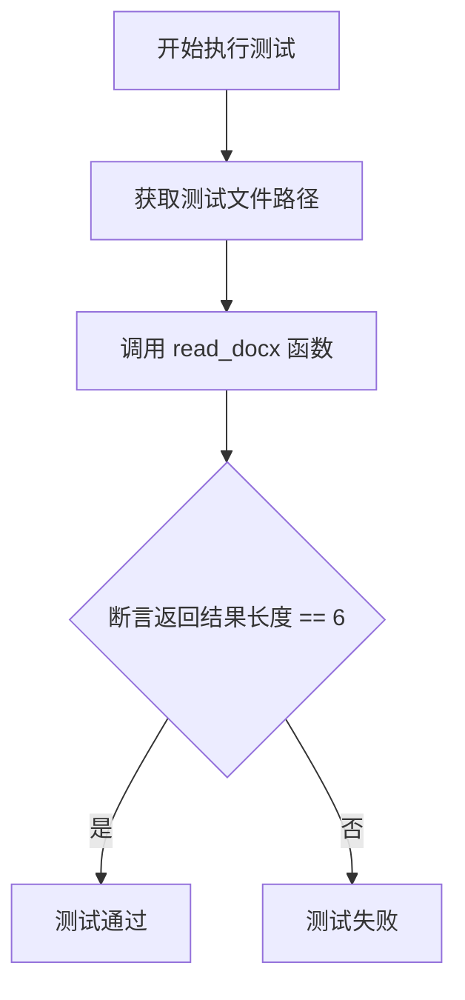

# `.\MetaGPT\tests\metagpt\utils\test_read_docx.py` 详细设计文档

该文件是一个使用 pytest 框架编写的单元测试文件，用于测试 `read_docx` 函数从指定的 `.docx` 文件中读取内容并验证其返回结果的长度是否符合预期。

## 整体流程



## 类结构

```
TestReadDocx (测试类)
└── test_read_docx (测试方法)
```

## 全局变量及字段


### `METAGPT_ROOT`
    
指向项目根目录的路径对象，用于定位项目中的资源文件。

类型：`pathlib.Path`
    


    

## 全局函数及方法


### `read_docx`

该函数用于读取 `.docx` 格式的 Word 文档，提取其中的文本内容，并将每一段文本作为一个字符串元素存入列表返回。

参数：

-  `file_path`：`Path`，指向需要读取的 `.docx` 文件的路径对象。

返回值：`List[str]`，一个字符串列表，列表中的每个元素对应文档中的一个段落（Paragraph）的文本内容。

#### 流程图

```mermaid
flowchart TD
    A[开始: read_docx(file_path)] --> B{文件路径是否存在?};
    B -- 否 --> C[抛出 FileNotFoundError 异常];
    B -- 是 --> D[使用 python-docx 库<br>打开文档];
    D --> E[遍历文档中的所有段落];
    E --> F[提取每个段落的文本内容];
    F --> G[将文本内容添加到结果列表中];
    G --> H{是否遍历完所有段落?};
    H -- 否 --> E;
    H -- 是 --> I[返回结果列表];
    I --> J[结束];
```

#### 带注释源码

```python
def read_docx(file_path: Path) -> List[str]:
    """
    读取 .docx 文件并返回一个包含所有段落文本的列表。

    Args:
        file_path (Path): 要读取的 .docx 文件的路径。

    Returns:
        List[str]: 文档中每个段落的文本列表。

    Raises:
        FileNotFoundError: 如果指定的文件路径不存在。
    """
    # 检查文件是否存在，如果不存在则抛出异常
    if not file_path.exists():
        raise FileNotFoundError(f"文件未找到: {file_path}")

    # 使用 python-docx 库的 Document 类打开文档
    doc = Document(file_path)

    # 使用列表推导式遍历文档中的所有段落（doc.paragraphs）
    # 提取每个段落（p）的文本（p.text），并过滤掉空字符串
    paragraphs = [p.text for p in doc.paragraphs if p.text.strip()]

    # 返回包含非空段落文本的列表
    return paragraphs
```


### `TestReadDocx.test_read_docx`

这是一个使用 `pytest` 框架编写的单元测试方法，用于测试 `read_docx` 函数能否正确读取一个 `.docx` 文件并返回预期的段落数量。

参数：

-  `self`：`TestReadDocx`，指向当前测试类实例的引用。

返回值：`None`，测试方法通常不显式返回值，其成功与否由断言（`assert`）决定。

#### 流程图

```mermaid
flowchart TD
    A[开始测试] --> B[构造测试文件路径<br>docx_sample]
    B --> C[调用被测函数<br>read_docx(docx_sample)]
    C --> D{断言：<br>返回列表长度 == 6?}
    D -- 是 --> E[测试通过]
    D -- 否 --> F[测试失败，抛出AssertionError]
    E --> G[结束]
    F --> G
```

#### 带注释源码

```python
def test_read_docx(self):
    # 1. 准备测试数据：构造指向测试文档的路径。
    #    METAGPT_ROOT 是项目根目录常量，`/` 操作符用于路径拼接。
    docx_sample = METAGPT_ROOT / "tests/data/docx_for_test.docx"

    # 2. 执行被测操作：调用 `read_docx` 函数读取指定路径的 .docx 文件。
    #    函数预期返回一个包含文档段落文本的列表。
    docx = read_docx(docx_sample)

    # 3. 验证结果：使用 `assert` 语句验证返回的列表长度是否为6。
    #    如果长度不等于6，`pytest` 将标记此测试为失败。
    assert len(docx) == 6
```


## 关键组件


### 测试框架与配置

使用pytest框架进行单元测试，包含测试类的定义、测试方法的实现以及测试数据的路径配置。

### 文档读取功能

通过`read_docx`函数读取指定路径的`.docx`文件内容，并返回解析后的文本数据，用于验证文档处理模块的功能正确性。

### 测试数据管理

定义了测试所需的数据文件路径（`METAGPT_ROOT / "tests/data/docx_for_test.docx"`），确保测试环境能够访问到预设的测试文档。

### 测试断言逻辑

在测试方法中，使用断言（`assert`）来验证`read_docx`函数返回的文档内容长度是否符合预期（本例中为6），作为功能正确性的核心校验点。

### 条件性测试执行

通过`@pytest.mark.skip`装饰器标记整个测试类为跳过状态，并附上跳过的原因说明（链接到相关技术问题），用于管理因外部依赖问题而暂时无法执行的测试用例。


## 问题及建议


### 已知问题

-   **测试被跳过**：测试类 `TestReadDocx` 被 `@pytest.mark.skip` 装饰器标记，导致该测试用例在常规测试运行中不会被执行。注释表明跳过原因是遇到了 `python-docx` 库相关的文件头错误 (`bad magic number for file header EOFError`)，这阻碍了对 `read_docx` 功能的验证。
-   **硬编码的测试断言**：测试断言 `assert len(docx) == 6` 依赖于一个特定测试文件 (`docx_for_test.docx`) 的精确内容（例如，段落数或字符数）。如果该测试文件被修改或替换，此测试将失败，降低了测试的健壮性和可维护性。
-   **缺乏异常情况测试**：当前测试只覆盖了正常路径（读取一个存在的、格式正确的 `.docx` 文件）。没有测试用例来验证函数在遇到异常情况时的行为，例如文件不存在、文件损坏、无读取权限或非 `.docx` 格式文件。
-   **测试数据路径依赖**：测试文件路径通过 `METAGPT_ROOT / "tests/data/docx_for_test.docx"` 硬编码。虽然使用了项目根目录常量，但这种结构将测试与特定的文件系统布局紧密耦合。

### 优化建议

-   **修复并启用测试**：应调查并解决导致 `python-docx` 读取失败的 `EOFError` 根本原因。可能的问题包括测试文件本身损坏、`python-docx` 库版本不兼容或环境问题。修复后，移除 `@pytest.mark.skip` 装饰器，确保核心文档读取功能被持续验证。
-   **增强测试断言**：将硬编码的数字断言替换为更健壮的检查。例如，可以断言返回结果非空、是字符串类型、包含预期的关键文本内容等。这使测试对测试文件内容的细微变化不那么敏感。
-   **补充异常测试用例**：使用 `pytest.raises` 或类似机制，为 `read_docx` 函数添加测试用例，验证其在输入无效（如路径不存在、文件非 `.docx` 格式）时是否按预期抛出异常或返回错误指示。这有助于完善函数的错误处理契约。
-   **使用测试夹具 (Fixture) 管理测试数据**：考虑使用 Pytest 的 `fixture` 来提供测试文件路径或内容。这可以提高测试的模块化程度，并便于在不同测试用例间共享和复用测试数据。例如，创建一个返回测试文件二进制内容的 fixture。
-   **考虑测试文件的可移植性**：确保测试文件 `docx_for_test.docx` 是项目的一部分，并且其格式与 `python-docx` 库广泛支持的 `.docx` 标准兼容，以避免环境特定的读取问题。可以将此文件作为测试资源纳入版本控制。


## 其它


### 设计目标与约束

本代码模块的核心设计目标是提供一个可靠且高效的 `.docx` 文档读取功能，作为 `metagpt` 项目工具链的一部分。其主要约束包括：
1.  **功能单一性**：专注于从 `.docx` 文件中提取纯文本内容，不涉及格式解析、图表处理等复杂功能。
2.  **外部依赖**：依赖于 `python-docx` 库，代码设计需遵循该库的接口契约和最佳实践。
3.  **性能与资源**：需能处理常规大小的文档，避免因读取大文件导致内存溢出或性能瓶颈。
4.  **错误隔离**：读取失败时应抛出明确的异常，便于调用方进行错误处理，而不应导致整个应用崩溃。
5.  **测试友好**：提供清晰的接口，便于编写单元测试和集成测试。

### 错误处理与异常设计

当前代码（`read_docx` 函数）的错误处理机制较为基础，主要依赖于 `python-docx` 库自身的异常抛出。潜在的错误场景及处理策略包括：
1.  **文件不存在或路径错误**：`python-docx` 会抛出 `FileNotFoundError` 或 `DocxPackageNotFoundError`。调用方（如测试用例）需捕获此类异常或确保路径正确。
2.  **文件格式损坏或非标准**：`python-docx` 可能抛出 `ValueError` 或 `BadZipFile` 等异常。代码本身未做额外处理，依赖调用方处理。
3.  **权限不足**：尝试读取无权限文件时，会抛出 `PermissionError`。
4.  **测试用例中的跳过机制**：由于已知的 `python-docx` 兼容性问题（如特定环境下的 `Bad magic number` 错误），测试类 `TestReadDocx` 被标记为 `@pytest.mark.skip`，这是一种临时的规避策略，而非根本的解决方案。

**优化建议**：在 `read_docx` 函数内部，可以捕获 `python-docx` 的特定异常，并封装为更具业务语义的自定义异常（如 `DocumentReadError`），同时记录详细的错误日志（如文件路径、错误原因），为调用方提供更清晰的错误上下文。

### 数据流与状态机

本模块的数据流相对简单直接，不涉及复杂的状态转换：
1.  **输入**：一个有效的文件路径（`Path` 或 `str` 对象），指向一个 `.docx` 格式的文档。
2.  **处理**：
    *   函数 `read_docx` 接收输入路径。
    *   内部调用 `python-docx` 的 `Document` 类加载文档。
    *   遍历文档中的所有段落（`paragraphs`），提取每个段落的文本（`paragraph.text`）。
    *   将所有段落的文本拼接成一个字符串。
3.  **输出**：一个字符串（`str`），包含了文档中所有段落的纯文本内容。
4.  **状态**：此过程是无状态的，每次调用都是独立的，不依赖也不修改任何外部状态。

### 外部依赖与接口契约

1.  **主要外部库**：
    *   `python-docx`：核心依赖，用于解析 `.docx` 文件格式。版本兼容性需在项目依赖文件（如 `requirements.txt` 或 `pyproject.toml`）中明确指定。
2.  **接口契约**：
    *   **函数 `read_docx`**：
        *   **输入契约**：接受一个类型为 `Union[str, Path]` 的参数，代表 `.docx` 文件的路径。路径应指向一个存在且可读的有效 `.docx` 文件。
        *   **输出契约**：返回一个 `str` 类型，即文档的纯文本内容。对于空文档，应返回空字符串 `""`。
        *   **异常契约**：当输入文件无法读取或解析时，应允许底层 `python-docx` 的异常（如 `FileNotFoundError`, `ValueError`）向上抛出。建议在文档字符串中明确声明可能抛出的异常类型。
3.  **项目内部依赖**：
    *   `metagpt.const.METAGPT_ROOT`：用于在测试中定位项目根目录，以获取测试数据文件的绝对路径。这保证了测试在不同环境下的可移植性。
    *   `pytest`：仅用于编写和执行单元测试，不属于生产代码的运行时依赖。

### 测试策略与覆盖

1.  **测试范围**：当前仅有一个测试用例 `test_read_docx`，用于验证 `read_docx` 函数能正确读取一个已知的测试文档（`docx_for_test.docx`）并返回预期长度的字符串。
2.  **测试数据**：使用项目内预置的静态测试文件，确保了测试的一致性和可重复性。
3.  **已知问题**：测试类被 `@pytest.mark.skip` 装饰器跳过，原因是 `python-docx` 在某些环境下存在兼容性问题。这构成了一个明显的**测试债务**，理想情况下应解决环境问题或寻找更稳定的依赖库，使测试能够稳定运行。
4.  **覆盖不足**：现有测试未覆盖以下重要场景：
    *   **异常路径**：未测试文件不存在、文件损坏、非 `.docx` 格式文件等错误情况下的行为。
    *   **边界情况**：未测试空文档、超大文档、包含特殊字符或格式的文档。
    *   **性能测试**：未对读取大文件时的内存和耗时进行验证。
    *   **接口一致性**：未验证函数对 `str` 和 `Path` 类型输入的处理是否一致。


    