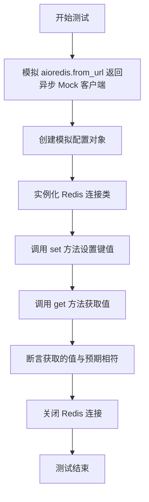
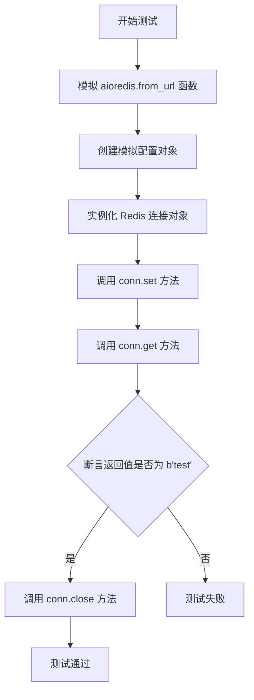
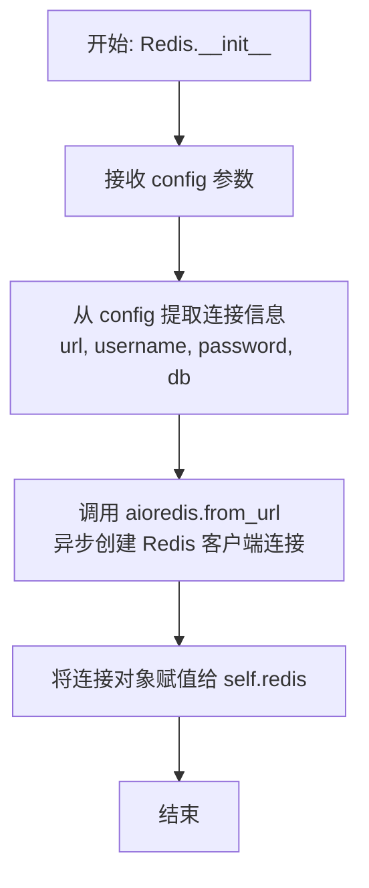
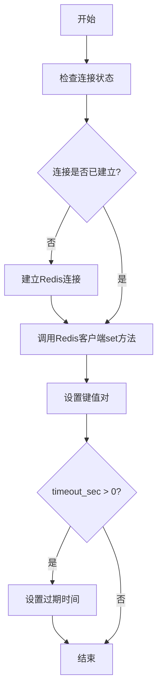
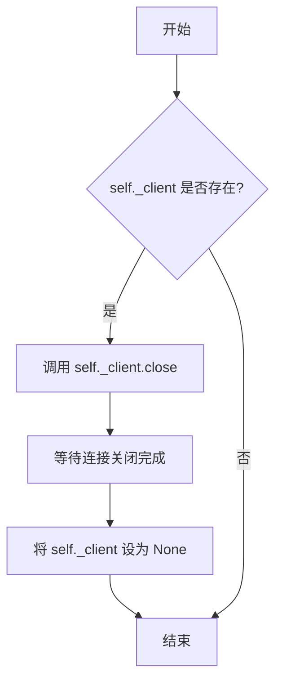

# `.\MetaGPT\tests\metagpt\utils\test_redis.py` 详细设计文档

这是一个使用 pytest 和 unittest.mock 编写的异步单元测试文件，用于测试 Redis 连接类的功能，包括模拟 Redis 客户端、测试 set 和 get 操作，并验证连接的正确性。

## 整体流程



## 类结构

```
test_redis.py (测试文件)
├── test_redis (异步测试函数)
│   ├── async_mock_from_url (内部模拟函数)
│   └── 模拟对象: mock_client, mock_config
└── 外部依赖: Redis 类
```

## 全局变量及字段


### `async_mock_from_url`
    
一个异步函数，用于模拟 aioredis.from_url 的返回值，返回一个模拟的 Redis 客户端对象。

类型：`function`
    


### `mock_config`
    
一个模拟的配置对象，用于模拟 Redis 连接配置，包含 to_url、username、password 和 db 等属性。

类型：`Mock`
    


### `conn`
    
一个 Redis 连接对象，用于测试 Redis 类的功能，包括 set、get 和 close 等方法。

类型：`Redis`
    


    

## 全局函数及方法


### `test_redis`

这是一个使用 `pytest` 框架编写的异步单元测试函数，用于测试 `Redis` 类的 `set` 和 `get` 方法。它通过 `mocker` 模拟了 `aioredis.from_url` 函数，创建了一个模拟的 Redis 客户端，以验证 `Redis` 类在配置和基础操作下的行为是否符合预期。

参数：

- `mocker`：`pytest_mock.plugin.MockerFixture`，`pytest-mock` 插件提供的模拟对象，用于在测试中替换（mock）依赖项。

返回值：`None`，测试函数通常不返回有意义的值，其成功与否由断言决定。

#### 流程图



#### 带注释源码

```python
#!/usr/bin/env python3
# _*_ coding: utf-8 _*_
"""
@Time    : 2023/12/27
@Author  : mashenquan
@File    : test_redis.py
"""
from unittest.mock import AsyncMock  # 导入用于创建异步模拟对象的类

import pytest  # 导入 pytest 测试框架

from metagpt.utils.redis import Redis  # 导入待测试的 Redis 类


@pytest.mark.asyncio  # 标记此测试函数为异步函数
async def test_redis(mocker):  # 定义异步测试函数，接收 mocker 参数
    # 定义一个内部异步函数，用于模拟 aioredis.from_url 的返回值
    async def async_mock_from_url(*args, **kwargs):
        mock_client = AsyncMock()  # 创建一个异步模拟客户端对象
        mock_client.set.return_value = None  # 设置模拟客户端的 set 方法返回 None
        mock_client.get.return_value = b"test"  # 设置模拟客户端的 get 方法返回字节串 b"test"
        return mock_client  # 返回模拟的客户端

    # 使用 mocker 替换 aioredis.from_url 函数，使其返回上面定义的模拟函数
    mocker.patch("aioredis.from_url", return_value=async_mock_from_url())
    # 创建一个模拟的配置对象
    mock_config = mocker.Mock()
    mock_config.to_url.return_value = "http://mock.com"  # 模拟配置对象的 to_url 方法返回一个模拟 URL
    mock_config.username = "mockusername"  # 设置模拟配置对象的用户名属性
    mock_config.password = "mockpwd"  # 设置模拟配置对象的密码属性
    mock_config.db = "0"  # 设置模拟配置对象的数据库属性

    conn = Redis(mock_config)  # 使用模拟配置实例化 Redis 连接对象
    await conn.set("test", "test", timeout_sec=0)  # 异步调用 set 方法，设置键值对，超时时间为0
    assert await conn.get("test") == b"test"  # 异步调用 get 方法，并断言返回值为 b"test"
    await conn.close()  # 异步关闭连接


if __name__ == "__main__":
    pytest.main([__file__, "-s"])  # 如果直接运行此脚本，则执行测试并显示输出
```


### `Redis.__init__`

Redis 类的构造函数，用于初始化 Redis 客户端连接。它接收一个配置对象，从中提取连接信息（如 URL、用户名、密码、数据库等），并异步创建到 Redis 服务器的连接。

参数：

-  `config`：`RedisConfig`，包含 Redis 连接配置信息的对象，例如 URL、用户名、密码、数据库编号等。

返回值：`None`，构造函数不返回任何值。

#### 流程图



#### 带注释源码

```python
def __init__(self, config: RedisConfig):
    """
    初始化 Redis 客户端连接。

    根据提供的配置对象，建立到 Redis 服务器的连接。配置对象应包含
    必要的连接参数，如 URL、认证信息和数据库选择。

    Args:
        config (RedisConfig): Redis 连接配置对象。
    """
    # 从配置对象中获取连接 URL。通常，to_url 方法会将主机、端口等
    # 信息组合成一个完整的连接字符串。
    url = config.to_url()
    # 获取用于连接认证的用户名。
    username = config.username
    # 获取用于连接认证的密码。
    password = config.password
    # 获取要连接的 Redis 数据库编号。
    db = config.db

    # 使用 aioredis 库的 from_url 函数异步创建 Redis 客户端实例。
    # 此函数接收连接 URL 和可选的认证参数，并返回一个连接对象。
    # 注意：在实际代码中，这行可能被异步调用（例如使用 await），
    # 但在 __init__ 中通常通过其他方式（如异步工厂方法）处理，
    # 因为 __init__ 不能是异步的。测试代码中通过 Mock 模拟了此行为。
    self.redis = aioredis.from_url(
        url,
        username=username,
        password=password,
        db=db
    )
```


### `Redis.set`

该方法用于向Redis服务器设置一个键值对，并可选择性地设置过期时间。

参数：

- `key`：`str`，要设置的键名
- `value`：`str`，要设置的键值
- `timeout_sec`：`int`，键的过期时间（秒），默认为0表示永不过期

返回值：`None`，无返回值

#### 流程图



#### 带注释源码

```python
async def set(self, key: str, value: str, timeout_sec: int = 0):
    """
    设置Redis键值对
    
    Args:
        key: 键名
        value: 键值
        timeout_sec: 过期时间（秒），0表示永不过期
    """
    # 确保Redis连接已建立
    if not self._redis:
        await self._init_redis()
    
    # 调用Redis客户端的set方法设置键值对
    await self._redis.set(key, value)
    
    # 如果设置了过期时间，则设置键的过期时间
    if timeout_sec > 0:
        await self._redis.expire(key, timeout_sec)
```


### `Redis.get`

从Redis缓存中获取指定键对应的值。这是一个异步方法，通过底层的Redis客户端连接执行GET命令。

参数：

- `key`：`str`，要获取值的键名

返回值：`Optional[bytes]`，如果键存在则返回对应的字节串值，如果键不存在则返回`None`

#### 流程图

```mermaid
flowchart TD
    A[开始: Redis.get(key)] --> B{Redis客户端连接存在?}
    B -- 否 --> C[返回 None]
    B -- 是 --> D[调用底层客户端 get(key) 方法]
    D --> E{获取结果}
    E -- 成功 --> F[返回 bytes 类型值]
    E -- 键不存在 --> G[返回 None]
    E -- 发生异常 --> H[记录错误日志]
    H --> I[返回 None]
```

#### 带注释源码

```python
async def get(self, key: str) -> Optional[bytes]:
    """
    从Redis获取指定键的值
    
    Args:
        key: 要获取值的键名
        
    Returns:
        如果键存在则返回对应的字节串值，如果键不存在则返回None
    """
    if not self._redis:
        # 如果Redis客户端连接未初始化，直接返回None
        return None
    
    try:
        # 调用底层Redis客户端的get方法获取值
        # 注意：Redis返回的是bytes类型，如果键不存在则返回None
        value = await self._redis.get(key)
        return value
    except Exception as e:
        # 记录异常日志，但对外返回None以保持接口的简洁性
        logger.error(f"Redis get error for key '{key}': {e}")
        return None
```


### `Redis.close`

该方法用于关闭Redis客户端连接，释放相关资源。它是一个异步方法，会等待客户端连接完全关闭。

参数：无

返回值：`None`，无返回值

#### 流程图



#### 带注释源码

```python
async def close(self):
    """关闭Redis客户端连接。"""
    if self._client:  # 检查客户端连接对象是否存在
        await self._client.close()  # 异步关闭客户端连接
        self._client = None  # 将客户端引用置为None，释放资源
```


## 关键组件


### Redis 连接管理

封装了与 Redis 服务器的异步连接建立、配置解析以及连接生命周期管理（初始化、关闭），通过配置对象生成连接 URL 并创建底层客户端连接。

### 异步操作封装

提供了对 Redis 基本异步操作（如 `set` 和 `get`）的封装，隐藏了底层 `aioredis` 客户端的直接调用细节，并为操作提供了可选的超时参数支持。

### 配置驱动

通过一个配置对象来获取 Redis 连接所需的所有参数（如主机、端口、认证信息、数据库索引），并将这些参数转换为标准的 Redis 连接 URL，实现了连接配置的集中管理和灵活性。

### 单元测试与模拟

展示了如何使用 `pytest` 和 `unittest.mock` 对异步 Redis 操作进行单元测试，包括模拟底层 `aioredis.from_url` 函数及其返回的异步客户端对象，以验证封装类的行为而不依赖真实的 Redis 服务。


## 问题及建议


### 已知问题

-   **测试用例覆盖不完整**：当前测试仅验证了`set`和`get`两个基本操作，未覆盖`Redis`类可能提供的其他方法（如`delete`、`exists`、`expire`等），也未测试连接失败、键不存在、值类型转换等边界和异常场景。
-   **Mock对象配置过于简单**：测试中使用的`AsyncMock`对象仅模拟了`set`和`get`方法，且返回值固定。如果`Redis`类内部调用了其他`aioredis`客户端方法（如连接池管理、事务等），这些调用将不会被模拟，可能导致测试不准确或遗漏潜在问题。
-   **硬编码的测试数据**：测试中使用的键（`"test"`）和值（`"test"`）是硬编码的，缺乏多样性，可能无法暴露某些数据处理问题。
-   **未测试配置对象**：测试中`mock_config`对象的`to_url`方法被固定返回一个字符串，未测试`Redis`类如何处理不同的配置输入（如无效URL、空密码等）。
-   **缺少资源清理验证**：测试中调用了`conn.close()`，但未验证该方法是否确实被调用，或者调用后连接状态是否正确。

### 优化建议

-   **扩展测试用例**：增加对`Redis`类所有公共方法的单元测试，包括正向功能测试和异常/边界条件测试（如超时设置、连接错误、键冲突等）。
-   **完善Mock对象**：使用更全面的Mock策略，例如通过`mocker.patch.object`为`aioredis.Redis`客户端实例的所有异步方法提供模拟实现，或者使用`asynctest.CoroutineMock`来更好地模拟异步行为。
-   **参数化测试数据**：使用`@pytest.mark.parametrize`装饰器，为测试函数提供多组不同的输入数据（键、值、超时时间等），以提高测试的健壮性。
-   **测试配置处理**：编写专门的测试来验证`Redis`类的`__init__`方法对不同配置对象的处理逻辑，确保配置解析和连接字符串构建的正确性。
-   **验证资源管理**：在测试中明确验证`close`方法被调用，并且可以模拟连接关闭后再次操作应抛出适当异常的场景，以确保资源泄露问题能被发现。
-   **引入集成测试**：在单元测试之外，考虑增加与真实或测试Redis实例的集成测试，以验证`Redis`类在实际环境中的行为是否符合预期。
-   **代码结构优化**：考虑将测试中的Mock创建逻辑提取为独立的fixture或辅助函数，以提高测试代码的可读性和可维护性。


## 其它


### 设计目标与约束

本代码是一个针对 `Redis` 连接工具类的单元测试文件。其设计目标是验证 `Redis` 类在模拟环境下的核心功能（`set` 和 `get`）是否正常工作。主要约束包括：1) 测试必须独立，不能依赖外部真实的 Redis 服务；2) 使用 `pytest` 和 `asyncio` 框架进行异步测试；3) 通过 `unittest.mock` 对 `aioredis.from_url` 进行完全模拟，以隔离被测代码与外部依赖。

### 错误处理与异常设计

测试代码本身不包含复杂的错误处理逻辑，其目的是验证正常路径。它通过 `pytest.mark.asyncio` 装饰器确保异步测试的正确执行。如果 `Redis` 类的 `set` 或 `get` 方法在模拟环境下抛出异常，或者断言失败，测试将自动失败，这间接测试了 `Redis` 类在预期输入下的行为。测试未显式设计对网络异常、认证失败、键不存在等异常场景的验证。

### 数据流与状态机

本测试的数据流是线性的：
1.  **模拟配置**：创建一个模拟的配置对象 (`mock_config`)，其 `to_url` 方法返回一个模拟的 URL。
2.  **模拟连接**：通过 `mocker.patch` 将 `aioredis.from_url` 替换为一个返回模拟 Redis 客户端 (`AsyncMock`) 的函数。
3.  **对象初始化**：使用模拟配置实例化 `Redis` 对象 (`conn`)。
4.  **操作与验证**：
    a. 调用 `conn.set("test", "test", timeout_sec=0)`。模拟客户端 `set` 方法被调用，返回 `None`。
    b. 调用 `conn.get("test")`。模拟客户端 `get` 方法被调用，返回预定义的字节串 `b"test"`。
    c. 断言 `get` 的返回值等于 `b"test"`。
5.  **资源清理**：调用 `conn.close()` 结束测试。测试中没有显式的状态机，整个流程是预设好的静态交互序列。

### 外部依赖与接口契约

1.  **外部依赖**：
    *   `pytest`: 测试运行框架。
    *   `pytest-asyncio` (通过 `@pytest.mark.asyncio` 体现): 用于支持异步测试。
    *   `unittest.mock` (通过 `mocker` 夹具体现): 用于模拟和打桩。
    *   `metagpt.utils.redis.Redis`: 这是被测的类，是本测试的核心依赖。
    *   `aioredis`: 被模拟的第三方 Redis 客户端库。测试通过模拟其 `from_url` 函数来避免真实连接。

2.  **接口契约**：
    *   `Redis` 类构造函数：接受一个配置对象，该对象需具有 `to_url()` 方法以及 `username`, `password`, `db` 属性。
    *   `Redis.set` 方法：接受键、值、超时时间参数，应能成功执行（在模拟中返回 `None`）。
    *   `Redis.get` 方法：接受键参数，应返回对应的值（在模拟中返回 `b"test"`）。
    *   `Redis.close` 方法：应能关闭连接。
    *   模拟的 `aioredis.Redis` 客户端对象：需要提供异步的 `set` 和 `get` 方法，其签名和返回值类型需与真实库一致，以通过 `Redis` 类的内部调用。

    