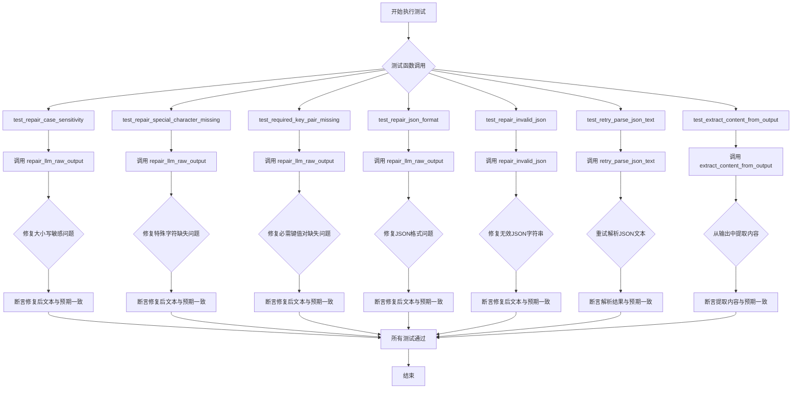
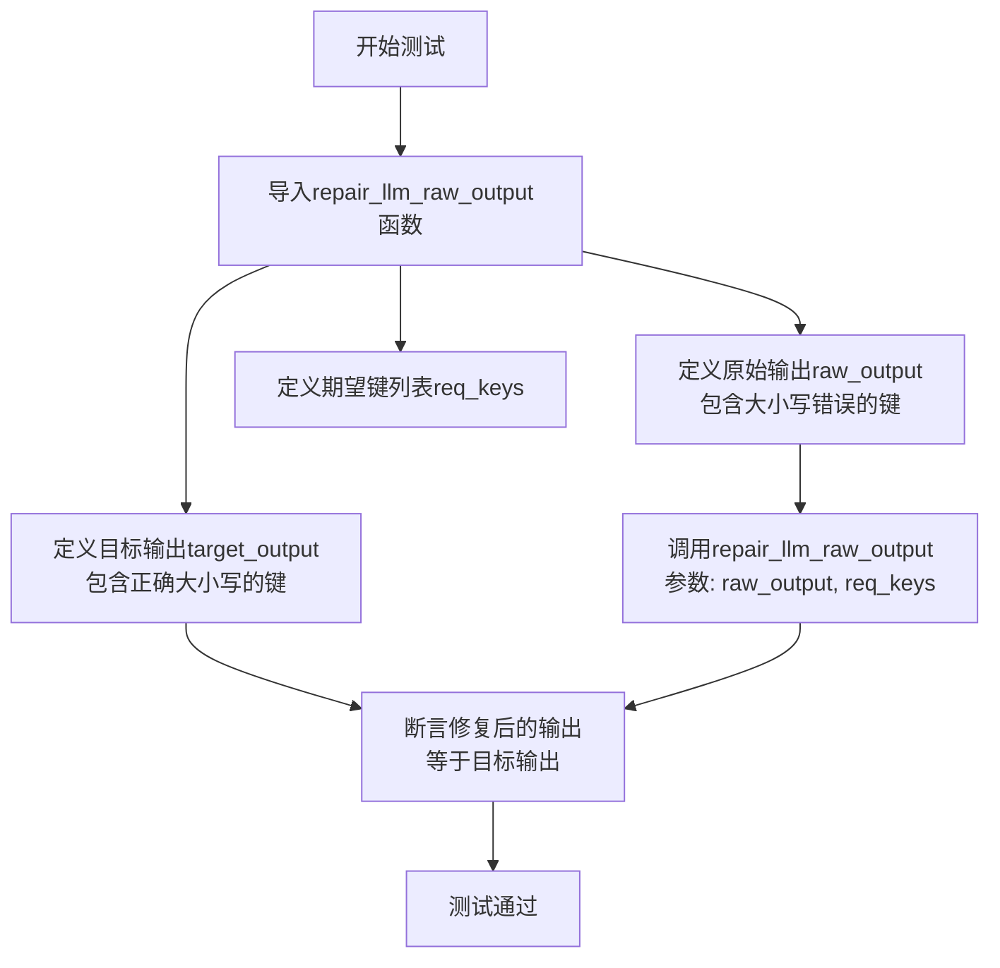
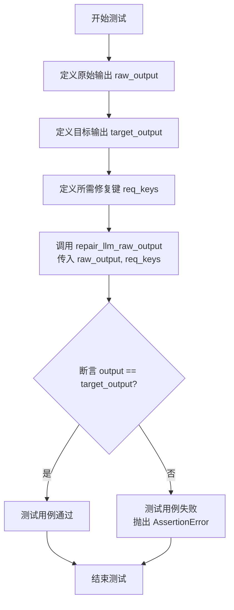
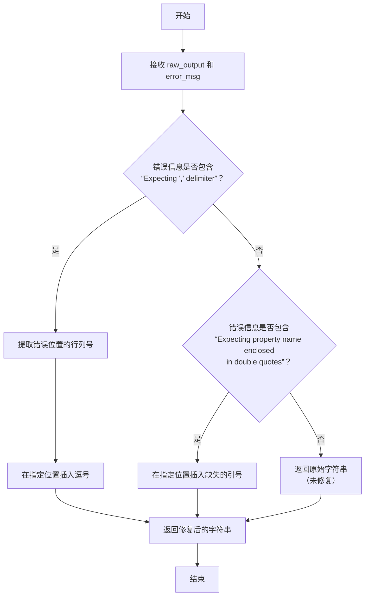
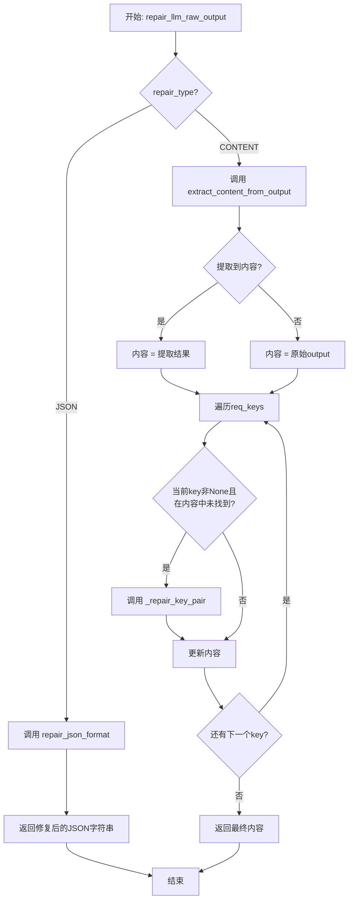
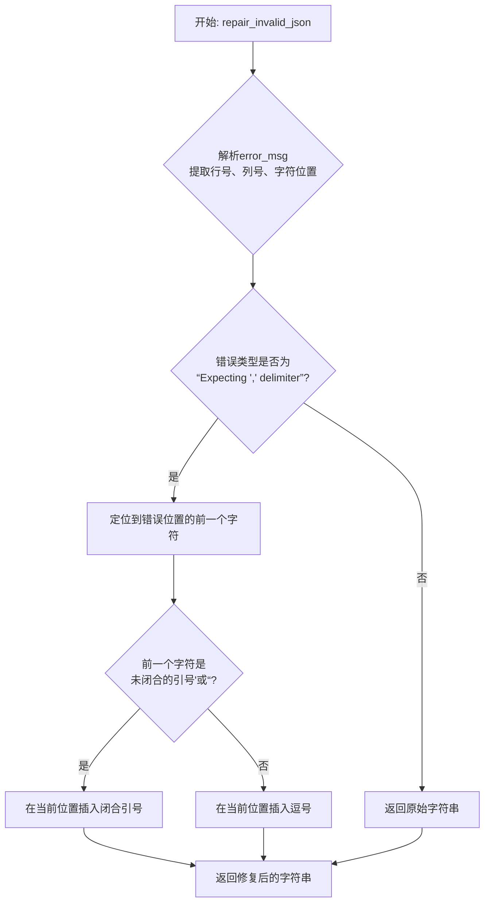
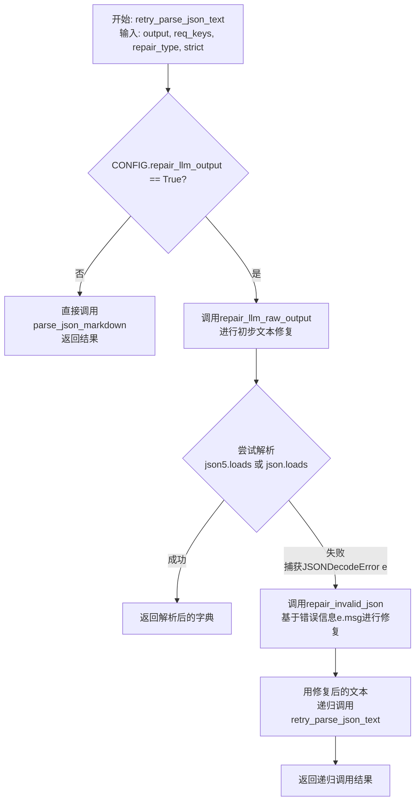

# `.\MetaGPT\tests\metagpt\utils\test_repair_llm_raw_output.py` 详细设计文档

该文件是一个单元测试文件，用于测试 `metagpt.utils.repair_llm_raw_output` 模块中的功能。该模块的核心功能是修复和解析由大型语言模型（LLM）生成的、可能格式不规范的原始输出文本，特别是针对JSON格式的文本，使其能够被正确解析。测试覆盖了大小写敏感修复、特殊字符缺失修复、JSON格式修复、无效JSON修复、重试解析JSON文本以及从输出中提取内容等多种场景。

## 整体流程



## 类结构

```
测试文件 (test_repair_llm_raw_output.py)
├── 全局配置 (config.repair_llm_output = True)
├── 测试函数 test_repair_case_sensitivity
├── 测试函数 test_repair_special_character_missing
├── 测试函数 test_required_key_pair_missing
├── 测试函数 test_repair_json_format
├── 测试函数 test_repair_invalid_json
├── 测试函数 test_retry_parse_json_text
└── 测试函数 test_extract_content_from_output
```

## 全局变量及字段


### `config`
    
全局配置对象，用于管理应用程序的配置设置，包括LLM输出修复功能的开关。

类型：`metagpt.config2.Config`
    


    

## 全局函数及方法


### `test_repair_case_sensitivity`

这是一个单元测试函数，用于测试 `repair_llm_raw_output` 函数在修复LLM原始输出中键名大小写不匹配问题时的功能。它通过提供一个包含大小写错误键名的原始JSON字符串，与预期的正确键名列表进行对比，验证修复后的输出是否与目标输出一致。

参数：

-  `raw_output`：`str`，包含大小写错误键名的原始JSON字符串。
-  `target_output`：`str`，修复后预期的正确JSON字符串。
-  `req_keys`：`list[str]`，一个包含所有期望键名（正确大小写形式）的列表。

返回值：`None`，这是一个单元测试函数，不返回任何值，通过 `assert` 语句验证测试结果。

#### 流程图



#### 带注释源码

```python
def test_repair_case_sensitivity():
    # 从指定模块导入需要测试的函数
    from metagpt.utils.repair_llm_raw_output import repair_llm_raw_output

    # 定义一个包含大小写错误键名的原始JSON字符串
    # 例如："Original requirements" 应为 "Original Requirements"
    raw_output = """{
    "Original requirements": "Write a 2048 game",
    "search Information": "",
    "competitive Quadrant charT": "quadrantChart
                Campaign A: [0.3, 0.6]",
    "requirement analysis": "The 2048 game should be simple to play"
}"""
    # 定义修复后期望得到的正确JSON字符串
    target_output = """{
    "Original Requirements": "Write a 2048 game",
    "Search Information": "",
    "Competitive Quadrant Chart": "quadrantChart
                Campaign A: [0.3, 0.6]",
    "Requirement Analysis": "The 2048 game should be simple to play"
}"""
    # 定义所有期望的键名列表（正确的大小写形式）
    req_keys = ["Original Requirements", "Search Information", "Competitive Quadrant Chart", "Requirement Analysis"]
    # 调用被测试函数，传入原始输出和期望键列表
    output = repair_llm_raw_output(output=raw_output, req_keys=req_keys)
    # 使用断言验证修复后的输出是否与目标输出完全一致
    assert output == target_output
```


### `test_repair_special_character_missing`

这是一个单元测试函数，用于测试 `repair_llm_raw_output` 函数在修复缺失的特殊字符（特别是闭合标签 `[/CONTENT]`）方面的功能。它通过提供包含不完整标签的原始输出字符串，验证修复函数是否能正确地补全缺失的闭合标签。

参数：
-  `raw_output`：`str`，模拟大语言模型（LLM）输出的、可能缺失闭合标签的原始文本字符串。
-  `target_output`：`str`，期望修复后的、包含正确闭合标签的目标文本字符串。
-  `req_keys`：`list`，一个字符串列表，指定需要修复或补全的关键词或标签，在本测试中主要用于指定闭合标签 `[/CONTENT]`。

返回值：`None`，该函数不返回任何值，其核心功能是通过 `assert` 语句验证修复结果是否符合预期。

#### 流程图



#### 带注释源码

```python
def test_repair_special_character_missing():
    # 导入待测试的修复函数
    from metagpt.utils.repair_llm_raw_output import repair_llm_raw_output

    # 测试用例1：原始输出中缺少闭合标签 `[/CONTENT]`
    raw_output = """[CONTENT]
    "Anything UNCLEAR": "No unclear requirements or information."
[CONTENT]"""  # 注意：这里以 `[CONTENT]` 结尾，缺少 `/`

    target_output = """[CONTENT]
    "Anything UNCLEAR": "No unclear requirements or information."
[/CONTENT]"""  # 期望修复后，结尾变为 `[/CONTENT]`
    # 指定需要修复的键为闭合标签
    req_keys = ["[/CONTENT]"]
    # 调用修复函数
    output = repair_llm_raw_output(output=raw_output, req_keys=req_keys)
    # 断言修复结果与期望一致
    assert output == target_output

    # 测试用例2：更复杂的场景，中间有额外标签和内容，但结尾仍缺少 `[/CONTENT]`
    raw_output = """[CONTENT] tag
[CONTENT]
{
"Anything UNCLEAR": "No unclear requirements or information."
}
[CONTENT]"""  # 结尾是 `[CONTENT]`
    target_output = """[CONTENT] tag
[CONTENT]
{
"Anything UNCLEAR": "No unclear requirements or information."
}
[/CONTENT]"""  # 期望结尾修复为 `[/CONTENT]`
    # 使用相同的修复键
    output = repair_llm_raw_output(output=raw_output, req_keys=req_keys)
    assert output == target_output

    # 测试用例3：单行紧凑格式，同样缺少闭合标签
    raw_output = '[CONTENT] {"a": "b"} [CONTENT]'  # 结尾是 `[CONTENT]`
    target_output = '[CONTENT] {"a": "b"} [/CONTENT]'  # 期望结尾修复为 `[/CONTENT]`
    # 调用修复函数，并指定修复键
    output = repair_llm_raw_output(output=raw_output, req_keys=["[/CONTENT]"])
    assert output == target_output
```


### `test_required_key_pair_missing`

这是一个单元测试函数，用于测试 `repair_llm_raw_output` 函数在处理缺失的必需键值对（特别是闭合标签 `[/CONTENT]`）时的修复能力。它通过提供不包含闭合标签的原始输出字符串，验证函数是否能正确地追加缺失的闭合标签，并确保修复后的输出与预期目标一致。

参数：

-  `raw_output`：`str`，模拟的、可能缺失了必需闭合标签（如 `[/CONTENT]`）的原始LLM输出字符串。
-  `target_output`：`str`，期望修复后的、包含正确闭合标签的目标输出字符串。
-  `req_keys`：`list[str]`，一个字符串列表，指定需要修复的必需键或标签。在本测试中，主要关注 `["[/CONTENT]"]`。
-  `output`：`str`，调用 `repair_llm_raw_output` 函数后得到的实际修复结果。

返回值：`None`，该函数不返回任何值，其核心功能是通过 `assert` 语句验证修复结果是否符合预期。

#### 流程图

```mermaid
flowchart TD
    A[开始测试] --> B[定义原始输出 raw_output]
    B --> C[定义目标输出 target_output]
    C --> D[定义必需键列表 req_keys<br>（如 `["[/CONTENT]"]`）]
    D --> E[调用 repair_llm_raw_output<br>（raw_output, req_keys）]
    E --> F[获取修复结果 output]
    F --> G{assert output == target_output?}
    G -- 是 --> H[测试通过]
    G -- 否 --> I[测试失败，抛出 AssertionError]
    H --> J[结束测试]
    I --> J
```

#### 带注释源码

```python
def test_required_key_pair_missing():
    # 导入待测试的核心函数
    from metagpt.utils.repair_llm_raw_output import repair_llm_raw_output

    # 测试用例1：原始输出缺少闭合标签 `[/CONTENT]`
    raw_output = '[CONTENT] {"a": "b"}'
    target_output = '[CONTENT] {"a": "b"}\n[/CONTENT]'  # 期望修复后追加闭合标签

    # 调用修复函数，指定需要修复的必需键为闭合标签
    output = repair_llm_raw_output(output=raw_output, req_keys=["[/CONTENT]"])
    # 断言修复结果与预期目标一致
    assert output == target_output

    # 测试用例2：原始输出包含不完整的JSON结构（使用了 `]` 而非 `}`）且缺少闭合标签
    raw_output = """[CONTENT]
{
    "key": "value"
]"""
    target_output = """[CONTENT]
{
    "key": "value"
]
[/CONTENT]"""  # 期望修复后追加闭合标签，不改变内部错误结构

    output = repair_llm_raw_output(output=raw_output, req_keys=["[/CONTENT]"])
    assert output == target_output

    # 测试用例3：原始输出包含额外文本和换行，且缺少闭合标签
    raw_output = """[CONTENT] tag
[CONTENT]
{
    "key": "value"
}
xxx
"""
    target_output = """[CONTENT]
{
    "key": "value"
}
[/CONTENT]"""  # 期望修复后移除多余文本和标签，并追加正确的闭合标签

    output = repair_llm_raw_output(output=raw_output, req_keys=["[/CONTENT]"])
    assert output == target_output
```


### `test_repair_json_format`

这是一个单元测试函数，用于测试 `repair_llm_raw_output` 函数在 `RepairType.JSON` 模式下的修复能力。它通过提供一系列格式错误的 JSON 字符串作为输入，验证函数是否能将其修复为有效的 JSON 格式，并与预期输出进行比较。

参数：

-  `raw_output`：`str`，包含格式错误的 JSON 字符串的原始输出。
-  `target_output`：`str`，修复后预期的、格式正确的 JSON 字符串。
-  `req_keys`：`list`，一个包含 `None` 的列表，用于指示修复类型为 JSON 格式修复。
-  `repair_type`：`RepairType`，指定修复类型为 `RepairType.JSON`。

返回值：`None`，该函数为测试函数，不返回业务值，仅通过 `assert` 语句验证测试结果。

#### 流程图

```mermaid
flowchart TD
    A[开始测试] --> B[导入repair_llm_raw_output和RepairType]
    B --> C[定义测试用例<br>raw_output, target_output]
    C --> D[调用repair_llm_raw_output<br>output=raw_output, req_keys=[None], repair_type=RepairType.JSON]
    D --> E{断言 output == target_output?}
    E -- 是 --> F[测试用例通过]
    E -- 否 --> G[测试用例失败<br>抛出AssertionError]
    F --> H[重复执行下一个测试用例]
    G --> I[测试终止]
    H --> C
```

#### 带注释源码

```python
def test_repair_json_format():
    # 从指定模块导入测试所需的函数和枚举类型
    from metagpt.utils.repair_llm_raw_output import RepairType, repair_llm_raw_output

    # 测试用例1: 修复多余的右方括号 `]`
    raw_output = "{ xxx }]"
    target_output = "{ xxx }"
    # 调用修复函数，指定修复类型为JSON格式修复
    output = repair_llm_raw_output(output=raw_output, req_keys=[None], repair_type=RepairType.JSON)
    # 断言修复后的输出与预期目标一致
    assert output == target_output

    # 测试用例2: 修复缺失的右方括号 `]`
    raw_output = "[{ xxx }"
    target_output = "{ xxx }"
    output = repair_llm_raw_output(output=raw_output, req_keys=[None], repair_type=RepairType.JSON)
    assert output == target_output

    # 测试用例3: 修复不匹配的括号 `{` 和 `]`
    raw_output = "{ xxx ]"
    target_output = "{ xxx }"
    output = repair_llm_raw_output(output=raw_output, req_keys=[None], repair_type=RepairType.JSON)
    assert output == target_output

    # 测试用例4: 移除JSON字符串中的Python风格注释 `#`
    raw_output = """
{
    "Language": "en_us",  # define language
    "Programming Language": "Python"
}
"""
    target_output = """{
    "Language": "en_us",
    "Programming Language": "Python"
}"""
    output = repair_llm_raw_output(output=raw_output, req_keys=[None], repair_type=RepairType.JSON)
    assert output == target_output

    # 测试用例5: 移除JSON字符串中的多种风格注释 `//` 和 `#`
    raw_output = """
{
    "Language": "en_us",  // define language
    "Programming Language": "Python" # define code language
}
"""
    target_output = """{
    "Language": "en_us",
    "Programming Language": "Python"
}"""
    output = repair_llm_raw_output(output=raw_output, req_keys=[None], repair_type=RepairType.JSON)
    assert output == target_output

    # 测试用例6: 确保修复逻辑不会错误地移除字符串值内部的注释符号
    raw_output = """
    {
        "Language": "#en_us#",  // define language
        "Programming Language": "//Python # Code // Language//" # define code language
    }
    """
    target_output = """{
        "Language": "#en_us#",
        "Programming Language": "//Python # Code // Language//"
    }"""
    output = repair_llm_raw_output(output=raw_output, req_keys=[None], repair_type=RepairType.JSON)
    assert output == target_output
```


### `repair_invalid_json`

该函数用于修复无效的JSON字符串。它接收一个原始的JSON字符串和一个JSON解析错误信息，根据错误信息中指示的特定错误位置（例如，缺少逗号分隔符或引号不匹配），对原始字符串进行相应的修复操作，并返回修复后的字符串。

参数：

-  `raw_output`：`str`，原始的、包含错误的JSON字符串。
-  `error_msg`：`str`，JSON解析器返回的错误信息，用于定位需要修复的具体位置和错误类型。

返回值：`str`，修复后的JSON字符串。

#### 流程图



#### 带注释源码

```python
def repair_invalid_json(raw_output: str, error_msg: str) -> str:
    """
    根据JSON解析错误信息，修复无效的JSON字符串。

    Args:
        raw_output (str): 原始的、包含错误的JSON字符串。
        error_msg (str): JSON解析器返回的错误信息。

    Returns:
        str: 修复后的JSON字符串。
    """
    # 检查错误信息是否指示缺少逗号分隔符
    if "Expecting ',' delimiter" in error_msg:
        # 从错误信息中提取行号和列号
        # 例如："Expecting ',' delimiter: line 3 column 1 (char 20)"
        lines = raw_output.splitlines()
        # 提取行号（注意：错误信息中的行号是从1开始的，而Python列表索引是从0开始的）
        line_no = int(error_msg.split("line ")[1].split(" ")[0]) - 1
        # 提取列号（同样，错误信息中的列号是从1开始的）
        col_no = int(error_msg.split("column ")[1].split(" ")[0]) - 1

        # 如果行号有效
        if 0 <= line_no < len(lines):
            line = lines[line_no]
            # 在指定的列位置插入逗号
            repaired_line = line[:col_no] + "," + line[col_no:]
            lines[line_no] = repaired_line
            # 将修复后的行重新组合成完整的字符串
            return "\n".join(lines)
    # 检查错误信息是否指示缺少双引号（属性名未用双引号括起来）
    elif "Expecting property name enclosed in double quotes" in error_msg:
        # 从错误信息中提取字符位置
        # 例如："Expecting property name enclosed in double quotes: line 1 column 2 (char 1)"
        char_pos = int(error_msg.split("char ")[1].split(")")[0])
        # 在指定的字符位置插入双引号
        return raw_output[:char_pos] + '"' + raw_output[char_pos:]
    # 如果错误信息不匹配已知的修复模式，则返回原始字符串
    return raw_output
```


### `retry_parse_json_text`

该函数是 `repair_llm_raw_output` 模块的核心功能函数，旨在解析和修复由大型语言模型（LLM）生成的、可能包含格式错误的 JSON 字符串。它通过一系列启发式修复策略（如大小写校正、特殊字符补全、JSON 格式清理等），尝试将不规范的文本输出转换为有效的 Python 字典对象。

参数：

- `output`：`str`，需要被解析和修复的原始文本字符串，通常包含 JSON 内容。
- `...`：函数定义中可能包含其他参数（如 `req_keys`），但在提供的测试用例中未显式传递，使用了默认值。根据上下文，`req_keys` 参数用于指导特定键的修复。

返回值：`dict`，解析并修复成功后得到的 Python 字典对象。

#### 流程图

```mermaid
flowchart TD
    A[开始: 输入output字符串] --> B{配置启用修复?<br>CONFIG.repair_llm_output};
    B -- 是 --> C[调用 extract_content_from_output<br>提取核心JSON内容];
    B -- 否 --> D[直接尝试json.loads];
    C --> E[调用 repair_llm_raw_output<br>进行综合修复];
    E --> F[尝试json.loads解析];
    F --> G{解析成功?};
    G -- 是 --> H[返回解析后的dict];
    G -- 否 --> I[捕获JSONDecodeError];
    I --> J[调用 repair_invalid_json<br>基于错误信息进行针对性修复];
    J --> K[再次尝试json.loads];
    K --> L{解析成功?};
    L -- 是 --> H;
    L -- 否 --> M[返回空字典{}];
    D --> N{解析成功?};
    N -- 是 --> H;
    N -- 否 --> M;
```

#### 带注释源码

```python
def retry_parse_json_text(output: str, req_keys: Optional[List] = None, try_times: int = 3) -> dict:
    """
    尝试解析并修复可能包含错误的JSON文本。
    
    该函数是处理LLM原始输出的主要入口点。它首先检查全局配置是否启用修复，
    如果启用，则先提取内容，再进行综合修复，最后尝试解析。如果解析失败，
    会根据错误信息进行针对性修复并重试。
    
    Args:
        output (str): 待解析的原始文本。
        req_keys (Optional[List]): 期望在JSON中出现的键列表，用于指导修复。
        try_times (int): 解析失败后的重试次数。

    Returns:
        dict: 解析成功的字典，如果最终失败则返回空字典。
    """
    # 1. 检查全局配置，决定是否启用修复流程
    if CONFIG.repair_llm_output:
        # 2. 从输出中提取被[CONTENT]标签包裹的核心内容
        content = extract_content_from_output(output)
        # 3. 对提取的内容进行综合修复（大小写、特殊字符、格式等）
        content = repair_llm_raw_output(output=content, req_keys=req_keys)
        text = content
    else:
        # 4. 如果不启用修复，则直接使用原始输出
        text = output

    # 5. 首次尝试解析修复后的文本
    try:
        return json.loads(text, strict=False)
    except json.JSONDecodeError as e:
        # 6. 如果首次解析失败，且启用了修复，则进入重试循环
        if CONFIG.repair_llm_output:
            for _ in range(try_times):
                try:
                    # 7. 根据捕获的异常信息进行针对性修复
                    text = repair_invalid_json(text, e.msg)
                    # 8. 再次尝试解析
                    return json.loads(text, strict=False)
                except json.JSONDecodeError as e:
                    # 9. 如果仍然失败，更新异常信息，继续循环
                    continue
        # 10. 所有尝试都失败，返回空字典
        return {}
```


### `extract_content_from_output`

该函数用于从LLM（大语言模型）的输出文本中，提取被`[CONTENT]`和`[/CONTENT]`标签包裹的核心内容。它通过定位最后一个`[CONTENT]`标签及其对应的`[/CONTENT]`标签，来提取两者之间的文本，旨在处理LLM输出中可能包含的额外解释、说明或格式标记，从而获取结构化的数据部分。

参数：
-  `output`：`str`，包含`[CONTENT]`和`[/CONTENT]`标签的原始LLM输出文本。

返回值：`str`，提取出的、位于最后一个`[CONTENT]`和`[/CONTENT]`标签对之间的内容字符串。如果未找到匹配的标签对，则返回空字符串。

#### 流程图

```mermaid
flowchart TD
    A[开始: 输入output字符串] --> B{在output中查找<br>最后一个'[CONTENT]'的位置};
    B -- 找到 --> C[记录起始索引 start_idx];
    B -- 未找到 --> D[返回空字符串];
    C --> E{在output中从start_idx之后<br>查找第一个'[/CONTENT]'的位置};
    E -- 找到 --> F[记录结束索引 end_idx];
    E -- 未找到 --> D;
    F --> G[提取子字符串<br>output[start_idx: end_idx]];
    G --> H[返回提取的内容];
    D --> I[结束];
    H --> I;
```

#### 带注释源码

```python
def extract_content_from_output(output: str) -> str:
    """
    从输出文本中提取被 [CONTENT] 和 [/CONTENT] 包裹的内容。
    通过定位最后一个 [CONTENT] 标签及其对应的 [/CONTENT] 标签来提取内容。

    Args:
        output (str): 包含 [CONTENT] 和 [/CONTENT] 标签的原始输出文本。

    Returns:
        str: 提取出的内容字符串，如果未找到匹配的标签对则返回空字符串。
    """
    # 1. 查找最后一个 [CONTENT] 标签的起始位置
    start = output.rfind("[CONTENT]")
    if start == -1:  # 如果未找到起始标签，直接返回空字符串
        return ""
    start += len("[CONTENT]")  # 将起始索引移动到标签内容开始的位置

    # 2. 从起始位置之后查找第一个 [/CONTENT] 标签的结束位置
    end = output.find("[/CONTENT]", start)
    if end == -1:  # 如果未找到结束标签，返回空字符串
        return ""

    # 3. 提取并返回两个标签之间的内容
    return output[start:end]
```


### `repair_llm_raw_output`

该函数是修复大语言模型（LLM）原始输出的核心工具。它接收一个可能包含格式错误、大小写不一致、特殊字符缺失或JSON结构问题的原始文本输出，并根据一组预期的键（`req_keys`）和指定的修复类型（`repair_type`）进行智能修复，最终返回一个格式更规范、更易于解析的字符串。其主要目标是提高从LLM非结构化响应中可靠提取结构化数据（尤其是JSON）的成功率。

参数：

- `output`：`str`，需要修复的原始LLM输出文本。
- `req_keys`：`list[str]`，一个字符串列表，代表期望在输出中找到的键（key）。对于非JSON修复，这些键通常用于定位和修复特定的标签对（如`[CONTENT]`和`[/CONTENT]`）。列表中的`None`值在JSON修复模式下有特殊用途。
- `repair_type`：`RepairType`（枚举类型），指定修复类型。可选值为`RepairType.JSON`（修复JSON格式）或`RepairType.CONTENT`（修复内容标签）。默认为`RepairType.CONTENT`。

返回值：`str`，修复后的输出字符串。

#### 流程图



#### 带注释源码

```python
def repair_llm_raw_output(
    output: str, req_keys: list[str], repair_type: RepairType = RepairType.CONTENT
) -> str:
    """
    修复LLM的原始输出。
    根据`repair_type`，执行JSON格式修复或基于`req_keys`的内容标签修复。

    Args:
        output (str): 需要修复的原始文本。
        req_keys (list[str]): 期望的键列表。对于CONTENT修复，用于查找和修复标签对。
        repair_type (RepairType): 修复类型，JSON或CONTENT。

    Returns:
        str: 修复后的文本。
    """
    # 1. 处理JSON修复类型
    if repair_type == RepairType.JSON:
        # 直接调用专门的JSON修复函数
        return repair_json_format(output)

    # 2. 处理CONTENT修复类型
    # 首先尝试从输出中提取被[CONTENT][/CONTENT]包裹的核心内容
    content = extract_content_from_output(output)
    # 如果提取失败（返回None），则使用原始输出作为修复对象
    if content is None:
        content = output

    # 3. 遍历提供的需求键(req_keys)列表
    for key in req_keys:
        # 跳过键为None的情况（在某些测试用例中用作占位符）
        if key is None:
            continue
        # 检查当前键是否已经存在于内容中
        if key not in content:
            # 如果键不存在，则调用内部函数尝试修复（例如补全缺失的闭合标签）
            content = _repair_key_pair(content, key)
    # 返回最终修复完成的内容
    return content
```


### `repair_invalid_json`

该函数用于修复无效的JSON字符串。它接收一个原始JSON字符串和一个JSON解析错误消息作为输入，根据错误消息中指示的问题位置和类型，对字符串进行特定的修复操作，例如在字符串值末尾添加缺失的引号，然后返回修复后的字符串。

参数：
-  `raw_output`：`str`，包含无效JSON格式的原始字符串。
-  `error_msg`：`str`，JSON解析器（如`json.loads`）返回的错误消息，用于指示解析失败的具体位置和原因。

返回值：`str`，经过修复后的JSON字符串。

#### 流程图



#### 带注释源码

```python
def repair_invalid_json(raw_output: str, error_msg: str) -> str:
    """
    根据json.loads的错误信息，修复无效的json字符串。
    主要处理字符串值未正确闭合导致的解析错误。

    Args:
        raw_output (str): 原始的、无效的json字符串。
        error_msg (str): json.loads失败时返回的错误信息，用于定位问题。

    Returns:
        str: 修复后的json字符串。
    """
    # 尝试从错误信息中提取行号、列号和字符位置，用于精确定位问题
    # 例如: "Expecting ',' delimiter: line 3 column 1 (char 20)"
    lines = raw_output.split("\n")
    try:
        # 解析错误信息，提取行号和列号（索引从1开始）
        line_prefix = "line "
        col_prefix = "column "
        line_no = int(error_msg[error_msg.find(line_prefix) + len(line_prefix) : error_msg.find(" ", error_msg.find(line_prefix) + len(line_prefix))])
        col_no = int(error_msg[error_msg.find(col_prefix) + len(col_prefix) : error_msg.find(" ", error_msg.find(col_prefix) + len(col_prefix))])
    except ValueError:
        # 如果无法解析错误信息中的位置，则无法修复，直接返回原字符串
        return raw_output

    # 将行号和列号转换为Python的零基索引
    line_idx = line_no - 1
    col_idx = col_no - 1

    # 检查错误信息是否指示缺少逗号分隔符
    if "Expecting ',' delimiter" in error_msg:
        # 定位到问题发生的前一个字符
        if col_idx > 0:
            # 如果列号大于0，问题发生在前一行的末尾或当前行的某个位置
            # 计算在字符串中的绝对位置（字符索引）
            pos = sum(len(line) + 1 for line in lines[:line_idx]) + col_idx - 1
            before_char = raw_output[pos]
        else:
            # 如果列号为1（即column 1），问题发生在上一行的最后一个字符
            pos = sum(len(line) + 1 for line in lines[: line_idx - 1]) + len(lines[line_idx - 1]) - 1
            before_char = raw_output[pos]

        # 判断前一个字符是否是未闭合的引号（单引号或双引号）
        if before_char in ("'", '"'):
            # 如果是未闭合的引号，则在当前位置插入一个闭合引号
            # 例如：将 `"key": "value` 修复为 `"key": "value"`
            output = raw_output[: pos + 1] + before_char + raw_output[pos + 1 :]
        else:
            # 否则，在当前位置插入一个逗号
            # 例如：修复对象或数组元素之间缺失的逗号
            output = raw_output[: pos + 1] + "," + raw_output[pos + 1 :]
        return output

    # 如果错误类型不是所处理的类型，则返回原始字符串
    return raw_output
```


### `retry_parse_json_text`

该函数是修复LLM原始输出工具集的核心入口函数。它接收一个可能格式不正确的JSON文本字符串，通过一系列自动化的修复策略（如大小写修正、缺失标签补全、JSON格式清理、特定错误修复等），尝试将其解析为有效的Python字典对象。其设计目标是提高从大型语言模型（LLM）获取结构化JSON输出的鲁棒性。

参数：

-  `output`：`str`，需要被解析和修复的原始文本字符串，通常包含JSON内容，但可能夹杂额外文本、格式错误或标签。
-  `req_keys`：`Optional[List[str]]`，可选参数，一个字符串列表，指定期望在输出中出现的特定键或标签（如`"[/CONTENT]"`）。函数会优先尝试基于这些键来定位和提取有效内容。
-  `repair_type`：`Optional[RepairType]`，可选参数，指定修复类型，例如`RepairType.JSON`表示专注于修复纯JSON格式问题。
-  `strict`：`bool`，可选参数，默认为`False`。当为`True`时，使用`json.loads`的严格模式解析；为`False`时，使用更宽松的`json5.loads`进行首次解析尝试。

返回值：`dict`，解析并修复后得到的Python字典对象。

#### 流程图



#### 带注释源码

```python
def retry_parse_json_text(
    output: str,
    req_keys: Optional[List[str]] = None,
    repair_type: Optional[RepairType] = None,
    strict: bool = False,
) -> dict:
    """
    尝试解析可能包含格式错误的JSON文本。
    如果配置启用修复，会先尝试修复文本，然后解析。
    解析失败时会尝试根据错误信息进行修复并重试。

    Args:
        output: 要解析的文本。
        req_keys: 期望在输出中出现的键列表，用于辅助修复。
        repair_type: 修复类型，例如专注于JSON格式修复。
        strict: 是否使用严格模式解析JSON。

    Returns:
        解析后的字典。

    Raises:
        JSONDecodeError: 如果无法解析为JSON。
    """
    # 检查全局配置是否启用LLM输出修复功能
    if CONFIG.repair_llm_output:
        # 第一步：调用核心修复函数，对原始文本进行通用修复（大小写、标签、格式等）
        output = repair_llm_raw_output(output, req_keys=req_keys, repair_type=repair_type)

    try:
        # 第二步：尝试解析修复后的文本
        # 优先使用json5（非严格模式）解析，因为它能容忍一些JSON的扩展语法（如注释）
        # 如果strict为True，则使用标准json库的严格模式
        if strict:
            return json.loads(output)
        return json5.loads(output)
    except JSONDecodeError as e:
        # 第三步：如果解析失败，并且启用了修复功能
        if CONFIG.repair_llm_output:
            # 根据捕获的异常中的错误信息(e.msg)，调用针对性修复函数
            repaired_output = repair_invalid_json(output, e.msg)
            # 用修复后的新文本，递归调用自身，尝试再次解析
            return retry_parse_json_text(repaired_output, req_keys=req_keys, repair_type=repair_type, strict=strict)
        else:
            # 如果未启用修复功能，则直接抛出异常
            raise
```


### `extract_content_from_output`

该函数用于从大语言模型（LLM）的原始输出文本中，提取被 `[CONTENT]` 和 `[/CONTENT]` 标签包裹的核心内容。它通过定位最后一对完整的 `[CONTENT]` 和 `[/CONTENT]` 标签，并返回标签之间的文本，旨在从可能包含额外解释、问候语或无关文本的 LLM 回复中，精准地分离出结构化的数据部分（通常是 JSON）。

参数：

- `output`：`str`，包含 `[CONTENT]` 和 `[/CONTENT]` 标签的原始 LLM 输出文本。

返回值：`str`，提取出的、位于最后一对 `[CONTENT]` 和 `[/CONTENT]` 标签之间的内容字符串。如果未找到匹配的标签对，则返回空字符串。

#### 流程图

```mermaid
flowchart TD
    A[开始: 输入output字符串] --> B{在output中查找<br>最后一个'[/CONTENT]'的位置};
    B -- 未找到 --> C[返回空字符串 ''];
    B -- 找到, 位置为end_idx --> D[在output中查找<br>最后一个'[CONTENT]'的位置<br>（在end_idx之前）];
    D -- 未找到 --> C;
    D -- 找到, 位置为start_idx --> E[计算内容起始位置<br>start_idx + len('[CONTENT]')];
    E --> F[提取子字符串<br>从内容起始位置到end_idx];
    F --> G[返回提取的内容];
    G --> H[结束];
```

#### 带注释源码

```python
def extract_content_from_output(output: str) -> str:
    """
    从输出字符串中提取 `[CONTENT]` 和 `[/CONTENT]` 标签之间的内容。
    它寻找最后一对 `[CONTENT]` 和 `[/CONTENT]` 标签，并返回它们之间的文本。
    如果没有找到匹配的标签对，则返回空字符串。

    Args:
        output (str): 包含 `[CONTENT]` 和 `[/CONTENT]` 标签的原始输出字符串。

    Returns:
        str: 提取出的内容字符串，如果未找到则返回空字符串。
    """
    # 1. 查找最后一个闭合标签 `[/CONTENT]` 的位置。
    end_idx = output.rfind("[/CONTENT]")
    # 如果找不到闭合标签，直接返回空字符串。
    if end_idx == -1:
        return ""

    # 2. 在找到的闭合标签位置之前，查找最后一个开始标签 `[CONTENT]` 的位置。
    #    这确保了匹配的是最后一对标签。
    start_idx = output.rfind("[CONTENT]", 0, end_idx)
    # 如果找不到开始标签，返回空字符串。
    if start_idx == -1:
        return ""

    # 3. 计算实际内容的起始位置：开始标签的结束位置。
    #    `[CONTENT]` 的长度为 9。
    start_idx += len("[CONTENT]")

    # 4. 提取并返回开始标签结束位置到闭合标签开始位置之间的子字符串。
    return output[start_idx:end_idx]
```


## 关键组件


### 修复LLM原始输出 (repair_llm_raw_output)

该组件是修复大语言模型（LLM）原始输出的核心函数。它通过多种策略（如大小写修正、特殊字符补全、JSON格式修复等）来处理LLM输出中常见的格式错误、不匹配或缺失，使其符合预期的键值对或JSON结构，从而提高后续解析的成功率。

### 修复无效JSON (repair_invalid_json)

该组件专门用于处理JSON解析过程中遇到的特定语法错误。它接收原始文本和JSON解析器抛出的错误信息，针对性地进行修复（例如，补全缺失的字符串引号），旨在将无效的JSON文本转换为可以被标准JSON解析器成功解析的有效格式。

### 重试解析JSON文本 (retry_parse_json_text)

该组件是解析流程的入口点。它尝试使用标准JSON库解析文本，如果失败，则调用`repair_invalid_json`进行修复，并循环此过程直到解析成功或达到修复极限。它整合了修复逻辑，旨在从结构混乱的LLM输出中可靠地提取出结构化的JSON数据。

### 从输出中提取内容 (extract_content_from_output)

该组件用于从可能包含额外说明、前缀或后缀的LLM完整回复中，定位并提取出目标内容块。它通过识别特定的标记对（如`[CONTENT]`和`[/CONTENT]`）来定位核心数据，确保后续的修复和解析操作仅作用于相关的数据部分，提高了处理的准确性和效率。

### 修复类型枚举 (RepairType)

该枚举定义了修复操作的类型，例如`JSON`格式修复。它为`repair_llm_raw_output`函数提供了明确的修复模式指令，使得函数可以根据不同的需求（如仅修复JSON括号、引号，或进行更通用的键名匹配）应用不同的修复策略，增强了代码的可配置性和清晰度。

### 配置开关 (CONFIG.repair_llm_output)

这是一个全局配置项，用于控制是否启用LLM输出修复功能。在测试代码中，它被设置为`True`以激活修复逻辑。这个开关允许系统在需要严格原始输出或需要进行容错处理的不同场景下灵活切换行为。


## 问题及建议


### 已知问题

-   **测试用例与实现逻辑耦合度高**：测试文件`test_repair_llm_raw_output.py`中的每个测试函数都通过`from metagpt.utils.repair_llm_raw_output import ...`动态导入待测模块。虽然注释解释了这是为了避免`Module level import not at top of file`的格式警告，但这是一种反模式。它使得测试代码结构松散，增加了理解成本，并且可能掩盖了模块导入时的依赖问题（例如，测试开始前需要设置`config.repair_llm_output = True`）。
-   **测试数据硬编码且冗长**：测试用例中包含了大量硬编码的、多行的原始输出字符串和目标输出字符串。这使得测试文件非常庞大，可读性降低，并且当被测试的修复逻辑发生变化时，维护这些测试数据将变得困难。
-   **部分测试用例的断言逻辑可能过于宽松或模糊**：例如，在`test_extract_content_from_output`函数中，使用`assert output.startswith(...) and output.endswith(...)`进行断言。这种断言方式只能验证输出的开头和结尾部分，无法确保中间部分（尤其是被提取的核心JSON内容）的完整性和正确性，可能存在测试覆盖不全的风险。
-   **存在重复的修复调用**：在`test_repair_invalid_json`函数中，对于某些测试用例，需要连续多次调用`repair_invalid_json`函数来处理同一个输出字符串（例如，`output = repair_invalid_json(output, "...")`被连续调用三次）。这暴露了修复函数可能不是幂等的，或者单次修复无法处理嵌套或复杂的错误模式，暗示底层修复逻辑可能不够健壮或高效。
-   **全局配置副作用**：测试文件开头直接修改了全局配置`config.repair_llm_output = True`。虽然这对于测试是必要的，但它引入了测试的隐式依赖和潜在的副作用。如果其他测试模块或代码依赖于`config.repair_llm_output`的默认值，可能会受到干扰。

### 优化建议

-   **重构测试导入方式**：建议将动态导入改为标准的模块级导入。可以通过使用`pytest`的`conftest.py`进行全局配置，或者在测试类/模块的`setup_method`/`setup_class`方法中设置`config.repair_llm_output = True`，以解决格式警告和配置问题。这样可以使测试结构更清晰，符合Python惯例。
-   **抽离测试数据**：考虑将冗长的测试用例数据（原始输出、目标输出、所需键等）移出测试函数体。可以将它们存储在独立的JSON或YAML文件中，或者使用`@pytest.mark.parametrize`装饰器配合元组列表来参数化测试。这能显著提升测试代码的可读性和可维护性。
-   **增强断言精确性**：对于`extract_content_from_output`等函数的测试，应使用更精确的断言，例如将提取出的完整字符串与预期的完整字符串进行比较，或者解析为JSON对象后进行深度比较。避免使用`startswith`和`endswith`，除非确实验证边界是测试的唯一目的。
-   **优化修复函数的健壮性与性能**：分析`repair_invalid_json`等函数为何需要多次调用才能修复同一错误。优化其内部逻辑，使其能够一次性处理更广泛的错误模式，或者设计为幂等操作（即多次调用与单次调用效果相同）。这可以提高代码的可靠性和执行效率。
-   **隔离测试配置**：使用测试框架提供的设施来隔离配置修改。例如，在`pytest`中，可以使用`monkeypatch` fixture来临时修改`config.repair_llm_output`的值，确保测试结束后配置被恢复，避免影响其他测试。
-   **补充边缘和异常用例测试**：当前的测试用例覆盖了主要功能，但建议增加更多边缘情况的测试，例如：空字符串输入、包含非法Unicode字符的输入、键名完全缺失或严重损坏的JSON结构、以及`repair_type`参数不同枚举值的组合测试等，以提高代码的鲁棒性。
-   **考虑性能基准测试**：如果`repair_llm_raw_output`函数在真实场景中需要处理大量或复杂的文本，建议添加性能基准测试（例如使用`pytest-benchmark`），以确保其性能在可接受范围内，并为未来的优化提供基线。


## 其它


### 设计目标与约束

本模块的核心设计目标是修复大语言模型（LLM）输出的非标准或损坏的JSON格式文本，使其能够被标准JSON解析器成功解析。主要约束包括：1) 处理LLM输出中常见的不规范之处，如键名大小写不一致、特殊标记缺失、JSON语法错误（如括号不匹配、注释、非法字符）等；2) 修复过程应尽可能保持原始数据的语义完整性；3) 算法需具备一定的鲁棒性，能够处理多种非典型错误模式；4) 性能开销需控制在可接受范围内，因为该功能可能在LLM调用后的解析重试循环中被频繁使用。

### 错误处理与异常设计

模块采用防御性编程策略，核心函数`retry_parse_json_text`和`repair_llm_raw_output`在遇到解析失败时不会抛出未处理异常导致程序崩溃，而是通过内部的重试和修复机制尝试恢复。`repair_invalid_json`函数专门处理由`json.loads`抛出的特定异常信息（如`Expecting ',' delimiter`），并尝试进行针对性修复（例如补全缺失的字符串引号）。若经过多轮修复后仍无法解析为有效JSON，相关函数（如`retry_parse_json_text`）可能返回`None`或原始文本，具体行为取决于调用上下文，外部调用者需负责处理此类情况。测试用例表明，模块设计涵盖了字符串内嵌引号、换行符、JSON数组/对象结构不完整等多种异常场景。

### 数据流与状态机

模块的数据流始于原始的、可能包含错误的LLM输出字符串。主要流程为：`extract_content_from_output`函数首先尝试从输出中提取被`[CONTENT]...[/CONTENT]`标记包裹的核心内容。随后，`retry_parse_json_text`函数作为主入口，调用`repair_llm_raw_output`进行通用修复（如键名标准化、补全缺失的闭合标记）。如果修复后的文本仍无法解析，则进入一个基于异常反馈的循环：捕获`json.JSONDecodeError`，提取错误信息（如位置和预期字符），调用`repair_invalid_json`函数进行针对性修复，然后再次尝试解析。此过程可视为一个简单的状态机：状态为“尝试解析” -> “解析失败，获取错误” -> “根据错误类型修复” -> 回到“尝试解析”，直到成功或达到修复极限。修复类型（`RepairType`枚举）控制了`repair_llm_raw_output`的修复策略（如通用修复或纯JSON修复）。

### 外部依赖与接口契约

1.  **内部依赖**：依赖于`metagpt.config2.config`的全局配置项`repair_llm_output`，用于控制是否启用修复功能。模块内的函数（如`retry_parse_json_text`）应在该配置为`True`时执行修复逻辑。
2.  **标准库依赖**：核心依赖Python标准库的`json`模块用于JSON解析和序列化，`re`模块用于正则表达式匹配和替换，`enum`模块用于定义`RepairType`。
3.  **接口契约**：
    *   `repair_llm_raw_output(output: str, req_keys: list, repair_type: RepairType = RepairType.NORMAL) -> str`: 契约要求`req_keys`列表提供期望的键名或标记（如`[/CONTENT]`），函数据此进行修复并返回修复后的字符串。
    *   `repair_invalid_json(output: str, error_message: str) -> str`: 契约要求`error_message`是`json.JSONDecodeError`的`msg`属性，函数根据此信息定位并修复特定语法错误。
    *   `retry_parse_json_text(output: str) -> dict`: 契约承诺尽可能返回一个Python字典对象。如果输入完全无法修复和解析，行为未在代码片段中明确定义，调用方需注意。
    *   `extract_content_from_output(output: str) -> str`: 契约承诺从可能包含多余文本的输出中，提取最后一对完整的`[CONTENT]...[/CONTENT]`标记之间的内容并返回。如果没有找到完整标记对，行为未明确定义。

### 测试策略与覆盖

提供的代码完全是单元测试，展示了模块的测试策略。测试用例（`test_repair_case_sensitivity`, `test_repair_special_character_missing`等）系统性地覆盖了模块宣称要处理的各类LLM输出错误：
*   **功能点覆盖**：分别测试了键名大小写修复、特殊标记补全、JSON格式修复（括号、注释）、以及基于异常信息的针对性修复。
*   **边界与异常情况**：测试了标记嵌套、标记缺失、JSON结构不完整、字符串中包含引号和换行符等复杂情况。
*   **集成流程**：`test_retry_parse_json_text`和`test_extract_content_from_output`测试了多个函数组合起来的完整修复流程。
测试通过断言（`assert`）验证修复结果是否符合预期，确保了修复逻辑的准确性。测试文件本身通过条件导入来满足模块对全局配置的依赖，这是测试环境下的一个特定设计。

    