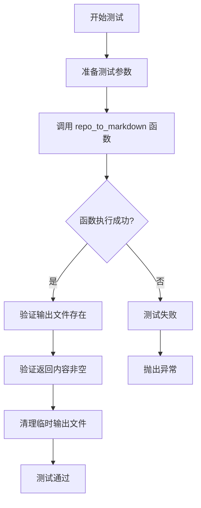
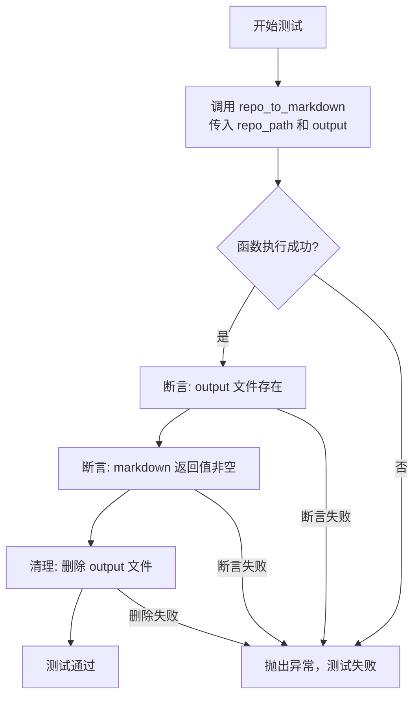

# `.\MetaGPT\tests\metagpt\utils\test_repo_to_markdown.py` 详细设计文档

该代码是一个使用 pytest 框架编写的异步单元测试，用于测试 `repo_to_markdown` 函数。该函数的核心功能是将指定代码仓库的目录结构及文件内容转换为 Markdown 格式的文档。测试用例会创建一个临时输出文件，验证函数执行后文件是否成功生成且内容非空，并在测试结束后清理该临时文件。

## 整体流程



## 类结构

```
该文件不包含自定义类，仅包含一个测试函数。
```

## 全局变量及字段


### `uuid`
    
用于生成唯一标识符（UUID）的Python标准库模块。

类型：`module`
    


### `Path`
    
来自pathlib模块的类，用于提供面向对象的文件系统路径操作。

类型：`class`
    


### `pytest`
    
用于编写和运行测试的Python测试框架。

类型：`module`
    


### `repo_to_markdown`
    
从metagpt.utils.repo_to_markdown模块导入的异步函数，用于将代码仓库转换为Markdown文档。

类型：`function`
    


    

## 全局函数及方法

### `test_repo_to_markdown`

这是一个使用 `pytest` 框架编写的异步单元测试函数，用于测试 `repo_to_markdown` 函数的功能。它验证该函数能否成功地将指定代码仓库的目录结构转换为 Markdown 文档，并生成对应的输出文件。

参数：
- `repo_path`：`pathlib.Path`，指向待转换的代码仓库根目录的路径。
- `output`：`pathlib.Path`，指定生成的 Markdown 文档的输出路径。

返回值：`None`，这是一个测试函数，不返回业务值，其成功与否由 `assert` 断言决定。

#### 流程图



#### 带注释源码

```python
# 使用 pytest 的参数化装饰器，为测试函数提供多组输入数据。
# 这里定义了一组测试数据：repo_path 为项目根目录，output 为一个在 workspace/unittest 下的随机文件名。
@pytest.mark.parametrize(
    ["repo_path", "output"],
    [
        (
            Path(__file__).parent.parent.parent, # 参数1: 计算得到项目根目录的路径
            Path(__file__).parent / f"../../../workspace/unittest/{uuid.uuid4().hex}.md", # 参数2: 构造一个唯一的输出文件路径
        ),
    ],
)
# 标记此测试函数为异步函数，以便测试异步的 repo_to_markdown 函数。
@pytest.mark.asyncio
# 定义异步测试函数，接收参数化传入的 repo_path 和 output。
async def test_repo_to_markdown(repo_path: Path, output: Path):
    # 调用被测试的异步函数 repo_to_markdown，传入路径参数，并等待其完成。
    markdown = await repo_to_markdown(repo_path=repo_path, output=output)
    
    # 断言1: 检查 output 参数指定的文件是否确实被创建。
    assert output.exists()
    # 断言2: 检查函数返回值 markdown 是否为真（非空、非None等），确保转换得到了内容。
    assert markdown

    # 测试完成后，清理生成的临时文件。missing_ok=True 确保如果文件不存在也不会报错。
    output.unlink(missing_ok=True)
```

## 关键组件


### pytest 参数化测试框架

用于定义和执行多组输入/输出组合的单元测试，通过 `@pytest.mark.parametrize` 装饰器实现，提高了测试用例的覆盖率和代码复用性。

### 异步测试支持

通过 `@pytest.mark.asyncio` 装饰器标记测试函数为异步函数，使其能够测试代码中的异步操作（如 `repo_to_markdown` 函数）。

### 文件路径处理 (pathlib.Path)

使用 `pathlib.Path` 对象进行跨平台的文件路径操作，包括构建测试输入目录路径和动态生成输出文件路径。

### 动态输出文件管理

在测试过程中动态生成唯一的输出文件路径（使用 `uuid.uuid4().hex`），并在测试结束后清理该文件（通过 `output.unlink`），确保测试的独立性和不会遗留垃圾文件。

### 核心功能测试断言

对 `repo_to_markdown` 函数的输出进行验证，包括检查生成的 Markdown 文件是否存在以及函数返回值是否非空。


## 问题及建议


### 已知问题

-   **测试数据清理不彻底**：测试用例中虽然调用了 `output.unlink(missing_ok=True)` 来删除生成的 Markdown 文件，但如果测试在断言 `assert output.exists()` 或 `assert markdown` 处失败，`unlink` 语句将不会被执行，导致临时文件残留。
-   **硬编码的测试路径**：测试用例的 `repo_path` 参数被硬编码为 `Path(__file__).parent.parent.parent`，这依赖于特定的项目目录结构。如果项目结构发生变化或测试文件被移动，测试可能会失败或扫描到错误的目录。
-   **异步测试的潜在风险**：测试函数被标记为 `@pytest.mark.asyncio`，但 `repo_to_markdown` 函数本身可能不是真正的异步 I/O 密集型操作。如果该函数主要是同步的 CPU 计算或文件操作，使用异步测试可能带来不必要的复杂性和微小的性能开销，且可能掩盖了同步阻塞的问题。
-   **输出文件路径可能无效**：`output` 路径被构造为 `../../../workspace/unittest/{uuid.uuid4().hex}.md`。这个相对路径可能在某些工作目录下无法正确解析，导致文件被生成到非预期位置或 `FileNotFoundError`。`workspace/unittest` 目录也可能不存在。

### 优化建议

-   **使用 pytest 的临时文件夹具**：建议使用 `pytest` 提供的 `tmp_path` 夹具来管理临时输出文件。`tmp_path` 会自动为每个测试用例创建一个临时目录，并在测试结束后清理，无需手动 `unlink`，更安全可靠。
-   **解耦测试数据与项目结构**：为 `repo_path` 创建一个独立的、明确的测试数据目录（例如 `tests/data/sample_repo`），或将测试用例参数化，使用一个小的、可控的示例仓库路径。这可以提高测试的稳定性和可移植性。
-   **评估异步测试的必要性**：审查 `repo_to_markdown` 函数的实现。如果它内部没有使用 `async/await` 进行真正的异步操作（例如网络请求、特定异步文件I/O），应考虑将测试改为同步测试，或确保异步包装是合理且有收益的。
-   **确保输出目录存在**：在生成输出文件前，应确保其父目录存在。可以使用 `output.parent.mkdir(parents=True, exist_ok=True)` 来创建目录。更好的做法是直接使用 `tmp_path` 夹具，它会自动处理目录创建。
-   **增强测试断言**：当前的断言仅检查文件存在和 `markdown` 变量非空。可以增加更具体的断言，例如检查生成的文件内容是否包含预期的关键信息（如特定文件名、代码片段），或者文件大小是否大于0，以提供更强的质量保证。
-   **考虑使用更稳定的唯一标识**：虽然 `uuid.uuid4().hex` 可以生成唯一文件名，但在调试时难以关联。可以考虑使用 `pytest` 的 `request.node.name` 或时间戳来生成更具可读性的文件名，或者直接使用 `tmp_path` 提供的唯一路径。


## 其它


### 设计目标与约束

本代码是一个单元测试文件，其核心设计目标是验证 `repo_to_markdown` 函数的功能正确性。具体目标包括：1) 验证函数能够成功执行，不抛出异常；2) 验证函数能够生成预期的输出文件；3) 验证函数返回有效的 Markdown 内容。主要约束包括：1) 必须使用 `pytest` 框架进行异步测试；2) 测试应具备独立性，测试结束后需清理生成的临时文件，避免污染环境；3) 测试路径应动态生成，以避免硬编码和潜在的路径冲突。

### 错误处理与异常设计

测试用例本身不包含复杂的业务逻辑错误处理，其错误处理主要依赖于 `pytest` 框架。当被测试函数 `repo_to_markdown` 抛出任何未捕获的异常时，测试将失败。测试用例通过 `assert` 语句进行断言检查：1) 检查输出文件是否存在 (`output.exists()`)；2) 检查返回的 Markdown 内容是否为真值 (`assert markdown`)。如果任一断言失败，测试将终止并报告错误。测试执行后，无论成功与否，都会尝试通过 `output.unlink(missing_ok=True)` 删除生成的临时文件，确保测试的清洁性。`missing_ok=True` 参数确保了即使文件不存在（例如在断言失败的情况下），删除操作也不会引发异常。

### 数据流与状态机

本测试用例的数据流相对简单直接：
1.  **输入**：测试通过 `@pytest.mark.parametrize` 装饰器提供输入参数。`repo_path` 被设置为项目根目录 (`Path(__file__).parent.parent.parent`)，`output` 被动态生成为一个位于 `workspace/unittest/` 目录下的唯一 Markdown 文件路径。
2.  **处理**：测试函数 `test_repo_to_markdown` 被调用，它异步执行 `repo_to_markdown(repo_path=repo_path, output=output)`。此函数是测试的核心，它读取 `repo_path` 指定的代码仓库，并将其转换为 Markdown 格式，结果保存到 `output` 文件并作为字符串返回。
3.  **输出与验证**：函数返回的 `markdown` 字符串和磁盘上的 `output` 文件是主要输出。测试通过断言验证这两个输出：文件必须存在，且返回的字符串内容不能为空。
4.  **清理**：验证完成后，无论结果如何，都会删除 `output` 文件，使系统状态恢复到测试前（不留下临时文件）。

不涉及复杂的状态机，整个流程是线性的：准备输入 -> 执行函数 -> 验证输出 -> 清理。

### 外部依赖与接口契约

1.  **外部依赖**：
    *   `pytest`: 测试运行框架，提供测试装饰器（如 `@pytest.mark.parametrize`, `@pytest.mark.asyncio`）、断言机制和测试运行入口 (`pytest.main`)。
    *   `metagpt.utils.repo_to_markdown.repo_to_markdown`: 这是被测试的核心函数，是本文件的主要外部依赖。测试的成功完全依赖于该函数的正确实现和稳定接口。
    *   `pathlib.Path`: 用于处理文件系统路径。
    *   `uuid`: 用于生成唯一的文件名，确保测试隔离性。

2.  **接口契约**：
    *   与被测函数 `repo_to_markdown` 的契约：测试假设该函数接受两个参数：`repo_path` (Path类型) 和 `output` (Path类型)，并返回一个字符串（Markdown内容）。函数应具有异步执行能力（`async`）。测试的成功执行即验证了该契约在当前上下文下的满足情况。
    *   与 `pytest` 框架的契约：测试函数必须遵循 `pytest` 的命名规范（以 `test_` 开头），并使用其提供的装饰器来定义参数化和标记异步测试。文件末尾的 `pytest.main` 调用是标准执行入口。

### 测试策略与覆盖范围

本测试采用**集成测试**策略，直接调用目标函数并验证其端到端的行为。它覆盖了函数的主要功能路径：给定一个有效的代码仓库路径，函数应能成功生成 Markdown 文件并返回内容。测试通过动态生成输出路径确保了测试的隔离性和可重复性。然而，当前测试用例仅包含一组参数（项目根目录），**覆盖范围有限**。未覆盖的场景包括：1) 对空仓库的测试；2) 对包含特殊字符或复杂结构仓库的测试；3) 传入无效 `repo_path`（如不存在路径）时的错误处理；4) 传入无效 `output` 路径（如无写权限目录）时的行为。这些需要通过更多的 `@pytest.mark.parametrize` 参数组合或单独的测试用例来完善。

### 环境与配置

测试执行依赖于特定的环境配置：
1.  **工作空间目录**：测试预期在项目结构中存在 `workspace/unittest/` 目录，用于存放临时生成的 Markdown 文件。如果该目录不存在，测试在尝试创建文件时可能会失败（具体行为取决于 `output` 路径的父目录是否存在以及操作系统的权限设置）。
2.  **被测代码库**：`repo_path` 被硬编码指向当前项目的根目录 (`Path(__file__).parent.parent.parent`)。这意味着测试的有效性依赖于在该目录下存在一个有效的、可读的代码仓库。如果在该路径下运行测试（例如在一个裸仓库或非预期目录中），测试可能失败或行为不可预测。
3.  **异步运行时**：由于使用了 `@pytest.mark.asyncio`，需要确保测试环境支持异步 IO，并且 `pytest-asyncio` 插件已正确安装。

    