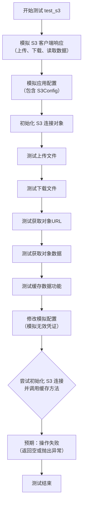
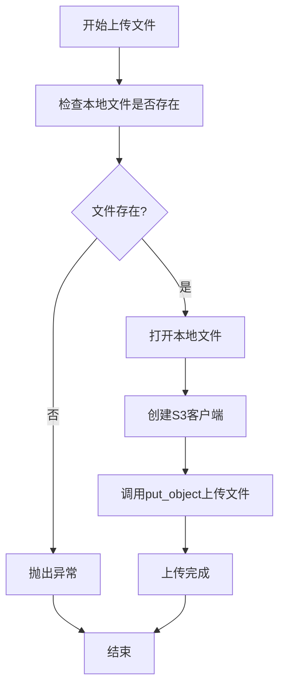
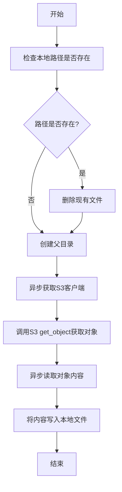
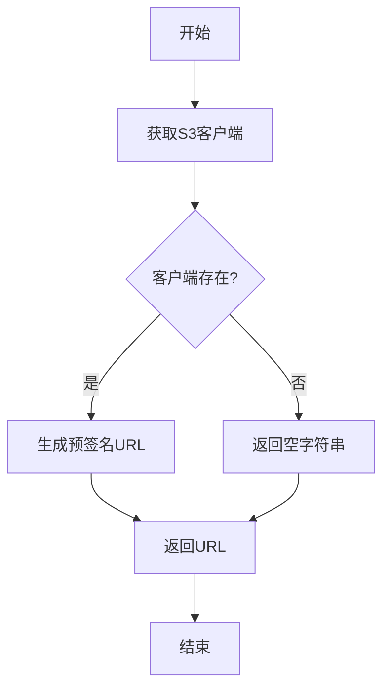
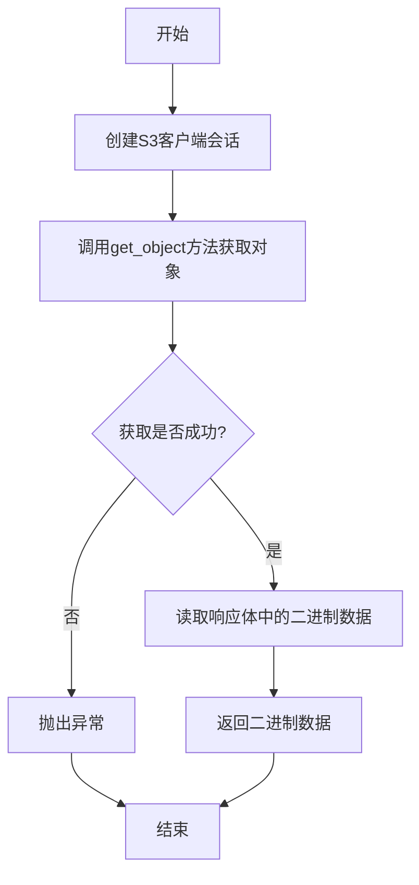
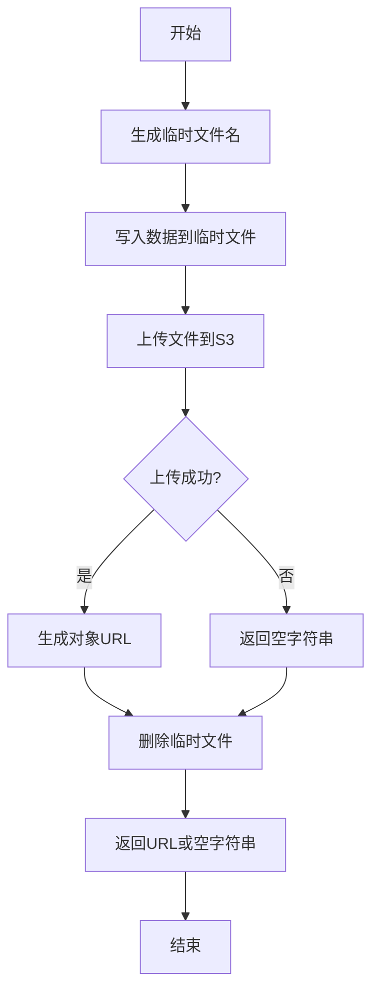
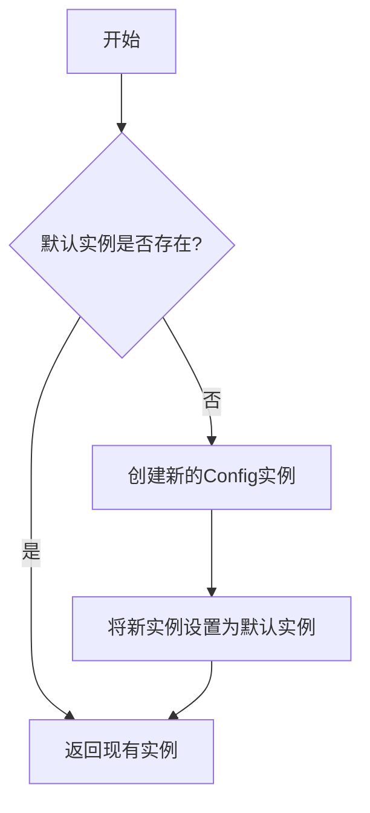

# `.\MetaGPT\tests\metagpt\utils\test_s3.py` 详细设计文档

这是一个使用 pytest 和 mocker 编写的异步单元测试文件，用于测试 S3 类（一个基于 aioboto3 的 Amazon S3 客户端包装器）的核心功能，包括文件上传、下载、获取对象URL、获取对象数据以及缓存数据到S3。测试通过模拟（mock）aioboto3 的客户端和响应来验证 S3 类在各种场景下的行为，而无需连接真实的 S3 服务。

## 整体流程

```mermaid
graph TD
    A[开始测试] --> B[模拟(mock) aioboto3.Session.client]
    B --> C[模拟(mock) Config.default 返回带S3Config的配置]
    C --> D[创建S3连接对象]
    D --> E[测试上传文件到S3]
    E --> F[测试从S3下载文件]
    F --> G[验证下载文件存在]
    G --> H[测试获取S3对象URL]
    H --> I[测试获取S3对象数据]
    I --> J[测试缓存数据到S3]
    J --> K[修改模拟配置，测试异常或空URL场景]
    K --> L[结束测试]
```

## 类结构

```
test_s3.py (测试模块)
├── 全局函数: test_s3 (异步测试函数)
├── 被测试/依赖的类:
│   ├── Config (来自 metagpt.config2)
│   ├── S3Config (来自 metagpt.configs.s3_config)
│   └── S3 (来自 metagpt.utils.s3)
└── 被测试/依赖的函数:
    └── aread (来自 metagpt.utils.common)
```

## 全局变量及字段


### `S3Config.access_key`
    
用于访问S3服务的身份验证密钥ID

类型：`str`
    


### `S3Config.secret_key`
    
用于访问S3服务的秘密访问密钥

类型：`str`
    


### `S3Config.endpoint`
    
S3服务的API端点URL地址

类型：`str`
    


### `S3Config.bucket`
    
S3存储桶的名称

类型：`str`
    


### `Config.s3`
    
系统配置中的S3服务配置对象

类型：`S3Config`
    
    

## 全局函数及方法


### `test_s3`

这是一个使用 `pytest` 框架编写的异步单元测试函数，用于测试 `S3` 类（一个封装了 Amazon S3 或兼容对象存储服务操作的类）的核心功能。该测试通过模拟（Mock）`aioboto3` 库的客户端行为，验证了 `S3` 类的文件上传、下载、获取对象URL、获取对象数据以及缓存数据等方法的正确性，同时测试了在特定配置下（如无效的访问密钥）的异常处理流程。

参数：

-  `mocker`：`pytest_mock.plugin.MockerFixture`，`pytest-mock` 插件提供的模拟对象，用于创建和管理测试中的模拟（Mock）和打补丁（Patch）。

返回值：`None`，测试函数通常不显式返回值，其成功与否由 `assert` 语句或是否抛出异常决定。

#### 流程图



#### 带注释源码

```python
@pytest.mark.asyncio  # 标记此测试函数为异步函数，以便 pytest-asyncio 插件处理
async def test_s3(mocker):  # 定义异步测试函数，接收 mocker 参数用于模拟
    # Set up the mock response
    # 读取当前文件内容作为模拟的 S3 对象数据
    data = await aread(__file__, "utf-8")
    # 创建一个异步模拟对象，模拟 S3 响应体（Body）
    reader_mock = mocker.AsyncMock()
    # 设置模拟对象的 read 方法在被调用时的返回值序列
    reader_mock.read.side_effect = [data.encode("utf-8"), b"", data.encode("utf-8")]
    # 为模拟对象设置一个 url 属性，并指定其返回值
    type(reader_mock).url = mocker.PropertyMock(return_value="https://mock")
    # 创建一个异步模拟对象，模拟 S3 客户端
    mock_client = mocker.AsyncMock()
    # 设置模拟客户端 put_object 方法（上传）返回 None
    mock_client.put_object.return_value = None
    # 设置模拟客户端 get_object 方法（下载/获取）返回一个包含模拟响应体的字典
    mock_client.get_object.return_value = {"Body": reader_mock}
    # 设置模拟客户端作为异步上下文管理器时的行为
    mock_client.__aenter__.return_value = mock_client
    mock_client.__aexit__.return_value = None
    # 对 aioboto3.Session.client 方法打补丁，使其返回我们创建的模拟客户端
    mocker.patch.object(aioboto3.Session, "client", return_value=mock_client)
    # 创建一个模拟的全局配置对象
    mock_config = mocker.Mock()
    # 为模拟配置对象设置 s3 属性，其值为一个 S3Config 实例（包含模拟的认证信息）
    mock_config.s3 = S3Config(
        access_key="mock_access_key",
        secret_key="mock_secret_key",
        endpoint="http://mock.endpoint",
        bucket="mock_bucket",
    )
    # 对 Config.default 方法打补丁，使其返回我们的模拟配置
    mocker.patch.object(Config, "default", return_value=mock_config)

    # Prerequisites
    # 从（模拟的）默认配置中获取 S3 配置
    s3 = Config.default().s3
    assert s3  # 断言配置存在
    # 使用配置初始化 S3 连接对象
    conn = S3(s3)
    object_name = "unittest.bak"
    # 测试上传文件功能：将当前文件上传到模拟的 S3 存储桶
    await conn.upload_file(bucket=s3.bucket, local_path=__file__, object_name=object_name)
    # 构造一个本地文件路径用于下载测试
    pathname = (Path(__file__).parent / "../../../workspace/unittest" / uuid.uuid4().hex).with_suffix(".bak")
    pathname.unlink(missing_ok=True)  # 如果文件已存在则删除
    # 测试下载文件功能：从模拟的 S3 存储桶下载文件到本地路径
    await conn.download_file(bucket=s3.bucket, object_name=object_name, local_path=str(pathname))
    assert pathname.exists()  # 断言下载的文件已存在
    # 测试获取对象URL功能
    url = await conn.get_object_url(bucket=s3.bucket, object_name=object_name)
    assert url  # 断言 URL 非空
    # 测试获取对象数据功能
    bin_data = await conn.get_object(bucket=s3.bucket, object_name=object_name)
    assert bin_data  # 断言获取到的二进制数据非空
    # 再次读取当前文件内容
    data = await aread(filename=__file__)
    # 测试缓存数据功能：将数据缓存到 S3 并返回其 URL
    res = await conn.cache(data, ".bak", "script")
    assert "http" in res  # 断言返回的 URL 包含 "http"

    # Mock session env
    # 修改模拟配置，模拟一个无效的访问密钥场景
    s3.access_key = "ABC"
    # 修改模拟响应体的 url 属性返回空字符串
    type(reader_mock).url = mocker.PropertyMock(return_value="")
    try:
        # 使用修改后的（无效）配置重新初始化 S3 连接对象
        conn = S3(s3)
        # 尝试调用缓存方法，预期会失败
        res = await conn.cache("ABC", ".bak", "script")
        assert not res  # 断言返回结果为空（表示失败）
    except Exception:
        # 如果抛出异常，也属于预期行为，捕获并忽略
        pass


if __name__ == "__main__":
    # 允许直接运行此脚本执行测试
    pytest.main([__file__, "-s"])
```


### `S3.upload_file`

该方法用于将本地文件上传到指定的S3存储桶中。

参数：

- `bucket`：`str`，目标S3存储桶的名称
- `local_path`：`str`，要上传的本地文件路径
- `object_name`：`str`，上传后在S3中存储的对象名称

返回值：`None`，无返回值

#### 流程图



#### 带注释源码

```python
async def upload_file(self, bucket: str, local_path: str, object_name: str) -> None:
    """
    上传本地文件到S3存储桶
    
    Args:
        bucket: 目标S3存储桶名称
        local_path: 本地文件路径
        object_name: S3对象名称
    
    Raises:
        FileNotFoundError: 当本地文件不存在时
        Exception: S3上传过程中的其他错误
    """
    # 检查本地文件是否存在
    if not os.path.exists(local_path):
        raise FileNotFoundError(f"Local file not found: {local_path}")
    
    # 异步上下文管理器创建S3客户端
    async with self._session.client(
        "s3",
        endpoint_url=self._endpoint,
        aws_access_key_id=self._access_key,
        aws_secret_access_key=self._secret_key,
    ) as client:
        # 打开本地文件并上传到S3
        with open(local_path, "rb") as file:
            await client.put_object(
                Bucket=bucket,
                Key=object_name,
                Body=file
            )
```

### `S3.download_file`

该方法用于从指定的S3存储桶中下载一个对象（文件）到本地路径。

参数：

- `bucket`：`str`，S3存储桶的名称。
- `object_name`：`str`，要下载的S3对象的名称（键）。
- `local_path`：`str`，下载后文件保存的本地路径。

返回值：`None`，该方法不返回任何值，但会将文件下载到指定的本地路径。

#### 流程图



#### 带注释源码

```python
async def download_file(self, bucket: str, object_name: str, local_path: str):
    """
    从指定的S3存储桶下载对象到本地路径。

    Args:
        bucket (str): S3存储桶的名称。
        object_name (str): 要下载的S3对象的名称（键）。
        local_path (str): 下载后文件保存的本地路径。
    """
    # 创建Path对象以便进行路径操作
    path = Path(local_path)
    # 如果目标文件已存在，则删除它
    path.unlink(missing_ok=True)
    # 确保目标文件的父目录存在，如果不存在则创建
    path.parent.mkdir(parents=True, exist_ok=True)

    # 异步获取S3客户端
    async with self._get_client() as client:
        # 从S3获取指定对象
        response = await client.get_object(Bucket=bucket, Key=object_name)
        # 异步读取对象的内容
        data = await response["Body"].read()
        # 将读取的内容写入本地文件
        path.write_bytes(data)
```


### `S3.get_object_url`

该方法用于生成指定S3存储桶中对象的预签名URL，该URL允许在有限时间内无需身份验证即可访问该对象。

参数：

- `bucket`：`str`，S3存储桶的名称。
- `object_name`：`str`，存储桶中对象的名称（键）。

返回值：`str`，生成的预签名URL字符串。

#### 流程图



#### 带注释源码

```python
async def get_object_url(self, bucket: str, object_name: str) -> str:
    """
    生成一个预签名URL，用于访问S3存储桶中的指定对象。
    
    参数:
        bucket (str): S3存储桶的名称。
        object_name (str): 存储桶中对象的名称（键）。
    
    返回:
        str: 生成的预签名URL。如果无法生成（例如客户端不存在），则返回空字符串。
    """
    # 检查S3客户端是否已初始化
    if not self._client:
        return ""
    
    # 使用S3客户端生成预签名URL
    # 参数说明:
    # - ClientMethod: 指定允许的HTTP方法，这里为'get_object'（获取对象）
    # - Params: 指定目标存储桶和对象键
    # - ExpiresIn: 设置URL的有效期（秒），这里为3600秒（1小时）
    url = await self._client.generate_presigned_url(
        ClientMethod="get_object",
        Params={"Bucket": bucket, "Key": object_name},
        ExpiresIn=3600,
    )
    return url
```


### `S3.get_object`

该方法用于从指定的S3存储桶中获取对象（文件）的二进制数据。

参数：

- `bucket`：`str`，S3存储桶的名称
- `object_name`：`str`，要获取的对象在存储桶中的名称（键）

返回值：`bytes`，返回从S3获取的对象的二进制数据

#### 流程图



#### 带注释源码

```python
async def get_object(self, bucket: str, object_name: str) -> bytes:
    """
    从指定的S3存储桶中获取对象（文件）的二进制数据。
    
    Args:
        bucket (str): S3存储桶的名称
        object_name (str): 要获取的对象在存储桶中的名称（键）
    
    Returns:
        bytes: 从S3获取的对象的二进制数据
    
    Raises:
        Exception: 如果获取对象失败，会抛出异常
    """
    # 创建异步S3客户端会话
    async with self.session.client(
        "s3",
        aws_access_key_id=self.config.access_key,
        aws_secret_access_key=self.config.secret_key,
        endpoint_url=self.config.endpoint,
    ) as client:
        # 调用S3的get_object方法获取对象
        response = await client.get_object(Bucket=bucket, Key=object_name)
        # 从响应体中读取二进制数据并返回
        return await response["Body"].read()
```

### `S3.cache`

该方法用于将数据缓存到S3存储桶中，并返回该对象的URL。它首先将数据写入本地临时文件，然后上传到指定的S3存储桶，最后生成并返回该对象的可访问URL。

参数：

- `data`：`str`，需要缓存的数据内容
- `ext`：`str`，文件扩展名，用于生成临时文件名
- `category`：`str`，文件分类，用于生成临时文件名

返回值：`str`，缓存对象的URL，如果上传失败则返回空字符串

#### 流程图



#### 带注释源码

```python
async def cache(self, data: str, ext: str, category: str) -> str:
    """
    将数据缓存到S3存储桶中，并返回该对象的URL。
    
    Args:
        data: 需要缓存的数据内容
        ext: 文件扩展名，用于生成临时文件名
        category: 文件分类，用于生成临时文件名
        
    Returns:
        缓存对象的URL，如果上传失败则返回空字符串
    """
    # 生成临时文件名，格式为：{uuid}_{category}{ext}
    filename = f"{uuid.uuid4().hex}_{category}{ext}"
    
    # 将数据写入临时文件
    with open(filename, "w", encoding="utf-8") as writer:
        writer.write(data)
    
    try:
        # 上传文件到S3存储桶
        await self.upload_file(
            bucket=self.config.bucket,
            local_path=filename,
            object_name=filename
        )
        
        # 生成并返回对象的URL
        return await self.get_object_url(
            bucket=self.config.bucket,
            object_name=filename
        )
    except Exception:
        # 如果上传失败，返回空字符串
        return ""
    finally:
        # 无论成功与否，都删除临时文件
        Path(filename).unlink(missing_ok=True)
```

### `Config.default`

`Config.default` 是一个类方法，用于获取或创建 `Config` 类的默认单例实例。它遵循单例模式，确保在整个应用程序中只有一个 `Config` 实例被使用。

参数：

-  `cls`：`type`，指向 `Config` 类本身的引用，由 Python 解释器自动传入。

返回值：`Config`，返回 `Config` 类的默认单例实例。

#### 流程图



#### 带注释源码

```python
    @classmethod
    def default(cls) -> "Config":
        """
        获取默认的 Config 单例实例。
        如果默认实例不存在，则创建一个新的实例并设置为默认实例。
        Returns:
            Config: 默认的 Config 实例。
        """
        if cls._instance is None:
            cls._instance = cls()
        return cls._instance
```

## 关键组件


### S3 客户端封装

封装了与 Amazon S3 或兼容 S3 协议的对象存储服务进行异步交互的核心功能，包括文件上传、下载、获取对象数据及预签名 URL 等操作。

### 配置管理 (S3Config)

定义了连接 S3 服务所需的配置参数，如访问密钥、终端节点和存储桶名称，用于集中管理 S3 客户端的初始化设置。

### 异步文件操作

提供了一组异步方法（如 `upload_file`, `download_file`, `get_object`），用于高效、非阻塞地执行 S3 对象的上传和下载等 I/O 密集型操作。

### 对象 URL 生成

包含生成对象预签名 URL 的功能（如 `get_object_url`），用于临时授权访问私有 S3 对象，支持安全地分享文件。

### 数据缓存与存储

实现了将数据缓存到 S3 并返回其访问 URL 的逻辑（如 `cache` 方法），为应用提供了一种将中间或结果数据持久化到对象存储的便捷方式。

### 模拟测试框架

在单元测试中使用了 `pytest` 和 `mocker` 来模拟 S3 客户端的行为，确保在不依赖真实外部服务的情况下验证 S3 封装组件的逻辑正确性。


## 问题及建议


### 已知问题

-   **测试用例过于复杂且职责不单一**：`test_s3` 函数试图在一个测试中验证 `S3` 类的多个方法（`upload_file`, `download_file`, `get_object_url`, `get_object`, `cache`），并包含了模拟配置、模拟客户端、文件操作、异常处理等多种逻辑。这违反了单元测试的“单一职责”原则，使得测试难以理解、维护和调试。当测试失败时，很难快速定位是哪个具体功能或条件出了问题。
-   **测试数据与断言耦合度低**：测试中上传和下载的文件内容是测试文件自身（`__file__`），但在下载后仅断言文件存在（`assert pathname.exists()`），并未验证下载文件的内容与原始文件内容是否一致。这可能导致即使下载功能出错（如下载了错误或空文件），测试仍然通过，降低了测试的有效性。
-   **异常测试用例设计模糊**：在模拟环境变更后（`s3.access_key = "ABC"`），测试尝试构造一个预期失败的场景，但使用了 `try...except` 块并 `assert not res`。这种模式意图是测试 `cache` 方法在异常情况下返回空字符串，但 `except` 块捕获了所有异常，使得即使 `cache` 方法抛出异常（而非返回空字符串），测试也会通过。这未能精确验证 `S3.cache` 方法在错误配置下的预期行为（是返回空值还是抛出异常）。
-   **存在未清理的测试资源**：测试中创建了一个临时文件 `pathname`，并在测试结束时断言其存在。测试没有在最后（或 `finally` 块中）删除此文件，可能导致测试运行后在 `workspace/unittest` 目录下残留文件。虽然使用了 `uuid` 降低了冲突概率，但仍属于资源泄露，长期运行可能积累大量垃圾文件。
-   **硬编码的路径和配置**：测试中硬编码了对象名（`"unittest.bak"`）、本地路径构造逻辑以及模拟的S3配置信息（如 `"mock_access_key"`）。这使得测试与特定的目录结构（`../../../workspace/unittest`）和模拟值绑定，降低了测试的可移植性和可读性。

### 优化建议

-   **拆分测试函数，遵循单一职责**：将 `test_s3` 函数拆分为多个独立的测试函数，例如 `test_upload_file`, `test_download_file`, `test_get_object`, `test_cache_success`, `test_cache_failure` 等。每个函数只测试一个方法或一个特定场景，并使用 `pytest` 的 `@pytest.fixture` 来共享通用的模拟设置（如 `mock_client`, `mock_config`）。这将使测试结构更清晰，更容易定位问题。
-   **增强断言，验证数据完整性**：在测试文件下载功能时，除了检查文件存在，还应读取下载文件的内容，并与原始数据（或预期数据）进行比对。例如：`assert pathname.read_bytes() == data.encode('utf-8')`。这能确保下载操作在功能上是正确的。
-   **明确异常测试的预期行为**：如果 `S3.cache` 方法在配置错误时应返回空字符串（如 `""`），则应使用 `pytest.raises` 上下文管理器来确保它**不**抛出异常，并直接断言返回值。如果预期是抛出特定异常，则应使用 `pytest.raises(ExpectedExceptionType)`。避免使用空的 `except` 块。例如：
    ```python
    # 假设预期返回空字符串
    res = await conn.cache("ABC", ".bak", "script")
    assert res == ""
    # 或者假设预期抛出 ConnectionError
    with pytest.raises(ConnectionError):
        await conn.cache("ABC", ".bak", "script")
    ```
-   **添加测试清理环节**：使用 `pytest` 的临时目录 fixture (`tmp_path`) 来管理测试中创建的文件，或者确保在测试函数末尾使用 `pathname.unlink(missing_ok=True)` 删除创建的临时文件。`tmp_path` 是更佳选择，因为它由 pytest 自动管理生命周期。
-   **使用 Fixture 和常量提升可维护性**：
    1.  将重复的模拟配置（如 `S3Config` 参数）定义为模块级常量或 fixture。
    2.  使用 `tmp_path` fixture 来替代硬编码的 `../../../workspace/unittest` 路径，使测试不依赖项目特定结构。
    3.  将测试数据（如 `data`）的获取也放入 fixture，确保各个测试用例使用一致的数据。
    例如：
    ```python
    @pytest.fixture
    def mock_s3_config():
        return S3Config(access_key="mock_key", secret_key="mock_secret", endpoint="http://mock.endpoint", bucket="mock_bucket")
    
    @pytest.fixture
    async def sample_data():
        return await aread(__file__, "utf-8")
    
    @pytest.mark.asyncio
    async def test_download_file(mock_s3_config, sample_data, tmp_path, mocker):
        # ... 设置 mock ...
        download_path = tmp_path / "downloaded.bak"
        await conn.download_file(..., local_path=str(download_path))
        assert download_path.exists()
        assert download_path.read_text() == sample_data
    ```
-   **考虑增加负面测试用例**：除了当前的成功流程和最后一个模糊的失败场景，可以增加更多边界和异常情况测试，例如：上传不存在的本地文件、下载不存在的对象、传入无效的 `bucket` 或 `object_name` 参数等，以更全面地覆盖 `S3` 类的鲁棒性。


## 其它


### 设计目标与约束

本测试代码的设计目标是验证S3类（封装了与Amazon S3兼容对象存储服务交互的功能）的核心功能，包括文件上传、下载、获取对象URL、获取对象数据以及缓存数据。测试代码通过模拟（mocking）外部依赖（如aioboto3库和S3服务端点）来确保测试的隔离性和可重复性，不依赖真实的网络连接或S3服务凭证。主要约束包括：1) 完全在内存中模拟S3客户端的行为；2) 测试异步方法；3) 验证错误处理路径（如模拟凭证无效时的情况）。

### 错误处理与异常设计

测试代码通过`try...except`块显式地测试了错误处理路径。它模拟了当S3配置的访问密钥被修改（`s3.access_key = "ABC"`）且模拟的响应体URL属性返回空字符串时，`S3.cache`方法的行为。测试期望在这种情况下，`cache`方法可能返回空结果（`assert not res`）或者抛出异常，而`try...except`块会捕获并忽略任何异常，这验证了代码在异常情况下的健壮性。测试本身没有断言特定的异常类型，而是关注于功能是否在错误条件下按预期失败或降级。

### 数据流与状态机

测试的数据流是线性的，遵循“准备-执行-验证”的模式。首先，测试准备阶段：1) 模拟读取本地文件数据；2) 创建模拟的S3客户端（`mock_client`），并为其`put_object`、`get_object`等方法设置返回值；3) 模拟配置对象（`mock_config`）及其中的S3配置。然后，执行阶段：依次调用`S3`实例的`upload_file`、`download_file`、`get_object_url`、`get_object`和`cache`方法，这些调用会作用于模拟的客户端。最后，验证阶段：使用`assert`语句验证每个操作的结果是否符合预期（如文件被创建、URL非空、数据正确等）。测试中不存在复杂的状态转换，主要状态是模拟客户端的响应内容。

### 外部依赖与接口契约

测试代码的外部依赖包括：
1.  **pytest & pytest-asyncio**: 测试框架，用于组织测试用例和运行异步测试。
2.  **aioboto3**: 被测试的`S3`类所依赖的用于异步访问AWS S3的库。在测试中，其`Session.client`方法被完全模拟，测试不与其真实实现交互。
3.  **metagpt.utils.s3.S3**: 这是被测试的主要对象。测试代码依赖于其公共接口（`upload_file`, `download_file`, `get_object_url`, `get_object`, `cache`）的签名和行为。
4.  **metagpt.config2.Config & metagpt.configs.s3_config.S3Config**: 用于提供配置。测试中创建了模拟的配置对象。
5.  **metagpt.utils.common.aread**: 一个工具函数，用于异步读取文件。在测试准备阶段被真实调用以获取测试文件内容。

接口契约主要体现在对模拟对象（`mock_client`, `reader_mock`）行为的设定上，例如：`mock_client.get_object.return_value`必须返回一个包含`"Body"`键的字典，其值是一个具有异步`read`方法和`url`属性的对象。这模拟了`aioboto3`库与S3服务交互的真实返回结构。

    