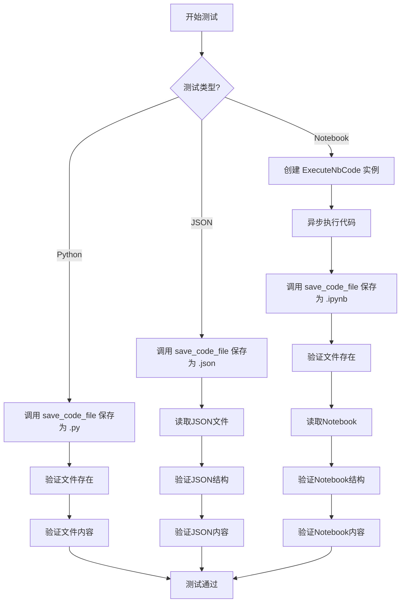
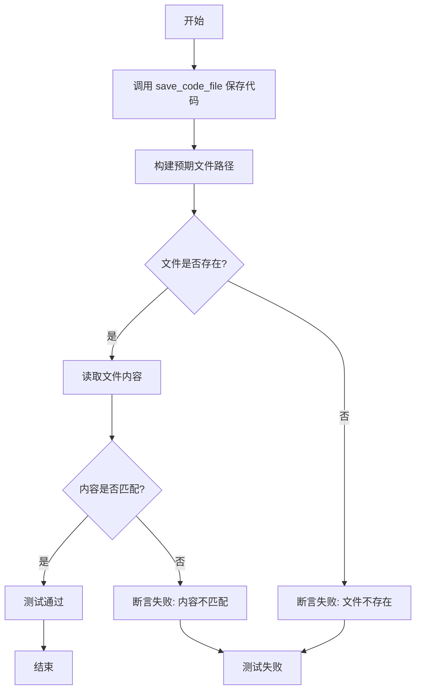
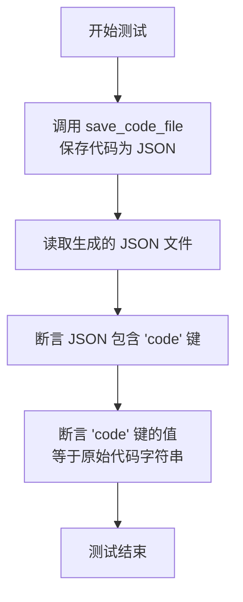
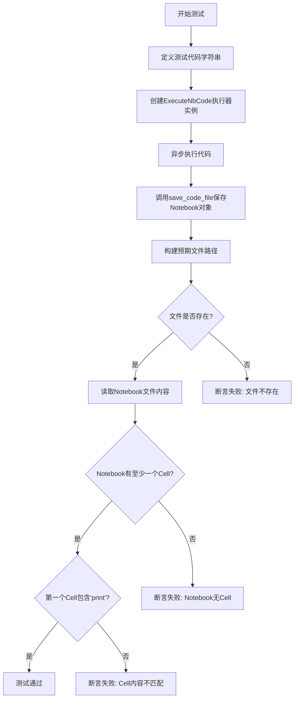
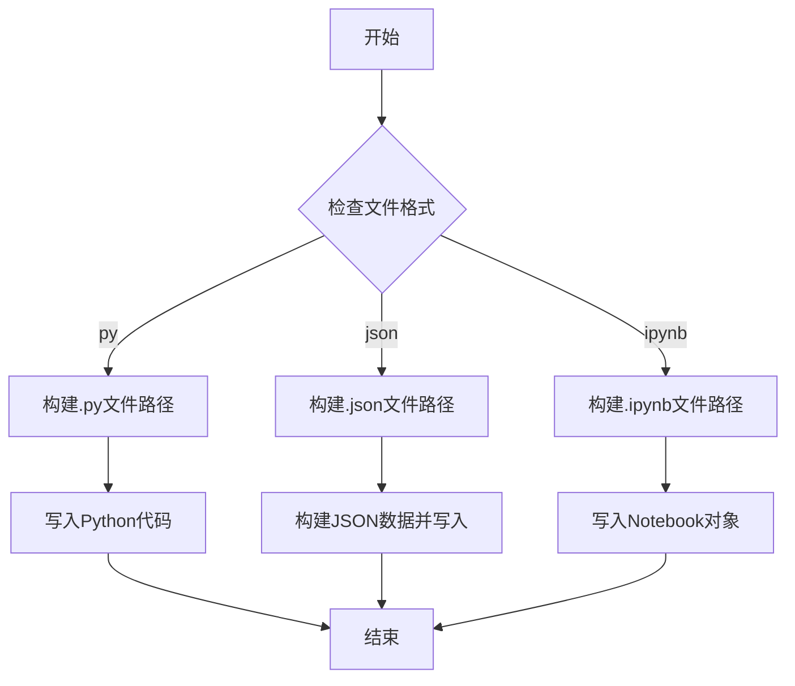
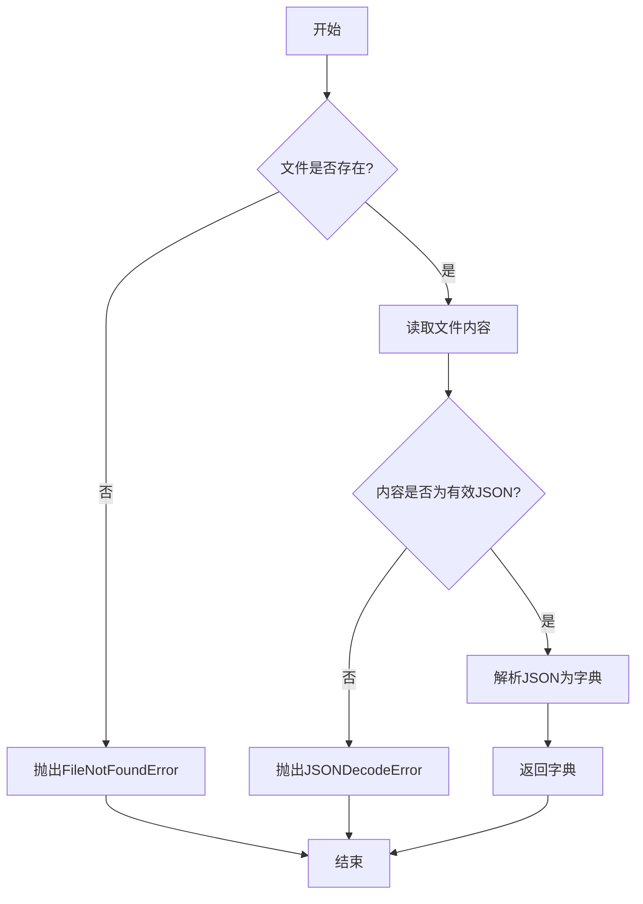
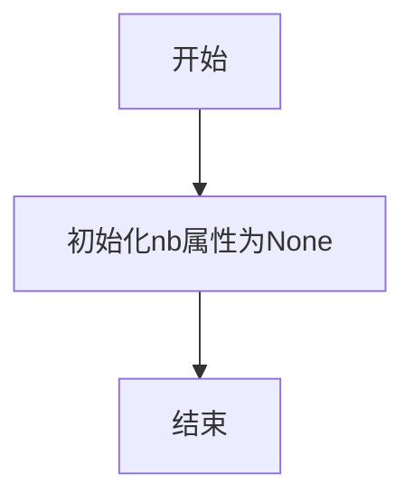
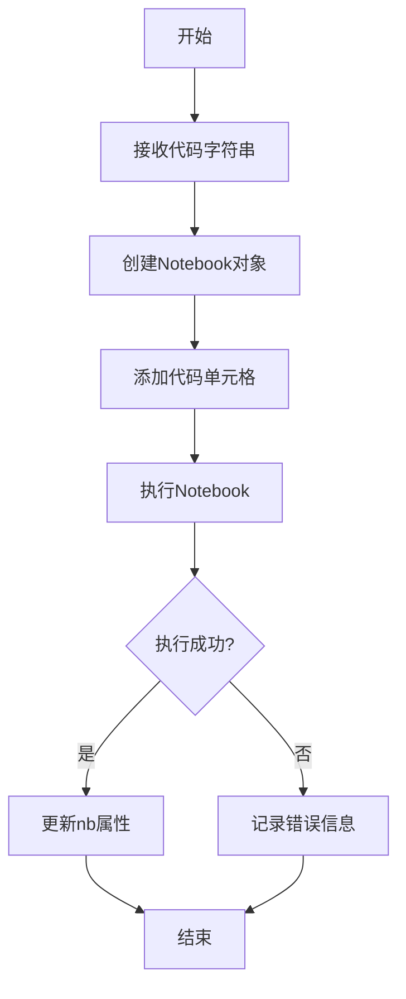

# `.\MetaGPT\tests\metagpt\utils\test_save_code.py` 详细设计文档

该代码文件是一个测试套件，用于验证 `save_code_file` 函数的功能。它包含三个测试用例，分别测试该函数将代码保存为Python文件、JSON文件和Jupyter Notebook（.ipynb）文件的能力。每个测试用例都会创建文件、验证文件存在性并检查其内容是否符合预期。

## 整体流程



## 类结构

```
ExecuteNbCode (外部类)
├── __init__
└── run (异步方法)
```

## 全局变量及字段


### `DATA_PATH`
    
一个全局路径对象，指向代码保存的默认数据目录。

类型：`pathlib.Path`
    


### `ExecuteNbCode.nb`
    
存储由ExecuteNbCode.run方法执行代码后生成的Jupyter Notebook对象。

类型：`nbformat.NotebookNode`
    
    

## 全局函数及方法

### `test_save_code_file_python`

该函数是一个单元测试，用于验证 `save_code_file` 函数在保存 Python 代码文件时的正确性。它创建一个包含指定代码的 Python 文件，然后检查文件是否存在以及文件内容是否与预期匹配。

参数：

- 无显式参数。该函数是一个测试函数，不接收外部参数。

返回值：`None`，该函数是一个测试函数，不返回任何值，但通过断言来验证测试结果。

#### 流程图



#### 带注释源码

```python
def test_save_code_file_python():
    # 调用 save_code_file 函数，将代码 "print('Hello, World!')" 保存到名为 "example" 的目录下的 code.py 文件中
    save_code_file("example", "print('Hello, World!')")
    
    # 构建预期的文件路径，DATA_PATH 是基础路径，output/example/code.py 是相对路径
    file_path = DATA_PATH / "output" / "example" / "code.py"
    
    # 断言：检查文件是否存在。如果文件不存在，测试失败并输出错误信息
    assert file_path.exists(), f"File does not exist: {file_path}"
    
    # 读取文件内容
    content = file_path.read_text()
    
    # 断言：检查文件内容是否包含预期的字符串 "print('Hello, World!')"。如果不包含，测试失败并输出错误信息
    assert "print('Hello, World!')" in content, "File content does not match"
```

### `test_save_code_file_json`

该函数是一个单元测试，用于验证 `save_code_file` 函数在指定 `file_format="json"` 时，能否正确地将代码字符串保存为 JSON 格式的文件，并确保文件内容符合预期。

参数：

-   `无显式参数`：`None`，这是一个单元测试函数，不接收外部参数。它通过调用 `save_code_file` 和 `read_json_file` 函数来执行测试逻辑。

返回值：`None`，单元测试函数通常不返回值，其成功与否通过断言（`assert`）语句来判断。

#### 流程图



#### 带注释源码

```python
def test_save_code_file_json():
    # 1. 调用 save_code_file 函数，将代码字符串 "print('Hello, JSON!')" 以 JSON 格式保存。
    #    文件将保存在 DATA_PATH / "output" / "example_json" / "code.json"
    save_code_file("example_json", "print('Hello, JSON!')", file_format="json")
    
    # 2. 构造预期生成的 JSON 文件路径
    file_path = DATA_PATH / "output" / "example_json" / "code.json"
    
    # 3. 使用 read_json_file 函数读取上一步生成的文件内容，解析为 Python 字典
    data = read_json_file(file_path)
    
    # 4. 断言：检查读取的数据（字典）中是否包含键名为 "code" 的项。
    #    如果不存在，测试失败并提示信息。
    assert "code" in data, "JSON key 'code' is missing"
    
    # 5. 断言：检查字典中 "code" 键对应的值是否等于原始的代码字符串。
    #    如果不相等，测试失败并提示信息。
    assert data["code"] == "print('Hello, JSON!')", "JSON content does not match"
```

### `test_save_code_file_notebook`

这是一个异步单元测试函数，用于测试 `save_code_file` 函数在保存 Jupyter Notebook 格式文件时的功能。它首先使用 `ExecuteNbCode` 执行器运行一段代码，然后将执行器生成的 Notebook 对象保存为 `.ipynb` 文件，最后验证文件是否存在以及其内容是否符合预期。

参数：

-  `无显式参数`：`无`，这是一个单元测试函数，不接收外部参数。

返回值：`None`，单元测试函数通常不返回值，而是通过断言（assert）来验证测试结果。

#### 流程图



#### 带注释源码

```python
@pytest.mark.asyncio  # 使用pytest的装饰器标记此函数为异步测试
async def test_save_code_file_notebook():
    # 定义一段用于测试的Python代码字符串
    code = "print('Hello, World!')"
    
    # 创建一个ExecuteNbCode类的实例，用于执行Notebook代码
    executor = ExecuteNbCode()
    
    # 异步调用执行器的run方法，执行上面定义的代码
    await executor.run(code)
    
    # 调用save_code_file函数，将执行器生成的Notebook对象（executor.nb）
    # 以'ipynb'格式保存到指定目录（"example_nb"）
    save_code_file("example_nb", executor.nb, file_format="ipynb")
    
    # 构建预期保存的文件路径
    file_path = DATA_PATH / "output" / "example_nb" / "code.ipynb"
    
    # 断言1：检查文件是否在指定路径成功创建
    assert file_path.exists(), f"Notebook file does not exist: {file_path}"

    # 以下是针对Notebook文件格式的额外检查
    # 使用nbformat库读取刚刚保存的Notebook文件
    notebook = nbformat.read(file_path, as_version=4)
    
    # 断言2：检查读取的Notebook对象是否包含至少一个Cell（代码单元）
    assert len(notebook.cells) > 0, "Notebook should have at least one cell"
    
    # 获取第一个Cell的源代码内容
    first_cell_source = notebook.cells[0].source
    
    # 断言3：检查第一个Cell的源代码中是否包含'print'关键字，
    # 以验证保存的内容与最初执行的代码相符
    assert "print" in first_cell_source, "Notebook cell content does not match"
```

### `save_code_file`

该函数用于将代码内容保存到指定格式的文件中，支持Python脚本、JSON和Jupyter Notebook格式。

参数：

- `filename`：`str`，要保存的文件名（不含扩展名）
- `code`：`Union[str, nbformat.NotebookNode]`，要保存的代码内容，可以是字符串或Jupyter Notebook对象
- `file_format`：`str`，可选参数，文件格式，默认为"py"，支持"py"、"json"、"ipynb"
- `path`：`Union[str, Path]`，可选参数，保存路径，默认为DATA_PATH / "output"

返回值：`None`，无返回值

#### 流程图



#### 带注释源码

```python
def save_code_file(
    filename: str,
    code: Union[str, nbformat.NotebookNode],
    file_format: str = "py",
    path: Union[str, Path] = DATA_PATH / "output",
):
    """
    保存代码文件到指定路径
    
    Args:
        filename: 文件名（不含扩展名）
        code: 代码内容，可以是字符串或Notebook对象
        file_format: 文件格式，支持'py'、'json'、'ipynb'
        path: 保存路径，默认为DATA_PATH/output
    """
    # 确保路径为Path对象
    path = Path(path)
    
    # 根据文件格式确定扩展名
    if file_format == "py":
        suffix = ".py"
    elif file_format == "json":
        suffix = ".json"
    elif file_format == "ipynb":
        suffix = ".ipynb"
    else:
        raise ValueError(f"Unsupported file format: {file_format}")
    
    # 创建目录（如果不存在）
    file_path = path / filename / f"code{suffix}"
    file_path.parent.mkdir(parents=True, exist_ok=True)
    
    # 根据格式保存文件
    if file_format == "py":
        # 保存Python代码文件
        file_path.write_text(code, encoding="utf-8")
    elif file_format == "json":
        # 保存为JSON格式
        data = {"code": code}
        with open(file_path, "w", encoding="utf-8") as f:
            json.dump(data, f, indent=4, ensure_ascii=False)
    elif file_format == "ipynb":
        # 保存为Jupyter Notebook格式
        nbformat.write(code, file_path)
```

### `read_json_file`

从指定路径读取JSON文件并解析为Python字典。

参数：
-  `file_path`：`Path`，JSON文件的路径对象

返回值：`dict`，解析后的JSON数据字典

#### 流程图



#### 带注释源码

```python
def read_json_file(file_path: Path) -> dict:
    """
    读取JSON文件并返回解析后的字典
    
    Args:
        file_path (Path): JSON文件的路径
        
    Returns:
        dict: 解析后的JSON数据
        
    Raises:
        FileNotFoundError: 当文件不存在时
        json.JSONDecodeError: 当JSON格式无效时
    """
    # 检查文件是否存在
    if not file_path.exists():
        raise FileNotFoundError(f"JSON file not found: {file_path}")
    
    # 读取文件内容
    content = file_path.read_text(encoding="utf-8")
    
    # 解析JSON内容
    try:
        data = json.loads(content)
    except json.JSONDecodeError as e:
        raise json.JSONDecodeError(
            f"Invalid JSON format in file: {file_path}", 
            e.doc, 
            e.pos
        )
    
    return data
```

### `ExecuteNbCode.__init__`

该方法用于初始化`ExecuteNbCode`类的实例，设置执行Jupyter Notebook代码所需的基本属性。

参数：
-  `self`：`ExecuteNbCode`，当前类的实例

返回值：`None`，无返回值

#### 流程图



#### 带注释源码

```python
def __init__(self):
    # 初始化nb属性，用于存储Jupyter Notebook对象，初始值为None
    self.nb = None
```

### `ExecuteNbCode.run`

该方法用于执行给定的Jupyter Notebook代码，并将执行结果存储在实例的`nb`属性中。它通过异步方式运行代码，并处理可能的执行错误。

参数：

- `code`：`str`，要执行的Jupyter Notebook代码字符串。

返回值：`None`，无返回值。

#### 流程图



#### 带注释源码

```python
async def run(self, code: str) -> None:
    """
    执行给定的Jupyter Notebook代码。

    该方法创建一个Notebook对象，将代码添加到单元格中，然后执行该Notebook。
    执行结果（包括任何错误）将存储在实例的`nb`属性中。

    Args:
        code (str): 要执行的Jupyter Notebook代码字符串。

    Returns:
        None: 无返回值。
    """
    # 创建一个新的Notebook对象
    self.nb = nbformat.v4.new_notebook()
    
    # 将代码字符串添加到Notebook的单元格中
    self.nb.cells.append(nbformat.v4.new_code_cell(code))
    
    try:
        # 执行Notebook代码
        await execute_notebook(self.nb, timeout=60)
    except Exception as e:
        # 如果执行过程中出现错误，记录错误信息
        self.nb.cells.append(nbformat.v4.new_code_cell(f"# Error: {e}"))
```

## 关键组件


### 代码文件保存功能

提供将代码内容保存为不同格式文件（Python、JSON、Jupyter Notebook）的核心功能，并支持指定输出目录和文件名。

### 单元测试框架

使用pytest框架对代码保存功能进行单元测试，验证不同文件格式的保存操作是否成功以及内容是否正确。

### 异步测试支持

通过`@pytest.mark.asyncio`装饰器支持对异步代码（如`ExecuteNbCode`动作）的测试。

### 文件格式验证

在测试中验证生成的文件内容是否符合预期，包括检查文件是否存在、内容匹配以及特定格式（如JSON键值、Notebook单元格）的结构正确性。

### 外部依赖管理

代码依赖于外部库如`nbformat`（用于处理Jupyter Notebook文件）和项目内部模块（如`metagpt.actions.di.execute_nb_code`、`metagpt.utils.common`），体现了模块化设计和对第三方功能的集成。


## 问题及建议


### 已知问题

-   **测试数据残留风险**：测试函数 `test_save_code_file_python`、`test_save_code_file_json` 和 `test_save_code_file_notebook` 在执行后会在 `DATA_PATH / "output"` 目录下创建文件或目录（如 `example`、`example_json`、`example_nb`）。如果测试失败或被中断，这些残留文件可能不会被自动清理，导致后续测试运行环境不干净或产生干扰。
-   **硬编码的测试路径**：测试中直接使用了 `DATA_PATH / "output" / "example" / "code.py"` 等硬编码路径。如果 `save_code_file` 函数的内部实现（如输出目录结构）发生变化，这些测试将立即失败，降低了测试的健壮性和可维护性。
-   **异步测试的潜在执行问题**：`test_save_code_file_notebook` 使用了 `@pytest.mark.asyncio` 装饰器进行异步测试。虽然当前代码看起来正确，但在更复杂的异步交互或特定测试运行环境下，可能存在事件循环管理、异步任务未正确等待等问题，导致测试结果不稳定。
-   **对 `ExecuteNbCode` 的强依赖**：`test_save_code_file_notebook` 测试不仅测试 `save_code_file` 函数，还依赖于 `ExecuteNbCode().run(code)` 的执行成功来获取 `executor.nb` 对象。这增加了测试的耦合度，使得该测试实际上成为了一个集成测试。如果 `ExecuteNbCode` 动作本身有缺陷或环境依赖不满足，会连带导致本应独立的文件保存功能测试失败。

### 优化建议

-   **引入测试固件进行清理**：使用 `pytest` 的固件（如 `setup_method`/`teardown_method` 或 `@pytest.fixture`）在测试开始前确保输出目录状态，并在测试结束后（无论成功与否）自动清理测试生成的文件和目录。例如，可以使用 `tmp_path` 固件作为临时目录，或者手动在 `teardown` 阶段删除 `DATA_PATH / "output" / “example*”`。
-   **解耦路径构造逻辑**：避免在测试中硬编码内部路径。可以改为调用 `save_code_file` 函数后，使用该函数返回的保存路径（如果当前函数没有返回，可以考虑修改其设计），或者通过更通用的方式（如列出目标目录下的文件）来定位和验证生成的文件。这使测试更关注行为而非实现细节。
-   **确保异步测试的健壮性**：对于异步测试，确保所有异步操作都被正确 `await`。考虑使用 `pytest-asyncio` 的最新实践，并检查测试运行配置。对于涉及多个异步任务的场景，要妥善处理任务创建和等待。
-   **隔离测试关注点**：将 `test_save_code_file_notebook` 测试拆分为两个更专注的测试：1) 一个单元测试，使用一个模拟的或简单的 `nbformat` notebook 对象直接测试 `save_code_file` 保存 notebook 格式的功能。2) 另一个集成或单元测试专门测试 `ExecuteNbCode` 动作生成 notebook 的逻辑。这符合单一职责原则，使测试更清晰、更容易维护和定位问题。
-   **增加异常和边界测试**：当前测试均为“快乐路径”测试。建议补充测试用例，例如：测试保存空字符串代码、包含特殊字符的代码、超长代码；测试传入无效的 `file_format` 参数时函数的行为（是否抛出预期异常）；测试当目标目录无写权限时的错误处理等。
-   **考虑使用参数化测试**：`test_save_code_file_python` 和 `test_save_code_file_json` 的核心逻辑非常相似（保存、验证路径存在、验证内容）。可以使用 `@pytest.mark.parametrize` 将它们合并为一个参数化测试，减少代码重复，并使添加新的文件格式测试更容易。


## 其它


### 设计目标与约束

本代码模块的核心设计目标是提供一个可靠且灵活的代码文件保存功能，支持多种文件格式（如 `.py`、`.json`、`.ipynb`），并确保生成的代码文件内容正确、格式规范。约束条件包括：必须与 `metagpt.utils.save_code` 模块定义的 `DATA_PATH` 和 `save_code_file` 函数接口兼容；对于 Jupyter Notebook 格式，需要依赖 `nbformat` 库进行读写操作，并确保生成的 `.ipynb` 文件符合 nbformat 版本 4 的规范；所有操作应保持幂等性，即重复调用 `save_code_file` 函数保存同名文件时应能正常覆盖或处理。

### 错误处理与异常设计

当前代码主要通过 `assert` 语句在测试函数中进行结果验证，这属于测试逻辑的一部分，而非生产环境的错误处理。在生产环境中，`save_code_file` 函数内部应包含更健壮的错误处理机制，例如：检查目标目录是否存在并具备写入权限；处理文件写入过程中可能发生的 `IOError` 或 `PermissionError`；验证传入的 `file_format` 参数是否为支持的类型；对于 JSON 格式，确保传入的代码字符串能被正确序列化；对于 Notebook 格式，确保 `nbformat` 能够成功写入文件。测试代码本身应捕获并断言可能抛出的异常，以验证错误处理逻辑。

### 数据流与状态机

数据流起始于测试函数中定义的代码字符串（如 `"print('Hello, World!')"`）或 `ExecuteNbCode` 执行后生成的 Notebook 对象 (`executor.nb`)。这些数据作为 `code` 参数传递给 `save_code_file` 函数。`save_code_file` 函数根据 `file_format` 参数决定数据处理路径：对于 Python 和 JSON 格式，直接将字符串写入文件（JSON 格式会先包装成字典）；对于 Notebook 格式，则假设传入的 `code` 参数已经是一个 `nbformat` 的 Notebook 对象，并直接写入。整个流程是线性的，无复杂的状态转换。测试函数的数据流终点是文件系统上的特定路径 (`DATA_PATH / "output" / {example_name} / code.{ext}`)，并通过读取文件内容来验证数据流的正确性。

### 外部依赖与接口契约

1.  **内部依赖**:
    *   `metagpt.utils.save_code.save_code_file`: 核心功能函数，本测试模块的主要测试对象。
    *   `metagpt.utils.save_code.DATA_PATH`: 定义基础输出路径的全局变量。
    *   `metagpt.utils.common.read_json_file`: 用于读取和验证 JSON 文件内容的工具函数。
    *   `metagpt.actions.di.execute_nb_code.ExecuteNbCode`: 用于生成 Notebook 对象的类，在测试 Notebook 保存功能时被使用。

2.  **外部依赖**:
    *   `nbformat`: 第三方库，用于读写 Jupyter Notebook (`.ipynb`) 文件。测试中用于验证生成的 Notebook 文件结构。
    *   `pytest`: 测试框架，用于定义和运行测试用例，特别是支持异步测试 (`@pytest.mark.asyncio`)。

3.  **接口契约**:
    *   `save_code_file(name: str, code: Union[str, dict], file_format: str = "py") -> None`: 本测试模块围绕此函数接口编写测试用例。测试验证了该函数对于 `name`（目录/文件名）、`code`（字符串或 Notebook 对象）、`file_format` (`"py"`, `"json"`, `"ipynb"`) 参数的处理是否符合预期行为，即正确生成对应格式和内容的文件。

    