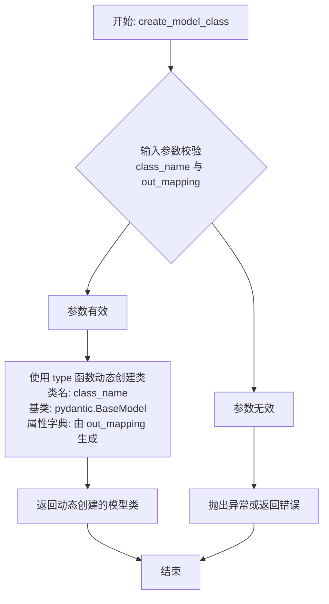

# `.\MetaGPT\tests\metagpt\utils\test_serialize.py` 详细设计文档

该文件是一个单元测试文件，用于测试 `metagpt.utils.serialize` 模块中的序列化与反序列化功能。核心功能是验证 `actionoutout_schema_to_mapping` 函数能否正确地将 JSON Schema 转换为 Python 类型映射，以及 `serialize_message` 和 `deserialize_message` 函数能否正确地序列化和反序列化包含复杂指令内容（`instruct_content`）的 `Message` 对象，确保数据在转换过程中的完整性和一致性。

## 整体流程

```mermaid
graph TD
    A[开始执行测试] --> B[调用 test_actionoutout_schema_to_mapping]
    B --> C[测试1: 简单字符串字段]
    C --> D{断言 mapping['field'] == (str, ...)}
    D -- 成功 --> E[测试2: 字符串列表字段]
    E --> F{断言 mapping['field'] == (list[str], ...)}
    F -- 成功 --> G[测试3: 嵌套列表字段]
    G --> H{断言 mapping['field'] == (list[list[str]], ...)}
    H -- 成功 --> I[调用 test_serialize_and_deserialize_message]
    I --> J[创建 ActionNode 模型类]
    J --> K[构建包含 instruct_content 的 Message 对象]
    K --> L[序列化 Message 对象]
    L --> M[反序列化得到新 Message 对象]
    M --> N{断言新对象内容与原对象一致}
    N -- 成功 --> O[所有测试通过]
```

## 类结构

```
metagpt.utils.serialize (模块)
├── actionoutout_schema_to_mapping (函数)
├── serialize_message (函数)
└── deserialize_message (函数)
metagpt.actions.action_node (模块)
└── ActionNode (类)
     └── create_model_class (类方法)
metagpt.schema (模块)
└── Message (类)
metagpt.actions (模块)
└── WritePRD (类)
```

## 全局变量及字段


### `Message.content`
    
消息的主要内容或文本内容

类型：`str`
    


### `Message.instruct_content`
    
消息携带的结构化指令内容，通常由ActionNode模型类实例表示

类型：`ActionNode`
    


### `Message.role`
    
消息的发送者角色，如'user'、'assistant'等

类型：`str`
    


### `Message.cause_by`
    
触发此消息的动作类，表示消息的产生原因

类型：`Type[Action]`
    
    

## 全局函数及方法

### `actionoutout_schema_to_mapping`

该函数用于将符合JSON Schema格式的字典（通常描述一个对象的属性结构）转换为一个Python类型映射字典。这个映射字典的键是属性名，值是一个元组，包含该属性对应的Python类型（如 `str`, `list[str]`）和一个省略号 `...`。此函数主要用于将结构化的模式定义转换为Python类型提示，以便于后续的类型检查和数据验证。

参数：

- `schema`：`dict`，一个符合JSON Schema格式的字典，用于描述一个对象的属性结构。

返回值：`dict`，一个映射字典，其中键为属性名，值为一个元组 `(python_type, ...)`，`python_type` 是根据JSON Schema推导出的Python类型。

#### 流程图

```mermaid
flowchart TD
    A[开始] --> B{输入schema是否为dict?}
    B -- 否 --> C[抛出异常或返回空字典]
    B -- 是 --> D[初始化空映射字典 mapping]
    D --> E{遍历schema['properties']?}
    E -- 否 --> F[返回空映射字典 mapping]
    E -- 是 --> G[获取属性名 key 和属性定义 prop_def]
    G --> H{分析 prop_def['type']}
    H -- 'string' --> I[mapping[key] = (str, ...)]
    H -- 'array' --> J{分析 items 定义}
    J -- items['type'] == 'string' --> K[mapping[key] = (list[str], ...)]
    J -- items['type'] == 'array' --> L[mapping[key] = (list[list[str]], ...)]
    J -- 其他类型或结构 --> M[处理其他数组嵌套或类型]
    H -- 其他类型 --> N[处理其他基本类型<br>如 integer, boolean 等]
    I --> O[继续遍历下一个属性]
    K --> O
    L --> O
    M --> O
    N --> O
    O --> E
    E -- 遍历结束 --> P[返回映射字典 mapping]
    C --> Q[结束]
    F --> Q
    P --> Q
```

#### 带注释源码

```python
def actionoutout_schema_to_mapping(schema: dict) -> dict:
    """
    将JSON Schema字典转换为Python类型映射字典。

    该函数解析输入的JSON Schema，提取其`properties`字段，并根据每个属性的类型定义，
    将其映射为相应的Python类型（如str, list[str]等）。返回的字典用于后续的类型验证或模型创建。

    Args:
        schema (dict): 符合JSON Schema格式的字典，必须包含`properties`键。

    Returns:
        dict: 一个字典，键为属性名，值为一个元组`(python_type, ...)`。
              `python_type`是根据JSON Schema类型推导出的Python类型。
              例如：`{"field": (str, ...)}` 或 `{"field": (list[str], ...)}`。

    Raises:
        KeyError: 如果`schema`中缺少`properties`键。
        ValueError: 如果遇到无法处理的JSON Schema类型或结构。
    """
    # 初始化结果字典
    mapping = {}
    # 获取schema中的属性定义
    properties = schema.get("properties", {})
    
    # 遍历所有属性
    for key, prop_def in properties.items():
        # 获取属性的类型
        prop_type = prop_def.get("type")
        
        if prop_type == "string":
            # 字符串类型映射为str
            mapping[key] = (str, ...)
        elif prop_type == "array":
            # 数组类型需要进一步分析items
            items_def = prop_def.get("items", {})
            # 检查items是否是一个定义字典（处理简单类型数组）
            if isinstance(items_def, dict):
                item_type = items_def.get("type")
                if item_type == "string":
                    # 字符串数组映射为list[str]
                    mapping[key] = (list[str], ...)
                elif item_type == "array":
                    # 嵌套数组（例如二维字符串数组）映射为list[list[str]]
                    # 注意：这里假设了嵌套数组的items也是字符串，实际可能需要递归处理
                    mapping[key] = (list[list[str]], ...)
                # 可以在此添加对其他item_type（如integer, object等）的处理
                else:
                    # 对于未明确处理的类型，可以抛出异常或使用通用类型（如list）
                    # 根据项目需求，这里选择抛出异常以明确错误
                    raise ValueError(f"Unsupported array item type: {item_type}")
            else:
                # 如果items不是字典（例如是列表，用于定义元组），根据JSON Schema规范处理
                # 示例代码中处理的是 items 为列表，且定义了两个字符串元素的情况（即二维字符串数组）
                # 这里简化为映射为list[list[str]]
                mapping[key] = (list[list[str]], ...)
        # 可以在此添加对其他prop_type（如integer, number, boolean, object等）的处理
        else:
            raise ValueError(f"Unsupported property type: {prop_type}")
    
    return mapping
```

### `test_serialize_and_deserialize_message`

该函数是一个单元测试，用于验证 `serialize_message` 和 `deserialize_message` 函数的功能。它创建一个包含特定指令内容（`instruct_content`）的 `Message` 对象，将其序列化为字典，然后反序列化回一个新的 `Message` 对象，并断言原始对象与反序列化后对象的某些关键属性（如内容、触发动作和指令内容字段）保持一致，从而测试序列化与反序列化过程的正确性。

参数：
- 无显式参数。它是一个单元测试函数，不接收外部参数。

返回值：`None`，这是一个单元测试函数，其主要目的是通过断言（assert）来验证功能，不返回业务值。测试框架通过断言的成功或失败来判断测试是否通过。

#### 流程图

```mermaid
flowchart TD
    A[开始测试] --> B[定义out_mapping与out_data]
    B --> C[使用ActionNode创建模型类ic_obj]
    C --> D[使用ic_obj和out_data创建Message对象]
    D --> E[调用serialize_message序列化Message]
    E --> F[调用deserialize_message反序列化字典]
    F --> G{断言验证}
    G -->|内容相同| H[assert new_message.content == message.content]
    H -->|触发动作相同| I[assert new_message.cause_by == message.cause_by]
    I -->|指令内容字段相同| J[assert new_message.instruct_content.field1 == out_data["field1"]]
    J --> K[测试通过]
    G -->|任何断言失败| L[测试失败]
```

#### 带注释源码

```python
def test_serialize_and_deserialize_message():
    # 1. 定义测试数据：输出字段的映射关系和对应的数据值。
    out_mapping = {"field1": (str, ...), "field2": (List[str], ...)}
    out_data = {"field1": "field1 value", "field2": ["field2 value1", "field2 value2"]}
    
    # 2. 使用ActionNode工具根据映射关系动态创建一个Pydantic模型类。
    ic_obj = ActionNode.create_model_class("prd", out_mapping)

    # 3. 创建一个Message对象，其`instruct_content`属性为上面创建的模型实例。
    #    `cause_by` 设置为 WritePRD 动作类用于测试。
    message = Message(
        content="prd demand", 
        instruct_content=ic_obj(**out_data), # 将测试数据实例化为模型对象
        role="user", 
        cause_by=WritePRD  # WritePRD as test action
    )

    # 4. 调用序列化函数，将Message对象转换为字典格式。
    message_ser = serialize_message(message)

    # 5. 调用反序列化函数，将字典转换回一个新的Message对象。
    new_message = deserialize_message(message_ser)
    
    # 6. 进行断言验证，确保反序列化后的对象关键属性与原始对象一致。
    assert new_message.content == message.content  # 验证消息内容
    assert new_message.cause_by == message.cause_by  # 验证触发动作
    assert new_message.instruct_content.field1 == out_data["field1"]  # 验证指令内容的具体字段
```

### `ActionNode.create_model_class`

该方法用于动态创建一个Pydantic模型类，该模型类的字段定义由传入的映射字典`out_mapping`指定。它通常用于根据动作（Action）的输出模式（schema）生成一个强类型的指令内容（`instruct_content`）模型，以便在结构化数据传递和序列化/反序列化过程中使用。

参数：

- `class_name`：`str`，要创建的动态模型类的名称。
- `out_mapping`：`dict[str, tuple[type, ...]]`，一个字典，定义了模型类的字段。键为字段名，值为一个元组，包含字段类型和Pydantic的`Field`配置（通常使用`...`表示必填字段）。

返回值：`type[pydantic.BaseModel]`，返回一个动态生成的Pydantic `BaseModel` 子类。

#### 流程图



#### 带注释源码

```python
@classmethod
def create_model_class(cls, class_name: str, out_mapping: dict[str, tuple[type, ...]]) -> type[BaseModel]:
    """
    动态创建一个Pydantic模型类。

    该方法根据提供的字段映射字典 `out_mapping`，动态生成一个继承自 `pydantic.BaseModel` 的类。
    每个映射条目定义一个模型字段，其中键是字段名，值是一个元组（字段类型, Field(...)配置）。

    Args:
        class_name (str): 要创建的模型类的名称。
        out_mapping (dict[str, tuple[type, ...]]): 字段定义映射。
            例如: `{"field_name": (str, ...)}` 定义一个名为 `field_name` 的必填字符串字段。

    Returns:
        type[BaseModel]: 动态生成的Pydantic模型类。

    Example:
        >>> model_cls = ActionNode.create_model_class("MyModel", {"name": (str, ...), "count": (int, 0)})
        >>> instance = model_cls(name="test", count=5)
        >>> print(instance.name)  # 输出: test
    """
    # 1. 初始化一个空字典，用于存储将要成为类属性的字段定义。
    attrs = {}
    
    # 2. 遍历输入映射字典 out_mapping。
    for field_name, (field_type, *field_args) in out_mapping.items():
        # 3. 为每个字段创建Pydantic的Field对象。
        #    field_args 是一个列表，包含Field的额外参数（如默认值、描述等）。
        #    这里使用 `Field(*field_args)` 来应用这些参数。
        field = Field(*field_args)
        
        # 4. 获取字段的类型注解。这是Pydantic用于类型验证和序列化的关键。
        #    使用 `__annotations__` 字典来存储类型提示。
        annotation = field_type
        
        # 5. 将字段信息存储到attrs字典中。
        #    - 键 `field_name` 对应字段值（初始为Ellipsis `...`，表示占位，实际值由Field对象提供）。
        #    - 键 `__annotations__` 是一个特殊的字典，存储字段名到类型注解的映射。
        attrs[field_name] = field
        attrs.setdefault('__annotations__', {})[field_name] = annotation
    
    # 6. 使用 `type` 内置函数动态创建新类。
    #    - 第一个参数 `class_name` 指定类名。
    #    - 第二个参数 `(BaseModel,)` 指定继承的父类元组（此处为pydantic.BaseModel）。
    #    - 第三个参数 `attrs` 是包含类属性和方法的字典。
    model_class = type(class_name, (BaseModel,), attrs)
    
    # 7. 返回动态创建的模型类。
    return model_class
```

## 关键组件


### 序列化与反序列化机制

提供将复杂对象（特别是包含动态生成数据模型的`Message`对象）转换为可存储/传输格式（如字典）以及从该格式重建对象的能力，核心是处理带有`instruct_content`（其类型可能是在运行时根据JSON Schema动态生成的Pydantic模型）的`Message`对象。

### 动态模型生成

根据给定的JSON Schema或字段映射（`out_mapping`）在运行时动态创建Pydantic模型类。这允许系统灵活地处理不同Action输出的结构化数据，而无需预定义大量的固定模型。

### Schema到类型映射转换

将JSON Schema（特别是`properties`定义）转换为Python类型提示元组的映射字典（`out_mapping`），作为动态创建Pydantic模型类的输入。它处理了基本类型、列表以及嵌套列表等常见结构。

### 指令内容（Instruct Content）

`Message`对象中的一个关键字段，用于承载Action执行后产生的结构化输出数据。其类型是动态生成的Pydantic模型，确保了数据的结构验证与IDE友好的类型提示。


## 问题及建议


### 已知问题

-   **测试用例断言过于宽松**：`test_actionoutout_schema_to_mapping` 函数中的最后一个断言 `assert True, True` 没有实际意义，无法验证任何功能，属于无效测试。
-   **测试覆盖不完整**：当前测试仅验证了简单的字符串、字符串列表和嵌套列表的映射转换，未覆盖 JSON Schema 中可能存在的其他复杂类型（如 `object`、`number`、`integer`、`boolean`、`null`）以及 `required` 字段、嵌套对象、`anyOf`/`allOf` 等高级约束。
-   **潜在的类型映射错误**：代码将 JSON Schema 的 `array` 类型直接映射为 Python 的 `list`，但未考虑 `tuple` 或其他序列类型的可能性。对于具有固定长度和不同类型元素的数组（如测试中的 `[{"type": "string"}, {"type": "string"}]`），映射为 `list[list[str]]` 可能丢失了元素类型和结构信息（本应为 `list[tuple[str, str]]` 或类似结构）。
-   **缺少异常和边界测试**：测试未包含对无效输入（如非标准 JSON Schema、空 `properties`）的测试，也未验证 `serialize_message` 和 `deserialize_message` 在异常情况下的行为（如序列化非 `Message` 对象、反序列化损坏的数据）。

### 优化建议

-   **移除无效断言**：删除 `test_actionoutout_schema_to_mapping` 函数中无意义的 `assert True, True` 语句。
-   **扩展测试覆盖范围**：增加测试用例以覆盖更多 JSON Schema 类型和结构，确保 `actionoutout_schema_to_mapping` 函数能正确处理各种情况。
-   **改进复杂类型映射**：重新评估并优化对复杂数组类型（如固定长度、异质类型数组）的映射逻辑，使其能更精确地反映原始 JSON Schema 的约束。
-   **增加健壮性测试**：为 `serialize_message` 和 `deserialize_message` 函数添加异常处理和边界条件测试，确保代码的鲁棒性。
-   **考虑使用成熟的库**：评估是否可以使用现有的、经过充分测试的库（如 `pydantic`）来处理基于 JSON Schema 的动态模型创建和序列化/反序列化，以减少自定义代码的维护成本和潜在错误。


## 其它


### 设计目标与约束

本模块的核心设计目标是提供一套轻量、高效且类型安全的序列化与反序列化机制，专门用于处理`Message`对象及其内部的`instruct_content`字段。`instruct_content`是一个动态生成的Pydantic模型实例，其结构由`ActionNode`根据给定的输出模式（`out_mapping`）在运行时定义。主要约束包括：1) 必须能正确处理包含动态Pydantic模型的复杂对象；2) 序列化后的格式（目前为JSON字符串）需支持跨进程或网络传输；3) 反序列化后必须能恢复原始对象的类型信息和数据，特别是`cause_by`这类指向Action类的引用。

### 错误处理与异常设计

当前代码是单元测试，未展示生产环境中的错误处理。在`serialize_message`和`deserialize_message`的实际实现中，应考虑以下异常：1) 序列化时，若对象包含不可JSON序列化的属性（如非Pydantic的自定义类实例），应抛出`TypeError`或自定义的`SerializationError`；2) 反序列化时，若JSON字符串格式错误或与预期的模型结构不匹配，Pydantic会抛出`ValidationError`，应捕获并转换为更易理解的`DeserializationError`；3) 处理`cause_by`字段时，若存储的Action类路径无法导入，应抛出`ImportError`并妥善处理，例如回退到默认Action或记录错误。测试用例通过断言来验证功能正确性，属于正常流程验证。

### 数据流与状态机

本模块的数据流清晰且线性：1) **构造阶段**：根据`out_mapping`模式，通过`ActionNode.create_model_class`动态创建一个Pydantic模型类，并用数据实例化，作为`Message.instruct_content`。2) **序列化阶段**：`serialize_message`函数接收`Message`对象，将其转换为JSON字符串。关键步骤是将`cause_by`（一个Action类）转换为其可导入的字符串路径（如`"metagpt.actions.WritePRD"`），并将`instruct_content`这个Pydantic模型实例转换为其字典表示。3) **反序列化阶段**：`deserialize_message`函数接收JSON字符串，首先解析为字典，然后根据字典中的类路径信息重新导入`cause_by`对应的Action类，最后利用字典数据重建`Message`对象及其内部的Pydantic模型实例。整个过程不涉及复杂的状态机，是纯粹的无状态数据转换。

### 外部依赖与接口契约

1.  **Pydantic**：核心依赖，用于动态创建数据模型（`ActionNode.create_model_class`）和进行数据验证、序列化。接口契约是遵守Pydantic的模型定义和序列化规则。
2.  **`ActionNode`类**：来自`metagpt.actions.action_node`，提供了`create_model_class`方法，是本模块创建动态`instruct_content`类型的基础。契约是传入的`out_mapping`需符合其预期的格式。
3.  **`Message`类**：来自`metagpt.schema`，是序列化的主要目标对象。契约是`Message`类需具有`content`、`instruct_content`、`role`、`cause_by`等字段，且支持相应的赋值与访问。
4.  **`WritePRD`等Action类**：作为`cause_by`字段的值。契约是这些类必须可以通过其模块路径字符串被正确导入。
5.  **Python标准库（json, typing）**：用于基础的JSON序列化与反序列化，以及类型注解（如`List[str]`）。

### 安全考虑

1.  **反序列化安全**：`deserialize_message`函数根据字符串路径动态导入模块（`cause_by`）。这存在安全风险，如果序列化数据被篡改或来自不可信源，可能导致任意代码执行。必须确保序列化数据的来源可信，或对可导入的类路径进行严格白名单校验。
2.  **数据验证**：依赖Pydantic在反序列化时对`instruct_content`进行数据验证，防止无效或恶意数据进入系统。`out_mapping`的定义是关键，需要确保其正确性以约束输入。
3.  **信息泄露**：序列化的`Message`对象可能包含敏感信息（在`content`或`instruct_content`中），在日志记录或网络传输时需考虑加密或脱敏。

### 性能考量

1.  **动态类创建**：`ActionNode.create_model_class`在运行时动态创建Pydantic模型类。虽然Pydantic对此有一定优化，但频繁为不同的`out_mapping`创建新类可能带来开销。应考虑缓存机制，为相同的`out_mapping`模式返回缓存的模型类。
2.  **序列化/反序列化开销**：对于包含大量数据的`Message`对象，JSON序列化可能成为瓶颈。如果性能要求极高，可评估更高效的序列化方案（如`pickle`、`msgpack`、`orjson`），但需权衡兼容性和安全风险。
3.  **类型转换**：`actionoutout_schema_to_mapping`函数将JSON Schema转换为Python类型提示，这个过程在每次需要映射时执行。如果Schema是静态或可预知的，可以预先计算并缓存结果。

### 测试策略

当前代码展示了单元测试策略：1) **`test_actionoutout_schema_to_mapping`**：测试`actionoutout_schema_to_mapping`函数，验证其能将不同结构的JSON Schema正确转换为Python类型映射。使用了简单类型、字符串列表、字符串列表的列表等多种用例。2) **`test_serialize_and_deserialize_message`**：集成测试，验证`serialize_message`和`deserialize_message`这对函数的端到端功能。测试覆盖了完整流程：创建动态模型、构建`Message`对象、序列化、反序列化，并断言关键字段的相等性。测试未覆盖异常路径（如无效输入）、边界情况（如空值、超大对象）和`cause_by`为`None`的情况。

    