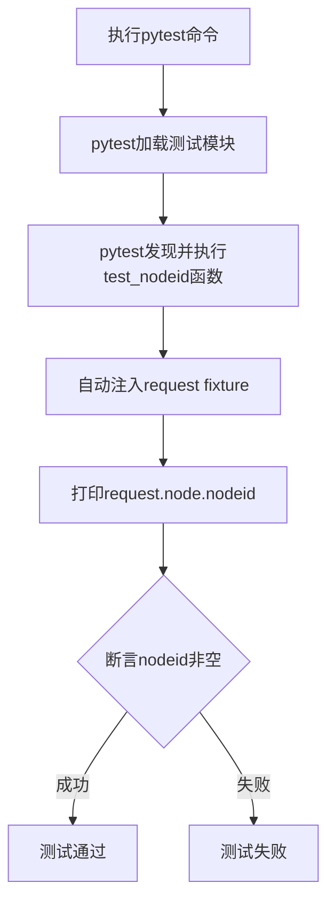
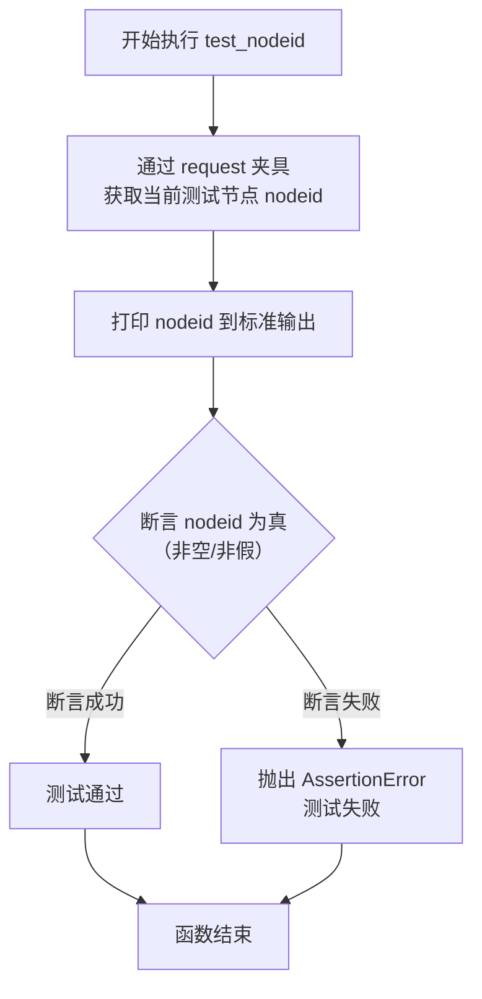

# `.\MetaGPT\tests\metagpt\utils\test_session.py` 详细设计文档

这是一个使用pytest框架编写的简单测试文件，其核心功能是验证pytest的`request`内置fixture能够正确提供当前测试节点的唯一标识符（nodeid），并通过打印和断言来演示该功能。

## 整体流程



## 类结构

```
无显式类结构
├── 全局函数: test_nodeid
└── 脚本入口: __main__
```

## 全局变量及字段


### `__name__`
    
内置变量，表示当前模块的名称，当模块作为主程序运行时值为 '__main__'。

类型：`str`
    


### `__file__`
    
内置变量，表示当前脚本文件的路径。

类型：`str`
    


    

## 全局函数及方法


### `test_nodeid`

这是一个使用 `pytest` 框架编写的测试函数。它的核心功能是获取并打印当前测试用例的唯一标识符（`nodeid`），并断言该标识符存在（非空或非假值）。这通常用于调试或验证测试运行时的上下文信息。

参数：

-  `request`：`pytest.fixtures.FixtureRequest`，`pytest` 框架提供的请求夹具，它封装了当前测试请求的上下文信息，允许测试函数访问如测试项、配置、缓存等资源。

返回值：`None`，该函数没有显式返回值，其核心行为是执行断言（`assert`）。

#### 流程图



#### 带注释源码

```python
def test_nodeid(request):
    # 从 request 夹具中获取当前测试节点（`request.node`），并打印其 `nodeid` 属性。
    # `nodeid` 是 pytest 中测试用例的唯一标识符，格式通常为“文件路径::测试函数名”或“文件路径::测试类名::测试方法名”。
    print(request.node.nodeid)
    # 使用 assert 语句验证 `request.node.nodeid` 的值是否为真（Truthy）。
    # 如果 `nodeid` 为空字符串、None、False 等，断言将失败，测试用例状态为失败。
    # 这确保了测试是在一个有效的、具有标识符的上下文中运行的。
    assert request.node.nodeid
```


## 关键组件


### pytest 测试框架

用于编写和运行测试的 Python 测试框架，提供测试发现、执行和报告功能。

### request 内置 Fixture

pytest 提供的一个内置 Fixture，用于在测试函数中访问测试请求的上下文信息，例如当前测试节点的标识符。

### node.nodeid 属性

`request` Fixture 中 `node` 对象的属性，表示当前测试用例的唯一标识符，通常包含模块路径、类名和测试函数名。


## 问题及建议


### 已知问题

-   **测试功能单一且脆弱**：当前测试用例 `test_nodeid` 仅验证了 `request.node.nodeid` 属性是否存在（非空），这是一个非常基础的属性检查。它没有验证 `nodeid` 的格式、内容或在不同测试场景下的行为，测试覆盖面和价值有限。
-   **硬编码的测试执行逻辑**：在 `if __name__ == "__main__":` 块中直接调用 `pytest.main([__file__, "-s"])` 来运行测试。虽然方便，但这使得该脚本难以被其他测试运行器（如 `unittest` 或通过 IDE 的测试发现机制）直接调用，降低了代码的通用性和可移植性。
-   **缺乏明确的测试意图说明**：代码中没有注释或文档字符串来解释 `test_nodeid` 测试的具体目的、预期行为以及它属于哪个更大的测试范畴。这使得代码的维护者难以理解其存在的意义。

### 优化建议

-   **增强测试用例的断言**：将简单的存在性检查扩展为更有意义的验证。例如，可以断言 `nodeid` 符合特定的模式（如包含文件名和测试函数名），或者在不同的 `pytest` 运行参数下（如使用 `-k` 筛选）其值的变化符合预期。
-   **移除脚本内的 `pytest.main` 调用**：遵循 `pytest` 的最佳实践，将测试发现和运行的工作完全交给 `pytest` 框架本身。删除 `if __name__ == "__main__":` 块，让用户通过命令行 `pytest path/to/this_file.py` 来执行测试。这提高了代码的清晰度和与标准测试工作流的兼容性。
-   **添加测试文档和注释**：为 `test_nodeid` 函数添加一个清晰的文档字符串（docstring），说明测试的目标、验证的逻辑以及任何重要的上下文信息。这能极大提升代码的可读性和可维护性。
-   **考虑测试的组织结构**：如果这是一个更大测试套件的一部分，应考虑将其移动到更合适的测试模块或目录结构中，并可能为其创建一个专门的测试类，以更好地组织相关的测试用例。


## 其它


### 设计目标与约束

本代码是一个简单的 Pytest 测试示例。其核心设计目标是验证 `pytest` 框架中 `request` fixture 的 `node.nodeid` 属性是否可用，并演示如何在一个独立的 Python 脚本中运行 Pytest 测试。主要约束包括：代码必须保持极简，仅用于演示目的；依赖 `pytest` 框架；作为独立脚本运行时需通过 `pytest.main` 调用。

### 错误处理与异常设计

代码本身不包含显式的错误处理逻辑。测试的成功与否完全由 `assert` 语句和 Pytest 框架自身机制决定。如果 `request.node.nodeid` 为 `None` 或空值，`assert` 语句将触发 `AssertionError`，Pytest 会将其捕获并标记测试为失败。脚本入口 `if __name__ == "__main__":` 下的 `pytest.main` 调用是执行测试的唯一路径，其执行过程中的任何异常（如导入错误、参数错误）将由 Pytest 处理并输出到控制台。

### 数据流与状态机

本示例代码的数据流非常简单：
1.  **输入**：当通过 `pytest` 命令或 `pytest.main()` 执行时，Pytest 框架自动为 `test_nodeid` 函数注入 `request` fixture 对象。
2.  **处理**：函数内部打印 `request.node.nodeid` 的值，并使用 `assert` 语句验证其真值（非 `None`、非空、非零等）。
3.  **输出**：断言结果决定测试状态（通过/失败），并通过 Pytest 输出到控制台。`print` 语句将节点 ID 信息输出到标准输出（需配合 `-s` 参数禁用输出捕获才能看到）。

不存在复杂的状态机，整个逻辑是线性的函数调用。

### 外部依赖与接口契约

1.  **Pytest 框架 (`pytest`)**: 核心外部依赖。代码需要 Pytest 环境来运行。
    *   **接口契约**：`test_nodeid` 函数遵循 Pytest 测试函数约定（以 `test_` 开头）。它使用 `request` fixture，该 fixture 由 Pytest 自动提供，其 `node` 属性下的 `nodeid` 应为一个表示测试节点唯一标识的字符串。
2.  **Python 标准库**: 使用了 `pytest` 模块。通过 `if __name__ == "__main__"` 下的 `pytest.main` 调用，约定了脚本作为主程序时的执行入口和参数格式（一个包含文件路径和 `-s` 选项的列表）。

### 安全与合规考虑

此示例代码不涉及网络操作、文件 I/O、用户数据或敏感信息处理，因此暂无特定的安全风险。从合规角度看，代码仅使用了开源的 Pytest 框架，符合典型的开源项目规范。唯一需要注意的是，在实际生产或项目测试中，应确保使用的 Pytest 版本是安全且得到维护的。

### 部署与运维说明

1.  **环境依赖**：需要 Python 3 环境和 `pytest` 库。可通过 `pip install pytest` 安装。
2.  **执行方式**：
    *   **作为 Pytest 测试集的一部分**：在项目目录中运行 `pytest` 命令，Pytest 会自动发现并执行此测试文件。
    *   **作为独立脚本运行**：直接执行此 Python 文件 (`python <filename>.py`)，脚本会调用 `pytest.main` 来运行自身。
3.  **配置**：脚本内硬编码了 `-s` 参数以确保 `print` 语句的输出可见。在实际测试集中，可能通过 `pytest.ini` 或命令行参数统一控制输出行为。
4.  **监控与日志**：测试结果（成功/失败）由 Pytest 框架输出。`print` 语句可用于临时调试，但在正式测试中建议使用 Pytest 的 `caplog` 或 `capsys` fixture 进行输出管理。

    