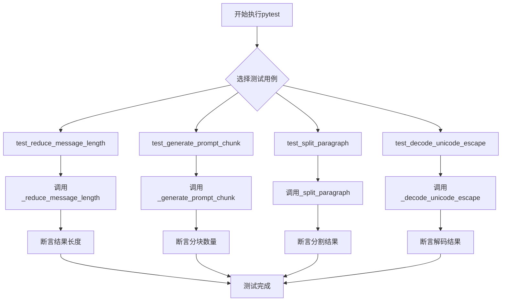
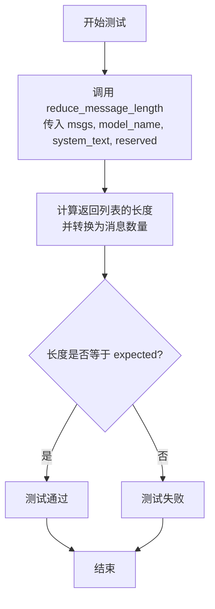
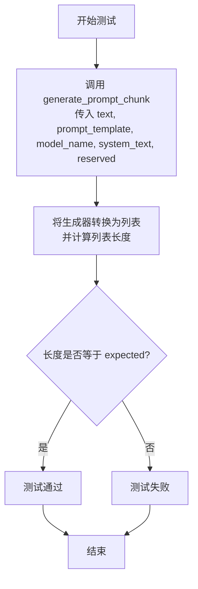
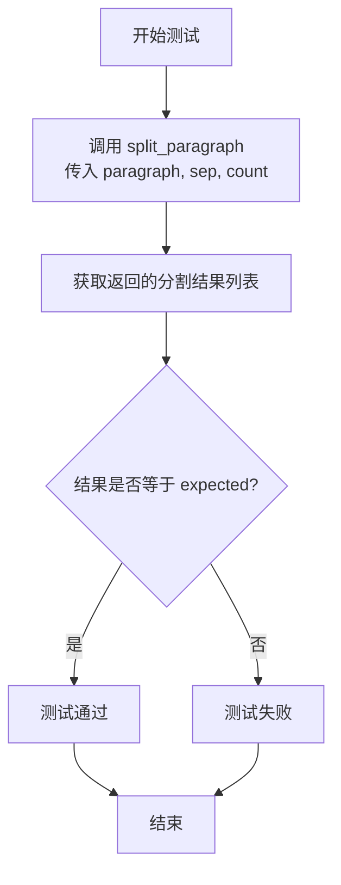
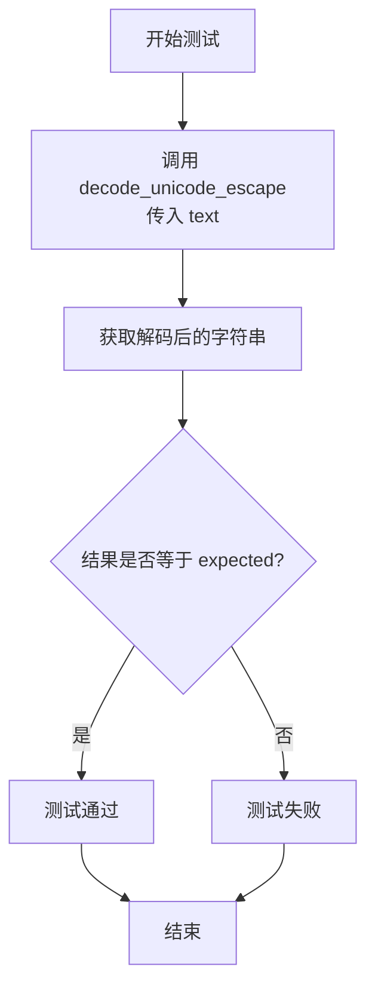
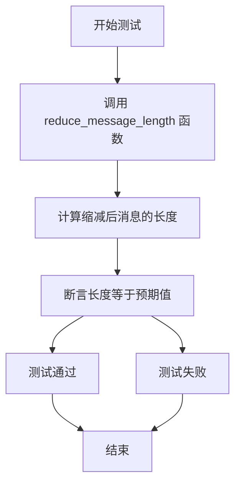
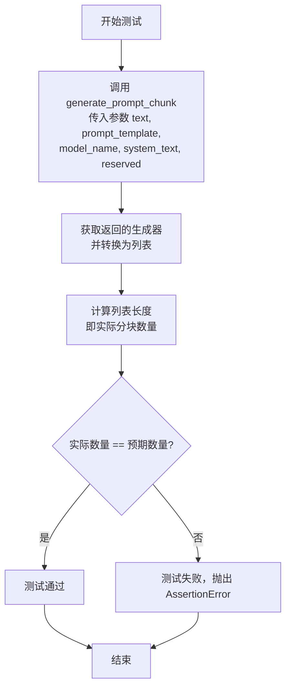

# `.\MetaGPT\tests\metagpt\utils\test_text.py` 详细设计文档

该文件是一个使用pytest框架编写的单元测试文件，用于测试`metagpt.utils.text`模块中的四个文本处理工具函数：`reduce_message_length`（根据模型上下文窗口和保留长度缩减消息列表）、`generate_prompt_chunk`（根据模型上下文窗口和保留长度将长文本分割成提示块）、`split_paragraph`（按指定分隔符将段落分割成指定数量的部分）和`decode_unicode_escape`（解码字符串中的Unicode转义序列）。

## 整体流程



## 类结构

```
测试文件 (test_text_utils.py)
├── 辅助函数 _msgs
├── 辅助函数 _paragraphs
├── 测试函数 test_reduce_message_length
├── 测试函数 test_generate_prompt_chunk
├── 测试函数 test_split_paragraph
└── 测试函数 test_decode_unicode_escape
```

## 全局变量及字段


    

## 全局函数及方法

### `_msgs`

一个生成器函数，用于生成一系列重复的字符串。每次迭代生成一个由 "Hello," 重复多次组成的字符串，重复次数随着迭代递减。

参数：
- 无参数

返回值：`generator`，一个生成器对象，每次迭代返回一个字符串。

#### 流程图

```mermaid
flowchart TD
    A[开始] --> B[初始化 length = 20]
    B --> C{length > 0?}
    C -- 是 --> D[生成字符串 "Hello," * 1000 * length]
    D --> E[length -= 1]
    E --> C
    C -- 否 --> F[结束]
```

#### 带注释源码

```python
def _msgs():
    # 初始化计数器 length 为 20
    length = 20
    # 当 length 不为 0 时循环
    while length:
        # 生成一个字符串，内容为 "Hello," 重复 1000 * length 次
        yield "Hello," * 1000 * length
        # 每次迭代后 length 减 1
        length -= 1
```

### `test_reduce_message_length`

该函数是一个参数化测试用例，用于验证 `reduce_message_length` 函数在不同输入参数下的行为。它通过生成器 `_msgs()` 提供消息数据，并测试 `reduce_message_length` 函数在给定模型、系统文本和保留长度的情况下，返回的消息列表长度是否符合预期。

参数：
- `msgs`：`generator`，一个生成器，用于生成测试用的消息序列。
- `model_name`：`str`，指定使用的模型名称（如 "gpt-3.5-turbo-0613"）。
- `system_text`：`str`，系统提示文本。
- `reserved`：`int`，保留的令牌数量。
- `expected`：`int`，期望的 `reduce_message_length` 返回的消息列表长度。

返回值：`None`，该函数是一个测试用例，不返回任何值，仅通过断言验证测试结果。

#### 流程图



#### 带注释源码

```python
def test_reduce_message_length(msgs, model_name, system_text, reserved, expected):
    # 调用 reduce_message_length 函数，传入测试参数，获取处理后的消息列表
    # 计算该列表的长度，并通过除以 "Hello," 的长度和 1000 来转换为原始消息的数量
    length = len(reduce_message_length(msgs, model_name, system_text, reserved)) / (len("Hello,")) / 1000
    # 断言转换后的长度等于期望值 expected
    assert length == expected
```

---

### `test_generate_prompt_chunk`

该函数是一个参数化测试用例，用于验证 `generate_prompt_chunk` 函数在不同输入参数下的行为。它测试给定文本、提示模板、模型、系统文本和保留长度时，`generate_prompt_chunk` 函数生成的块数量是否符合预期。

参数：
- `text`：`str`，需要分块的输入文本。
- `prompt_template`：`str`，提示模板字符串。
- `model_name`：`str`，指定使用的模型名称。
- `system_text`：`str`，系统提示文本。
- `reserved`：`int`，保留的令牌数量。
- `expected`：`int`，期望的 `generate_prompt_chunk` 返回的块数量。

返回值：`None`，该函数是一个测试用例，不返回任何值，仅通过断言验证测试结果。

#### 流程图



#### 带注释源码

```python
def test_generate_prompt_chunk(text, prompt_template, model_name, system_text, reserved, expected):
    # 调用 generate_prompt_chunk 函数，传入测试参数，获取一个生成器
    # 将该生成器转换为列表，并计算列表的长度（即块的数量）
    chunk = len(list(generate_prompt_chunk(text, prompt_template, model_name, system_text, reserved)))
    # 断言块的数量等于期望值 expected
    assert chunk == expected
```

---

### `test_split_paragraph`

该函数是一个参数化测试用例，用于验证 `split_paragraph` 函数在不同输入参数下的行为。它测试给定段落、分隔符和分割数量时，`split_paragraph` 函数返回的分割结果是否符合预期。

参数：
- `paragraph`：`str`，需要分割的段落文本。
- `sep`：`str`，用于分割的分隔符。
- `count`：`int`，期望分割成的段落数量。
- `expected`：`list`，期望的分割结果列表。

返回值：`None`，该函数是一个测试用例，不返回任何值，仅通过断言验证测试结果。

#### 流程图



#### 带注释源码

```python
def test_split_paragraph(paragraph, sep, count, expected):
    # 调用 split_paragraph 函数，传入测试参数，获取分割后的结果列表
    ret = split_paragraph(paragraph, sep, count)
    # 断言返回的结果列表等于期望值 expected
    assert ret == expected
```

---

### `test_decode_unicode_escape`

该函数是一个参数化测试用例，用于验证 `decode_unicode_escape` 函数在不同输入参数下的行为。它测试给定包含转义序列的文本时，`decode_unicode_escape` 函数是否能正确解码并返回预期的字符串。

参数：
- `text`：`str`，包含 Unicode 转义序列的输入文本。
- `expected`：`str`，期望的解码后的文本。

返回值：`None`，该函数是一个测试用例，不返回任何值，仅通过断言验证测试结果。

#### 流程图



#### 带注释源码

```python
def test_decode_unicode_escape(text, expected):
    # 调用 decode_unicode_escape 函数，传入测试参数，获取解码后的字符串
    # 断言解码后的字符串等于期望值 expected
    assert decode_unicode_escape(text) == expected
```

### `test_reduce_message_length`

该函数是一个使用 `pytest` 框架编写的参数化测试函数，用于测试 `reduce_message_length` 函数。它通过模拟不同长度的消息、不同的模型、系统文本和保留长度，验证 `reduce_message_length` 函数是否能正确地将消息列表缩减到预期的长度。

参数：

- `msgs`：`generator`，一个生成器，用于生成测试用的消息列表。
- `model_name`：`str`，指定使用的模型名称，如 "gpt-3.5-turbo-0613"。
- `system_text`：`str`，系统文本，模拟系统消息。
- `reserved`：`int`，保留长度，用于计算消息缩减后的预期长度。
- `expected`：`int`，预期的缩减后消息长度。

返回值：`None`，该函数是一个测试函数，不返回任何值，仅通过断言验证测试结果。

#### 流程图



#### 带注释源码

```python
def test_reduce_message_length(msgs, model_name, system_text, reserved, expected):
    # 调用 reduce_message_length 函数，传入消息生成器、模型名称、系统文本和保留长度
    # 计算缩减后消息的长度，并将其转换为以 "Hello," 为单位的长度
    length = len(reduce_message_length(msgs, model_name, system_text, reserved)) / (len("Hello,")) / 1000
    # 断言计算出的长度等于预期值
    assert length == expected
```

### `test_generate_prompt_chunk`

这是一个使用 `pytest` 框架编写的单元测试函数，用于测试 `generate_prompt_chunk` 函数。它通过多组参数化测试用例，验证 `generate_prompt_chunk` 函数在给定不同输入（如文本、提示模板、模型名称、系统文本和保留长度）时，是否能正确地将长文本分割成预期数量的块。

参数：
- `text`：`str`，需要被分割的长文本内容。
- `prompt_template`：`str`，用于包装文本的提示模板。
- `model_name`：`str`，指定使用的AI模型名称（如 `gpt-3.5-turbo-0613`），用于确定模型的上下文长度。
- `system_text`：`str`，系统提示文本，通常用于设定对话的角色或背景。
- `reserved`：`int`，为其他内容（如系统提示、用户回复等）保留的令牌数量。
- `expected`：`int`，期望 `generate_prompt_chunk` 函数返回的文本块数量。

返回值：`None`，这是一个测试函数，不返回业务值，它通过断言（`assert`）来验证测试结果。

#### 流程图



#### 带注释源码

```python
# 使用pytest的parametrize装饰器定义多组测试数据
# 每组数据包含：text（测试文本）, prompt_template（提示模板）, model_name（模型名）, system_text（系统文本）, reserved（保留令牌数）, expected（期望分块数）
@pytest.mark.parametrize(
    "text, prompt_template, model, system_text, reserved, expected",
    [
        # 测试用例1: 对于gpt-3.5-turbo-0613模型，1000个"Hello World."句子，期望分成2块
        (" ".join("Hello World." for _ in range(1000)), "Prompt: {}", "gpt-3.5-turbo-0613", "System", 1500, 2),
        # 测试用例2: 对于gpt-3.5-turbo-16k模型，同样文本，期望分成1块（因为上下文更长）
        (" ".join("Hello World." for _ in range(1000)), "Prompt: {}", "gpt-3.5-turbo-16k", "System", 3000, 1),
        # 测试用例3: 对于gpt-4模型，4000个句子，期望分成2块
        (" ".join("Hello World." for _ in range(4000)), "Prompt: {}", "gpt-4", "System", 2000, 2),
        # 测试用例4: 对于gpt-4-32k模型，8000个句子，期望分成1块
        (" ".join("Hello World." for _ in range(8000)), "Prompt: {}", "gpt-4-32k", "System", 4000, 1),
        # 测试用例5: 对于gpt-3.5-turbo-0613模型，8000个"Hello World"（无句点），保留长度较小，期望分成8块
        (" ".join("Hello World" for _ in range(8000)), "Prompt: {}", "gpt-3.5-turbo-0613", "System", 1000, 8),
    ],
)
def test_generate_prompt_chunk(text, prompt_template, model_name, system_text, reserved, expected):
    # 调用被测试函数 generate_prompt_chunk，它返回一个生成器
    # 使用 list() 将生成器转换为列表，列表的每个元素是一个文本块
    chunk = len(list(generate_prompt_chunk(text, prompt_template, model_name, system_text, reserved)))
    # 断言：实际计算出的分块数量（chunk）必须等于期望的数量（expected）
    # 如果不相等，测试将失败
    assert chunk == expected
```

### `test_split_paragraph`

该函数是一个使用 `pytest` 框架编写的单元测试，用于验证 `split_paragraph` 函数在不同输入参数下的行为是否符合预期。它通过 `@pytest.mark.parametrize` 装饰器定义多组测试用例，每组用例包含输入段落、分隔符、期望的分割数量以及期望的输出结果列表。函数执行时，会调用 `split_paragraph` 并使用 `assert` 语句验证其返回值是否与期望值相等。

参数：
- `paragraph`：`str`，待分割的文本段落。
- `sep`：`str`，用于分割段落的分隔符。
- `count`：`int`，期望将段落分割成的块数。
- `expected`：`List[str]`，期望的分割结果列表。

返回值：`None`，这是一个测试函数，不返回任何值，仅通过断言验证测试结果。

#### 流程图

```mermaid
flowchart TD
    A[开始测试] --> B[使用@pytest.mark.parametrize<br>注入测试数据]
    B --> C[调用 split_paragraph<br>传入 paragraph, sep, count]
    C --> D{断言结果<br>ret == expected?}
    D -->|是| E[测试通过]
    D -->|否| F[测试失败，抛出异常]
    E --> G[结束]
    F --> G
```

#### 带注释源码

```python
# 使用pytest的参数化装饰器定义多组测试数据
# 每组数据包含：paragraph（段落），sep（分隔符），count（分割数量），expected（期望结果）
@pytest.mark.parametrize(
    "paragraph, sep, count, expected",
    [
        # 测试用例1：将10个“Hello World.”句子用“.”分割成2块
        (_paragraphs(10), ".", 2, [_paragraphs(5), f" {_paragraphs(5)}"]),
        # 测试用例2：将10个句子用“.”分割成3块
        (_paragraphs(10), ".", 3, [_paragraphs(4), f" {_paragraphs(3)}", f" {_paragraphs(3)}"]),
        # 测试用例3：包含换行符的段落，使用“\n.”作为分隔符分割成2块
        (f"{_paragraphs(5)}\n{_paragraphs(3)}", "\n.", 2, [f"{_paragraphs(5)}\n", _paragraphs(3)]),
        # 测试用例4：连续分隔符“.”的字符串，分割成2块
        ("......", ".", 2, ["...", "..."]),
        # 测试用例5：连续分隔符“.”的字符串，分割成3块
        ("......", ".", 3, ["..", "..", ".."]),
        # 测试用例6：奇数个连续分隔符“.”的字符串，分割成2块
        (".......", ".", 2, ["....", "..."]),
    ],
)
def test_split_paragraph(paragraph, sep, count, expected):
    # 调用被测试函数 split_paragraph，传入当前测试用例的参数
    ret = split_paragraph(paragraph, sep, count)
    # 使用断言验证函数返回值 ret 是否等于期望值 expected
    assert ret == expected
```

### `test_decode_unicode_escape`

这是一个使用 `pytest` 框架编写的单元测试函数，用于测试 `decode_unicode_escape` 函数。它通过参数化测试用例，验证该函数是否能正确地将包含转义序列（如 `\n`, `\t`, `\u0020`）的字符串解码为对应的字符。

参数：
- `text`：`str`，包含转义序列的输入字符串。
- `expected`：`str`，期望解码后的输出字符串。

返回值：`None`，这是一个测试函数，不返回业务值，而是通过 `assert` 语句验证测试结果。

#### 流程图

```mermaid
flowchart TD
    A[开始测试] --> B[获取参数化测试数据<br>text, expected]
    B --> C[调用被测函数<br>decode_unicode_escape(text)]
    C --> D{断言<br>实际结果 == expected?}
    D -- 是 --> E[测试通过]
    D -- 否 --> F[测试失败，抛出异常]
    E --> G[结束]
    F --> G
```

#### 带注释源码

```python
# 使用pytest的parametrize装饰器定义多组测试数据
# 每组数据包含一个输入字符串`text`和期望的输出字符串`expected`
@pytest.mark.parametrize(
    "text, expected",
    [
        # 测试用例1: 将转义换行符 `\n` 解码为实际的换行符
        ("Hello\\nWorld", "Hello\nWorld"),
        # 测试用例2: 将转义制表符 `\t` 解码为实际的制表符
        ("Hello\\tWorld", "Hello\tWorld"),
        # 测试用例3: 将Unicode转义序列 `\u0020` (空格) 解码为实际空格
        ("Hello\\u0020World", "Hello World"),
    ],
)
def test_decode_unicode_escape(text, expected):
    # 核心测试逻辑：调用被测函数`decode_unicode_escape`，并使用assert断言验证结果
    # 如果函数返回值与`expected`相等，则测试通过；否则测试失败。
    assert decode_unicode_escape(text) == expected
```

## 关键组件

### `reduce_message_length`

一个用于根据指定的模型、系统文本和预留空间，动态缩减消息列表长度的函数，旨在适配不同LLM模型的上下文窗口限制。

### `generate_prompt_chunk`

一个用于将长文本根据提示词模板、模型限制和预留空间，智能地分割成多个块（chunks）的函数，以便分批处理或发送给LLM。

### `split_paragraph`

一个通用的段落分割函数，根据指定的分隔符和期望的段落数量，将输入文本分割成多个部分，支持处理包含换行符等复杂场景。

### `decode_unicode_escape`

一个用于解码包含Unicode转义序列（如`\n`， `\t`， `\u0020`）的字符串，将其转换为对应的实际字符的函数。

## 问题及建议


### 已知问题

-   **测试用例的健壮性不足**：`test_reduce_message_length` 和 `test_generate_prompt_chunk` 测试函数中的断言逻辑依赖于对特定字符串 `"Hello,"` 或 `"Hello World."` 的重复计数和长度计算。这种硬编码的断言方式使得测试用例非常脆弱，一旦被测试函数 `reduce_message_length` 或 `generate_prompt_chunk` 的内部实现细节（如消息格式、分隔符）发生变化，即使核心功能正确，测试也可能失败。这增加了维护成本。
-   **测试数据生成函数存在误导性**：`_msgs()` 生成器函数在每次调用时都会从头开始生成数据（`length` 从20递减到1）。当它在 `@pytest.mark.parametrize` 中被多次引用时，每次参数化调用都会重新执行该函数。虽然对于当前测试目的（计算长度）可能没有影响，但这种行为可能让阅读者误以为生成器在测试间共享状态或数据，降低了代码的可读性和明确性。
-   **测试覆盖范围可能不完整**：测试用例主要关注不同模型和长度配置下的分块数量，但可能缺少对边界条件（如空消息列表、极短的文本、`reserved` 参数为0或负数）、异常输入（如非字符串类型）以及 `split_paragraph` 函数在复杂分隔符和文本组合下的行为验证。例如，`split_paragraph` 测试中分隔符 `"\n."` 是一个组合，但测试用例没有充分展示其与文本中 `\n` 和 `.` 交互的所有可能情况。
-   **性能测试缺失**：代码处理的是可能很长的文本（如 `"Hello," * 1000 * 20`）。当前测试只验证了功能正确性，没有对 `reduce_message_length` 或 `generate_prompt_chunk` 在处理超长输入时的性能（如执行时间、内存占用）进行基准测试或压力测试，存在潜在的性能瓶颈风险。

### 优化建议

-   **重构测试断言，增强健壮性**：建议修改 `test_reduce_message_length` 和 `test_generate_prompt_chunk` 的断言逻辑，使其不依赖于被测试函数返回值的具体字符串内容。例如，可以改为断言返回的消息列表的总字符数不超过（模型上限 - 预留值），或者断言分块数量符合基于输入长度和模型限制的预期计算值，而不是基于固定的 `"Hello,"` 长度进行计算。
-   **明确测试数据生成方式**：对于 `_msgs()` 和 `_paragraphs(n)` 这类测试工具函数，可以在函数名或注释中更明确地说明其行为。或者，对于需要固定测试数据集的情况，可以考虑在参数化中直接使用预定义的列表或元组，而不是一个生成器函数，以提高测试的清晰度。
-   **补充边界和异常测试用例**：为各个测试函数增加针对边界条件和异常输入的测试用例。例如，为 `test_reduce_message_length` 添加空迭代器、`reserved` 大于模型上限的测试；为 `test_split_paragraph` 添加 `count` 大于段落可分割次数、分隔符为空字符串或不在文本中的测试；为 `test_decode_unicode_escape` 添加包含无效Unicode转义序列的输入测试。
-   **引入性能与压力测试**：考虑添加专门的性能测试模块或使用 `pytest-benchmark` 等插件，对关键函数（尤其是处理长文本的函数）进行性能基准测试。这有助于在代码重构或依赖升级时及时发现性能回归。同时，可以添加针对极大输入（如数MB的文本）的压力测试，确保函数不会导致内存溢出或极端耗时。
-   **提高测试代码的可读性和维护性**：考虑将一些复杂的测试数据构造逻辑提取到更清晰的辅助函数或fixture中。对于 `@pytest.mark.parametrize` 中冗长的参数列表，可以适当格式化或使用变量名来提高可读性。确保测试函数和测试数据的命名清晰反映了其测试意图。


## 其它


### 设计目标与约束

本测试模块的设计目标是验证 `metagpt.utils.text` 模块中四个文本处理函数（`reduce_message_length`, `generate_prompt_chunk`, `split_paragraph`, `decode_unicode_escape`）在不同输入参数下的正确性。核心约束包括：1) 使用 `pytest` 框架进行参数化测试，以覆盖多种边界和典型场景；2) 测试数据通过生成器或字符串拼接动态构造，以模拟真实数据规模；3) 断言逻辑需精确匹配预期输出，确保函数行为符合设计规范。

### 错误处理与异常设计

当前测试代码未显式包含错误处理或异常测试用例。测试函数依赖于 `pytest` 框架在断言失败时自动抛出 `AssertionError`。潜在的异常场景（如输入 `None`、空字符串、无效模型名称、`reserved` 参数为负数等）未被覆盖，这构成了测试覆盖率的缺口。理想情况下，应补充测试用例来验证函数在无效输入下的行为（例如是否抛出预期的 `ValueError` 或 `TypeError`）。

### 数据流与状态机

测试模块的数据流是线性的：1) 通过 `@pytest.mark.parametrize` 装饰器注入参数化测试数据；2) 测试函数调用被测函数并获取结果；3) 对结果进行计算或转换；4) 使用 `assert` 语句验证结果与预期值相等。不存在复杂的状态机。`_msgs` 和 `_paragraphs` 这两个辅助函数用于生成测试数据流，前者是一个生成器，按需产生递减长度的重复字符串，后者通过循环拼接生成指定数量的段落字符串。

### 外部依赖与接口契约

1.  **内部依赖**：强依赖于 `metagpt.utils.text` 模块，具体是 `decode_unicode_escape`, `generate_prompt_chunk`, `reduce_message_length`, `split_paragraph` 这四个函数。测试用例的设计与这些函数的签名和预期行为紧密耦合。
2.  **外部依赖**：依赖于 `pytest` 测试框架来运行测试用例、管理参数化和执行断言。这是唯一的第三方库依赖。
3.  **接口契约**：测试用例本身定义了与被测函数之间的“契约”。例如，`test_reduce_message_length` 的断言逻辑隐含了 `reduce_message_length` 函数返回的消息列表总长度（以特定子串为单位计算）必须精确等于某个预期值。这些测试用例共同构成了对 `text` 工具模块功能正确性的具体验证契约。

    