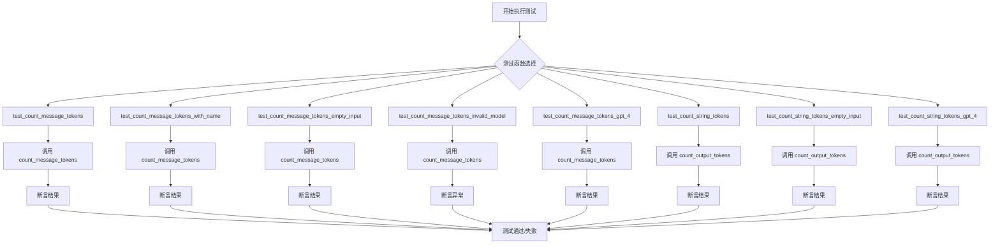
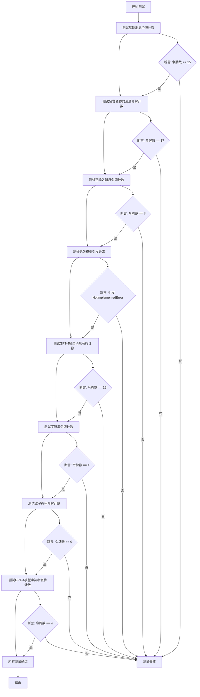
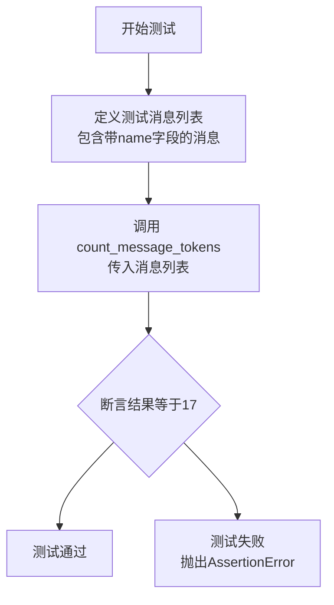
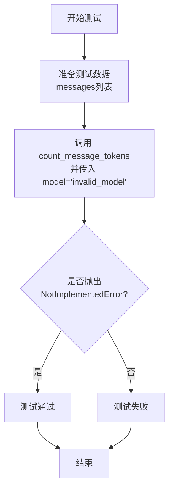
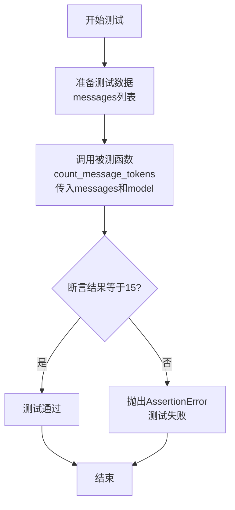
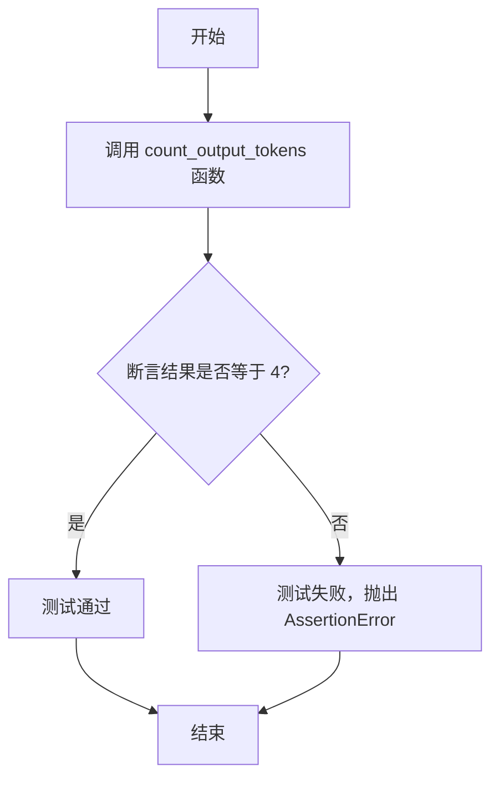
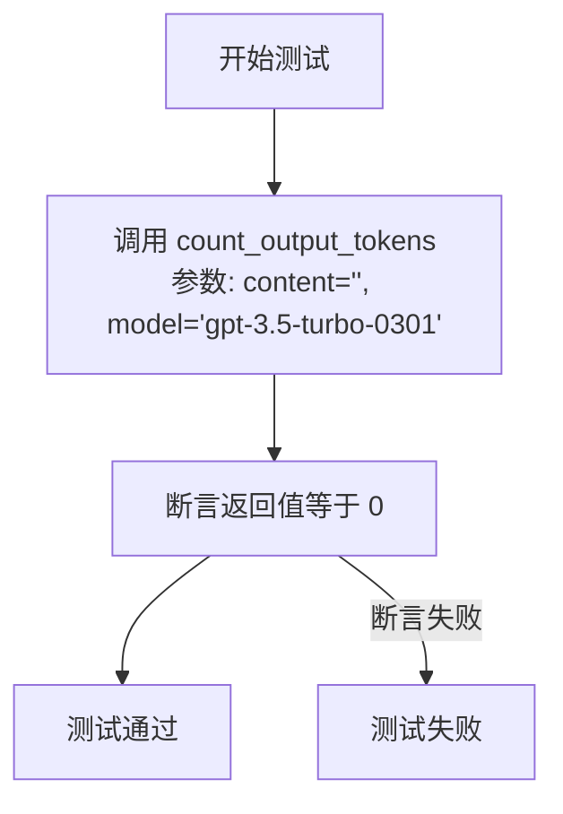

# `.\MetaGPT\tests\metagpt\utils\test_token_counter.py` 详细设计文档

该文件是一个单元测试文件，用于测试 `metagpt.utils.token_counter` 模块中的 `count_message_tokens` 和 `count_output_tokens` 函数。它验证了这些函数在不同输入（如不同模型、不同消息结构、空输入）下计算令牌数量的正确性，并确保对无效输入或模型能抛出预期的异常。

## 整体流程



## 类结构

```
test_token_counter.py (测试模块)
├── test_count_message_tokens (测试函数)
├── test_count_message_tokens_with_name (测试函数)
├── test_count_message_tokens_empty_input (测试函数)
├── test_count_message_tokens_invalid_model (测试函数)
├── test_count_message_tokens_gpt_4 (测试函数)
├── test_count_string_tokens (测试函数)
├── test_count_string_tokens_empty_input (测试函数)
└── test_count_string_tokens_gpt_4 (测试函数)
```

## 全局变量及字段


    

## 全局函数及方法

### `test_count_message_tokens`

这是一个单元测试函数，用于测试 `count_message_tokens` 函数在不同场景下的行为，包括计算消息列表的令牌数、处理包含名称的消息、处理空输入、处理无效模型以及针对特定GPT模型（如GPT-4）的测试。

参数：
- 无显式参数。该函数是 `pytest` 测试用例，不接收外部参数。

返回值：`None`，该函数是测试用例，通过断言（`assert`）来验证预期行为，不返回任何值。

#### 流程图



#### 带注释源码

```python
def test_count_message_tokens():
    # 测试基础消息列表的令牌计数
    # 消息列表包含一个用户消息和一个助手消息
    messages = [
        {"role": "user", "content": "Hello"},
        {"role": "assistant", "content": "Hi there!"},
    ]
    # 断言：调用 count_message_tokens 函数返回的令牌数应为 15
    assert count_message_tokens(messages) == 15


def test_count_message_tokens_with_name():
    # 测试包含名称（name字段）的消息列表的令牌计数
    # 第一个消息包含一个额外的 "name" 字段
    messages = [
        {"role": "user", "content": "Hello", "name": "John"},
        {"role": "assistant", "content": "Hi there!"},
    ]
    # 断言：由于包含名称，令牌数应增加至 17
    assert count_message_tokens(messages) == 17


def test_count_message_tokens_empty_input():
    """Empty input should return 3 tokens"""
    # 测试空消息列表的令牌计数
    # 断言：空输入应返回 3 个令牌（可能是系统默认的令牌开销）
    assert count_message_tokens([]) == 3


def test_count_message_tokens_invalid_model():
    """Invalid model should raise a KeyError"""
    # 测试当传入无效模型名称时，函数应抛出异常
    messages = [
        {"role": "user", "content": "Hello"},
        {"role": "assistant", "content": "Hi there!"},
    ]
    # 使用 pytest.raises 上下文管理器来捕获预期的 NotImplementedError 异常
    with pytest.raises(NotImplementedError):
        # 传入一个无效的模型名称 "invalid_model"
        count_message_tokens(messages, model="invalid_model")


def test_count_message_tokens_gpt_4():
    # 测试针对特定 GPT-4 模型（gpt-4-0314）的消息令牌计数
    messages = [
        {"role": "user", "content": "Hello"},
        {"role": "assistant", "content": "Hi there!"},
    ]
    # 断言：使用 GPT-4 模型时，令牌计数应与基础测试相同（15）
    assert count_message_tokens(messages, model="gpt-4-0314") == 15
```

### `test_count_message_tokens_with_name`

这是一个单元测试函数，用于测试 `count_message_tokens` 函数在处理包含 `name` 字段的消息列表时的行为。它验证当消息字典中包含 `name` 键时，令牌计数是否正确增加。

参数：
- 无显式参数。该函数是一个测试用例，不接收外部参数。

返回值：`None`，该函数是一个测试用例，通过 `assert` 语句验证预期结果，不返回任何值。

#### 流程图



#### 带注释源码

```python
def test_count_message_tokens_with_name():
    # 定义一个测试用的消息列表，其中第一条消息包含'name'字段
    messages = [
        {"role": "user", "content": "Hello", "name": "John"},
        {"role": "assistant", "content": "Hi there!"},
    ]
    # 断言：调用count_message_tokens函数计算上述消息的令牌数，预期结果为17。
    # 这个测试验证了当消息中包含'name'字段时，令牌计数器能正确地将该字段计入总令牌数。
    assert count_message_tokens(messages) == 17
```

### `test_count_message_tokens_empty_input`

该函数是一个单元测试，用于验证 `count_message_tokens` 函数在接收到空消息列表（`[]`）作为输入时，是否能够正确返回预期的令牌数量（3个令牌）。它测试了核心函数处理边界情况的能力。

参数：
- 无显式参数。该函数是一个测试用例，不接收外部参数。

返回值：`None`，该函数是一个测试用例，其主要目的是通过断言（`assert`）来验证代码行为，不返回业务逻辑值。如果断言失败，测试框架会抛出异常。

#### 流程图

```mermaid
flowchart TD
    Start[开始测试] --> CallFunc[调用 count_message_tokens([])]
    CallFunc --> Assert[断言返回值等于 3]
    Assert --> Pass{断言是否通过？}
    Pass -- 是 --> EndPass[测试通过]
    Pass -- 否 --> EndFail[测试失败，抛出 AssertionError]
```

#### 带注释源码

```python
def test_count_message_tokens_empty_input():
    """Empty input should return 3 tokens"""  # 文档字符串：说明测试目的——空输入应返回3个令牌。
    assert count_message_tokens([]) == 3  # 断言：调用`count_message_tokens`函数并传入空列表`[]`，预期其返回值为3。
```

### `test_count_message_tokens_invalid_model`

该函数是一个单元测试，用于验证当向 `count_message_tokens` 函数传入一个无效的模型名称时，是否会抛出预期的 `NotImplementedError` 异常。

参数：
- `无显式参数`：`None`，这是一个单元测试函数，其参数由测试框架（pytest）隐式管理。

返回值：`None`，单元测试函数通常不直接返回值，而是通过断言（assert）或异常检查来验证代码行为。

#### 流程图



#### 带注释源码

```python
def test_count_message_tokens_invalid_model():
    """Invalid model should raise a KeyError"""  # 文档字符串：说明测试目的——无效模型应引发异常（注：文档字符串写的是KeyError，但实际测试的是NotImplementedError）
    messages = [  # 准备测试数据：一个包含两条消息的列表
        {"role": "user", "content": "Hello"},
        {"role": "assistant", "content": "Hi there!"},
    ]
    with pytest.raises(NotImplementedError):  # 使用pytest的raises上下文管理器，断言接下来的代码会抛出NotImplementedError异常
        count_message_tokens(messages, model="invalid_model")  # 调用被测试函数，传入消息列表和一个无效的模型名称
```

### `test_count_message_tokens_gpt_4`

这是一个针对 `count_message_tokens` 函数的单元测试，专门用于测试在 `gpt-4-0314` 模型下，计算给定消息列表的令牌数量是否与预期值（15）相符。

参数：
-  `messages`：`list`，一个包含两个字典的列表，分别模拟用户和助手的消息。
-  `model`：`str`，指定要测试的模型名称，此处为 `"gpt-4-0314"`。

返回值：`None`，这是一个测试函数，其主要目的是通过断言（`assert`）来验证功能，不返回业务值。如果断言失败，测试框架会抛出异常。

#### 流程图



#### 带注释源码

```python
def test_count_message_tokens_gpt_4():
    # 步骤1：准备测试数据。创建一个消息列表，模拟一个简单的用户与AI助手的对话。
    messages = [
        {"role": "user", "content": "Hello"},
        {"role": "assistant", "content": "Hi there!"},
    ]
    # 步骤2：执行测试。调用被测函数 `count_message_tokens`，
    #        传入消息列表和指定的模型 `gpt-4-0314`。
    # 步骤3：验证结果。使用 `assert` 语句检查函数返回值是否等于预期值 15。
    #        如果相等，测试通过；如果不相等，`pytest` 会捕获 `AssertionError` 并标记测试失败。
    assert count_message_tokens(messages, model="gpt-4-0314") == 15
```

### `test_count_string_tokens`

该函数是一个单元测试，用于验证 `count_output_tokens` 函数在给定特定输入字符串和模型名称时，能否正确计算并返回预期的令牌数量。

参数：
- `string`：`str`，需要计算令牌数量的输入字符串。
- `model`：`str`，指定使用的模型名称，用于确定令牌化规则。

返回值：`None`，该函数是一个测试函数，不返回任何值，仅通过断言（assert）来验证预期结果。

#### 流程图



#### 带注释源码

```python
def test_count_string_tokens():
    """Test that the string tokens are counted correctly."""

    string = "Hello, world!"  # 定义测试用的输入字符串
    assert count_output_tokens(string, model="gpt-3.5-turbo-0301") == 4  # 调用被测试函数并断言结果等于4
```

### `test_count_string_tokens_empty_input`

这是一个单元测试函数，用于测试 `count_output_tokens` 函数在处理空字符串输入时的行为。它验证当输入一个空字符串时，函数是否正确地返回 0 个令牌。

参数：
- 无显式参数。该函数是一个测试用例，不接收外部参数。

返回值：`None`，这是一个单元测试函数，其主要目的是通过断言（assert）来验证代码行为，不返回业务逻辑值。测试框架通过断言的成功或失败来判断测试是否通过。

#### 流程图



#### 带注释源码

```python
def test_count_string_tokens_empty_input():
    """Test that the string tokens are counted correctly."""
    # 调用被测试函数 count_output_tokens，传入空字符串和指定的模型
    # 预期行为：对于空字符串，应返回 0 个令牌
    assert count_output_tokens("", model="gpt-3.5-turbo-0301") == 0
```

### `test_count_string_tokens_gpt_4`

这是一个单元测试函数，用于验证 `count_output_tokens` 函数在使用 `gpt-4-0314` 模型时，对给定字符串进行分词计数的准确性。它测试了字符串 `"Hello, world!"` 是否被正确计为 4 个 tokens。

参数：
-  `string`：`str`，用于测试分词计数的输入字符串。
-  `model`：`str`，指定使用的模型，此处为 `"gpt-4-0314"`。

返回值：`None`，这是一个测试函数，通过 `assert` 语句验证结果，不返回任何值。

#### 流程图

```mermaid
flowchart TD
    A[开始测试] --> B[定义测试字符串<br/>string = "Hello, world!"]
    B --> C[调用 count_output_tokens<br/>传入 string 和 model="gpt-4-0314"]
    C --> D{断言结果是否为 4}
    D -- 是 --> E[测试通过]
    D -- 否 --> F[测试失败，抛出 AssertionError]
    E --> G[结束]
    F --> G
```

#### 带注释源码

```python
def test_count_string_tokens_gpt_4():
    """Test that the string tokens are counted correctly."""

    # 定义测试用的输入字符串
    string = "Hello, world!"
    # 调用 count_output_tokens 函数，传入字符串和指定的 GPT-4 模型
    # 使用 assert 语句验证函数返回的 token 数量是否等于预期值 4
    assert count_output_tokens(string, model="gpt-4-0314") == 4
```

## 关键组件


### 消息令牌计数

负责计算一组聊天消息（例如，来自OpenAI API的格式）在指定模型下的令牌消耗。它处理不同的消息角色、可选的消息名称，并针对不同的模型（如gpt-3.5-turbo和gpt-4）使用特定的编码和定价规则。

### 输出令牌计数

负责计算单个字符串内容在指定模型下的令牌消耗。它直接对字符串进行编码，用于估算模型输出内容的令牌成本。

### 模型特定编码与定价规则

作为底层支持组件，为不同的模型（如`gpt-3.5-turbo-0301`、`gpt-4-0314`）提供正确的分词器（Tokenizer）和每消息的固定令牌开销，确保令牌计数与对应模型的API计费方式一致。


## 问题及建议


### 已知问题

-   **硬编码的模型参数**：测试用例中直接使用了 `"gpt-4-0314"` 和 `"gpt-3.5-turbo-0301"` 等具体的模型版本字符串。这些模型版本可能已过时或被弃用（例如 `-0301` 后缀通常表示特定快照），导致测试结果与实际使用新版模型时的计算结果不符，测试可能失效。
-   **魔术数字缺乏解释**：测试中断言了一些固定的令牌数（如 `15`, `17`, `3`, `4`）。这些数字是底层 `token_counter` 模块逻辑的体现，但在测试文件中缺乏上下文说明。如果底层计数逻辑发生变化，需要同步更新所有测试用例中的这些数字，维护成本高且容易出错。
-   **异常测试覆盖不全**：`test_count_message_tokens_invalid_model` 测试了传入无效模型时抛出 `NotImplementedError`。然而，未测试 `count_output_tokens` 函数在遇到无效模型时的行为，存在测试覆盖缺口。
-   **测试数据单一**：测试用例中使用的消息内容和字符串都非常简单（如 `"Hello"`, `"Hi there!"`, `"Hello, world!"`）。这未能覆盖边界情况，例如超长内容、包含特殊字符、换行符、不同语言（如中文、Emoji）等情况下的令牌计数是否正确。

### 优化建议

-   **使用参数化测试和模型版本管理**：建议使用 `@pytest.mark.parametrize` 对测试进行参数化。将测试数据（输入消息、字符串、预期令牌数）和对应的**有效模型名称**（可从 `token_counter` 模块支持的模型列表中动态获取或维护一个测试配置列表）作为参数。这能减少重复代码，并便于在未来更新或添加支持的模型时集中管理。
-   **将魔术数字重构为有意义的常量或从源头计算**：在测试文件或共享的测试工具模块中，为这些魔术数字定义常量，并附上简要注释说明其来源（例如 `DEFAULT_EMPTY_MESSAGES_TOKENS = 3 # 对应token_counter中空消息的默认开销`）。更优的做法是，在参数化测试中，预期结果可以通过调用一个可信的、经过验证的基础方法（或使用官方`tiktoken`库）来动态计算，而不是硬编码，但这可能涉及测试哲学的改变（是测试逻辑还是测试固定结果）。
-   **补充异常和边界测试**：
    1.  为 `count_output_tokens` 函数添加针对无效模型参数的异常测试。
    2.  添加边界测试用例，例如：包含多行文本、最大上下文长度附近的文本、混合语言、大量符号的消息和字符串，以验证令牌计数器在复杂场景下的鲁棒性。
    3.  测试 `messages` 参数为 `None` 或非列表类型时的行为（如果函数设计需要处理的话）。
-   **提升测试可读性与维护性**：考虑将较长的测试消息或复杂的测试数据提取到测试文件顶部的常量或辅助函数中，使测试用例本身更清晰。为每个测试用例添加更详细的文档字符串，解释测试的具体场景和断言的理由。
-   **考虑测试性能（可选）**：如果令牌计数函数被频繁调用，可以添加简单的性能测试（例如使用 `pytest-benchmark`），确保其性能在可接受范围内，尤其是在处理长文本时。


## 其它


### 设计目标与约束

该代码模块的核心设计目标是提供准确、高效的令牌计数功能，以支持基于大型语言模型（如GPT系列）的应用进行成本估算和上下文长度管理。主要约束包括：1) 必须与OpenAI官方使用的tiktoken库保持兼容，确保计数准确性；2) 需要支持多种GPT模型变体（如gpt-3.5-turbo, gpt-4）及其不同版本；3) 函数接口需保持简洁，易于集成到上层消息处理流程中；4) 性能需满足高频调用的需求，避免成为系统瓶颈。

### 错误处理与异常设计

代码通过异常机制处理错误情况：
1. **未实现的模型**：当`count_message_tokens`或`count_output_tokens`函数接收到不被支持的`model`参数时，会抛出`NotImplementedError`异常，调用者需捕获此异常并回退到默认模型或进行其他处理。
2. **输入数据验证**：函数内部应（虽然当前测试未完全展示）对输入的消息格式（如`messages`列表的字典结构）和字符串进行验证。无效的输入可能导致函数返回不准确的结果或内部异常，建议在函数入口处增加健壮的类型和结构检查。
3. **依赖库错误**：核心依赖`tiktoken`库可能因编码问题或网络问题（如加载编码器时）抛出异常。当前代码未显式处理这些异常，建议在更上层的调用中进行捕获和记录，或在本模块进行封装，返回一个表示计数失败的特定值或异常。

### 数据流与状态机

本模块为无状态工具模块，不涉及复杂的状态机。数据流是单向和即时的：
1. **输入**：调用者提供`messages`（消息列表）或`string`（输出字符串）以及可选的`model`标识符。
2. **处理**：函数根据`model`选择对应的tiktoken编码器，将输入内容按特定规则（对于消息，包含角色、内容、名字等元信息）格式化为一个字符串，然后使用编码器进行令牌化并计数。
3. **输出**：返回一个整数，表示估算的令牌数量。
流程图：`输入参数 -> 模型编码器选择 -> 内容格式化 -> tiktoken编码/计数 -> 返回令牌数`。

### 外部依赖与接口契约

1. **核心依赖**：`tiktoken`库（OpenAI）。这是实现准确令牌计数的关键，版本需与OpenAI模型更新保持同步。
2. **接口契约**：
    *   `count_message_tokens(messages: List[Dict], model: str = "gpt-3.5-turbo") -> int`
        *   入参`messages`需遵循OpenAI ChatCompletion API的消息格式（例如包含`role`和`content`键的字典列表）。
        *   入参`model`字符串需与`tiktoken`支持的模型名称匹配。
        *   返回输入消息列表在指定模型下预估的令牌消耗总数。
    *   `count_output_tokens(string: str, model: str = "gpt-3.5-turbo") -> int`
        *   入参`string`为普通文本字符串。
        *   返回该字符串在指定模型下预估的令牌数。
3. **隐式依赖**：对OpenAI模型定价和上下文长度策略的认知。虽然不直接依赖，但本模块的功能价值建立在OpenAI按令牌计费和设置上下文窗口上限的基础上。

### 测试策略与覆盖

当前代码为测试文件，展示了模块的测试策略：
1. **单元测试**：针对每个核心函数（`count_message_tokens`, `count_output_tokens`）设计测试用例。
2. **测试重点**：
    *   **基础功能**：验证正常消息和字符串的计数是否正确。
    *   **边界情况**：测试空列表、空字符串的输入。
    *   **特性支持**：验证包含`name`字段的消息、不同模型（gpt-3.5-turbo, gpt-4）下的计数差异。
    *   **错误路径**：验证传入无效模型参数时是否按设计抛出`NotImplementedError`。
3. **覆盖范围**：测试应覆盖所有支持的模型分支、主要的输入格式分支以及异常分支，确保核心逻辑的可靠性。测试数据中的预期令牌数（如15, 17, 4）需要根据对应模型编码器的实际行为进行校准。

    