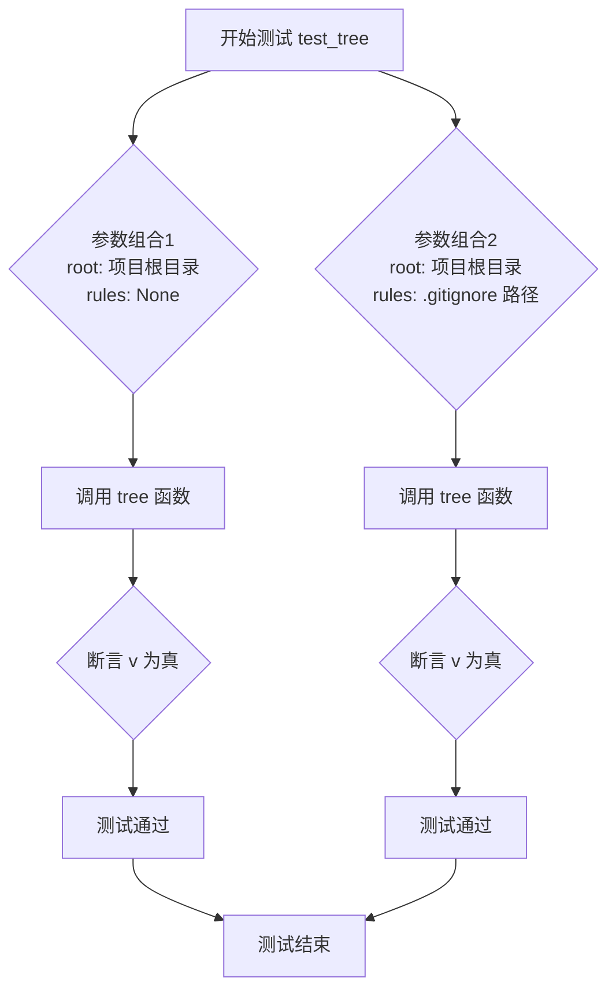
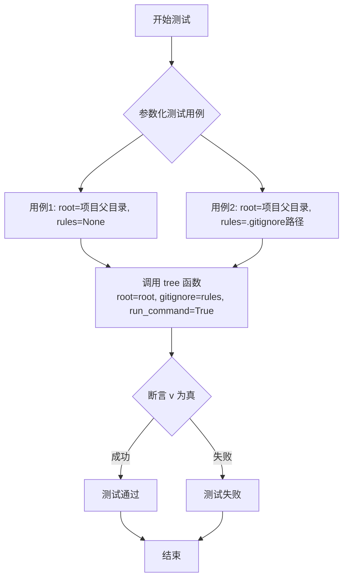

# `.\MetaGPT\tests\metagpt\utils\test_tree.py` 详细设计文档

该文件是一个测试模块，用于验证 `metagpt.utils.tree` 模块中的 `tree` 和 `_print_tree` 函数。它包含三个测试函数，分别测试 `tree` 函数在正常模式和命令行模式下的行为，以及 `_print_tree` 函数将嵌套字典转换为树状字符串列表的正确性。

## 整体流程

```mermaid
graph TD
    A[开始执行测试] --> B{执行哪个测试?}
    B -- test_tree --> C[调用 tree 函数]
    C --> D[断言返回结果非空]
    B -- test_tree_command --> E[调用 tree 函数 (run_command=True)]
    E --> F[断言返回结果非空]
    B -- test__print_tree --> G[调用 _print_tree 函数]
    G --> H[断言输出与预期列表一致]
    D --> I[测试通过]
    F --> I
    H --> I
    I --> J[结束]
```

## 类结构

```
pytest 测试模块
├── test_tree (测试 tree 函数)
├── test_tree_command (测试 tree 函数命令行模式)
└── test__print_tree (测试 _print_tree 函数)
```

## 全局变量及字段


    

## 全局函数及方法

### `test_tree`

该函数是一个使用 `pytest` 框架编写的参数化测试用例，用于测试 `tree` 函数。它通过提供不同的根目录路径和 `.gitignore` 规则文件路径作为参数，验证 `tree` 函数在这些配置下是否能成功运行并返回非空结果。

参数：
- `root`：`str`，表示要生成目录树的根目录路径。
- `rules`：`str` 或 `None`，表示 `.gitignore` 规则文件的路径。如果为 `None`，则不应用任何忽略规则。

返回值：`None`，该函数是测试函数，不直接返回值，但通过 `assert` 语句验证测试结果。

#### 流程图



#### 带注释源码

```python
# 使用 pytest.mark.parametrize 装饰器定义多组测试参数
# 第一组参数：root 为项目根目录，rules 为 None（不应用 gitignore 规则）
# 第二组参数：root 为项目根目录，rules 为项目根目录的 .gitignore 文件路径
@pytest.mark.parametrize(
    ("root", "rules"),
    [
        (str(Path(__file__).parent / "../.."), None),
        (str(Path(__file__).parent / "../.."), str(Path(__file__).parent / "../../../.gitignore")),
    ],
)
def test_tree(root: str, rules: str):
    # 调用被测试的 tree 函数，传入根目录和 gitignore 规则
    v = tree(root=root, gitignore=rules)
    # 断言：验证 tree 函数的返回值 v 为真（非空或非零）
    # 这确保了函数在给定参数下能成功执行并产生输出
    assert v
```

### `test_tree_command`

这是一个使用 `pytest` 框架编写的参数化测试函数，用于测试 `tree` 函数在 `run_command=True` 模式下的行为。它通过提供不同的根目录路径和 `.gitignore` 规则文件路径作为参数，验证 `tree` 函数能否成功执行并返回非空结果。

参数：
- `root`：`str`，要生成目录树的根目录路径。
- `rules`：`str`，可选的 `.gitignore` 规则文件路径，用于过滤目录树中的文件和目录。

返回值：`None`，这是一个测试函数，不直接返回值，而是通过 `assert` 语句验证测试结果。

#### 流程图



#### 带注释源码

```python
# 使用 pytest.mark.parametrize 装饰器定义多组测试数据
# 每组数据包含两个参数：root 和 rules
@pytest.mark.parametrize(
    ("root", "rules"),
    [
        # 测试用例1：root 指向当前文件父目录的父目录（即项目根目录），rules 为 None（不使用gitignore）
        (str(Path(__file__).parent / "../.."), None),
        # 测试用例2：root 同上，rules 指向项目根目录的 .gitignore 文件
        (str(Path(__file__).parent / "../.."), str(Path(__file__).parent / "../../../.gitignore")),
    ],
)
def test_tree_command(root: str, rules: str):
    # 调用被测试的 tree 函数，传入 root、gitignore 规则，并设置 run_command=True
    # 此模式下，tree 函数应执行一个系统命令来生成目录树
    v = tree(root=root, gitignore=rules, run_command=True)
    # 断言：验证 tree 函数的返回值 v 为真（非空或非零）
    # 这确保了函数在给定参数下能成功运行并产生输出
    assert v
```

### `test__print_tree`

该函数是一个单元测试，用于验证 `_print_tree` 函数的功能。它接收一个表示目录树的字典和一个预期的字符串列表，调用 `_print_tree` 函数生成实际的树形结构字符串列表，并断言实际结果与预期结果相等。

参数：
- `tree`：`dict`，一个表示目录树结构的嵌套字典。键是目录或文件名，值是其子项的字典。
- `want`：`List[str]`，预期的树形结构字符串列表，用于与 `_print_tree` 函数的输出进行比较。

返回值：`None`，该函数不返回任何值，仅执行断言。

#### 流程图

```mermaid
flowchart TD
    A[开始] --> B[接收参数 tree 和 want]
    B --> C[调用 _print_tree(tree) 生成结果 v]
    C --> D[断言 v == want]
    D --> E[测试通过或失败]
    E --> F[结束]
```

#### 带注释源码

```python
# 使用 pytest 的参数化装饰器，为测试函数提供多组输入数据和预期输出
@pytest.mark.parametrize(
    # 参数化数据，每组数据是一个元组，包含 tree 和 want
    ("tree", "want"),
    [
        # 测试用例 1: 简单的两层树结构
        ({"a": {"b": {}, "c": {}}}, ["a", "+-- b", "+-- c"]),
        # 测试用例 2: 三层树结构，其中一个节点有子节点
        ({"a": {"b": {}, "c": {"d": {}}}}, ["a", "+-- b", "+-- c", "    +-- d"]),
        # 测试用例 3: 更复杂的多层树结构，包含分支和嵌套
        (
            {"a": {"b": {"e": {"f": {}, "g": {}}}, "c": {"d": {}}}},
            ["a", "+-- b", "|   +-- e", "|       +-- f", "|       +-- g", "+-- c", "    +-- d"],
        ),
        # 测试用例 4: 包含多个根节点和深层嵌套的复杂树结构
        (
            {"h": {"a": {"b": {"e": {"f": {}, "g": {}}}, "c": {"d": {}}}, "i": {}}},
            [
                "h",
                "+-- a",
                "|   +-- b",
                "|   |   +-- e",
                "|   |       +-- f",
                "|   |       +-- g",
                "|   +-- c",
                "|       +-- d",
                "+-- i",
            ],
        ),
    ],
)
def test__print_tree(tree: dict, want: List[str]):
    # 调用被测试函数 _print_tree，传入树结构字典
    v = _print_tree(tree)
    # 使用断言验证函数输出 v 是否与预期结果 want 完全一致
    assert v == want
```

## 关键组件


### 树形结构生成与打印

提供生成和可视化目录树形结构的功能，支持基于 `.gitignore` 规则过滤文件。

### 命令行集成

支持通过调用系统命令（如 `tree`）来生成目录树，作为纯Python实现的备选方案。

### 单元测试框架

使用 `pytest` 参数化测试来验证核心函数在不同输入（如不同根目录、是否使用 `.gitignore`）下的行为正确性。


## 问题及建议


### 已知问题

-   **测试用例对特定目录结构的强依赖**：`test_tree` 和 `test_tree_command` 测试用例的参数化依赖于 `Path(__file__).parent / "../.."` 这一相对路径。这意味着测试的成功运行依赖于从特定位置（即测试文件所在目录）执行。如果从项目根目录或其他位置运行测试，路径解析可能出错，导致测试失败或测试了错误的目录。
-   **`run_command` 参数的测试覆盖不足**：`test_tree_command` 函数测试了 `tree` 函数在 `run_command=True` 时的行为，但断言仅检查返回值 `v` 是否为真（`assert v`）。这无法验证命令执行是否成功、输出格式是否正确，或者是否与 `run_command=False` 时的行为有本质区别。测试过于宽松，可能掩盖潜在问题。
-   **硬编码的 `.gitignore` 路径**：测试中使用的 `.gitignore` 文件路径是硬编码的（`str(Path(__file__).parent / "../../../.gitignore")`）。这假设项目根目录的 `.gitignore` 文件存在于测试文件上方三层目录。这种硬编码使得测试脆弱，如果项目结构发生变化或测试文件位置移动，路径可能失效。
-   **缺少对 `tree` 和 `_print_tree` 函数异常路径的测试**：当前测试用例主要覆盖了正常路径（happy path）。没有测试用例针对 `tree` 函数处理不存在的根目录、无效的 `gitignore` 文件路径，或 `_print_tree` 函数处理非预期输入（如空字典、非字典结构）时的行为。这降低了代码的健壮性保证。

### 优化建议

-   **使用环境变量或固定测试数据**：建议重构测试，使其不依赖于执行时的工作目录。可以考虑使用 `pytest` 的 `fixture` 来提供固定的、独立的测试目录结构，或者使用 `tempfile.TemporaryDirectory` 在测试运行时动态创建和清理测试目录。对于 `.gitignore` 规则，可以在测试代码内嵌一个示例规则字符串，而不是依赖外部文件。
-   **增强 `run_command=True` 的测试断言**：`test_tree_command` 的断言应更具体。例如，可以验证返回的字符串包含预期的目录/文件列表，或者与 `run_command=False` 时返回的数据结构（在转换为字符串后）在内容上等价（忽略格式差异）。这能确保命令执行模式的功能正确性。
-   **提取路径常量并增加灵活性**：将硬编码的根目录和 `.gitignore` 文件路径提取为模块级常量或通过 `pytest` 配置读取。更好的方法是，让测试自包含，不依赖项目特定布局。对于必须测试外部 `.gitignore` 的场景，可以使用一个临时创建的 `.gitignore` 文件。
-   **补充负面测试用例和边界条件测试**：应增加测试用例以覆盖错误和边界情况。例如：
    -   为 `tree` 函数添加测试：传入不存在的 `root` 路径，预期应抛出异常或返回特定错误指示；传入格式错误的 `gitignore` 文件路径。
    -   为 `_print_tree` 函数添加测试：传入空字典 `{}`，预期应返回空列表或特定表示；传入非字典嵌套的其他可迭代对象，确保函数能正确处理或抛出清晰异常。
-   **考虑测试用例的独立性和可读性**：`test__print_tree` 函数使用参数化提供了多个测试场景，这很好。可以确保每个测试用例的 `tree` 输入和 `want` 输出在逻辑上紧密对应，并且用例名称（通过 `pytest.param` 的 `id` 参数）能清晰描述测试场景，例如 `"single_node"`, `"nested_structure"` 等，以提高测试报告的可读性。


## 其它


### 设计目标与约束

本代码模块的核心设计目标是提供一个轻量级的、可测试的目录树生成与可视化工具。其主要约束包括：1) 必须兼容标准的文件系统路径表示；2) 支持通过 `.gitignore` 规则过滤文件/目录；3) 提供两种输出模式：纯Python数据结构生成和通过系统命令 `tree` 生成；4) 内部包含一个将嵌套字典结构格式化为可读字符串列表的功能。所有功能必须通过单元测试验证其正确性。

### 错误处理与异常设计

当前代码在错误处理方面较为简单，主要依赖 `pytest` 框架的断言机制。`tree` 函数在遇到无效路径或无法读取的 `.gitignore` 文件时，其行为依赖于底层 `pathlib` 和 `tree` 命令（如果启用）的默认异常抛出。`_print_tree` 函数假设输入的字典结构正确，未对无效结构（如非字典值、循环引用）做防御性检查。这是一个潜在的风险点，建议增加参数验证和更明确的异常类型（如 `ValueError`, `FileNotFoundError`）来提升健壮性。

### 数据流与状态机

1.  **测试数据流**：测试用例通过 `@pytest.mark.parametrize` 提供参数化输入（`root`, `rules`, `tree` 字典）。这些输入流入对应的测试函数（`test_tree`, `test_tree_command`, `test__print_tree`）。
2.  **函数内部数据流**：
    *   `tree` 函数：输入 `root` (路径字符串) 和 `rules` (.gitignore文件路径) -> 内部调用 `pathlib` 和可能的系统命令 -> 输出目录树结构（列表或命令输出字符串）。
    *   `_print_tree` 函数：输入一个嵌套字典 `tree` -> 递归遍历字典 -> 生成并返回一个代表树形结构的字符串列表。
3.  本模块无复杂的运行时状态机，执行流程是线性的、无状态的。

### 外部依赖与接口契约

1.  **显式依赖**：
    *   `pathlib.Path`：用于跨平台的文件路径操作。
    *   `pytest`：用于编写和运行单元测试。
    *   `metagpt.utils.tree` 模块中的 `tree` 和 `_print_tree` 函数：这是被测试的核心功能。
    *   系统命令 `tree`：当 `tree` 函数的 `run_command` 参数为 `True` 时被调用。
2.  **接口契约**：
    *   `test_tree` / `test_tree_command`：契约是对于给定的有效 `root` 路径（和可选的 `.gitignore` 文件），`tree` 函数应返回非空结果（`assert v`）。
    *   `test__print_tree`：契约是对于给定的、符合特定嵌套字典结构（模拟目录树）的输入，`_print_tree` 函数的输出必须与预期的字符串列表 `want` 完全匹配。
    *   与系统 `tree` 命令的契约：假设该命令已安装且在系统PATH中，并且其输出格式与预期兼容。

### 测试策略与覆盖

本模块完全由单元测试构成，采用了参数化测试来覆盖多种场景：
1.  **功能测试** (`test_tree`)：验证核心的 `tree` 函数在纯Python模式和不同规则（有无.gitignore）下能正常运行并返回结果。
2.  **集成测试** (`test_tree_command`)：验证 `tree` 函数在调用外部系统命令模式下的集成能力。
3.  **单元测试** (`test__print_tree`)：针对内部工具函数 `_print_tree`，通过多组精心设计的输入输出对，验证其树形结构格式化逻辑的正确性，包括不同深度和分支情况的渲染。
测试覆盖了正常路径的主要用例，但未包含负面测试用例（如无效路径、格式错误的.gitignore、`tree`命令不存在等）。

### 安全与合规考量

1.  **路径遍历**：代码使用 `Path(__file__).parent` 构造相对路径，这相对安全，避免了硬编码绝对路径。但 `tree` 函数本身接受任意字符串作为 `root`，在生产环境中调用时需对输入进行校验，防止目录遍历攻击。
2.  **命令注入**：当 `run_command=True` 时，`tree` 函数会构造并执行系统命令。虽然 `root` 和 `rules` 参数通过 `subprocess` 调用（假设实现），但仍需确保参数被正确转义，防止命令注入漏洞。当前测试未展示这部分实现细节。
3.  **敏感信息泄露**：生成的目录树可能包含临时文件、配置文件、日志等敏感信息。通过 `.gitignore` 进行过滤是一个有效的缓解措施，但需确保 `.gitignore` 规则本身是正确和安全的。

    