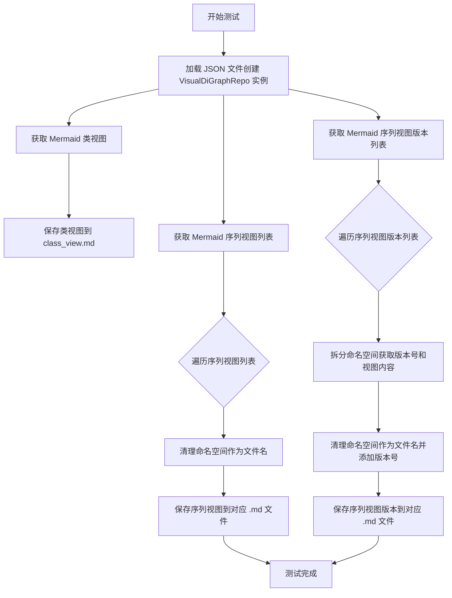
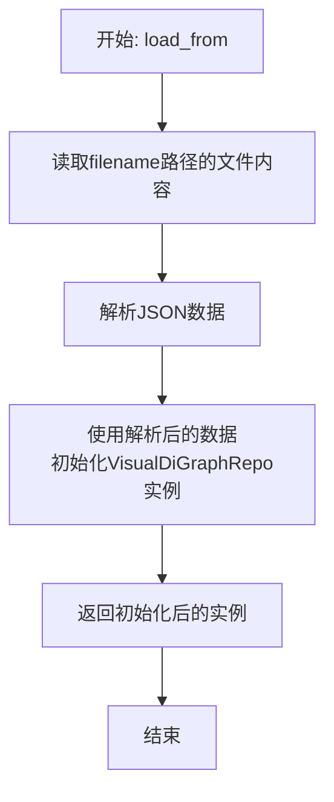
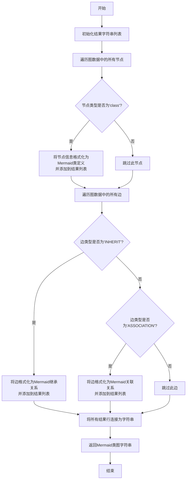
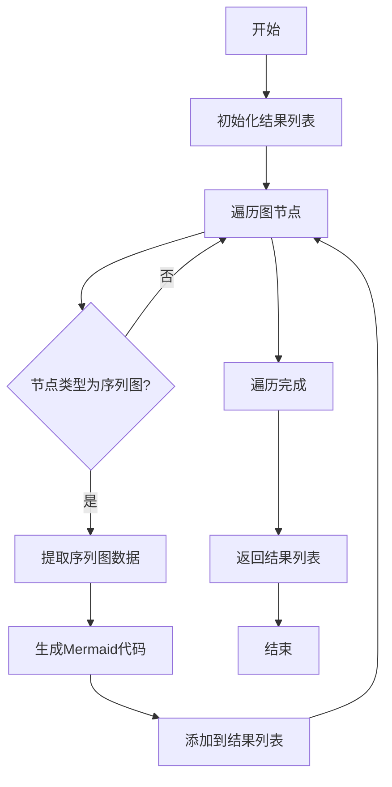
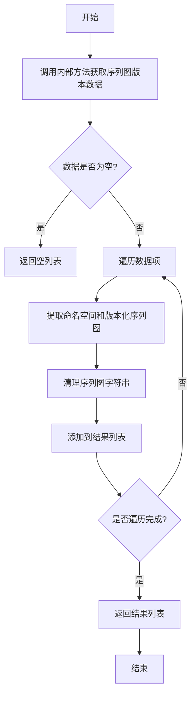

# `.\MetaGPT\tests\metagpt\utils\test_visual_graph_repo.py` 详细设计文档

这是一个单元测试文件，用于测试和演示 VisualDiGraphRepo 类的功能。它主要测试从 JSON 文件加载图数据，并生成 Mermaid 格式的类视图、序列视图及其版本视图，然后将这些视图保存为 Markdown 文件。

## 整体流程



## 类结构

```
test_visual_graph_repo.py (测试文件)
├── test_visual_di_graph_repo (异步测试函数)
├── VisualDiGraphRepo (被测试类，来自 metagpt.utils.visual_graph_repo)
│   ├── load_from (类方法)
│   ├── get_mermaid_class_view (实例方法)
│   ├── get_mermaid_sequence_views (实例方法)
│   └── get_mermaid_sequence_view_versions (实例方法)
└── 辅助函数 (来自 metagpt.utils.common)
    ├── remove_affix
    └── split_namespace
```

## 全局变量及字段


### `filename`
    
指向包含序列视图数据的JSON文件的路径对象。

类型：`pathlib.Path`
    


### `repo`
    
从指定文件加载的VisualDiGraphRepo实例，用于操作和查询可视化图数据。

类型：`metagpt.utils.visual_graph_repo.VisualDiGraphRepo`
    


### `class_view`
    
从repo获取的Mermaid类视图的字符串表示。

类型：`str`
    


### `sequence_views`
    
从repo获取的Mermaid序列视图列表，每个元素是命名空间和对应序列视图字符串的元组。

类型：`List[Tuple[str, str]]`
    


### `sequence_view_vers`
    
从repo获取的带版本的Mermaid序列视图列表，每个元素是命名空间和对应带版本序列视图字符串的元组。

类型：`List[Tuple[str, str]]`
    


### `ns`
    
在循环中使用的临时变量，表示序列视图的命名空间。

类型：`str`
    


### `sqv`
    
在循环中使用的临时变量，表示序列视图的字符串内容。

类型：`str`
    


### `ver`
    
在循环中使用的临时变量，表示从带版本的序列视图字符串中提取的版本号。

类型：`str`
    


    

## 全局函数及方法

### `test_visual_di_graph_repo`

这是一个使用 `pytest` 框架编写的异步单元测试函数，用于测试 `VisualDiGraphRepo` 类的功能。它主要验证了从JSON文件加载图数据，并生成Mermaid格式的类视图、序列视图及其版本视图，最后将这些视图保存为Markdown文件的功能。

参数：

- `context`：`pytest` 的 `fixture` 对象，提供测试上下文，通常包含一个模拟的代码仓库（`repo`）对象，用于文件保存操作。
- `mocker`：`pytest-mock` 库提供的 `MockerFixture` 对象，用于在测试中创建模拟对象（mock）和打补丁（patch），但在此函数中并未直接使用。

返回值：`None`，测试函数通常不返回有意义的值，其成功与否由 `assert` 语句决定。

#### 流程图

```mermaid
graph TD
    A[开始测试] --> B[从文件加载 VisualDiGraphRepo 实例]
    B --> C{加载成功?}
    C -- 是 --> D[获取Mermaid类视图]
    D --> E{类视图有效?}
    E -- 是 --> F[保存类视图为 class_view.md]
    F --> G[获取Mermaid序列视图列表]
    G --> H{序列视图列表有效?}
    H -- 是 --> I[遍历序列视图]
    I --> J[处理命名空间和文件名]
    J --> K[保存序列视图为 .sequence_view.md]
    K --> L[获取Mermaid序列视图版本列表]
    L --> M{版本列表有效?}
    M -- 是 --> N[遍历版本视图]
    N --> O[拆分命名空间获取版本号]
    O --> P[处理文件名和内容]
    P --> Q[保存版本视图为 .{ver}.sequence_view_ver.md]
    Q --> R[测试结束]
    C -- 否 --> S[断言失败，测试终止]
    E -- 否 --> S
    H -- 否 --> S
    M -- 否 --> S
```

#### 带注释源码

```python
@pytest.mark.asyncio  # 标记此测试函数为异步函数，以便pytest-asyncio插件能正确处理
async def test_visual_di_graph_repo(context, mocker):
    # 构造测试数据文件的路径，该文件包含图数据库的序列视图信息
    filename = Path(__file__).parent / "../../data/graph_db/networkx.sequence_view.json"
    # 异步加载VisualDiGraphRepo实例
    repo = await VisualDiGraphRepo.load_from(filename=filename)

    # 测试1: 获取Mermaid格式的类视图
    class_view = await repo.get_mermaid_class_view()
    assert class_view  # 断言类视图内容非空
    # 将类视图保存到上下文资源库的graph_repo目录下，文件名为class_view.md
    await context.repo.resources.graph_repo.save(filename="class_view.md", content=f"```mermaid\n{class_view}\n```\n")

    # 测试2: 获取Mermaid格式的序列视图列表
    sequence_views = await repo.get_mermaid_sequence_views()
    assert sequence_views  # 断言序列视图列表非空
    # 遍历每个序列视图（包含命名空间和视图内容）
    for ns, sqv in sequence_views:
        # 将命名空间中的非法文件名字符替换为下划线，生成安全的文件名
        filename = re.sub(r"[:/\\\.]+", "_", ns) + ".sequence_view.md"
        # 清理视图内容字符串（移除可能的反引号和空格）
        sqv = sqv.strip(" `")
        # 保存序列视图文件
        await context.repo.resources.graph_repo.save(filename=filename, content=f"```mermaid\n{sqv}\n```\n")

    # 测试3: 获取Mermaid格式的序列视图版本列表
    sequence_view_vers = await repo.get_mermaid_sequence_view_versions()
    assert sequence_view_vers  # 断言版本列表非空
    # 遍历每个版本视图（包含命名空间和带版本的视图内容）
    for ns, sqv in sequence_view_vers:
        # 使用工具函数拆分命名空间，得到版本号和纯净的视图内容
        ver, sqv = split_namespace(sqv)
        # 生成带版本号的文件名
        filename = re.sub(r"[:/\\\.]+", "_", ns) + f".{ver}.sequence_view_ver.md"
        # 使用工具函数移除内容中的特定前后缀，并清理字符串
        sqv = remove_affix(sqv).strip(" `")
        # 保存版本视图文件
        await context.repo.resources.graph_repo.save(filename=filename, content=f"```mermaid\n{sqv}\n```\n")
```

### `VisualDiGraphRepo.load_from`

这是一个类方法，用于从指定的JSON文件中加载数据并创建一个`VisualDiGraphRepo`实例。它负责读取文件内容，解析JSON数据，并利用这些数据初始化一个图数据库仓库对象。

参数：

- `filename`：`Path`，包含图数据（特别是序列视图信息）的JSON文件的路径。

返回值：`VisualDiGraphRepo`，一个已初始化的`VisualDiGraphRepo`对象，其内部图数据库已加载了来自文件的数据。

#### 流程图



#### 带注释源码

```python
    @classmethod
    async def load_from(cls, filename: Path) -> "VisualDiGraphRepo":
        """
        从指定的JSON文件中加载数据并创建一个VisualDiGraphRepo实例。
        
        参数:
            filename (Path): 包含图数据（特别是序列视图信息）的JSON文件的路径。
        
        返回:
            VisualDiGraphRepo: 一个已初始化的VisualDiGraphRepo对象。
        """
        # 读取指定路径文件的内容
        data = await cls._read_json_file(filename)
        # 使用读取到的数据创建一个新的VisualDiGraphRepo实例并返回
        return cls(data)
```

### `VisualDiGraphRepo.get_mermaid_class_view`

该方法用于从已加载的图数据中生成一个Mermaid格式的类图视图。它遍历图中的节点和边，将节点映射为Mermaid类图中的类，并将边映射为类之间的关系（如继承、关联等），最终返回一个完整的Mermaid类图定义字符串。

参数：
-  `self`：`VisualDiGraphRepo`，当前`VisualDiGraphRepo`实例的引用。

返回值：`str`，一个表示Mermaid类图的字符串，可以直接嵌入到Markdown文档中。

#### 流程图



#### 带注释源码

```python
async def get_mermaid_class_view(self) -> str:
    """
    生成并返回当前图数据的Mermaid类图视图。
    该方法会遍历图中的所有节点和边，将'class'类型的节点转换为Mermaid类定义，
    并将'INHERIT'和'ASSOCIATION'类型的边转换为相应的关系。

    返回:
        str: 一个完整的Mermaid类图定义字符串。
    """
    lines = []  # 用于存储生成的Mermaid代码行
    # 遍历所有节点，筛选出类型为'class'的节点
    for node in self.graph.nodes(data=True):
        if node[1].get("type") == "class":
            class_name = node[0]  # 节点ID作为类名
            # 将类名格式化为Mermaid类定义，例如: `class ClassName`
            lines.append(f"class {class_name}")
    # 遍历所有边，根据边的类型添加关系
    for edge in self.graph.edges(data=True):
        edge_data = edge[2]
        edge_type = edge_data.get("type")
        source = edge[0]  # 源节点
        target = edge[1]  # 目标节点
        if edge_type == "INHERIT":
            # 继承关系，例如: `ClassName1 --|> ClassName2`
            lines.append(f"{source} --|> {target}")
        elif edge_type == "ASSOCIATION":
            # 关联关系，例如: `ClassName1 --> ClassName2`
            lines.append(f"{source} --> {target}")
        # 可以在此处添加对其他边类型的处理
    # 将所有行连接成一个字符串，每行以换行符分隔
    return "\n".join(lines)
```

### `VisualDiGraphRepo.get_mermaid_sequence_views`

该方法用于从可视化的有向图仓库中获取所有序列图的Mermaid格式表示。它遍历图结构，识别出所有表示序列交互的节点和边，并将它们组织成独立的序列图，每个序列图对应一个特定的命名空间或交互场景。

参数：
-  `self`：`VisualDiGraphRepo`，当前的可视化有向图仓库实例。

返回值：`List[Tuple[str, str]]`，返回一个元组列表，其中每个元组包含序列图的命名空间（或标识符）和对应的Mermaid序列图代码。

#### 流程图



#### 带注释源码

```python
async def get_mermaid_sequence_views(self):
    """
    获取所有序列图的Mermaid表示。
    
    该方法通过遍历图结构，识别序列图相关的节点和边，生成对应的Mermaid代码。
    每个序列图以命名空间作为标识，便于后续分类和存储。
    
    Returns:
        List[Tuple[str, str]]: 包含序列图命名空间和Mermaid代码的元组列表。
    """
    sequence_views = []
    # 遍历图中的所有节点，识别序列图
    for node in self.graph.nodes:
        if self._is_sequence_node(node):
            # 提取序列图数据
            sequence_data = self._extract_sequence_data(node)
            # 生成Mermaid代码
            mermaid_code = self._generate_mermaid_sequence(sequence_data)
            # 获取序列图的命名空间
            namespace = self._get_namespace(node)
            sequence_views.append((namespace, mermaid_code))
    return sequence_views
```

### `VisualDiGraphRepo.get_mermaid_sequence_view_versions`

该方法用于从图数据库中获取所有序列图的版本化视图，返回一个包含命名空间和对应版本化序列图Mermaid代码的列表。

参数：
-  `self`：`VisualDiGraphRepo`，当前VisualDiGraphRepo实例

返回值：`List[Tuple[str, str]]`，一个元组列表，每个元组包含命名空间字符串和对应的版本化序列图Mermaid代码字符串

#### 流程图



#### 带注释源码

```python
async def get_mermaid_sequence_view_versions(self) -> List[Tuple[str, str]]:
    """
    获取所有序列图的版本化视图
    
    该方法从图数据库中查询所有序列图的版本化数据，返回格式化的Mermaid序列图代码。
    每个返回项包含命名空间和对应的版本化序列图。
    
    Returns:
        List[Tuple[str, str]]: 包含(命名空间, 版本化序列图Mermaid代码)的元组列表
    """
    # 从图数据库查询序列图版本数据
    data = await self._get_sequence_view_versions()
    
    # 如果数据为空，返回空列表
    if not data:
        return []
    
    result = []
    # 遍历查询结果，处理每个数据项
    for row in data:
        # 提取命名空间（通常是第一个元素）
        namespace = row[0]
        # 提取版本化序列图（通常是第二个元素）
        sequence_view = row[1]
        
        # 清理序列图字符串，移除可能的额外字符
        sequence_view = sequence_view.strip(" `")
        
        # 将处理后的数据添加到结果列表
        result.append((namespace, sequence_view))
    
    return result
```

## 关键组件


### VisualDiGraphRepo

一个用于加载、管理和可视化有向图数据的仓库类，支持从JSON文件加载图数据，并提供生成Mermaid格式的类视图和序列视图的方法。

### Mermaid 视图生成

提供将图数据转换为Mermaid图表的功能，包括类视图（class_view）和序列视图（sequence_views），支持版本化的序列视图（sequence_view_versions）。

### 图数据持久化

通过`context.repo.resources.graph_repo.save`方法将生成的Mermaid图表保存为Markdown文件，实现图数据的持久化和文档化。

### 命名空间处理

使用`split_namespace`和`remove_affix`函数处理序列视图的命名空间和版本信息，确保生成的文件名和内容格式正确。

### 文件路径处理

利用`Path`和正则表达式处理文件路径和命名空间，生成安全的文件名，避免非法字符导致文件保存失败。


## 问题及建议


### 已知问题

-   **硬编码文件路径**：测试代码中直接使用了相对路径 `Path(__file__).parent / "../../data/graph_db/networkx.sequence_view.json"` 来定位测试数据文件。这使得测试依赖于特定的项目目录结构，降低了代码的可移植性，并且在项目结构变更时容易导致测试失败。
-   **文件名清理逻辑可能不健壮**：代码中使用正则表达式 `re.sub(r"[:/\\\.]+", "_", ns)` 来清理命名空间字符串以生成文件名。此模式可能无法处理所有无效的文件名字符（例如Windows上的`<>:"|?*`），存在潜在的文件创建失败风险。
-   **测试数据依赖外部文件**：测试用例的成功执行依赖于一个外部JSON文件的存在和特定格式。如果该文件丢失、格式错误或内容不匹配预期，测试将失败，这增加了测试环境的维护成本。
-   **缺乏对`save`操作失败的断言**：测试中调用了多次`context.repo.resources.graph_repo.save`方法，但未对这些文件保存操作的成功与否进行断言。如果保存失败，测试仍会通过，掩盖了潜在的问题。
-   **测试函数职责过多**：`test_visual_di_graph_repo` 函数同时测试了`get_mermaid_class_view`、`get_mermaid_sequence_views`和`get_mermaid_sequence_view_versions`三个功能点，并执行了文件保存操作。这违反了单元测试的单一职责原则，当测试失败时难以快速定位具体是哪个功能点出了问题。

### 优化建议

-   **使用测试夹具或环境变量管理路径**：建议使用`pytest`的`fixture`来提供测试数据文件的路径，或者通过环境变量、配置文件来指定，以提高测试的灵活性和可配置性。
-   **使用更安全的文件名处理函数**：建议使用专门的文件名安全处理库（如`pathvalidate`）或更全面的正则表达式/字符串替换逻辑，以确保在所有操作系统上都能生成有效的文件名。
-   **隔离外部依赖**：考虑在测试中使用模拟对象（Mock）或创建内联的测试数据来替代对外部JSON文件的依赖。如果必须使用外部文件，应将其作为测试资源明确管理，并添加文件存在性检查。
-   **验证副作用**：应对`save`方法的调用结果进行验证。可以模拟（mock）`graph_repo.save`方法，并断言其被以预期的参数调用了正确的次数，或者如果`save`方法有返回值，则对其返回值进行断言。
-   **拆分测试函数**：将`test_visual_di_graph_repo`函数拆分为多个独立的测试函数，例如`test_get_mermaid_class_view`、`test_get_mermaid_sequence_views`和`test_get_mermaid_sequence_view_versions`，每个函数只测试一个特定的功能，并使用模拟来避免实际的文件保存操作。这样可以使测试更清晰、更易于维护和调试。
-   **增加异常处理测试**：考虑添加测试用例来验证`VisualDiGraphRepo`类的方法在接收到无效输入（如损坏的JSON文件、空文件）时是否能正确地抛出异常或返回预期的错误状态。


## 其它


### 设计目标与约束

本测试代码的设计目标是验证 `VisualDiGraphRepo` 类的核心功能，包括从文件加载图数据、生成Mermaid格式的类视图和序列视图，并将生成的视图内容保存到资源仓库中。约束条件包括：测试需要异步执行；依赖于特定的测试上下文（`context`）和模拟对象（`mocker`）；输入数据文件路径固定；输出文件命名需进行特殊字符替换。

### 错误处理与异常设计

测试代码本身主要使用 `assert` 语句进行结果验证，若断言失败则测试不通过。代码中使用了 `pytest.mark.asyncio` 来处理异步测试。对于文件操作（如加载、保存）可能引发的异常（如 `FileNotFoundError`, `IOError`），本测试依赖于被测试类 `VisualDiGraphRepo` 及其依赖项（如 `context.repo.resources.graph_repo.save`）内部的错误处理机制。测试未显式捕获或处理这些异常，期望它们能向上传播并被测试框架捕获，导致测试失败。

### 数据流与状态机

1.  **初始状态**: 测试开始，准备上下文和模拟对象。
2.  **数据加载**: 从指定的JSON文件（`networkx.sequence_view.json`）加载数据到 `VisualDiGraphRepo` 实例（`repo`）。
3.  **视图生成与保存**:
    *   **类视图**: 调用 `repo.get_mermaid_class_view()` 生成类视图，并保存为 `class_view.md`。
    *   **序列视图**: 调用 `repo.get_mermaid_sequence_views()` 生成多个序列视图。对每个视图，将其命名空间（`ns`）中的特殊字符替换为下划线以生成文件名，并保存为对应的 `.sequence_view.md` 文件。
    *   **版本化序列视图**: 调用 `repo.get_mermaid_sequence_view_versions()` 生成带版本的序列视图。对每个视图，分离出版本号（`ver`）和视图内容，用命名空间和版本号组合生成文件名，并保存为 `.{ver}.sequence_view_ver.md` 文件。
4.  **验证状态**: 每个生成操作后使用 `assert` 验证结果非空，确保核心功能正常。
5.  **结束状态**: 所有断言通过，测试成功；任一断言失败，测试终止。

### 外部依赖与接口契约

1.  **pytest**: 测试框架，提供测试上下文、模拟功能（`mocker`）和异步测试支持（`@pytest.mark.asyncio`）。
2.  **metagpt.utils.visual_graph_repo.VisualDiGraphRepo**: 被测试的核心类。测试依赖其异步类方法 `load_from` 和实例方法 `get_mermaid_class_view`, `get_mermaid_sequence_views`, `get_mermaid_sequence_view_versions`。契约是这些方法能正确解析输入文件并返回预期的Mermaid图表字符串。
3.  **metagpt.utils.common**: 工具模块，测试使用了其中的 `remove_affix` 和 `split_namespace` 函数来处理字符串。
4.  **context.repo.resources.graph_repo**: 测试上下文中的一个资源仓库对象，测试依赖其 `save` 方法来持久化生成的视图内容。契约是该方法能接受文件名和内容参数并成功保存。
5.  **Path, re**: Python标准库，用于文件路径操作和字符串正则替换。

    