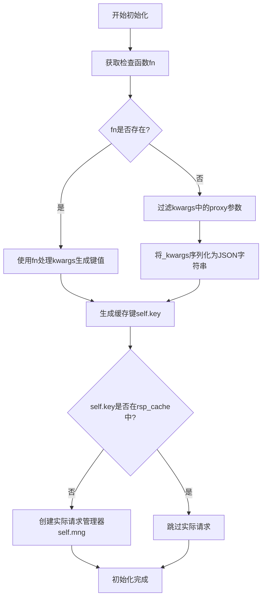
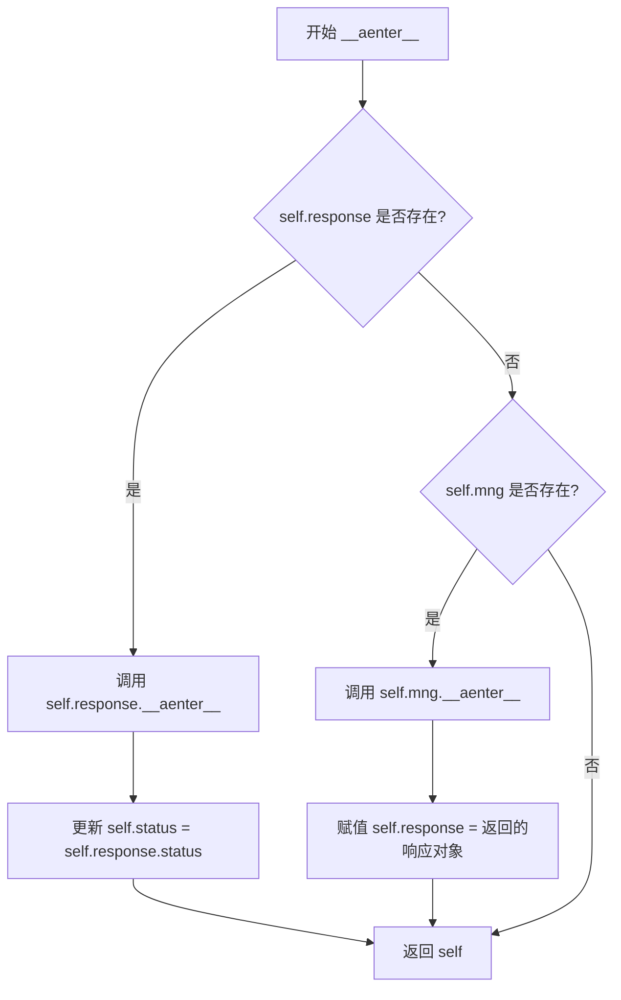
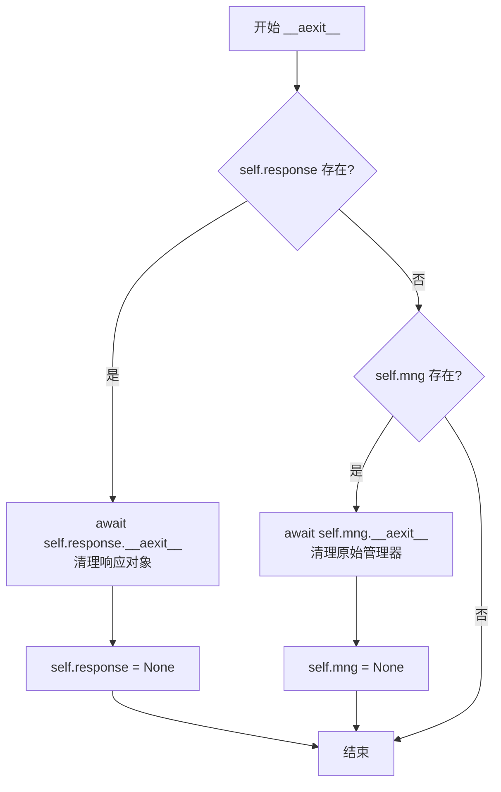
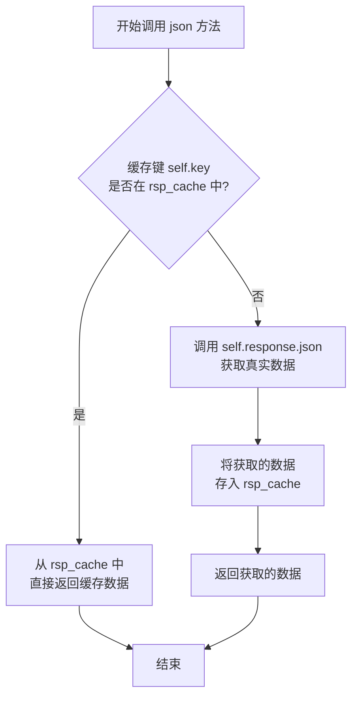
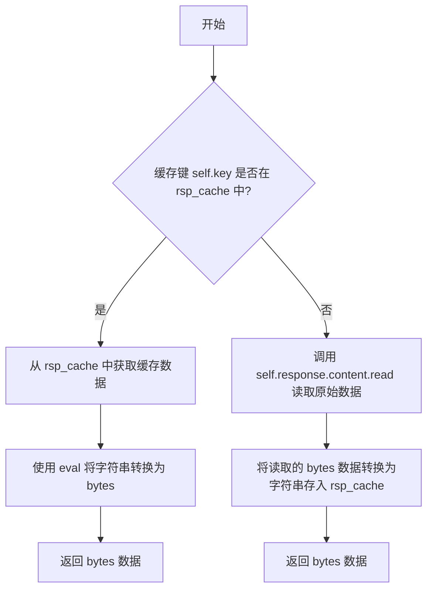
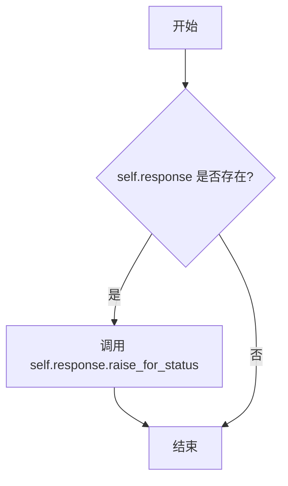

# `.\MetaGPT\tests\mock\mock_aiohttp.py` 详细设计文档

该代码实现了一个用于 aiohttp 库的请求模拟器（Mock），核心功能是通过拦截和缓存 HTTP 请求响应，在测试或开发环境中提供可预测的、可重复的网络行为，避免对真实外部服务的依赖。它通过替换 `ClientSession.request` 方法，根据请求的方法、URL 和参数生成唯一缓存键，首次请求时访问真实服务并缓存结果，后续相同请求则直接返回缓存数据。

## 整体流程

```mermaid
graph TD
    A[调用被Mock的ClientSession.request] --> B{请求参数生成缓存Key}
    B --> C{Key是否存在于缓存中?}
    C -- 是 --> D[从缓存中构造Mock响应]
    C -- 否 --> E[发起真实网络请求]
    E --> F[将真实响应数据存入缓存]
    D --> G[返回MockAioResponse对象]
    F --> G
    G --> H[用户通过MockAioResponse对象读取数据]
    H --> I{读取json()方法?}
    I -- 是 --> J[从缓存返回JSON数据]
    I -- 否 --> K{读取read()方法?}
    K -- 是 --> L[从缓存返回bytes数据]
    K -- 否 --> M[调用真实响应对应方法]
```

## 类结构

```
MockAioResponse (模拟响应类)
├── 类字段: check_funcs, rsp_cache, name, status
├── 实例方法: __init__, __aenter__, __aexit__, json, read, raise_for_status
└── 属性: content
```

## 全局变量及字段


### `origin_request`
    
保存原始的 aiohttp.ClientSession.request 方法引用，用于在需要时发起真实的 HTTP 请求。

类型：`Callable`
    


### `MockAioResponse.check_funcs`
    
一个字典，键为 (HTTP方法, URL) 元组，值为一个可调用对象，用于根据请求参数生成缓存键的一部分，实现自定义的请求匹配逻辑。

类型：`dict[tuple[str, str], Callable[[dict], str]]`
    


### `MockAioResponse.rsp_cache`
    
一个字典，用于缓存 HTTP 响应数据，键为根据请求特征生成的唯一标识符，值为序列化后的响应体字符串，以减少重复的网络请求。

类型：`dict[str, str]`
    


### `MockAioResponse.name`
    
一个字符串标识符，用于在生成缓存键时区分不同的模拟器或上下文，默认为 'aiohttp'。

类型：`str`
    


### `MockAioResponse.status`
    
表示 HTTP 响应的状态码，默认为 200，在进入异步上下文管理器后会被更新为真实响应的状态码。

类型：`int`
    


### `MockAioResponse.key`
    
一个字符串，作为当前请求在缓存字典中的唯一键，由名称、HTTP方法、URL和请求参数（或自定义函数结果）组合生成。

类型：`str`
    


### `MockAioResponse.mng`
    
当缓存未命中时，保存由原始 request 方法返回的异步上下文管理器对象，用于后续发起真实的网络请求。

类型：`Optional[object]`
    


### `MockAioResponse.response`
    
保存从 mng 进入后得到的真实 aiohttp 客户端响应对象，或从缓存中恢复的模拟响应对象，用于读取响应内容和状态。

类型：`Optional[object]`
    
    

## 全局函数及方法

### `MockAioResponse.__init__`

该方法用于初始化一个模拟的异步HTTP响应对象。它根据请求的方法、URL和参数生成一个唯一的缓存键，并检查该键是否已存在于响应缓存中。如果不存在，则创建一个实际的异步HTTP请求管理器，以便在后续步骤中执行真实的网络请求。

参数：

- `session`：`ClientSession`，aiohttp客户端会话对象，用于发起实际的HTTP请求。
- `method`：`str`，HTTP请求方法，例如"GET"、"POST"等。
- `url`：`str`，请求的URL地址。
- `**kwargs`：`dict`，其他关键字参数，例如请求头、数据、超时等。

返回值：`None`，无返回值。

#### 流程图



#### 带注释源码

```python
def __init__(self, session, method, url, **kwargs) -> None:
    # 根据请求方法和URL获取对应的检查函数
    fn = self.check_funcs.get((method, url))
    # 过滤掉kwargs中的proxy参数，避免影响缓存键的生成
    _kwargs = {k: v for k, v in kwargs.items() if k != "proxy"}
    # 生成唯一的缓存键，用于标识该请求
    # 如果存在检查函数，则使用该函数处理kwargs生成键值；否则，将_kwargs序列化为JSON字符串
    self.key = f"{self.name}-{method}-{url}-{fn(kwargs) if fn else json.dumps(_kwargs, sort_keys=True)}"
    # 初始化请求管理器和响应对象为None
    self.mng = self.response = None
    # 如果缓存键不在响应缓存中，则创建一个实际的异步HTTP请求管理器
    if self.key not in self.rsp_cache:
        self.mng = origin_request(session, method, url, **kwargs)
```

### `MockAioResponse.__aenter__`

该方法用于异步上下文管理器的入口，负责初始化或获取实际的HTTP响应对象。如果响应已缓存，则直接使用缓存；否则，通过原始请求管理器获取响应，并更新实例状态。

参数：

-  `self`：`MockAioResponse`，当前MockAioResponse实例

返回值：`MockAioResponse`，返回当前MockAioResponse实例自身，以便在异步上下文管理器中使用。

#### 流程图



#### 带注释源码

```python
async def __aenter__(self):
    # 如果 self.response 已经存在（例如，从缓存中恢复的响应）
    if self.response:
        # 进入其异步上下文，确保其内部状态正确初始化
        await self.response.__aenter__()
        # 更新当前Mock响应的状态码为实际响应的状态码
        self.status = self.response.status
    # 如果 self.response 不存在，但 self.mng 存在（即这是一个新的、未缓存的请求）
    elif self.mng:
        # 进入原始请求管理器的异步上下文，获取实际的响应对象
        self.response = await self.mng.__aenter__()
    # 返回当前实例自身，使其可以在 `async with` 语句中使用
    return self
```


### `MockAioResponse.__aexit__`

该方法用于异步退出`MockAioResponse`对象的上下文管理器。它负责清理内部持有的响应对象或原始上下文管理器，确保资源被正确释放。如果存在缓存的响应对象，则调用其`__aexit__`方法并置空；如果存在原始的上下文管理器，则调用其`__aexit__`方法并置空。

参数：

-  `self`：`MockAioResponse`，`MockAioResponse`类的实例
-  `*args`：`tuple`，可变位置参数，用于传递给内部响应对象或原始上下文管理器的`__aexit__`方法
-  `**kwargs`：`dict`，可变关键字参数，用于传递给内部响应对象或原始上下文管理器的`__aexit__`方法

返回值：`None`，该方法不返回任何值

#### 流程图



#### 带注释源码

```
async def __aexit__(self, *args, **kwargs):
    # 如果存在缓存的响应对象（self.response），则调用其__aexit__方法进行清理
    if self.response:
        await self.response.__aexit__(*args, **kwargs)
        # 清理后将self.response置为None，防止重复使用
        self.response = None
    # 如果不存在缓存的响应对象，但存在原始的上下文管理器（self.mng）
    elif self.mng:
        # 则调用原始上下文管理器的__aexit__方法进行清理
        await self.mng.__aexit__(*args, **kwargs)
        # 清理后将self.mng置为None，防止重复使用
        self.mng = None
```


### `MockAioResponse.json`

该方法用于获取HTTP响应的JSON数据。它首先检查当前请求的缓存键是否存在于响应缓存中，如果存在则直接返回缓存的数据；否则，它会调用底层真实响应对象的`json`方法获取数据，并将结果存入缓存后返回。

参数：

-  `*args`：`tuple`，传递给底层`response.json()`方法的可变位置参数。
-  `**kwargs`：`dict`，传递给底层`response.json()`方法的可变关键字参数。

返回值：`Any`，HTTP响应体解析后的JSON数据（通常是`dict`或`list`类型）。

#### 流程图



#### 带注释源码

```python
async def json(self, *args, **kwargs):
    # 检查当前请求的缓存键是否已存在于缓存字典中
    if self.key in self.rsp_cache:
        # 如果存在，直接返回缓存的数据，避免重复的网络请求
        return self.rsp_cache[self.key]
    # 如果缓存中没有，则调用底层真实响应对象的 json 方法获取数据
    data = await self.response.json(*args, **kwargs)
    # 将获取到的数据以当前请求的缓存键为键，存入缓存字典
    self.rsp_cache[self.key] = data
    # 返回获取到的数据
    return data
```


### `MockAioResponse.read`

该方法用于读取HTTP响应的原始字节内容。它首先检查当前请求的缓存键是否存在于响应缓存中。如果存在，则从缓存中读取并返回数据；如果不存在，则从实际的响应对象中读取数据，并将读取到的数据存入缓存，然后返回。

参数：
- 无

返回值：`bytes`，HTTP响应的原始字节数据。

#### 流程图



#### 带注释源码

```python
async def read(self):
    # 检查当前请求的缓存键是否存在于响应缓存中
    if self.key in self.rsp_cache:
        # 如果存在，从缓存中获取字符串形式的数据，并使用 eval 将其转换回 bytes 对象
        return eval(self.rsp_cache[self.key])
    # 如果缓存中不存在，则从实际的响应对象中读取原始字节数据
    data = await self.response.content.read()
    # 将读取到的 bytes 数据转换为字符串，并存入缓存字典，键为 self.key
    self.rsp_cache[self.key] = str(data)
    # 返回读取到的原始 bytes 数据
    return data
```

### `MockAioResponse.raise_for_status`

该方法用于检查当前响应对象的状态码，如果状态码表示一个错误（通常为 4xx 或 5xx），则抛出一个 `aiohttp.ClientResponseError` 异常。它通过调用内部封装的真实响应对象的 `raise_for_status` 方法来实现此功能。

参数：
-  `self`：`MockAioResponse`，当前 `MockAioResponse` 类的实例。

返回值：`None`，此方法不返回任何值，仅在状态码表示错误时抛出异常。

#### 流程图



#### 带注释源码

```python
def raise_for_status(self):
    # 检查当前实例是否包装了一个真实的响应对象 (self.response)
    if self.response:
        # 如果存在真实的响应对象，则调用其 raise_for_status 方法。
        # 该方法会检查 HTTP 状态码，如果状态码表示错误（如 4xx, 5xx），
        # 则会抛出 aiohttp.ClientResponseError 异常。
        self.response.raise_for_status()
    # 如果 self.response 为 None（例如，响应来自缓存），则此方法不执行任何操作。
```


### `MockAioResponse.content`

这是一个属性访问器（property getter），用于获取 `MockAioResponse` 实例的 `content` 属性。在 `aiohttp` 的响应对象中，`content` 属性通常是一个流对象（如 `aiohttp.StreamReader`），用于异步读取响应体。然而，在此 Mock 实现中，`content` 属性直接返回 `self`（即 `MockAioResponse` 实例本身），从而将读取响应体的职责委托给实例自身的 `read` 方法。这种设计使得 Mock 对象能够拦截对响应内容的访问，并应用其缓存逻辑。

参数：

-  `self`：`MockAioResponse`，`MockAioResponse` 类的当前实例。

返回值：`MockAioResponse`，返回 `MockAioResponse` 实例本身，以便后续调用其 `read` 方法来获取响应内容。

#### 流程图

```mermaid
flowchart TD
    A[调用 content 属性] --> B{是否为 MockAioResponse 实例?}
    B -- 是 --> C[返回 self<br>（MockAioResponse 实例）]
    B -- 否 --> D[抛出异常或返回 None]
    C --> E[调用者可通过 self.read()<br>异步读取内容]
```

#### 带注释源码

```python
    @property
    def content(self):
        # 属性访问器，当访问 `response.content` 时触发。
        # 返回 `self`，使得调用者可以像使用真实 aiohttp 响应对象一样，
        # 通过 `await response.content.read()` 来读取内容。
        # 实际的读取和缓存逻辑在 `read` 方法中实现。
        return self
```


## 关键组件


### 响应缓存机制

通过将HTTP请求的元数据（方法、URL、参数）序列化为唯一键，并以此键在类级别的字典`rsp_cache`中存储响应数据，实现了对重复HTTP请求的透明缓存，避免网络开销。

### 请求代理与拦截

通过重写`aiohttp.ClientSession.request`方法，在请求发起前插入自定义逻辑（如检查缓存、生成缓存键），将原始请求对象包装在自定义的`MockAioResponse`对象中返回，从而在不改变调用方代码的情况下拦截并控制HTTP请求的生命周期。

### 异步上下文管理器适配

`MockAioResponse`类实现了`__aenter__`和`__aexit__`方法，使其能够作为异步上下文管理器使用，并在此过程中根据缓存命中情况，决定是直接返回缓存数据还是代理执行原始请求的异步上下文管理流程。

### 自定义响应键生成策略

通过类变量`check_funcs`注册自定义函数，允许为特定的（方法，URL）组合提供自定义的请求参数处理逻辑来生成缓存键，提供了对复杂或动态请求参数进行精细化缓存控制的扩展点。


## 问题及建议


### 已知问题

-   **缓存键生成逻辑存在缺陷**：`__init__` 方法中，当 `fn` 存在时，会调用 `fn(kwargs)` 来生成缓存键的一部分。然而，`kwargs` 是一个字典，而 `check_funcs` 中存储的函数期望接收一个 `dict` 参数。如果 `fn` 函数内部对 `kwargs` 的结构有特定假设（例如期望包含 `data` 或 `json` 字段），直接传递整个 `kwargs` 字典可能导致函数调用失败或生成错误的键。此外，`fn` 的返回值被直接用于字符串拼接，如果返回值不是字符串类型，会引发 `TypeError`。
-   **缓存污染风险**：`read` 方法将读取的二进制数据通过 `str(data)` 转换为字符串并缓存。`str(data)` 对于 `bytes` 对象会生成如 `b'...'` 的表示形式。后续读取时，使用 `eval(self.rsp_cache[self.key])` 来还原数据。`eval` 的使用存在安全风险，如果缓存的数据被篡改或包含恶意代码，可能导致安全问题。同时，`eval` 可能无法正确还原所有 `bytes` 对象（例如包含非ASCII字符时），且性能较差。
-   **资源管理可能不完整**：`__aexit__` 方法中，当 `self.response` 存在时，会调用其 `__aexit__`，但未将 `self.response` 置为 `None`。虽然代码中有一行 `self.response = None`，但它位于 `elif` 分支，仅在 `self.mng` 存在时执行。如果 `self.response` 是通过 `__aenter__` 从 `self.mng` 获取的，那么在 `__aexit__` 后，`self.response` 仍然持有已关闭的响应对象引用，可能导致意外行为。
-   **类型注解不完整**：类字段 `check_funcs` 和 `rsp_cache` 的类型注解使用了泛型，但未从 `typing` 模块导入 `Dict` 和 `Tuple`。虽然 Python 3.9+ 支持内置泛型，但为了更好的兼容性和明确性，建议使用 `typing.Dict` 和 `typing.Tuple`。此外，`__init__` 方法缺少返回类型注解 (`-> None`)。
-   **硬编码的类名**：缓存键中使用 `self.name`（值为 `"aiohttp"`）作为前缀。如果类被继承或重命名，这可能导致缓存键冲突或不一致。

### 优化建议

-   **重构缓存键生成逻辑**：明确 `check_funcs` 中函数的契约，确保它们接收适当的参数（例如，可能是 `kwargs.get('data')` 或 `kwargs.get('json')`）。在调用 `fn` 前，应验证其返回值是否为字符串，或进行必要的转换。考虑将键生成逻辑提取为独立的方法，以提高可测试性和可维护性。
-   **替换不安全的缓存机制**：对于 `read` 方法缓存的二进制数据，应避免使用 `eval`。可以考虑使用 `pickle` 模块进行序列化和反序列化，但需注意 `pickle` 同样存在安全风险（仅缓存可信数据）。更好的方法是直接缓存 `bytes` 对象，但需注意 `rsp_cache` 字典的值类型需要统一（当前同时缓存JSON对象和字符串）。可以考虑使用两个独立的缓存字典，或使用一个包装类来区分数据类型。
-   **完善资源管理**：在 `__aexit__` 方法中，无论通过哪个路径进入，都应确保 `self.response` 和 `self.mng` 在退出后被清理（置为 `None`）。可以重构逻辑，确保这两个属性在 `__aexit__` 后均为 `None`。
-   **补充类型注解并改进导入**：为 `__init__` 方法添加 `-> None` 返回类型。考虑使用 `from typing import Dict, Tuple, Callable` 来导入所需的泛型类型，使代码更清晰。为 `check_funcs` 和 `rsp_cache` 提供更精确的类型注解，例如 `Dict[Tuple[str, str], Callable[[Dict], str]]` 和 `Dict[str, Union[Dict, str]]`（需导入 `Union`）。
-   **提高类的可配置性和可扩展性**：将 `self.name` 作为类变量可能限制了灵活性。可以考虑将其作为实例属性，在 `__init__` 中通过参数设置，并提供默认值。这样，子类或用户可以根据需要自定义缓存键前缀。
-   **考虑添加缓存大小限制和淘汰策略**：当前 `rsp_cache` 会无限增长，可能导致内存泄漏。建议引入缓存大小限制（例如最大条目数）和淘汰策略（如LRU）。
-   **增强错误处理**：在 `__aenter__`、`json`、`read` 等方法中，如果 `self.response` 为 `None` 且 `self.mng` 也为 `None`（理论上不应发生），应抛出更明确的异常。在 `eval` 调用处添加异常处理，以防缓存数据损坏。


## 其它


### 设计目标与约束

本代码旨在为 `aiohttp.ClientSession.request` 方法提供一个透明的、基于缓存的 Mock 层。其核心设计目标是在不修改原有业务代码逻辑的前提下，通过拦截 HTTP 请求，实现对特定请求的响应进行缓存和复用，从而提升测试效率、减少对外部服务的依赖，并支持通过自定义函数进行请求匹配。主要约束包括：必须保持与 `aiohttp.ClientResponse` 接口的兼容性，以确保对调用方透明；缓存键的生成需要兼顾唯一性和性能；以及需要妥善管理原始响应对象和缓存对象的生命周期。

### 错误处理与异常设计

代码中的错误处理主要依赖于对原始 `aiohttp` 响应对象 (`self.response`) 的代理。`raise_for_status` 方法直接调用原始响应的对应方法，将 HTTP 错误状态码转换为异常抛出。对于缓存操作，代码假设缓存的数据（无论是通过 `json()` 还是 `read()` 方法获取的）是有效的，并未显式处理缓存数据反序列化失败（如 `eval` 执行错误或 JSON 解析错误）的情况，这构成了一个潜在的风险点。异步上下文管理器 (`__aenter__` 和 `__aexit__`) 确保了资源的正确获取和释放，即使发生异常，`__aexit__` 也会被调用以清理 `self.response` 或 `self.mng`。

### 数据流与状态机

1.  **请求拦截与路由**：当通过被 Mock 的 `ClientSession.request` 发起请求时，会创建 `MockAioResponse` 实例。根据请求方法、URL 和（可选的）`check_funcs` 自定义函数，生成一个唯一的缓存键 `self.key`。
2.  **缓存查询**：在实例化阶段，通过 `self.key` 查询 `rsp_cache`。若命中，则 `self.mng` 和 `self.response` 均为 `None`，后续操作直接使用缓存。若未命中，则调用原始 `origin_request` 创建真正的异步上下文管理器 `self.mng`。
3.  **响应获取**：在 `__aenter__` 中，如果存在 `self.mng`，则通过 `await self.mng.__aenter__()` 获取真实的 `aiohttp.ClientResponse` 对象并赋值给 `self.response`。
4.  **数据读取与缓存**：
    *   `json()`: 若缓存命中，直接返回缓存数据；否则，从 `self.response` 读取 JSON 数据，存入缓存后返回。
    *   `read()`: 若缓存命中，使用 `eval` 还原字节数据；否则，从 `self.response.content` 读取原始字节数据，将其字符串表示存入缓存后返回。
5.  **资源清理**：在 `__aexit__` 中，根据当前持有的对象（`self.response` 或 `self.mng`）调用相应的 `__aexit__` 方法进行清理。

状态主要围绕 `self.mng` (原始上下文管理器)、`self.response` (真实响应对象) 和缓存键 `self.key` 是否存在而转移。

### 外部依赖与接口契约

1.  **外部依赖**:
    *   `aiohttp`: 核心依赖，用于发起实际的 HTTP 请求。代码通过 `origin_request = ClientSession.request` 保存其原始方法引用，并依赖 `aiohttp.ClientResponse` 的接口（如 `json()`, `read()`, `raise_for_status()`, `__aenter__`, `__aexit__`）。
    *   `json`: 用于序列化请求参数以生成缓存键，以及反序列化响应数据。
    *   `typing.Callable`: 用于类型注解，定义 `check_funcs` 中自定义函数的签名。
2.  **接口契约**:
    *   **对调用方**：`MockAioResponse` 实例必须模拟 `aiohttp.ClientResponse` 的行为，支持异步上下文管理器协议以及 `json()`, `read()`, `content`, `raise_for_status()` 等关键方法和属性。
    *   **`check_funcs` 中的自定义函数**：契约要求函数接收一个 `dict` 类型的参数（即 `kwargs`），并返回一个 `str` 类型的结果，该结果将用于参与构建缓存键。函数内部需自行处理 `kwargs` 中的参数。
    *   **缓存存储 (`rsp_cache`)**：约定其键为字符串，值为字符串。对于 `json()` 方法，值是 JSON 字符串；对于 `read()` 方法，值是字节对象的字符串表示（通过 `str(data)` 生成）。读取时，`json()` 直接返回，`read()` 需要使用 `eval` 还原。

### 安全与风险考量

1.  **`eval` 的安全风险**：`read()` 方法在读取缓存时使用了 `eval(self.rsp_cache[self.key])`。这存在严重的安全隐患，如果缓存数据被篡改或来源于不可信的源头，执行 `eval` 可能导致任意代码执行。
2.  **缓存污染与失效**：`rsp_cache` 是类变量，为所有实例共享。缓存键的生成逻辑（特别是涉及 `kwargs` 序列化）需要非常谨慎，否则可能导致不同的请求错误地共享缓存，或者相同的请求因参数序列化差异（如字典顺序）而无法命中缓存。当前使用 `sort_keys=True` 部分缓解了字典顺序问题。
3.  **内存泄漏**：`rsp_cache` 会持续增长，没有淘汰机制（如 LRU）。在长期运行或大量请求的场景下可能导致内存耗尽。
4.  **线程/协程安全**：代码未显式处理对共享类变量 `check_funcs` 和 `rsp_cache` 的并发访问。在并发环境下修改 `check_funcs` 或同时读写 `rsp_cache` 可能导致数据不一致或竞态条件。


    