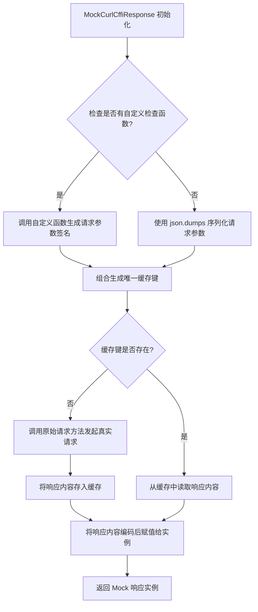

# `.\MetaGPT\tests\mock\mock_curl_cffi.py` 详细设计文档

该代码实现了一个用于模拟和缓存 HTTP 请求的 Mock 响应类，主要用于测试场景。它通过拦截 `curl_cffi.requests.Session.request` 方法，根据请求的方法、URL 和参数生成唯一键，并缓存首次请求的真实响应。后续相同请求将直接返回缓存内容，避免重复网络调用，同时支持通过自定义检查函数来精细化控制缓存键的生成。

## 整体流程



## 类结构

```
MockCurlCffiResponse (继承自 curl_cffi.requests.Response)
├── 类字段: check_funcs, rsp_cache, name
└── 类方法: __init__
```

## 全局变量及字段


### `origin_request`
    
保存原始 curl_cffi.requests.Session.request 方法的引用，用于在缓存未命中时发起真实网络请求。

类型：`function`
    


### `MockCurlCffiResponse.check_funcs`
    
一个字典，键为 (HTTP方法, URL) 元组，值为自定义函数，用于根据请求参数生成缓存键的一部分，实现更灵活的缓存策略。

类型：`dict[tuple[str, str], Callable[[dict], str]]`
    


### `MockCurlCffiResponse.rsp_cache`
    
一个字典，用于缓存 HTTP 响应的内容（字符串格式），键由类名、方法、URL 和参数生成，避免重复请求相同资源。

类型：`dict[str, str]`
    


### `MockCurlCffiResponse.name`
    
标识此 Mock 类的名称，用于在生成缓存键时作为前缀，以区分不同来源的缓存条目。

类型：`str`
    


### `MockCurlCffiResponse.key`
    
实例属性，在 __init__ 中生成，代表当前请求的唯一缓存键，用于在 rsp_cache 中查找或存储响应。

类型：`str`
    


### `MockCurlCffiResponse.response`
    
实例属性，用于存储原始的 requests.Response 对象（如果缓存未命中并执行了真实请求），当前代码中未显式赋值。

类型：`None | requests.Response`
    


### `MockCurlCffiResponse.content`
    
实例属性，存储 HTTP 响应的原始字节内容，从 rsp_cache 中获取的字符串编码而来，是请求的最终结果。

类型：`bytes`
    
    

## 全局函数及方法

### `MockCurlCffiResponse.__init__`

该方法用于初始化一个模拟的 `curl_cffi.requests.Response` 对象。其核心逻辑是：根据请求的方法、URL和参数生成一个唯一的缓存键（`key`），然后检查该键是否存在于类级别的响应缓存（`rsp_cache`）中。如果存在，则直接从缓存中读取响应内容；如果不存在，则通过原始的 `requests.Session.request` 方法发起真实的网络请求，并将响应内容存入缓存，最后将内容编码后赋给当前响应对象的 `content` 属性。这实现了对特定请求的响应进行缓存和模拟的功能。

参数：

- `session`：`requests.Session`，发起请求所使用的会话对象。
- `method`：`str`，HTTP 请求方法，例如 `"GET"` 或 `"POST"`。
- `url`：`str`，请求的目标 URL。
- `**kwargs`：`dict`，发起请求时传递给原始 `request` 方法的其他关键字参数。

返回值：`None`，此方法不返回任何值，它初始化当前对象实例。

#### 流程图

```mermaid
flowchart TD
    A[开始初始化] --> B[调用父类 __init__ 方法]
    B --> C{检查 check_funcs 中<br>是否存在 (method, url) 对应的函数？}
    C -- 是 --> D[调用函数 fn(kwargs) 生成参数签名]
    C -- 否 --> E[使用 json.dumps(kwargs, sort_keys=True) 生成参数签名]
    D --> F[组合生成缓存键 key]
    E --> F
    F --> G{检查 rsp_cache 中<br>是否存在 key？}
    G -- 否 --> H[调用 origin_request 发起真实请求]
    H --> I[将响应内容解码后存入 rsp_cache[key]]
    G -- 是 --> J[从 rsp_cache[key] 读取缓存的响应内容]
    I --> K[将响应内容编码并赋值给 self.content]
    J --> K
    K --> L[初始化完成]
```

#### 带注释源码

```python
def __init__(self, session, method, url, **kwargs) -> None:
    # 1. 首先调用父类 requests.Response 的初始化方法
    super().__init__()
    
    # 2. 从类变量 check_funcs 中查找当前 (method, url) 组合对应的自定义检查函数
    fn = self.check_funcs.get((method, url))
    
    # 3. 生成用于标识本次请求的唯一缓存键（key）。
    #    格式为: "curl-cffi-{method}-{url}-{参数签名}"
    #    如果存在自定义函数 fn，则使用 fn(kwargs) 的结果作为参数签名；
    #    否则，使用 kwargs 字典经 JSON 序列化（按键排序）后的字符串作为签名。
    self.key = f"{self.name}-{method}-{url}-{fn(kwargs) if fn else json.dumps(kwargs, sort_keys=True)}"
    
    # 4. 初始化实例变量 self.response（当前为 None，可能用于后续存储完整响应对象）
    self.response = None
    
    # 5. 缓存检查与请求执行逻辑
    if self.key not in self.rsp_cache:
        # 5.1 如果缓存键不存在，则使用原始的 session.request 方法发起真实网络请求
        response = origin_request(session, method, url, **kwargs)
        # 5.2 将真实响应的内容解码为字符串，并存入类缓存字典 rsp_cache 中
        self.rsp_cache[self.key] = response.content.decode()
    
    # 6. 无论缓存是否命中，最终都将缓存中的响应字符串编码为字节，并赋值给当前对象的 content 属性。
    #    这是 requests.Response 对象期望的内容存储格式。
    self.content = self.rsp_cache[self.key].encode()
```

## 关键组件


### 请求缓存机制

通过 `rsp_cache` 字典缓存特定请求的响应内容，避免对相同请求的重复网络调用，以提高性能并减少外部服务负载。

### 请求指纹生成

通过组合请求方法、URL、请求参数（或自定义检查函数的输出）生成唯一的 `key`，作为缓存字典的索引，确保不同请求的响应被正确区分和存储。

### 自定义响应检查函数

通过 `check_funcs` 字典注册自定义函数，允许根据请求参数动态生成缓存键的一部分，为特定请求提供更灵活的缓存策略。

### 响应对象模拟

`MockCurlCffiResponse` 类继承自 `requests.Response`，通过重写 `__init__` 方法，在初始化时介入请求流程，实现缓存逻辑，同时保持与原响应对象兼容的接口。


## 问题及建议


### 已知问题

-   **缓存键生成逻辑存在缺陷**：`self.key` 的生成依赖于 `fn(kwargs)` 或 `json.dumps(kwargs, sort_keys=True)`。`kwargs` 中可能包含不可序列化的对象（如文件句柄、函数对象），导致 `json.dumps` 失败。此外，`kwargs` 中的顺序敏感参数（如 `headers` 字典）即使内容相同，若顺序不同，`json.dumps` 也会生成不同的字符串，导致缓存未命中。
-   **缓存内容解码与编码存在冗余**：每次从缓存中读取响应时，都需要将存储的字符串（`self.rsp_cache[self.key]`）编码为字节（`.encode()`），而原始响应内容（`response.content`）本身就是字节。这造成了不必要的编解码开销和潜在编码问题（如默认编码可能不匹配）。
-   **缓存未设置大小限制与淘汰策略**：`rsp_cache` 字典会无限增长，长期运行可能导致内存泄漏。
-   **线程安全问题**：`check_funcs` 和 `rsp_cache` 是类变量，被所有实例共享。在多线程环境下并发读写这些字典可能导致数据竞争和不一致。
-   **错误处理不完善**：在 `fn(kwargs)` 调用或 `json.dumps` 过程中如果发生异常，或者网络请求失败，代码没有进行捕获和处理，可能导致程序崩溃。
-   **Mock类职责过重且命名误导**：类名 `MockCurlCffiResponse` 暗示它是一个模拟响应类，但它实际承担了发起真实请求、缓存管理和响应构建的多重职责，违反了单一职责原则。

### 优化建议

-   **重构缓存键生成逻辑**：设计一个更健壮的键生成函数。可以序列化关键、可序列化的参数（如 `params`, `data`, `json` 的字符串形式），并忽略不可序列化的部分（如 `files`）。对于 `headers`，可以将其键值对排序后序列化以确保一致性。
-   **直接缓存字节内容**：将 `rsp_cache` 的值类型从 `str` 改为 `bytes`，直接存储 `response.content`。这样可以避免编解码开销和编码问题。在 `MockCurlCffiResponse` 中直接赋值 `self.content = self.rsp_cache[self.key]`。
-   **引入缓存大小限制与淘汰策略**：使用 `functools.lru_cache` 装饰器或类似 `cachetools` 库中的 `LRUCache` 来管理 `rsp_cache`，设置最大条目数。
-   **保证线程安全**：对共享资源 `check_funcs` 和 `rsp_cache` 的访问使用线程锁（`threading.Lock`）进行保护，或使用线程安全的数据结构（如 `concurrent.futures` 中的结构）。
-   **增强错误处理**：在键生成和网络请求步骤添加 `try-except` 块，妥善处理异常（如序列化错误、网络错误），并记录日志或抛出更明确的异常。
-   **重构类设计，明确职责**：
    -   将缓存管理逻辑（键生成、存储、检索）分离到一个独立的 `CacheManager` 类中。
    -   将请求执行逻辑（调用 `origin_request`）也封装起来。
    -   `MockCurlCffiResponse` 类应主要专注于模拟响应行为，其初始化应接收一个 `bytes` 类型的 `content` 和其他必要的响应属性（如 `status_code`, `headers`），而不是自己发起请求和操作缓存。这可以通过工厂模式或依赖注入来实现。
-   **考虑添加缓存失效机制**：为缓存条目添加时间戳，并提供一个机制（如基于时间或外部事件）来清理过期的缓存。


## 其它


### 设计目标与约束

本代码旨在为 `curl_cffi.requests` 库提供一个轻量级的请求模拟与缓存机制。其核心设计目标是在不修改原有 `requests.Session.request` 方法调用逻辑的前提下，通过继承和重写 `requests.Response` 类，实现对特定请求的响应进行拦截、自定义校验和缓存。主要约束包括：必须保持与 `curl_cffi.requests` API 的兼容性；缓存键的生成逻辑需要足够灵活以支持自定义校验函数；缓存应基于内存，适用于单次运行会话。

### 错误处理与异常设计

代码中显式的错误处理逻辑较少，主要依赖底层 `curl_cffi.requests` 库和 Python 内置异常。潜在风险点包括：
1.  **自定义校验函数 (`check_funcs` 中的函数) 异常**：当 `fn(kwargs)` 被调用时，如果 `fn` 函数内部抛出异常，此异常将直接传播，导致 `MockCurlCffiResponse` 实例化失败。调用方需确保提供的校验函数健壮。
2.  **缓存键生成异常**：`json.dumps(kwargs, sort_keys=True)` 可能因 `kwargs` 中包含不可 JSON 序列化的对象而失败。
3.  **编解码异常**：`response.content.decode()` 和 `.encode()` 默认使用 UTF-8，若响应内容非 UTF-8 编码可能导致 `UnicodeDecodeError`。
当前设计将错误处理的责任上移给了调用者，要求调用者管理好 `check_funcs` 和传入的 `kwargs`。

### 数据流与状态机

1.  **初始化数据流**：
    *   **输入**：`session`, `method`, `url`, `**kwargs` (请求参数)。
    *   **处理**：
        a. 根据 `(method, url)` 查找对应的自定义校验函数 `fn`。
        b. 生成缓存键 `key`：如果存在 `fn`，则使用 `fn(kwargs)` 的结果作为键的一部分；否则使用 `kwargs` 的 JSON 序列化字符串。
        c. 检查 `rsp_cache` 字典中是否存在该 `key`。
        d. 若不存在，则调用原始的 `origin_request` 发起真实请求，将响应内容解码后存入 `rsp_cache`。
        e. 将缓存的内容编码后赋值给实例的 `content` 属性。
    *   **输出**：一个 `MockCurlCffiResponse` 实例，其 `content` 属性已填充（来自缓存或真实请求）。
2.  **状态机**：该类本身不维护复杂的状态机。其核心状态是类级别的 `rsp_cache` 字典，用于存储所有请求的缓存响应。每个实例的 `key` 属性标识了其在缓存中的唯一条目。实例的生命周期是：创建 -> 检查/填充缓存 -> 被使用 -> 销毁。缓存 (`rsp_cache`) 的生命周期与类定义绑定，通常贯穿整个程序运行期间。

### 外部依赖与接口契约

1.  **外部依赖**：
    *   `curl_cffi.requests`：核心依赖，用于发起实际的 HTTP 请求。代码通过 `from curl_cffi import requests` 导入并继承其 `Response` 类。
    *   `json`：Python 标准库，用于将请求参数 `kwargs` 序列化为字符串以生成默认的缓存键。
    *   `typing.Callable`：用于类型注解，定义 `check_funcs` 中值的类型。
2.  **接口契约**：
    *   **对 `curl_cffi.requests` 的契约**：`MockCurlCffiResponse` 继承自 `requests.Response`，因此必须保证其行为是 `Response` 的有效子类。它通过保存原始请求方法 `origin_request` 并在需要时调用它来履行“发起请求”的契约。
    *   **对调用者的契约**：
        a. `check_funcs` 字典：调用者可以向此字典注册函数。键为 `(method, url)` 元组，值为一个可调用对象，该对象接受一个 `dict`（即 `kwargs`）并返回一个 `str` 用于生成缓存键。此函数不应有副作用。
        b. 缓存键生成：调用者需理解，对于同一逻辑请求，若想命中缓存，必须生成相同的 `key`。这依赖于 `check_funcs` 函数或 `kwargs` 的 JSON 序列化结果的稳定性。
        c. 响应内容：实例的 `content` 属性是字节串 (`bytes`)，与标准 `Response` 对象一致。`response` 属性在缓存命中时为 `None`，在未命中时保存了原始的 `Response` 对象（但代码中未使用此属性，可能用于调试）。

### 性能考量

1.  **缓存命中性能**：极高。直接从内存字典 (`rsp_cache`) 中读取字符串并编码为字节串，开销很小。
2.  **缓存未命中性能**：与直接调用原始 `origin_request` 几乎相同，仅增加了缓存键生成和字典查找的微小开销。
3.  **内存开销**：`rsp_cache` 字典会存储所有不同请求的响应字符串。在长期运行或请求/响应体很大的场景下，可能导致内存占用持续增长。当前设计没有缓存淘汰策略（如 LRU），存在内存泄漏风险。
4.  **键生成开销**：使用 `json.dumps(kwargs, sort_keys=True)` 生成键可能成为性能瓶颈，特别是当 `kwargs` 很大或包含复杂嵌套结构时。自定义校验函数 `fn` 的一个潜在优势就是可以生成更轻量级的键。

### 安全考量

1.  **缓存污染**：缓存键 (`key`) 的生成逻辑是安全的关键。如果攻击者能够控制 `method`, `url`, `kwargs` 或 `check_funcs` 函数的返回值，他们可能构造特定的键来注入恶意响应或读取其他请求的缓存响应（如果键生成算法存在碰撞）。当前使用 `json.dumps(..., sort_keys=True)` 提供了一种确定性的序列化方式，但调用者仍需确保自定义校验函数是安全的。
2.  **敏感信息泄露**：`kwargs` 可能包含敏感信息（如 API 密钥、密码），这些信息会通过 `json.dumps` 被包含在缓存键或日志中（如果记录键的话）。自定义校验函数应避免返回敏感信息。
3.  **依赖安全**：代码的安全性也依赖于 `curl_cffi.requests` 库本身的安全性。

    