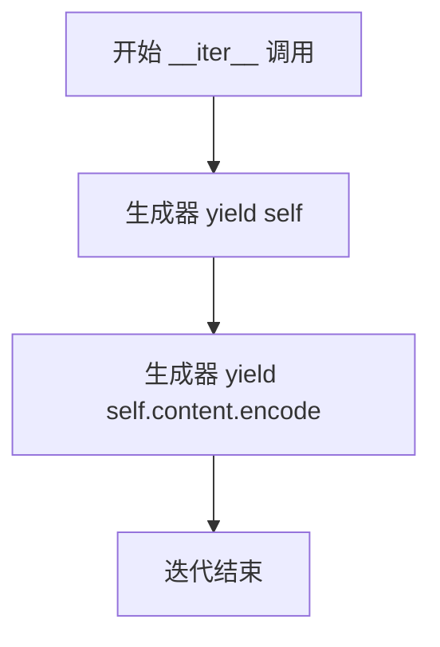

# `.\MetaGPT\tests\mock\mock_httplib2.py` 详细设计文档

该代码实现了一个用于httplib2库的HTTP响应模拟器（MockHttplib2Response），通过拦截和缓存真实的HTTP请求，根据请求的方法、URL和参数生成缓存键，实现请求的缓存和复用，主要用于单元测试中模拟网络请求，避免重复调用外部API并提高测试速度。

## 整体流程

```mermaid
graph TD
    A[MockHttplib2Response初始化] --> B[解析URI，提取URL和查询参数]
    B --> C{是否存在自定义检查函数?}
    C -- 是 --> D[调用检查函数生成缓存键部分]
    C -- 否 --> E[使用参数字典的JSON作为缓存键部分]
    D --> F[组合完整缓存键]
    E --> F
    F --> G{缓存键是否存在缓存中?}
    G -- 是 --> H[从缓存中读取响应内容]
    G -- 否 --> I[调用原始httplib2.request发起真实请求]
    I --> J[将响应内容存入缓存]
    J --> K[设置实例的content属性]
    H --> K
    K --> L[完成初始化]
    M[调用__iter__方法] --> N[生成器返回(self, content的字节编码)]
```

## 类结构

```
httplib2.Response (父类)
└── MockHttplib2Response (子类，模拟响应类)
    ├── 类字段: check_funcs, rsp_cache, name
    ├── 方法: __init__, __iter__
```

## 全局变量及字段


### `origin_request`
    
保存原始的httplib2.Http.request方法引用，用于在需要时发起真实的HTTP请求

类型：`function`
    


### `MockHttplib2Response.check_funcs`
    
存储HTTP方法和URI到自定义检查函数的映射，用于生成缓存键

类型：`dict[tuple[str, str], Callable[[dict], str]]`
    


### `MockHttplib2Response.rsp_cache`
    
缓存HTTP请求的响应内容，键由方法、URL和参数生成，值为响应体字符串

类型：`dict[str, str]`
    


### `MockHttplib2Response.name`
    
标识此Mock类的名称，用于构建缓存键的前缀

类型：`str`
    
    

## 全局函数及方法


### `MockHttplib2Response.__init__`

该方法用于初始化一个模拟的 `httplib2.Response` 对象。其核心逻辑是：根据请求的方法（`method`）、统一资源标识符（`uri`）和参数（`kwargs`）生成一个唯一的缓存键（`key`）。如果该键存在于类级别的缓存字典 `rsp_cache` 中，则直接从缓存中读取响应内容；否则，通过调用原始的 `httplib2.Http.request` 方法执行真实的 HTTP 请求，将响应内容存入缓存，并赋值给当前实例。这实现了对 HTTP 请求的模拟和缓存，常用于单元测试。

参数：

- `self`：`MockHttplib2Response`，当前 `MockHttplib2Response` 类的实例。
- `http`：`httplib2.Http`，一个 `httplib2.Http` 对象，用于执行实际的 HTTP 请求（当缓存未命中时）。
- `uri`：`str`，请求的统一资源标识符，例如 `"http://example.com/api?param=value"`。
- `method`：`str`，HTTP 请求方法，例如 `"GET"` 或 `"POST"`，默认为 `"GET"`。
- `**kwargs`：`dict`，可变关键字参数，将传递给原始的 `httplib2.Http.request` 方法。

返回值：`None`，此方法不返回任何值，其主要作用是初始化实例的 `content` 属性。

#### 流程图

```mermaid
flowchart TD
    A[开始: __init__(self, http, uri, method='GET', **kwargs)] --> B[解析URI: 提取URL和查询参数]
    B --> C{检查是否存在自定义检查函数?}
    C -- 是 --> D[调用自定义函数fn生成缓存键部分]
    C -- 否 --> E[使用json.dumps序列化参数生成缓存键部分]
    D --> F[组合生成完整缓存键key]
    E --> F
    F --> G{缓存键key是否在rsp_cache中?}
    G -- 是 --> H[从rsp_cache中读取内容<br>赋值给self.content]
    G -- 否 --> I[调用原始request方法执行真实HTTP请求]
    I --> J[将响应内容存入rsp_cache]
    J --> K[将响应内容赋值给self.content]
    H --> L[结束]
    K --> L
```

#### 带注释源码

```python
def __init__(self, http, uri, method="GET", **kwargs) -> None:
    # 从URI中提取基础URL（去除查询参数部分）
    url = uri.split("?")[0]
    # 解析完整的URI，获取结构化信息
    result = urlparse(uri)
    # 将查询字符串解析为字典，例如 "?a=1&b=2" -> {'a': '1', 'b': '2'}
    params = dict(parse_qsl(result.query))
    # 根据请求方法和URI，从类变量check_funcs中获取对应的自定义检查函数
    fn = self.check_funcs.get((method, uri))
    # 准备用于生成缓存键的参数
    new_kwargs = {"params": params}
    # 生成唯一的缓存键(key)。格式为：`类名-方法-基础URL-自定义函数结果或参数字符串`
    # 如果存在自定义函数fn，则调用它处理new_kwargs；否则，将new_kwargs序列化为JSON字符串。
    key = f"{self.name}-{method}-{url}-{fn(new_kwargs) if fn else json.dumps(new_kwargs)}"
    # 检查缓存中是否已存在此key对应的响应
    if key not in self.rsp_cache:
        # 缓存未命中：调用原始的httplib2请求方法执行真实网络请求
        # origin_request返回 (response_info, content)，这里忽略response_info，只取content
        _, self.content = origin_request(http, uri, method, **kwargs)
        # 将请求得到的响应内容（字节串）解码为字符串，并存入类缓存字典rsp_cache
        self.rsp_cache[key] = self.content.decode()
    # 无论缓存是否命中，最终都将（字符串形式的）响应内容赋值给实例变量self.content
    # 注意：这里self.content被赋值为字符串，而原始httplib2.Response的content是字节串。
    # 后续的__iter__方法会将其编码回字节串以兼容接口。
    self.content = self.rsp_cache[key]
```


### `MockHttplib2Response.__iter__`

该方法实现了 `MockHttplib2Response` 类的迭代器协议。它允许该类的实例在迭代时（例如，在 `for` 循环或解包操作中）返回两个值：实例自身（`self`）和其内容（`self.content`）的字节编码形式。这模拟了 `httplib2.Response` 对象在迭代时返回 `(response, content)` 对的行为，其中 `content` 需要是字节类型。

参数：
-  `self`：`MockHttplib2Response`，当前 `MockHttplib2Response` 类的实例。

返回值：`generator`，一个生成器，依次产生 `self` 和 `self.content.encode()`。

#### 流程图



#### 带注释源码

```python
def __iter__(self):
    # 第一次迭代返回 MockHttplib2Response 实例本身，模拟响应对象
    yield self
    # 第二次迭代返回响应内容的字节编码，模拟 httplib2 的 content 部分
    yield self.content.encode()
```


## 关键组件


### MockHttplib2Response 类

该类是 `httplib2.Response` 的子类，用于模拟 HTTP 响应，核心功能是拦截并缓存对 `httplib2.Http.request` 方法的调用，通过自定义的检查函数和缓存机制来复用响应内容，以减少重复的网络请求。

### 请求缓存机制

通过 `rsp_cache` 字典缓存已请求的响应内容。缓存的键（`key`）由模拟器名称、HTTP 方法、URL 路径以及一个由检查函数或参数字典生成的唯一标识符组合而成，确保相同逻辑请求的响应被复用。

### 自定义检查函数

通过 `check_funcs` 字典注册自定义的检查函数。这些函数接收请求参数，并返回一个用于生成缓存键的字符串。这允许更灵活地定义何时两个请求应被视为“相同”并共享缓存，而不仅仅是基于原始的 URL 和参数字符串。

### 请求拦截与转发

在 `__init__` 方法中，首先尝试从缓存获取响应。如果缓存未命中，则调用原始的 `httplib2.Http.request` 方法（通过 `origin_request` 保存的引用）执行真实的网络请求，并将响应内容存入缓存，实现了对原始请求的拦截、缓存和透明转发。

### 响应内容编码适配

在缓存中存储解码后的字符串（`self.content.decode()`），但在模拟 `httplib2.Response` 的迭代协议（`__iter__` 方法）时，将缓存的内容重新编码为字节流（`yield self.content.encode()`），以匹配原始库对响应格式的期望。


## 问题及建议


### 已知问题

-   **缓存键生成逻辑存在缺陷**：`MockHttplib2Response.__init__` 方法中，在生成缓存键 `key` 时，会尝试调用 `fn(new_kwargs)`。如果 `fn` 存在（即 `check_funcs` 字典中有对应的函数），则使用其返回值作为键的一部分。然而，在 `key` 字符串的格式化过程中，无论 `fn` 是否为 `None`，都会执行 `fn(new_kwargs) if fn else json.dumps(new_kwargs)`。虽然条件表达式逻辑正确，但代码可读性稍差，且当 `fn` 函数内部抛出异常时，错误信息可能不够清晰。更严重的是，`key` 的构造依赖于 `fn` 的返回值，如果不同的 `fn` 对相同的 `new_kwargs` 返回了相同的字符串，可能导致本应不同的请求被错误地缓存为同一个响应。
-   **缓存内容编码处理不一致**：代码将原始响应内容 (`self.content`) 解码为字符串后存入缓存 (`self.rsp_cache[key] = self.content.decode()`)，但在 `__iter__` 方法中返回时，又将缓存中的字符串编码回字节 (`yield self.content.encode()`)。这种解码再编码的过程可能带来不必要的性能开销，且在编码/解码过程中如果未明确指定字符集（默认为 `utf-8`），可能遇到非UTF-8编码的响应内容时引发 `UnicodeDecodeError` 或 `UnicodeEncodeError`。
-   **类属性共享可能导致数据污染**：`check_funcs` 和 `rsp_cache` 被定义为类属性（字典）。这意味着所有 `MockHttplib2Response` 的实例共享同一套检查函数和缓存。在并发或多线程环境下，对这两个字典的读写操作（例如在 `__init__` 中查询和写入 `rsp_cache`）可能引发竞态条件（Race Condition），导致数据不一致或程序崩溃。此外，全局共享的缓存缺乏清理机制，可能持续增长，最终导致内存耗尽。
-   **继承与猴子补丁的强耦合**：该类继承自 `httplib2.Response` 并重写了 `__init__` 和 `__iter__` 方法，其设计意图似乎是替换 `httplib2.Http.request` 的返回值。这种通过继承和可能存在的猴子补丁（`origin_request = httplib2.Http.request` 暗示了这一点）来实现功能的方式，深度耦合了 `httplib2` 库的内部实现。如果 `httplib2` 库的未来版本改变了 `Response` 类的接口或 `Http.request` 的行为，此模拟类很可能失效。
-   **异常处理不完善**：`__init__` 方法中调用了原始的 `origin_request`，但并未捕获其可能抛出的任何异常（如网络错误、超时等）。如果原始请求失败，异常会直接抛出，中断程序。此外，在调用 `fn(new_kwargs)` 或 `json.dumps(new_kwargs)` 时也未进行异常处理。

### 优化建议

-   **重构缓存键生成逻辑**：建议将缓存键的生成提取为一个独立的方法（例如 `_generate_cache_key`），使逻辑更清晰。在该方法内部，明确处理 `fn` 的存在性检查及其调用，并考虑对 `fn` 的调用进行异常包装，提供更详细的错误上下文。评估是否需要对 `new_kwargs` 进行规范化处理（如排序字典项），以确保相同参数集总是生成相同的键。
-   **统一缓存数据的格式**：重新考虑缓存内容的格式。如果下游代码期望的是字节内容，则应以字节形式缓存，避免编解码开销和字符集问题。可以改为 `self.rsp_cache[key] = self.content`（直接缓存字节）。同时，在 `__iter__` 中直接返回缓存中的字节。如果确实需要字符串形式，则应确保在解码和编码时使用正确的、或从响应头中推断的字符集。
-   **引入实例属性或线程安全的缓存**：为了避免共享状态带来的并发问题，可以考虑：
    1.  将 `check_funcs` 和 `rsp_cache` 作为实例属性在 `__init__` 中初始化（例如通过参数传入），但这会改变类的使用方式。
    2.  继续使用类属性，但改用线程安全的字典类型（如 `threading.Lock` 包装的字典，或 `concurrent.futures` 中的结构）来保护对它们的访问。同时，为缓存实现某种淘汰策略（如LRU），防止内存无限增长。
-   **降低耦合度，考虑组合优于继承**：评估是否必须继承 `httplib2.Response`。或许可以通过创建适配器类或使用包装模式，持有真实的 `httplib2.Response` 实例并代理其大部分行为，只拦截和修改需要模拟的部分（如 `__iter__` 返回的内容）。这能减少对父类内部细节的依赖，提高代码的健壮性和可维护性。如果猴子补丁是必要的，应将其隔离在一个明确的配置或设置函数中。
-   **增强异常处理与日志记录**：在 `__init__` 方法中，对 `origin_request` 的调用应使用 `try-except` 块包裹，捕获可能发生的异常（如 `httplib2.HttpLib2Error` 或其子类），并根据情况决定是抛出、记录日志还是返回一个模拟的错误响应。同样，对 `fn` 的调用和 `json.dumps` 也应进行异常处理。添加日志记录（使用 `logging` 模块）可以帮助调试缓存命中、函数调用和错误情况。
-   **补充文档和类型注解**：为类、方法、属性添加清晰的文档字符串（docstring），说明其用途、行为以及 `check_funcs` 等关键结构的预期格式。完善类型注解，例如 `check_funcs` 的值类型可以更精确地定义为 `Callable[[dict], str]`，但参数 `dict` 的具体结构也应说明。


## 其它


### 设计目标与约束

本代码的核心设计目标是创建一个用于 `httplib2` 库的模拟响应类 `MockHttplib2Response`，其主要功能是拦截 HTTP 请求，并根据请求的方法、URL 和参数生成一个缓存键。如果缓存中存在该键对应的响应，则直接返回缓存内容，否则执行真实的网络请求并将响应结果存入缓存。这旨在用于测试环境，通过避免重复的真实网络调用来提高测试执行速度并确保测试的幂等性。设计上的主要约束包括：必须与 `httplib2` 库的 `Response` 类接口兼容，以确保能够无缝替换；缓存机制需要能够根据自定义逻辑（通过 `check_funcs` 字典提供）来生成缓存键，以支持对特定请求的差异化处理。

### 错误处理与异常设计

当前代码中的错误处理相对隐式，主要依赖于底层 `httplib2.Http.request` 方法可能抛出的异常（如网络错误、超时等）。`MockHttplib2Response` 类的 `__init__` 方法在调用 `origin_request` 时，这些异常会直接向上传播。此外，如果 `check_funcs` 字典中注册的回调函数 `fn` 在执行时抛出异常，或者 `json.dumps` 在序列化 `new_kwargs` 时失败（例如，如果 `params` 包含不可序列化的对象），这些异常也会导致初始化失败。代码本身没有显式地捕获或转换这些异常，也没有定义自定义异常类型。这种设计将错误处理的责任交给了调用者，符合库的通用做法，但在复杂测试场景下可能需要对特定错误进行更精细的控制。

### 数据流与状态机

系统的核心数据流围绕请求-响应周期和缓存状态展开。
1.  **请求输入**：当 `MockHttplib2Response` 被实例化时，输入为 HTTP 请求的 `uri`、`method` 和 `kwargs`。
2.  **参数解析**：从 `uri` 中解析出基本 URL (`url`) 和查询参数 (`params`)。
3.  **缓存键生成**：
    *   首先，根据 `method` 和完整的 `uri` 从 `check_funcs` 字典中查找对应的处理函数 `fn`。
    *   构建 `new_kwargs` 字典（目前仅包含 `params`）。
    *   如果找到 `fn`，则调用 `fn(new_kwargs)` 生成缓存键的一部分；否则，使用 `json.dumps(new_kwargs)` 生成。
    *   最终的缓存键 `key` 由模拟器名称、方法、基本 URL 和上述生成的部分拼接而成。
4.  **缓存查找与决策**：在类级别的 `rsp_cache` 字典中查找 `key`。
    *   **缓存命中**：直接从缓存中获取 `content`，并将其赋值给实例的 `content` 属性。
    *   **缓存未命中**：调用原始的 `httplib2.Http.request` 方法（`origin_request`）执行真实请求。将返回的响应体解码后存入 `rsp_cache[key]`，并同样赋值给实例的 `content`。
5.  **响应输出**：实例通过 `__iter__` 方法模拟 `httplib2.Response` 的行为，依次 yield 自身和编码后的 `content`。

状态机相对简单，主要状态是 `rsp_cache` 字典的内容（已缓存 vs 未缓存）。每个请求的处理流程是确定性的，基于生成的 `key` 决定走缓存路径还是真实请求路径。

### 外部依赖与接口契约

*   **外部库依赖**：
    *   `httplib2`：核心依赖，用于执行真实的 HTTP 请求。`MockHttplib2Response` 继承自 `httplib2.Response`，并依赖于其 `request` 方法的原始实现（通过 `origin_request` 保存）。
    *   `json`：用于将参数字典序列化为字符串，作为默认缓存键的一部分。
    *   `urllib.parse`：用于解析 URL，提取路径和查询参数。
*   **接口契约**：
    *   **与 `httplib2` 的兼容性**：`MockHttplib2Response` 必须表现得像一个标准的 `httplib2.Response` 对象。这通过继承和实现 `__iter__` 方法来保证，该方法需要返回 `(self, content)` 的迭代器。
    *   **`check_funcs` 字典的契约**：键为 `(method, uri)` 的元组，值为一个可调用对象（`Callable[[dict], str]`）。该可调用对象接受一个参数字典，并返回一个用于构建缓存键的字符串。调用者需确保注册的函数是幂等且安全的。
    *   **缓存键的生成逻辑**：调用者需要理解缓存键的生成公式：`f"{self.name}-{method}-{url}-{fn(new_kwargs) if fn else json.dumps(new_kwargs)}"`。任何对 `check_funcs` 或请求参数的修改都可能影响缓存命中率。
    *   **全局状态**：`check_funcs` 和 `rsp_cache` 是类变量，因此是全局共享的状态。调用者需要注意线程安全性（当前代码非线程安全）以及在测试套件之间正确清理状态，避免测试间相互干扰。

    