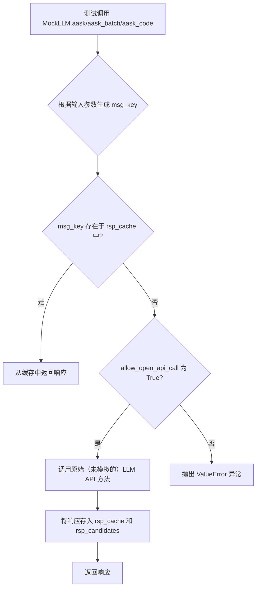
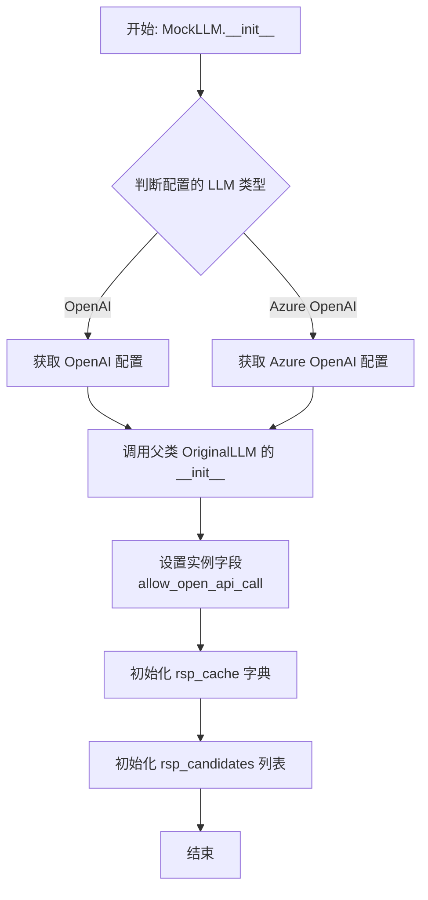
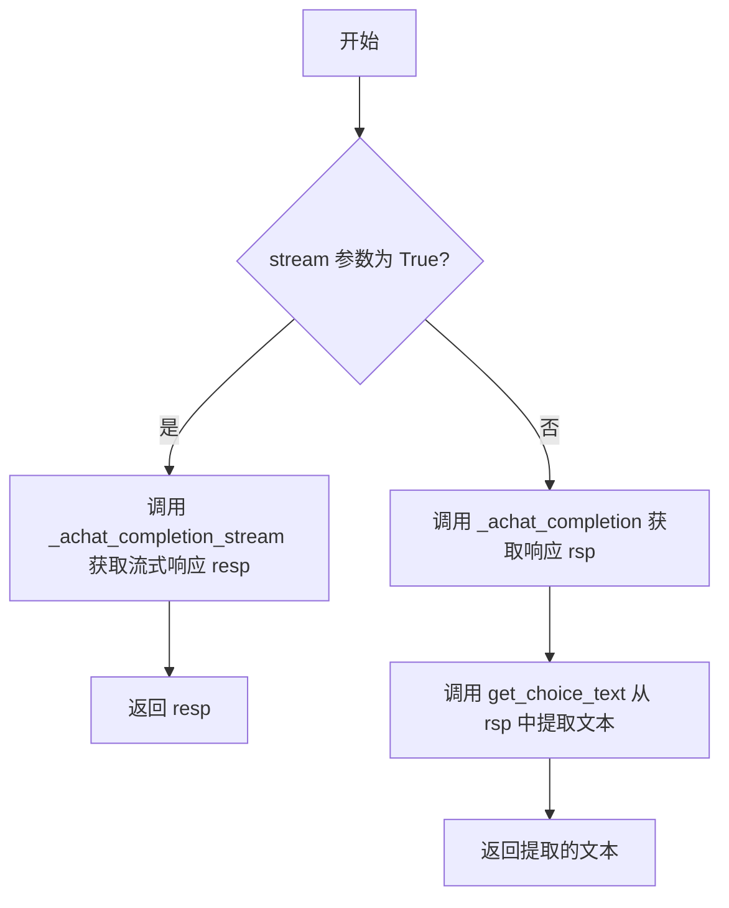
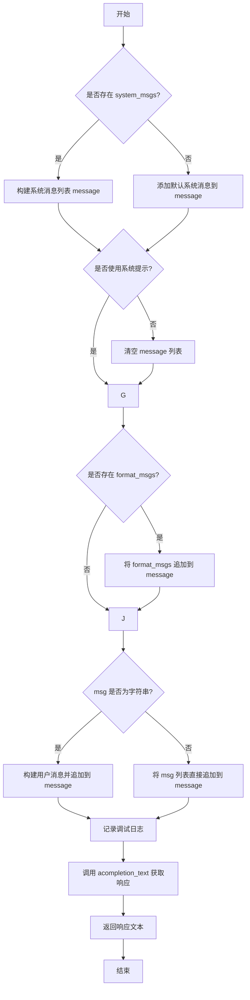
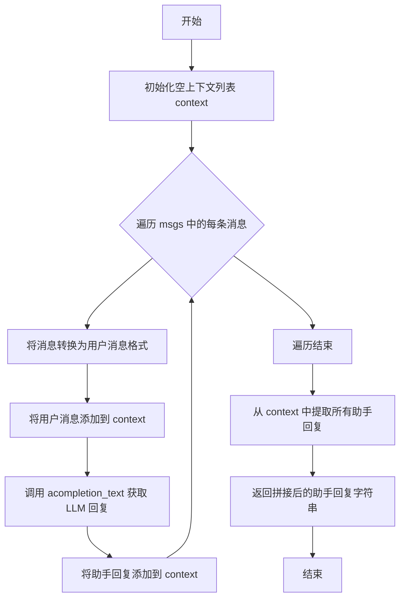
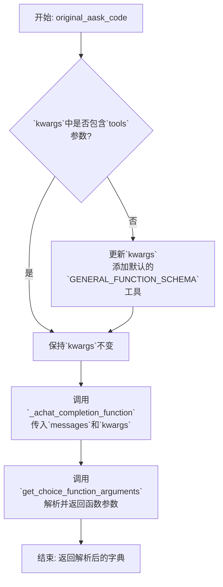
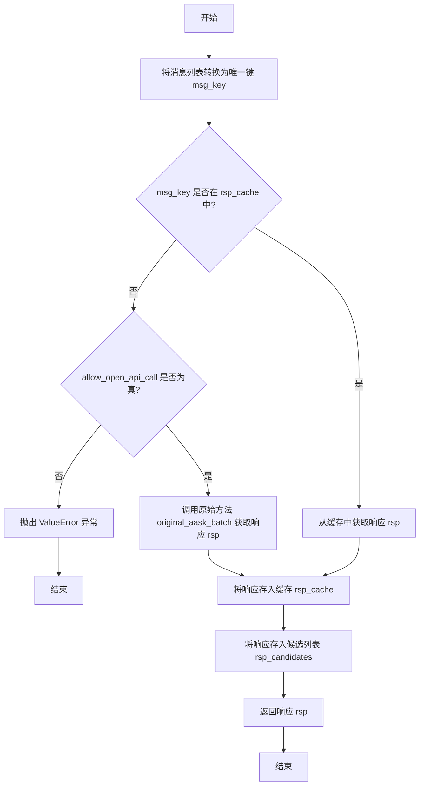
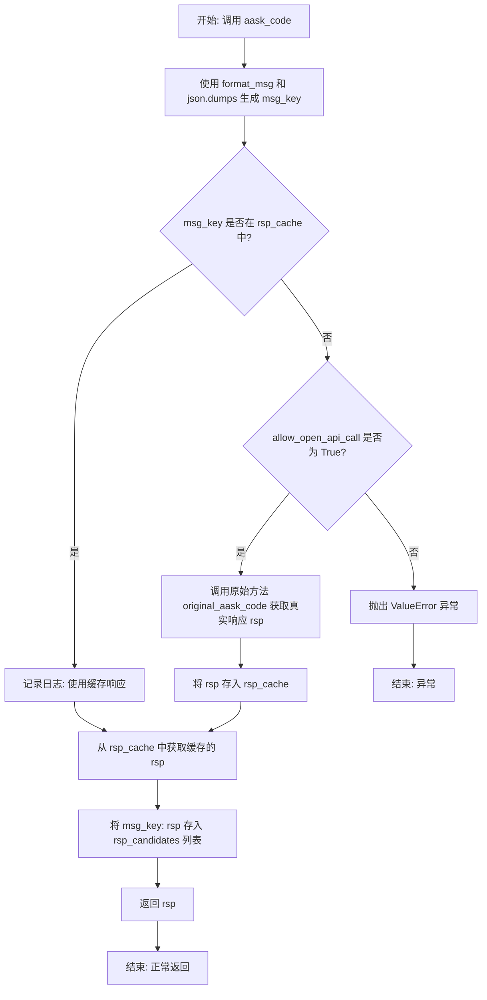

# `.\MetaGPT\tests\mock\mock_llm.py` 详细设计文档

该代码定义了一个 MockLLM 类，用于在测试环境中模拟大型语言模型（LLM）的 API 调用。它通过缓存机制记录和复用 LLM 的响应，从而避免在单元测试或集成测试中产生真实的 API 调用和费用，并允许开发者控制是否允许真实调用。

## 整体流程



## 类结构

```
MockLLM (继承自 OriginalLLM)
├── OriginalLLM (根据配置动态指向 OpenAILLM 或 AzureOpenAILLM)
│   ├── OpenAILLM
│   └── AzureOpenAILLM
```

## 全局变量及字段


### `OriginalLLM`
    
根据配置动态确定的原始LLM类（OpenAILLM或AzureOpenAILLM），作为MockLLM的父类。

类型：`Union[Type[OpenAILLM], Type[AzureOpenAILLM]]`
    


### `MockLLM.allow_open_api_call`
    
控制是否允许进行真实的API调用，如果为False且请求未命中缓存，则会抛出异常。

类型：`bool`
    


### `MockLLM.rsp_cache`
    
用于缓存消息键（msg_key）到对应响应的映射，以在测试中复用LLM响应，避免重复的真实API调用。

类型：`dict`
    


### `MockLLM.rsp_candidates`
    
记录测试过程中所有生成的响应候选（消息键与响应对），用于后续的验证或分析。

类型：`list[dict]`
    
    

## 全局函数及方法

### `MockLLM.__init__`

该方法用于初始化 `MockLLM` 类的实例。它根据配置决定使用 OpenAI 还是 Azure OpenAI 作为底层 LLM 配置，并调用父类的构造函数进行初始化。同时，它设置了一个标志来控制是否允许进行真实的 API 调用，并初始化了用于缓存和记录 API 响应的内部数据结构。

参数：

- `allow_open_api_call`：`bool`，一个布尔值，用于控制是否允许 `MockLLM` 实例在缓存未命中时进行真实的 API 调用。如果为 `False`，则在需要调用真实 API 时会抛出 `ValueError` 异常。

返回值：`None`，此方法为构造函数，不返回任何值。

#### 流程图



#### 带注释源码

```python
def __init__(self, allow_open_api_call):
    # 根据全局配置 `config.llm.api_type` 的值，决定使用 OpenAI 还是 Azure OpenAI 的配置。
    # 如果类型是 OPENAI，则调用 `config.get_openai_llm()` 获取配置，否则调用 `config.get_azure_llm()`。
    original_llm_config = (
        config.get_openai_llm() if config.llm.api_type == LLMType.OPENAI else config.get_azure_llm()
    )
    # 使用获取到的配置调用父类（OriginalLLM，即 OpenAILLM 或 AzureOpenAILLM）的构造函数进行初始化。
    super().__init__(original_llm_config)
    # 将传入的 `allow_open_api_call` 参数保存为实例变量，用于控制是否允许真实 API 调用。
    self.allow_open_api_call = allow_open_api_call
    # 初始化一个空字典 `rsp_cache`，用于缓存消息键（msg_key）到 API 响应的映射。
    # 这可以避免在测试中重复调用真实 API。
    self.rsp_cache: dict = {}
    # 初始化一个空列表 `rsp_candidates`，用于按顺序记录所有模拟或真实的 API 调用及其响应。
    # 这在需要验证调用序列的测试中非常有用。
    self.rsp_candidates: list[dict] = []  # a test can have multiple calls with the same llm, thus a list
```

### `MockLLM.acompletion_text`

该方法重写了父类的 `acompletion_text` 方法，用于在测试环境中模拟或直接调用大语言模型的文本补全功能。其核心逻辑是根据 `stream` 参数决定是调用流式响应方法还是普通响应方法，并取消了父类方法中可能存在的重试机制，以适配测试场景。

参数：

- `messages`：`list[dict]`，包含对话历史的消息列表，通常由系统消息、用户消息等字典组成。
- `stream`：`bool`，默认为 `False`。指示是否使用流式响应。如果为 `True`，则调用 `_achat_completion_stream` 方法；否则调用 `_achat_completion` 方法。
- `timeout`：`int`，默认为 `LLM_API_TIMEOUT`。指定API调用的超时时间。

返回值：`str`，返回从大语言模型获取的文本响应。如果使用流式响应，则返回流式处理后的完整字符串；否则返回从普通响应中提取的文本内容。

#### 流程图



#### 带注释源码

```python
async def acompletion_text(self, messages: list[dict], stream=False, timeout=LLM_API_TIMEOUT) -> str:
    """Overwrite original acompletion_text to cancel retry"""
    # 根据 stream 标志位决定调用流式接口还是普通接口
    if stream:
        # 调用流式聊天补全方法，并直接返回其响应
        resp = await self._achat_completion_stream(messages, timeout=timeout)
        return resp

    # 调用普通聊天补全方法
    rsp = await self._achat_completion(messages, timeout=timeout)
    # 从响应对象中提取出文本内容并返回
    return self.get_choice_text(rsp)
```

### `MockLLM.original_aask`

该方法用于向大语言模型发送异步请求并获取文本响应。它支持多种输入格式，包括纯文本消息、系统消息、格式化消息和图像，并能根据配置决定是否使用系统提示。方法内部会构建完整的消息列表，然后调用底层的 `acompletion_text` 方法完成请求。

参数：

- `msg`：`Union[str, list[dict[str, str]]]`，用户输入的消息内容，可以是字符串或消息字典列表。
- `system_msgs`：`Optional[list[str]]`，可选的系统消息列表，用于设置对话的系统角色。
- `format_msgs`：`Optional[list[dict[str, str]]]`，可选的格式化消息列表，用于预置特定的消息结构。
- `images`：`Optional[Union[str, list[str]]]`，可选的图像输入，可以是单个图像URL或URL列表。
- `timeout`：`int`，请求的超时时间，默认为 `LLM_API_TIMEOUT`。
- `stream`：`bool`，是否使用流式响应，默认为 `True`。

返回值：`str`，大语言模型返回的文本响应内容。

#### 流程图



#### 带注释源码

```python
async def original_aask(
    self,
    msg: Union[str, list[dict[str, str]]],  # 用户输入的消息，支持字符串或字典列表格式
    system_msgs: Optional[list[str]] = None,  # 可选的系统消息列表
    format_msgs: Optional[list[dict[str, str]]] = None,  # 可选的格式化消息列表
    images: Optional[Union[str, list[str]]] = None,  # 可选的图像输入
    timeout=LLM_API_TIMEOUT,  # API调用超时时间
    stream=True,  # 是否使用流式响应
) -> str:
    # 步骤1: 初始化消息列表。如果有系统消息，则使用它们；否则使用默认系统消息。
    if system_msgs:
        message = self._system_msgs(system_msgs)
    else:
        message = [self._default_system_msg()]
    # 步骤2: 根据配置决定是否使用系统提示。如果不使用，则清空消息列表。
    if not self.use_system_prompt:
        message = []
    # 步骤3: 如果有格式化消息，将它们追加到消息列表中。
    if format_msgs:
        message.extend(format_msgs)
    # 步骤4: 处理用户消息。如果是字符串，则构建用户消息字典；如果是列表，则直接追加。
    if isinstance(msg, str):
        message.append(self._user_msg(msg, images=images))
    else:
        message.extend(msg)
    # 步骤5: 记录完整的消息列表用于调试。
    logger.debug(message)
    # 步骤6: 调用底层的异步文本补全方法，传入构建好的消息列表和其他参数。
    rsp = await self.acompletion_text(message, stream=stream, timeout=timeout)
    # 步骤7: 返回大语言模型的响应文本。
    return rsp
```

### `MockLLM.original_aask_batch`

该方法用于批量处理一系列消息，模拟与LLM的交互过程。它依次将每条消息作为用户输入发送给LLM，获取LLM的回复，并将回复作为助手消息添加到上下文中，以便后续消息的交互。最终，它从上下文中提取所有助手回复并返回。

参数：

- `msgs`：`list`，包含一系列消息的列表，每条消息可以是字符串或`Message`对象。
- `timeout`：`int`，可选参数，默认为`LLM_API_TIMEOUT`，指定API调用的超时时间。

返回值：`str`，返回从上下文中提取的所有助手回复的拼接字符串。

#### 流程图



#### 带注释源码

```python
async def original_aask_batch(self, msgs: list, timeout=LLM_API_TIMEOUT) -> str:
    """A copy of metagpt.provider.base_llm.BaseLLM.aask_batch, we can't use super().aask because it will be mocked"""
    context = []  # 初始化上下文列表，用于存储用户消息和助手回复
    for msg in msgs:  # 遍历输入的消息列表
        umsg = self._user_msg(msg)  # 将消息转换为用户消息格式
        context.append(umsg)  # 将用户消息添加到上下文
        rsp_text = await self.acompletion_text(context, timeout=timeout)  # 调用LLM获取回复
        context.append(self._assistant_msg(rsp_text))  # 将LLM回复作为助手消息添加到上下文
    return self._extract_assistant_rsp(context)  # 从上下文中提取所有助手回复并返回
```

### `MockLLM.original_aask_code`

该方法用于模拟对大型语言模型（LLM）的代码生成请求。它本质上是底层 `OpenAILLM.aask_code` 方法的一个副本，用于在测试环境中绕过被模拟（Mock）的父类方法，直接调用原始功能以获取结构化的代码生成响应。

参数：

- `messages`：`Union[str, Message, list[dict]]`，输入给LLM的提示信息。可以是字符串、`Message`对象或消息字典列表。
- `**kwargs`：`dict`，其他传递给底层 `_achat_completion_function` 方法的可选参数。

返回值：`dict`，一个字典，包含了LLM返回的、解析后的函数调用参数。这通常代表了生成的代码或结构化指令。

#### 流程图



#### 带注释源码

```python
async def original_aask_code(self, messages: Union[str, Message, list[dict]], **kwargs) -> dict:
    """
    A copy of metagpt.provider.openai_api.OpenAILLM.aask_code, we can't use super().aask because it will be mocked.
    Since openai_api.OpenAILLM.aask_code is different from base_llm.BaseLLM.aask_code, we use the former.
    """
    # 检查调用者是否在kwargs中提供了自定义的`tools`参数
    if "tools" not in kwargs:
        # 如果没有提供，则使用默认的通用函数调用模式（GENERAL_FUNCTION_SCHEMA）
        # 这通常用于引导LLM以结构化JSON格式返回代码或特定操作
        configs = {"tools": [{"type": "function", "function": GENERAL_FUNCTION_SCHEMA}]}
        kwargs.update(configs)  # 将默认工具配置合并到kwargs中
    # 调用底层的异步聊天补全函数，该函数支持OpenAI的函数调用功能
    # 传入处理后的messages和所有kwargs参数
    rsp = await self._achat_completion_function(messages, **kwargs)
    # 从LLM的响应中提取出函数调用的参数部分，并作为字典返回
    # 这通常包含了生成的代码块或其他结构化内容
    return self.get_choice_function_arguments(rsp)
```

### `MockLLM.aask`

该方法用于模拟大语言模型（LLM）的异步问答（ask）功能。它首先根据传入的消息、系统提示等参数生成一个唯一的消息键（`msg_key`），然后检查该键是否存在于缓存（`rsp_cache`）中。如果存在，则直接返回缓存的响应；如果不存在，则根据 `allow_open_api_call` 标志决定是调用真实的 LLM API（通过 `original_aask` 方法）还是抛出异常。最后，将本次请求的键值对记录到 `rsp_candidates` 列表中并返回响应。该方法主要用于单元测试，以模拟和缓存 LLM 的响应，避免在测试中频繁调用真实 API。

参数：

- `msg`：`Union[str, list[dict[str, str]]]`，用户输入的消息，可以是字符串，也可以是消息字典列表。
- `system_msgs`：`Optional[list[str]]`，可选的系统消息列表，用于指导模型的行为。
- `format_msgs`：`Optional[list[dict[str, str]]]`，可选的格式化消息列表，用于提供额外的上下文或指令。
- `images`：`Optional[Union[str, list[str]]]`，可选的图像输入，可以是单个图像 URL 或 URL 列表。
- `timeout`：`int`，API 调用的超时时间，默认为 `LLM_API_TIMEOUT`。
- `stream`：`bool`，是否使用流式响应，默认为 `False`。

返回值：`str`，LLM 对输入消息的文本响应。

#### 流程图

```mermaid
flowchart TD
    A[开始] --> B{输入msg是否为列表?}
    B -->|是| C[将列表中每个消息的'content'用'#MSG_SEP#'连接成msg_key]
    B -->|否| D[直接使用msg字符串作为msg_key]
    C --> E
    D --> E
    E{是否存在system_msgs?}
    E -->|是| F[将system_msgs用'#MSG_SEP#'连接<br>并附加'#SYSTEM_MSG_END#'<br>然后与msg_key拼接]
    E -->|否| G[保持msg_key不变]
    F --> H
    G --> H
    H[调用 _mock_rsp 方法] --> I{msg_key是否在rsp_cache中?}
    I -->|是| J[从rsp_cache中获取响应rsp]
    I -->|否| K{allow_open_api_call是否为True?}
    K -->|是| L[调用original_aask获取真实响应rsp]
    K -->|否| M[抛出ValueError异常]
    J --> N
    L --> N
    N[将{msg_key: rsp}记录到rsp_candidates] --> O[返回响应rsp]
```

#### 带注释源码

```python
async def aask(
    self,
    msg: Union[str, list[dict[str, str]]],
    system_msgs: Optional[list[str]] = None,
    format_msgs: Optional[list[dict[str, str]]] = None,
    images: Optional[Union[str, list[str]]] = None,
    timeout=LLM_API_TIMEOUT,
    stream=False,
) -> str:
    # 根据输入消息生成一个唯一的缓存键（msg_key）
    # 如果msg是列表，则提取每个字典的'content'字段并用分隔符连接
    if isinstance(msg, list):
        msg_key = "#MSG_SEP#".join([m["content"] for m in msg])
    else:
        # 如果msg是字符串，直接使用
        msg_key = msg

    # 如果提供了系统消息，将其处理并拼接到msg_key前面，以区分不同系统指令下的相同用户输入
    if system_msgs:
        joined_system_msg = "#MSG_SEP#".join(system_msgs) + "#SYSTEM_MSG_END#"
        msg_key = joined_system_msg + msg_key

    # 调用内部方法 _mock_rsp 来获取响应。
    # 传入生成的msg_key、实际执行问询的方法（original_aask）、以及所有原始参数。
    rsp = await self._mock_rsp(msg_key, self.original_aask, msg, system_msgs, format_msgs, images, timeout, stream)
    # 返回获取到的响应
    return rsp
```

### `MockLLM.aask_batch`

该方法用于批量处理消息列表，通过模拟或缓存机制来获取响应，以减少对真实API的调用。它首先将消息列表转换为一个唯一的键，然后检查该键是否存在于缓存中。如果存在，则返回缓存的响应；否则，根据`allow_open_api_call`标志决定是否调用原始方法获取响应，并将响应存入缓存和候选列表。

参数：

- `msgs`：`list`，包含待处理消息的列表，消息可以是字符串或`Message`对象。
- `timeout`：`int`，API调用的超时时间，默认值为`LLM_API_TIMEOUT`。

返回值：`str`，返回处理后的响应文本。

#### 流程图



#### 带注释源码

```python
async def aask_batch(self, msgs: list, timeout=LLM_API_TIMEOUT) -> str:
    # 将消息列表转换为唯一键：将每个消息转换为字符串并用分隔符连接
    msg_key = "#MSG_SEP#".join([msg if isinstance(msg, str) else msg.content for msg in msgs])
    # 调用内部模拟方法，传入消息键、原始方法和参数
    rsp = await self._mock_rsp(msg_key, self.original_aask_batch, msgs, timeout)
    # 返回模拟或缓存后的响应
    return rsp
```

### `MockLLM.aask_code`

该方法用于在测试环境中模拟对大型语言模型（LLM）的代码生成请求。它首先根据输入消息生成一个唯一的缓存键，然后检查该键是否存在于响应缓存中。如果存在，则返回缓存的响应；如果不存在且允许真实API调用，则调用原始的、未被模拟的 `aask_code` 方法获取响应，并将结果存入缓存和候选列表以备后续使用或验证。如果缓存未命中且不允许API调用，则抛出异常。其核心目的是在单元测试中避免对真实LLM API的依赖，实现可重复和可控的测试。

参数：

- `messages`：`Union[str, Message, list[dict]]`，用户输入的提示信息，可以是字符串、`Message`对象或消息字典列表。
- `**kwargs`：`dict`，传递给底层原始 `aask_code` 方法的额外关键字参数。

返回值：`dict`，解析自LLM响应的函数调用参数字典。通常包含生成的代码或相关结构化数据。

#### 流程图



#### 带注释源码

```python
async def aask_code(self, messages: Union[str, Message, list[dict]], **kwargs) -> dict:
    """
    模拟的代码生成请求方法。
    1. 将输入消息格式化为字符串作为缓存键（msg_key）。
    2. 检查缓存中是否存在该键对应的响应。
    3. 若存在，使用缓存响应；若不存在且允许API调用，则调用原始方法获取响应并缓存。
    4. 将本次请求的键值对记录到 rsp_candidates 列表。
    5. 返回响应（函数调用参数字典）。
    """
    # 生成缓存键：将消息格式化为JSON字符串，确保中文等字符正常显示
    msg_key = json.dumps(self.format_msg(messages), ensure_ascii=False)
    # 调用内部模拟逻辑，传递缓存键、原始方法引用、以及所有参数
    rsp = await self._mock_rsp(msg_key, self.original_aask_code, messages, **kwargs)
    # 返回解析后的函数调用参数
    return rsp
```

### `MockLLM._mock_rsp`

该方法用于在测试环境中模拟LLM（大语言模型）的响应。它首先检查给定的消息键（`msg_key`）是否存在于缓存（`rsp_cache`）中。如果存在，则直接从缓存返回响应，避免真实API调用；如果不存在且允许真实API调用（`allow_open_api_call`为True），则调用原始的、未被模拟的`ask_func`来获取真实响应，并将该响应记录到候选列表（`rsp_candidates`）中；如果不允许真实API调用，则抛出`ValueError`异常。此机制主要用于单元测试，以控制测试的确定性和避免产生外部API调用成本。

参数：

- `msg_key`：`str`，用于唯一标识一个LLM请求的键，通常由消息内容等组合而成。
- `ask_func`：`Callable`，原始的、未被模拟的询问函数（如`original_aask`, `original_aask_batch`等），当缓存未命中且允许API调用时被调用。
- `*args`：`tuple`，传递给`ask_func`的位置参数。
- `**kwargs`：`dict`，传递给`ask_func`的关键字参数。

返回值：`Any`，返回LLM的响应结果，其具体类型由被调用的`ask_func`决定（例如`str`或`dict`）。

#### 流程图

```mermaid
flowchart TD
    A[开始: _mock_rsp(msg_key, ask_func, *args, **kwargs)] --> B{msg_key 是否在 rsp_cache 中?}
    B -- 是 --> C[记录日志: "Use response cache"]
    C --> D[从 rsp_cache[msg_key] 获取响应 rsp]
    B -- 否 --> E{self.allow_open_api_call 是否为 True?}
    E -- 是 --> F[调用原始函数: rsp = await ask_func(*args, **kwargs)]
    E -- 否 --> G[抛出 ValueError 异常<br>提示应正确模拟测试或添加预期响应]
    F --> H
    D --> H[将 {msg_key: rsp} 追加到 rsp_candidates 列表]
    H --> I[返回 rsp]
    G --> J[结束: 异常终止]
    I --> K[结束: 正常返回]
```

#### 带注释源码

```python
async def _mock_rsp(self, msg_key, ask_func, *args, **kwargs):
    """
    模拟响应的核心方法。
    1. 检查缓存：如果请求已缓存，则直接返回缓存结果。
    2. 检查API调用权限：如果未缓存且不允许真实调用，则抛出异常。
    3. 执行真实调用：如果未缓存但允许真实调用，则执行原始函数。
    4. 记录候选响应：无论响应来自缓存还是真实调用，都记录到rsp_candidates中以便后续分析或持久化。
    """
    # 1. 缓存检查：如果消息键已存在于缓存字典中，则命中缓存
    if msg_key not in self.rsp_cache:
        # 2. API调用权限检查：如果未命中缓存且不允许进行真实的OpenAI API调用
        if not self.allow_open_api_call:
            # 抛出详细错误，指导测试者正确配置模拟数据
            raise ValueError(
                "In current test setting, api call is not allowed, you should properly mock your tests, "
                "or add expected api response in tests/data/rsp_cache.json. "
            )
        # 3. 执行真实调用：调用传入的原始函数（如original_aask）获取真实响应
        # Call the original unmocked method
        rsp = await ask_func(*args, **kwargs)
    else:
        # 缓存命中：记录日志并使用缓存响应
        logger.warning("Use response cache")
        rsp = self.rsp_cache[msg_key]
    # 4. 记录候选响应：将本次请求的键和响应记录到列表中，可用于测试验证或更新缓存文件
    self.rsp_candidates.append({msg_key: rsp})
    # 返回最终得到的响应
    return rsp
```

## 关键组件


### 模拟LLM（MockLLM）

一个用于单元测试的LLM模拟类，它继承自真实的LLM类（如OpenAILLM或AzureOpenAILLM），通过缓存和复用预设的API响应来避免在测试中发起真实的网络调用，从而支持离线、快速且稳定的测试。

### 响应缓存机制（rsp_cache）

一个字典类型的实例字段，用于存储以消息内容为键（msg_key）、对应LLM响应为值的缓存。当测试中遇到相同的请求时，直接从缓存中返回响应，避免重复调用。

### 响应候选记录（rsp_candidates）

一个列表类型的实例字段，用于按顺序记录测试过程中所有被调用过的请求及其响应（无论来自缓存还是真实API）。这有助于在测试结束后验证调用序列和生成新的缓存数据。

### 消息键生成逻辑（msg_key generation）

将传入的复杂消息参数（如消息列表、系统提示等）序列化为一个唯一的字符串键的逻辑。该逻辑确保了相同语义的请求能映射到同一个缓存键，是缓存机制正确工作的核心。

### 模拟响应分发器（_mock_rsp）

一个核心的异步方法，作为所有对外请求方法（如`aask`, `aask_batch`, `aask_code`）的最终分发点。它根据`msg_key`查询缓存，决定是返回缓存响应还是调用原始（未被模拟的）LLM方法，并记录本次调用。


## 问题及建议


### 已知问题

-   **缓存键生成逻辑存在潜在冲突**：`aask` 和 `aask_batch` 方法中用于生成缓存键 `msg_key` 的逻辑过于简单，仅通过拼接消息内容（使用 `#MSG_SEP#`）或序列化消息列表（`aask_code`）来生成。这可能导致不同语义的请求（例如，消息顺序不同但内容相同，或系统消息格式不同）生成相同的键，从而返回错误的缓存响应，影响测试的准确性。
-   **缓存数据缺乏结构化管理和持久化**：`rsp_cache` 和 `rsp_candidates` 作为实例变量存储，其生命周期与 `MockLLM` 实例绑定。当测试需要跨多个测试用例或测试会话复用缓存时，缺乏一个标准化的、可持久化（如写入文件）和可加载的机制。当前代码注释提到 `tests/data/rsp_cache.json`，但类本身并未提供直接的保存/加载方法。
-   **继承与组合的职责模糊**：`MockLLM` 继承自 `OriginalLLM`（`OpenAILLM` 或 `AzureOpenAILLM`），但重写了大部分核心方法（`aask`, `aask_batch`, `aask_code`）以加入模拟逻辑，并复制了父类的 `original_aask`、`original_aask_batch` 和 `original_aask_code` 方法。这导致了代码重复，并且使得 `MockLLM` 既承担了模拟职责，又通过继承耦合了具体的 LLM 提供商实现，违反了单一职责原则，增加了维护复杂度。
-   **错误处理不够健壮**：在 `_mock_rsp` 方法中，当 `allow_open_api_call` 为 `False` 且缓存未命中时，直接抛出 `ValueError`。这个错误信息对于测试调试是足够的，但整个类的设计没有考虑更细粒度的异常处理或提供重试、降级等机制（尽管在 `acompletion_text` 中取消了重试）。对于复杂的测试场景，这可能不够灵活。
-   **`rsp_candidates` 列表可能无限增长**：`rsp_candidates` 列表会记录所有请求的响应（无论是否来自缓存）。在长时间运行的测试套件中，如果未定期清理，该列表可能消耗大量内存。

### 优化建议

-   **重构缓存键生成算法**：建议设计一个更健壮的缓存键生成方式。可以考虑使用消息的哈希值（例如，对序列化后的完整消息结构进行 SHA256 哈希），以确保唯一性。同时，应将请求方法标识（如 `aask`、`aask_code`）以及关键参数（如 `system_msgs`）纳入键的生成过程，以避免不同方法或参数下的请求冲突。
-   **引入独立的缓存管理器**：将缓存逻辑抽象到一个独立的 `CacheManager` 类中。该类应负责：
    -   提供可配置的缓存后端（如内存字典、文件、Redis）。
    -   实现标准的 `get(key)`、`set(key, value)` 接口。
    -   提供保存缓存到文件（如 JSON）和从文件加载的方法。
    -   管理 `rsp_candidates` 的存储和清理策略（如 LRU）。
    这样可以使 `MockLLM` 更专注于模拟行为，提高代码的可测试性和可维护性。
-   **使用组合替代继承，并应用适配器模式**：考虑重构 `MockLLM`，使其不继承具体的 LLM 类，而是持有一个 `llm_client` 成员（类型为 `BaseLLM` 接口）。通过组合，`MockLLM` 可以包装任何实现了 `BaseLLM` 接口的 LLM 客户端。其模拟方法（如 `aask`）内部先检查缓存，若未命中则委托给 `llm_client` 的对应方法。这样可以彻底解耦模拟逻辑与具体实现，消除代码重复，并符合“优先使用组合而非继承”的设计原则。
-   **增强异常处理与测试配置**：可以引入更丰富的配置选项，例如，允许在缓存未命中时返回一个可配置的默认响应，而不是直接抛出异常。或者，提供一个“严格模式”和“宽松模式”，在严格模式下抛出异常，在宽松模式下记录警告并尝试调用真实 API 或返回模拟值。这可以提高测试框架的灵活性。
-   **为 `rsp_candidates` 添加清理机制**：在 `MockLLM` 中提供一个 `clear_candidates()` 方法，或在缓存管理器中实现自动清理逻辑（例如，当列表长度超过阈值时，移除最旧的记录）。在测试用例的 `tearDown` 或 `setup` 阶段调用清理方法，可以有效控制内存使用。


## 其它


### 设计目标与约束

本模块的核心设计目标是提供一个用于单元测试的LLM（大语言模型）模拟器（MockLLM）。其主要约束包括：
1.  **功能透明性**：MockLLM必须完全继承并模拟其父类（OpenAILLM或AzureOpenAILLM）的公共接口（如`aask`, `aask_batch`, `aask_code`），确保被测代码在替换真实LLM时无需修改。
2.  **行为可控性**：必须能够精确控制LLM的响应。支持两种模式：a) 从预定义的缓存（`rsp_cache`）中返回固定响应；b) 在允许的情况下（`allow_open_api_call=True`）委托给真实的LLM API获取响应并记录，用于生成或更新缓存。
3.  **测试隔离性**：模拟逻辑必须与具体的LLM提供商（OpenAI/Azure）解耦，通过继承和动态配置实现。同时，需要避免在模拟方法中调用已被模拟的父类方法，防止递归调用，因此复制了部分父类方法作为`original_*`版本。
4.  **性能与成本**：首要目标是避免在测试中产生不必要的真实API调用，以节省成本和加快测试速度。其次，缓存机制应保证同一测试用例内相同请求的响应一致性。

### 错误处理与异常设计

模块的错误处理主要围绕测试环境下的非法API调用进行设计：
1.  **核心异常场景**：当`allow_open_api_call`为`False`且当前请求的`msg_key`不在缓存`rsp_cache`中时，`_mock_rsp`方法会抛出`ValueError`异常。这是一个明确的失败信号，提示开发者需要为当前测试用例预先配置好预期的LLM响应。
2.  **错误信息指导性**：抛出的`ValueError`消息不仅说明错误原因（“api call is not allowed”），还提供了明确的修复指引（“properly mock your tests”或“add expected api response in tests/data/rsp_cache.json”），这体现了良好的开发者体验设计。
3.  **日志记录**：当使用缓存响应时，会通过`logger.warning`记录一条日志，有助于在测试运行期间识别哪些交互使用了模拟数据。
4.  **向上传播**：对于真实API调用中可能出现的网络超时、认证失败等异常，本模块不做额外处理，而是由父类的`_achat_completion`等方法抛出，测试用例应自行捕获或断言这些异常。

### 数据流与状态机

1.  **初始化数据流**：
    *   输入：`allow_open_api_call`（布尔值，测试配置）。
    *   过程：根据全局`config.llm.api_type`决定继承哪个具体LLM类（`OriginalLLM`），并获取对应的配置初始化父类。初始化空的`rsp_cache`（字典）和`rsp_candidates`（列表）。
    *   输出：一个配置好的`MockLLM`实例，其行为由`allow_open_api_call`和`rsp_cache`共同决定。

2.  **请求-响应数据流（以`aask`为例）**：
    *   **输入转换**：将传入的`msg`、`system_msgs`等参数拼接成一个唯一的字符串`msg_key`，作为本次请求的标识符。
    *   **状态判断**：检查`msg_key`是否存在于`rsp_cache`字典中。
        *   是（缓存命中）：进入“使用缓存”状态，直接从缓存中取出响应`rsp`。
        *   否（缓存未命中）：进入“API调用决策”状态，检查`allow_open_api_call`标志。
            *   `True`：进入“委托真实调用”状态，调用`original_aask`方法获取真实响应`rsp`。
            *   `False`：进入“错误”状态，抛出`ValueError`。
    *   **记录与输出**：无论响应来源如何，都将`{msg_key: rsp}`键值对追加到`rsp_candidates`列表中（用于测试验证或后续缓存生成），最后返回`rsp`。

3.  **状态机简述**：
    *   **状态**：`初始态` -> `等待请求` -> (`缓存命中` / `缓存未命中` -> (`允许调用` -> `真实调用完成`) / `禁止调用` -> `错误`) -> `记录结果` -> `返回响应` -> `等待请求`...
    *   `rsp_cache`和`allow_open_api_call`是决定状态转换的关键条件。

### 外部依赖与接口契约

1.  **外部依赖**：
    *   **父类 (`OriginalLLM`)**：`MockLLM`的核心功能依赖于`OpenAILLM`或`AzureOpenAILLM`。它继承了所有父类方法，并期望父类能正常工作。`original_aask`, `original_aask_batch`, `original_aask_code`是对父类特定方法的直接复制和依赖。
    *   **配置系统 (`metagpt.config2.config`)**：用于获取LLM类型和具体配置，是决定模拟对象和初始化参数的关键。
    *   **常量与工具**：依赖`LLM_API_TIMEOUT`, `GENERAL_FUNCTION_SCHEMA`, `Message` schema等。
    *   **日志系统 (`metagpt.logs.logger`)**：用于输出调试和警告信息。

2.  **接口契约**：
    *   **对上游（测试用例）的契约**：`MockLLM`实例承诺提供与真实LLM完全一致的`aask`、`aask_batch`、`aask_code`等异步方法签名。测试用例可以像使用真实LLM一样使用它。
    *   **对下游（父类/真实API）的契约**：当`allow_open_api_call`为`True`时，`MockLLM`通过`original_*`方法调用父类逻辑，这要求父类及其所依赖的网络环境、API密钥等必须可用（尽管在单元测试中这通常不是期望发生的）。
    *   **缓存数据契约**：`rsp_cache`是一个字典，其键（`msg_key`）是由请求消息内容生成的特定格式字符串，值（`rsp`）是对应请求的预期响应（字符串或字典）。`rsp_candidates`列表按调用顺序记录了所有请求-响应对，供测试断言使用。

    