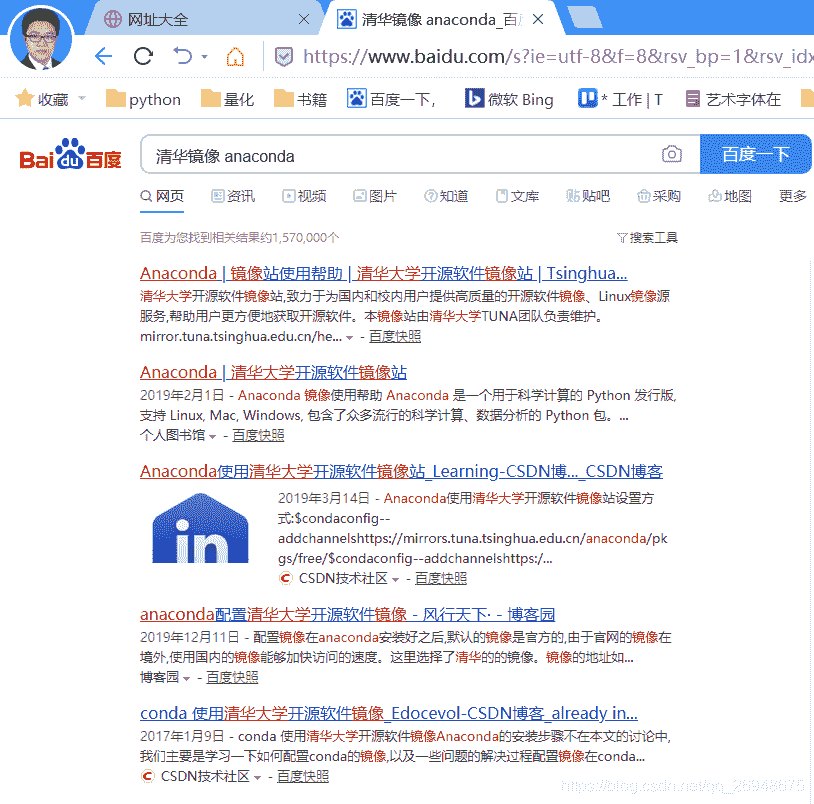
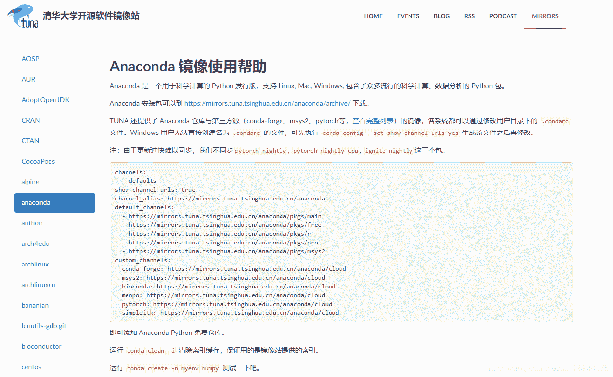
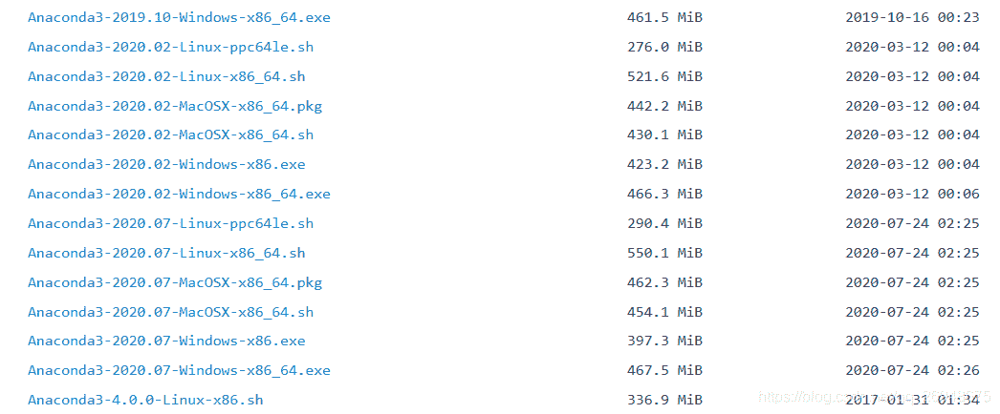
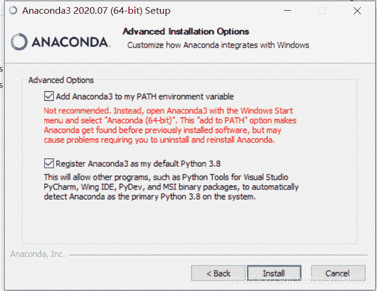
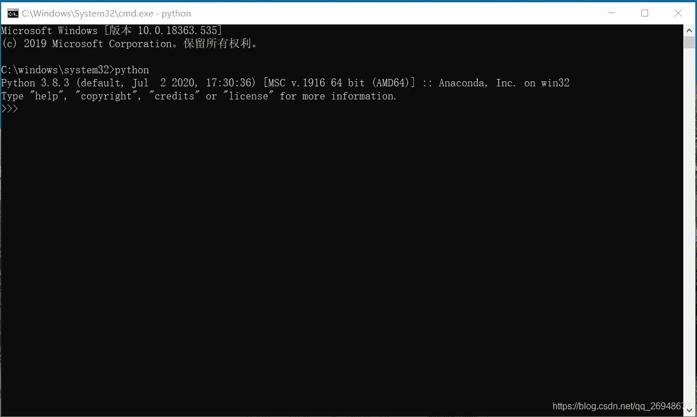
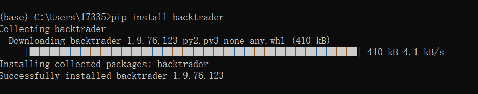
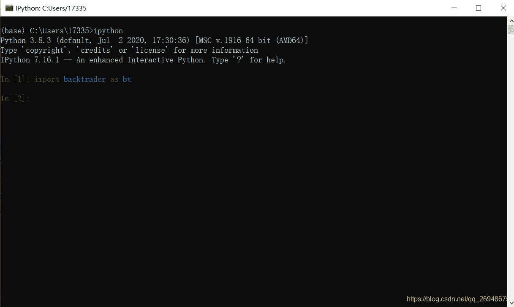

# 5、如何配置 backtrader 运行的环境

> 原文：<https://yunjinqi.blog.csdn.net/article/details/108028311>

由于 backtrader 是基于 python 的量化投资框架，理论上来说，只要有 python 运行的地方，安装过 backtrader 后就可以运行。

虽然 backtrader 同时支持 python2 和 python3，但是，考虑到 python 语言的发展，建议使用 python3,使用 python2 的程序人员可能会变得越来越少。

一、如何安装 python 呢？

如果你是高手，并且愿意一一尝试，去踩坑的话，你可以去官网上，下载 python 语言，安装，并安装一个个必须的模块。如果是新手，可能这一步下来，可能就要你几天的时间，学习 python 的希望之火可能就完全被浇灭了。

幸好，有可用的集成环境，下载安装之后，就配置好了 python 和大多数的模块(package），让你没有后顾之忧的专心去学习基本的编程语言或者写量化策略。在所有的集成环境中，主要推荐 anaconda,有大量的数据分析师使用 anaconda 进行数据分析；你也可以用其他的集成环境，如 pycharm，也有很多的程序员使用这个。

安装的第一步，就是要先下载 anaconda。由于官网上是国外的下载源，速度可能比较慢，推荐清华的镜像。如图，在百度搜索 清华镜像 anaconda 这两个关键词，一般第一个网页就是的。打开第一个网页，进入到清华镜像中

在网页中，找到[第一个链接](https://mirrors.tuna.tsinghua.edu.cn/anaconda/archive/ "第一个链接")，打开，就会出现非常多的版本。

如果你是 windows 系统的话，选择最新的 windows-x86-64.exe 的安装,点击下载，下载好了双击安装。

安装的过程中，其他的步骤跟安装其他软件没有什么区别，只有一步需要注意，我们需要添加 anaconda3 到系统环境中，这样就避免了你安装过后，还需要重新配置环境。

注：如果你安装了其他的 python 软件，可能会导致出现问题，如果你电脑中没有其他 python 软件，忽略这个警告。

如果你是 ubuntu(linux)系统的话，请参考我的[这篇文章](https://blog.csdn.net/qq_26948675/article/details/79287284 "这篇文章")进行安装。

安装好 anaconda 之后，一般需要重启系统，之后 anaconda 应该就安装好配置成功了。

验证下是否安装好：打开 cmd,输入 python,看是否出来 python 相关的版本，如果出现，代表安装成功。如图

这样，就简简单单的配置好 python 环境了，接下来一步，安装 backtrader

二、如何安装 backtrader

一种比较简单的方法就是，打开 anaconda3 的 anaconda prompt(在开始，程序，anaconda3 中找），输入 pip install backtrader ,然后按 enter 回车，就开始安装，一般情况下，就可以安装成功。

安装成功之后，在这里面输入 ipython,回车之后，就如 ipython 中，输入 import backtrader as bt，如果不报错，就证明安装成功了。

