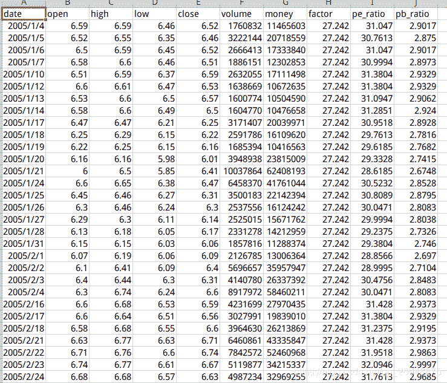
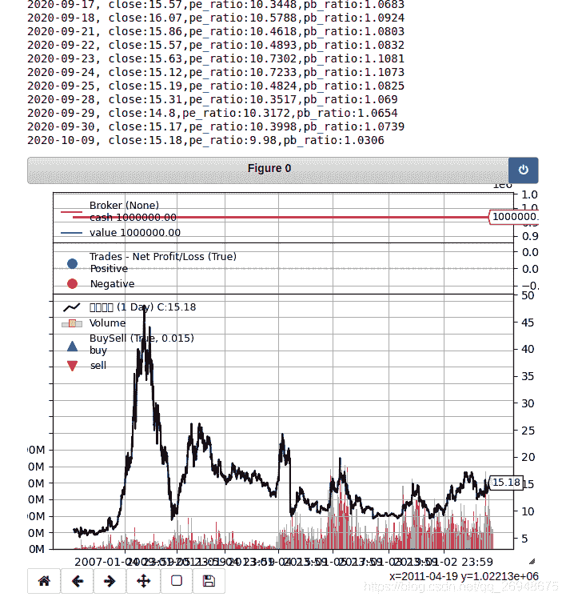
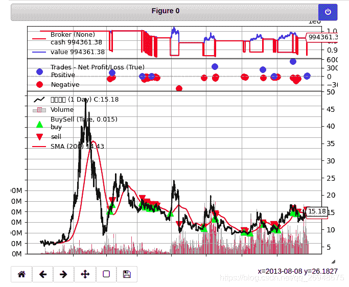

# 10、backtrader 的一些基本概念---feed 讲解(2)---如何增加新的数据及一个基于 pe-pb 的小策略

> 原文：<https://yunjinqi.blog.csdn.net/article/details/108991405>

回测经常会用到高开低收、成交量、持仓量等交易信息，绝大部分的回测平台，都能满足这些基本的需要。但是，当我们想要回测，涉及到其他的信息，如基本面信息 pb,pe,roe 等，使用其他的一些回测平台可能心有余而力不足，backtrader 这个平台，具有很好的扩展性，很容易实现技术面和基本面结合的回测。本讲就和大家分享下，如何实现增加额外的数据用于回测。

在做一件事之前，我们首先要知道，我们想要实现的是什么。假如我们想要增加两个新的信息，如 pe,pb，我们就可以用下面的代码添加：

```py
import backtrader as bt
# 在交易信息之外，额外增加了 PE、PB 指标，做涉及到基本面信息的策略使用
class GenericCSV_PB_PE(bt.feeds.GenericCSVData):

    # 增加两个 line,每个 line 的名称，就是 csv 文件中，额外增加的列的名称
    lines = ('pe_ratio','pb_ratio',)

    # 具体每个新增加的变量 index 是多少，要根据自己的 csv 文件去决定，从 0 开始数
    params = (('pe_ratio',8),('pb_ratio',9),)
# 我们使用的时候，直接用我们新的类读取数据就可以了。

# 在这个小案例中，我使用的数据结构如下，date,open,high,low,close,volume,money,factor,pe_ratio,pb_ratio 
```



接下来，我们就可以用全部的代码，去在策略中，使用 pe_ratio 和 pb_ratio 了，代码如下：

```py
import backtrader as bt
# 在交易信息之外，额外增加了 PE、PB 指标，做涉及到基本面信息的策略使用
class GenericCSV_PB_PE(bt.feeds.GenericCSVData):

    # 增加两个 line,每个 line 的名称，就是 csv 文件中，额外增加的列的名称
    lines = ('pe_ratio','pb_ratio',)

    # 具体每个新增加的变量 index 是多少，要根据自己的 csv 文件去决定，从 0 开始数
    params = (('pe_ratio',8),('pb_ratio',9),)
# 我们使用的时候，直接用我们新的类读取数据就可以了。
class test_pe_strategy(bt.Strategy):

    params = ()

    def log(self, txt, dt=None):
        ''' Logging function fot this strategy'''
        dt = dt or self.datas[0].datetime.date(0)
        print('{}, {}'.format(dt.isoformat(), txt))

    def __init__(self):
        # Keep a reference to the "close" line in the data[0] dataseries
        self.bar_num=0

    def prenext(self):

        pass 

    def next(self):
        # 假设有 100 万资金，每次成份股调整，每个股票使用 1 万元
        self.bar_num+=1
        # 需要调仓的时候
        self.log(f"close:{self.datas[0].close[0]},pe_ratio:{self.datas[0].pe_ratio[0]},pb_ratio:{self.datas[0].pb_ratio[0]}")

# 初始化 cerebro,获得一个实例
cerebro = bt.Cerebro()
# cerebro.broker = bt.brokers.BackBroker(shortcash=True)  # 0.5%
# 读取数据
feed = GenericCSV_PB_PE(dataname = "./平安银行数据.csv",**{"dtformat":"%Y-%m-%d"})# 由于是 date，所以要添加一个参数，使得 backtrader 能够识别的日期和 csv 文件中的日期格式是一样的
# 添加数据到 cerebro
cerebro.adddata(feed, name = "平安银行")
# 添加手续费，按照万分之五收取
cerebro.broker.setcommission(commission=0.0005,stocklike=True)
# 设置初始资金为 100 万
cerebro.broker.setcash(1000000.0)
# 添加策略
cerebro.addstrategy(test_pe_strategy)
# 运行回测
cerebro.run()
# 画图
cerebro.plot() 
```

运行之后，输出结果如下：



在这个扩展的数据中，并没有使用交易逻辑，所以 trades,broker，cash,value 都没有变化。大家可以自行尝试修改下代码，实现买卖，比如，在 pe 小于 10,并且 pb<2，并且价格在 200 日均线之上的时候，买入持有，在其他情况下，空仓。在最后会分享如何做这样一个策略，大家可以先尝试一下。

### 如何下载数据

```py
# 数据是从聚宽上下载的，代码如下：
import pandas as pd
from jqdatasdk import *
auth('xxx','xxx') #账号是申请时所填写的手机号；密码为聚宽官网登录密码，新申请用户默认为手机号后 6 位
data = get_bars("000001.XSHE", 10000, unit='1d',
         fields=['date','open','high','low','close','volume','money','factor'],
         include_now=False, end_dt=None, fq_ref_date=None,df=True)
q = query(
    valuation
).filter(
    valuation.code == '000001.XSHE'
)
df_pe=get_fundamentals_continuously(q, end_date='2020-10-09', count=10000) #修改 end_date 日期为当前
data['pe_ratio']=df_pe['pe_ratio']
data['pb_ratio']=df_pe['pb_ratio']
data['date']=pd.to_datetime(data['date'])
data.to_csv("平安银行数据.csv",index=False) 
```

### 一个小策略

在 pe 小于 10,并且 pb<2，并且价格在 200 日均线之上的时候，买入持有，在其他情况下，空仓。

```py
import backtrader as bt
# 在交易信息之外，额外增加了 PE、PB 指标，做涉及到基本面信息的策略使用
class GenericCSV_PB_PE(bt.feeds.GenericCSVData):

    # 增加两个 line,每个 line 的名称，就是 csv 文件中，额外增加的列的名称
    lines = ('pe_ratio','pb_ratio',)

    # 具体每个新增加的变量 index 是多少，要根据自己的 csv 文件去决定，从 0 开始数
    params = (('pe_ratio',8),('pb_ratio',9),)
# 我们使用的时候，直接用我们新的类读取数据就可以了。
class test_pe_strategy(bt.Strategy):

    params = (('window',200),)

    def log(self, txt, dt=None):
        ''' Logging function fot this strategy'''
        dt = dt or self.datas[0].datetime.date(0)
        print('{}, {}'.format(dt.isoformat(), txt))

    def __init__(self):
        # Keep a reference to the "close" line in the data[0] dataseries
        self.bar_num=0
        self.ma = bt.indicators.SMA(self.data.close,period = self.p.window)

    def prenext(self):

        pass 

    def next(self):
        # 假设有 100 万资金，每次成份股调整，每个股票使用 1 万元
        self.bar_num+=1
        # 需要调仓的时候
        data = self.datas[0]
        pe_ratio = data.pe_ratio[0]
        pb_ratio = data.pb_ratio[0]
        close = data.close[0]
        size = self.getposition(data).size
        ma = self.ma[0]
        # self.log(f"close:{close},pe_ratio:{pe_ratio},pb_ratio:{pb_ratio}")
        if size == 0 and close>ma and pe_ratio<10 and pb_ratio<2:
            self.buy(data,size =1000)
        if size>0 :
            if close<ma or pe_ratio>10 or pb_ratio>2:
                self.close()

# 初始化 cerebro,获得一个实例
cerebro = bt.Cerebro()
# cerebro.broker = bt.brokers.BackBroker(shortcash=True)  # 0.5%
# 读取数据
feed = GenericCSV_PB_PE(dataname = "./平安银行数据.csv",**{"dtformat":"%Y-%m-%d"})
# 添加数据到 cerebro
cerebro.adddata(feed, name = "平安银行")
# 添加手续费，按照万分之五收取
cerebro.broker.setcommission(commission=0.0005,stocklike=True)
# 设置初始资金为 100 万
cerebro.broker.setcash(1000000.0)
# 添加策略
cerebro.addstrategy(test_pe_strategy)
# 运行回测
cerebro.run()
# 画图
cerebro.plot() 
```

