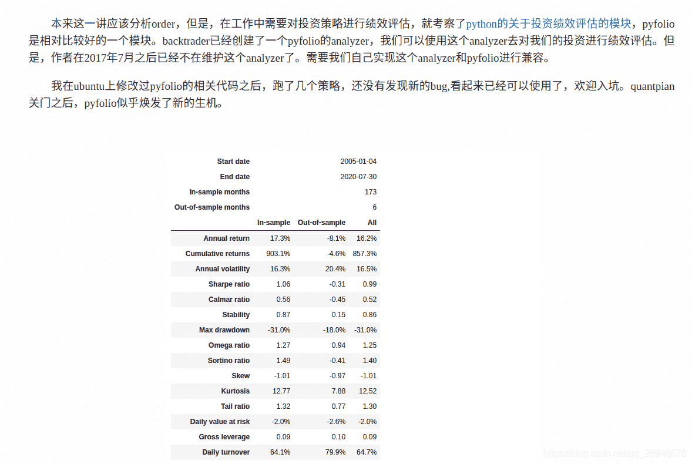
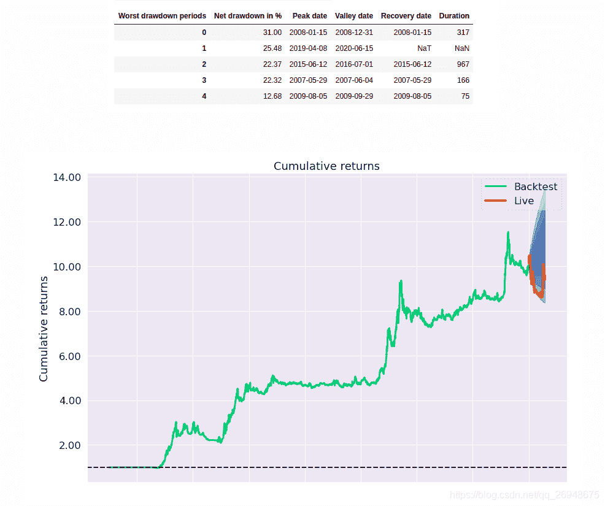
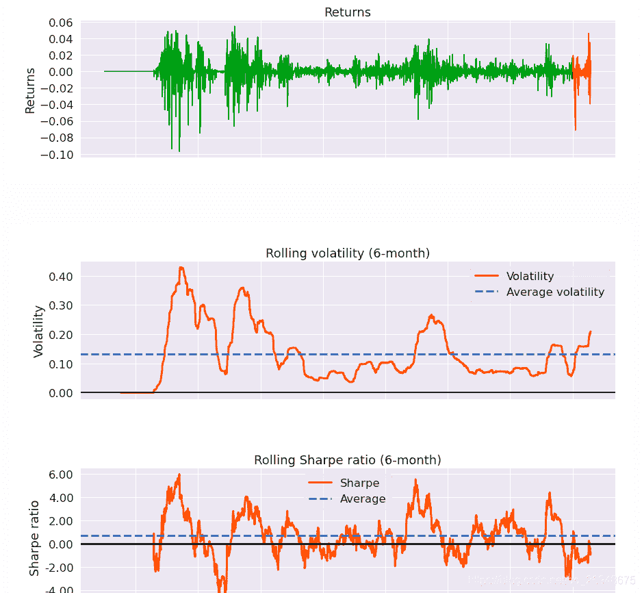
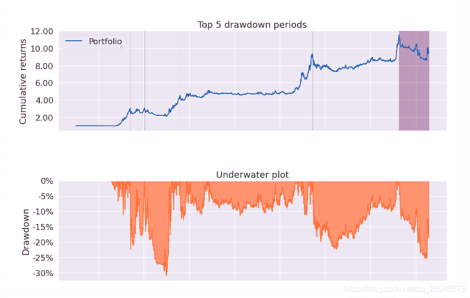
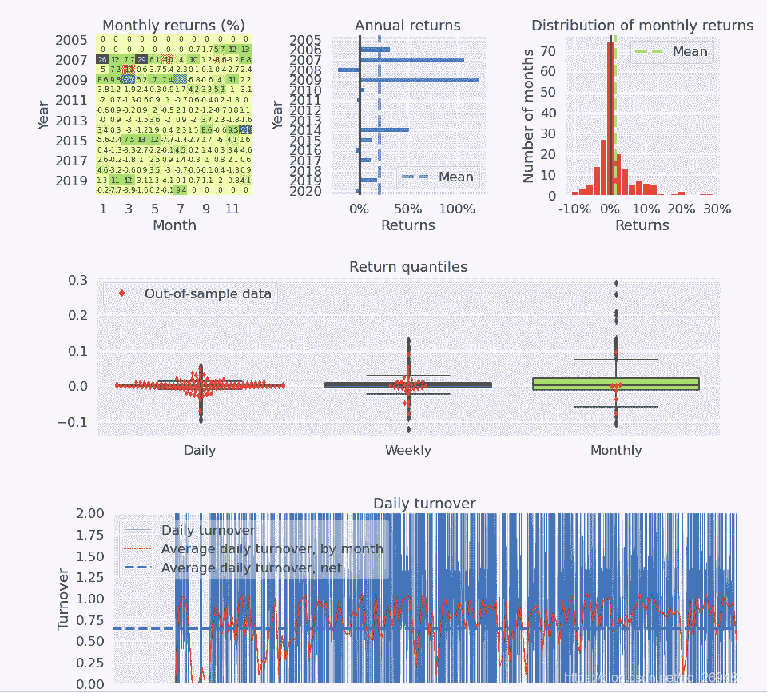
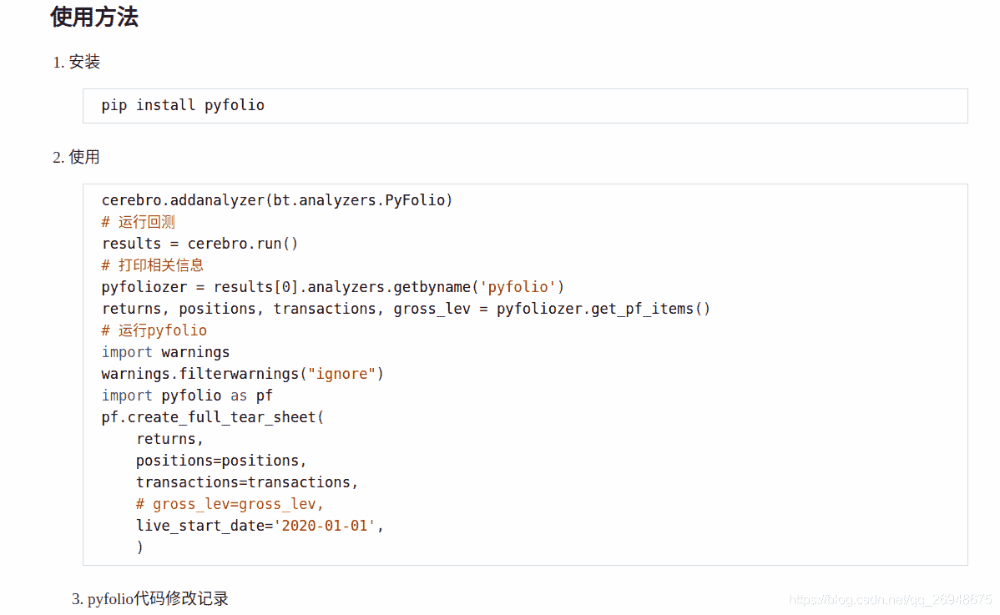
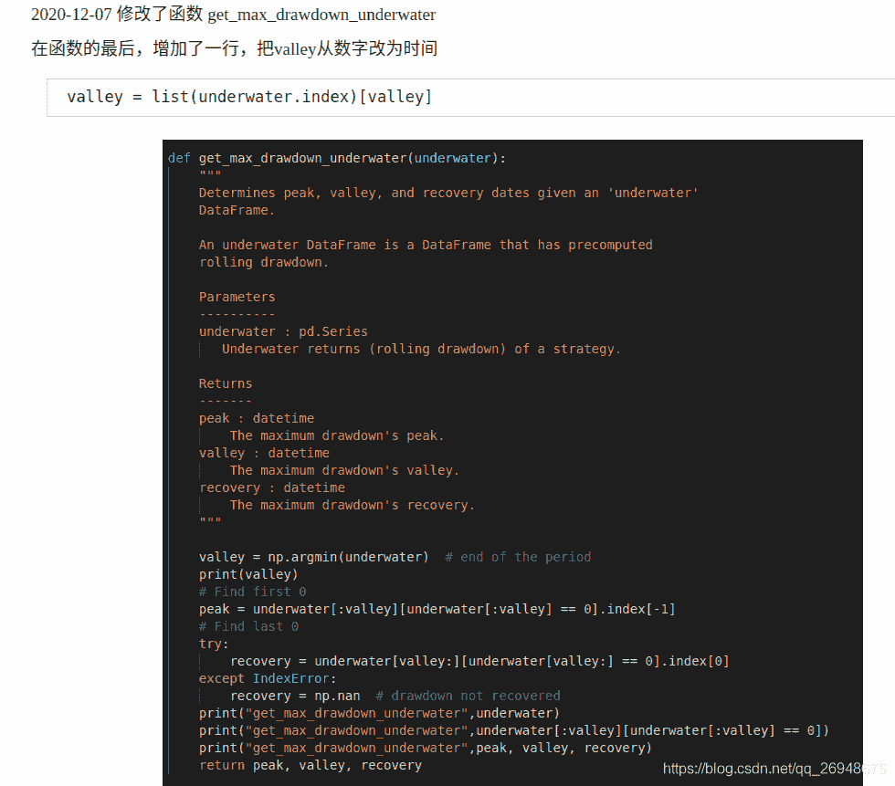
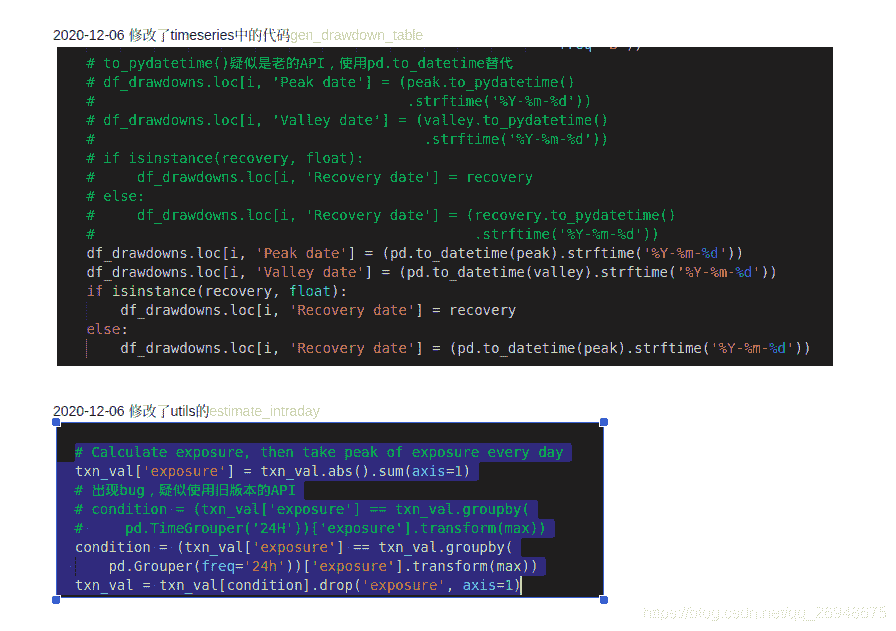
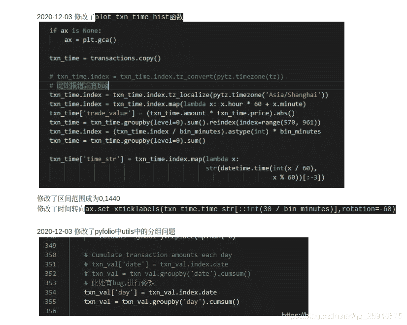

# 17、backtrader 的一些基本概念---如何使用 analyzer 及创建新的 analyzer(4)---策略绩效评价模块 pyfolio 的使用

> 原文：<https://yunjinqi.blog.csdn.net/article/details/110842730>

 这篇文章介绍了 pyfolio 的使用，在后续的测试中，发现了一些新的小问题，进一步修改了 backtrader 的 analyzers 中 pyfolio 的相关代码，使用起来效果越来越好。新的代码的修改，详见知乎专栏[如何用 backtrader 结合 pyfolio 对策略的绩效进行评估？](https://zhuanlan.zhihu.com/p/338161004)，需要在本专栏的这篇文章的基础上去进行修改。

 把改动过后的 pyfolio 上传到码云上了，地址：[https://gitee.com/yunjinqi/backtrader_cn.git](https://gitee.com/yunjinqi/backtrader_cn.git)

