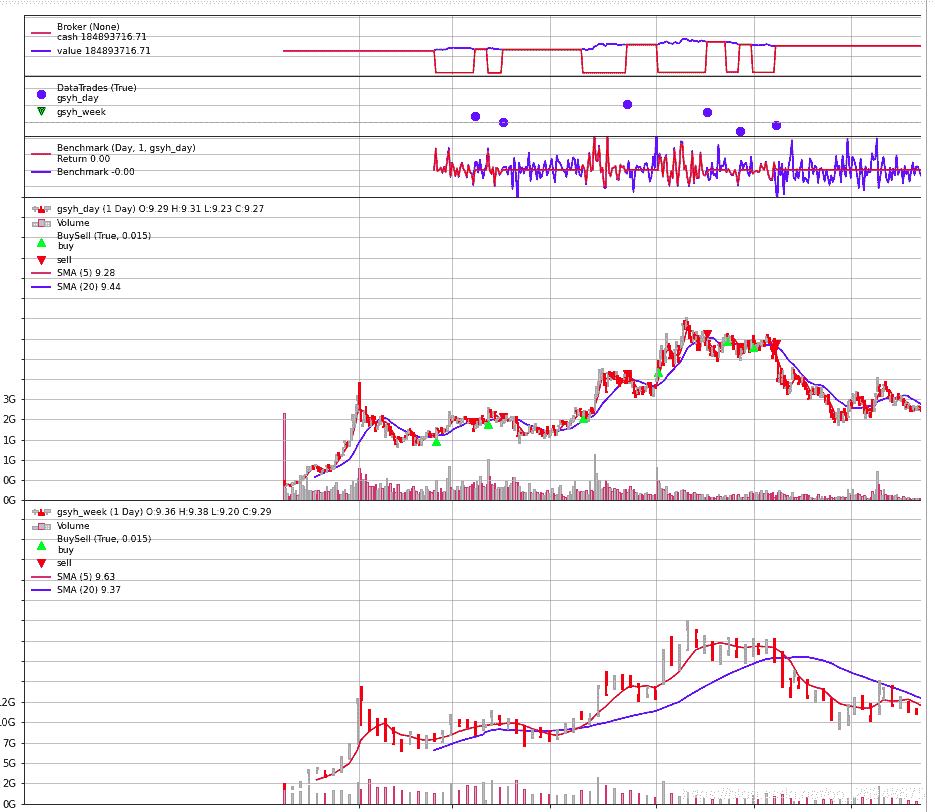

# 52、backtrader 的一些基本概念---如何把策略收益与基准收益做对比？

> 原文：<https://yunjinqi.blog.csdn.net/article/details/115277077>

我们有时候做完了策略之后，并不知道策略的好坏，一个最基本的指标就是和基准进行对比；基准可以是数据本身或者指数数据，如果策略带来的收益率还不如指数本身，那么，这个策略大概就不是很好，还不如买入持有。

在 backtrader 中，有两种方法可以实现策略收益与基准收益的对比，一个是 analyzers，一个是 observers。

#### analyzers 的使用

在使用 analyzers 对比策略收益与基准收益的时候，主要是使用 analyzers 下面的 TimeReturn,主要有两个参数：

*   timeframe,默认是 None,计算的是整个回测期间的；
*   data 默认是 None,计算的是整个组合的；

```py
import backtrader as bt

cerebro = bt.Cerebro()

data = bt.feeds.OneOfTheFeeds(dataname='abcde', ...)
cerebro.adddata(data)
# 获取基准的收益率
cerebro.addanalyzer(bt.analyzers.TimeReturn, timeframe=bt.TimeFrame.Years,
                    data=data, _name='datareturns')
# 获取整个组合的收益率
cerebro.addanalyzer(bt.analyzers.TimeReturn, timeframe=bt.TimeFrame.Years)
                    _name='timereturns')

...  # 增加策略等 ...

results = cerebro.run()
strat0 = results[0]

# 可以通过添加的名字取到具体的指标，可以参考 analyzer 一讲的分析
tret_analyzer = strat0.analyzers.getbyname('timereturns')
print(tret_analyzer.get_analysis())
tdata_analyzer = strat0.analyzers.getbyname('datareturns')
print(tdata_analyzer.get_analysis()) 
```

#### observer 的使用

observer 的使用，本质上和 analyzer 并没有区别，但是 observer 计算的指标能够在策略中进行调用，并且可以直接画图显示出来，所以，比较推荐使用 observers 下面的 TimeReturn.直接举例说明：

[参考 49、【backtrader 股票策略】如何实现跨周期调用技术指标的策略？](https://yunjinqi.blog.csdn.net/article/details/115185899)

```py
# 初始化 cerebro,获得一个实例
cerebro = bt.Cerebro()
# cerebro.broker = bt.brokers.BackBroker(shortcash=True)  # 0.5%
params_day=dict(

    fromdate = datetime.datetime(2005,1,4),
    todate = datetime.datetime(2020,12,31),
    timeframe = bt.TimeFrame.Days,
    dtformat = ("%Y/%m/%d"),
    compression = 1,
    datetime = 0,
    open = 1,
    high = 2,
    low =3,
    close =4,
    volume =5,
    openinterest=-1)

params_week=dict(

    fromdate = datetime.datetime(2005,1,4),
    todate = datetime.datetime(2020,12,31),
    timeframe = bt.TimeFrame.Days,
    dtformat = ("%Y/%m/%d"),
    compression = 1,
    datetime = 0,
    open = 1,
    high = 2,
    low =3,
    close =4,
    volume =5,
    openinterest=-1)

# 加载日数据
feed_day = bt.feeds.GenericCSVData(dataname = "/home/yun/data/stock/splits/gsyh_day.csv",**params_day)
# 添加数据到 cerebro
cerebro.adddata(feed_day, name = 'gsyh_day')
# 加载周数据
feed_week = bt.feeds.GenericCSVData(dataname = "/home/yun/data/stock/splits/gsyh_week.csv",**params_week)
# 添加数据到 cerebro
cerebro.adddata(feed_week, name = 'gsyh_week')

# 添加手续费，按照万分之二收取
cerebro.broker.setcommission(commission=0.0002,stocklike=True)
# 设置初始资金为 1 亿
cerebro.broker.setcash(1_0000_0000)
# 添加策略
cerebro.addstrategy(test_two_ma_strategy)
cerebro.addanalyzer(bt.analyzers.TotalValue, _name='_TotalValue')
cerebro.addanalyzer(bt.analyzers.PyFolio)
# 计算画出来基准的收益率的情况，只需要增加这个 observer 即可
cerebro.addobserver(bt.observers.Benchmark,data=feed_day)
# 运行回测
results = cerebro.run()
# 打印相关信息
pyfoliozer = results[0].analyzers.getbyname('pyfolio')
returns, positions, transactions, gross_lev = pyfoliozer.get_pf_items()
# pf.create_full_tear_sheet(
#    returns,
#    positions=positions,
#    transactions=transactions,
#    # gross_lev=gross_lev,
#    live_start_date='2019-01-01',
#    )
cerebro.plot(style='candlestick') 
```



这个案例中使用的是日数据本身，如果是想要和指数对比，只需要加载指数数据，并使用 observer 即可。

* * *

智慧、心灵、财富，总要有一个在路上，愿我们能在人生的道路上，不断成长、不断成熟～～～

感兴趣可以关注我的专栏：

[my_quant_study_note](https://www.zhihu.com/column/quant-study)：分享一些关于量化投资、量化交易相关的思考

[backtrader 量化投资回测与交易](https://zhuanlan.zhihu.com/c_1189276087837011968)：本专栏免费，分享 backtrader 相关的内容。

[量化投资神器-backtrader 源码解析-从入门到精通：本专栏目前收费 99 元，预计更新 100 篇策略+20 篇 backtrader 讲解+80 篇源代码分析。](https://link.zhihu.com/?target=https%3A//yunjinqi.blog.csdn.net/article/details/107594251)