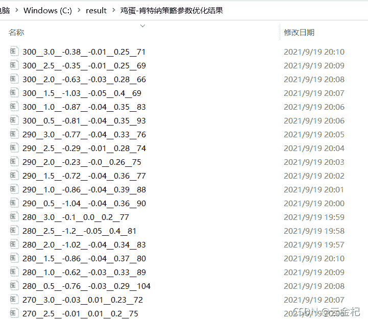

# 66、【backtrader 的一些高级技巧】如何使用 backtrader 进行参数优化

> 原文：<https://yunjinqi.blog.csdn.net/article/details/120400145>

在以前的文章中，也特意强调过了一些关于参数优化的方方面面的知识。这篇文章重新梳理总结以下。

#### 参数选择是一把双刃剑

由于我们交易的每个品种的市场参与者都是不同的，并且每个品种的标的物都有其独特的供需规律，所以，企图用一个参数应用在所有品种上的行为本身就是低效的(低效而非无效)。就跟用一个尺码的衣服，让所有不同体型的人穿一样；但是如果我们给每个体型的人设计不同种类的尺码一样，那么，市场上的尺码又会太多，缺乏普适性了。

参数的选择就是在高普适性与高效率之间进行权衡取舍。

参数优化是参数选择的基础，参数优化的基本功能是对多个维度的参数进行遍历，形成一个个参数组合下的收益率、夏普率、最大回撤、交易次数等信息，以便我们用于参数选择。

#### backtrader 如何做参数优化

实际上，backtrader 自身带了一个用于做参数优化的函数，cerebro.optstrategy()，然而我一般不建议使用这个优化函数，虽然其有一些优点，比如节省每次优化过程中加载数据的时间，使用简单；以前碰到过优化参数的结果和单个运行结果不一样的。

比较建议的进行参数优化的方法是自己写一个多进程来运行，而且还可以自定义输出相应的结果。核心逻辑就是写一个 run 函数，传入这个策略一组参数，输出运行的结果，中间也可以输出 csv 文件等；使用多进程 Pool()运行 run 函数，保存输出的结果。比如，对于上一篇文章：[【backtrader 期货策略】在鸡蛋期货上应用肯特纳通道策略(2021-09-19 更新)](https://yunjinqi.blog.csdn.net/article/details/120386204)中的策略进行了一个参数优化，代码可以参考下节。

#### 一个参数优化的示例

```py
from __future__ import (absolute_import, division, print_function,
                        unicode_literals)
import time,datetime
import os,sys
import pickle 
# import talib
import numpy as np
import pandas as pd
import random
import statsmodels.api as sm
from sklearn import linear_model

import backtrader as bt  # backtrader
from backtrader.comminfo import ComminfoFuturesPercent,ComminfoFuturesFixed # 期货交易的手续费用，按照比例或者按照金额

# from backtrader.plot.plot import run_cerebro_and_plot  # 个人编写，非 backtrader 自带
import pyfolio as pf

# 编写一个新的 macd 的指标，使得和国内的常用 macd 指标接轨
from multiprocessing import Pool
from itertools import product

### 编写相应的策略,每个策略逻辑需要单独编写，回测和实盘直接运行策略类就行

class KeltnerStrategy(bt.Strategy):
    # 策略作者
    author = 'yunjinqi'
    # 策略的参数
    params = (  ("avg_period",100),                  
                ("atr_multi",2),                           
            )
    # log 相应的信息
    def log(self, txt, dt=None):
        ''' Logging function fot this strategy'''
        dt = dt or bt.num2date(self.datas[0].datetime[0])
        print('{}, {}'.format(dt.isoformat(), txt))

    # 初始化策略的数据
    def __init__(self):
        # 基本上常用的部分属性变量
        self.bar_num = 0                 # next 运行了多少个 bar
        self.current_date = None        # 当前交易日
        # 计算 macd 指标
        self.middle_price = (self.datas[0].high+ self.datas[0].low+ self.datas[0].close)/3
        self.middle_line = bt.indicators.SMA(self.middle_price, period = self.p.avg_period)
        self.atr = bt.indicators.AverageTrueRange(self.datas[0],period = self.p.avg_period )
        self.upper_line = self.middle_line+self.atr*self.p.atr_multi
        self.lower_line = self.middle_line-self.atr*self.p.atr_multi
        # 保存现在持仓的合约是哪一个
        self.holding_contract_name = None

    def prenext(self):
        # 由于期货数据有几千个，每个期货交易日期不同，并不会自然进入 next
        # 需要在每个 prenext 中调用 next 函数进行运行
        self.next() 
        # pass 

    # 在 next 中添加相应的策略逻辑
    def next(self):
        # 每次运行一次，bar_num 自然加 1,并更新交易日
        self.current_date = bt.num2date(self.datas[0].datetime[0])
        self.bar_num+=1
        # self.log(f"{self.bar_num},{self.datas[0]._name},{self.broker.getvalue()}")
        # self.log(f"{self.ema_1[0]},{self.ema_2[0]},{self.dif[0]},{self.dea[0]},{self.macd[0]}")
        data = self.datas[0]
        # 开仓，先平后开
        # 平多
        if self.holding_contract_name is not None and self.getpositionbyname(self.holding_contract_name).size>0 and data.close[0]<self.middle_line[0]:
            data = self.getdatabyname(self.holding_contract_name)
            self.close(data)
            self.holding_contract_name = None
        # 平空
        if self.holding_contract_name is not None  and self.getpositionbyname(self.holding_contract_name).size<0 and data.close[0]>self.middle_line[0]:
            data = self.getdatabyname(self.holding_contract_name)
            self.close(data)
            self.holding_contract_name = None

        # 开多
        if self.holding_contract_name is None and data.close[-1]<self.upper_line[-1] and data.close[0]>self.upper_line[0] and self.middle_line[0]>self.middle_line[-1]:
            dominant_contract = self.get_dominant_contract()
            next_data = self.getdatabyname(dominant_contract)
            self.buy(next_data,size=1)
            self.holding_contract_name = dominant_contract

        # 开空
        if self.holding_contract_name is None and data.close[-1]>self.lower_line[-1] and data.close[0]<self.lower_line[0] and self.middle_line[0]<self.middle_line[-1]:
            dominant_contract = self.get_dominant_contract()
            next_data = self.getdatabyname(dominant_contract)
            self.sell(next_data,size=1)
            self.holding_contract_name = dominant_contract

        # 移仓换月
        if self.holding_contract_name is not None:
            dominant_contract = self.get_dominant_contract()
            # 如果出现了新的主力合约，那么就开始换月
            if dominant_contract!=self.holding_contract_name:
                # 下个主力合约
                next_data = self.getdatabyname(dominant_contract)
                # 当前合约持仓大小及数据
                size = self.getpositionbyname(self.holding_contract_name).size # 持仓大小
                data = self.getdatabyname(self.holding_contract_name)
                # 平掉旧的
                self.close(data)
                # 开新的
                if size>0:
                    self.buy(next_data,size=abs(size))
                if size<0:
                    self.sell(next_data,size=abs(size))
                self.holding_contract_name = dominant_contract

    def get_dominant_contract(self):

        # 以持仓量最大的合约作为主力合约,返回数据的名称
        # 可以根据需要，自己定义主力合约怎么计算

        # 获取当前在交易的品种
        target_datas=[]
        for data in self.datas[1:]: 
            try:
                data_date = bt.num2date(data.datetime[0])
                # self.log(f"{data._name},{data_date}")
                if self.current_date==data_date:
                    target_datas.append([data._name,data.openinterest[0]])
            except:
                self.log(f"{data._name}还未上市交易")

        target_datas = sorted(target_datas,key = lambda x:x[1])
        # print(target_datas)
        return target_datas[-1][0]

#     def notify_order(self, order):

#         if order.status in [order.Submitted, order.Accepted]:
#             return

#         if order.status == order.Rejected:
#             self.log(f"Rejected : order_ref:{order.ref}  data_name:{order.p.data._name}")

#         if order.status == order.Margin:
#             self.log(f"Margin : order_ref:{order.ref}  data_name:{order.p.data._name}")

#         if order.status == order.Cancelled:
#             self.log(f"Concelled : order_ref:{order.ref}  data_name:{order.p.data._name}")

#         if order.status == order.Partial:
#             self.log(f"Partial : order_ref:{order.ref}  data_name:{order.p.data._name}")

#         if order.status == order.Completed:
#             if order.isbuy():
#                 self.log(f" BUY : data_name:{order.p.data._name} price : {order.executed.price} , cost : {order.executed.value} , commission : {order.executed.comm}")

#             else:  # Sell
#                 self.log(f" SELL : data_name:{order.p.data._name} price : {order.executed.price} , cost : {order.executed.value} , commission : {order.executed.comm}")

#     def notify_trade(self, trade):
#         # 一个 trade 结束的时候输出信息
#         if trade.isclosed:
#             self.log('closed symbol is : {} , total_profit : {} , net_profit : {}' .format(
#                             trade.getdataname(),trade.pnl, trade.pnlcomm))
#             # self.trade_list.append([self.datas[0].datetime.date(0),trade.getdataname(),trade.pnl,trade.pnlcomm])

#         if trade.isopen:
#             self.log('open symbol is : {} , price : {} ' .format(
#                             trade.getdataname(),trade.price))

    def stop(self):
        # 策略停止的时候输出信息
        # with open("C:/data/filter_data_contract.pkl",'wb') as f:
        #    pickle.dump(self.my_datases,f)
        # df = pd.DataFrame(self.trade_result)
        # df.columns=['datetime','symbol','size','current_price','order_price','pnl','net_profit']
        # df.to_csv("C:/result/test1_trade_history.csv")

        # df1 = pd.DataFrame(self.position_result)
        # df1.columns=['datetime','symbol','size','close']
        # df1.to_csv("c:/result/test1_position_history.csv")

        # df2=pd.DataFrame(self.order_result)
        # df2.columns=["datetime",'symbol','size','0','direction']
        # df2.to_csv("C:/result/test1_order_history.csv")
        pass 

def run(params):
    print(f"开始运行{params}")
    # 准备配置策略
    cerebro = bt.Cerebro()
    # 参数设置
    data_kwargs = dict(
                fromdate = datetime.datetime(2013,11, 18),
                todate = datetime.datetime(2020,12,31),
                timeframe = bt.TimeFrame.Minutes,
                compression = 1,
                dtformat=('%Y-%m-%d %H:%M:%S'), # 日期和时间格式
                tmformat=('%H:%M:%S'), # 时间格式
                datetime=0,
                high=3,
                low=4,
                open=1,
                close=2,
                volume=5,
                openinterest=6)

    data_root = "c:/data/future/15m/jd/"
    # 加载具体的合约数据
    file_list =os.listdir(data_root)
    file_list.remove("JD99.csv")
    # 确保传入的第一个数据是指数数据
    for file in ["JD99.csv"]+file_list:
        name = file[:-4]
        df = pd.read_csv(data_root+file)
        # 只要数据里面的这几列
        df = df[['datetime','open','high','low','close','volume','openinterest']]
        # 修改列的名字
        df.index = pd.to_datetime(df['datetime'])
        # 如果对数据的时间顺序比较确定是从小到大的，可以不用排序，否则最好做下排序
        df = df[['open','high','low','close','volume','openinterest']]
        df = df[(df.index<=data_kwargs['todate'])&(df.index>=data_kwargs['fromdate'])]
        # feed = bt.feeds.GenericCSVData(dataname = data_root+file,**params)
        # print(name,len(df))
        if len(df)==0:
            continue 
        feed = bt.feeds.PandasDirectData(dataname = df)
        cerebro.adddata(feed, name = name)
        # 设置合约的交易信息，佣金设置为 2%%，保证金率为 10%(交易所加期货公司部分，每个人可能不一样)，杠杆按照真实的杠杆来
        comm=ComminfoFuturesPercent(commission=0.0002,margin=0.1, mult=10)
        cerebro.broker.addcommissioninfo(comm, name= name)
    cerebro.broker.setcash(50000.0)

    kwags={"avg_period":params[0],                  
            "atr_multi":params[1] }
    # 添加策略
    cerebro.addstrategy(KeltnerStrategy,**kwags)
    cerebro.addanalyzer(bt.analyzers.TotalValue, _name='my_value')
    cerebro.addanalyzer(bt.analyzers.SharpeRatio, _name='my_sharpe')
    cerebro.addanalyzer(bt.analyzers.Returns, _name='my_returns')
    cerebro.addanalyzer(bt.analyzers.DrawDown, _name='my_drawdown')
    cerebro.addanalyzer(bt.analyzers.TradeAnalyzer, _name='my_trade_analyzer')

    # cerebro.addanalyzer(bt.analyzers.PyFolio)

    # 运行回测
    results = cerebro.run()
    sharpe_ratio = results[0].analyzers.my_sharpe.get_analysis()['sharperatio']
    annual_return = results[0].analyzers.my_returns.get_analysis()['rnorm']
    max_drawdown = results[0].analyzers.my_drawdown.get_analysis()["max"]["drawdown"]/100
    trade_num = results[0].analyzers.my_trade_analyzer.get_analysis()['total']['total']
    value_df = pd.DataFrame([results[0].analyzers.my_value.get_analysis()]).T
    value_df.columns=['value']
    # print(value_df.head())
    file_name = str(params[0])+"__"+str(params[1])+"__"+str(round(sharpe_ratio,2))+"__"+str(round(annual_return,2))+"__"+str(round(max_drawdown,2))+"__"+str(trade_num)
    value_df.to_csv("c:/result/鸡蛋-肯特纳策略参数优化结果/"+file_name+".csv")
    return [params[0],params[1],sharpe_ratio,annual_return,max_drawdown,trade_num]

if __name__=="__main__":
    period_list = range(10,301,10)
    multi_list = [i/2 for i in range(1,7)]
    params_list = product(period_list,multi_list)
    with Pool(3) as p:
        results = p.map(run,params_list)
    df = pd.DataFrame(results,columns=['avg_period','atr_multi',"sharpe_ratio","annual_return","max_drawdown","trade_num"])
    df.to_csv("c:/result/鸡蛋-肯特纳策略参数优化结果.csv") 
```

#### 参数结果



参数优化的结果会保存到在代码中设置好的文件夹中。可以使用一些画图工具，把参数结果图形化，这样比较方便形象的观察策略在不同参数下会有什么样的表现，比如我日常比较常用 plotly 和 dash 进行画图。